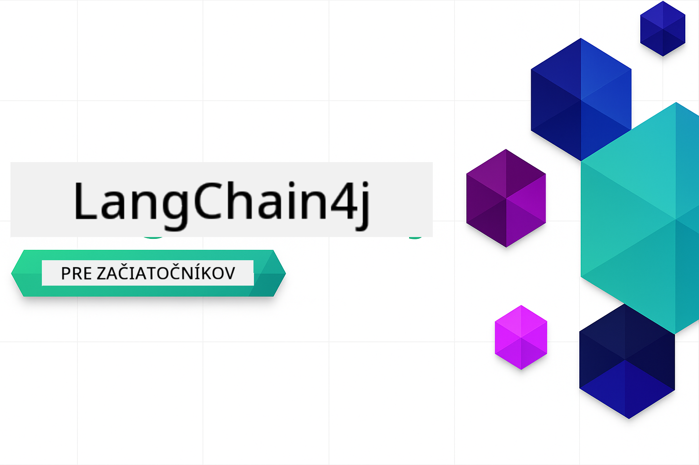

<!--
CO_OP_TRANSLATOR_METADATA:
{
  "original_hash": "d61ab6c245562094cc3dddecf08b50d3",
  "translation_date": "2025-12-31T04:29:16+00:00",
  "source_file": "README.md",
  "language_code": "sk"
}
-->


### 🌐 Podpora viacerých jazykov

#### Podporované cez GitHub Action (automatizované a vždy aktuálne)

<!-- CO-OP TRANSLATOR LANGUAGES TABLE START -->
[Arabčina](../ar/README.md) | [Bengálčina](../bn/README.md) | [Bulharčina](../bg/README.md) | [Barmský (Myanmar)](../my/README.md) | [Čínština (zjednodušená)](../zh/README.md) | [Čínština (tradičná, Hongkong)](../hk/README.md) | [Čínština (tradičná, Macau)](../mo/README.md) | [Čínština (tradičná, Taiwan)](../tw/README.md) | [Chorvátčina](../hr/README.md) | [Čeština](../cs/README.md) | [Dánčina](../da/README.md) | [Holandčina](../nl/README.md) | [Estónčina](../et/README.md) | [Fínčina](../fi/README.md) | [Francúzština](../fr/README.md) | [Nemčina](../de/README.md) | [Gréčtina](../el/README.md) | [Hebrejčina](../he/README.md) | [Hindčina](../hi/README.md) | [Maďarčina](../hu/README.md) | [Indonézčina](../id/README.md) | [Taliančina](../it/README.md) | [Japončina](../ja/README.md) | [Kannadčina](../kn/README.md) | [Kórejčina](../ko/README.md) | [Estónčina](../lt/README.md) | [Malajčina](../ms/README.md) | [Malayalam](../ml/README.md) | [Maráthčina](../mr/README.md) | [Nepálčina](../ne/README.md) | [Nigérijský pidžin](../pcm/README.md) | [Norština](../no/README.md) | [Perzština (Farsi)](../fa/README.md) | [Poľština](../pl/README.md) | [Portugalčina (Brazília)](../br/README.md) | [Portugalčina (Portugalsko)](../pt/README.md) | [Pandžábčina (Gurmukhi)](../pa/README.md) | [Rumunčina](../ro/README.md) | [Ruština](../ru/README.md) | [Srbčina (azbuka)](../sr/README.md) | [Slovenčina](./README.md) | [Slovinčina](../sl/README.md) | [Španielčina](../es/README.md) | [Svahilčina](../sw/README.md) | [Švédčina](../sv/README.md) | [Tagalog (Filipíny)](../tl/README.md) | [Tamilčina](../ta/README.md) | [Telugčina](../te/README.md) | [Thajčina](../th/README.md) | [Turečtina](../tr/README.md) | [Ukrajinčina](../uk/README.md) | [Urdu](../ur/README.md) | [Vietnamčina](../vi/README.md)
<!-- CO-OP TRANSLATOR LANGUAGES TABLE END -->

# LangChain4j pre začiatočníkov

Kurz na vytváranie AI aplikácií s LangChain4j a Azure OpenAI GPT-5, od základného chatu po AI agentov.

**Nový v LangChain4j?** Pozrite si [Glosár](docs/GLOSSARY.md) pre definície kľúčových pojmov a konceptov.

## Table of Contents

1. [Rýchly štart](00-quick-start/README.md) - Začnite s LangChain4j
2. [Úvod](01-introduction/README.md) - Naučte sa základy LangChain4j
3. [Návrh promptov](02-prompt-engineering/README.md) - Ovládnite efektívne navrhovanie promptov
4. [RAG (Retrieval-Augmented Generation)](03-rag/README.md) - Vytvárajte inteligentné systémy založené na znalostiach
5. [Nástroje](04-tools/README.md) - Integrujte externé nástroje a jednoduchých asistentov
6. [MCP (Model Context Protocol)](05-mcp/README.md) - Pracujte s Model Context Protocol (MCP) a agentickými modulmi
---

##  Vzdelávacia cesta

> **Rýchly štart**

1. Forknite tento repozitár do vášho účtu GitHub
2. Kliknite **Code** → **Codespaces** záložka → **...** → **New with options...**
3. Použite predvolené – toto vyberie vývojové prostredie (Development container) vytvorené pre tento kurz
4. Kliknite **Create codespace**
5. Počkajte 5-10 minút, kým bude prostredie pripravené
6. Prejdite priamo na [Rýchly štart](./00-quick-start/README.md) a začnite!

> **Preferujete klonovanie lokálne?**
>
> Tento repozitár obsahuje viac než 50 prekladov do rôznych jazykov, čo výrazne zväčšuje veľkosť stiahnutia. Ak chcete klonovať bez prekladov, použite sparse checkout:
> ```bash
> git clone --filter=blob:none --sparse https://github.com/microsoft/LangChain4j-for-Beginners.git
> cd LangChain4j-for-Beginners
> git sparse-checkout set --no-cone '/*' '!translations' '!translated_images'
> ```
> Toto vám poskytne všetko, čo potrebujete na dokončenie kurzu, s omnoho rýchlejším stiahnutím.

Po dokončení modulov si prezrite [Sprievodcu testovaním](docs/TESTING.md), aby ste videli testovacie koncepty LangChain4j v praxi.

> **Poznámka:** Toto školenie používa ako GitHub Models, tak Azure OpenAI. Moduly [Rýchly štart](00-quick-start/README.md) a [MCP](05-mcp/README.md) používajú GitHub Models (nie je potrebné predplatné Azure), zatiaľ čo moduly 1-4 používajú Azure OpenAI GPT-5.


## Vzdelávanie s GitHub Copilot

Ak chcete rýchlo začať písať kód, otvorte tento projekt v GitHub Codespace alebo vo vašom lokálnom IDE s poskytnutým devcontainerom. Devcontainer použitý v tomto kurze je predkonfigurovaný s GitHub Copilot pre AI párované programovanie.

Každý príklad kódu obsahuje navrhované otázky, ktoré môžete položiť GitHub Copilot, aby ste prehĺbili svoje porozumenie. Hľadajte výzvy označené 💡/🤖 v:

- **Hlavičky Java súborov** - Otázky špecifické pre každý príklad
- **README modulov** - Podnety na skúmanie po príkladoch kódu

**Ako používať:** Otvorte akýkoľvek súbor s kódom a položte Copilot navrhované otázky. Má plný kontext kódbázy a môže vysvetliť, rozšíriť a navrhnúť alternatívy.

Chcete sa dozvedieť viac? Pozrite si [Copilot pre AI párované programovanie](https://aka.ms/GitHubCopilotAI).


## Ďalšie zdroje

<!-- CO-OP TRANSLATOR OTHER COURSES START -->
### LangChain
[](https://aka.ms/langchain4j-for-beginners)
[](https://aka.ms/langchainjs-for-beginners?WT.mc_id=m365-94501-dwahlin)

---

### Azure / Edge / MCP / Agenti
[](https://github.com/microsoft/AZD-for-beginners?WT.mc_id=academic-105485-koreyst)
[](https://github.com/microsoft/edgeai-for-beginners?WT.mc_id=academic-105485-koreyst)
[](https://github.com/microsoft/mcp-for-beginners?WT.mc_id=academic-105485-koreyst)
[](https://github.com/microsoft/ai-agents-for-beginners?WT.mc_id=academic-105485-koreyst)

---
 
### Séria Generatívnej AI
[](https://github.com/microsoft/generative-ai-for-beginners?WT.mc_id=academic-105485-koreyst)
[-9333EA?style=for-the-badge&labelColor=E5E7EB&color=9333EA)](https://github.com/microsoft/Generative-AI-for-beginners-dotnet?WT.mc_id=academic-105485-koreyst)
[-C084FC?style=for-the-badge&labelColor=E5E7EB&color=C084FC)](https://github.com/microsoft/generative-ai-for-beginners-java?WT.mc_id=academic-105485-koreyst)
[-E879F9?style=for-the-badge&labelColor=E5E7EB&color=E879F9)](https://github.com/microsoft/generative-ai-with-javascript?WT.mc_id=academic-105485-koreyst)

---
 
### Základné vzdelávanie
[](https://aka.ms/ml-beginners?WT.mc_id=academic-105485-koreyst)
[](https://aka.ms/datascience-beginners?WT.mc_id=academic-105485-koreyst)
[](https://aka.ms/ai-beginners?WT.mc_id=academic-105485-koreyst)
[](https://github.com/microsoft/Security-101?WT.mc_id=academic-96948-sayoung)
[](https://aka.ms/webdev-beginners?WT.mc_id=academic-105485-koreyst)
[](https://aka.ms/iot-beginners?WT.mc_id=academic-105485-koreyst)
[](https://github.com/microsoft/xr-development-for-beginners?WT.mc_id=academic-105485-koreyst)

---
 
### Séria Copilot
[](https://aka.ms/GitHubCopilotAI?WT.mc_id=academic-105485-koreyst)
[](https://github.com/microsoft/mastering-github-copilot-for-dotnet-csharp-developers?WT.mc_id=academic-105485-koreyst)
[](https://github.com/microsoft/CopilotAdventures?WT.mc_id=academic-105485-koreyst)
<!-- CO-OP TRANSLATOR OTHER COURSES END -->

## Získanie pomoci

Ak sa zaseknete alebo máte otázky ohľadom vytvárania AI aplikácií, pripojte sa:

[](https://aka.ms/foundry/discord)

Ak máte spätnú väzbu k produktu alebo počas vývoja narazíte na chyby, navštívte:

[](https://aka.ms/foundry/forum)

## Licencia

Licencia MIT - Pozrite si súbor [LICENSE](../../LICENSE) pre podrobnosti.

---

<!-- CO-OP TRANSLATOR DISCLAIMER START -->
**Vylúčenie zodpovednosti**:
Tento dokument bol preložený pomocou AI prekladateľskej služby [Co-op Translator](https://github.com/Azure/co-op-translator). Hoci sa snažíme o presnosť, vezmite prosím na vedomie, že automatizované preklady môžu obsahovať chyby alebo nepresnosti. Originálny dokument v jeho pôvodnom jazyku by mal byť považovaný za rozhodujúci zdroj. Pre kritické informácie sa odporúča profesionálny ľudský preklad. Nie sme zodpovední za žiadne nedorozumenia alebo nesprávne výklady vyplývajúce z použitia tohto prekladu.
<!-- CO-OP TRANSLATOR DISCLAIMER END -->