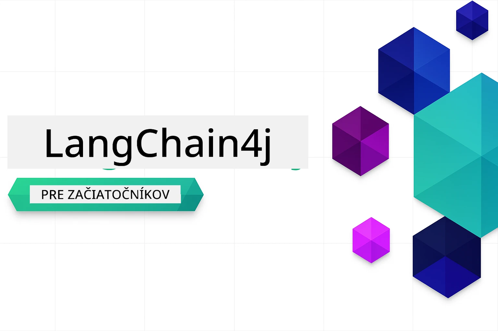

# LangChain4j pre začiatočníkov

Kurz na tvorbu AI aplikácií s LangChain4j a Azure OpenAI GPT-5.2, od základného chatu po AI agentov.

### 🌐 Podpora viacerých jazykov

#### Podporované cez GitHub Action (automatizované a vždy aktuálne)

<!-- CO-OP TRANSLATOR LANGUAGES TABLE START -->
[Arabčina](../ar/README.md) | [Bengálčina](../bn/README.md) | [Bulharčina](../bg/README.md) | [Barmčina (Myanmar)](../my/README.md) | [Čínština (zjednodušená)](../zh-CN/README.md) | [Čínština (tradičná, Hong Kong)](../zh-HK/README.md) | [Čínština (tradičná, Macau)](../zh-MO/README.md) | [Čínština (tradičná, Taiwan)](../zh-TW/README.md) | [Chorvátčina](../hr/README.md) | [Čeština](../cs/README.md) | [Dánčina](../da/README.md) | [Holandčina](../nl/README.md) | [Estónčina](../et/README.md) | [Fínčina](../fi/README.md) | [Francúzština](../fr/README.md) | [Nemčina](../de/README.md) | [Gréčtina](../el/README.md) | [Hebrejčina](../he/README.md) | [Hindčina](../hi/README.md) | [Maďarčina](../hu/README.md) | [Indonézština](../id/README.md) | [Taliančina](../it/README.md) | [Japončina](../ja/README.md) | [Kannadčina](../kn/README.md) | [Khmerčina](../km/README.md) | [Kórejčina](../ko/README.md) | [Litovčina](../lt/README.md) | [Malajčina](../ms/README.md) | [Malayálam](../ml/README.md) | [Maráthčina](../mr/README.md) | [Nepálčina](../ne/README.md) | [Nigérijská pidžinčina](../pcm/README.md) | [Nórčina](../no/README.md) | [Perzština (Farsi)](../fa/README.md) | [Poľština](../pl/README.md) | [Portugalčina (Brazília)](../pt-BR/README.md) | [Portugalčina (Portugalsko)](../pt-PT/README.md) | [Pandžábčina (Gurmukhí)](../pa/README.md) | [Rumunčina](../ro/README.md) | [Ruština](../ru/README.md) | [Srbčina (cyrilika)](../sr/README.md) | [Slovenčina](./README.md) | [Slovinčina](../sl/README.md) | [Španielčina](../es/README.md) | [Svahilčina](../sw/README.md) | [Švédčina](../sv/README.md) | [Tagalog (Filipínčina)](../tl/README.md) | [Tamilčina](../ta/README.md) | [Telugu](../te/README.md) | [Thajčina](../th/README.md) | [Turečtina](../tr/README.md) | [Ukrajinčina](../uk/README.md) | [Urdčina](../ur/README.md) | [Vietnamčina](../vi/README.md)

> **Preferujete klonovanie lokálne?**
>
> Toto úložisko obsahuje viac než 50 jazykových prekladov, čo výrazne zväčšuje veľkosť sťahovania. Na klonovanie bez prekladov použite sparse checkout:
>
> **Bash / macOS / Linux:**
> ```bash
> git clone --filter=blob:none --sparse https://github.com/microsoft/LangChain4j-for-Beginners.git
> cd LangChain4j-for-Beginners
> git sparse-checkout set --no-cone '/*' '!translations' '!translated_images'
> ```
>
> **CMD (Windows):**
> ```cmd
> git clone --filter=blob:none --sparse https://github.com/microsoft/LangChain4j-for-Beginners.git
> cd LangChain4j-for-Beginners
> git sparse-checkout set --no-cone "/*" "!translations" "!translated_images"
> ```
>
> Toto vám poskytne všetko potrebné na dokončenie kurzu s oveľa rýchlejším sťahovaním.
<!-- CO-OP TRANSLATOR LANGUAGES TABLE END -->

## Obsah

1. [Úvod](01-introduction/README.md) - Naučte sa základy LangChain4j
2. [Tvorba promptov](02-prompt-engineering/README.md) - Ovládnite efektívny návrh promptov
3. [RAG (Retrieval-Augmented Generation)](03-rag/README.md) - Vytvorte inteligentné systémy založené na znalostiach
4. [Nástroje](04-tools/README.md) - Integrujte externé nástroje a jednoduchých asistentov
5. [MCP (Model Context Protocol)](05-mcp/README.md) - Pracujte s Model Context Protocol (MCP) a agentnými modulmi

### Video návody

Každý modul má sprievodnú živú reláciu, kde prejdeme koncepty a kód krok za krokom.

| Modul | Video |
|--------|-------|
| 01 - Úvod | [Začnite s LangChain4j](https://www.youtube.com/live/nl_troDm8rQ) |
| 02 - Tvorba promptov | [Tvorba promptov s LangChain4j](https://www.youtube.com/live/PJ6aBaE6bog) |
| 03 - RAG | [RAG s LangChain4j](https://www.youtube.com/watch?v=_olq75ZH_eY) |
| 04 - Nástroje & 05 - MCP | [AI agenti s nástrojmi a MCP](https://www.youtube.com/watch?v=O_J30kZc0rw) |

---

## Učebná cesta

**Nový v LangChain4j?** Pozrite si [Slovník](docs/GLOSSARY.md) pre definície kľúčových pojmov a konceptov.

> **Rýchly štart**

1. Zálohujte si toto úložisko do svojho GitHub účtu
2. Kliknite na **Code** → záložka **Codespaces** → **...** → **Nový s možnosťami...**
3. Použite predvolené nastavenia – vyberie to vývojársky kontajner vytvorený pre tento kurz
4. Kliknite na **Create codespace**
5. Počkajte 5-10 minút, kým bude prostredie pripravené
6. Ihneď prejdite na [Úvod](./01-introduction/README.md) a začnite!

Po dokončení modulov preskúmajte [Sprievodcu testovaním](docs/TESTING.md), kde uvidíte testovacie koncepty LangChain4j v praxi.

> **Poznámka:** Tento tréning používa Azure OpenAI. Začnite s [PLATNÝM Azure účtom zadarmo](https://aka.ms/azure-free-account), ak ešte nemáte.

## Učenie s GitHub Copilot

Na rýchle začatie kódovania otvorte tento projekt v GitHub Codespace alebo vo vašom lokálnom IDE s poskytnutým devcontainerom. Devcontainer použitý v tomto kurze je predkonfigurovaný s GitHub Copilot pre AI párové programovanie.

Každý príklad kódu obsahuje navrhované otázky, ktoré môžete položiť GitHub Copilot, aby ste prehĺbili svoje znalosti. Hľadajte výzvy 💡/🤖 v:

- **Hlavičkách Java súborov** - otázky špecifické pre každý príklad
- **READMEs modulov** - výzvy na skúmanie po príkladoch kódu

**Ako používať:** Otvorte akýkoľvek súbor s kódom a položte Copilotovi navrhované otázky. Má plný kontext zdrojového kódu a môže vysvetliť, rozšíriť a navrhnúť alternatívy.

Chcete sa dozvedieť viac? Pozrite si [Copilot pre AI párové programovanie](https://aka.ms/GitHubCopilotAI).

## Ďalšie zdroje

<!-- CO-OP TRANSLATOR OTHER COURSES START -->
### LangChain
[](https://aka.ms/langchain4j-for-beginners)
[](https://aka.ms/langchainjs-for-beginners?WT.mc_id=m365-94501-dwahlin)
[](https://github.com/microsoft/langchain-for-beginners?WT.mc_id=m365-94501-dwahlin)
---

### Azure / Edge / MCP / Agent
[](https://github.com/microsoft/AZD-for-beginners?WT.mc_id=academic-105485-koreyst)
[](https://github.com/microsoft/edgeai-for-beginners?WT.mc_id=academic-105485-koreyst)
[](https://github.com/microsoft/mcp-for-beginners?WT.mc_id=academic-105485-koreyst)
[](https://github.com/microsoft/ai-agents-for-beginners?WT.mc_id=academic-105485-koreyst)

---
 
### Séria Generatívnej AI
[](https://github.com/microsoft/generative-ai-for-beginners?WT.mc_id=academic-105485-koreyst)
[-9333EA?style=for-the-badge&labelColor=E5E7EB&color=9333EA)](https://github.com/microsoft/Generative-AI-for-beginners-dotnet?WT.mc_id=academic-105485-koreyst)
[-C084FC?style=for-the-badge&labelColor=E5E7EB&color=C084FC)](https://github.com/microsoft/generative-ai-for-beginners-java?WT.mc_id=academic-105485-koreyst)
[-E879F9?style=for-the-badge&labelColor=E5E7EB&color=E879F9)](https://github.com/microsoft/generative-ai-with-javascript?WT.mc_id=academic-105485-koreyst)

---
 
### Základy učenia
[](https://aka.ms/ml-beginners?WT.mc_id=academic-105485-koreyst)
[](https://aka.ms/datascience-beginners?WT.mc_id=academic-105485-koreyst)
[](https://aka.ms/ai-beginners?WT.mc_id=academic-105485-koreyst)
[](https://github.com/microsoft/Security-101?WT.mc_id=academic-96948-sayoung)
[](https://aka.ms/webdev-beginners?WT.mc_id=academic-105485-koreyst)
[](https://aka.ms/iot-beginners?WT.mc_id=academic-105485-koreyst)
[](https://github.com/microsoft/xr-development-for-beginners?WT.mc_id=academic-105485-koreyst)

---
 
### Séria Copilot
[](https://aka.ms/GitHubCopilotAI?WT.mc_id=academic-105485-koreyst)
[](https://github.com/microsoft/mastering-github-copilot-for-dotnet-csharp-developers?WT.mc_id=academic-105485-koreyst)
[](https://github.com/microsoft/CopilotAdventures?WT.mc_id=academic-105485-koreyst)
<!-- CO-OP TRANSLATOR OTHER COURSES END -->

## Získanie pomoci

Ak sa zaseknete alebo máte otázky ohľadom tvorby AI aplikácií, pripojte sa:

[](https://aka.ms/foundry/discord)

Ak máte spätnú väzbu na produkt alebo pri tvorbe narazíte na chyby, navštívte:

[](https://aka.ms/foundry/forum)

## Licencia

MIT licencia - Podrobnosti nájdete v súbore [LICENSE](../../LICENSE).

---

<!-- CO-OP TRANSLATOR DISCLAIMER START -->
**Vyhlásenie o zodpovednosti**:
Tento dokument bol preložený pomocou AI prekladateľskej služby [Co-op Translator](https://github.com/Azure/co-op-translator). Hoci sa snažíme o presnosť, vezmite prosím na vedomie, že automatické preklady môžu obsahovať chyby alebo nepresnosti. Pôvodný dokument v jeho natívnom jazyku by mal byť považovaný za autoritatívny zdroj. Pre kritické informácie sa odporúča profesionálny ľudský preklad. Nie sme zodpovední za žiadne nedorozumenia alebo nesprávne interpretácie vyplývajúce z použitia tohto prekladu.
<!-- CO-OP TRANSLATOR DISCLAIMER END -->