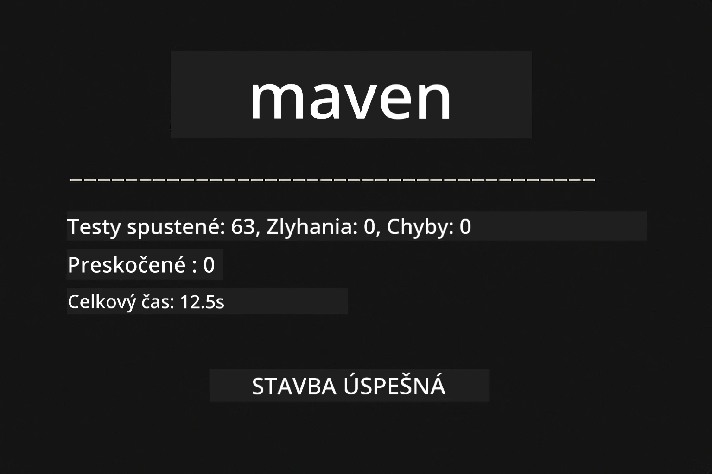
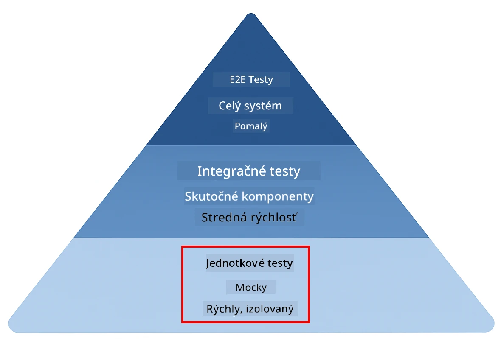
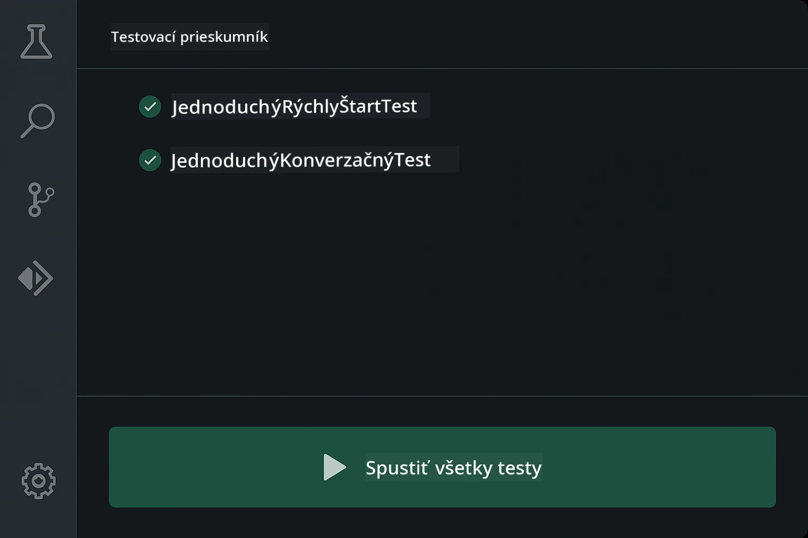
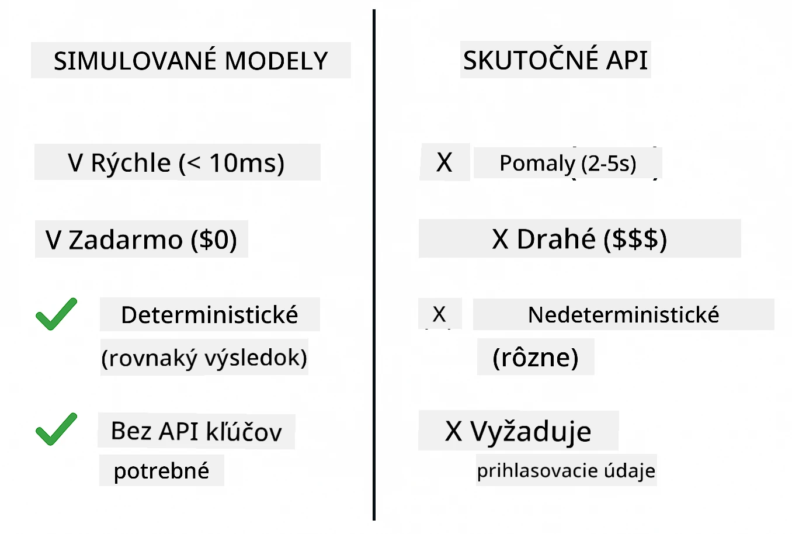
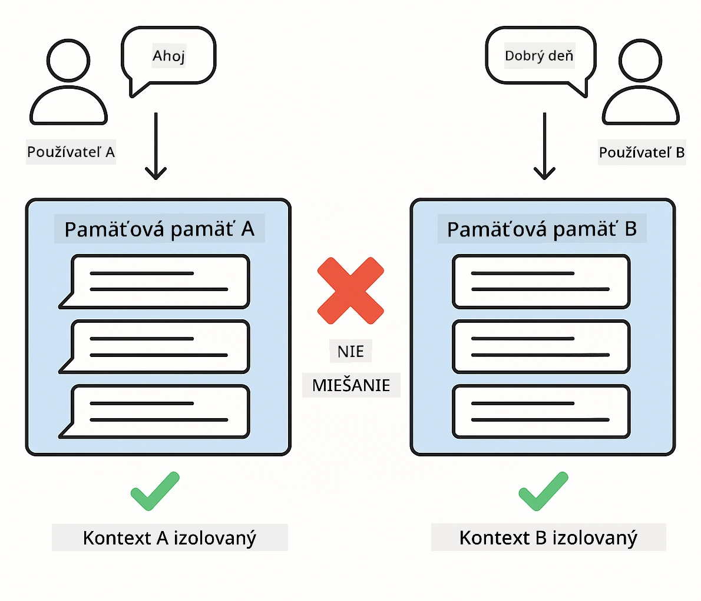
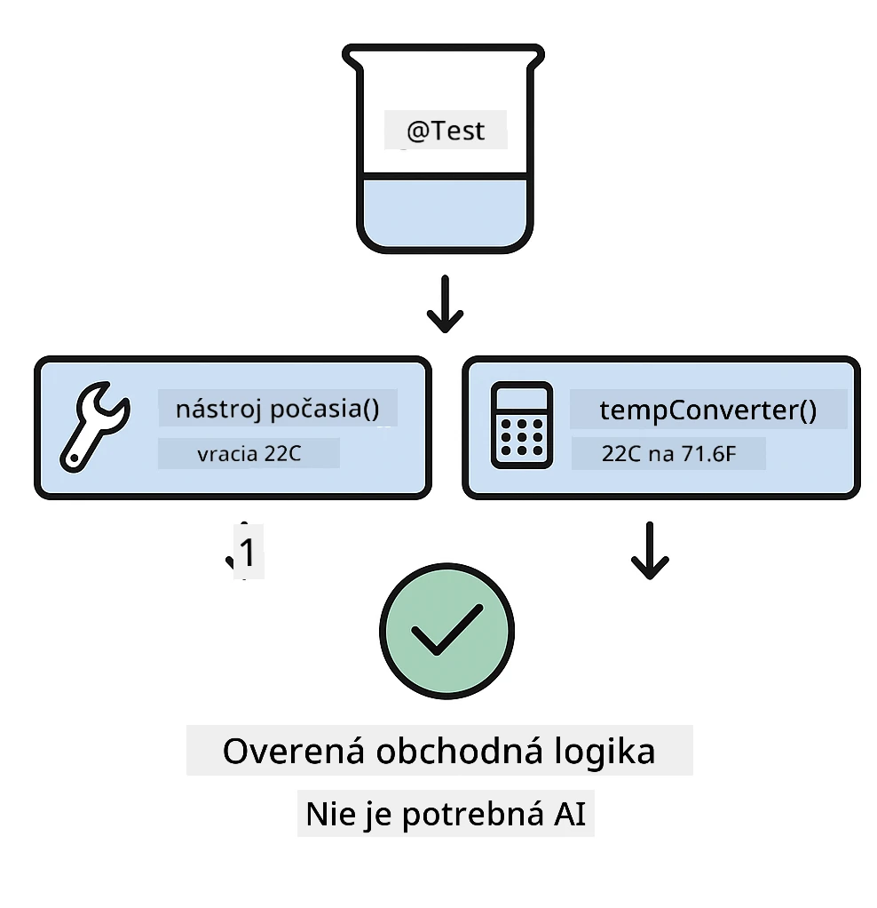
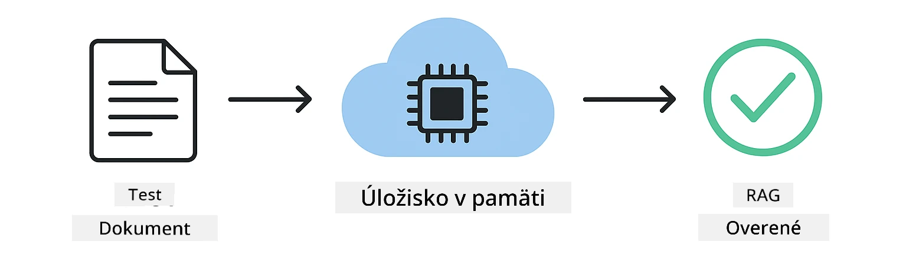

<!--
CO_OP_TRANSLATOR_METADATA:
{
  "original_hash": "ed93b3c14d58734ac10162967da958c1",
  "translation_date": "2025-12-31T04:41:27+00:00",
  "source_file": "docs/TESTING.md",
  "language_code": "sk"
}
-->
# Testovanie aplikácií LangChain4j

## Obsah

- [Rýchly štart](../../../docs)
- [Čo testy pokrývajú](../../../docs)
- [Spúšťanie testov](../../../docs)
- [Spúšťanie testov vo VS Code](../../../docs)
- [Testovacie vzory](../../../docs)
- [Filozofia testovania](../../../docs)
- [Ďalšie kroky](../../../docs)

Tento sprievodca vás prevedie testami, ktoré ukazujú, ako testovať AI aplikácie bez potreby API kľúčov alebo externých služieb.

## Rýchly štart

Spustite všetky testy jediným príkazom:

**Bash:**
```bash
mvn test
```

**PowerShell:**
```powershell
mvn --% test
```



*Úspešné spustenie testov ukazujúce, že všetky testy prešli bez zlyhaní*

## Čo testy pokrývajú

Tento kurz sa zameriava na **jednotkové testy**, ktoré bežia lokálne. Každý test demonštruje konkrétny koncept LangChain4j v izolácii.



*Testovacia pyramída znázorňujúca pomer medzi jednotkovými testami (rýchle, izolované), integračnými testami (skutočné komponenty) a end-to-end testami. Tento kurz pokrýva jednotkové testovanie.*

| Modul | Testy | Zameranie | Kľúčové súbory |
|--------|-------|-------|-----------|
| **00 - Rýchly štart** | 6 | Šablóny promptov a náhrada premenných | `SimpleQuickStartTest.java` |
| **01 - Úvod** | 8 | Pamäť konverzácie a stavový chat | `SimpleConversationTest.java` |
| **02 - Prompt Engineering** | 12 | Vzorce GPT-5, úrovne ochoty, štruktúrovaný výstup | `SimpleGpt5PromptTest.java` |
| **03 - RAG** | 10 | Ingestovanie dokumentov, embeddingy, vyhľadávanie podobnosti | `DocumentServiceTest.java` |
| **04 - Nástroje** | 12 | Volanie funkcií a reťazenie nástrojov | `SimpleToolsTest.java` |
| **05 - MCP** | 8 | Model Context Protocol so stdio transportom | `SimpleMcpTest.java` |

## Spúšťanie testov

**Spustiť všetky testy z koreňového adresára:**

**Bash:**
```bash
mvn test
```

**PowerShell:**
```powershell
mvn --% test
```

**Spustiť testy pre konkrétny modul:**

**Bash:**
```bash
cd 01-introduction && mvn test
# Alebo ako root
mvn test -pl 01-introduction
```

**PowerShell:**
```powershell
cd 01-introduction; mvn --% test
# Alebo z koreňa
mvn --% test -pl 01-introduction
```

**Spustiť jednu triedu testov:**

**Bash:**
```bash
mvn test -Dtest=SimpleConversationTest
```

**PowerShell:**
```powershell
mvn --% test -Dtest=SimpleConversationTest
```

**Spustiť konkrétnu testovaciu metódu:**

**Bash:**
```bash
mvn test -Dtest=SimpleConversationTest#mal by uchovávať históriu konverzácií
```

**PowerShell:**
```powershell
mvn --% test -Dtest=SimpleConversationTest#mal by uchovávať históriu konverzácie
```

## Spúšťanie testov vo VS Code

Ak používate Visual Studio Code, Test Explorer poskytuje grafické rozhranie na spúšťanie a ladenie testov.



*Prieskumník testov vo VS Code zobrazujúci strom testov so všetkými Java testovacími triedami a jednotlivými testovacími metódami*

**Spustenie testov vo VS Code:**

1. Otvorte Test Explorer kliknutím na ikonu skúmavky v Activity Bar
2. Rozbaľte strom testov, aby ste videli všetky moduly a triedy testov
3. Kliknite na tlačidlo play vedľa ktoréhokoľvek testu, aby ste ho spustili jednotlivo
4. Kliknite na „Run All Tests“, aby ste spustili celú sadu testov
5. Pravým tlačidlom myši kliknite na ktorýkoľvek test a vyberte „Debug Test“, aby ste nastavili breakpointy a krokovali kódom

Test Explorer zobrazuje zelené značky zaškrtnutia pre prechádzajúce testy a poskytuje podrobné chybové správy pri zlyhaní testov.

## Testovacie vzory

### Vzor 1: Testovanie šablón promptov

Najjednoduchší vzor testuje šablóny promptov bez volania akéhokoľvek AI modelu. Overíte, že náhrada premenných funguje správne a že sú prompty formátované očakávane.


*Testovanie šablón promptov znázorňujúce tok náhrady premenných: šablóna s zástupnými znakmi → aplikované hodnoty → overený formátovaný výstup*

```java
@Test
@DisplayName("Should format prompt template with variables")
void testPromptTemplateFormatting() {
    PromptTemplate template = PromptTemplate.from(
        "Best time to visit {{destination}} for {{activity}}?"
    );
    
    Prompt prompt = template.apply(Map.of(
        "destination", "Paris",
        "activity", "sightseeing"
    ));
    
    assertThat(prompt.text()).isEqualTo("Best time to visit Paris for sightseeing?");
}
```

Tento test sa nachádza v `00-quick-start/src/test/java/com/example/langchain4j/quickstart/SimpleQuickStartTest.java`.

**Spustiť ho:**

**Bash:**
```bash
cd 00-quick-start && mvn test -Dtest=SimpleQuickStartTest#testovanie formátovania šablóny výzvy
```

**PowerShell:**
```powershell
cd 00-quick-start; mvn --% test -Dtest=SimpleQuickStartTest#testovanie formátovania šablóny promptu
```

### Vzor 2: Mockovanie jazykových modelov

Pri testovaní logiky konverzácie použite Mockito na vytvorenie falošných modelov, ktoré vracajú predurčené odpovede. To robí testy rýchlymi, bezplatnými a deterministickými.



*Porovnanie ukazujúce, prečo sú mocky preferované pri testovaní: sú rýchle, bezplatné, deterministické a nevyžadujú API kľúče*

```java
@ExtendWith(MockitoExtension.class)
class SimpleConversationTest {
    
    private ConversationService conversationService;
    
    @Mock
    private OpenAiOfficialChatModel mockChatModel;
    
    @BeforeEach
    void setUp() {
        ChatResponse mockResponse = ChatResponse.builder()
            .aiMessage(AiMessage.from("This is a test response"))
            .build();
        when(mockChatModel.chat(anyList())).thenReturn(mockResponse);
        
        conversationService = new ConversationService(mockChatModel);
    }
    
    @Test
    void shouldMaintainConversationHistory() {
        String conversationId = conversationService.startConversation();
        
        ChatResponse mockResponse1 = ChatResponse.builder()
            .aiMessage(AiMessage.from("Response 1"))
            .build();
        ChatResponse mockResponse2 = ChatResponse.builder()
            .aiMessage(AiMessage.from("Response 2"))
            .build();
        ChatResponse mockResponse3 = ChatResponse.builder()
            .aiMessage(AiMessage.from("Response 3"))
            .build();
        
        when(mockChatModel.chat(anyList()))
            .thenReturn(mockResponse1)
            .thenReturn(mockResponse2)
            .thenReturn(mockResponse3);

        conversationService.chat(conversationId, "First message");
        conversationService.chat(conversationId, "Second message");
        conversationService.chat(conversationId, "Third message");

        List<ChatMessage> history = conversationService.getHistory(conversationId);
        assertThat(history).hasSize(6); // 3 správy používateľa + 3 správy AI
    }
}
```

Tento vzor sa objavuje v `01-introduction/src/test/java/com/example/langchain4j/service/SimpleConversationTest.java`. Mock zabezpečuje konzistentné správanie, takže môžete overiť správu pamäte.

### Vzor 3: Testovanie izolácie konverzácií

Pamäť konverzácie musí udržiavať viacerých používateľov oddelených. Tento test overuje, že sa kontexty nekombinujú.



*Testovanie izolácie konverzácií ukazujúce samostatné úložiská pamäte pre rôznych používateľov, aby sa zabránilo miešaniu kontextov*

```java
@Test
void shouldIsolateConversationsByid() {
    String conv1 = conversationService.startConversation();
    String conv2 = conversationService.startConversation();
    
    ChatResponse mockResponse = ChatResponse.builder()
        .aiMessage(AiMessage.from("Response"))
        .build();
    when(mockChatModel.chat(anyList())).thenReturn(mockResponse);

    conversationService.chat(conv1, "Message for conversation 1");
    conversationService.chat(conv2, "Message for conversation 2");

    List<ChatMessage> history1 = conversationService.getHistory(conv1);
    List<ChatMessage> history2 = conversationService.getHistory(conv2);
    
    assertThat(history1).hasSize(2);
    assertThat(history2).hasSize(2);
}
```

Každá konverzácia si udržiava vlastnú nezávislú históriu. V produkčných systémoch je táto izolácia kritická pre viacpoužívateľské aplikácie.

### Vzor 4: Testovanie nástrojov samostatne

Nástroje sú funkcie, ktoré môže AI volať. Testujte ich priamo, aby ste zabezpečili, že fungujú správne bez ohľadu na rozhodnutia AI.



*Testovanie nástrojov samostatne ukazujúce vykonávanie mock nástrojov bez volania AI na overenie obchodnej logiky*

```java
@Test
void shouldConvertCelsiusToFahrenheit() {
    TemperatureTool tempTool = new TemperatureTool();
    String result = tempTool.celsiusToFahrenheit(25.0);
    assertThat(result).containsPattern("77[.,]0°F");
}

@Test
void shouldDemonstrateToolChaining() {
    WeatherTool weatherTool = new WeatherTool();
    TemperatureTool tempTool = new TemperatureTool();

    String weatherResult = weatherTool.getCurrentWeather("Seattle");
    assertThat(weatherResult).containsPattern("\\d+°C");

    String conversionResult = tempTool.celsiusToFahrenheit(22.0);
    assertThat(conversionResult).containsPattern("71[.,]6°F");
}
```

Tieto testy z `04-tools/src/test/java/com/example/langchain4j/agents/tools/SimpleToolsTest.java` overujú logiku nástrojov bez zapojenia AI. Príklad reťazenia ukazuje, ako výstup jedného nástroja slúži ako vstup do ďalšieho.

### Vzor 5: Testovanie RAG v pamäti

RAG systémy tradične vyžadujú vektorové databázy a embedding služby. Vzor s pamäťou v RAM vám umožní otestovať celý pipeline bez externých závislostí.



*Pracovný postup testovania RAG v pamäti ukazujúci parsovanie dokumentov, ukladanie embeddingov a vyhľadávanie podobnosti bez potreby databázy*

```java
@Test
void testProcessTextDocument() {
    String content = "This is a test document.\nIt has multiple lines.";
    InputStream inputStream = new ByteArrayInputStream(content.getBytes(StandardCharsets.UTF_8));
    
    DocumentService.ProcessedDocument result = 
        documentService.processDocument(inputStream, "test.txt");

    assertNotNull(result);
    assertTrue(result.segments().size() > 0);
    assertEquals("test.txt", result.segments().get(0).metadata().getString("filename"));
}
```

Tento test z `03-rag/src/test/java/com/example/langchain4j/rag/service/DocumentServiceTest.java` vytvorí dokument v pamäti a overí jeho delenie na časti a manipuláciu s metadátami.

### Vzor 6: Integračné testovanie MCP

Modul MCP testuje integráciu Model Context Protocol pomocou stdio transportu. Tieto testy overujú, že vaša aplikácia dokáže spúšťať a komunikovať so MCP servermi ako podprocesmi.

Testy v `05-mcp/src/test/java/com/example/langchain4j/mcp/SimpleMcpTest.java` overujú správanie MCP klienta.

**Spustite ich:**

**Bash:**
```bash
cd 05-mcp && mvn test
```

**PowerShell:**
```powershell
cd 05-mcp; mvn --% test
```

## Filozofia testovania

Testujte svoj kód, nie AI. Vaše testy by mali overovať kód, ktorý píšete, kontrolou toho, ako sú prompty konštruované, ako sa spravuje pamäť a ako sa vykonávajú nástroje. Odpovede AI sa menia a nemali by byť súčasťou testovacích asercí. Pýtajte sa sami seba, či vaša šablóna promptu správne nahrádza premenné, nie či AI dáva správnu odpoveď.

Používajte mocky pre jazykové modely. Sú to externé závislosti, ktoré sú pomalé, drahé a nedeterministické. Mockovanie robí testy rýchlymi (v milisekundách namiesto sekúnd), bezplatnými (bez nákladov na API) a deterministickými (rovnaký výsledok zakaždým).

Udržiavajte testy nezávislé. Každý test by mal nastaviť svoje vlastné dáta, nespoliehať sa na iné testy a upratať po sebe. Testy by mali prejsť bez ohľadu na poradie spúšťania.

Testujte okrajové prípady mimo šťastnej cesty. Vyskúšajte prázdne vstupy, veľmi veľké vstupy, špeciálne znaky, neplatné parametre a hraničné podmienky. Tie často odhalia chyby, ktoré bežné používanie neodhalí.

Používajte popisné názvy. Porovnajte `shouldMaintainConversationHistoryAcrossMultipleMessages()` s `test1()`. Prvý presne hovorí, čo sa testuje, čo veľmi uľahčí ladenie pri zlyhaní.

## Ďalšie kroky

Teraz, keď rozumiete testovacím vzorom, ponorte sa hlbšie do každého modulu:

- **[00 - Rýchly štart](../00-quick-start/README.md)** - Začnite so základmi šablón promptov
- **[01 - Úvod](../01-introduction/README.md)** - Naučte sa spravovať pamäť konverzácií
- **[02 - Prompt Engineering](../02-prompt-engineering/README.md)** - Ovládnite vzorce promptovania GPT-5
- **[03 - RAG](../03-rag/README.md)** - Budujte systémy retrieval-augmented generation
- **[04 - Nástroje](../04-tools/README.md)** - Implementujte volanie funkcií a reťazenie nástrojov
- **[05 - MCP](../05-mcp/README.md)** - Integrujte Model Context Protocol

README každého modulu poskytuje podrobné vysvetlenia konceptov testovaných tu.

---

**Navigácia:** [← Späť na hlavnú stránku](../README.md)

---

<!-- CO-OP TRANSLATOR DISCLAIMER START -->
**Vyhlásenie o vylúčení zodpovednosti**:
Tento dokument bol preložený pomocou služby automatického prekladu na báze umelej inteligencie [Co-op Translator](https://github.com/Azure/co-op-translator). Aj keď sa usilujeme o presnosť, berte prosím na vedomie, že automatické preklady môžu obsahovať chyby alebo nepresnosti. Originálny dokument v jeho pôvodnom jazyku by mal byť považovaný za autoritatívny zdroj. Pre dôležité informácie sa odporúča profesionálny ľudský preklad. Nezodpovedáme za žiadne nedorozumenia alebo nesprávne výklady vzniknuté v dôsledku použitia tohto prekladu.
<!-- CO-OP TRANSLATOR DISCLAIMER END -->