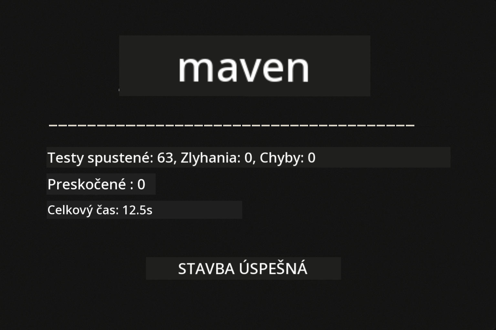
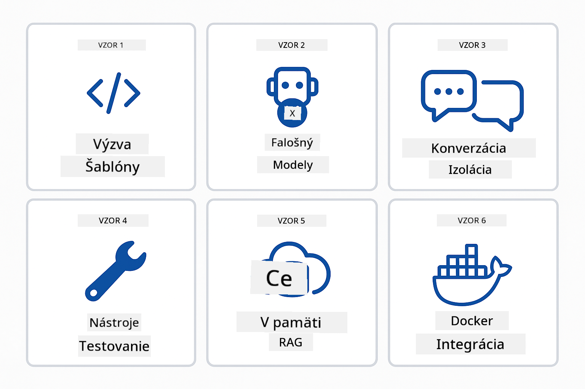
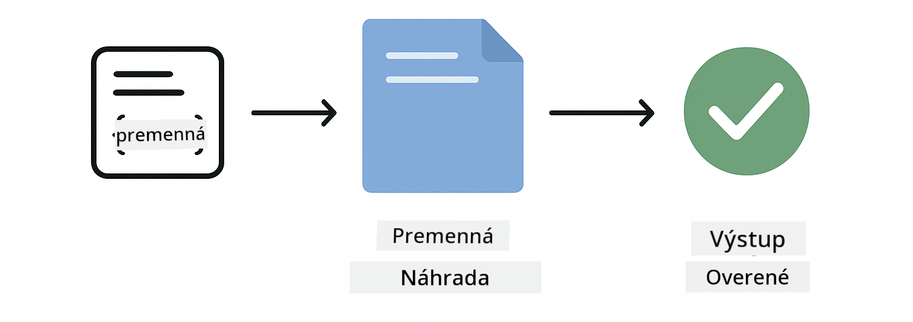
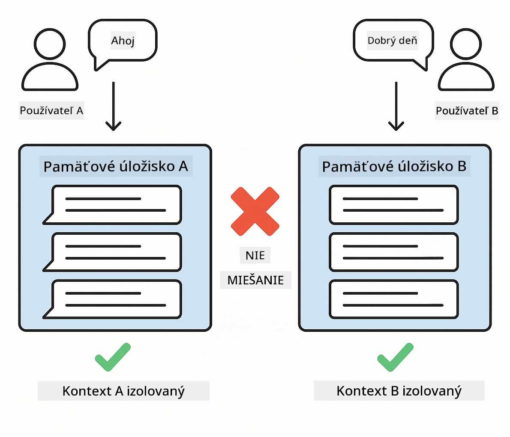
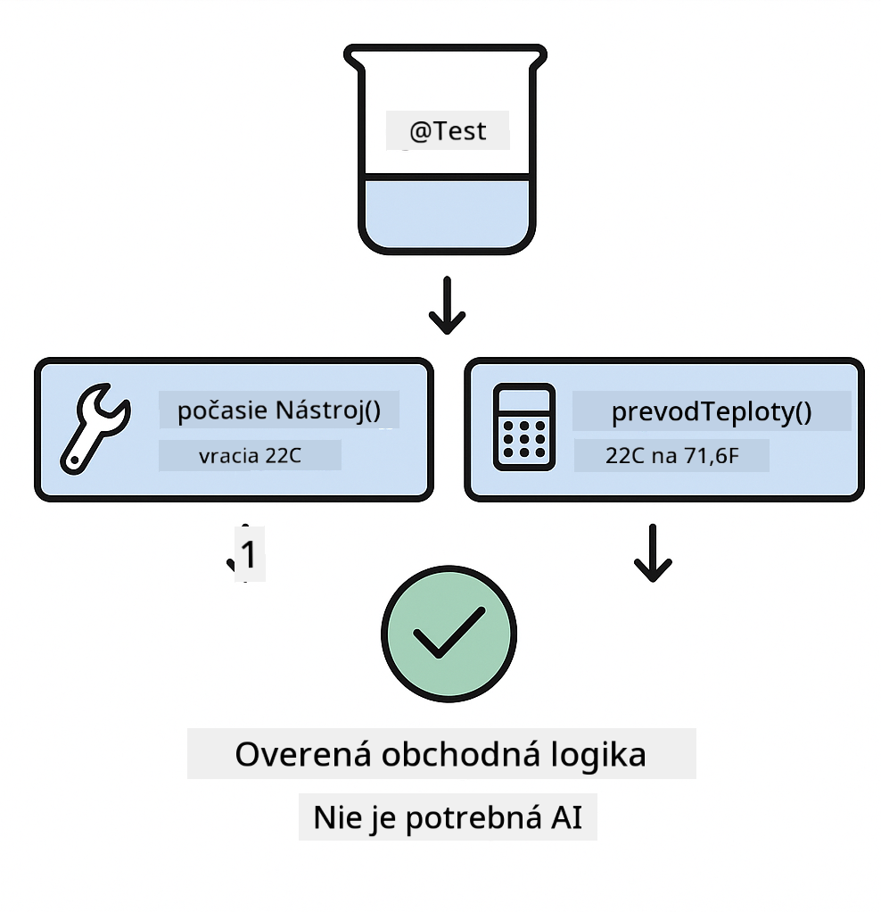

<!--
CO_OP_TRANSLATOR_METADATA:
{
  "original_hash": "b975537560c404d5f254331832811e78",
  "translation_date": "2025-12-13T21:21:35+00:00",
  "source_file": "docs/TESTING.md",
  "language_code": "sk"
}
-->
# Testovanie aplikácií LangChain4j

## Obsah

- [Rýchly štart](../../../docs)
- [Čo testy pokrývajú](../../../docs)
- [Spustenie testov](../../../docs)
- [Spustenie testov vo VS Code](../../../docs)
- [Testovacie vzory](../../../docs)
- [Filozofia testovania](../../../docs)
- [Ďalšie kroky](../../../docs)

Tento návod vás prevedie testami, ktoré ukazujú, ako testovať AI aplikácie bez potreby API kľúčov alebo externých služieb.

## Rýchly štart

Spustite všetky testy jedným príkazom:

**Bash:**
```bash
mvn test
```

**PowerShell:**
```powershell
mvn --% test
```



*Úspešné vykonanie testov zobrazujúce všetky testy prechádzajúce bez chýb*

## Čo testy pokrývajú

Tento kurz sa zameriava na **jednotkové testy**, ktoré bežia lokálne. Každý test demonštruje konkrétny koncept LangChain4j izolovane.


*Testovacia pyramída ukazujúca rovnováhu medzi jednotkovými testami (rýchle, izolované), integračnými testami (skutočné komponenty) a end-to-end testami (celý systém s Dockerom). Tento kurz pokrýva jednotkové testovanie.*

| Modul | Testy | Zameranie | Kľúčové súbory |
|--------|-------|-------|-----------|
| **00 - Rýchly štart** | 6 | Šablóny promptov a náhrada premenných | `SimpleQuickStartTest.java` |
| **01 - Úvod** | 8 | Pamäť konverzácie a stavový chat | `SimpleConversationTest.java` |
| **02 - Prompt Engineering** | 12 | Vzory GPT-5, úrovne ochoty, štruktúrovaný výstup | `SimpleGpt5PromptTest.java` |
| **03 - RAG** | 10 | Spracovanie dokumentov, embeddingy, vyhľadávanie podobnosti | `DocumentServiceTest.java` |
| **04 - Nástroje** | 12 | Volanie funkcií a reťazenie nástrojov | `SimpleToolsTest.java` |
| **05 - MCP** | 15 | Model Context Protocol s Dockerom | `SimpleMcpTest.java`, `McpDockerTransportTest.java` |

## Spustenie testov

**Spustite všetky testy z koreňového adresára:**

**Bash:**
```bash
mvn test
```

**PowerShell:**
```powershell
mvn --% test
```

**Spustite testy pre konkrétny modul:**

**Bash:**
```bash
cd 01-introduction && mvn test
# Alebo z koreňa
mvn test -pl 01-introduction
```

**PowerShell:**
```powershell
cd 01-introduction; mvn --% test
# Alebo z koreňa
mvn --% test -pl 01-introduction
```

**Spustite jednu testovaciu triedu:**

**Bash:**
```bash
mvn test -Dtest=SimpleConversationTest
```

**PowerShell:**
```powershell
mvn --% test -Dtest=SimpleConversationTest
```

**Spustite konkrétnu testovaciu metódu:**

**Bash:**
```bash
mvn test -Dtest=SimpleConversationTest#mal by zachovať históriu konverzácie
```

**PowerShell:**
```powershell
mvn --% test -Dtest=SimpleConversationTest#mal by zachovať históriu konverzácie
```

## Spustenie testov vo VS Code

Ak používate Visual Studio Code, Test Explorer poskytuje grafické rozhranie na spúšťanie a ladenie testov.


*VS Code Test Explorer zobrazujúci strom testov so všetkými Java testovacími triedami a jednotlivými testovacími metódami*

**Ako spustiť testy vo VS Code:**

1. Otvorte Test Explorer kliknutím na ikonu skúmavky v paneli aktivít
2. Rozbaľte strom testov, aby ste videli všetky moduly a testovacie triedy
3. Kliknite na tlačidlo prehrávania vedľa ľubovoľného testu pre jeho samostatné spustenie
4. Kliknite na "Run All Tests" pre spustenie celej sady
5. Kliknite pravým tlačidlom na test a vyberte "Debug Test" pre nastavenie breakpointov a krokovanie kódom

Test Explorer zobrazuje zelené začiarknutia pre úspešné testy a poskytuje podrobné správy o chybách, keď testy zlyhajú.

## Testovacie vzory



*Šesť testovacích vzorov pre aplikácie LangChain4j: šablóny promptov, mockovanie modelov, izolácia konverzácie, testovanie nástrojov, in-memory RAG a Docker integrácia*

### Vzor 1: Testovanie šablón promptov

Najjednoduchší vzor testuje šablóny promptov bez volania AI modelu. Overíte, že náhrada premenných funguje správne a prompt je formátovaný podľa očakávania.



*Testovanie šablón promptov ukazujúce tok náhrady premenných: šablóna s miestami pre hodnoty → aplikované hodnoty → overený formátovaný výstup*

```java
@Test
@DisplayName("Should format prompt template with variables")
void testPromptTemplateFormatting() {
    PromptTemplate template = PromptTemplate.from(
        "Best time to visit {{destination}} for {{activity}}?"
    );
    
    Prompt prompt = template.apply(Map.of(
        "destination", "Paris",
        "activity", "sightseeing"
    ));
    
    assertThat(prompt.text()).isEqualTo("Best time to visit Paris for sightseeing?");
}
```

Tento test sa nachádza v `00-quick-start/src/test/java/com/example/langchain4j/quickstart/SimpleQuickStartTest.java`.

**Spustite ho:**

**Bash:**
```bash
cd 00-quick-start && mvn test -Dtest=SimpleQuickStartTest#testovanieFormátovaniaŠablónyVýzvy
```

**PowerShell:**
```powershell
cd 00-quick-start; mvn --% test -Dtest=SimpleQuickStartTest#testovanieFormátovaniaŠablónyVýzvy
```

### Vzor 2: Mockovanie jazykových modelov

Pri testovaní logiky konverzácie použite Mockito na vytvorenie falošných modelov, ktoré vracajú predurčené odpovede. To robí testy rýchlymi, bezplatnými a deterministickými.


*Porovnanie ukazujúce, prečo sú mocky preferované pre testovanie: sú rýchle, bezplatné, deterministické a nevyžadujú API kľúče*

```java
@ExtendWith(MockitoExtension.class)
class SimpleConversationTest {
    
    private ConversationService conversationService;
    
    @Mock
    private OpenAiOfficialChatModel mockChatModel;
    
    @BeforeEach
    void setUp() {
        ChatResponse mockResponse = ChatResponse.builder()
            .aiMessage(AiMessage.from("This is a test response"))
            .build();
        when(mockChatModel.chat(anyList())).thenReturn(mockResponse);
        
        conversationService = new ConversationService(mockChatModel);
    }
    
    @Test
    void shouldMaintainConversationHistory() {
        String conversationId = conversationService.startConversation();
        
        ChatResponse mockResponse1 = ChatResponse.builder()
            .aiMessage(AiMessage.from("Response 1"))
            .build();
        ChatResponse mockResponse2 = ChatResponse.builder()
            .aiMessage(AiMessage.from("Response 2"))
            .build();
        ChatResponse mockResponse3 = ChatResponse.builder()
            .aiMessage(AiMessage.from("Response 3"))
            .build();
        
        when(mockChatModel.chat(anyList()))
            .thenReturn(mockResponse1)
            .thenReturn(mockResponse2)
            .thenReturn(mockResponse3);

        conversationService.chat(conversationId, "First message");
        conversationService.chat(conversationId, "Second message");
        conversationService.chat(conversationId, "Third message");

        List<ChatMessage> history = conversationService.getHistory(conversationId);
        assertThat(history).hasSize(6); // 3 správy od používateľa + 3 správy od AI
    }
}
```

Tento vzor sa nachádza v `01-introduction/src/test/java/com/example/langchain4j/service/SimpleConversationTest.java`. Mock zabezpečuje konzistentné správanie, aby ste mohli overiť správne spravovanie pamäte.

### Vzor 3: Testovanie izolácie konverzácie

Pamäť konverzácie musí udržiavať viacerých používateľov oddelene. Tento test overuje, že sa konverzácie nekombinujú.



*Testovanie izolácie konverzácie ukazujúce samostatné pamäťové úložiská pre rôznych používateľov, aby sa zabránilo miešaniu kontextov*

```java
@Test
void shouldIsolateConversationsByid() {
    String conv1 = conversationService.startConversation();
    String conv2 = conversationService.startConversation();
    
    ChatResponse mockResponse = ChatResponse.builder()
        .aiMessage(AiMessage.from("Response"))
        .build();
    when(mockChatModel.chat(anyList())).thenReturn(mockResponse);

    conversationService.chat(conv1, "Message for conversation 1");
    conversationService.chat(conv2, "Message for conversation 2");

    List<ChatMessage> history1 = conversationService.getHistory(conv1);
    List<ChatMessage> history2 = conversationService.getHistory(conv2);
    
    assertThat(history1).hasSize(2);
    assertThat(history2).hasSize(2);
}
```

Každá konverzácia si udržiava vlastnú nezávislú históriu. V produkčných systémoch je táto izolácia kritická pre multi-používateľské aplikácie.

### Vzor 4: Testovanie nástrojov nezávisle

Nástroje sú funkcie, ktoré AI môže volať. Testujte ich priamo, aby ste zabezpečili ich správnu funkčnosť bez ohľadu na rozhodnutia AI.



*Testovanie nástrojov nezávisle ukazujúce vykonávanie mock nástroja bez volaní AI na overenie obchodnej logiky*

```java
@Test
void shouldConvertCelsiusToFahrenheit() {
    TemperatureTool tempTool = new TemperatureTool();
    String result = tempTool.celsiusToFahrenheit(25.0);
    assertThat(result).containsPattern("77[.,]0°F");
}

@Test
void shouldDemonstrateToolChaining() {
    WeatherTool weatherTool = new WeatherTool();
    TemperatureTool tempTool = new TemperatureTool();

    String weatherResult = weatherTool.getCurrentWeather("Seattle");
    assertThat(weatherResult).containsPattern("\\d+°C");

    String conversionResult = tempTool.celsiusToFahrenheit(22.0);
    assertThat(conversionResult).containsPattern("71[.,]6°F");
}
```

Tieto testy z `04-tools/src/test/java/com/example/langchain4j/agents/tools/SimpleToolsTest.java` overujú logiku nástrojov bez zapojenia AI. Príklad reťazenia ukazuje, ako výstup jedného nástroja slúži ako vstup pre iný.

### Vzor 5: Testovanie in-memory RAG

RAG systémy tradične vyžadujú vektorové databázy a embeddingové služby. In-memory vzor umožňuje testovať celý proces bez externých závislostí.


*Pracovný tok in-memory RAG testovania ukazujúci spracovanie dokumentov, ukladanie embeddingov a vyhľadávanie podobnosti bez potreby databázy*

```java
@Test
void testProcessTextDocument() {
    String content = "This is a test document.\nIt has multiple lines.";
    InputStream inputStream = new ByteArrayInputStream(content.getBytes(StandardCharsets.UTF_8));
    
    DocumentService.ProcessedDocument result = 
        documentService.processDocument(inputStream, "test.txt");

    assertNotNull(result);
    assertTrue(result.segments().size() > 0);
    assertEquals("test.txt", result.segments().get(0).metadata().getString("filename"));
}
```

Tento test z `03-rag/src/test/java/com/example/langchain4j/rag/service/DocumentServiceTest.java` vytvára dokument v pamäti a overuje delenie na časti a spracovanie metadát.

### Vzor 6: Integračné testovanie s Dockerom

Niektoré funkcie potrebujú skutočnú infraštruktúru. MCP modul používa Testcontainers na spustenie Docker kontajnerov pre integračné testy. Tie overujú, že váš kód funguje so skutočnými službami a zároveň zachovávajú izoláciu testov.


*Integračné testovanie MCP s Testcontainers ukazujúce automatizovaný životný cyklus kontajnerov: spustenie, vykonanie testov, zastavenie a vyčistenie*

Testy v `05-mcp/src/test/java/com/example/langchain4j/mcp/McpDockerTransportTest.java` vyžadujú bežiaci Docker.

**Spustite ich:**

**Bash:**
```bash
cd 05-mcp && mvn test
```

**PowerShell:**
```powershell
cd 05-mcp; mvn --% test
```

## Filozofia testovania

Testujte svoj kód, nie AI. Vaše testy by mali overovať kód, ktorý píšete, kontrolou, ako sa konštruujú prompty, ako sa spravuje pamäť a ako sa vykonávajú nástroje. Odpovede AI sa líšia a nemali by byť súčasťou testovacích tvrdení. Pýtajte sa, či vaša šablóna promptu správne nahrádza premenné, nie či AI dáva správnu odpoveď.

Používajte mocky pre jazykové modely. Sú to externé závislosti, ktoré sú pomalé, drahé a nedeterministické. Mockovanie robí testy rýchlymi s milisekundami namiesto sekúnd, bezplatnými bez nákladov na API a deterministickými s rovnakým výsledkom vždy.

Udržiavajte testy nezávislé. Každý test by mal nastaviť svoje vlastné dáta, nespoliehať sa na iné testy a po sebe upratať. Testy by mali prejsť bez ohľadu na poradie spustenia.

Testujte okrajové prípady mimo šťastnej cesty. Skúšajte prázdne vstupy, veľmi veľké vstupy, špeciálne znaky, neplatné parametre a hraničné podmienky. Tie často odhaľujú chyby, ktoré bežné používanie neodhalí.

Používajte popisné názvy. Porovnajte `shouldMaintainConversationHistoryAcrossMultipleMessages()` s `test1()`. Prvý presne hovorí, čo sa testuje, čo výrazne uľahčuje ladenie chýb.

## Ďalšie kroky

Teraz, keď rozumiete testovacím vzorom, ponorte sa hlbšie do každého modulu:

- **[00 - Rýchly štart](../00-quick-start/README.md)** - Začnite so základmi šablón promptov
- **[01 - Úvod](../01-introduction/README.md)** - Naučte sa spravovať pamäť konverzácie
- **[02 - Prompt Engineering](../02-prompt-engineering/README.md)** - Ovládnite vzory promptovania GPT-5
- **[03 - RAG](../03-rag/README.md)** - Budujte systémy s retrieval-augmented generation
- **[04 - Nástroje](../04-tools/README.md)** - Implementujte volanie funkcií a reťazenie nástrojov
- **[05 - MCP](../05-mcp/README.md)** - Integrujte Model Context Protocol s Dockerom

README každého modulu poskytuje podrobné vysvetlenia konceptov testovaných tu.

---

**Navigácia:** [← Späť na hlavnú stránku](../README.md)

---

<!-- CO-OP TRANSLATOR DISCLAIMER START -->
**Zrieknutie sa zodpovednosti**:
Tento dokument bol preložený pomocou AI prekladateľskej služby [Co-op Translator](https://github.com/Azure/co-op-translator). Aj keď sa snažíme o presnosť, majte prosím na pamäti, že automatizované preklady môžu obsahovať chyby alebo nepresnosti. Pôvodný dokument v jeho rodnom jazyku by mal byť považovaný za autoritatívny zdroj. Pre kritické informácie sa odporúča profesionálny ľudský preklad. Nie sme zodpovední za akékoľvek nedorozumenia alebo nesprávne interpretácie vyplývajúce z použitia tohto prekladu.
<!-- CO-OP TRANSLATOR DISCLAIMER END -->