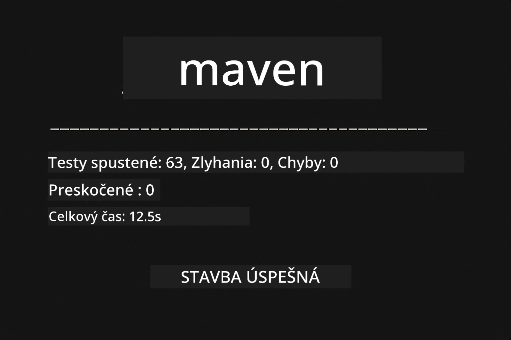
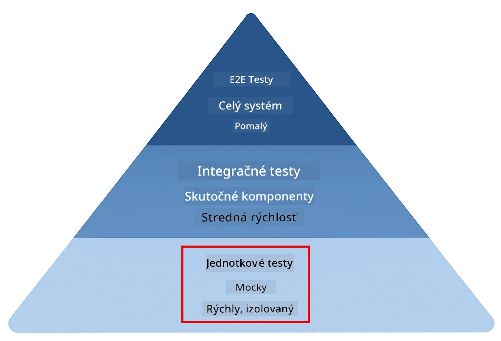
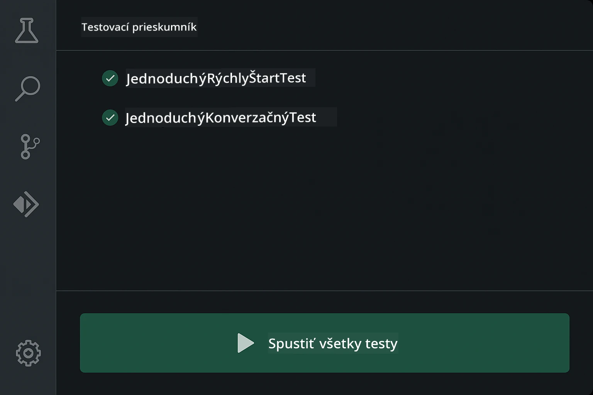
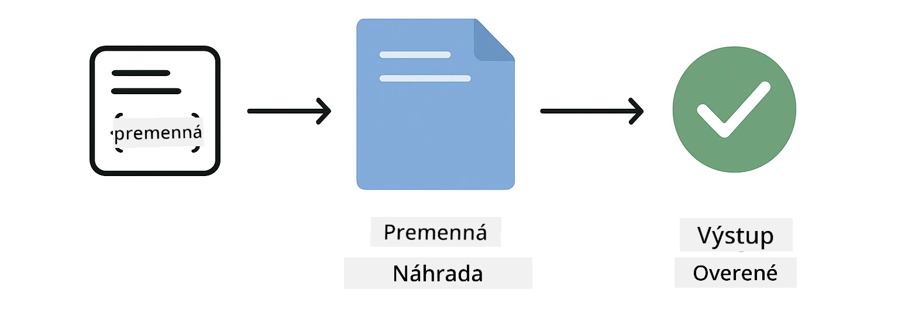
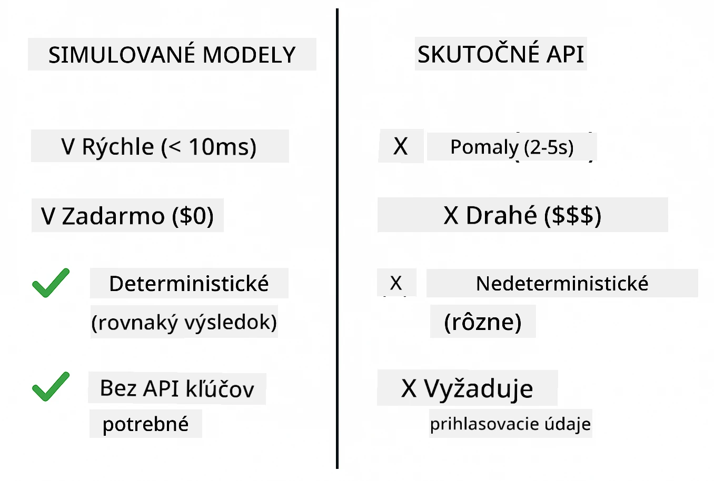
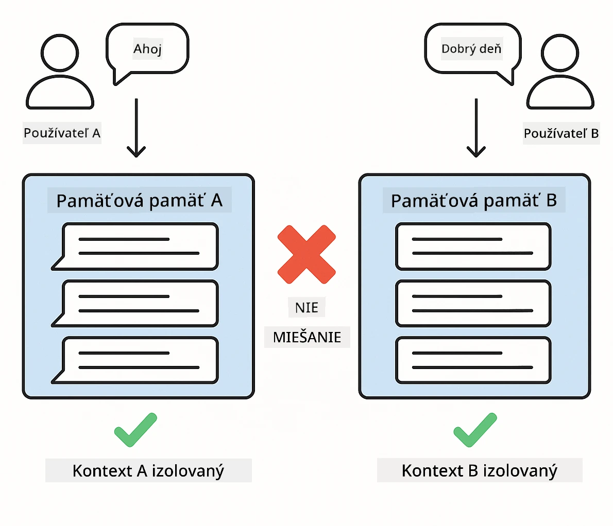
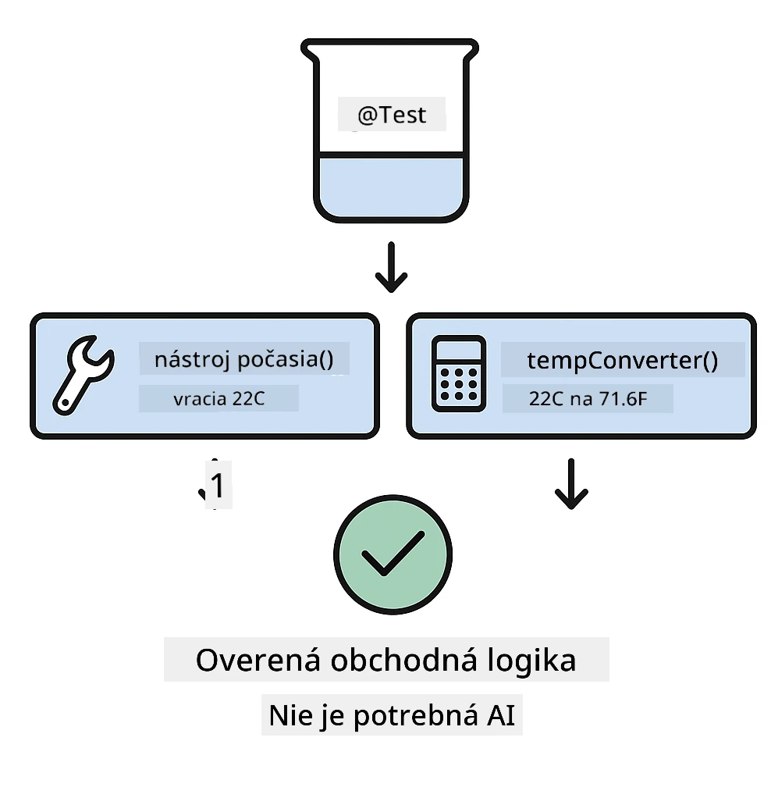
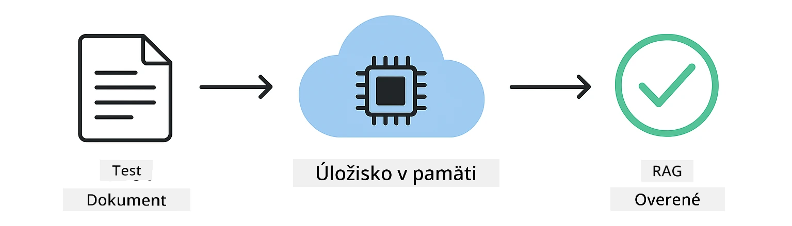

# Testovanie aplikácií LangChain4j

## Obsah

- [Rýchly štart](#rýchly-štart)
- [Čo testy pokrývajú](#čo-testy-pokrývajú)
- [Spustenie testov](#spustenie-testov)
- [Spustenie testov vo VS Code](#spustenie-testov-vo-vs-code)
- [Testovacie vzory](#testovacie-vzory)
- [Testovacia filozofia](#testovacia-filozofia)
- [Ďalšie kroky](#ďalšie-kroky)

Tento návod vás prevedie testmi, ktoré ukazujú, ako testovať AI aplikácie bez potreby API kľúčov alebo externých služieb.

## Rýchly štart

Spustite všetky testy jedným príkazom:

**Bash:**
```bash
mvn test
```

**PowerShell:**
```powershell
mvn --% test
```

Keď všetky testy prejdú, mali by ste vidieť výstup ako na obrázku nižšie — testy prebehli bez jediného zlyhania.



*Úspešné vykonanie testov ukazujúce, že všetky testy prešli bez zlyhaní*

## Čo testy pokrývajú

Tento kurz sa zameriava na **jednotkové testy**, ktoré bežia lokálne. Každý test demonštruje konkrétny koncept LangChain4j samostatne. Nižšie uvedená testovacia pyramída ukazuje, kde jednotkové testy zapadajú — tvoria rýchly, spoľahlivý základ, na ktorom je postavená zvyšná testovacia stratégia.



*Testovacia pyramída ukazujúca rovnováhu medzi jednotkovými testami (rýchle, izolované), integračnými testami (skutočné komponenty) a end-to-end testami. Tento kurz pokrýva jednotkové testovanie.*

| Modul | Testy | Zameranie | Kľúčové súbory |
|--------|-------|-------|-----------|
| **01 - Úvod** | 8 | Pamäť konverzácie a stavový chat | `SimpleConversationTest.java` |
| **02 - Prompt Engineering** | 12 | Vzory GPT-5.2, úrovne nadšenia, štruktúrovaný výstup | `SimpleGpt5PromptTest.java` |
| **03 - RAG** | 10 | Spracovanie dokumentov, vkladania, vyhľadávanie podobnosti | `DocumentServiceTest.java` |
| **04 - Nástroje** | 12 | Volanie funkcií a reťazenie nástrojov | `SimpleToolsTest.java` |
| **05 - MCP** | 8 | Protokol Model Context pomocou stdio transportu | `SimpleMcpTest.java` |

## Spustenie testov

**Spustite všetky testy z koreňového adresára:**

**Bash:**
```bash
mvn test
```

**PowerShell:**
```powershell
mvn --% test
```

**Spustite testy pre konkrétny modul:**

**Bash:**
```bash
cd 01-introduction && mvn test
# Alebo z koreňa
mvn test -pl 01-introduction
```

**PowerShell:**
```powershell
cd 01-introduction; mvn --% test
# Alebo od koreňa
mvn --% test -pl 01-introduction
```

**Spustite jednu testovaciu triedu:**

**Bash:**
```bash
mvn test -Dtest=SimpleConversationTest
```

**PowerShell:**
```powershell
mvn --% test -Dtest=SimpleConversationTest
```

**Spustite konkrétnu testovaciu metódu:**

**Bash:**
```bash
mvn test -Dtest=SimpleConversationTest#mal by zachovať históriu konverzácie
```

**PowerShell:**
```powershell
mvn --% test -Dtest=SimpleConversationTest#mala by zachovať históriu konverzácie
```

## Spustenie testov vo VS Code

Ak používate Visual Studio Code, Test Explorer poskytuje grafické rozhranie na spúšťanie a ladenie testov.



*Test Explorer vo VS Code ukazujúci strom testov so všetkými Java testovacími triedami a jednotlivými testovacími metódami*

**Ako spustiť testy vo VS Code:**

1. Otvorte Test Explorer kliknutím na ikonu skúmavky v paneli aktivít
2. Rozbaľte strom testov a zobrazte všetky moduly a testovacie triedy
3. Kliknite na tlačidlo pre spustenie vedľa akéhokoľvek testu pre jeho spustenie samostatne
4. Kliknite na "Run All Tests" pre spustenie celej sady
5. Kliknite pravým tlačidlom na hociktorý test a vyberte "Debug Test" pre nastavenie breakpointov a krokovanie kódom

Test Explorer zobrazuje zelené zaškrtnutia pre prešlé testy a poskytuje podrobné správy o neúspechoch, keď testy zlyhajú.

## Testovacie vzory

### Vzor 1: Testovanie prompt šablón

Najjednoduchší vzor testuje prompt šablóny bez volania AI modelu. Overujete, že substitúcia premenných funguje správne a prompt je naformátovaný podľa očakávaní.



*Testovanie prompt šablón ukazujúce tok substitúcie premenných: šablóna s miestami pre hodnoty → aplikované hodnoty → overený naformátovaný výstup*

```java
@Test
@DisplayName("Should format prompt template with variables")
void testPromptTemplateFormatting() {
    PromptTemplate template = PromptTemplate.from(
        "Best time to visit {{destination}} for {{activity}}?"
    );
    
    Prompt prompt = template.apply(Map.of(
        "destination", "Paris",
        "activity", "sightseeing"
    ));
    
    assertThat(prompt.text()).isEqualTo("Best time to visit Paris for sightseeing?");
}
```

Tento vzor overuje správnu substitúciu premenných a formátovanie promptov — nie je potrebný API kľúč ani volanie modelu.

### Vzor 2: Mockovanie jazykových modelov

Pri testovaní logiky konverzácie použite Mockito na vytvorenie falošných modelov, ktoré vracajú vopred určené odpovede. Toto robí testy rýchlymi, bezplatnými a deterministickými.



*Porovnanie ukazujúce, prečo sú mocky preferované pri testovaní: sú rýchle, zadarmo, deterministické a nevyžadujú API kľúče*

```java
@ExtendWith(MockitoExtension.class)
class SimpleConversationTest {
    
    private ConversationService conversationService;
    
    @Mock
    private OpenAiOfficialChatModel mockChatModel;
    
    @BeforeEach
    void setUp() {
        ChatResponse mockResponse = ChatResponse.builder()
            .aiMessage(AiMessage.from("This is a test response"))
            .build();
        when(mockChatModel.chat(anyList())).thenReturn(mockResponse);
        
        conversationService = new ConversationService(mockChatModel);
    }
    
    @Test
    void shouldMaintainConversationHistory() {
        String conversationId = conversationService.startConversation();
        
        ChatResponse mockResponse1 = ChatResponse.builder()
            .aiMessage(AiMessage.from("Response 1"))
            .build();
        ChatResponse mockResponse2 = ChatResponse.builder()
            .aiMessage(AiMessage.from("Response 2"))
            .build();
        ChatResponse mockResponse3 = ChatResponse.builder()
            .aiMessage(AiMessage.from("Response 3"))
            .build();
        
        when(mockChatModel.chat(anyList()))
            .thenReturn(mockResponse1)
            .thenReturn(mockResponse2)
            .thenReturn(mockResponse3);

        conversationService.chat(conversationId, "First message");
        conversationService.chat(conversationId, "Second message");
        conversationService.chat(conversationId, "Third message");

        List<ChatMessage> history = conversationService.getHistory(conversationId);
        assertThat(history).hasSize(6); // 3 správy od používateľa + 3 správy od AI
    }
}
```

Tento vzor sa nachádza v `01-introduction/src/test/java/com/example/langchain4j/service/SimpleConversationTest.java`. Mock zaručuje konzistentné správanie, aby ste mohli overiť správu pamäte.

### Vzor 3: Testovanie izolácie konverzácie

Pamäť konverzácie musí udržiavať viacerých používateľov oddelene. Tento test overuje, že sa konverzácie neprelínajú.



*Testovanie izolácie konverzácie ukazujúce oddelené úložiská pamäte pre rôznych používateľov, aby sa predišlo prelínaniu kontextov*

```java
@Test
void shouldIsolateConversationsByid() {
    String conv1 = conversationService.startConversation();
    String conv2 = conversationService.startConversation();
    
    ChatResponse mockResponse = ChatResponse.builder()
        .aiMessage(AiMessage.from("Response"))
        .build();
    when(mockChatModel.chat(anyList())).thenReturn(mockResponse);

    conversationService.chat(conv1, "Message for conversation 1");
    conversationService.chat(conv2, "Message for conversation 2");

    List<ChatMessage> history1 = conversationService.getHistory(conv1);
    List<ChatMessage> history2 = conversationService.getHistory(conv2);
    
    assertThat(history1).hasSize(2);
    assertThat(history2).hasSize(2);
}
```

Každá konverzácia si udržiava vlastnú nezávislú históriu. V produkčných systémoch je táto izolácia kritická pre aplikácie s viacerými používateľmi.

### Vzor 4: Testovanie nástrojov samostatne

Nástroje sú funkcie, ktoré môže AI volať. Testujte ich priamo, aby ste sa uistili, že fungujú správne nezávisle od rozhodnutí AI.



*Samostatné testovanie nástrojov ukazujúce vykonávanie mock nástrojov bez volaní AI na overenie obchodnej logiky*

```java
@Test
void shouldConvertCelsiusToFahrenheit() {
    TemperatureTool tempTool = new TemperatureTool();
    String result = tempTool.celsiusToFahrenheit(25.0);
    assertThat(result).containsPattern("77[.,]0°F");
}

@Test
void shouldDemonstrateToolChaining() {
    WeatherTool weatherTool = new WeatherTool();
    TemperatureTool tempTool = new TemperatureTool();

    String weatherResult = weatherTool.getCurrentWeather("Seattle");
    assertThat(weatherResult).containsPattern("\\d+°C");

    String conversionResult = tempTool.celsiusToFahrenheit(22.0);
    assertThat(conversionResult).containsPattern("71[.,]6°F");
}
```

Tieto testy z `04-tools/src/test/java/com/example/langchain4j/agents/tools/SimpleToolsTest.java` overujú logiku nástrojov bez zapojenia AI. Príklad reťazenia ukazuje, ako výstup jedného nástroja vstupuje do druhého.

### Vzor 5: Testovanie RAG v pamäti

RAG systémy tradične vyžadujú vektorové databázy a embedding služby. Vzor v pamäti vám umožňuje testovať celý proces bez externých závislostí.



*Pracovný tok testovania RAG v pamäti ukazujúci spracovanie dokumentov, ukladanie embeddingov a vyhľadávanie podobnosti bez potreby databázy*

```java
@Test
void testProcessTextDocument() {
    String content = "This is a test document.\nIt has multiple lines.";
    InputStream inputStream = new ByteArrayInputStream(content.getBytes(StandardCharsets.UTF_8));
    
    DocumentService.ProcessedDocument result = 
        documentService.processDocument(inputStream, "test.txt");

    assertNotNull(result);
    assertTrue(result.segments().size() > 0);
    assertEquals("test.txt", result.segments().get(0).metadata().getString("filename"));
}
```

Tento test z `03-rag/src/test/java/com/example/langchain4j/rag/service/DocumentServiceTest.java` vytvára dokument v pamäti a overuje delenie na kúsky a spracovanie metadát.

### Vzor 6: Integračné testovanie MCP

Modul MCP testuje integráciu Model Context Protokolu pomocou stdio transportu. Tieto testy overujú, že vaša aplikácia môže spúšťať a komunikovať s MCP servermi ako podprocesmi.

Testy v `05-mcp/src/test/java/com/example/langchain4j/mcp/SimpleMcpTest.java` overujú správanie MCP klienta.

**Spustite ich:**

**Bash:**
```bash
cd 05-mcp && mvn test
```

**PowerShell:**
```powershell
cd 05-mcp; mvn --% test
```

## Testovacia filozofia

Testujte svoj kód, nie AI. Vaše testy by mali overovať kód, ktorý píšete, kontrolou, ako sú konštruované prompty, ako sa spravuje pamäť a ako funguje vykonávanie nástrojov. Odpovede AI sa líšia a nemali by byť predmetom testovacích tvrdení. Pýtajte sa, či vaša prompt šablóna správne nahrádza premenné, nie či AI dáva správnu odpoveď.

Používajte mocky pre jazykové modely. Sú to externé závislosti, ktoré sú pomalé, drahé a nedeterministické. Mockovanie robí testy rýchlymi s milisekundami namiesto sekúnd, bezplatnými bez nákladov na API a deterministickými so stále rovnakým výsledkom.

Udržujte testy nezávislé. Každý test by mal nastaviť vlastné dáta, nespoliehať sa na iné testy a po sebe upratať. Testy by mali prejsť bez ohľadu na poradie spustenia.

Testujte okrajové prípady nad rámec štandardného priebehu. Skúšajte prázdne vstupy, veľmi veľké vstupy, špeciálne znaky, neplatné parametre a hraničné podmienky. Tieto často odhaľujú chyby, ktoré bežné používanie nezjistí.

Používajte popisné názvy. Porovnajte `shouldMaintainConversationHistoryAcrossMultipleMessages()` s `test1()`. Prvý vám presne povie, čo sa testuje, čo veľmi uľahčuje ladenie v prípade zlyhaní.

## Ďalšie kroky

Teraz, keď rozumiete testovacím vzorom, študujte každý modul podrobnejšie:

- **[01 - Úvod](../01-introduction/README.md)** - Naučte sa spravovať pamäť konverzácie
- **[02 - Prompt Engineering](../02/prompt-engineering/README.md)** - Ovládnite vzory promptovania GPT-5.2
- **[03 - RAG](../03-rag/README.md)** - Budujte systémy retrieval-augmented generation
- **[04 - Nástroje](../04-tools/README.md)** - Implementujte volanie funkcií a reťazenie nástrojov
- **[05 - MCP](../05-mcp/README.md)** - Integrujte Model Context Protocol

README každého modulu poskytuje podrobné vysvetlenia konceptov testovaných tu.

---

**Navigácia:** [← Späť na Hlavnú stránku](../README.md)

---

<!-- CO-OP TRANSLATOR DISCLAIMER START -->
**Vyhlásenie o zodpovednosti**:
Tento dokument bol preložený pomocou AI prekladateľskej služby [Co-op Translator](https://github.com/Azure/co-op-translator). Hoci sa snažíme o presnosť, vezmite prosím na vedomie, že automatické preklady môžu obsahovať chyby alebo nepresnosti. Pôvodný dokument v jeho natívnom jazyku by mal byť považovaný za autoritatívny zdroj. Pre kritické informácie sa odporúča profesionálny ľudský preklad. Nie sme zodpovední za žiadne nedorozumenia alebo nesprávne interpretácie vyplývajúce z použitia tohto prekladu.
<!-- CO-OP TRANSLATOR DISCLAIMER END -->