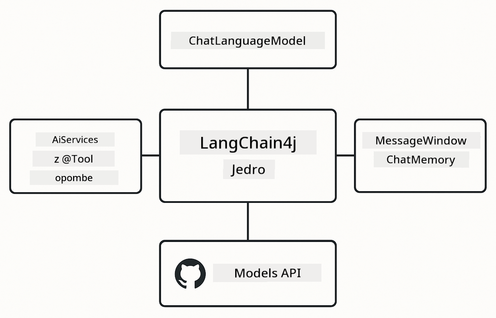

<!--
CO_OP_TRANSLATOR_METADATA:
{
  "original_hash": "377b3e3e6f8d02965bf0fbbc9ccb45c5",
  "translation_date": "2025-12-13T15:22:30+00:00",
  "source_file": "00-quick-start/README.md",
  "language_code": "sl"
}
-->
# Modul 00: Hiter začetek

## Kazalo

- [Uvod](../../../00-quick-start)
- [Kaj je LangChain4j?](../../../00-quick-start)
- [Odvisnosti LangChain4j](../../../00-quick-start)
- [Predpogoji](../../../00-quick-start)
- [Nastavitev](../../../00-quick-start)
  - [1. Pridobite svoj GitHub žeton](../../../00-quick-start)
  - [2. Nastavite svoj žeton](../../../00-quick-start)
- [Zaženite primere](../../../00-quick-start)
  - [1. Osnovni klepet](../../../00-quick-start)
  - [2. Vzorci pozivov](../../../00-quick-start)
  - [3. Klic funkcij](../../../00-quick-start)
  - [4. Vprašanja in odgovori o dokumentih (RAG)](../../../00-quick-start)
- [Kaj vsak primer prikazuje](../../../00-quick-start)
- [Naslednji koraki](../../../00-quick-start)
- [Reševanje težav](../../../00-quick-start)

## Uvod

Ta hiter začetek je namenjen, da vas čim prej spravi v pogon z LangChain4j. Pokriva osnovne osnove gradnje AI aplikacij z LangChain4j in GitHub modeli. V naslednjih modulih boste uporabili Azure OpenAI z LangChain4j za gradnjo bolj naprednih aplikacij.

## Kaj je LangChain4j?

LangChain4j je Java knjižnica, ki poenostavi gradnjo aplikacij, ki jih poganja umetna inteligenca. Namesto da bi se ukvarjali z HTTP odjemalci in razčlenjevanjem JSON, delate s čistimi Java API-ji.

"Veriga" v LangChain se nanaša na povezovanje več komponent - lahko povežete poziv z modelom in z razčlenjevalnikom ali povežete več AI klicev skupaj, kjer en izhod napaja naslednji vhod. Ta hiter začetek se osredotoča na osnove, preden raziskuje bolj zapletene verige.


*Povezovanje komponent v LangChain4j - gradniki se povezujejo za ustvarjanje zmogljivih AI potekov dela*

Uporabili bomo tri osnovne komponente:

**ChatLanguageModel** - Vmesnik za interakcije z AI modelom. Pokličite `model.chat("prompt")` in dobite niz odgovora. Uporabljamo `OpenAiOfficialChatModel`, ki deluje z OpenAI-kompatibilnimi končnimi točkami, kot so GitHub modeli.

**AiServices** - Ustvari tipno varne vmesnike za AI storitve. Določite metode, jih označite z `@Tool` in LangChain4j upravlja orkestracijo. AI samodejno kliče vaše Java metode, ko je to potrebno.

**MessageWindowChatMemory** - Ohranja zgodovino pogovora. Brez tega je vsak zahtevek neodvisen. Z njim si AI zapomni prejšnja sporočila in ohranja kontekst skozi več krogov.



*Arhitektura LangChain4j - osnovne komponente, ki skupaj poganjajo vaše AI aplikacije*

## Odvisnosti LangChain4j

Ta hiter začetek uporablja dve Maven odvisnosti v [`pom.xml`](../../../00-quick-start/pom.xml):

```xml
<!-- Core LangChain4j library -->
<dependency>
    <groupId>dev.langchain4j</groupId>
    <artifactId>langchain4j</artifactId> <!-- Inherited from BOM in root pom.xml -->
</dependency>

<!-- OpenAI integration (works with GitHub Models) -->
<dependency>
    <groupId>dev.langchain4j</groupId>
    <artifactId>langchain4j-open-ai-official</artifactId> <!-- Inherited from BOM in root pom.xml -->
</dependency>
```

Modul `langchain4j-open-ai-official` zagotavlja razred `OpenAiOfficialChatModel`, ki se poveže z OpenAI-kompatibilnimi API-ji. GitHub modeli uporabljajo isti API format, zato ni potreben poseben adapter - samo usmerite osnovni URL na `https://models.github.ai/inference`.

## Predpogoji

**Uporabljate razvojni kontejner?** Java in Maven sta že nameščena. Potrebujete samo osebni dostopni žeton GitHub.

**Lokalni razvoj:**
- Java 21+, Maven 3.9+
- Osebni dostopni žeton GitHub (navodila spodaj)

> **Opomba:** Ta modul uporablja `gpt-4.1-nano` iz GitHub modelov. Ne spreminjajte imena modela v kodi - konfiguriran je za delo z razpoložljivimi modeli GitHub.

## Nastavitev

### 1. Pridobite svoj GitHub žeton

1. Pojdite na [GitHub Nastavitve → Osebni dostopni žetoni](https://github.com/settings/personal-access-tokens)
2. Kliknite "Generate new token"
3. Nastavite opisno ime (npr. "LangChain4j Demo")
4. Nastavite potek (priporočeno 7 dni)
5. Pod "Dovoljenja računa" poiščite "Models" in nastavite na "Samo za branje"
6. Kliknite "Generate token"
7. Kopirajte in shranite svoj žeton - ne boste ga več videli

### 2. Nastavite svoj žeton

**Možnost 1: Uporaba VS Code (priporočeno)**

Če uporabljate VS Code, dodajte svoj žeton v datoteko `.env` v korenu projekta:

Če datoteka `.env` ne obstaja, kopirajte `.env.example` v `.env` ali ustvarite novo `.env` datoteko v korenu projekta.

**Primer `.env` datoteke:**
```bash
# V /workspaces/LangChain4j-for-Beginners/.env
GITHUB_TOKEN=your_token_here
```

Nato lahko preprosto z desnim klikom na katerokoli demo datoteko (npr. `BasicChatDemo.java`) v Raziskovalcu izberete **"Run Java"** ali uporabite konfiguracije zagona iz panela Run and Debug.

**Možnost 2: Uporaba terminala**

Nastavite žeton kot okoljsko spremenljivko:

**Bash:**
```bash
export GITHUB_TOKEN=your_token_here
```

**PowerShell:**
```powershell
$env:GITHUB_TOKEN=your_token_here
```

## Zaženite primere

**Uporaba VS Code:** Preprosto z desnim klikom na katerokoli demo datoteko v Raziskovalcu izberite **"Run Java"** ali uporabite konfiguracije zagona iz panela Run and Debug (prepričajte se, da ste najprej dodali svoj žeton v `.env` datoteko).

**Uporaba Maven:** Alternativno lahko zaženete iz ukazne vrstice:

### 1. Osnovni klepet

**Bash:**
```bash
mvn compile exec:java -Dexec.mainClass=com.example.langchain4j.quickstart.BasicChatDemo
```

**PowerShell:**
```powershell
mvn --% compile exec:java -Dexec.mainClass=com.example.langchain4j.quickstart.BasicChatDemo
```

### 2. Vzorci pozivov

**Bash:**
```bash
mvn compile exec:java -Dexec.mainClass=com.example.langchain4j.quickstart.PromptEngineeringDemo
```

**PowerShell:**
```powershell
mvn --% compile exec:java -Dexec.mainClass=com.example.langchain4j.quickstart.PromptEngineeringDemo
```

Prikazuje zero-shot, few-shot, chain-of-thought in role-based pozive.

### 3. Klic funkcij

**Bash:**
```bash
mvn compile exec:java -Dexec.mainClass=com.example.langchain4j.quickstart.ToolIntegrationDemo
```

**PowerShell:**
```powershell
mvn --% compile exec:java -Dexec.mainClass=com.example.langchain4j.quickstart.ToolIntegrationDemo
```

AI samodejno kliče vaše Java metode, ko je to potrebno.

### 4. Vprašanja in odgovori o dokumentih (RAG)

**Bash:**
```bash
mvn compile exec:java -Dexec.mainClass=com.example.langchain4j.quickstart.SimpleReaderDemo
```

**PowerShell:**
```powershell
mvn --% compile exec:java -Dexec.mainClass=com.example.langchain4j.quickstart.SimpleReaderDemo
```

Postavite vprašanja o vsebini v `document.txt`.

## Kaj vsak primer prikazuje

**Osnovni klepet** - [BasicChatDemo.java](../../../00-quick-start/src/main/java/com/example/langchain4j/quickstart/BasicChatDemo.java)

Začnite tukaj, da vidite LangChain4j v njegovi najpreprostejši obliki. Ustvarili boste `OpenAiOfficialChatModel`, poslali poziv z `.chat()` in prejeli odgovor. To prikazuje temelje: kako inicializirati modele z lastnimi končnimi točkami in API ključi. Ko razumete ta vzorec, se vse ostalo gradi na njem.

```java
ChatLanguageModel model = OpenAiOfficialChatModel.builder()
    .baseUrl("https://models.github.ai/inference")
    .apiKey(System.getenv("GITHUB_TOKEN"))
    .modelName("gpt-4.1-nano")
    .build();

String response = model.chat("What is LangChain4j?");
System.out.println(response);
```

> **🤖 Poskusite z [GitHub Copilot](https://github.com/features/copilot) klepetom:** Odprite [`BasicChatDemo.java`](../../../00-quick-start/src/main/java/com/example/langchain4j/quickstart/BasicChatDemo.java) in vprašajte:
> - "Kako bi v tej kodi preklopil z GitHub modelov na Azure OpenAI?"
> - "Katere druge parametre lahko konfiguriram v OpenAiOfficialChatModel.builder()?"
> - "Kako dodam pretočne odgovore namesto čakanja na celoten odgovor?"

**Inženiring pozivov** - [PromptEngineeringDemo.java](../../../00-quick-start/src/main/java/com/example/langchain4j/quickstart/PromptEngineeringDemo.java)

Zdaj, ko veste, kako govoriti z modelom, poglejmo, kaj mu rečete. Ta demo uporablja isto nastavitev modela, a prikazuje štiri različne vzorce pozivov. Poskusite zero-shot pozive za neposredna navodila, few-shot pozive, ki se učijo iz primerov, chain-of-thought pozive, ki razkrivajo korake razmišljanja, in role-based pozive, ki postavijo kontekst. Videli boste, kako isti model daje drastično različne rezultate glede na to, kako oblikujete zahtevo.

```java
PromptTemplate template = PromptTemplate.from(
    "What's the best time to visit {{destination}} for {{activity}}?"
);

Prompt prompt = template.apply(Map.of(
    "destination", "Paris",
    "activity", "sightseeing"
));

String response = model.chat(prompt.text());
```

> **🤖 Poskusite z [GitHub Copilot](https://github.com/features/copilot) klepetom:** Odprite [`PromptEngineeringDemo.java`](../../../00-quick-start/src/main/java/com/example/langchain4j/quickstart/PromptEngineeringDemo.java) in vprašajte:
> - "Kakšna je razlika med zero-shot in few-shot pozivanjem in kdaj naj uporabim katerega?"
> - "Kako parameter temperature vpliva na odgovore modela?"
> - "Katere tehnike obstajajo za preprečevanje napadov z vbrizgavanjem pozivov v produkciji?"
> - "Kako lahko ustvarim ponovno uporabne objekte PromptTemplate za pogoste vzorce?"

**Integracija orodij** - [ToolIntegrationDemo.java](../../../00-quick-start/src/main/java/com/example/langchain4j/quickstart/ToolIntegrationDemo.java)

Tukaj LangChain4j postane močan. Uporabili boste `AiServices` za ustvarjanje AI asistenta, ki lahko kliče vaše Java metode. Samo označite metode z `@Tool("opis")` in LangChain4j poskrbi za ostalo - AI samodejno odloča, kdaj uporabiti katero orodje glede na to, kaj uporabnik vpraša. To prikazuje klic funkcij, ključno tehniko za gradnjo AI, ki lahko izvaja dejanja, ne samo odgovarja na vprašanja.

```java
@Tool("Performs addition of two numeric values")
public double add(double a, double b) {
    return a + b;
}

MathAssistant assistant = AiServices.create(MathAssistant.class, model);
String response = assistant.chat("What is 25 plus 17?");
```

> **🤖 Poskusite z [GitHub Copilot](https://github.com/features/copilot) klepetom:** Odprite [`ToolIntegrationDemo.java`](../../../00-quick-start/src/main/java/com/example/langchain4j/quickstart/ToolIntegrationDemo.java) in vprašajte:
> - "Kako deluje oznaka @Tool in kaj LangChain4j počne z njo v ozadju?"
> - "Ali lahko AI kliče več orodij zaporedoma za reševanje zapletenih problemov?"
> - "Kaj se zgodi, če orodje vrže izjemo - kako naj ravnam z napakami?"
> - "Kako bi integriral pravi API namesto tega primera kalkulatorja?"

**Vprašanja in odgovori o dokumentih (RAG)** - [SimpleReaderDemo.java](../../../00-quick-start/src/main/java/com/example/langchain4j/quickstart/SimpleReaderDemo.java)

Tukaj boste videli temelje RAG (generiranje z iskanjem). Namesto da bi se zanašali na podatke za usposabljanje modela, naložite vsebino iz [`document.txt`](../../../00-quick-start/document.txt) in jo vključite v poziv. AI odgovarja na podlagi vašega dokumenta, ne na splošnem znanju. To je prvi korak k gradnji sistemov, ki lahko delajo z vašimi lastnimi podatki.

```java
Document document = FileSystemDocumentLoader.loadDocument("document.txt");
String content = document.text();

String prompt = "Based on this document: " + content + 
                "\nQuestion: What is the main topic?";
String response = model.chat(prompt);
```

> **Opomba:** Ta preprost pristop naloži celoten dokument v poziv. Za velike datoteke (>10KB) boste presegli omejitve konteksta. Modul 03 pokriva razdeljevanje in vektorsko iskanje za produkcijske RAG sisteme.

> **🤖 Poskusite z [GitHub Copilot](https://github.com/features/copilot) klepetom:** Odprite [`SimpleReaderDemo.java`](../../../00-quick-start/src/main/java/com/example/langchain4j/quickstart/SimpleReaderDemo.java) in vprašajte:
> - "Kako RAG preprečuje AI halucinacije v primerjavi z uporabo podatkov za usposabljanje modela?"
> - "Kakšna je razlika med tem preprostim pristopom in uporabo vektorskih vdelav za iskanje?"
> - "Kako bi to razširil za delo z več dokumenti ali večjimi zbirkami znanja?"
> - "Kakšne so najboljše prakse za strukturiranje poziva, da AI uporablja samo podani kontekst?"

## Odpravljanje napak

Primeri vključujejo `.logRequests(true)` in `.logResponses(true)`, da prikažejo API klice v konzoli. To pomaga pri odpravljanju napak pri preverjanju pristnosti, omejitvah hitrosti ali nepričakovanih odgovorih. V produkciji odstranite te zastavice, da zmanjšate hrup v dnevnikih.

## Naslednji koraki

**Naslednji modul:** [01-uvod - Začetek z LangChain4j in gpt-5 na Azure](../01-introduction/README.md)

---

**Navigacija:** [← Nazaj na glavno](../README.md) | [Naprej: Modul 01 - Uvod →](../01-introduction/README.md)

---

## Reševanje težav

### Prvič gradnja z Maven

**Težava:** Začetni `mvn clean compile` ali `mvn package` traja dolgo (10-15 minut)

**Vzrok:** Maven mora ob prvi gradnji prenesti vse odvisnosti projekta (Spring Boot, LangChain4j knjižnice, Azure SDK-je itd.).

**Rešitev:** To je normalno vedenje. Naslednje gradnje bodo veliko hitrejše, saj so odvisnosti shranjene lokalno. Čas prenosa je odvisen od hitrosti vaše povezave.

### Sintaksa ukazov Maven v PowerShell

**Težava:** Maven ukazi ne uspejo z napako `Unknown lifecycle phase ".mainClass=..."`

**Vzrok:** PowerShell interpretira `=` kot operator za dodeljevanje spremenljivke, kar pokvari sintakso lastnosti Maven.

**Rešitev:** Uporabite operator za ustavitev razčlenjevanja `--%` pred Maven ukazom:

**PowerShell:**
```powershell
mvn --% compile exec:java -Dexec.mainClass=com.example.langchain4j.quickstart.BasicChatDemo
```

**Bash:**
```bash
mvn compile exec:java -Dexec.mainClass=com.example.langchain4j.quickstart.BasicChatDemo
```

Operator `--%` pove PowerShellu, naj vse preostale argumente posreduje dobesedno Maven brez interpretacije.

### Prikaz emoji v Windows PowerShell

**Težava:** AI odgovori prikazujejo neberljive znake (npr. `????` ali `â??`) namesto emojijev v PowerShell

**Vzrok:** Privzeta kodna tabela PowerShell ne podpira UTF-8 emojijev

**Rešitev:** Zaženite ta ukaz pred zagonom Java aplikacij:
```cmd
chcp 65001
```

To prisili UTF-8 kodiranje v terminalu. Alternativno uporabite Windows Terminal, ki ima boljšo podporo za Unicode.

---

<!-- CO-OP TRANSLATOR DISCLAIMER START -->
**Omejitev odgovornosti**:
Ta dokument je bil preveden z uporabo storitve za prevajanje z umetno inteligenco [Co-op Translator](https://github.com/Azure/co-op-translator). Čeprav si prizadevamo za natančnost, vas opozarjamo, da avtomatizirani prevodi lahko vsebujejo napake ali netočnosti. Izvirni dokument v njegovem izvirnem jeziku velja za avtoritativni vir. Za ključne informacije priporočamo strokovni človeški prevod. Za morebitna nesporazume ali napačne interpretacije, ki izhajajo iz uporabe tega prevoda, ne odgovarjamo.
<!-- CO-OP TRANSLATOR DISCLAIMER END -->