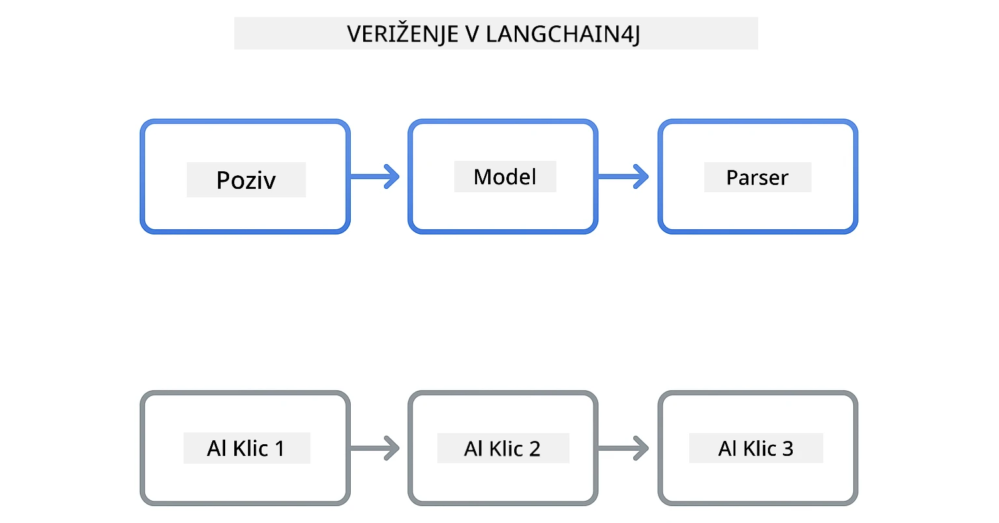
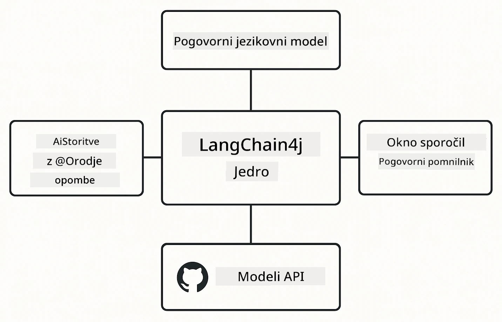

# Modul 00: Hiter začetek

## Kazalo

- [Uvod](../../../00-quick-start)
- [Kaj je LangChain4j?](../../../00-quick-start)
- [Odvisnosti LangChain4j](../../../00-quick-start)
- [Predpogoji](../../../00-quick-start)
- [Nastavitev](../../../00-quick-start)
  - [1. Pridobite svoj GitHub žeton](../../../00-quick-start)
  - [2. Nastavite svoj žeton](../../../00-quick-start)
- [Zagon primerov](../../../00-quick-start)
  - [1. Osnovni klepet](../../../00-quick-start)
  - [2. Vzorci pozivov](../../../00-quick-start)
  - [3. Klicanje funkcij](../../../00-quick-start)
  - [4. Vprašanja in odgovori o dokumentih (RAG)](../../../00-quick-start)
  - [5. Odgovorna umetna inteligenca](../../../00-quick-start)
- [Kaj vsak primer prikazuje](../../../00-quick-start)
- [Naslednji koraki](../../../00-quick-start)
- [Reševanje težav](../../../00-quick-start)

## Uvod

Ta hitri začetek je namenjen temu, da vas čim hitreje seznani z LangChain4j. Pokriva popolne osnove izgradnje AI aplikacij z LangChain4j in GitHub modeli. V naslednjih modulih boste uporabljali Azure OpenAI z LangChain4j za izdelavo bolj naprednih aplikacij.

## Kaj je LangChain4j?

LangChain4j je Java knjižnica, ki poenostavi izdelavo aplikacij, ki jih poganja AI. Namesto da bi se ukvarjali z HTTP odjemalci in razčlenjevanjem JSON-a, delate s čistimi Java API-ji.

"Veriga" v LangChain se nanaša na povezovanje več komponent – lahko povežete poziv z modelom in parserjem ali povežete več AI klicev, kjer izhod enega služi kot vhod naslednjega. Ta hitri začetek se osredotoča na osnove, preden raziskujete bolj zapletene verige.



*Povezovanje komponent v LangChain4j – gradniki se povezujejo za ustvarjanje zmogljivih AI delovnih tokov*

Uporabili bomo tri osnovne komponente:

**ChatLanguageModel** – Vmesnik za interakcije z AI modelom. Pokličite `model.chat("poziv")` in dobite odgovor v obliki niza. Uporabljamo `OpenAiOfficialChatModel`, ki deluje z OpenAI združljivimi končnimi točkami, kot so GitHub modeli.

**AiServices** – Ustvari varne vmesnike za AI storitve. Definirajte metode, jih označite z `@Tool`, LangChain4j pa poskrbi za orkestracijo. AI samodejno kliče vaše Java metode, kadar je potrebno.

**MessageWindowChatMemory** – Ohranja zgodovino pogovora. Brez tega je vsak zahtevek neodvisen. Z njim se AI spomni prejšnjih sporočil in ohranja kontekst skozi več krogov.



*Arhitektura LangChain4j – osnovne komponente, ki delujejo skupaj za pogon vaših AI aplikacij*

## Odvisnosti LangChain4j

Ta hitri začetek uporablja dve Maven odvisnosti v [`pom.xml`](../../../00-quick-start/pom.xml):

```xml
<!-- Core LangChain4j library -->
<dependency>
    <groupId>dev.langchain4j</groupId>
    <artifactId>langchain4j</artifactId> <!-- Inherited from BOM in root pom.xml -->
</dependency>

<!-- OpenAI integration (works with GitHub Models) -->
<dependency>
    <groupId>dev.langchain4j</groupId>
    <artifactId>langchain4j-open-ai-official</artifactId> <!-- Inherited from BOM in root pom.xml -->
</dependency>
```

Modul `langchain4j-open-ai-official` zagotavlja razred `OpenAiOfficialChatModel`, ki se poveže z API-ji združljivimi z OpenAI. GitHub modeli uporabljajo enak format API-ja, zato ni potreben poseben adapter – preprosto nastavite osnovni URL na `https://models.github.ai/inference`.

## Predpogoji

**Uporabljate razvojno vsebnik (Dev Container)?** Java in Maven sta že nameščena. Potrebujete le GitHub osebni dostopni žeton.

**Lokalni razvoj:**
- Java 21+ , Maven 3.9+
- GitHub osebni dostopni žeton (navodila spodaj)

> **Opomba:** Ta modul uporablja `gpt-4.1-nano` iz GitHub modelov. Ne spreminjajte imena modela v kodi – je konfiguriran za delo z razpoložljivimi GitHub modeli.

## Nastavitev

### 1. Pridobite svoj GitHub žeton

1. Pojdite na [GitHub Nastavitve → Osebni dostopni žetoni](https://github.com/settings/personal-access-tokens)
2. Kliknite "Ustvari nov žeton"
3. Nastavite opisno ime (npr. "LangChain4j Demo")
4. Nastavite potek veljavnosti (priporočenih 7 dni)
5. Pod "Dovoljenja računa" poiščite "Models" in nastavite na "Samo za branje"
6. Kliknite "Ustvari žeton"
7. Kopirajte in shranite žeton – tega več ne boste videli

### 2. Nastavite svoj žeton

**Možnost 1: Uporaba VS Code (priporočeno)**

Če uporabljate VS Code, dodajte žeton v datoteko `.env` v korenu projekta:

Če datoteka `.env` ne obstaja, kopirajte `.env.example` v `.env` ali ustvarite novo `.env` datoteko v korenu projekta.

**Primer `.env` datoteke:**
```bash
# V /workspaces/LangChain4j-for-Beginners/.env
GITHUB_TOKEN=your_token_here
```

Nato lahko preprosto z desnim klikom na katerokoli demo datoteko (npr. `BasicChatDemo.java`) v Raziskovalcu izberete **"Run Java"** ali uporabite konfiguracije zagona iz panela Run in Debug.

**Možnost 2: Uporaba terminala**

Nastavite žeton kot okoljsko spremenljivko:

**Bash:**
```bash
export GITHUB_TOKEN=your_token_here
```

**PowerShell:**
```powershell
$env:GITHUB_TOKEN=your_token_here
```

## Zagon primerov

**Uporaba VS Code:** Preprosto z desnim klikom na katerokoli demo datoteko v Raziskovalcu izberite **"Run Java"** ali uporabite konfiguracije zagona iz panela Run in Debug (poskrbite, da ste najprej dodali svoj žeton v datoteko `.env`).

**Uporaba Maven:** Alternativno lahko zaženete iz ukazne vrstice:

### 1. Osnovni klepet

**Bash:**
```bash
mvn compile exec:java -Dexec.mainClass=com.example.langchain4j.quickstart.BasicChatDemo
```

**PowerShell:**
```powershell
mvn --% compile exec:java -Dexec.mainClass=com.example.langchain4j.quickstart.BasicChatDemo
```

### 2. Vzorci pozivov

**Bash:**
```bash
mvn compile exec:java -Dexec.mainClass=com.example.langchain4j.quickstart.PromptEngineeringDemo
```

**PowerShell:**
```powershell
mvn --% compile exec:java -Dexec.mainClass=com.example.langchain4j.quickstart.PromptEngineeringDemo
```

Prikazuje zero-shot, few-shot, chain-of-thought in role-based pozive.

### 3. Klicanje funkcij

**Bash:**
```bash
mvn compile exec:java -Dexec.mainClass=com.example.langchain4j.quickstart.ToolIntegrationDemo
```

**PowerShell:**
```powershell
mvn --% compile exec:java -Dexec.mainClass=com.example.langchain4j.quickstart.ToolIntegrationDemo
```

AI samodejno kliče vaše Java metode, ko je to potrebno.

### 4. Vprašanja in odgovori o dokumentih (RAG)

**Bash:**
```bash
mvn compile exec:java -Dexec.mainClass=com.example.langchain4j.quickstart.SimpleReaderDemo
```

**PowerShell:**
```powershell
mvn --% compile exec:java -Dexec.mainClass=com.example.langchain4j.quickstart.SimpleReaderDemo
```

Postavljajte vprašanja o vsebini v `document.txt`.

### 5. Odgovorna umetna inteligenca

**Bash:**
```bash
mvn compile exec:java -Dexec.mainClass=com.example.langchain4j.quickstart.ResponsibleAIDemo
```

**PowerShell:**
```powershell
mvn --% compile exec:java -Dexec.mainClass=com.example.langchain4j.quickstart.ResponsibleAIDemo
```

Poglejte, kako AI varnostni filtri blokirajo škodljivo vsebino.

## Kaj vsak primer prikazuje

**Osnovni klepet** - [BasicChatDemo.java](../../../00-quick-start/src/main/java/com/example/langchain4j/quickstart/BasicChatDemo.java)

Začnite tukaj, da vidite LangChain4j v njegovi najpreprostejši obliki. Ustvarili boste `OpenAiOfficialChatModel`, poslali poziv s `.chat()`, in prejeli odgovor. To prikazuje temelj: kako inicializirati modele z lastnimi končnimi točkami in API ključi. Ko to razumete, se vse ostalo gradi na tem vzorcu.

```java
ChatLanguageModel model = OpenAiOfficialChatModel.builder()
    .baseUrl("https://models.github.ai/inference")
    .apiKey(System.getenv("GITHUB_TOKEN"))
    .modelName("gpt-4.1-nano")
    .build();

String response = model.chat("What is LangChain4j?");
System.out.println(response);
```

> **🤖 Poskusite z [GitHub Copilot](https://github.com/features/copilot) Chat:** Odprite [`BasicChatDemo.java`](../../../00-quick-start/src/main/java/com/example/langchain4j/quickstart/BasicChatDemo.java) in vprašajte:
> - "Kako bi v tej kodi preklopil z GitHub modelov na Azure OpenAI?"
> - "Katere druge parametre lahko konfiguriram v OpenAiOfficialChatModel.builder()?"
> - "Kako dodam pretakanje odzivov namesto čakanja na celoten odgovor?"

**Inženiring pozivov** - [PromptEngineeringDemo.java](../../../00-quick-start/src/main/java/com/example/langchain4j/quickstart/PromptEngineeringDemo.java)

Zdaj, ko veste, kako govoriti z modelom, poglejmo, kaj mu govorite. Ta demo uporablja enako nastavitev modela, a prikazuje štiri različne vzorce pozivov. Poskusite zero-shot pozive za neposredna navodila, few-shot pozive, ki se učijo iz primerov, chain-of-thought pozive, ki razkrivajo korake razmišljanja, in role-based pozive, ki postavljajo kontekst. Videli boste, kako isti model daje bistveno različne rezultate glede na to, kako oblikujete zahtevo.

```java
PromptTemplate template = PromptTemplate.from(
    "What's the best time to visit {{destination}} for {{activity}}?"
);

Prompt prompt = template.apply(Map.of(
    "destination", "Paris",
    "activity", "sightseeing"
));

String response = model.chat(prompt.text());
```

> **🤖 Poskusite z [GitHub Copilot](https://github.com/features/copilot) Chat:** Odprite [`PromptEngineeringDemo.java`](../../../00-quick-start/src/main/java/com/example/langchain4j/quickstart/PromptEngineeringDemo.java) in vprašajte:
> - "Kakšna je razlika med zero-shot in few-shot pozivanjem in kdaj naj uporabim katerega?"
> - "Kako parameter temperature vpliva na odzive modela?"
> - "Katere tehnike obstajajo za preprečevanje napadov z vbrizgavanjem pozivov v produkciji?"
> - "Kako ustvarim ponovljivo uporabo PromptTemplate objektov za pogoste vzorce?"

**Integracija orodij** - [ToolIntegrationDemo.java](../../../00-quick-start/src/main/java/com/example/langchain4j/quickstart/ToolIntegrationDemo.java)

Tukaj LangChain4j postane močan. Uporabili boste `AiServices` za ustvarjanje AI asistenta, ki lahko kliče vaše Java metode. Samo označite metode z `@Tool("opis")` in LangChain4j poskrbi za ostalo – AI samodejno odloča, kdaj uporabiti posamezno orodje glede na zahteve uporabnika. To prikazuje klic funkcij, ključno tehniko za gradnjo AI, ki lahko izvaja dejanja, ne le odgovarja na vprašanja.

```java
@Tool("Performs addition of two numeric values")
public double add(double a, double b) {
    return a + b;
}

MathAssistant assistant = AiServices.create(MathAssistant.class, model);
String response = assistant.chat("What is 25 plus 17?");
```

> **🤖 Poskusite z [GitHub Copilot](https://github.com/features/copilot) Chat:** Odprite [`ToolIntegrationDemo.java`](../../../00-quick-start/src/main/java/com/example/langchain4j/quickstart/ToolIntegrationDemo.java) in vprašajte:
> - "Kako deluje oznaka @Tool in kaj LangChain4j naredi z njo v ozadju?"
> - "Ali lahko AI kliče več orodij zaporedoma za reševanje kompleksnih problemov?"
> - "Kaj se zgodi, če orodje vrže izjemo – kako naj upravljam z napakami?"
> - "Kako bi integriral resnični API namesto tega primera z kalkulatorjem?"

**Vprašanja in odgovori o dokumentih (RAG)** - [SimpleReaderDemo.java](../../../00-quick-start/src/main/java/com/example/langchain4j/quickstart/SimpleReaderDemo.java)

Tukaj boste videli osnovo RAG (generiranje z iskanjem). Namesto da bi se zanašali na podatke iz usposabljanja modela, naložite vsebino iz [`document.txt`](../../../00-quick-start/document.txt) in jo vključite v poziv. AI odgovarja na podlagi vašega dokumenta, ne na splošnem znanju. To je prvi korak k gradnji sistemov, ki lahko delujejo z vašimi lastnimi podatki.

```java
Document document = FileSystemDocumentLoader.loadDocument("document.txt");
String content = document.text();

String prompt = "Based on this document: " + content + 
                "\nQuestion: What is the main topic?";
String response = model.chat(prompt);
```

> **Opomba:** Ta preprost pristop naloži celoten dokument v poziv. Za velike datoteke (>10KB) boste presegli meje konteksta. Modul 03 pokriva razdeljevanje in vektorsko iskanje za produkcijske RAG sisteme.

> **🤖 Poskusite z [GitHub Copilot](https://github.com/features/copilot) Chat:** Odprite [`SimpleReaderDemo.java`](../../../00-quick-start/src/main/java/com/example/langchain4j/quickstart/SimpleReaderDemo.java) in vprašajte:
> - "Kako RAG preprečuje AI halucinacije v primerjavi z uporabo podatkov usposabljanja modela?"
> - "Kakšna je razlika med tem preprostim pristopom in uporabo vektorskih vgraditev za iskanje?"
> - "Kako bi razširil to za obdelavo več dokumentov ali večjih baz znanja?"
> - "Katere so najboljše prakse za strukturiranje poziva, da AI uporablja samo zagotovljeni kontekst?"

**Odgovorna umetna inteligenca** - [ResponsibleAIDemo.java](../../../00-quick-start/src/main/java/com/example/langchain4j/quickstart/ResponsibleAIDemo.java)

Zgradite varnost AI z obrambami v globino. Ta demo prikazuje dva sloja zaščite, ki delata skupaj:

**Del 1: LangChain4j varnostne meje vnosa** – Blokira nevarne pozive, preden dosežejo LLM. Ustvarite prilagojene varnostne meje, ki preverjajo prepovedane ključne besede ali vzorce. Te delujejo v vaši kodi, so hitre in brezplačne.

```java
class DangerousContentGuardrail implements InputGuardrail {
    @Override
    public InputGuardrailResult validate(UserMessage userMessage) {
        String text = userMessage.singleText().toLowerCase();
        if (text.contains("explosives")) {
            return fatal("Blocked: contains prohibited keyword");
        }
        return success();
    }
}
```

**Del 2: Varnostni filtri ponudnika** – GitHub modeli imajo vgrajene filtre, ki ujamejo tisto, kar vaš varnostni sistem morda spregleda. Videli boste stroge blokade (HTTP 400 napake) za resne kršitve in mehke zavrnitve, kjer AI prijazno zavrne.

> **🤖 Poskusite z [GitHub Copilot](https://github.com/features/copilot) Chat:** Odprite [`ResponsibleAIDemo.java`](../../../00-quick-start/src/main/java/com/example/langchain4j/quickstart/ResponsibleAIDemo.java) in vprašajte:
> - "Kaj je InputGuardrail in kako ustvarim svojega?"
> - "Kakšna je razlika med strogo blokado in mehko zavrnitvijo?"
> - "Zakaj uporabljati hkrati varnostne meje in filtre ponudnika?"

## Naslednji koraki

**Naslednji modul:** [01-uvod - Začetek z LangChain4j in gpt-5 na Azure](../01-introduction/README.md)

---

**Navigacija:** [← Nazaj na glavno](../README.md) | [Naprej: Modul 01 - Uvod →](../01-introduction/README.md)

---

## Reševanje težav

### Prvič Maven gradnja

**Težava:** Prvi `mvn clean compile` ali `mvn package` traja dolgo (10-15 minut)

**Vzrok:** Maven mora prvič prenesti vse odvisnosti projekta (Spring Boot, LangChain4j knjižnice, Azure SDK-je itd.).

**Rešitev:** To je običajno. Naslednji gradnje bodo veliko hitrejše, ker so odvisnosti shranjene lokalno. Čas prenosa je odvisen od hitrosti vaše povezave.

### Sintaksa Maven ukazov v PowerShell-u

**Težava:** Maven ukazi spodletijo z napako `Unknown lifecycle phase ".mainClass=..."`

**Vzrok:** PowerShell interpretira `=` kot operator za nastavitev spremenljivke, kar podre sintakso lastnosti Maven-a.
**Rešitev**: Pred ukaz Maven uporabite operator za prenehanje razčlenjevanja `--%`:

**PowerShell:**
```powershell
mvn --% compile exec:java -Dexec.mainClass=com.example.langchain4j.quickstart.BasicChatDemo
```

**Bash:**
```bash
mvn compile exec:java -Dexec.mainClass=com.example.langchain4j.quickstart.BasicChatDemo
```

Operator `--%` pove PowerShellu, naj vse preostale argumente dobesedno posreduje Maven-u brez interpretacije.

### Prikaz emojijev v Windows PowerShell

**Težava**: AI odgovori prikazujejo nesmiselne znake (npr. `????` ali `â??`) namesto emojijev v PowerShell-u

**Vzrok**: Privzeta kodna tabela PowerShell ne podpira UTF-8 emojijev

**Rešitev**: Zaženite ta ukaz pred izvajanjem Java aplikacij:
```cmd
chcp 65001
```

S tem se v terminalu prisili kodiranje UTF-8. Alternativno lahko uporabite Windows Terminal, ki bolje podpira Unicode.

### Odpravljanje napak pri API klicih

**Težava**: Napake pri avtentikaciji, omejitve hitrosti ali nepričakovani odgovori AI modela

**Rešitev**: Primeri vključujejo `.logRequests(true)` in `.logResponses(true)`, da se prikažejo API klici v konzoli. To pomaga pri odpravljanju napak avtentikacije, omejitev hitrosti ali nepričakovanih odgovorov. Te nastavitve odstranite v produkcijskem okolju za zmanjšanje šuma v dnevnikih.

---

<!-- CO-OP TRANSLATOR DISCLAIMER START -->
**Omejitev odgovornosti**:
Ta dokument je bil preveden z uporabo storitve za avtomatski prevod [Co-op Translator](https://github.com/Azure/co-op-translator). Čeprav si prizadevamo za natančnost, upoštevajte, da lahko avtomatizirani prevodi vsebujejo napake ali netočnosti. Izvirni dokument v njegovi prvotni jezikovni različici velja za avtoritativni vir. Za kritične informacije priporočamo strokovni prevod s strani človeka. Nismo odgovorni za morebitna nesporazume ali napačne interpretacije, ki izhajajo iz uporabe tega prevoda.
<!-- CO-OP TRANSLATOR DISCLAIMER END -->