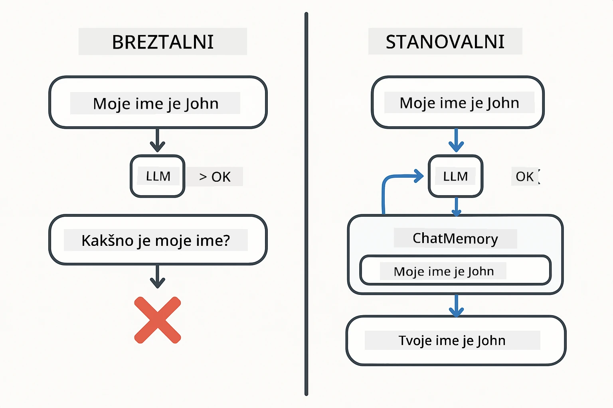
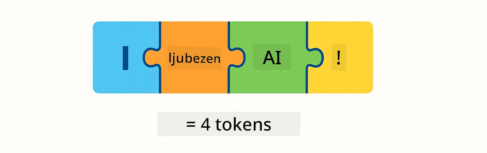
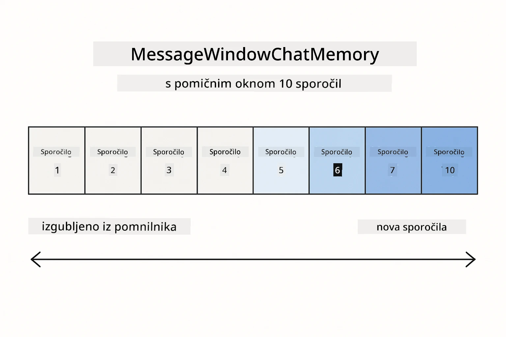
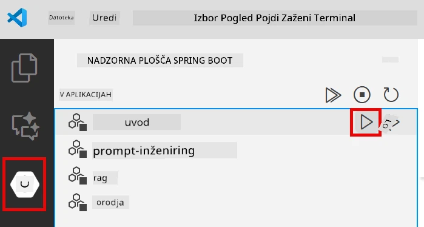
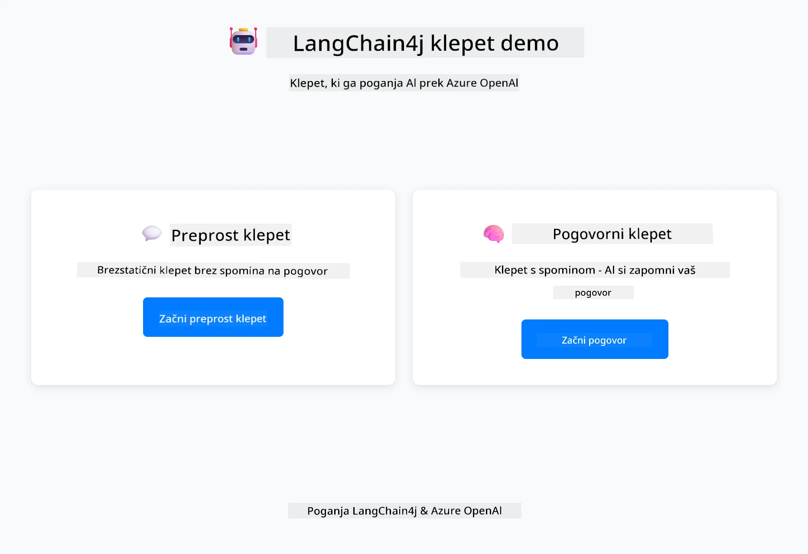
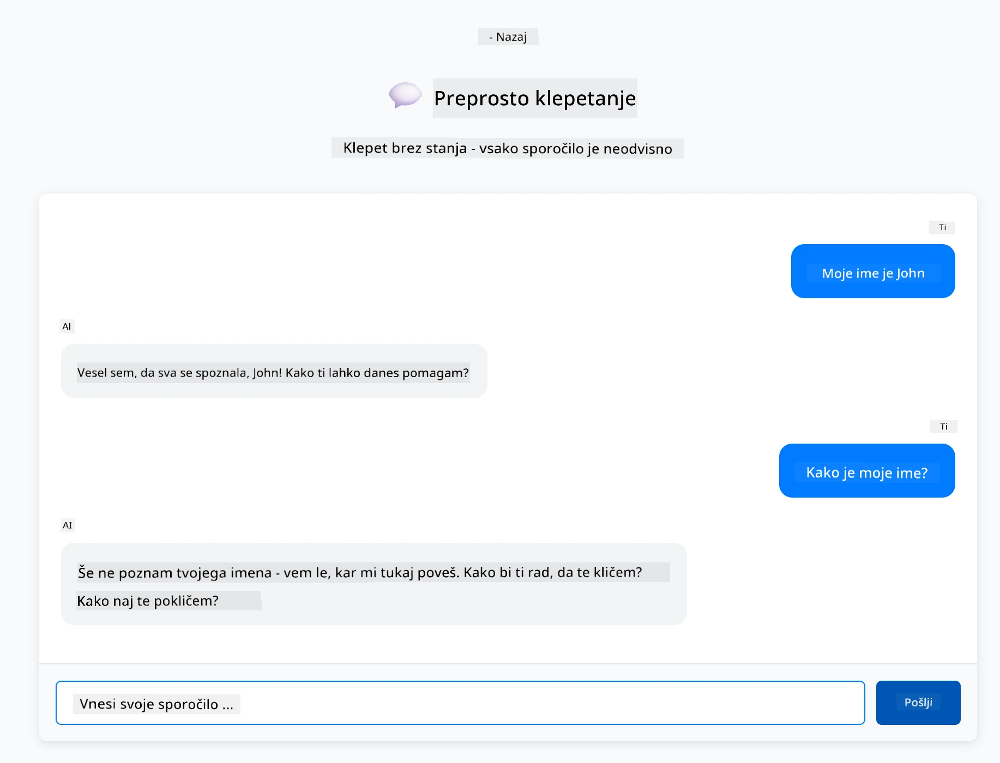
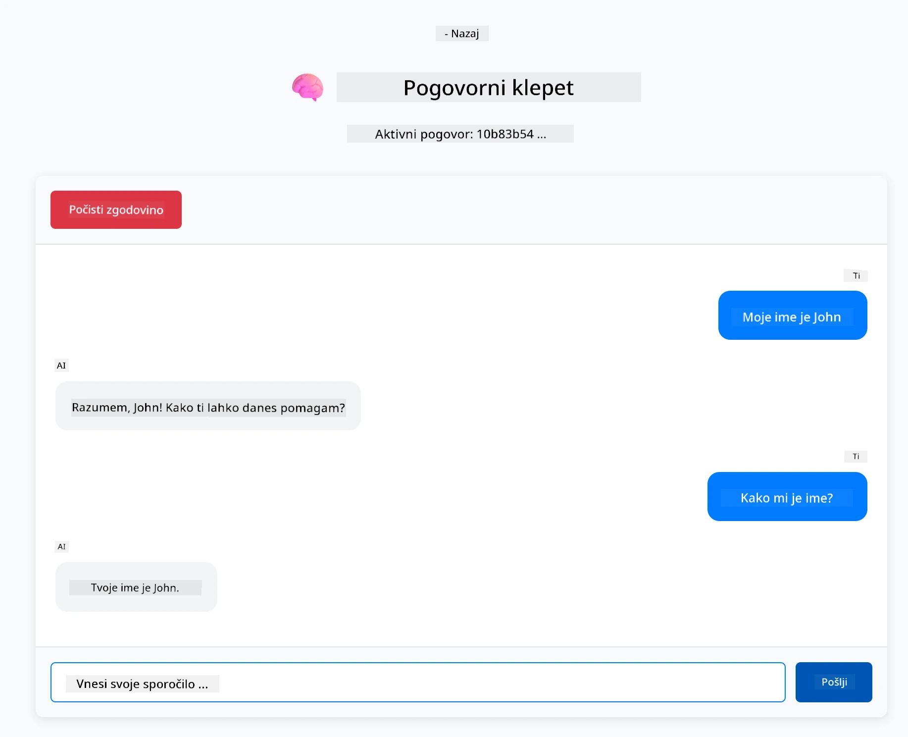

<!--
CO_OP_TRANSLATOR_METADATA:
{
  "original_hash": "c3e07ca58d0b8a3f47d3bf5728541e0a",
  "translation_date": "2025-12-13T14:09:09+00:00",
  "source_file": "01-introduction/README.md",
  "language_code": "sl"
}
-->
# Modul 01: Začetek z LangChain4j

## Kazalo

- [Kaj se boste naučili](../../../01-introduction)
- [Predpogoji](../../../01-introduction)
- [Razumevanje osnovnega problema](../../../01-introduction)
- [Razumevanje tokenov](../../../01-introduction)
- [Kako deluje pomnilnik](../../../01-introduction)
- [Kako to uporablja LangChain4j](../../../01-introduction)
- [Namestitev infrastrukture Azure OpenAI](../../../01-introduction)
- [Zagon aplikacije lokalno](../../../01-introduction)
- [Uporaba aplikacije](../../../01-introduction)
  - [Brezstanje klepeta (levi panel)](../../../01-introduction)
  - [Stanje klepeta (desni panel)](../../../01-introduction)
- [Naslednji koraki](../../../01-introduction)

## Kaj se boste naučili

Če ste opravili hiter začetek, ste videli, kako poslati pozive in dobiti odgovore. To je osnova, vendar resnične aplikacije potrebujejo več. Ta modul vas uči, kako zgraditi pogovorno AI, ki si zapomni kontekst in ohranja stanje - razlika med enkratnim prikazom in aplikacijo, pripravljeno za produkcijo.

V tem vodiču bomo uporabljali Azure OpenAI GPT-5, ker njegove napredne sposobnosti sklepanja naredijo vedenje različnih vzorcev bolj očitno. Ko dodate pomnilnik, boste jasno videli razliko. To olajša razumevanje, kaj vsak komponent prinaša vaši aplikaciji.

Zgradili boste eno aplikacijo, ki prikazuje oba vzorca:

**Brezstanje klepet** - Vsak zahtevek je neodvisen. Model nima spomina na prejšnja sporočila. To je vzorec, ki ste ga uporabili v hitrem začetku.

**Stanje pogovora** - Vsak zahtevek vključuje zgodovino pogovora. Model ohranja kontekst skozi več krogov. To je tisto, kar zahtevajo produkcijske aplikacije.

## Predpogoji

- Azure naročnina z dostopom do Azure OpenAI
- Java 21, Maven 3.9+
- Azure CLI (https://learn.microsoft.com/en-us/cli/azure/install-azure-cli)
- Azure Developer CLI (azd) (https://learn.microsoft.com/en-us/azure/developer/azure-developer-cli/install-azd)

> **Opomba:** Java, Maven, Azure CLI in Azure Developer CLI (azd) so prednameščeni v priloženem devcontainerju.

> **Opomba:** Ta modul uporablja GPT-5 na Azure OpenAI. Namestitev je samodejno konfigurirana preko `azd up` - ne spreminjajte imena modela v kodi.

## Razumevanje osnovnega problema

Jezikovni modeli so brezstanje. Vsak API klic je neodvisen. Če pošljete "Moje ime je John" in nato vprašate "Kako je moje ime?", model nima pojma, da ste se pravkar predstavili. Vsak zahtevek obravnava, kot da je prvi pogovor, ki ste ga kdaj imeli.

To je v redu za preprosta vprašanja in odgovore, vendar je neuporabno za resne aplikacije. Botom za podporo strankam je treba zapomniti, kaj ste jim povedali. Osebni asistenti potrebujejo kontekst. Vsak večkrožni pogovor zahteva pomnilnik.



*Razlika med brezstanje (neodvisni klici) in stanje (zavedanje konteksta) pogovori*

## Razumevanje tokenov

Preden se poglobite v pogovore, je pomembno razumeti tokene - osnovne enote besedila, ki jih jezikovni modeli obdelujejo:



*Primer, kako se besedilo razdeli na tokene - "I love AI!" postane 4 ločene obdelovalne enote*

Tokeni so način, kako AI modeli merijo in obdelujejo besedilo. Besede, ločila in celo presledki so lahko tokeni. Vaš model ima omejitev, koliko tokenov lahko obdeluje naenkrat (400.000 za GPT-5, z do 272.000 vhodnimi tokeni in 128.000 izhodnimi tokeni). Razumevanje tokenov vam pomaga upravljati dolžino pogovora in stroške.

## Kako deluje pomnilnik

Pomnilnik klepeta rešuje problem brezstanja z ohranjanjem zgodovine pogovora. Preden pošljete zahtevek modelu, okvir doda relevantna prejšnja sporočila. Ko vprašate "Kako je moje ime?", sistem dejansko pošlje celotno zgodovino pogovora, kar omogoča modelu, da vidi, da ste prej rekli "Moje ime je John."

LangChain4j zagotavlja implementacije pomnilnika, ki to samodejno upravljajo. Izberete, koliko sporočil želite obdržati, okvir pa upravlja kontekstno okno.



*MessageWindowChatMemory ohranja drseče okno nedavnih sporočil in samodejno odstranjuje starejša*

## Kako to uporablja LangChain4j

Ta modul razširja hiter začetek z integracijo Spring Boot in dodajanjem pomnilnika pogovora. Tako se deli povežejo:

**Odvisnosti** - Dodajte dve knjižnici LangChain4j:

```xml
<dependency>
    <groupId>dev.langchain4j</groupId>
    <artifactId>langchain4j</artifactId> <!-- Inherited from BOM in root pom.xml -->
</dependency>
<dependency>
    <groupId>dev.langchain4j</groupId>
    <artifactId>langchain4j-open-ai-official</artifactId> <!-- Inherited from BOM in root pom.xml -->
</dependency>
```

**Model klepeta** - Konfigurirajte Azure OpenAI kot Spring bean ([LangChainConfig.java](../../../01-introduction/src/main/java/com/example/langchain4j/config/LangChainConfig.java)):

```java
@Bean
public OpenAiOfficialChatModel openAiOfficialChatModel() {
    return OpenAiOfficialChatModel.builder()
            .baseUrl(azureEndpoint)
            .apiKey(azureApiKey)
            .modelName(deploymentName)
            .timeout(Duration.ofMinutes(5))
            .maxRetries(3)
            .build();
}
```

Builder bere poverilnice iz okoljskih spremenljivk, nastavljenih z `azd up`. Nastavitev `baseUrl` na vaš Azure endpoint omogoča, da OpenAI klient deluje z Azure OpenAI.

**Pomnilnik pogovora** - Sledite zgodovini klepeta z MessageWindowChatMemory ([ConversationService.java](../../../01-introduction/src/main/java/com/example/langchain4j/service/ConversationService.java)):

```java
ChatMemory memory = MessageWindowChatMemory.withMaxMessages(10);

memory.add(UserMessage.from("My name is John"));
memory.add(AiMessage.from("Nice to meet you, John!"));

memory.add(UserMessage.from("What's my name?"));
AiMessage aiMessage = chatModel.chat(memory.messages()).aiMessage();
memory.add(aiMessage);
```

Ustvarite pomnilnik z `withMaxMessages(10)`, da obdržite zadnjih 10 sporočil. Dodajte uporabniška in AI sporočila z tipiziranimi ovojniki: `UserMessage.from(text)` in `AiMessage.from(text)`. Zgodovino pridobite z `memory.messages()` in jo pošljete modelu. Storitev hrani ločene primere pomnilnika za vsak ID pogovora, kar omogoča več uporabnikom hkratno klepetanje.

> **🤖 Poskusite z [GitHub Copilot](https://github.com/features/copilot) Chat:** Odprite [`ConversationService.java`](../../../01-introduction/src/main/java/com/example/langchain4j/service/ConversationService.java) in vprašajte:
> - "Kako MessageWindowChatMemory odloči, katera sporočila odstrani, ko je okno polno?"
> - "Ali lahko implementiram lastno shranjevanje pomnilnika z uporabo baze podatkov namesto v pomnilniku?"
> - "Kako bi dodal povzemanje za stiskanje stare zgodovine pogovora?"

Brezstanje klepet končna točka popolnoma preskoči pomnilnik - samo `chatModel.chat(prompt)` kot v hitrem začetku. Stanje končna točka doda sporočila v pomnilnik, pridobi zgodovino in vključuje ta kontekst pri vsakem zahtevku. Enaka konfiguracija modela, različni vzorci.

## Namestitev infrastrukture Azure OpenAI

**Bash:**
```bash
cd 01-introduction
azd up  # Izberite naročnino in lokacijo (priporočeno eastus2)
```

**PowerShell:**
```powershell
cd 01-introduction
azd up  # Izberite naročnino in lokacijo (priporočeno eastus2)
```

> **Opomba:** Če naletite na napako časovne omejitve (`RequestConflict: Cannot modify resource ... provisioning state is not terminal`), preprosto zaženite `azd up` znova. Azure viri se morda še vedno nameščajo v ozadju, ponovni poskus pa omogoči dokončanje namestitve, ko viri dosežejo terminalno stanje.

To bo:
1. Namestilo Azure OpenAI vir z modeli GPT-5 in text-embedding-3-small
2. Samodejno ustvarilo `.env` datoteko v korenu projekta s poverilnicami
3. Nastavilo vse potrebne okoljske spremenljivke

**Imate težave z namestitvijo?** Oglejte si [README infrastrukture](infra/README.md) za podrobno odpravljanje težav, vključno s konflikti imen poddomen, ročnimi koraki namestitve v Azure Portal in navodili za konfiguracijo modela.

**Preverite, ali je namestitev uspela:**

**Bash:**
```bash
cat ../.env  # Prikazati bi moral AZURE_OPENAI_ENDPOINT, API_KEY itd.
```

**PowerShell:**
```powershell
Get-Content ..\.env  # Prikazati bi moral AZURE_OPENAI_ENDPOINT, API_KEY itd.
```

> **Opomba:** Ukaz `azd up` samodejno ustvari `.env` datoteko. Če jo morate kasneje posodobiti, lahko bodisi ročno uredite `.env` datoteko ali jo ponovno ustvarite z zagonom:
>
> **Bash:**
> ```bash
> cd ..
> bash .azd-env.sh
> ```
>
> **PowerShell:**
> ```powershell
> cd ..
> .\.azd-env.ps1
> ```

## Zagon aplikacije lokalno

**Preverite namestitev:**

Prepričajte se, da `.env` datoteka obstaja v korenski mapi z Azure poverilnicami:

**Bash:**
```bash
cat ../.env  # Prikazati bi moral AZURE_OPENAI_ENDPOINT, API_KEY, DEPLOYMENT
```

**PowerShell:**
```powershell
Get-Content ..\.env  # Prikazati bi moral AZURE_OPENAI_ENDPOINT, API_KEY, DEPLOYMENT
```

**Zaženite aplikacije:**

**Možnost 1: Uporaba Spring Boot nadzorne plošče (priporočeno za uporabnike VS Code)**

Dev container vključuje razširitev Spring Boot Dashboard, ki nudi vizualni vmesnik za upravljanje vseh Spring Boot aplikacij. Najdete jo v vrstici aktivnosti na levi strani VS Code (poiščite ikono Spring Boot).

Iz Spring Boot Dashboard lahko:
- Vidite vse razpoložljive Spring Boot aplikacije v delovnem prostoru
- Zaženete/ustavite aplikacije z enim klikom
- V realnem času spremljate dnevnike aplikacij
- Nadzorujete stanje aplikacij

Preprosto kliknite gumb za predvajanje poleg "introduction" za zagon tega modula ali zaženite vse module hkrati.



**Možnost 2: Uporaba shell skript**

Zaženite vse spletne aplikacije (moduli 01-04):

**Bash:**
```bash
cd ..  # Iz korenskega imenika
./start-all.sh
```

**PowerShell:**
```powershell
cd ..  # Iz korenskega imenika
.\start-all.ps1
```

Ali zaženite samo ta modul:

**Bash:**
```bash
cd 01-introduction
./start.sh
```

**PowerShell:**
```powershell
cd 01-introduction
.\start.ps1
```

Obe skripti samodejno naložita okoljske spremenljivke iz korenske `.env` datoteke in bosta zgradili JAR-je, če ti ne obstajajo.

> **Opomba:** Če želite pred zagonom ročno zgraditi vse module:
>
> **Bash:**
> ```bash
> cd ..  # Go to root directory
> mvn clean package -DskipTests
> ```
>
> **PowerShell:**
> ```powershell
> cd ..  # Go to root directory
> mvn clean package -DskipTests
> ```

Odprite http://localhost:8080 v vašem brskalniku.

**Za ustavitev:**

**Bash:**
```bash
./stop.sh  # Samo ta modul
# Ali
cd .. && ./stop-all.sh  # Vsi moduli
```

**PowerShell:**
```powershell
.\stop.ps1  # Samo ta modul
# Ali
cd ..; .\stop-all.ps1  # Vsi moduli
```

## Uporaba aplikacije

Aplikacija nudi spletni vmesnik z dvema implementacijama klepeta ena ob drugi.



*Nadzorna plošča prikazuje možnosti Simple Chat (brezstanje) in Conversational Chat (stanje)*

### Brezstanje klepeta (levi panel)

Poskusite najprej to. Vprašajte "Moje ime je John" in nato takoj "Kako je moje ime?" Model si ne bo zapomnil, ker je vsako sporočilo neodvisno. To prikazuje osnovni problem integracije jezikovnega modela - brez konteksta pogovora.



*AI si ne zapomni vašega imena iz prejšnjega sporočila*

### Stanje klepeta (desni panel)

Zdaj poskusite isti zaporedje tukaj. Vprašajte "Moje ime je John" in nato "Kako je moje ime?" Tokrat si zapomni. Razlika je MessageWindowChatMemory - ohranja zgodovino pogovora in jo vključuje v vsak zahtevek. Tako deluje produkcijska pogovorna AI.



*AI si zapomni vaše ime iz prej v pogovoru*

Oba panela uporabljata isti GPT-5 model. Edina razlika je pomnilnik. To jasno pokaže, kaj pomnilnik prinaša vaši aplikaciji in zakaj je bistven za resnične primere uporabe.

## Naslednji koraki

**Naslednji modul:** [02-prompt-engineering - Inženiring pozivov z GPT-5](../02-prompt-engineering/README.md)

---

**Navigacija:** [← Prejšnji: Modul 00 - Hiter začetek](../00-quick-start/README.md) | [Nazaj na glavno](../README.md) | [Naslednji: Modul 02 - Inženiring pozivov →](../02-prompt-engineering/README.md)

---

<!-- CO-OP TRANSLATOR DISCLAIMER START -->
**Omejitev odgovornosti**:
Ta dokument je bil preveden z uporabo storitve za prevajanje z umetno inteligenco [Co-op Translator](https://github.com/Azure/co-op-translator). Čeprav si prizadevamo za natančnost, vas opozarjamo, da avtomatizirani prevodi lahko vsebujejo napake ali netočnosti. Izvirni dokument v njegovem izvirnem jeziku velja za avtoritativni vir. Za ključne informacije priporočamo strokovni človeški prevod. Za morebitna nesporazume ali napačne interpretacije, ki izhajajo iz uporabe tega prevoda, ne odgovarjamo.
<!-- CO-OP TRANSLATOR DISCLAIMER END -->