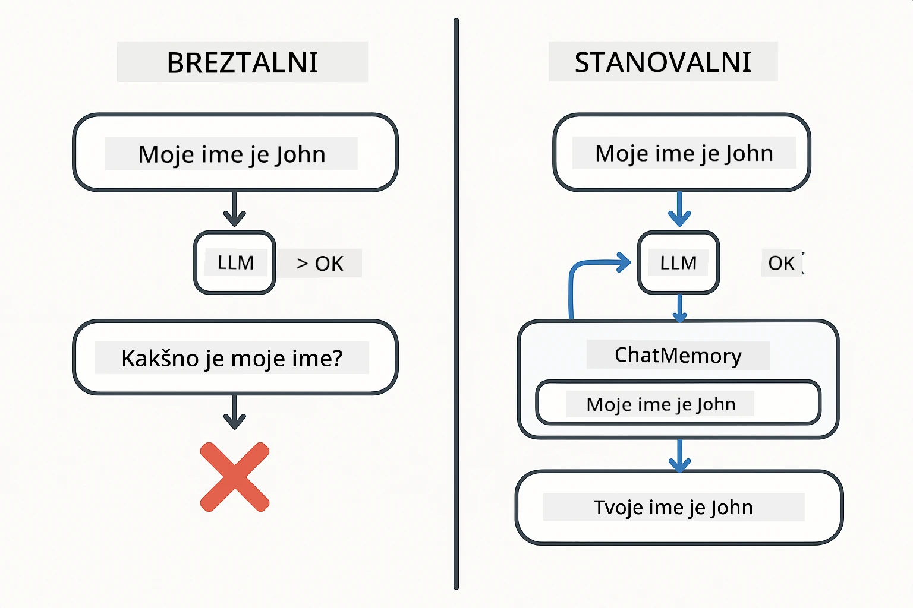
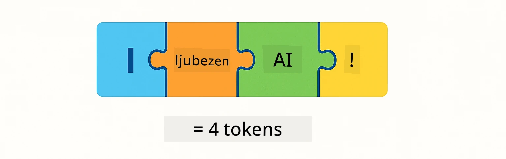
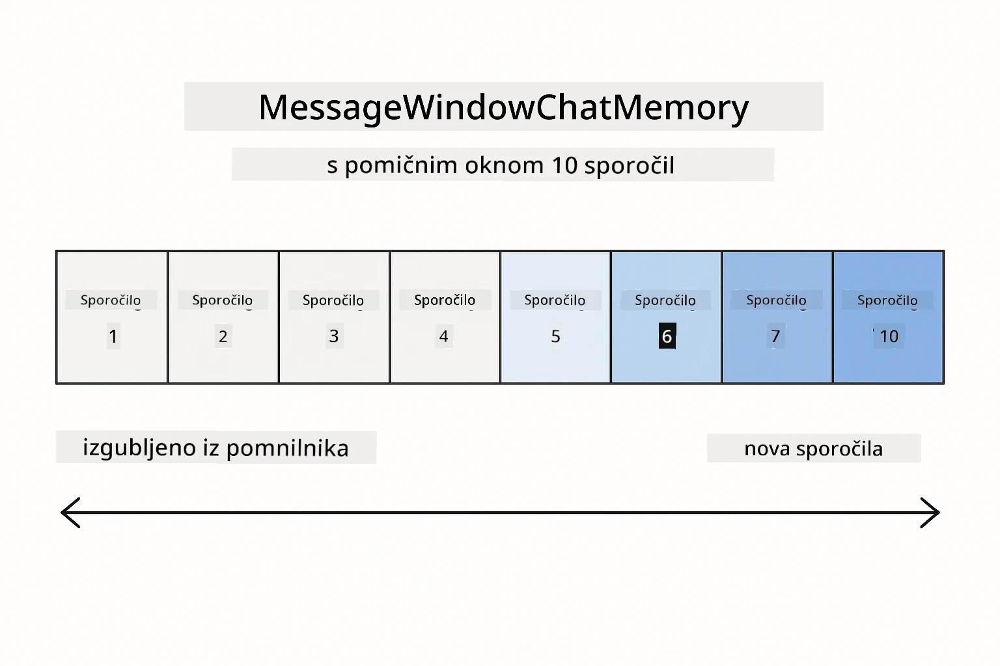
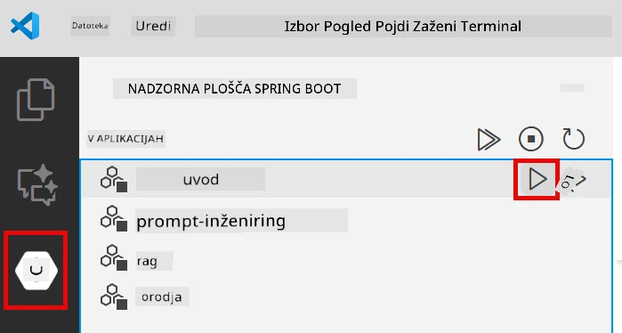
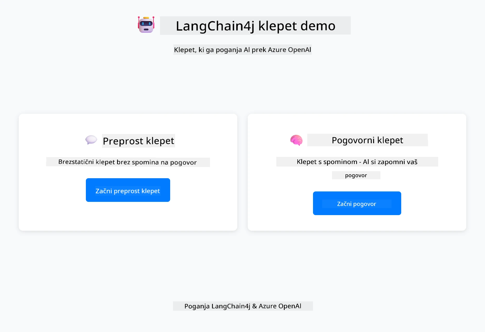
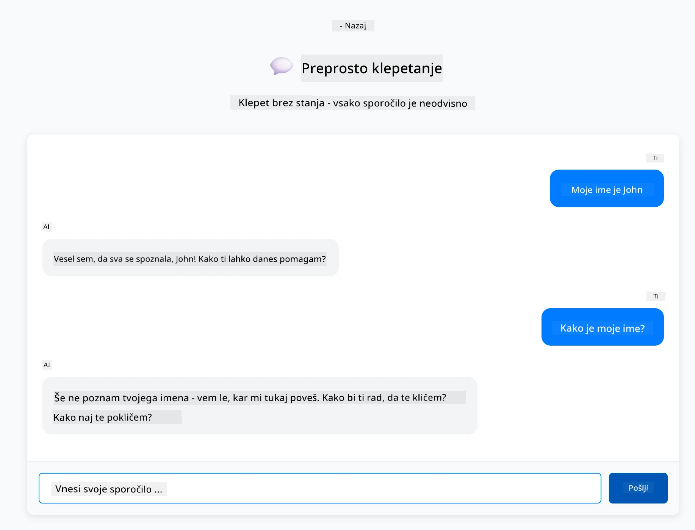
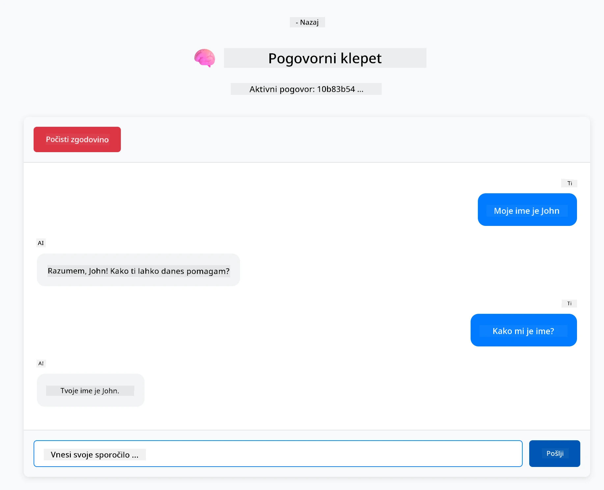

# Modul 01: Začetek z LangChain4j

## Kazalo

- [Video vodnik](#video-vodnik)
- [Kaj se boste naučili](#kaj-se-boste-naucili)
- [Predpogoji](#predpogoji)
- [Razumevanje jedrnega problema](#razumevanje-jedrnega-problema)
- [Razumevanje žetonov](#razumevanje-zetonov)
- [Kako deluje pomnilnik](#kako-deluje-pomnilnik)
- [Kako to uporablja LangChain4j](#kako-to-uporablja-langchain4j)
- [Implementacija infrastrukture Azure OpenAI](#implementacija-infrastrukture-azure-openai)
- [Zagon aplikacije lokalno](#zagon-aplikacije-lokalno)
- [Uporaba aplikacije](#uporaba-aplikacije)
  - [Nihran klepet (levi panel)](#nihran-klepet-leve-panel)
  - [Stalni klepet (desni panel)](#stalni-klepet-desni-panel)
- [Naslednji koraki](#naslednji-koraki)

## Video vodnik

Oglejte si to v živo predstavitev, ki razlaga, kako začeti s tem modulom:

<a href="https://www.youtube.com/live/nl_troDm8rQ?si=6b85S8xGjWnT2fX9"></a>

## Kaj se boste naučili

To je vaše izhodišče z LangChain4j in Azure OpenAI. Začnemo z osnovami in pričenjamo graditi aplikacije v produkcijskem slogu. Ta modul se osredotoča na pogovorno AI, ki si zapomni kontekst in ohranja stanje — temeljne koncepte, na katerih gradijo vsi kasnejši moduli.

V tem vodiču bomo uporabljali GPT-5.2 Azure OpenAI, saj njegove napredne sposobnosti razmišljanja omogočajo lažje razumevanje vedenja različnih vzorcev. Ko dodate pomnilnik, boste jasno videli razliko. To olajša razumevanje, kaj vsak komponenta prinaša vaši aplikaciji.

Zgradili boste eno aplikacijo, ki ponazarja oba vzorca:

**Nihran klepet** – Vsak zahtevek je neodvisen. Model nima pomnilnika prejšnjih sporočil. To je najpreprostejše izhodišče.

**Stalni pogovor** – Vsak zahtevek vključuje zgodovino pogovora. Model ohranja kontekst skozi več potez. To je tisto, kar zahtevajo produkcijske aplikacije.

## Predpogoji

- Azure naročnina z dostopom do Azure OpenAI
- Java 21, Maven 3.9+
- Azure CLI (https://learn.microsoft.com/en-us/cli/azure/install-azure-cli)
- Azure Developer CLI (azd) (https://learn.microsoft.com/en-us/azure/developer/azure-developer-cli/install-azd)

> **Opomba:** Java, Maven, Azure CLI in Azure Developer CLI (azd) so predhodno nameščeni v ponujenem devcontainer.

> **Opomba:** Ta modul uporablja GPT-5.2 na Azure OpenAI. Implementacija je samodejno konfigurirana prek `azd up` - ne spreminjajte imena modela v kodi.

## Razumevanje jedrnega problema

Jezikovni modeli so brezstanje. Vsak API klic je neodvisen. Če pošljete "Moje ime je John" in nato vprašate "Kako je moje ime?", model nima pojma, da ste se pravkar predstavili. Vsak zahtevek obravnava, kot da je prvi pogovor, ki ste ga kdaj imeli.

To je primerno za preprosta vprašanja in odgovore, vendar neuporabno za resnične aplikacije. Bot-i za službo za stranke morajo vedeti, kaj ste jim povedali. Osebni asistenti potrebujejo kontekst. Vsak pogovor z več potezami zahteva pomnilnik.

Spodnja shema prikazuje razliko med obema pristopoma – na levi je brezstanje klic, ki pozabi vaše ime; na desni pa statičen klic, ki ga podpira ChatMemory in si ga zapomni.



*Razlika med nihranim (neodvisnimi klici) in stalnim (kontekstno ozaveščenim) pogovorom*

## Razumevanje žetonov

Preden se poglobite v pogovore, je pomembno razumeti žetone – osnovne enote besedila, ki jih jezikovni modeli obdelujejo:



*Primer kako je besedilo razčlenjeno v žetone - "I love AI!" postane 4 ločene obdelovalne enote*

Žetoni so način, kako AI modeli merijo in obdelujejo besedilo. Besede, ločila in celo presledki so lahko žetoni. Vaš model ima omejitev, koliko žetonov lahko obdeluje naenkrat (400.000 za GPT-5.2, z do 272.000 vhodnimi žetoni in 128.000 izhodnimi žetoni). Razumevanje žetonov vam pomaga upravljati dolžino pogovora in stroške.

## Kako deluje pomnilnik

Klepetalni pomnilnik rešuje brezstanje problem z ohranjanjem zgodovine pogovora. Preden pošljete zahtevo modelu, ogrodje doda relevantna prejšnja sporočila na začetek. Ko vprašate "Kako je moje ime?", sistem dejansko pošlje celotno zgodovino pogovora, kar modelu omogoča, da vidi, da ste prej rekli "Moje ime je John."

LangChain4j omogoča implementacije pomnilnika, ki to samodejno obravnavajo. Izberete, koliko sporočil želite obdržati, ogrodje pa upravlja s kontekstnim oknom. Spodnja shema prikazuje, kako MessageWindowChatMemory ohranja pomično okno nedavnih sporočil.



*MessageWindowChatMemory ohranja pomično okno nedavnih sporočil in samodejno odvrže starejša*

## Kako to uporablja LangChain4j

Ta modul integrira Spring Boot in dodaja pomnilnik pogovorov. Tako se deli povezujejo:

**Odvisnosti** – Dodajte dve knjižnici LangChain4j:

```xml
<dependency>
    <groupId>dev.langchain4j</groupId>
    <artifactId>langchain4j</artifactId> <!-- Inherited from BOM in root pom.xml -->
</dependency>
<dependency>
    <groupId>dev.langchain4j</groupId>
    <artifactId>langchain4j-open-ai-official</artifactId> <!-- Inherited from BOM in root pom.xml -->
</dependency>
```
  
**Klepetalni model** – Konfigurirajte Azure OpenAI kot Spring bean ([LangChainConfig.java](../../../01-introduction/src/main/java/com/example/langchain4j/config/LangChainConfig.java)):

```java
@Bean
public OpenAiOfficialChatModel openAiOfficialChatModel() {
    return OpenAiOfficialChatModel.builder()
            .baseUrl(azureEndpoint)
            .apiKey(azureApiKey)
            .modelName(deploymentName)
            .timeout(Duration.ofMinutes(5))
            .maxRetries(3)
            .build();
}
```
  
Graditelj prebere poverilnice iz okolijskih spremenljivk, nastavljenih z `azd up`. Nastavitev `baseUrl` na vaš Azure končni točki omogoči, da OpenAI odjemalec deluje z Azure OpenAI.

**Pomnilnik pogovorov** – Sledenje zgodovine klepeta z MessageWindowChatMemory ([ConversationService.java](../../../01-introduction/src/main/java/com/example/langchain4j/service/ConversationService.java)):

```java
ChatMemory memory = MessageWindowChatMemory.withMaxMessages(10);

memory.add(UserMessage.from("My name is John"));
memory.add(AiMessage.from("Nice to meet you, John!"));

memory.add(UserMessage.from("What's my name?"));
AiMessage aiMessage = chatModel.chat(memory.messages()).aiMessage();
memory.add(aiMessage);
```
  
Pomnilnik ustvarite z `withMaxMessages(10)`, da obdržite zadnjih 10 sporočil. Dodajate sporočila uporabnika in AI s tipiziranimi ovoji: `UserMessage.from(text)` in `AiMessage.from(text)`. Zgodovino pridobite z `memory.messages()` in jo pošljete modelu. Storitev hrani ločene instance pomnilnika za vsak ID pogovora, kar omogoča, da lahko več uporabnikov hkrati klepeta.

> **🤖 Preizkusite s [GitHub Copilot](https://github.com/features/copilot) klepetom:** Odprite [`ConversationService.java`](../../../01-introduction/src/main/java/com/example/langchain4j/service/ConversationService.java) in vprašajte:
> - "Kako MessageWindowChatMemory odloči, katera sporočila vrže, ko je okno polno?"
> - "Ali lahko implementiram prilagojeno shranjevanje pomnilnika z uporabo baze podatkov namesto pomnilnika v spominu?"
> - "Kako bi dodal povzemanje za stiskanje stare zgodovine pogovora?"

Klepetalna točka brez pomnilnika popolnoma preskoči pomnilnik - samo `chatModel.chat(prompt)` kot pri hitrem zagonu. Statična točka dodaja sporočila v pomnilnik, pridobi zgodovino in skupaj z vsakim zahtevkom vključuje ta kontekst. Enaka konfiguracija modela, različni vzorci.

## Implementacija infrastrukture Azure OpenAI

**Bash:**
```bash
cd 01-introduction
azd up  # Izberite naročnino in lokacijo (priporočeno eastus2)
```
  
**PowerShell:**
```powershell
cd 01-introduction
azd up  # Izberite naročnino in lokacijo (priporočeno eastus2)
```
  
> **Opomba:** Če naletite na napako poteka časa (`RequestConflict: Cannot modify resource ... provisioning state is not terminal`), preprosto znova zaženite `azd up`. Azure viri se morda še vedno konfigurirajo v ozadju, ponovno poskus omogoči izvedbo implementacije, ko viri dosežejo končno stanje.

To bo:  
1. Implementiralo Azure OpenAI vir s GPT-5.2 in modeli text-embedding-3-small  
2. Samodejno ustvarilo `.env` datoteko v korenu projekta s poverilnicami  
3. Nastavilo vse zahtevane okoljske spremenljivke

**Imate težave z implementacijo?** Oglejte si [README infrastrukture](infra/README.md) za podrobna navodila za odpravljanje težav, vključno s konflikti imen poddomen, koraki ročne implementacije v Azure Portal in nasveti za konfiguracijo modela.

**Preverite, ali je implementacija uspela:**

**Bash:**
```bash
cat ../.env  # Naj bi prikazoval AZURE_OPENAI_ENDPOINT, API_KEY itd.
```
  
**PowerShell:**
```powershell
Get-Content ..\.env  # Mora prikazati AZURE_OPENAI_ENDPOINT, API_KEY itd.
```
  
> **Opomba:** Ukaz `azd up` samodejno ustvari `.env` datoteko. Če jo morate pozneje posodobiti, lahko datoteko ročno uredite ali jo znova ustvarite z zagonom:
>
> **Bash:**
> ```bash
> cd ..
> bash .azd-env.sh
> ```
>  
> **PowerShell:**
> ```powershell
> cd ..
> .\.azd-env.ps1
> ```
  
## Zagon aplikacije lokalno

**Preverite implementacijo:**

Prepričajte se, da `.env` datoteka obstaja v korenski mapi z Azure poverilnicami. Zaženite iz mape modula (`01-introduction/`):

**Bash:**
```bash
cat ../.env  # Naj prikazuje AZURE_OPENAI_ENDPOINT, API_KEY, DEPLOYMENT
```
  
**PowerShell:**
```powershell
Get-Content ..\.env  # Naj prikaže AZURE_OPENAI_ENDPOINT, API_KEY, DEPLOYMENT
```
  
**Zaženite aplikacije:**

**Opcija 1: Uporaba Spring Boot Dashborda (priporočeno za uporabnike VS Code)**

Dev container vključuje razširitev Spring Boot Dashboard, ki nudi vizualno vmesnik za upravljanje vseh Spring Boot aplikacij. Nahaja se v vrstici dejavnosti na levi strani VS Code (poglejte za ikono Spring Boot).

Iz Spring Boot Dashborda lahko:  
- Vidite vse razpoložljive Spring Boot aplikacije v delovnem prostoru  
- Zaženete/ustavite aplikacije z enim klikom  
- Pregledate aplikacijske dnevnike v realnem času  
- Spremljate stanje aplikacij

Preprosto kliknite gumb za predvajanje poleg "introduction" za začetek tega modula ali zaženite vse module hkrati.



*Spring Boot Dashboard v VS Code — začnite, ustavite in spremljajte vse module na enem mestu*

**Opcija 2: Uporaba shell skript**

Zaženite vse spletne aplikacije (moduli 01-04):

**Bash:**
```bash
cd ..  # Iz korenskega imenika
./start-all.sh
```
  
**PowerShell:**
```powershell
cd ..  # Iz korenske mape
.\start-all.ps1
```
  
Ali zaženite samo ta modul:

**Bash:**
```bash
cd 01-introduction
./start.sh
```
  
**PowerShell:**
```powershell
cd 01-introduction
.\start.ps1
```
  
Obe skripti samodejno naložita okoljske spremenljivke iz korenske `.env` datoteke in bodo po potrebi sestavile JAR datoteke.

> **Opomba:** Če želite pred zagonom ročno sestaviti vse module:
>
> **Bash:**
> ```bash
> cd ..  # Go to root directory
> mvn clean package -DskipTests
> ```
>  
> **PowerShell:**
> ```powershell
> cd ..  # Go to root directory
> mvn clean package -DskipTests
> ```
  
Odprite http://localhost:8080 v brskalniku.

**Za ustavitev:**

**Bash:**
```bash
./stop.sh  # Samo ta modul
# Ali
cd .. && ./stop-all.sh  # Vsi moduli
```
  
**PowerShell:**
```powershell
.\stop.ps1  # Samo ta modul
# Ali
cd ..; .\stop-all.ps1  # Vsi moduli
```
  
## Uporaba aplikacije

Aplikacija nudi spletni vmesnik z dvema implementacijama klepeta ena ob drugi.



*Nadzorna plošča prikazuje možnosti Enostaven klepet (brezstanje) in Pogovorni klepet (stalni)*

### Nihran klepet (levi panel)

Najprej preizkusite to. Vprašajte "Moje ime je John" in nato takoj vprašajte "Kako je moje ime?" Model si ne bo zapomnil, ker je vsako sporočilo neodvisno. To prikazuje osnovni problem integracije jezikovnih modelov - ni konteksta pogovora.



*AI si ne zapomni vašega imena iz prejšnjega sporočila*

### Stalni klepet (desni panel)

Sedaj preizkusite isto zaporedje tukaj. Vprašajte "Moje ime je John" in nato "Kako je moje ime?" Tokrat si zapomni. Razlika je MessageWindowChatMemory – ohranja zgodovino pogovora in jo vključuje v vsak zahtevek. Tak deluje produkcijski pogovorni AI.



*AI si zapomni vaše ime iz prej v pogovoru*

Oba panela uporabljata isti GPT-5.2 model. Edina razlika je pomnilnik. To jasno pokaže, kaj pomnilnik prinaša vaši aplikaciji in zakaj je bistven za resnične primere.

## Naslednji koraki

**Naslednji modul:** [02-prompt-engineering - Oblikovanje pozivov z GPT-5.2](../02-prompt-engineering/README.md)

---

**Navigacija:** [← Nazaj na glavno](../README.md) | [Naprej: Modul 02 - Oblikovanje pozivov →](../02-prompt-engineering/README.md)

---

<!-- CO-OP TRANSLATOR DISCLAIMER START -->
**Omejitev odgovornosti**:
Ta dokument je bil preveden z uporabo AI prevajalske storitve [Co-op Translator](https://github.com/Azure/co-op-translator). Čeprav si prizadevamo za natančnost, vas prosimo, da upoštevate, da avtomatizirani prevodi lahko vsebujejo napake ali netočnosti. Izvirni dokument v njegovem izvirnem jeziku je treba obravnavati kot avtoritativni vir. Za kritične informacije je priporočljiv strokovni človeški prevod. Ne odgovarjamo za morebitna nesporazume ali napačne interpretacije, ki izhajajo iz uporabe tega prevoda.
<!-- CO-OP TRANSLATOR DISCLAIMER END -->