# Modul 02: Inženiring pozivov z GPT-5

## Kazalo

- [Kaj se boste naučili](../../../02-prompt-engineering)
- [Predpogoji](../../../02-prompt-engineering)
- [Razumevanje inženiringa pozivov](../../../02-prompt-engineering)
- [Kako to uporablja LangChain4j](../../../02-prompt-engineering)
- [Osnovni vzorci](../../../02-prompt-engineering)
- [Uporaba obstoječih Azure virov](../../../02-prompt-engineering)
- [Posnetki zaslona aplikacije](../../../02-prompt-engineering)
- [Raziščite vzorce](../../../02-prompt-engineering)
  - [Nizka proti visoki vnemi](../../../02-prompt-engineering)
  - [Izvajanje nalog (uvodi orodij)](../../../02-prompt-engineering)
  - [Samoreflektirajoča koda](../../../02-prompt-engineering)
  - [Strukturirana analiza](../../../02-prompt-engineering)
  - [Večkratni pogovor](../../../02-prompt-engineering)
  - [Razmišljanje korak za korakom](../../../02-prompt-engineering)
  - [Omejen izhod](../../../02-prompt-engineering)
- [Kaj se resnično učite](../../../02-prompt-engineering)
- [Naslednji koraki](../../../02-prompt-engineering)

## Kaj se boste naučili

V prejšnjem modulu ste videli, kako pomnilnik omogoča pogovorno AI in uporabili GitHub modele za osnovne interakcije. Zdaj se bomo osredotočili na to, kako postavljate vprašanja - same pozive - z uporabo Azure OpenAI GPT-5. Način, kako strukturirate svoje pozive, močno vpliva na kakovost odgovorov, ki jih prejmete.

Uporabljali bomo GPT-5, ker uvaja nadzor razmišljanja - modelu lahko poveste, koliko razmišljanja naj opravi pred odgovorom. To naredi različne strategije pozivanja bolj očitne in vam pomaga razumeti, kdaj uporabiti kateri pristop. Prav tako bomo imeli koristi od manj omejitev hitrosti Azure za GPT-5 v primerjavi z GitHub modeli.

## Predpogoji

- Zaključen Modul 01 (Azure OpenAI viri nameščeni)
- `.env` datoteka v korenski mapi z Azure poverilnicami (ustvarjena z `azd up` v Modulu 01)

> **Opomba:** Če niste zaključili Modula 01, najprej sledite navodilom za namestitev tam.

## Razumevanje inženiringa pozivov

Inženiring pozivov pomeni oblikovanje vhodnega besedila, ki vam dosledno prinaša želene rezultate. Ne gre le za postavljanje vprašanj - gre za strukturiranje zahtev, da model natančno razume, kaj želite in kako to dostaviti.

Pomislite nanj kot na dajanje navodil sodelavcu. "Popravi napako" je nejasno. "Popravi izjemo null pointer v UserService.java vrstica 45 z dodajanjem preverjanja null" je specifično. Jezikovni modeli delujejo enako - pomembna sta specifičnost in struktura.

## Kako to uporablja LangChain4j

Ta modul prikazuje napredne vzorce pozivanja z uporabo iste osnove LangChain4j iz prejšnjih modulov, s poudarkom na strukturi pozivov in nadzoru razmišljanja.

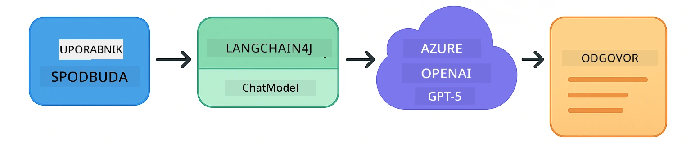

*Kako LangChain4j povezuje vaše pozive z Azure OpenAI GPT-5*

**Odvisnosti** - Modul 02 uporablja naslednje odvisnosti langchain4j definirane v `pom.xml`:
```xml
<dependency>
    <groupId>dev.langchain4j</groupId>
    <artifactId>langchain4j</artifactId> <!-- Inherited from BOM in root pom.xml -->
</dependency>
<dependency>
    <groupId>dev.langchain4j</groupId>
    <artifactId>langchain4j-open-ai-official</artifactId> <!-- Inherited from BOM in root pom.xml -->
</dependency>
```

**Konfiguracija OpenAiOfficialChatModel** - [LangChainConfig.java](../../../02-prompt-engineering/src/main/java/com/example/langchain4j/prompts/config/LangChainConfig.java)

Model klepeta je ročno konfiguriran kot Spring bean z uporabo uradnega OpenAI odjemalca, ki podpira Azure OpenAI končne točke. Ključna razlika od Modula 01 je, kako strukturiramo pozive, poslani `chatModel.chat()`, ne pa sama nastavitev modela.

**Sistemska in uporabniška sporočila** - [Gpt5PromptService.java](../../../02-prompt-engineering/src/main/java/com/example/langchain4j/prompts/service/Gpt5PromptService.java)

LangChain4j loči vrste sporočil za jasnost. `SystemMessage` določa vedenje in kontekst AI (npr. "Ste recenzent kode"), medtem ko `UserMessage` vsebuje dejansko zahtevo. Ta ločitev omogoča ohranjanje doslednega vedenja AI pri različnih uporabniških poizvedbah.

```java
SystemMessage systemMsg = SystemMessage.from(
    "You are a helpful Java programming expert."
);

UserMessage userMsg = UserMessage.from(
    "Explain what a List is in Java"
);

String response = chatModel.chat(systemMsg, userMsg);
```

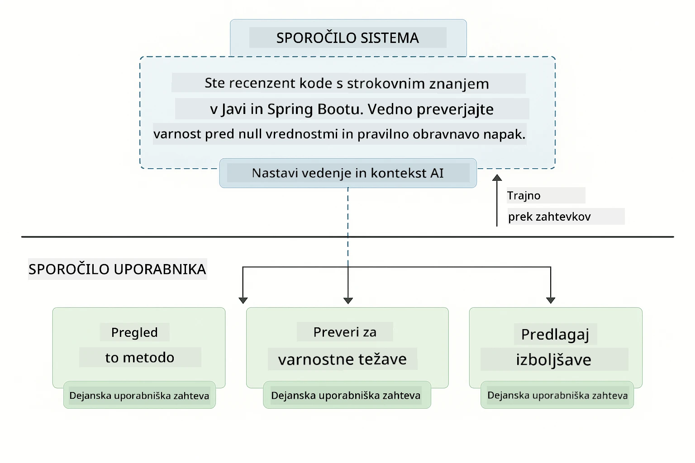

*SystemMessage zagotavlja trajen kontekst, medtem ko UserMessages vsebujejo posamezne zahteve*

**MessageWindowChatMemory za večkratni pogovor** - Za vzorec večkratnega pogovora ponovno uporabljamo `MessageWindowChatMemory` iz Modula 01. Vsaka seja dobi svojo instanco pomnilnika, shranjeno v `Map<String, ChatMemory>`, kar omogoča več sočasnih pogovorov brez mešanja konteksta.

**Predloge pozivov** - Pravi poudarek je na inženiringu pozivov, ne na novih LangChain4j API-jih. Vsak vzorec (nizka vnema, visoka vnema, izvajanje nalog itd.) uporablja isto metodo `chatModel.chat(prompt)`, vendar z natančno strukturiranimi nizi pozivov. XML oznake, navodila in oblikovanje so del besedila poziva, ne funkcije LangChain4j.

**Nadzor razmišljanja** - Razmišljanje GPT-5 je nadzorovano preko navodil v pozivih, kot so "največ 2 koraka razmišljanja" ali "temeljito raziskuj". To so tehnike inženiringa pozivov, ne konfiguracije LangChain4j. Knjižnica preprosto dostavi vaše pozive modelu.

Ključna ugotovitev: LangChain4j zagotavlja infrastrukturo (povezavo modela preko [LangChainConfig.java](../../../02-prompt-engineering/src/main/java/com/example/langchain4j/prompts/config/LangChainConfig.java), pomnilnik, upravljanje sporočil preko [Gpt5PromptService.java](../../../02-prompt-engineering/src/main/java/com/example/langchain4j/prompts/service/Gpt5PromptService.java)), medtem ko vas ta modul uči, kako ustvariti učinkovite pozive znotraj te infrastrukture.

## Osnovni vzorci

Ne vsa vprašanja zahtevajo enak pristop. Nekatera potrebujejo hitre odgovore, druga globoko razmišljanje. Nekatera potrebujejo vidno razmišljanje, druga samo rezultate. Ta modul pokriva osem vzorcev pozivanja - vsak optimiziran za različne scenarije. Preizkusili jih boste vse, da boste razumeli, kdaj kateri pristop najbolje deluje.

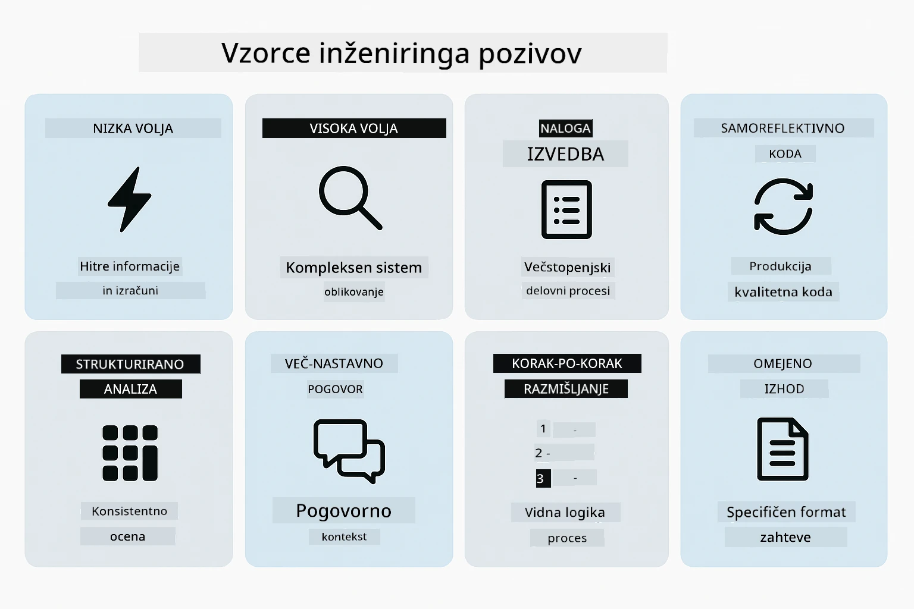

*Pregled osmih vzorcev inženiringa pozivov in njihovih primerov uporabe*

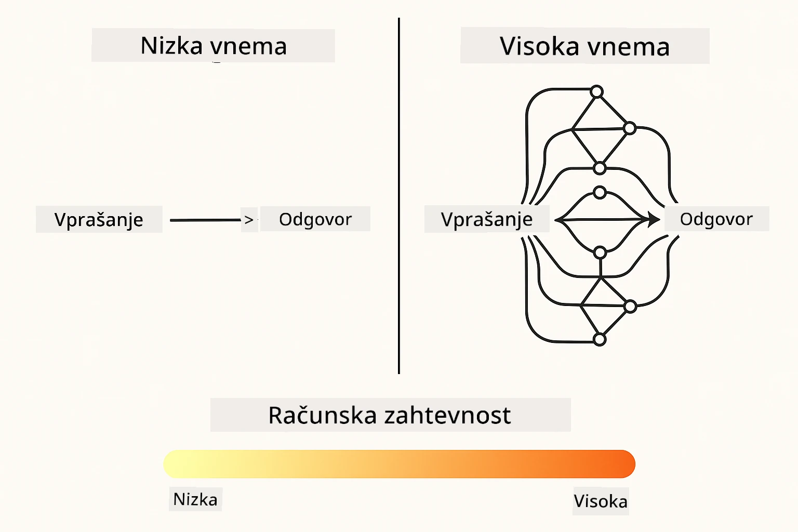

*Nizka vnema (hitro, neposredno) proti visoki vnemi (temeljito, raziskovalno) pristopi razmišljanja*

**Nizka vnema (hitro in osredotočeno)** - Za preprosta vprašanja, kjer želite hitre, neposredne odgovore. Model opravi minimalno razmišljanje - največ 2 koraka. Uporabite to za izračune, poizvedbe ali enostavna vprašanja.

```java
String prompt = """
    <reasoning_effort>low</reasoning_effort>
    <instruction>maximum 2 reasoning steps</instruction>
    
    What is 15% of 200?
    """;

String response = chatModel.chat(prompt);
```

> 💡 **Raziskujte z GitHub Copilot:** Odprite [`Gpt5PromptService.java`](../../../02-prompt-engineering/src/main/java/com/example/langchain4j/prompts/service/Gpt5PromptService.java) in vprašajte:
> - "Kakšna je razlika med vzorci nizke in visoke vneme pri pozivanju?"
> - "Kako XML oznake v pozivih pomagajo strukturirati odgovor AI?"
> - "Kdaj naj uporabim vzorce samorefleksije in kdaj neposredna navodila?"

**Visoka vnema (globoko in temeljito)** - Za kompleksne probleme, kjer želite celovito analizo. Model temeljito raziskuje in prikazuje podrobno razmišljanje. Uporabite to za sistemski dizajn, arhitekturne odločitve ali kompleksne raziskave.

```java
String prompt = """
    <reasoning_effort>high</reasoning_effort>
    <instruction>explore thoroughly, show detailed reasoning</instruction>
    
    Design a caching strategy for a high-traffic REST API.
    """;

String response = chatModel.chat(prompt);
```

**Izvajanje nalog (napredek korak za korakom)** - Za večstopenjske delovne tokove. Model poda načrt vnaprej, pripoveduje vsak korak med izvajanjem in nato poda povzetek. Uporabite to za migracije, implementacije ali katerikoli večstopenjski proces.

```java
String prompt = """
    <task>Create a REST endpoint for user registration</task>
    <preamble>Provide an upfront plan</preamble>
    <narration>Narrate each step as you work</narration>
    <summary>Summarize what was accomplished</summary>
    """;

String response = chatModel.chat(prompt);
```

Pozivanje z verigo misli (Chain-of-Thought) izrecno zahteva, da model pokaže svoj proces razmišljanja, kar izboljša natančnost pri kompleksnih nalogah. Razčlenitev korak za korakom pomaga tako ljudem kot AI razumeti logiko.

> **🤖 Preizkusite z [GitHub Copilot](https://github.com/features/copilot) Chat:** Vprašajte o tem vzorcu:
> - "Kako bi prilagodil vzorec izvajanja nalog za dolgotrajne operacije?"
> - "Kakšne so najboljše prakse za strukturiranje uvodov orodij v produkcijskih aplikacijah?"
> - "Kako lahko zajamem in prikažem vmesne posodobitve napredka v uporabniškem vmesniku?"

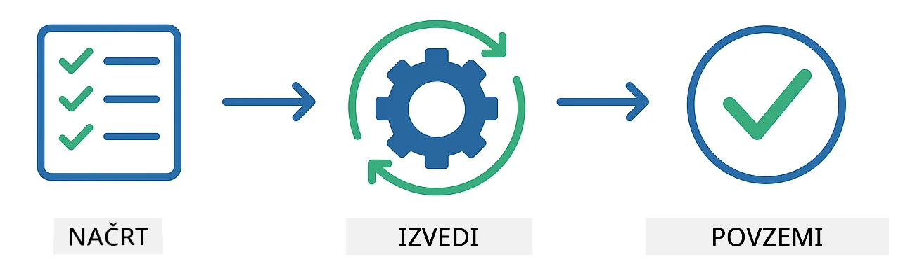

*Načrt → Izvedba → Povzetek delovnega toka za večstopenjske naloge*

**Samoreflektirajoča koda** - Za generiranje kode produkcijske kakovosti. Model generira kodo, jo preverja glede na kriterije kakovosti in jo iterativno izboljšuje. Uporabite to pri gradnji novih funkcij ali storitev.

```java
String prompt = """
    <task>Create an email validation service</task>
    <quality_criteria>
    - Correct logic and error handling
    - Best practices (clean code, proper naming)
    - Performance optimization
    - Security considerations
    </quality_criteria>
    <instruction>Generate code, evaluate against criteria, improve iteratively</instruction>
    """;

String response = chatModel.chat(prompt);
```

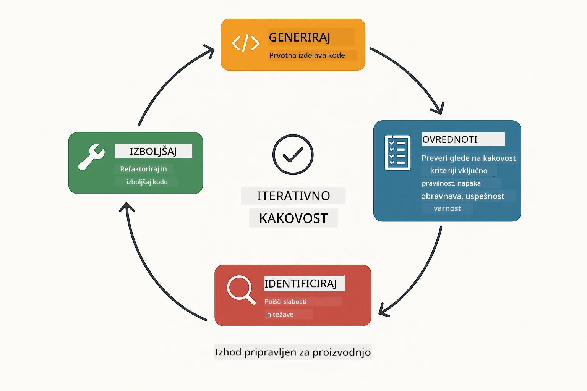

*Iterativni cikel izboljšav - generiraj, oceni, identificiraj težave, izboljšaj, ponovi*

**Strukturirana analiza** - Za dosledno ocenjevanje. Model pregleda kodo z uporabo fiksnega okvira (pravilnost, prakse, zmogljivost, varnost). Uporabite to za recenzije kode ali ocene kakovosti.

```java
String prompt = """
    <code>
    public List getUsers() {
        return database.query("SELECT * FROM users");
    }
    </code>
    
    <framework>
    Evaluate using these categories:
    1. Correctness - Logic and functionality
    2. Best Practices - Code quality
    3. Performance - Efficiency concerns
    4. Security - Vulnerabilities
    </framework>
    """;

String response = chatModel.chat(prompt);
```

> **🤖 Preizkusite z [GitHub Copilot](https://github.com/features/copilot) Chat:** Vprašajte o strukturirani analizi:
> - "Kako lahko prilagodim analitični okvir za različne vrste recenzij kode?"
> - "Kakšen je najboljši način za programatično razčlenjevanje in ukrepanje na strukturiran izhod?"
> - "Kako zagotovim dosledne ravni resnosti med različnimi recenzijskimi sejami?"

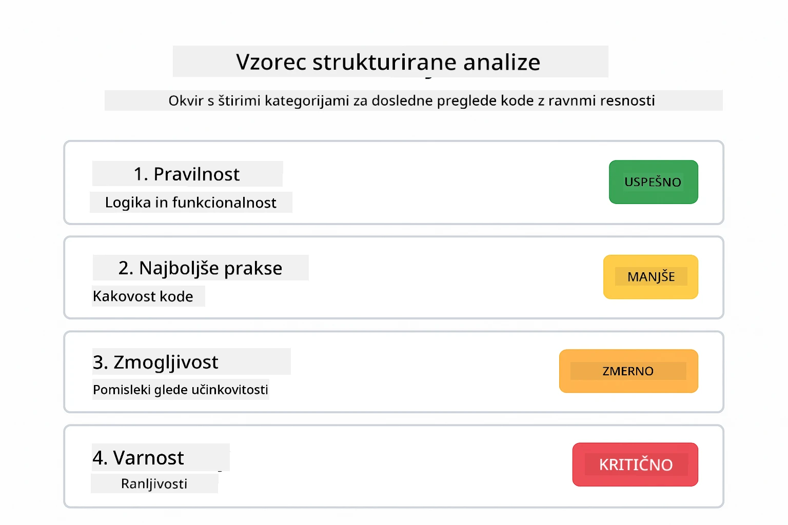

*Okvir s štirimi kategorijami za dosledne recenzije kode z ravnmi resnosti*

**Večkratni pogovor** - Za pogovore, ki potrebujejo kontekst. Model si zapomni prejšnja sporočila in gradi nanje. Uporabite to za interaktivne pomožne seje ali kompleksna vprašanja in odgovore.

```java
ChatMemory memory = MessageWindowChatMemory.withMaxMessages(10);

memory.add(UserMessage.from("What is Spring Boot?"));
AiMessage aiMessage1 = chatModel.chat(memory.messages()).aiMessage();
memory.add(aiMessage1);

memory.add(UserMessage.from("Show me an example"));
AiMessage aiMessage2 = chatModel.chat(memory.messages()).aiMessage();
memory.add(aiMessage2);
```

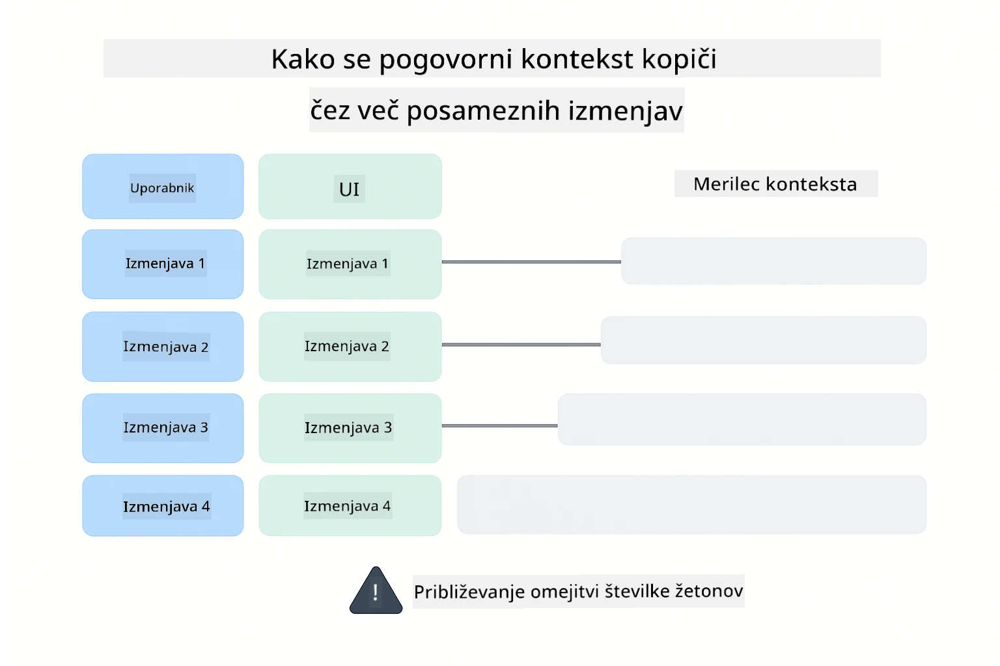

*Kako se kontekst pogovora kopiči skozi več krogov do dosega omejitve tokenov*

**Razmišljanje korak za korakom** - Za probleme, ki zahtevajo vidno logiko. Model pokaže izrecno razmišljanje za vsak korak. Uporabite to za matematične probleme, logične uganke ali kadar želite razumeti proces razmišljanja.

```java
String prompt = """
    <instruction>Show your reasoning step-by-step</instruction>
    
    If a train travels 120 km in 2 hours, then stops for 30 minutes,
    then travels another 90 km in 1.5 hours, what is the average speed
    for the entire journey including the stop?
    """;

String response = chatModel.chat(prompt);
```

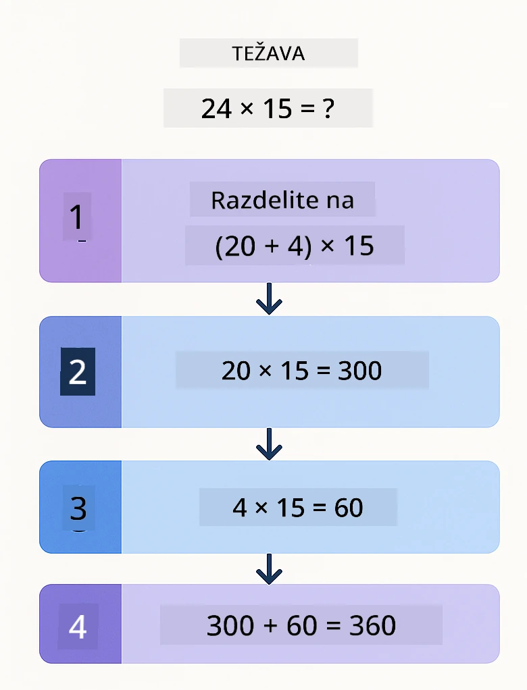

*Razčlenjevanje problemov v izrecne logične korake*

**Omejen izhod** - Za odgovore s specifičnimi zahtevami glede formata. Model strogo sledi pravilom formata in dolžine. Uporabite to za povzetke ali kadar potrebujete natančno strukturo izhoda.

```java
String prompt = """
    <constraints>
    - Exactly 100 words
    - Bullet point format
    - Technical terms only
    </constraints>
    
    Summarize the key concepts of machine learning.
    """;

String response = chatModel.chat(prompt);
```

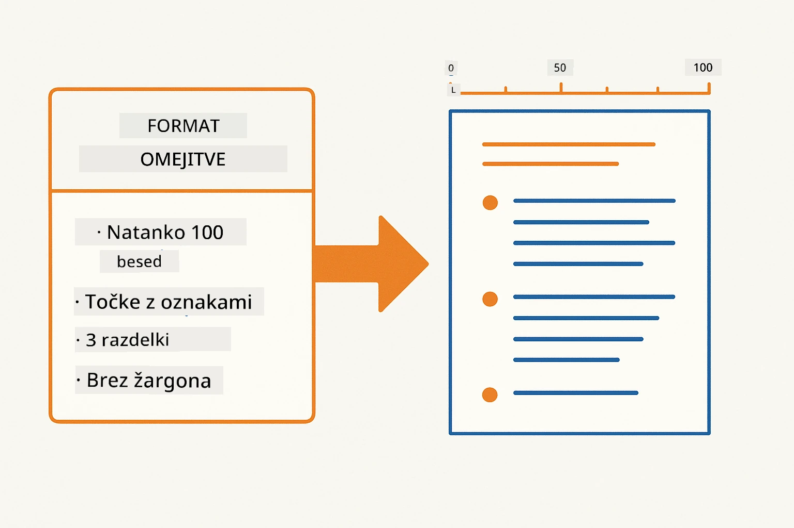

*Uveljavljanje specifičnih zahtev glede formata, dolžine in strukture*

## Uporaba obstoječih Azure virov

**Preverite namestitev:**

Prepričajte se, da `.env` datoteka obstaja v korenski mapi z Azure poverilnicami (ustvarjena med Modulom 01):
```bash
cat ../.env  # Prikazati bi moral AZURE_OPENAI_ENDPOINT, API_KEY, DEPLOYMENT
```

**Zaženite aplikacijo:**

> **Opomba:** Če ste že zagnali vse aplikacije z `./start-all.sh` iz Modula 01, ta modul že teče na vratih 8083. Lahko preskočite spodnje ukaze za zagon in pojdite neposredno na http://localhost:8083.

**Možnost 1: Uporaba Spring Boot nadzorne plošče (priporočeno za uporabnike VS Code)**

Razvojni kontejner vključuje razširitev Spring Boot Dashboard, ki nudi vizualni vmesnik za upravljanje vseh Spring Boot aplikacij. Najdete jo v vrstici aktivnosti na levi strani VS Code (poiščite ikono Spring Boot).

Iz Spring Boot nadzorne plošče lahko:
- Vidite vse razpoložljive Spring Boot aplikacije v delovnem prostoru
- Zaženete/ustavite aplikacije z enim klikom
- V realnem času spremljate dnevnike aplikacij
- Nadzorujete stanje aplikacij

Preprosto kliknite gumb za predvajanje zraven "prompt-engineering" za zagon tega modula ali zaženite vse module naenkrat.

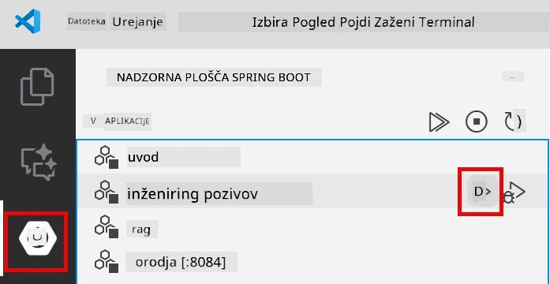

**Možnost 2: Uporaba shell skript**

Zaženite vse spletne aplikacije (moduli 01-04):

**Bash:**
```bash
cd ..  # Iz korenskega imenika
./start-all.sh
```

**PowerShell:**
```powershell
cd ..  # Iz korenskega imenika
.\start-all.ps1
```

Ali zaženite samo ta modul:

**Bash:**
```bash
cd 02-prompt-engineering
./start.sh
```

**PowerShell:**
```powershell
cd 02-prompt-engineering
.\start.ps1
```

Obe skripti samodejno naložita okoljske spremenljivke iz korenske `.env` datoteke in bodo zgradili JAR-je, če ti ne obstajajo.

> **Opomba:** Če želite pred zagonom ročno zgraditi vse module:
>
> **Bash:**
> ```bash
> cd ..  # Go to root directory
> mvn clean package -DskipTests
> ```
>
> **PowerShell:**
> ```powershell
> cd ..  # Go to root directory
> mvn clean package -DskipTests
> ```

Odprite http://localhost:8083 v svojem brskalniku.

**Za ustavitev:**

**Bash:**
```bash
./stop.sh  # Samo ta modul
# Ali
cd .. && ./stop-all.sh  # Vsi moduli
```

**PowerShell:**
```powershell
.\stop.ps1  # Samo ta modul
# Ali
cd ..; .\stop-all.ps1  # Vsi moduli
```

## Posnetki zaslona aplikacije

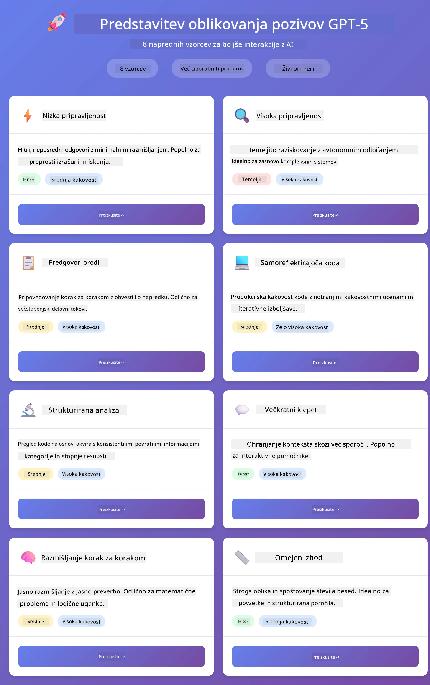

*Glavna nadzorna plošča prikazuje vseh 8 vzorcev inženiringa pozivov z njihovimi značilnostmi in primeri uporabe*

## Raziščite vzorce

Spletni vmesnik vam omogoča eksperimentiranje z različnimi strategijami pozivanja. Vsak vzorec rešuje različne probleme - preizkusite jih, da vidite, kdaj kateri pristop najbolj zasije.

### Nizka proti visoki vnemi

Postavite preprosto vprašanje, kot je "Koliko je 15 % od 200?" z nizko vnemo. Dobite takojšen, neposreden odgovor. Zdaj postavite nekaj kompleksnega, kot je "Oblikuj strategijo predpomnjenja za API z velikim prometom" z visoko vnemo. Opazujte, kako model upočasni in poda podrobno razmišljanje. Enak model, ista struktura vprašanja - a poziv mu pove, koliko naj razmišlja.

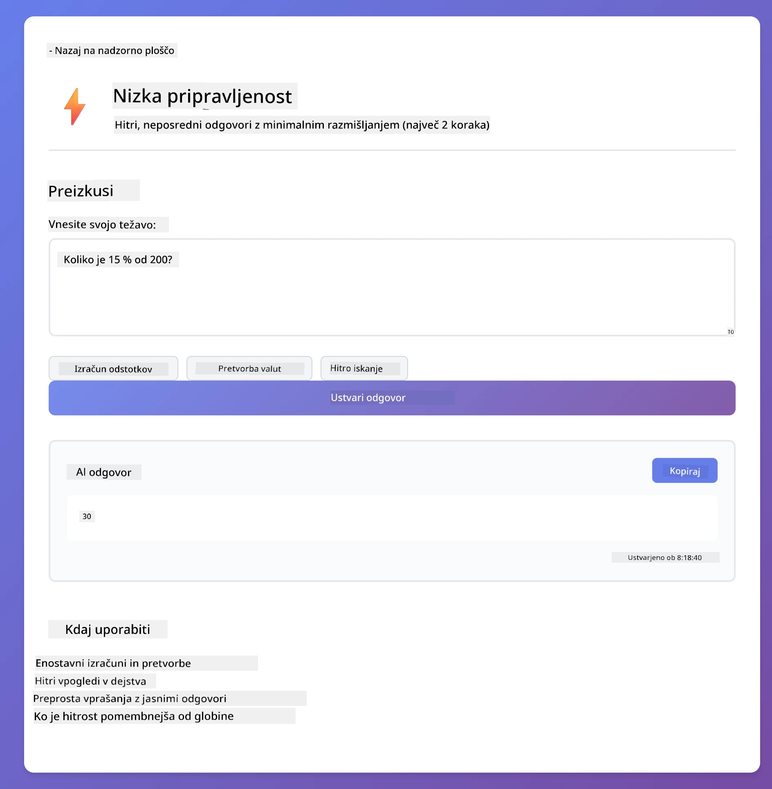
*Hitra računanja z minimalnim razmišljanjem*

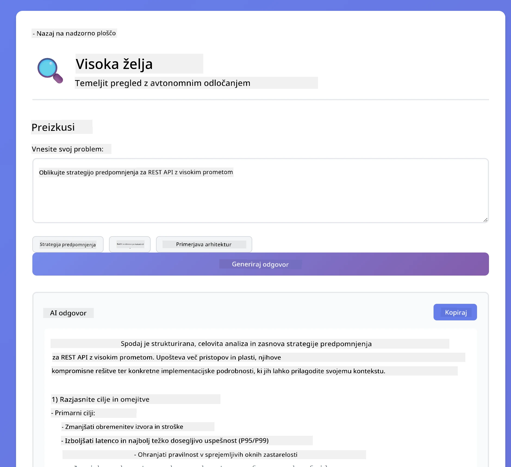

*Celovita strategija predpomnjenja (2,8 MB)*

### Izvajanje nalog (Uvodniki orodij)

Večstopenjski delovni tokovi imajo koristi od načrtovanja vnaprej in pripovedovanja o napredku. Model opiše, kaj bo naredil, pripoveduje vsak korak in nato povzame rezultate.


*Ustvarjanje REST končne točke s pripovedovanjem korak za korakom (3,9 MB)*

### Samoreflektirajoča koda

Poskusi "Ustvari storitev za preverjanje e-pošte". Namesto da bi samo generiral kodo in se ustavil, model generira, ocenjuje glede na kriterije kakovosti, prepozna slabosti in izboljšuje. Videli boste, kako iterira, dokler koda ne doseže proizvodnih standardov.

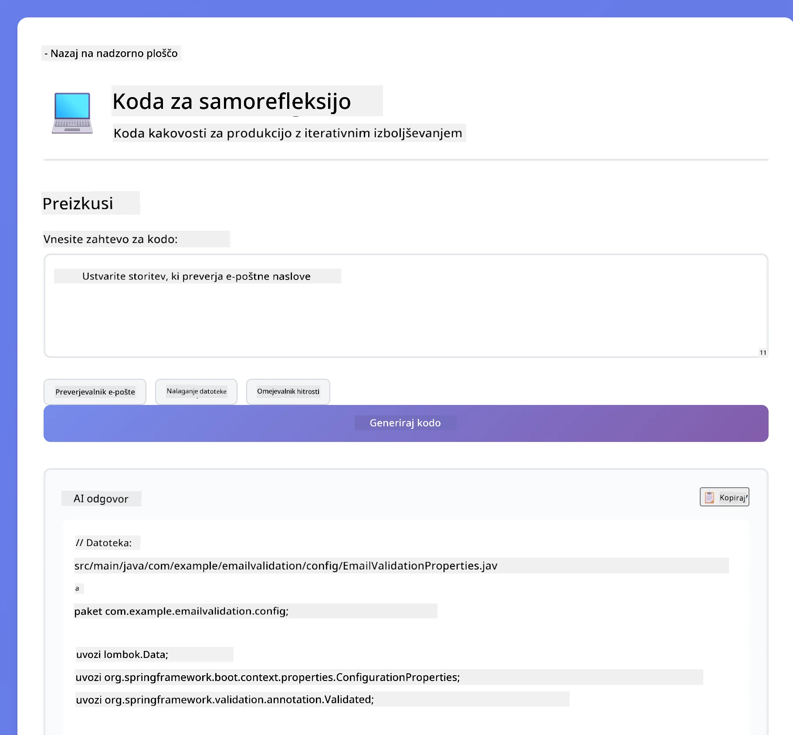

*Popolna storitev za preverjanje e-pošte (5,2 MB)*

### Strukturna analiza

Pregledi kode potrebujejo dosledne ocenjevalne okvire. Model analizira kodo z uporabo fiksnih kategorij (pravilnost, prakse, zmogljivost, varnost) z različnimi stopnjami resnosti.

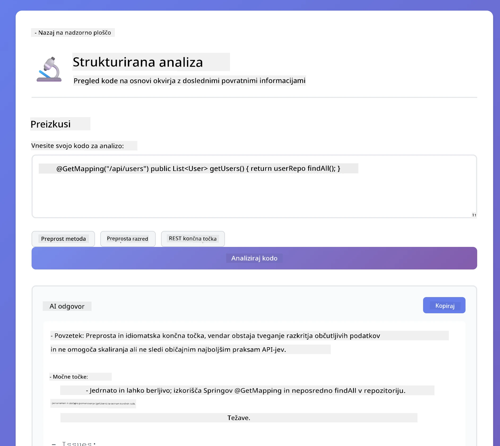

*Pregled kode na osnovi okvira*

### Večkratni pogovori

Vprašaj "Kaj je Spring Boot?" in takoj nato "Pokaži mi primer". Model si zapomni tvoje prvo vprašanje in ti poda prav primer Spring Boot. Brez spomina bi bilo drugo vprašanje preveč nejasno.

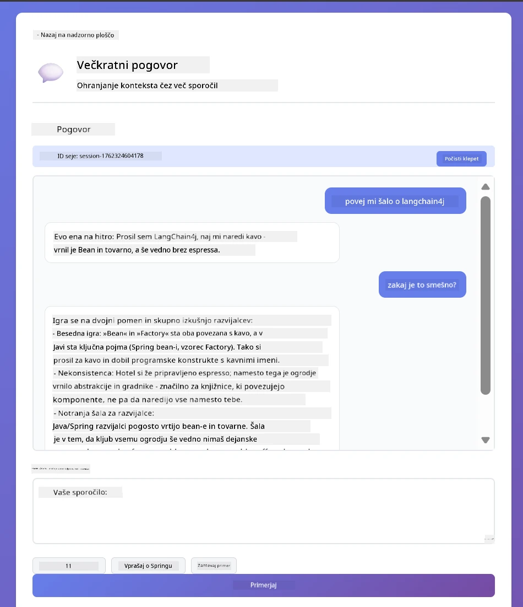

*Ohranjanje konteksta med vprašanji*

### Razmišljanje korak za korakom

Izberi matematični problem in ga poskusi rešiti z Razmišljanjem korak za korakom in z Nizko vnemo. Nizka vnema ti samo poda odgovor - hitro, a nejasno. Korak za korakom ti pokaže vsak izračun in odločitev.

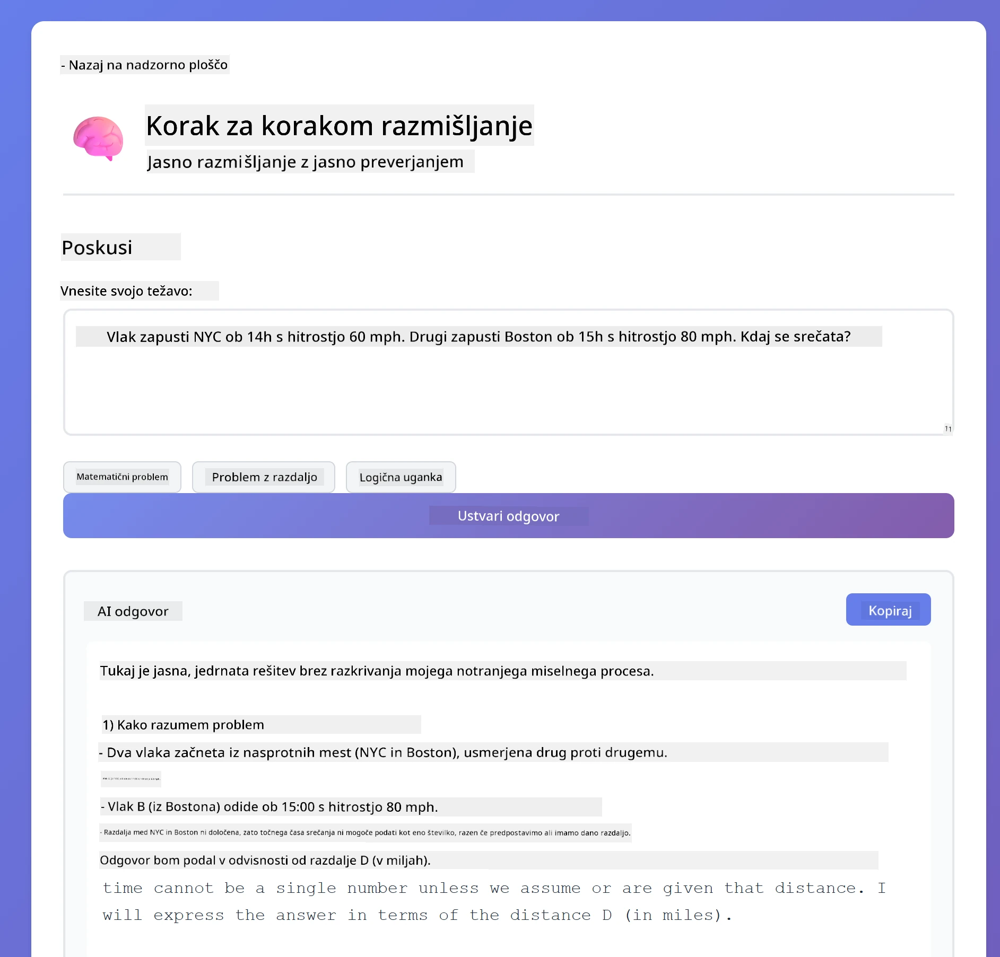

*Matematični problem z izrecnimi koraki*

### Omejen izhod

Ko potrebuješ specifične formate ali število besed, ta vzorec zagotavlja strogo upoštevanje. Poskusi ustvariti povzetek z natanko 100 besedami v obliki alinej.

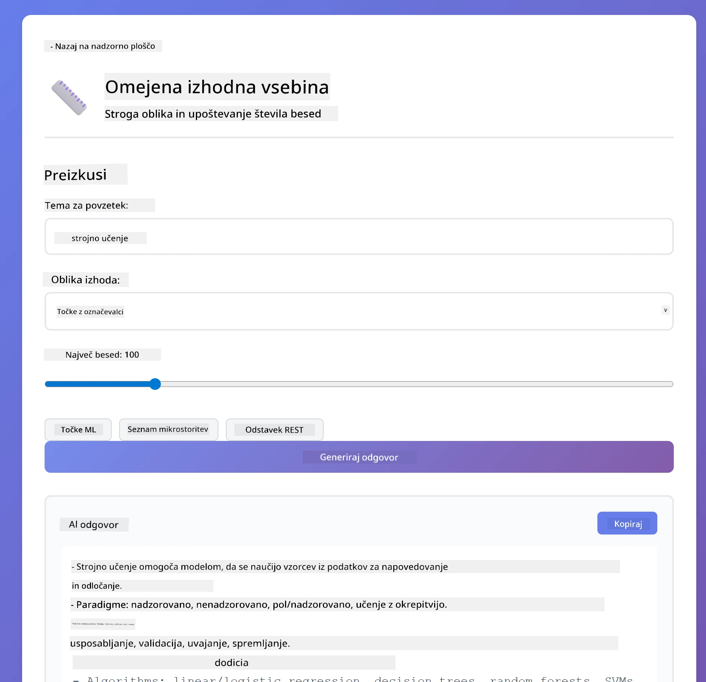

*Povzetek strojnega učenja s kontrolo formata*

## Kaj se resnično učiš

**Napor razmišljanja spremeni vse**

GPT-5 ti omogoča nadzor nad računalniškim naporom preko tvojih pozivov. Nizek napor pomeni hitre odgovore z minimalnim raziskovanjem. Visok napor pomeni, da si model vzame čas za globoko razmišljanje. Učiš se prilagajati napor zahtevnosti naloge - ne zapravljaj časa za preprosta vprašanja, a tudi ne hitrih odločitev pri zapletenih.

**Struktura vodi vedenje**

Opaziš XML oznake v pozivih? Niso dekorativne. Modeli sledijo strukturiranim navodilom bolj zanesljivo kot prostemu besedilu. Ko potrebuješ večstopenjske procese ali kompleksno logiko, struktura pomaga modelu slediti, kje je in kaj sledi.

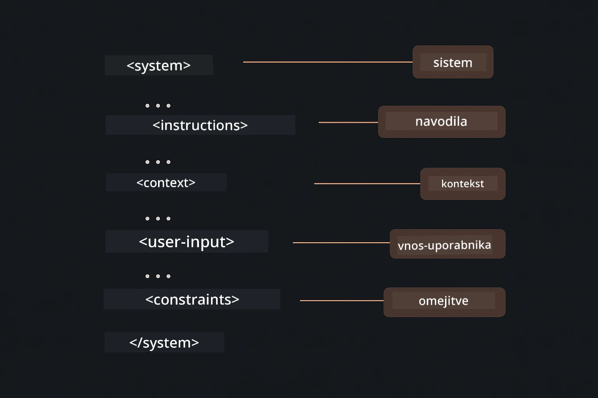

*Anatomija dobro strukturiranega poziva z jasnimi razdelki in XML-stil organizacijo*

**Kakovost skozi samoocenjevanje**

Vzorce samoreflektiranja delujejo tako, da naredijo kriterije kakovosti eksplicitne. Namesto da upaš, da model "naredi prav", mu natančno poveš, kaj pomeni "prav": pravilna logika, obravnava napak, zmogljivost, varnost. Model lahko nato oceni svoj izhod in izboljša. To spremeni generiranje kode iz loterije v proces.

**Kontekst je omejen**

Večkratni pogovori delujejo tako, da vključujejo zgodovino sporočil z vsakim zahtevkom. A obstaja meja - vsak model ima maksimalno število tokenov. Ko pogovori rastejo, boš potreboval strategije za ohranjanje relevantnega konteksta brez preseganja meje. Ta modul ti pokaže, kako deluje spomin; kasneje se boš naučil, kdaj povzeti, kdaj pozabiti in kdaj pridobiti.

## Naslednji koraki

**Naslednji modul:** [03-rag - RAG (Generiranje z iskanjem)](../03-rag/README.md)

---

**Navigacija:** [← Prejšnji: Modul 01 - Uvod](../01-introduction/README.md) | [Nazaj na glavno](../README.md) | [Naslednji: Modul 03 - RAG →](../03-rag/README.md)

---

<!-- CO-OP TRANSLATOR DISCLAIMER START -->
**Omejitev odgovornosti**:
Ta dokument je bil preveden z uporabo storitve za prevajanje z umetno inteligenco [Co-op Translator](https://github.com/Azure/co-op-translator). Čeprav si prizadevamo za natančnost, vas opozarjamo, da avtomatizirani prevodi lahko vsebujejo napake ali netočnosti. Izvirni dokument v njegovem izvirnem jeziku velja za avtoritativni vir. Za ključne informacije priporočamo strokovni človeški prevod. Za morebitna nesporazume ali napačne interpretacije, ki izhajajo iz uporabe tega prevoda, ne odgovarjamo.
<!-- CO-OP TRANSLATOR DISCLAIMER END -->