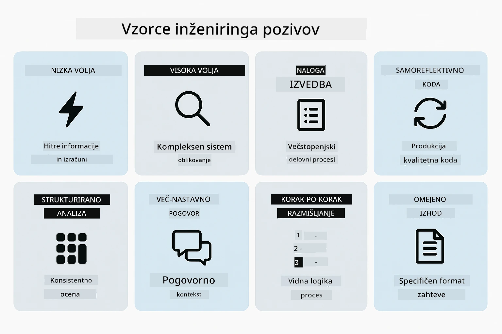
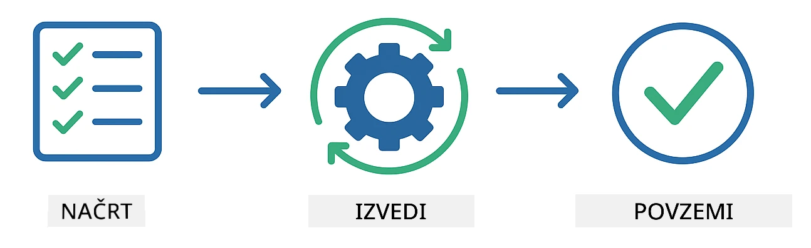
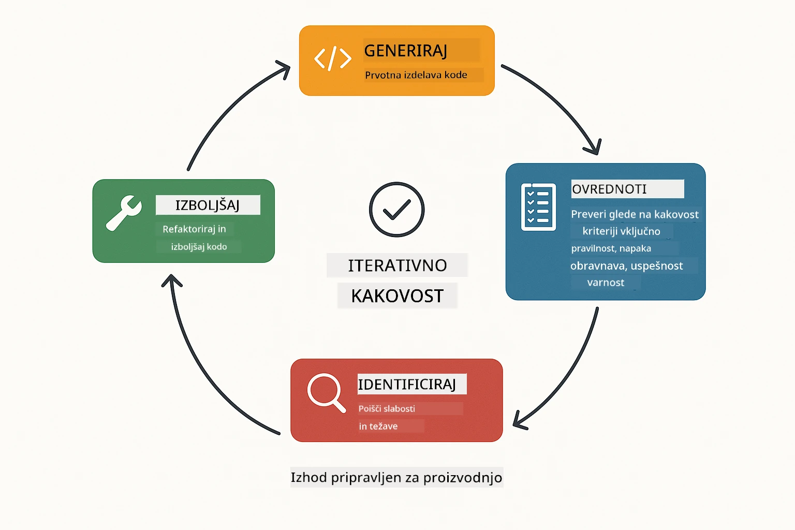
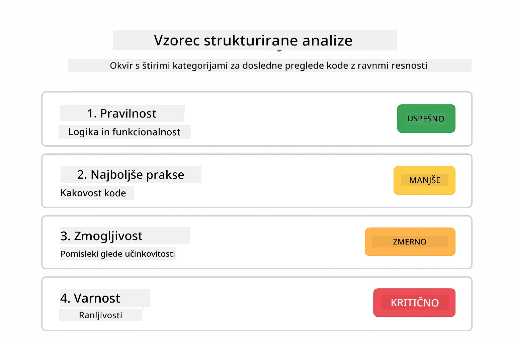
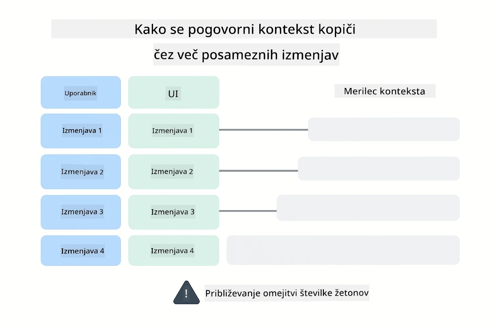
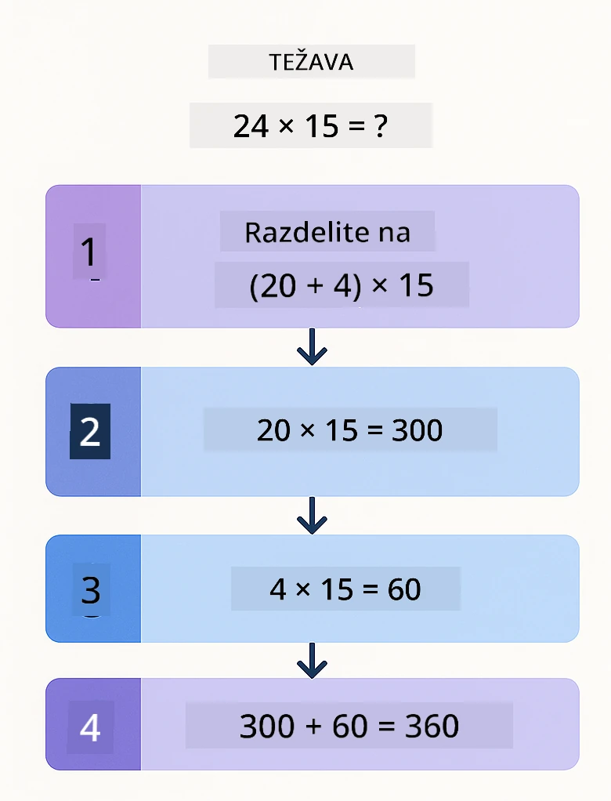
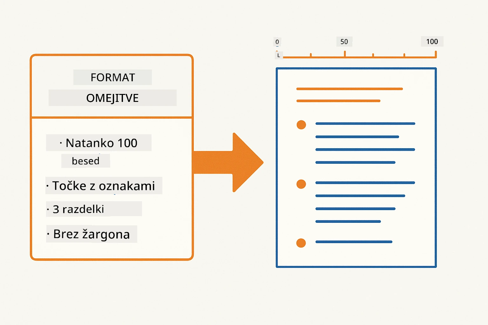
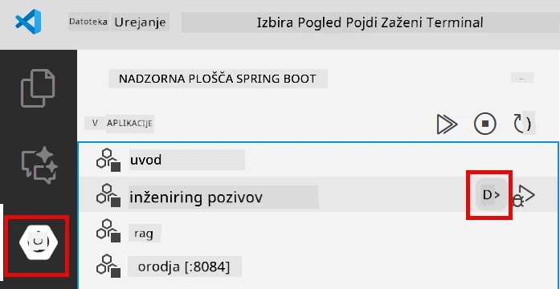
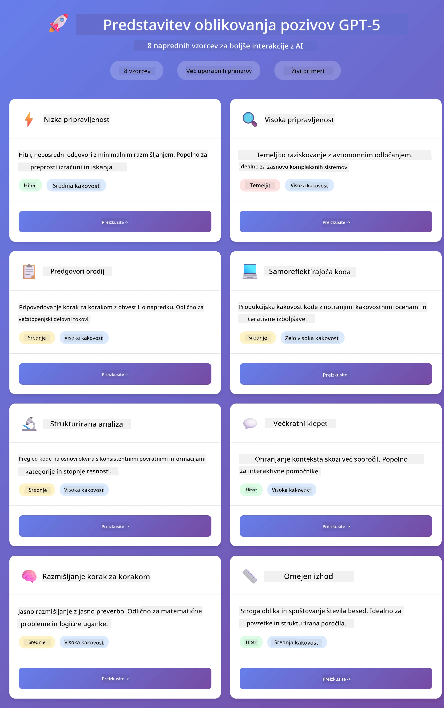
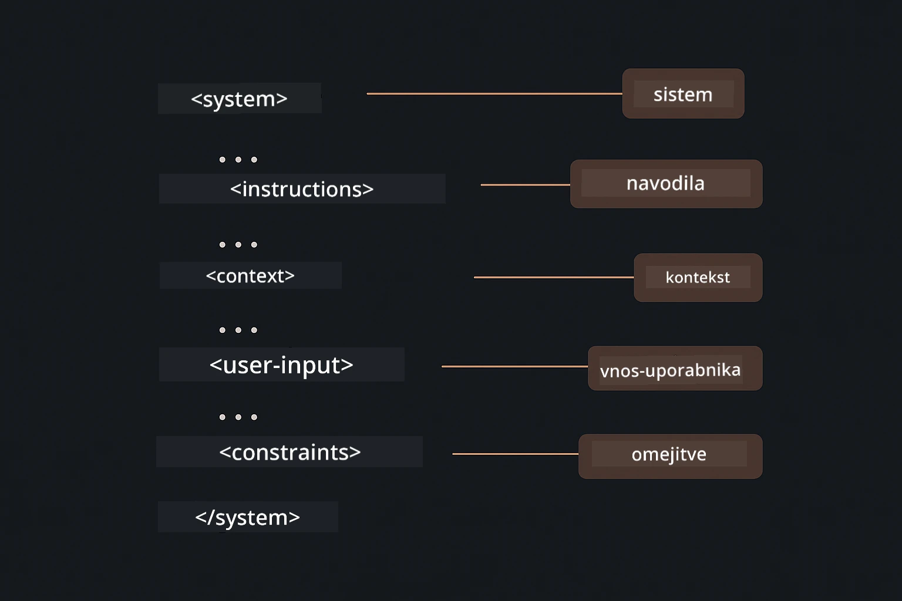

# Modul 02: Inženiring pozivov z GPT-5.2

## Kazalo vsebine

- [Video predstavitev](#video-predstavitev)
- [Kaj se boste naučili](#kaj-se-boste-naučili)
- [Predpogoji](#predpogoji)
- [Razumevanje inženiringa pozivov](#razumevanje-inženiringa-pozivov)
- [Temelji inženiringa pozivov](#temelji-inženiringa-pozivov)
  - [Zero-Shot Pozivanje](#zero-shot-pozivanje)
  - [Few-Shot Pozivanje](#few-shot-pozivanje)
  - [Veriga misli](#veriga-misli)
  - [Pozivanje z vlogo](#pozivanje-z-vlogo)
  - [Predloge pozivov](#predloge-pozivov)
- [Napredni vzorci](#napredni-vzorci)
- [Zaženi aplikacijo](#zaženite-aplikacijo)
- [Posnetki zaslona aplikacije](#posnetki-zaslona-aplikacije)
- [Raziskovanje vzorcev](#raziščite-vzorce)
  - [Nizka vs Visoka vnema](#nizka-vs-visoka-zagnanost)
  - [Izvajanje nalog (Uvodni deli orodij)](#izvajanje-nalog-predpone-orodij)
  - [Samoreflektirajoča koda](#samoreflektirajoča-koda)
  - [Strukturirana analiza](#strukturirana-analiza)
  - [Večkratni pogovori](#pogovor-s-več-koraki)
  - [Korak za korakom razmišljanje](#razmišljanje-korak-za-korakom)
  - [Omejen izhod](#omejen-izhod)
- [Kaj se resnično učite](#kaj-se-dejansko-učite)
- [Naslednji koraki](#naslednji-koraki)

## Video predstavitev

Oglejte si to v živo predavanje, ki pojasnjuje, kako začeti z modulom:

<a href="https://www.youtube.com/live/PJ6aBaE6bog?si=LDshyBrTRodP-wke"></a>

## Kaj se boste naučili

Naslednji diagram ponuja pregled ključnih tem in veščin, ki jih boste razvili v tem modulu — od tehnik izboljšanja pozivov do korak-po-korak delovnega procesa, ki ga boste sledili.


V prejšnjem modulu ste spoznali, kako pomnilnik omogoča pogovorni AI z Azure OpenAI. Zdaj se osredotočimo na to, kako zastavljate vprašanja — na same pozive — z uporabo GPT-5.2 v Azure OpenAI. Način, kako strukturirate pozive, bistveno vpliva na kakovost odgovorov, ki jih dobite. Začnemo s pregledom osnovnih tehnik pozivanja, nato pa preidemo k osmim naprednim vzorcem, ki v celoti izkoristijo zmogljivosti GPT-5.2.

Uporabljali bomo GPT-5.2, ker uvaja nadzor razmišljanja - lahko modelu poveste, koliko naj razmišlja pred odgovorom. To različne strategije pozivanja naredi bolj izrazite in pomaga razumeti, kdaj katero uporabljati.

## Predpogoji

- Dokončan modul 01 (Azure OpenAI viri nameščeni)
- Datoteka `.env` v korenski mapi z Azure poverilnicami (ustvarjena z `azd up` v modulu 01)

> **Opomba:** Če niste zaključili modula 01, najprej sledite navodilom za namestitev tam.

## Razumevanje inženiringa pozivov

V jedru je inženiring pozivov razlika med nejasnimi in natančnimi navodili, kot ponazarja spodnja primerjava.


Inženiring pozivov je oblikovanje vhodnega besedila, ki vam dosledno prinaša želene rezultate. Ne gre samo za postavljanje vprašanj - gre za strukturiranje zahtev, da model točno razume, kaj želite in kako to dostaviti.

Predstavljajte si, da dajete navodila sodelavcu. "Popravi napako" je nejasno. "Popravi izjemo z ničelnim kazalcem v UserService.java na vrstici 45 z dodajanjem preverjanja ničelnosti" je specifično. Jezikovni modeli delujejo enako - specifičnost in struktura štejeta.

Spodnji diagram prikazuje, kako se LangChain4j prilega tej sliki — povezuje vzorce pozivov z modelom preko gradnikov SystemMessage in UserMessage.


LangChain4j zagotavlja infrastrukturo — povezave z modeli, pomnilnik in vrste sporočil — medtem ko so vzorci pozivov le skrbno strukturirano besedilo, ki ga pošiljate prek te infrastrukture. Ključni gradniki so `SystemMessage` (ki določa vedenje in vlogo AI) in `UserMessage` (ki nosi vašo dejansko zahtevo).

## Temelji inženiringa pozivov

Pet osnovnih tehnik, prikazanih spodaj, tvori temelj učinkovitega inženiringa pozivov. Vsaka naslavlja drugačen vidik, kako komunicirate z jezikovnimi modeli.


Preden se poglobimo v napredne vzorce v tem modulu, ponovimo pet osnovnih tehnik pozivanja. To so gradniki, ki jih mora poznati vsak inženir pozivov.

### Zero-Shot Pozivanje

Najpreprostejši pristop: modelu daste neposredno navodilo brez primerov. Model popolnoma uporablja svoje učenje, da razume in izvede nalogo. To deluje dobro za jasne zahteve, kjer je pričakovano vedenje očitno.


*Neposredno navodilo brez primerov — model izvede nalogo samo na podlagi navodila*

```java
String prompt = "Classify this sentiment: 'I absolutely loved the movie!'";
String response = model.chat(prompt);
// Odgovor: "Pozitivno"
```

**Kdaj uporabiti:** Preproste klasifikacije, neposredna vprašanja, prevodi ali katerakoli naloga, ki jo model lahko izvede brez dodatnih smernic.

### Few-Shot Pozivanje

Navedete primere, ki pokažejo vzorec, ki ga želite, da se model drži. Model se nauči pričakovani vhodno-izhodni format iz vaših primerov in ga uporablja na novih vhodih. To močno izboljša doslednost za naloge, kjer format ali vedenje ni očiten.


*Učenje iz primerov — model prepozna vzorec in ga uporablja na novih vhodih*

```java
String prompt = """
    Classify the sentiment as positive, negative, or neutral.
    
    Examples:
    Text: "This product exceeded my expectations!" → Positive
    Text: "It's okay, nothing special." → Neutral
    Text: "Waste of money, very disappointed." → Negative
    
    Now classify this:
    Text: "Best purchase I've made all year!"
    """;
String response = model.chat(prompt);
```

**Kdaj uporabiti:** Prilagojene klasifikacije, dosledno oblikovanje, naloge specifične za domeno ali kadar so rezultati zero-shot nedosledni.

### Veriga misli

Modelu naročite, naj pokaže svoje razmišljanje korak za korakom. Namesto da bi skočil neposredno na odgovor, model razdeli problem in dela skozi vsak del posebej. To izboljša natančnost pri matematičnih, logičnih in večkorakih razmišljanjih.


*Korak za korakom razmišljanje — razbijanje kompleksnih problemov v eksplicitne logične korake*

```java
String prompt = """
    Problem: A store has 15 apples. They sell 8 apples and then 
    receive a shipment of 12 more apples. How many apples do they have now?
    
    Let's solve this step-by-step:
    """;
String response = model.chat(prompt);
// Model prikazuje: 15 - 8 = 7, nato 7 + 12 = 19 jabolk
```

**Kdaj uporabiti:** Matematični problemi, logične uganke, odpravljanje napak ali katera koli naloga, kjer prikaz razmišljanja izboljša natančnost in zaupanje.

### Pozivanje z vlogo

Določite osebo ali vlogo za AI pred zastavitvijo vprašanja. To zagotovi kontekst, ki oblikuje ton, globino in fokus odgovora. "Programsko arhitekt" daje drugačen nasvet kot "mlajši razvijalec" ali "varnostni revizor".


*Določanje konteksta in osebnosti — isto vprašanje dobi drugačen odgovor glede na dodeljeno vlogo*

```java
String prompt = """
    You are an experienced software architect reviewing code.
    Provide a brief code review for this function:
    
    def calculate_total(items):
        total = 0
        for item in items:
            total = total + item['price']
        return total
    """;
String response = model.chat(prompt);
```

**Kdaj uporabiti:** Pregledi kode, mentorstvo, analize specifične za domeno ali kadar potrebujete odgovore, prilagojene določenemu strokovnemu nivoju ali perspektivi.

### Predloge pozivov

Ustvarite ponovno uporabne pozive z vloženimi spremenljivkami. Namesto da bi vsakič pisali nov poziv, definirajte predlogo enkrat in vstavite različne vrednosti. Razred `PromptTemplate` v LangChain4j to olajša z `{{variable}}` sintakso.


*Ponovno uporabni pozivi z vloženimi spremenljivkami — ena predloga, veliko uporab*

```java
PromptTemplate template = PromptTemplate.from(
    "What's the best time to visit {{destination}} for {{activity}}?"
);

Prompt prompt = template.apply(Map.of(
    "destination", "Paris",
    "activity", "sightseeing"
));

String response = model.chat(prompt.text());
```

**Kdaj uporabiti:** Ponovljene poizvedbe z različnimi vhodi, serijska obdelava, gradnja ponovno uporabnih AI delovnih tokov ali v vsakem primeru, ko struktura poziva ostane enaka, a se podatki spreminjajo.

---

Ti pet osnovnih tehnik vam daje solidno orodje za večino pozivnih nalog. Preostali del tega modula gradi na njih z **osmimi naprednimi vzorci**, ki izkoriščajo nadzor razmišljanja GPT-5.2, samoocenjevanje in zmožnosti strukturiranega izhoda.

## Napredni vzorci

Ko so osnovne tehnike pokrite, preidimo na osem naprednih vzorcev, ki ta modul naredijo edinstven. Vsi problemi ne potrebujejo istega pristopa. Nekatera vprašanja zahtevajo hitre odgovore, druga globoko razmišljanje. Nekatera vidno razmišljanje, druga samo rezultate. Vsak spodnji vzorec je optimiziran za drugačen scenarij — nadzor razmišljanja GPT-5.2 pa te razlike še poudari.



*Pregled osmih vzorcev inženiringa pozivov in njihovih primerov uporabe*

GPT-5.2 dodaja še eno dimenzijo tem vzorcem: *nadzor razmišljanja*. Spodnji drsnik prikazuje, kako lahko prilagajate modelovo razmišljanje — od hitrih, neposrednih odgovorov do globoke, temeljite analize.


*Nadzor razmišljanja GPT-5.2 vam omogoča določiti, koliko naj model razmišlja — od hitrih, neposrednih odgovorov do poglobljenega raziskovanja*

**Nizka vnema (Hitro in osredotočeno)** - Za preprosta vprašanja, kjer želite hitre, neposredne odgovore. Model razmišlja minimalno - največ 2 koraka. Uporabite to za izračune, poizvedbe ali preprosta vprašanja.

```java
String prompt = """
    <context_gathering>
    - Search depth: very low
    - Bias strongly towards providing a correct answer as quickly as possible
    - Usually, this means an absolute maximum of 2 reasoning steps
    - If you think you need more time, state what you know and what's uncertain
    </context_gathering>
    
    Problem: What is 15% of 200?
    
    Provide your answer:
    """;

String response = chatModel.chat(prompt);
```

> 💡 **Raziskujte z GitHub Copilot:** Odprite [`Gpt5PromptService.java`](../../../02-prompt-engineering/src/main/java/com/example/langchain4j/prompts/service/Gpt5PromptService.java) in vprašajte:
> - "Kakšna je razlika med nizko in visoko vneto strategijo pozivanja?"
> - "Kako XML oznake v pozivih pomagajo strukturirati odgovor AI?"
> - "Kdaj uporabiti vzorce samorefleksije v primerjavi z neposrednimi navodili?"

**Visoka vnema (Globoko in temeljito)** - Za kompleksne probleme, kjer želite celovito analizo. Model temeljito raziskuje in pokaže podrobno razmišljanje. Uporabite to za sistemsko oblikovanje, arhitekturne odločitve ali kompleksne raziskave.

```java
String prompt = """
    Analyze this problem thoroughly and provide a comprehensive solution.
    Consider multiple approaches, trade-offs, and important details.
    Show your analysis and reasoning in your response.
    
    Problem: Design a caching strategy for a high-traffic REST API.
    """;

String response = chatModel.chat(prompt);
```

**Izvajanje nalog (Napredek korak za korakom)** - Za večkorakne delovne tokove. Model najprej poda načrt, nato pripoveduje vsak korak med delom in na koncu poda povzetek. Uporabite to za migracije, implementacije ali katerikoli večkorakni proces.

```java
String prompt = """
    <task_execution>
    1. First, briefly restate the user's goal in a friendly way
    
    2. Create a step-by-step plan:
       - List all steps needed
       - Identify potential challenges
       - Outline success criteria
    
    3. Execute each step:
       - Narrate what you're doing
       - Show progress clearly
       - Handle any issues that arise
    
    4. Summarize:
       - What was completed
       - Any important notes
       - Next steps if applicable
    </task_execution>
    
    <tool_preambles>
    - Always begin by rephrasing the user's goal clearly
    - Outline your plan before executing
    - Narrate each step as you go
    - Finish with a distinct summary
    </tool_preambles>
    
    Task: Create a REST endpoint for user registration
    
    Begin execution:
    """;

String response = chatModel.chat(prompt);
```

Pozivanje z Verigo misli modelu eksplicitno naroči, naj prikaže svojo procesno logiko, kar izboljša natančnost pri kompleksnih nalogah. Razčlenitev korak za korakom pomaga tako ljudem kot AI razumeti logiko.

> **🤖 Poskusite z [GitHub Copilot](https://github.com/features/copilot) Chat:** Vprašajte o tem vzorcu:
> - "Kako bi prilagodil vzorec izvajanja nalog za dolgotrajne operacije?"
> - "Kakšne so najboljše prakse za strukturiranje uvodnih delov orodij v produkcijskih aplikacijah?"
> - "Kako lahko ujamem in prikažem vmesne posodobitve napredka v uporabniškem vmesniku?"

Spodnji diagram prikazuje ta načrt → izvedbo → povzetek delovnega procesa.



*Načrt → Izvedba → Povzetek delovnega procesa za večkorakne naloge*

**Samoreflektirajoča koda** - Za generiranje kode kakovosti za produkcijo. Model generira kodo, ki sledi produkcijskim standardom z ustreznim ravnanjem z napakami. Uporabite, ko gradite nove funkcionalnosti ali storitve.

```java
String prompt = """
    Generate Java code with production-quality standards: Create an email validation service
    Keep it simple and include basic error handling.
    """;

String response = chatModel.chat(prompt);
```

Spodnji diagram prikazuje ta iterativni zanki izboljšav — generiraj, ocenjuj, ugotovi pomanjkljivosti in izpopolnjuj, dokler koda ne doseže produkcijskih standardov.



*Iterativni cikel izboljšav - generiranje, ocenjevanje, odkrivanje težav, izboljšave, ponavljanje*

**Strukturirana analiza** - Za dosledno ocenjevanje. Model pregleda kodo z uporabo fiksiranega okvira (pravilnost, praksa, zmogljivost, varnost, vzdržnost). Uporabite za preglede kode ali ocene kakovosti.

```java
String prompt = """
    <analysis_framework>
    You are an expert code reviewer. Analyze the code for:
    
    1. Correctness
       - Does it work as intended?
       - Are there logical errors?
    
    2. Best Practices
       - Follows language conventions?
       - Appropriate design patterns?
    
    3. Performance
       - Any inefficiencies?
       - Scalability concerns?
    
    4. Security
       - Potential vulnerabilities?
       - Input validation?
    
    5. Maintainability
       - Code clarity?
       - Documentation?
    
    <output_format>
    Provide your analysis in this structure:
    - Summary: One-sentence overall assessment
    - Strengths: 2-3 positive points
    - Issues: List any problems found with severity (High/Medium/Low)
    - Recommendations: Specific improvements
    </output_format>
    </analysis_framework>
    
    Code to analyze:
    ```
    public List getUsers() {
        return database.query("SELECT * FROM users");
    }
    ```
    Provide your structured analysis:
    """;

String response = chatModel.chat(prompt);
```

> **🤖 Poskusite z [GitHub Copilot](https://github.com/features/copilot) Chat:** Vprašajte o strukturirani analizi:
> - "Kako lahko prilagodim analitični okvir za različne vrste pregledov kode?"
> - "Kakšen je najboljši način za programatično razčlenjevanje in ukrepanje na strukturiran izhod?"
> - "Kako zagotoviti doslednost ravni resnosti med različnimi pregledi?"

Naslednji diagram prikazuje, kako ta strukturirani okvir organizira pregled kode v dosledne kategorije z ravnmi resnosti.



*Okvir za dosledne preglede kode z ravnmi resnosti*

**Večkratni pogovori** - Za pogovore, ki potrebujejo kontekst. Model si zapomni pretekla sporočila in gradi nanje. Uporabite za interaktivne pomoči ali kompleksna vprašanja in odgovore.

```java
ChatMemory memory = MessageWindowChatMemory.withMaxMessages(10);

memory.add(UserMessage.from("What is Spring Boot?"));
AiMessage aiMessage1 = chatModel.chat(memory.messages()).aiMessage();
memory.add(aiMessage1);

memory.add(UserMessage.from("Show me an example"));
AiMessage aiMessage2 = chatModel.chat(memory.messages()).aiMessage();
memory.add(aiMessage2);
```

Spodnji diagram prikazuje, kako se kontekst pogovora kopiči z vsakim krogom in kako je povezan z omejitvijo tokenov modela.



*Kako se kontekst pogovora kopiči skozi več krogov do dosega omejitve tokenov*

**Korak za korakom razmišljanje** - Za probleme, ki zahtevajo vidno logiko. Model pokaže eksplicitno razmišljanje za vsak korak. Uporabite za matematične probleme, logične uganke ali kadar želite razumeti proces razmišljanja.

```java
String prompt = """
    <instruction>Show your reasoning step-by-step</instruction>
    
    If a train travels 120 km in 2 hours, then stops for 30 minutes,
    then travels another 90 km in 1.5 hours, what is the average speed
    for the entire journey including the stop?
    """;

String response = chatModel.chat(prompt);
```

Spodnji diagram prikazuje, kako model razdeli probleme v eksplicitne, oštevilčene logične korake.


*Razčlenjevanje problemov v izrecne logične korake*

**Omejen izhod** – Za odgovore z zahtevami glede posebne oblike. Model strogo upošteva pravila oblikovanja in dolžine. Uporabite to za povzetke ali ko potrebujete natančno strukturo izhoda.

```java
String prompt = """
    <constraints>
    - Exactly 100 words
    - Bullet point format
    - Technical terms only
    </constraints>
    
    Summarize the key concepts of machine learning.
    """;

String response = chatModel.chat(prompt);
```

Naslednji diagram prikazuje, kako omejitve usmerjajo model k ustvarjanju izhoda, ki strogo upošteva vaše zahteve glede oblike in dolžine.



*Uveljavljanje zahtev glede oblike, dolžine in strukture*

## Zaženite aplikacijo

**Potrdite namestitev:**

Preverite, da je datoteka `.env` prisotna v korenski mapi z Azure poverilnicami (ustvarjeno med Modulom 01). Zaženite to iz mape modula (`02-prompt-engineering/`):

**Bash:**
```bash
cat ../.env  # Mora prikazati AZURE_OPENAI_ENDPOINT, API_KEY, DEPLOYMENT
```

**PowerShell:**
```powershell
Get-Content ..\.env  # Prikaže mora AZURE_OPENAI_ENDPOINT, API_KEY, DEPLOYMENT
```

**Zaženite aplikacijo:**

> **Opomba:** Če ste že zaženili vse aplikacije z ukazom `./start-all.sh` iz korenske mape (kot opisano v Modulu 01), ta modul že teče na vratih 8083. Zaženete lahko neposredno, brez ukazov spodaj, na naslovu http://localhost:8083.

**Možnost 1: Uporaba nadzorne plošče Spring Boot (priporočeno za uporabnike VS Code)**

Razvojno okolje vsebuje razširitev Spring Boot Dashboard, ki omogoča vizualno upravljanje vseh Spring Boot aplikacij. Najdete jo v vrstici aktivnosti na levi strani VS Code (ikona Spring Boot).

Iz Spring Boot Dashboard lahko:
- Vidite vse razpoložljive Spring Boot aplikacije v delovnem prostoru
- Zaženete/ustavite aplikacije z enim klikom
- V živo spremljate dnevnike aplikacij
- Nadzorujete stanje aplikacij

Preprosto kliknite gumb za predvajanje ob "prompt-engineering" za zagon tega modula ali začnite vse module hkrati.



*Nadzorna plošča Spring Boot v VS Code — zaženite, ustavite in spremljajte vse module iz enega mesta*

**Možnost 2: Uporaba skript v lupini**

Zaženi vse spletne aplikacije (moduli 01-04):

**Bash:**
```bash
cd ..  # Iz korenske mape
./start-all.sh
```

**PowerShell:**
```powershell
cd ..  # Iz korenske mape
.\start-all.ps1
```

Ali zaženi samo ta modul:

**Bash:**
```bash
cd 02-prompt-engineering
./start.sh
```

**PowerShell:**
```powershell
cd 02-prompt-engineering
.\start.ps1
```

Obe skripti samodejno naložita okoljske spremenljivke iz korenske datoteke `.env` in ob potrebi sestavita JAR datoteke.

> **Opomba:** Če želite pred zagonom ročno sestaviti vse module:
>
> **Bash:**
> ```bash
> cd ..  # Go to root directory
> mvn clean package -DskipTests
> ```

> **PowerShell:**
> ```powershell
> cd ..  # Go to root directory
> mvn clean package -DskipTests
> ```

Odprite http://localhost:8083 v vašem brskalniku.

**Zaustavitev:**

**Bash:**
```bash
./stop.sh  # Samo ta modul
# Ali
cd .. && ./stop-all.sh  # Vsi moduli
```

**PowerShell:**
```powershell
.\stop.ps1  # Samo ta modul
# Ali
cd ..; .\stop-all.ps1  # Vsi moduli
```

## Posnetki zaslona aplikacije

Tu je glavni vmesnik modula za prompt engineering, kjer lahko poskusite vseh osem vzorcev drug ob drugem.



*Glavna nadzorna plošča prikazuje vseh 8 vzorcev prompt engineeringa z njihovimi značilnostmi in primeri uporabe*

## Raziščite vzorce

Spletni vmesnik omogoča eksperimentiranje z različnimi strategijami spodbujanja. Vsak vzorec rešuje različne probleme – preizkusite jih in ugotovite, kdaj kateri pristop najbolje deluje.

> **Opomba: Pretakanje vs Ne-pretakanje** — Vsaka stran vzorca ponuja dva gumba: **🔴 Pretakanje odgovora (v živo)** in nepretakalno možnost. Pretakanje uporablja Server-Sent Events (SSE) za prikazovanje tokenov v realnem času med generiranjem, da takoj vidite napredek. Nepretakalna možnost čaka na celoten odgovor pred prikazom. Pri pozivih, ki sprožijo globoko razmišljanje (npr. Visoka zagnanost, Samoreflektirajoča koda), lahko nepretakanje traja zelo dolgo – tudi minute – brez vidnih povratnih informacij. **Uporabljajte pretakanje pri eksperimentih z zahtevnimi pozivi**, da vidite model v delovanju in preprečite vtis, da je zahteva potekla.
>
> **Opomba: Zahteva brskalnika** — Funkcija pretakanja uporablja Fetch Streams API (`response.body.getReader()`), ki zahteva poln brskalnik (Chrome, Edge, Firefox, Safari). Vgrajeni preprost brskalnik v VS Code ne podpira ReadableStream API, zato tam ne deluje. V preprostem brskalniku bodo nepretakalni gumbi delovali normalno, samodejno pa bodo pretakalni neuporabni. Za polno izkušnjo odprite `http://localhost:8083` v zunanjem brskalniku.

### Nizka vs Visoka zagnanost

Postavite preprosto vprašanje, na primer "Koliko je 15 % od 200?" z nizko zagnanostjo. Pridobili boste takojšen, neposreden odgovor. Zdaj vprašajte nekaj zahtevnega, na primer "Oblikuj strategijo predpomnjenja za visoko-obremenjen API", z visoko zagnanostjo. Kliknite **🔴 Pretakanje odgovora (v živo)** in opazujte podroben razmislek modela, prikazan token za tokenom. Enak model, ista struktura vprašanja – vendar prompt določa količino razmišljanja.

### Izvajanje nalog (predpone orodij)

Večstopenjski delovni tokovi imajo koristi od načrtovanja in pripovedovanja napredka. Model orisuje, kaj bo naredil, po korakih pripoveduje, nato povzame rezultate.

### Samoreflektirajoča koda

Poskusite "Ustvari storitev za preverjanje e-poštnih naslovov". Namesto da bi samo generiral kodo in nehal, model generira, ocenjuje glede kriterijev kakovosti, prepozna slabosti in izboljšuje. Videli boste iteracije, dokler koda ne doseže proizvodnih standardov.

### Strukturirana analiza

Pregledi kode potrebujejo dosledne kriterije ocenjevanja. Model analizira kodo skozi fiksne kategorije (pravilenost, prakse, zmogljivost, varnost) z različnimi stopnjami resnosti.

### Pogovor s več koraki

Vprašajte "Kaj je Spring Boot?" in takoj dodajte "Pokaži mi primer". Model si zapomni prvo vprašanje in vam poda primer posebej za Spring Boot. Brez spomina bi bilo drugo vprašanje preveč splošno.

### Razmišljanje korak za korakom

Izberite matematični problem in ga preizkusite z razmišljanjem korak za korakom ter z nizko zagnanostjo. Nizka zagnanost priskrbi samo odgovor – hitro, a nejasno. Razmišljanje korak za korakom prikaže vsak izračun in odločitev.

### Omejen izhod

Če potrebujete specifične oblike ali število besed, ta vzorec zagotavlja strogo upoštevanje. Poskusite ustvariti povzetek z natanko 100 besedami v obliki alinej.

## Kaj se dejansko učite

**Napor razmišljanja spremeni vse**

GPT-5.2 vam omogoča nadzorovanje računalniškega napora prek vaših pozivov. Nizek napor pomeni hitre odgovore z minimalnim raziskovanjem. Visok napor pomeni, da model vzame čas za globoko razmišljanje. Učite se prilagajati napor kompleksnosti naloge – ne izgubljajte časa na enostavnih vprašanjih, a tudi pri zahtevnih odločitvah ne hitite.

**Struktura usmerja vedenje**

Opazili ste XML oznake v pozivih? Niso okrasne. Modeli bolje sledijo strukturiranim navodilom kot prostemu tekstu. Ko potrebujete večstopenjske postopke ali zapleteno logiko, struktura pomaga modelu slediti, kje se nahaja in kaj sledi. Spodnji diagram razčlenjuje dobro strukturiran poziv, ki prikazuje, kako oznake kot `<system>`, `<instructions>`, `<context>`, `<user-input>` in `<constraints>` organizirajo navodila v jasne sekcije.



*Zgradba dobro strukturiranega poziva z jasnimi sekcijami in organizacijo v slogu XML*

**Kakovost skozi samoevalvacijo**

Samoreflektirajoči vzorci delujejo tako, da eksplicitno določijo kriterije kakovosti. Namesto da upate, da bo model „pravilno naredil“, mu točno poveste, kaj pomeni „pravilno“: pravilna logika, ravnanje z napakami, zmogljivost, varnost. Model lahko nato oceni svoj izhod in ga izboljša. Tako ustvarjanje kode ni več loterija, ampak proces.

**Kontekst je omejen**

Večkorak pogovor deluje tako, da vsakemu pozivu dodate zgodovino sporočil. Toda obstaja omejitev – vsak model ima največje število tokenov. Ko pogovori rastejo, boste potrebovali strategije za ohranjanje relevantnega konteksta, ne da bi presegli omejitev. Ta modul vam pokaže, kako deluje spomin; kasneje boste spoznali, kdaj povzemati, kdaj pozabljati in kdaj pridobivati informacije.

## Naslednji koraki

**Naslednji modul:** [03-rag - RAG (Generiranje z nadgradnjo iskanja)](../03-rag/README.md)

---

**Navigacija:** [← Prejšnji: Modul 01 - Uvod](../01-introduction/README.md) | [Nazaj na začetek](../README.md) | [Naprej: Modul 03 - RAG →](../03-rag/README.md)

---

<!-- CO-OP TRANSLATOR DISCLAIMER START -->
**Omejitev odgovornosti**:
Ta dokument je bil preveden z uporabo AI prevajalske storitve [Co-op Translator](https://github.com/Azure/co-op-translator). Čeprav si prizadevamo za natančnost, vas prosimo, da upoštevate, da avtomatizirani prevodi lahko vsebujejo napake ali netočnosti. Izvirni dokument v njegovem izvirnem jeziku je treba obravnavati kot avtoritativni vir. Za kritične informacije je priporočljiv strokovni človeški prevod. Ne odgovarjamo za morebitna nesporazume ali napačne interpretacije, ki izhajajo iz uporabe tega prevoda.
<!-- CO-OP TRANSLATOR DISCLAIMER END -->