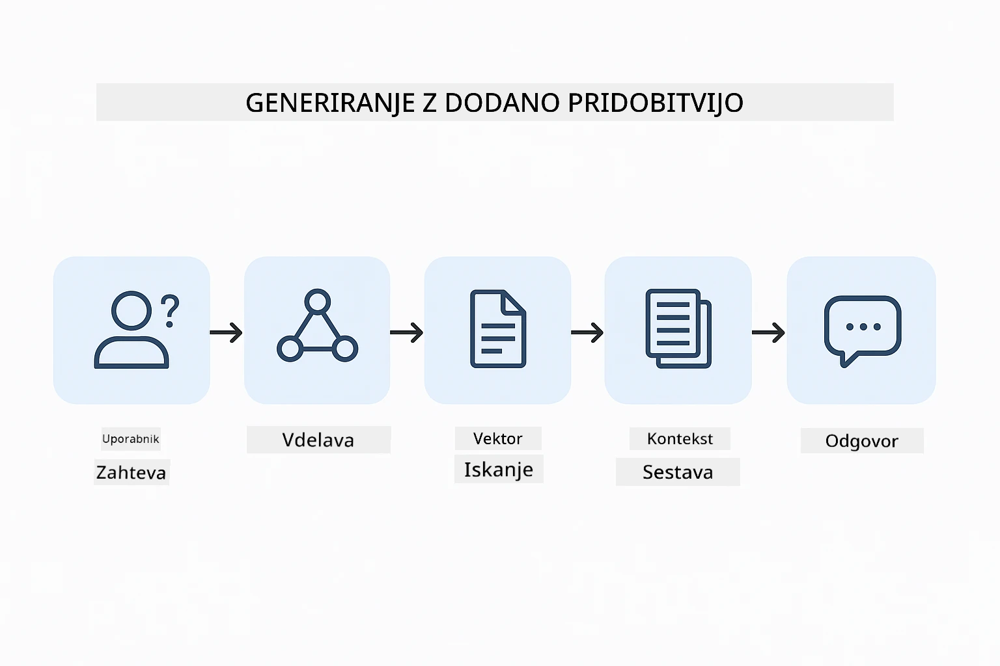
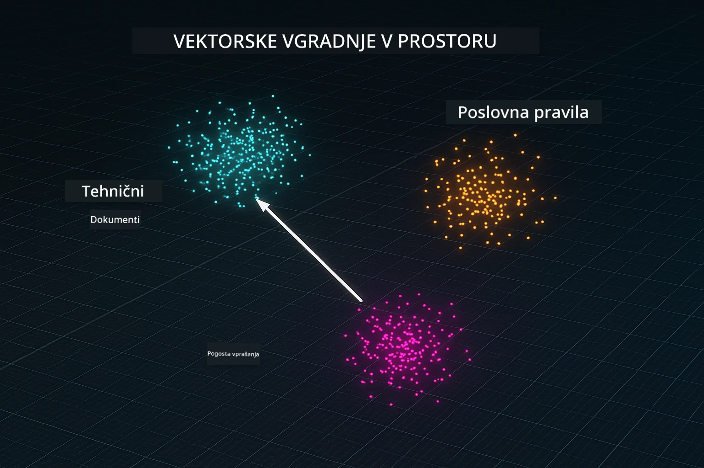
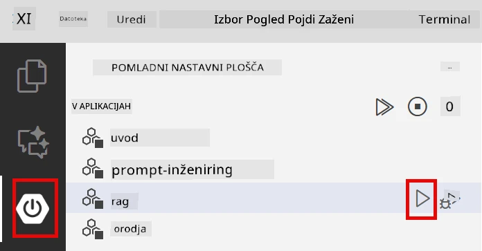
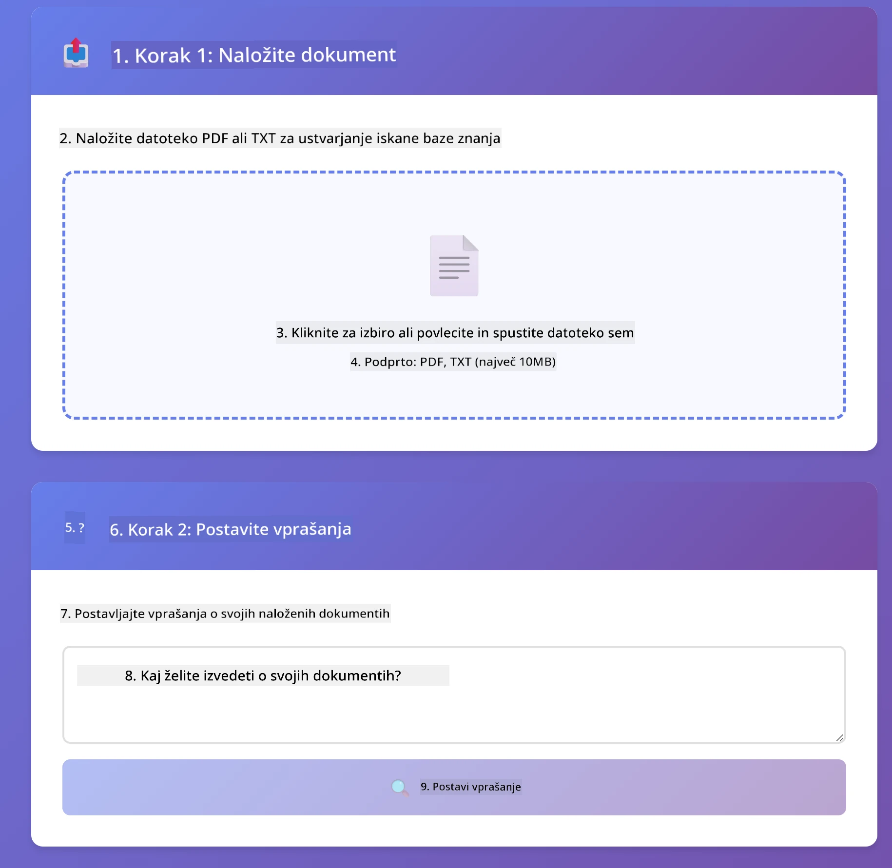
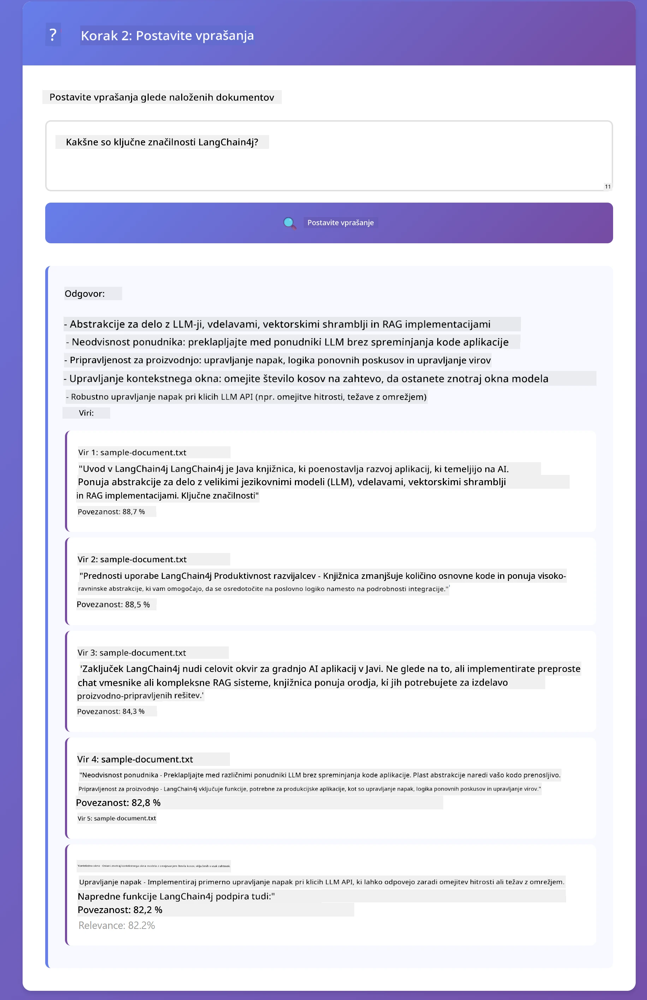

# Modul 03: RAG (Retrieval-Augmented Generation)

## Kazalo vsebine

- [Kaj se boste naučili](../../../03-rag)
- [Pogojna znanja](../../../03-rag)
- [Razumevanje RAG](../../../03-rag)
- [Kako deluje](../../../03-rag)
  - [Obdelava dokumentov](../../../03-rag)
  - [Ustvarjanje vdelav (embeddingov)](../../../03-rag)
  - [Semantično iskanje](../../../03-rag)
  - [Generiranje odgovorov](../../../03-rag)
- [Zagon aplikacije](../../../03-rag)
- [Uporaba aplikacije](../../../03-rag)
  - [Naložite dokument](../../../03-rag)
  - [Postavite vprašanja](../../../03-rag)
  - [Preverite vire](../../../03-rag)
  - [Eksperimentirajte z vprašanji](../../../03-rag)
- [Ključni pojmi](../../../03-rag)
  - [Strategija razdeljevanja](../../../03-rag)
  - [Ocene podobnosti](../../../03-rag)
  - [Shranjevanje v pomnilniku](../../../03-rag)
  - [Upravljanje okna konteksta](../../../03-rag)
- [Kdaj je RAG pomemben](../../../03-rag)
- [Naslednji koraki](../../../03-rag)

## Kaj se boste naučili

V prejšnjih modulih ste se naučili, kako se pogovarjati z umetno inteligenco in učinkovito strukturirati vaše pozive. Vendar obstaja temeljna omejitev: jezikovni modeli vedo samo to, kar so se naučili med usposabljanjem. Ne morejo odgovarjati na vprašanja o notranjih pravilnikih vašega podjetja, projektni dokumentaciji ali kateri koli informaciji, ki je niso bili usposobljeni.

RAG (Retrieval-Augmented Generation) rešuje ta problem. Namesto da bi modelu poskušali "vcepiti" vaše podatke (kar je drago in nepraktično), mu omogočite iskanje po vaših dokumentih. Ko nekdo zastavi vprašanje, sistem poišče relevantne informacije in jih vključi v poziv. Model nato odgovori na podlagi tega pridobljenega konteksta.

Razmislite o RAG kot o tem, da modelu daste referenčno knjižnico. Ko postavite vprašanje, sistem:

1. **Uporabniški poizved** - Postavite vprašanje
2. **Vdelava (embedding)** - Vaše vprašanje se prevede v vektor
3. **Vektorsko iskanje** - Poišče podobne dele dokumenta
4. **Sestavljanje konteksta** - V poziv doda ustrezne dele
5. **Odgovor** - LLM ustvari odgovor na podlagi konteksta

S tem temelji odgovore modela na vaših dejanskih podatkih, namesto da bi se zanašal na naučeno znanje ali izmišljal odgovore.



*Potek dela RAG – od uporabniške poizvedbe do semantičnega iskanja in generiranja kontekstualnih odgovorov*

## Pogojna znanja

- Dokončan Modul 01 (razporejene Azure OpenAI vire)
- `.env` datoteka v korenskem imeniku z Azure poverilnicami (ustvarjena z `azd up` v Modulu 01)

> **Opomba:** Če niste dokončali Modula 01, najprej sledite navodilom za namestitev tam.

## Kako deluje

### Obdelava dokumentov

[DocumentService.java](../../../03-rag/src/main/java/com/example/langchain4j/rag/service/DocumentService.java)

Ko naložite dokument, sistem razdeli ta dokument na dele – manjše kose, ki udobno ustrezajo modelovemu oknu konteksta. Ti deli se rahlo prekrivajo, da ne izgubite konteksta na robovih.

```java
Document document = FileSystemDocumentLoader.loadDocument("sample-document.txt");

DocumentSplitter splitter = DocumentSplitters
    .recursive(300, 30, new OpenAiTokenizer());

List<TextSegment> segments = splitter.split(document);
```

> **🤖 Poskusite z [GitHub Copilot](https://github.com/features/copilot) Chat:** Odprite [`DocumentService.java`](../../../03-rag/src/main/java/com/example/langchain4j/rag/service/DocumentService.java) in vprašajte:
> - "Kako LangChain4j razdeli dokumente na dele in zakaj je prekrivanje pomembno?"
> - "Kakšna je optimalna velikost delov za različne tipe dokumentov in zakaj?"
> - "Kako obravnavam dokumente v več jezikih ali s posebno obliko?"

### Ustvarjanje vdelav (embeddingov)

[LangChainRagConfig.java](../../../03-rag/src/main/java/com/example/langchain4j/rag/config/LangChainRagConfig.java)

Vsak del se pretvori v številčno predstavitev, imenovano vdelava – gre za matematični prstni odtis, ki zajema pomen besedila. Podobno besedilo ustvarja podobne vdelave.

```java
@Bean
public EmbeddingModel embeddingModel() {
    return OpenAiOfficialEmbeddingModel.builder()
        .baseUrl(azureOpenAiEndpoint)
        .apiKey(azureOpenAiKey)
        .modelName(azureEmbeddingDeploymentName)
        .build();
}

EmbeddingStore<TextSegment> embeddingStore = 
    new InMemoryEmbeddingStore<>();
```



*Dokumenti predstavljeni kot vektorji v prostoru vdelav - podobne vsebine se združujejo*

### Semantično iskanje

[RagService.java](../../../03-rag/src/main/java/com/example/langchain4j/rag/service/RagService.java)

Ko postavite vprašanje, se tudi vaše vprašanje pretvori v vdelavo. Sistem primerja vdelavo vašega vprašanja z vdelavami vseh delov dokumentov. Poišče dele z najsličnejšimi pomeni – ne samo ujemanje ključnih besed, ampak dejansko semantično podobnost.

```java
Embedding queryEmbedding = embeddingModel.embed(question).content();

List<EmbeddingMatch<TextSegment>> matches = 
    embeddingStore.findRelevant(queryEmbedding, 5, 0.7);

for (EmbeddingMatch<TextSegment> match : matches) {
    String relevantText = match.embedded().text();
    double score = match.score();
}
```

> **🤖 Poskusite z [GitHub Copilot](https://github.com/features/copilot) Chat:** Odprite [`RagService.java`](../../../03-rag/src/main/java/com/example/langchain4j/rag/service/RagService.java) in vprašajte:
> - "Kako deluje iskanje podobnosti z vdelavami in kaj določa oceno?"
> - "Kateri prag podobnosti naj uporabim in kako vpliva na rezultate?"
> - "Kako ravnam v primerih, ko ni najdenih relevantnih dokumentov?"

### Generiranje odgovorov

[RagService.java](../../../03-rag/src/main/java/com/example/langchain4j/rag/service/RagService.java)

Najbolj relevantni deli so vključeni v poziv modelu. Model prebere te specifične dele in odgovori na vaše vprašanje na podlagi teh informacij. To preprečuje halucinacije – model lahko odgovori le na podlagi razpoložljivih podatkov.

## Zagon aplikacije

**Preverite namestitev:**

Prepričajte se, da je `.env` datoteka v korenskem imeniku z Azure poverilnicami (ustvarjena med Modulom 01):
```bash
cat ../.env  # Prikazati mora AZURE_OPENAI_ENDPOINT, API_KEY, DEPLOYMENT
```

**Zaženite aplikacijo:**

> **Opomba:** Če ste že zagnali vse aplikacije z uporabo `./start-all.sh` iz Modula 01, ta modul že teče na vratih 8081. Lahko preskočite ukaze za začetek spodaj in pojdite neposredno na http://localhost:8081.

**Možnost 1: Uporaba Spring Boot Dashboard (priporočeno za uporabnike VS Code)**

Dev container vsebuje razširitev Spring Boot Dashboard, ki ponuja vizualni vmesnik za upravljanje vseh Spring Boot aplikacij. Najdete ga na vrstici z dejavnostmi na levi strani VS Code (poiščite ikono Spring Boot).

Iz Spring Boot Dashboarda lahko:
- Vidite vse razpoložljive Spring Boot aplikacije v delovnem prostoru
- Zaženete/ustavite aplikacije z enim klikom
- V realnem času spremljate dnevniške zapise aplikacij
- Spremljate stanje aplikacij

Preprosto kliknite gumb za predvajanje ob "rag" za zagon tega modula ali pa zaženite vse module naenkrat.



**Možnost 2: Uporaba shell skript**

Zaženite vse spletne aplikacije (moduli 01-04):

**Bash:**
```bash
cd ..  # Iz korenskega imenika
./start-all.sh
```

**PowerShell:**
```powershell
cd ..  # Iz korenskega imenika
.\start-all.ps1
```

Ali zaženite samo ta modul:

**Bash:**
```bash
cd 03-rag
./start.sh
```

**PowerShell:**
```powershell
cd 03-rag
.\start.ps1
```

Obe skripti samodejno naložita spremenljivke okolja iz korenske `.env` datoteke in zgradita JAR če še ne obstaja.

> **Opomba:** Če želite vse module zgraditi ročno pred zagonom:
>
> **Bash:**
> ```bash
> cd ..  # Go to root directory
> mvn clean package -DskipTests
> ```

> **PowerShell:**
> ```powershell
> cd ..  # Go to root directory
> mvn clean package -DskipTests
> ```

Odprite http://localhost:8081 v vašem brskalniku.

**Za ustavitev:**

**Bash:**
```bash
./stop.sh  # Samo ta modul
# Ali
cd .. && ./stop-all.sh  # Vsi moduli
```

**PowerShell:**
```powershell
.\stop.ps1  # Samo ta modul
# Ali
cd ..; .\stop-all.ps1  # Vsi moduli
```

## Uporaba aplikacije

Aplikacija nudi spletni vmesnik za nalaganje dokumentov in postavljanje vprašanj.

<a href="images/rag-homepage.png"></a>

*Uporabniški vmesnik RAG aplikacije – naložite dokumente in postavite vprašanja*

### Naložite dokument

Začnite z nalaganjem dokumenta – za testiranje so najboljši TXT datoteki. V tem imeniku je na voljo `sample-document.txt`, ki vsebuje informacije o funkcijah LangChain4j, implementaciji RAG in najboljših praksah – popolno za testiranje sistema.

Sistem obdela vaš dokument, razdeli ga na dele in za vsak del ustvari vdelave. To se zgodi samodejno ob nalaganju.

### Postavite vprašanja

Zdaj postavite specifična vprašanja glede vsebine dokumenta. Poskusite z dejstvi, ki so jasno navedena v dokumentu. Sistem poišče relevantne dele, jih vključi v poziv in ustvari odgovor.

### Preverite vire

Opazite, da vsak odgovor vsebuje reference na vire z ocenami podobnosti. Te ocene (od 0 do 1) prikazujejo, kako relevantni so bili posamezni deli za vaše vprašanje. Višje ocene pomenijo boljše ujemanje. Tako lahko preverite odgovor glede na izvorno gradivo.

<a href="images/rag-query-results.png"></a>

*Rezultati poizvedbe prikazujejo odgovor z referencami na vire in ocenami relevantnosti*

### Eksperimentirajte z vprašanji

Poskusite različne vrste vprašanj:
- Specifična dejstva: "Kakšna je glavna tema?"
- Primerjave: "Kakšna je razlika med X in Y?"
- Povzetki: "Povzemite ključne točke o Z"

Opazujte, kako ocene relevantnosti spreminjajo glede na to, kako dobro vaše vprašanje ustreza vsebini dokumenta.

## Ključni pojmi

### Strategija razdeljevanja

Dokumenti se razdelijo v 300-token delov z 30 tokeni prekrivanja. Ta kompromis zagotavlja dovolj konteksta za smiselnost posameznih delov, hkrati pa ostane dovolj majhen, da je mogoče v poziv vključiti več delov.

### Ocene podobnosti

Ocene se gibljejo med 0 in 1:
- 0.7-1.0: Zelo relevantno, točno ujemanje
- 0.5-0.7: Relevantno, dober kontekst
- Pod 0.5: Odfiltrirano, preveč različni

Sistem pridobi le dele nad minimalnim pragom, da zagotovi kakovost.

### Shranjevanje v pomnilniku

Ta modul uporablja shranjevanje v pomnilniku zaradi preprostosti. Ko aplikacijo znova zaženete, naloženi dokumenti se izgubijo. Produkcijski sistemi uporabljajo trajne vektorske podatkovne baze, kot so Qdrant ali Azure AI Search.

### Upravljanje okna konteksta

Vsak model ima maksimalno okno konteksta. Ne morete vključiti vseh delov velikega dokumenta. Sistem pridobi top N najbolj relevantnih delov (privzeto 5), da ostane znotraj omejitev in hkrati nudi dovolj konteksta za natančne odgovore.

## Kdaj je RAG pomemben

**Uporabite RAG, kadar:**
- Odgovarjate na vprašanja o lastniških dokumentih
- Informacije se pogosto spreminjajo (pravilniki, cene, specifikacije)
- Točnost zahteva pripis virov
- Vsebina je prevelika, da bi jo vključili v en poziv
- Potrebni so preverljivi, utemeljeni odgovori

**Ne uporabljajte RAG, kadar:**
- Vprašanja zahtevajo splošno znanje, ki ga model že ima
- Potrebni so podatki v realnem času (RAG deluje na naloženih dokumentih)
- Vsebina je dovolj majhna, da jo lahko vključite neposredno v pozive

## Naslednji koraki

**Naslednji modul:** [04-tools - AI agenti z orodji](../04-tools/README.md)

---

**Navigacija:** [← Prejšnji: Modul 02 - Inženiring pozivov](../02-prompt-engineering/README.md) | [Nazaj na glavno](../README.md) | [Naslednji: Modul 04 - Orodja →](../04-tools/README.md)

---

<!-- CO-OP TRANSLATOR DISCLAIMER START -->
**Omejitev odgovornosti**:
Ta dokument je bil preveden z uporabo storitve za prevajanje z umetno inteligenco [Co-op Translator](https://github.com/Azure/co-op-translator). Čeprav si prizadevamo za natančnost, upoštevajte, da avtomatizirani prevodi lahko vsebujejo napake ali netočnosti. Izvirni dokument v njegovem izvorni jezik je treba obravnavati kot avtoritativni vir. Za ključne informacije priporočamo strokoven človeški prevod. Nismo odgovorni za morebitna nesporazume ali napačne razlage, ki izhajajo iz uporabe tega prevoda.
<!-- CO-OP TRANSLATOR DISCLAIMER END -->