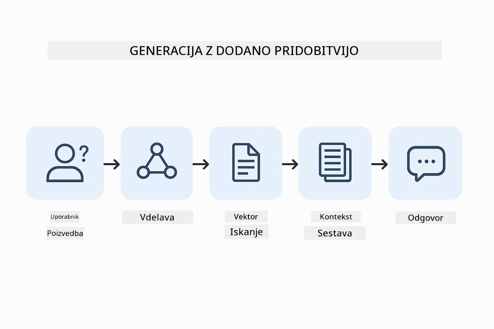
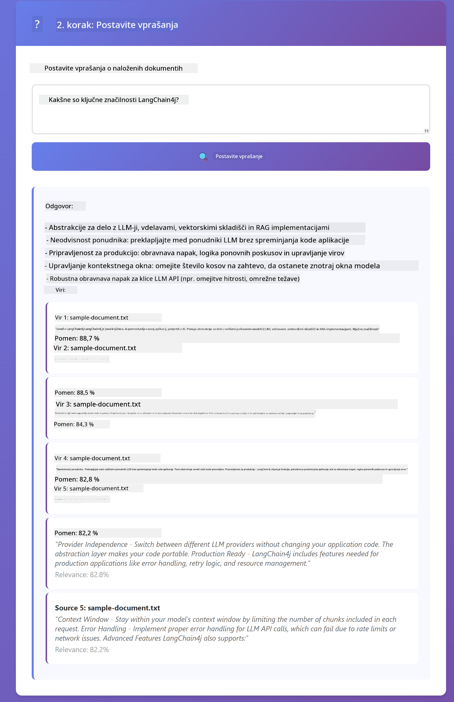

<!--
CO_OP_TRANSLATOR_METADATA:
{
  "original_hash": "f538a51cfd13147d40d84e936a0f485c",
  "translation_date": "2025-12-13T17:21:12+00:00",
  "source_file": "03-rag/README.md",
  "language_code": "sl"
}
-->
# Modul 03: RAG (Generiranje z iskanjem informacij)

## Kazalo

- [Kaj se boste naučili](../../../03-rag)
- [Predpogoji](../../../03-rag)
- [Razumevanje RAG](../../../03-rag)
- [Kako deluje](../../../03-rag)
  - [Obdelava dokumentov](../../../03-rag)
  - [Ustvarjanje vdelav](../../../03-rag)
  - [Semantično iskanje](../../../03-rag)
  - [Generiranje odgovorov](../../../03-rag)
- [Zagon aplikacije](../../../03-rag)
- [Uporaba aplikacije](../../../03-rag)
  - [Naloži dokument](../../../03-rag)
  - [Postavi vprašanja](../../../03-rag)
  - [Preveri vire](../../../03-rag)
  - [Eksperimentiraj z vprašanji](../../../03-rag)
- [Ključni pojmi](../../../03-rag)
  - [Strategija razdelitve na kose](../../../03-rag)
  - [Ocene podobnosti](../../../03-rag)
  - [Shranjevanje v pomnilniku](../../../03-rag)
  - [Upravljanje kontekstnega okna](../../../03-rag)
- [Kdaj je RAG pomemben](../../../03-rag)
- [Naslednji koraki](../../../03-rag)

## Kaj se boste naučili

V prejšnjih modulih ste se naučili, kako voditi pogovore z AI in učinkovito strukturirati svoje pozive. Toda obstaja temeljna omejitev: jezikovni modeli poznajo le tisto, kar so se naučili med usposabljanjem. Ne morejo odgovarjati na vprašanja o pravilnikih vašega podjetja, dokumentaciji vaših projektov ali kakršnih koli informacijah, na katerih niso bili usposobljeni.

RAG (Generiranje z iskanjem informacij) rešuje ta problem. Namesto da bi modelu poskušali "naučiti" vaše informacije (kar je drago in nepraktično), mu omogočite iskanje po vaših dokumentih. Ko nekdo postavi vprašanje, sistem najde ustrezne informacije in jih vključi v poziv. Model nato odgovori na podlagi tega pridobljenega konteksta.

RAG si lahko predstavljate kot da modelu daste referenčno knjižnico. Ko postavite vprašanje, sistem:

1. **Uporabniški poizvedba** - Postavite vprašanje  
2. **Vdelava** - Vaše vprašanje pretvori v vektor  
3. **Iskanje vektorjev** - Najde podobne kose dokumentov  
4. **Sestavljanje konteksta** - Doda ustrezne kose v poziv  
5. **Odgovor** - LLM generira odgovor na podlagi konteksta  

To utemelji odgovore modela na vaših dejanskih podatkih namesto da bi se zanašal na svoje usposabljanje ali si izmislil odgovore.



*Potek dela RAG - od uporabniške poizvedbe do semantičnega iskanja do generiranja kontekstualnega odgovora*

## Predpogoji

- Dokončan Modul 01 (vzpostavljeni Azure OpenAI viri)  
- Datoteka `.env` v korenski mapi z Azure poverilnicami (ustvarjena z `azd up` v Modulu 01)  

> **Opomba:** Če niste dokončali Modula 01, najprej sledite navodilom za namestitev tam.

## Kako deluje

**Obdelava dokumentov** - [DocumentService.java](../../../03-rag/src/main/java/com/example/langchain4j/rag/service/DocumentService.java)

Ko naložite dokument, ga sistem razdeli na kose - manjše dele, ki udobno ustrezajo v kontekstno okno modela. Ti kosi se rahlo prekrivajo, da ne izgubite konteksta na mejah.

```java
Document document = FileSystemDocumentLoader.loadDocument("sample-document.txt");

DocumentSplitter splitter = DocumentSplitters
    .recursive(300, 30, new OpenAiTokenizer());

List<TextSegment> segments = splitter.split(document);
```
  
> **🤖 Poskusite z [GitHub Copilot](https://github.com/features/copilot) Chat:** Odprite [`DocumentService.java`](../../../03-rag/src/main/java/com/example/langchain4j/rag/service/DocumentService.java) in vprašajte:  
> - "Kako LangChain4j razdeli dokumente na kose in zakaj je prekrivanje pomembno?"  
> - "Kakšna je optimalna velikost kosa za različne vrste dokumentov in zakaj?"  
> - "Kako obravnavam dokumente v več jezikih ali s posebno obliko?"

**Ustvarjanje vdelav** - [LangChainRagConfig.java](../../../03-rag/src/main/java/com/example/langchain4j/rag/config/LangChainRagConfig.java)

Vsak kos se pretvori v numerično predstavitev, imenovano vdelava - v bistvu matematični prstni odtis, ki zajame pomen besedila. Podobno besedilo proizvaja podobne vdelave.

```java
@Bean
public EmbeddingModel embeddingModel() {
    return OpenAiOfficialEmbeddingModel.builder()
        .baseUrl(azureOpenAiEndpoint)
        .apiKey(azureOpenAiKey)
        .modelName(azureEmbeddingDeploymentName)
        .build();
}

EmbeddingStore<TextSegment> embeddingStore = 
    new InMemoryEmbeddingStore<>();
```
  


*Dokumenti predstavljeni kot vektorji v prostoru vdelav - podobne vsebine se združujejo*

**Semantično iskanje** - [RagService.java](../../../03-rag/src/main/java/com/example/langchain4j/rag/service/RagService.java)

Ko postavite vprašanje, tudi vaše vprašanje postane vdelava. Sistem primerja vdelavo vašega vprašanja z vsemi vdelavami kosov dokumentov. Najde kose z najbolj podobnimi pomeni - ne le ujemanje ključnih besed, ampak dejanska semantična podobnost.

```java
Embedding queryEmbedding = embeddingModel.embed(question).content();

List<EmbeddingMatch<TextSegment>> matches = 
    embeddingStore.findRelevant(queryEmbedding, 5, 0.7);

for (EmbeddingMatch<TextSegment> match : matches) {
    String relevantText = match.embedded().text();
    double score = match.score();
}
```
  
> **🤖 Poskusite z [GitHub Copilot](https://github.com/features/copilot) Chat:** Odprite [`RagService.java`](../../../03-rag/src/main/java/com/example/langchain4j/rag/service/RagService.java) in vprašajte:  
> - "Kako deluje iskanje podobnosti z vdelavami in kaj določa oceno?"  
> - "Kakšen prag podobnosti naj uporabim in kako vpliva na rezultate?"  
> - "Kako ravnam v primerih, ko ni najdenih ustreznih dokumentov?"

**Generiranje odgovorov** - [RagService.java](../../../03-rag/src/main/java/com/example/langchain4j/rag/service/RagService.java)

Najbolj relevantni kosi so vključeni v poziv modelu. Model prebere te specifične kose in odgovori na vaše vprašanje na podlagi teh informacij. To preprečuje halucinacije - model lahko odgovori le na podlagi tega, kar ima pred seboj.

## Zagon aplikacije

**Preverite namestitev:**

Prepričajte se, da datoteka `.env` obstaja v korenski mapi z Azure poverilnicami (ustvarjena med Modulom 01):  
```bash
cat ../.env  # Prikazati bi moral AZURE_OPENAI_ENDPOINT, API_KEY, DEPLOYMENT
```
  
**Zaženite aplikacijo:**

> **Opomba:** Če ste že zagnali vse aplikacije z `./start-all.sh` iz Modula 01, ta modul že teče na vratih 8081. Lahko preskočite spodnje ukaze za zagon in pojdite neposredno na http://localhost:8081.

**Možnost 1: Uporaba Spring Boot nadzorne plošče (priporočeno za uporabnike VS Code)**

Razvojno okolje vsebuje razširitev Spring Boot Dashboard, ki omogoča vizualno upravljanje vseh Spring Boot aplikacij. Najdete jo v vrstici aktivnosti na levi strani VS Code (ikona Spring Boot).

Iz Spring Boot nadzorne plošče lahko:  
- Vidite vse razpoložljive Spring Boot aplikacije v delovnem prostoru  
- Zaženete/ustavite aplikacije z enim klikom  
- V realnem času spremljate dnevnike aplikacij  
- Nadzorujete stanje aplikacij  

Preprosto kliknite gumb za predvajanje zraven "rag" za zagon tega modula ali zaženite vse module hkrati.


**Možnost 2: Uporaba ukaznih skript**

Zaženite vse spletne aplikacije (moduli 01-04):

**Bash:**  
```bash
cd ..  # Iz korenskega imenika
./start-all.sh
```
  
**PowerShell:**  
```powershell
cd ..  # Iz korenskega imenika
.\start-all.ps1
```
  
Ali zaženite samo ta modul:

**Bash:**  
```bash
cd 03-rag
./start.sh
```
  
**PowerShell:**  
```powershell
cd 03-rag
.\start.ps1
```
  
Oba skripta samodejno naložita okoljske spremenljivke iz korenske datoteke `.env` in zgradita JAR-je, če ti ne obstajajo.

> **Opomba:** Če želite pred zagonom ročno zgraditi vse module:  
>  
> **Bash:**  
> ```bash
> cd ..  # Go to root directory
> mvn clean package -DskipTests
> ```
  
> **PowerShell:**  
> ```powershell
> cd ..  # Go to root directory
> mvn clean package -DskipTests
> ```
  
Odprite http://localhost:8081 v vašem brskalniku.

**Za ustavitev:**

**Bash:**  
```bash
./stop.sh  # Samo ta modul
# Ali
cd .. && ./stop-all.sh  # Vsi moduli
```
  
**PowerShell:**  
```powershell
.\stop.ps1  # Samo ta modul
# Ali
cd ..; .\stop-all.ps1  # Vsi moduli
```
  
## Uporaba aplikacije

Aplikacija omogoča spletni vmesnik za nalaganje dokumentov in postavljanje vprašanj.

<a href="images/rag-homepage.png"></a>

*Vmesnik aplikacije RAG - naložite dokumente in postavljajte vprašanja*

**Naloži dokument**

Začnite z nalaganjem dokumenta - za testiranje so najbolj primerni TXT datoteke. V tem imeniku je na voljo `sample-document.txt`, ki vsebuje informacije o funkcijah LangChain4j, implementaciji RAG in najboljših praksah - popolno za testiranje sistema.

Sistem obdela vaš dokument, ga razdeli na kose in ustvari vdelave za vsak kos. To se zgodi samodejno ob nalaganju.

**Postavi vprašanja**

Zdaj postavite specifična vprašanja o vsebini dokumenta. Poskusite z dejstvi, ki so jasno navedena v dokumentu. Sistem poišče ustrezne kose, jih vključi v poziv in generira odgovor.

**Preveri vire**

Opazite, da vsak odgovor vključuje reference na vire z ocenami podobnosti. Te ocene (od 0 do 1) kažejo, kako relevantni so bili posamezni kosi za vaše vprašanje. Višje ocene pomenijo boljše ujemanje. Tako lahko preverite odgovor glede na izvorno gradivo.

<a href="images/rag-query-results.png"></a>

*Rezultati poizvedbe prikazujejo odgovor z referencami virov in ocenami relevantnosti*

**Eksperimentiraj z vprašanji**

Poskusite različne vrste vprašanj:  
- Specifična dejstva: "Kakšna je glavna tema?"  
- Primerjave: "Kakšna je razlika med X in Y?"  
- Povzetki: "Povzemite ključne točke o Z"  

Opazujte, kako se ocene relevantnosti spreminjajo glede na to, kako dobro se vaše vprašanje ujema z vsebino dokumenta.

## Ključni pojmi

**Strategija razdelitve na kose**

Dokumenti so razdeljeni na kose po 300 tokenov z 30 tokeni prekrivanja. Ta ravnovesje zagotavlja, da ima vsak kos dovolj konteksta, da je smiseln, hkrati pa ostane dovolj majhen, da lahko v poziv vključite več kosov.

**Ocene podobnosti**

Ocene segajo od 0 do 1:  
- 0,7-1,0: Zelo relevantno, natančno ujemanje  
- 0,5-0,7: Relevantno, dober kontekst  
- Pod 0,5: Odfiltrirano, preveč različni  

Sistem pridobi le kose nad minimalnim pragom, da zagotovi kakovost.

**Shranjevanje v pomnilniku**

Ta modul uporablja shranjevanje v pomnilniku za preprostost. Ko ponovno zaženete aplikacijo, so naloženi dokumenti izgubljeni. Produkcijski sistemi uporabljajo trajne vektorske baze podatkov, kot so Qdrant ali Azure AI Search.

**Upravljanje kontekstnega okna**

Vsak model ima največje kontekstno okno. Ne morete vključiti vseh kosov velikega dokumenta. Sistem pridobi top N najbolj relevantnih kosov (privzeto 5), da ostane znotraj omejitev in hkrati zagotovi dovolj konteksta za natančne odgovore.

## Kdaj je RAG pomemben

**Uporabite RAG, ko:**  
- Odgovarjate na vprašanja o lastniških dokumentih  
- Informacije se pogosto spreminjajo (pravilniki, cene, specifikacije)  
- Natančnost zahteva navedbo vira  
- Vsebina je prevelika, da bi jo vključili v en sam poziv  
- Potrebujete preverljive, utemeljene odgovore  

**Ne uporabljajte RAG, ko:**  
- Vprašanja zahtevajo splošno znanje, ki ga model že ima  
- Potrebni so podatki v realnem času (RAG deluje na naloženih dokumentih)  
- Vsebina je dovolj majhna, da jo lahko vključite neposredno v pozive  

## Naslednji koraki

**Naslednji modul:** [04-tools - AI agenti z orodji](../04-tools/README.md)

---

**Navigacija:** [← Prejšnji: Modul 02 - Oblikovanje pozivov](../02-prompt-engineering/README.md) | [Nazaj na glavno](../README.md) | [Naslednji: Modul 04 - Orodja →](../04-tools/README.md)

---

<!-- CO-OP TRANSLATOR DISCLAIMER START -->
**Omejitev odgovornosti**:
Ta dokument je bil preveden z uporabo storitve za prevajanje z umetno inteligenco [Co-op Translator](https://github.com/Azure/co-op-translator). Čeprav si prizadevamo za natančnost, vas opozarjamo, da avtomatizirani prevodi lahko vsebujejo napake ali netočnosti. Izvirni dokument v njegovem izvirnem jeziku velja za avtoritativni vir. Za ključne informacije priporočamo strokovni človeški prevod. Za morebitna nesporazume ali napačne interpretacije, ki izhajajo iz uporabe tega prevoda, ne odgovarjamo.
<!-- CO-OP TRANSLATOR DISCLAIMER END -->