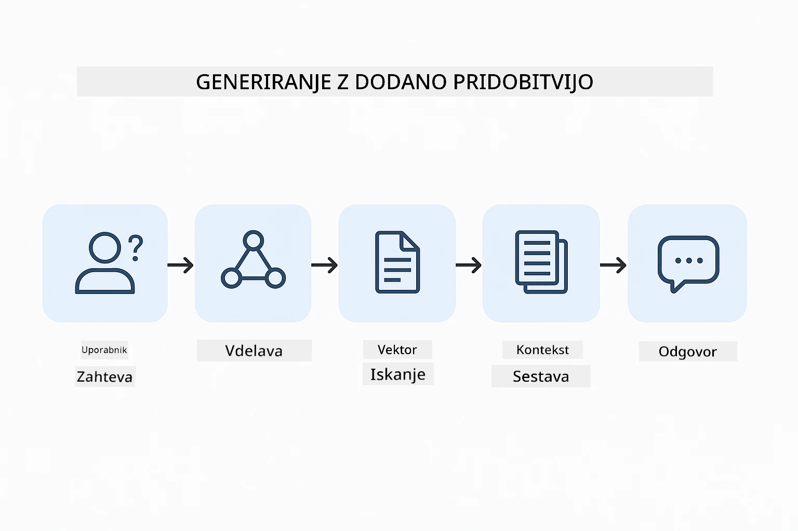
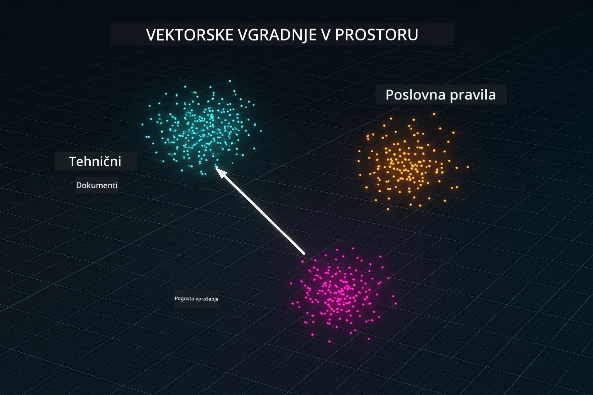
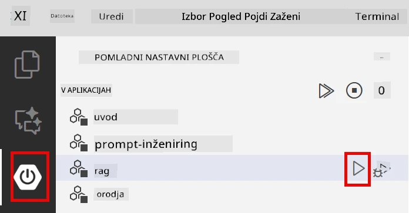
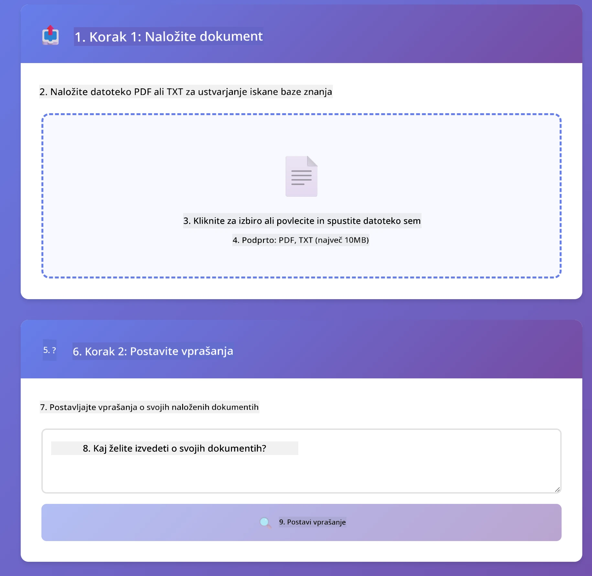
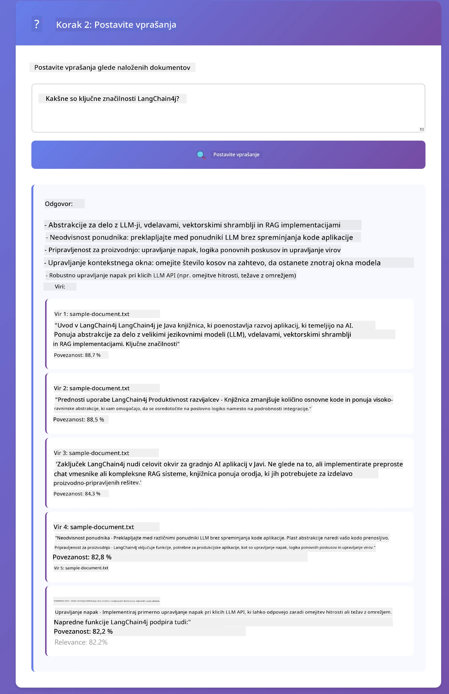

# Modul 03: RAG (Generacija z iskanjem)

## Kazalo

- [Video vodič](#video-vodič)
- [Kaj se boste naučili](#kaj-se-boste-naučili)
- [Pogojna znanja](#pogojna-znanja)
- [Razumevanje RAG](#razumevanje-rag)
  - [Kateri RAG pristop uporablja ta vodič?](#kateri-rag-pristop-uporablja-ta-vodič)
- [Kako deluje](#kako-deluje)
  - [Obdelava dokumentov](#obdelava-dokumentov)
  - [Ustvarjanje vektorskih predstavitev](#ustvarjanje-vektorskih-predstavitev)
  - [Semantično iskanje](#semantično-iskanje)
  - [Generiranje odgovorov](#generiranje-odgovora)
- [Zaženite aplikacijo](#zaženi-aplikacijo)
- [Uporaba aplikacije](#uporaba-aplikacije)
  - [Naložite dokument](#naloži-dokument)
  - [Postavljajte vprašanja](#postavi-vprašanja)
  - [Preverite reference virov](#preveri-vire)
  - [Eksperimentirajte z vprašanji](#eksperimentiraj-z-vprašanji)
- [Ključni koncepti](#ključni-koncepti)
  - [Strategija razbitja na dele](#strategija-razdelitve-na-dele)
  - [Ocene podobnosti](#ocene-podobnosti)
  - [Shranjevanje v pomnilnik](#shranjevanje-v-pomnilnik)
  - [Upravljanje okna konteksta](#upravljanje-okna-konteksta)
- [Kdaj RAG pride prav](#kdaj-je-rag-pomemben)
- [Naslednji koraki](#naslednji-koraki)

## Video vodič

Oglejte si to neposredno predstavitev, ki razlaga, kako začeti z modulom:

<a href="https://www.youtube.com/watch?v=_olq75ZH_eY"></a>

## Kaj se boste naučili

V prejšnjih modulih ste se naučili, kako voditi pogovore z AI in učinkovito strukturirati vaše pozive. Toda obstaja osnovna omejitev: jezikovni modeli poznajo le tisto, kar so se naučili med usposabljanjem. Ne morejo odgovarjati na vprašanja o politikah vašega podjetja, vaši projektni dokumentaciji ali kakršnihkoli informacijah, na katerih niso bili usposobljeni.

RAG (Generacija z iskanjem) rešuje ta problem. Namesto da bi modelu poskušali »naučiti« vaše podatke (kar je drago in nepraktično), mu omogočite iskanje znotraj vaših dokumentov. Ko nekdo postavi vprašanje, sistem poišče relevantne informacije in jih vključuje v poziv. Model nato odgovori na podlagi tega pridobljenega konteksta.

Razmislite o RAG kot o tem, da modelu daste referenčno knjižnico. Ko postavite vprašanje, sistem:

1. **Uporabniški poizvedba** - Vi postavite vprašanje  
2. **Vektorska predstavitev** - Vaše vprašanje pretvori v vektor  
3. **Večdimenzionalno iskanje** - Poišče podobne dele dokumenta  
4. **Sestava konteksta** - Doda relevantne dele v poziv  
5. **Odgovor** - Velik jezikovni model (LLM) ustvari odgovor na podlagi konteksta  

To pritrdi odgovore modela na vaše dejanske podatke namesto, da bi se zanašal na usposabljanje ali zgolj izmišljeval odgovore.

## Pogojna znanja

- Dokončan [Modul 01 - Uvod](../01-introduction/README.md) (Azure OpenAI viri vzpostavljeni, vključno z vektorskim modelom `text-embedding-3-small`)  
- `.env` datoteka v korenskem imeniku z Azure poverilnicami (ustvarjena s `azd up` v Modul 01)  

> **Opomba:** Če niste zaključili Modula 01, sledite tam navodilom za namestitev. Ukaz `azd up` vzpostavi tako GPT klepetalni model kot tudi vektorski model, ki ga uporablja ta modul.

## Razumevanje RAG

Spodnja shema ponazarja osnovni koncept: namesto da bi se model zanašal zgolj na podatke iz usposabljanja, mu RAG omogoča, da pred generiranjem vsakega odgovora najprej pregleda vaše dokumente.


*Ta shema prikazuje razliko med standardnim LLM (ki ugiba iz učnih podatkov) in RAG-razširjenim LLM (ki najprej preveri vaše dokumente).*

Tukaj je povezava vseh delov od začetka do konca. Uporabnikovo vprašanje poteka skozi štiri faze — vektorska reprezentacija, iskanje po vektorjih, sestava konteksta in generiranje odgovora — vsaka gradi na prejšnji:



*Ta shema prikazuje celoten RAG potek — vprašanje uporabnika gre skozi vektorsko reprezentacijo, iskanje po vektorjih, sestavo konteksta in generiranje odgovora.*

Preostali del tega modula obravnava vsako fazo podrobno, s kodo, ki jo lahko zaženete in spreminjate.

### Kateri RAG pristop uporablja ta vodič?

LangChain4j ponuja tri načine implementacije RAG, vsak s svojo stopnjo abstrakcije. Spodnja shema jih primerja vzporedno:


*Ta shema primerja tri LangChain4j RAG pristope — Easy, Native in Advanced — prikazuje njihove ključne sestavine in kdaj jih uporabiti.*

| Pristop | Kaj počne | Kompromisi |
|---|---|---|
| **Easy RAG** | Samodejno poveže vse prek `AiServices` in `ContentRetriever`. Označite vmesnik, priključite iskalnik in LangChain4j skrbi za vektorsko predstavitev, iskanje in sestavljanje poziva v ozadju. | Minimalno kodiranja, vendar ne vidite vsakega koraka posebej. |
| **Native RAG** | Sami kličete vektorski model, iščete v shrambi, gradite poziv in ustvarjate odgovor — korak po koraku, eksplicitno. | Več kode, a vsaka faza je vidna in prilagodljiva. |
| **Advanced RAG** | Uporablja `RetrievalAugmentor` okvir z vtičniki za transformatorje poizvedb, usmerjevalce, ponovno rangiranje in vstavljanje vsebin za proizvodne pipeleine. | Največja prilagodljivost, a bistveno več kompleksnosti. |

**Ta vodič uporablja Native pristop.** Vsak korak RAG pipeline — vektorska predstavitev poizvedbe, iskanje v vektorski shrambi, sestavljanje konteksta in generiranje odgovora — je jasno zapisan v [`RagService.java`](../../../03-rag/src/main/java/com/example/langchain4j/rag/service/RagService.java). To je namenoma: kot učni vir je pomembneje, da vidite in razumete vsak korak, kot da je koda čim krajša. Ko boste razumeli, kako kosi skupaj delujejo, lahko preidete na Easy RAG za hitre prototipe ali Advanced RAG za proizvodne sisteme.

> **💡 Vas zanima Easy RAG?** LangChain4j ponuja tudi *Easy RAG* pristop, kjer `AiServices` in `ContentRetriever` avtomatsko upravljata z vektorsko predstavitvijo, iskanjem in sestavljanjem poziva. Ta modul sledi bolj eksplicitni poti – odpira ta pipeline, da lahko sami vidite in upravljate vsako fazo.

Spodnja shema prikazuje Easy RAG pipeline. Opazite, kako `AiServices` in `EmbeddingStoreContentRetriever` skrivata vso kompleksnost — naložite dokument, priključite iskalnik in dobite odgovore. Native pristop v tem modulu pa razkrije te skrite korake:


*Ta shema prikazuje Easy RAG pipeline. Primerjajte jo z Native pristopom iz tega modula: Easy RAG skriva embedding, iskanje in sestavo poziva za `AiServices` in `ContentRetriever` — naložite dokument, priključite iskalnik in dobite odgovore. Native pristop tega modula odpira pipeline tako, da sami kličete vsako fazo (vektorska predstavitev, iskanje, sestava konteksta, generiranje), kar vam daje popoln vpogled in nadzor.*

## Kako deluje

RAG pipeline tega modula je sestavljen iz štirih zaporednih faz, ki se spustijo vsakič, ko uporabnik postavi vprašanje. Najprej se naloženi dokument **parsira in razdeli na dele**. Ti deli se nato pretvorijo v **vektorske predstavitve** in shranijo, da se lahko matematično primerjajo. Ko prispe poizvedba, sistem opravi **semantično iskanje** za najbližje dele, nato pa jih predloži kot kontekst LLM za **generiranje odgovora**. Spodnji razdelki opisujejo vsako fazo z dejansko kodo in shemami. Poglejmo prvi korak.

### Obdelava dokumentov

[DocumentService.java](../../../03-rag/src/main/java/com/example/langchain4j/rag/service/DocumentService.java)

Ko naložite dokument, ga sistem parsira (PDF ali navaden tekst), pripne metapodatke, kot je ime datoteke, nato pa ga razbije na dele — manjše koščke, ki zlahka sprejemajo model v kontekstno okno. Ti deli se rahlo prekrivajo, da ne izgubite konteksta na robovih.

```java
// Razčleni naloženo datoteko in jo zavij v LangChain4j dokument
Document document = Document.from(content, metadata);

// Razdeli na dele po 300 znakov s 30-znakovnim prekrivanjem
DocumentSplitter splitter = DocumentSplitters
    .recursive(300, 30);

List<TextSegment> segments = splitter.split(document);
```
  
Spodnja shema prikazuje, kako to deluje vizualno. Opazite, kako vsak del deli nekaj tokenov s sosedi — 30 tokenov prekrivanja zagotavlja, da ne izgubite pomembnega konteksta med deli:


*Ta shema prikazuje dokument razdeljen v 300-token bloki s 30-token prekrivanjem, kar ohranja kontekst na robovih blokov.*

> **🤖 Poskusite z [GitHub Copilot](https://github.com/features/copilot) Chat:** Odprite [`DocumentService.java`](../../../03-rag/src/main/java/com/example/langchain4j/rag/service/DocumentService.java) in vprašajte:  
> - "Kako LangChain4j razbija dokumente na dele in zakaj je prekrivanje pomembno?"  
> - "Kakšna je optimalna velikost delov za različne vrste dokumentov in zakaj?"  
> - "Kako upravljam z dokumenti v več jezikih ali s posebnim oblikovanjem?"

### Ustvarjanje vektorskih predstavitev

[LangChainRagConfig.java](../../../03-rag/src/main/java/com/example/langchain4j/rag/config/LangChainRagConfig.java)

Vsak del se pretvori v številčno predstavitev, imenovano embedding — v bistvu pretvornik pomena v številke. Model za vektorsko predstavitev ni "inteligenten" kot klepetalni model; ne zmore slediti navodilom, razmišljati ali odgovarjati na vprašanja. Zmore pa preslikati besedilo v matematični prostor, kjer so podobni pomeni blizu drug drugega — "avto" blizu "vozilo", "politika vračila" blizu "vrnite denar". Klepetalni model je kot oseba, ki ji lahko govorite; embedding model je odličen sistem za urejanje datotek.

Spodnja shema vizualizira ta koncept — prispe besedilo, izhajajo številčni vektorji, podobni pomeni pa so blizu drug drugemu:


*Ta shema prikazuje, kako embedding model pretvori besedilo v številčne vektorje, pri čemer podobni pomeni — kot "avto" in "vozilo" — stojijo blizu drug drugemu v vektorskem prostoru.*

```java
@Bean
public EmbeddingModel embeddingModel() {
    return OpenAiOfficialEmbeddingModel.builder()
        .baseUrl(azureOpenAiEndpoint)
        .apiKey(azureOpenAiKey)
        .modelName(azureEmbeddingDeploymentName)
        .build();
}

EmbeddingStore<TextSegment> embeddingStore = 
    new InMemoryEmbeddingStore<>();
```
  
Razredna shema spodaj prikazuje dva ločena toka v RAG pipeline ter LangChain4j razrede, ki jih implementirajo. Tok **uvoza** (zažene se enkrat ob nalaganju) razdeli dokument, ustvari embedding za dele in jih shrani preko `.addAll()`. Tok **poizvedbe** (zažene se ob vsakem vprašanju) naredi embedding vprašanja, išče po shrambi s `.search()` in predloži ustrezni kontekst klepetalnemu modelu. Oba toka sta povezana prek skupnega vmesnika `EmbeddingStore<TextSegment>`:


*Ta shema prikazuje dva toka v RAG pipeline — uvoz in poizvedbo — in kako se povežeta preko skupnega vmesnika EmbeddingStore.*

Ko so embeddingi shranjeni, se podobne vsebine naravno zberejo skupaj v vektorskem prostoru. Spodnja vizualizacija prikazuje, kako se dokumenti o sorodnih temah združijo v bližnje točke, kar omogoča semantično iskanje:



*Ta vizualizacija prikazuje, kako se sorodni dokumenti zberejo skupaj v 3D vektorskem prostoru, s temami kot Tehnična dokumentacija, Poslovna pravila in Pogosto zastavljena vprašanja, ki tvorijo ločene skupine.*

Ko uporabnik išče, sistem sledi štirim korakom: enkrat naredi embedding dokumentov, za vsako poizvedbo naredi embedding vprašanja, primerja vektor poizvedbe proti vsem shranjenim vektorjem z uporabo kosinusne podobnosti in vrne top-K najvišje ocenjene dele. Spodnja shema prikazuje korake in LangChain4j razrede:


*Ta shema prikazuje štiri korake iskanja po embeddingu: embedding dokumentov, embedding poizvedbe, primerjava vektorjev s kosinusno podobnostjo in vrnitev top-K rezultatov.*

### Semantično iskanje

[RagService.java](../../../03-rag/src/main/java/com/example/langchain4j/rag/service/RagService.java)

Ko postavite vprašanje, se tudi vaše vprašanje spremeni v embedding. Sistem primerja embedding vašega vprašanja z embeddingi vseh delov dokumenta. Najde dele z najbolj podobnim pomenom — ne le besedne ujemanja, ampak dejansko semantično podobnost.

```java
Embedding queryEmbedding = embeddingModel.embed(question).content();

EmbeddingSearchRequest searchRequest = EmbeddingSearchRequest.builder()
    .queryEmbedding(queryEmbedding)
    .maxResults(5)
    .minScore(0.5)
    .build();

EmbeddingSearchResult<TextSegment> searchResult = embeddingStore.search(searchRequest);
List<EmbeddingMatch<TextSegment>> matches = searchResult.matches();

for (EmbeddingMatch<TextSegment> match : matches) {
    String relevantText = match.embedded().text();
    double score = match.score();
}
```
  
Spodnja shema primerja semantično iskanje s tradicionalnim iskanjem po ključnih besedah. Iskanje po ključni besedi "vozilo" ne zadene na del o "avtih in tovornjakih", a semantično iskanje razume, da pomenita isto in ga vrne kot visoko ujemajoč rezultat:


*Ta shema primerja iskanje po ključnih besedah in semantično iskanje, kjer semantično iskanje pridobi konceptualno sorodne vsebine, tudi če se natančne ključne besede razlikujejo.*

Pod pokrovom se podobnost meri z uporabo kosinusne podobnosti — v bistvu sprašuje »ali ti dve pušči kažeta v isto smer?« Dva dela lahko uporabita popolnoma različne besede, a če pomenita isto, večdimenzionalni vektorji kažeta v isto smer in nakazujejo oceno blizu 1,0:


*Ta diagram ponazarja podobnost kosinus kot kot med vektorskimi predstavitvami — bolj usklajeni vektorji dosegajo vrednost bližje 1,0, kar kaže na večjo semantično podobnost.*

> **🤖 Poskusi s klepetom [GitHub Copilot](https://github.com/features/copilot):** Odpri [`RagService.java`](../../../03-rag/src/main/java/com/example/langchain4j/rag/service/RagService.java) in vprašaj:
> - "Kako deluje iskanje podobnosti z embeddingi in kaj določa oceno?"
> - "Kateri prag podobnosti naj uporabim in kako vpliva na rezultate?"
> - "Kako ravnam v primerih, ko ni najdenih relevantnih dokumentov?"

### Generiranje odgovora

[RagService.java](../../../03-rag/src/main/java/com/example/langchain4j/rag/service/RagService.java)

Najbolj relevantni deli so sestavljeni v strukturiran poziv, ki vključuje eksplicitna navodila, pridobljen kontekst in uporabnikovo vprašanje. Model prebere te specifične dele in odgovori na podlagi teh informacij — lahko uporablja le tisto, kar ima pred seboj, kar preprečuje halucinacije.

```java
String context = matches.stream()
    .map(match -> match.embedded().text())
    .collect(Collectors.joining("\n\n"));

String prompt = String.format("""
    Answer the question based on the following context.
    If the answer cannot be found in the context, say so.

    Context:
    %s

    Question: %s

    Answer:""", context, request.question());

String answer = chatModel.chat(prompt);
```

Spodnji diagram prikazuje to sestavljanje v akciji — najbolj ocenjeni deli iz koraka iskanja se vnesejo v predlogo poziva, `OpenAiOfficialChatModel` pa generira utemeljen odgovor:


*Ta diagram prikazuje, kako se najbolj ocenjeni deli sestavijo v strukturiran poziv, kar omogoča modelu generiranje utemeljenega odgovora iz vaših podatkov.*

## Zaženi aplikacijo

**Preveri namestitev:**

Prepričaj se, da datoteka `.env` obstaja v korenski mapi z Azure poverilnicami (ustvarjena med modulom 01). Zaženi to iz mape modula (`03-rag/`):

**Bash:**
```bash
cat ../.env  # Naj prikazuje AZURE_OPENAI_ENDPOINT, API_KEY, DEPLOYMENT
```

**PowerShell:**
```powershell
Get-Content ..\.env  # Naj prikazuje AZURE_OPENAI_ENDPOINT, API_KEY, DEPLOYMENT
```

**Zaženi aplikacijo:**

> **Opomba:** Če si že zagnal vse aplikacije z uporabo `./start-all.sh` iz korenske mape (kot je opisano v modulu 01), ta modul že teče na vratih 8081. Ukaze za zagon spodaj lahko preskočiš in greš neposredno na http://localhost:8081.

**Možnost 1: Uporaba Spring Boot nadzorne plošče (priporočeno za uporabnike VS Code)**

Razvojno okolje vsebuje razširitev Spring Boot Dashboard, ki nudi vizualni vmesnik za upravljanje vseh aplikacij Spring Boot. Najdeš jo v vrstici aktivnosti na levi strani VS Code (poišči ikono Spring Boot).

Iz Spring Boot Dashboarda lahko:
- vidiš vse razpoložljive Spring Boot aplikacije v delovnem prostoru
- zaženeš/ustaviš aplikacije z enim klikom
- v realnem času spremljaš dnevnike aplikacij
- spremljaš status aplikacij

Preprosto klikni na gumb predvajanja poleg "rag", da zaženeš ta modul, ali pa zaženi vse module naenkrat.



*Ta posnetek zaslona prikazuje Spring Boot nadzorno ploščo v VS Code, kjer lahko vizualno zaženeš, ustaviš in spremljaš aplikacije.*

**Možnost 2: Uporaba ukaznih skript**

Zaženi vse spletne aplikacije (moduli 01-04):

**Bash:**
```bash
cd ..  # Iz korenskega imenika
./start-all.sh
```

**PowerShell:**
```powershell
cd ..  # Iz korenske mape
.\start-all.ps1
```

Ali zaženi samo ta modul:

**Bash:**
```bash
cd 03-rag
./start.sh
```

**PowerShell:**
```powershell
cd 03-rag
.\start.ps1
```

Oba skripta samodejno naložita spremenljivke okolja iz korenske `.env` datoteke in po potrebi zgradita JAR datoteke.

> **Opomba:** Če raje ročno zgradiš vse module pred zagonom:
>
> **Bash:**
> ```bash
> cd ..  # Go to root directory
> mvn clean package -DskipTests
> ```

> **PowerShell:**
> ```powershell
> cd ..  # Go to root directory
> mvn clean package -DskipTests
> ```

Odpri http://localhost:8081 v svojem brskalniku.

**Za ustavitev:**

**Bash:**
```bash
./stop.sh  # Samo ta modul
# Ali
cd .. && ./stop-all.sh  # Vsi moduli
```

**PowerShell:**
```powershell
.\stop.ps1  # Samo ta modul
# Ali
cd ..; .\stop-all.ps1  # Vsi moduli
```

## Uporaba aplikacije

Aplikacija nudi spletni vmesnik za nalaganje dokumentov in postavljanje vprašanj.

<a href="images/rag-homepage.png"></a>

*Ta posnetek prikazuje vmesnik RAG aplikacije, kjer nalagaš dokumente in postavljaš vprašanja.*

### Naloži dokument

Začni z nalaganjem dokumenta — za testiranje najbolje delujejo TXT datoteke. V tej mapi je na voljo `sample-document.txt`, ki vsebuje informacije o funkcijah LangChain4j, implementaciji RAG in najboljših praksah — idealno za testiranje sistema.

Sistem obdela tvoj dokument, ga razdeli na dele in ustvari vektorske predstavitve (embeddinge) za vsak del. To se zgodi samodejno ob nalaganju.

### Postavi vprašanja

Zdaj postavi specifična vprašanja o vsebini dokumenta. Poskusi nekaj dejanskega, kar je jasno navedeno v dokumentu. Sistem poišče relevantne dele, jih vključi v poziv in generira odgovor.

### Preveri vire

Opazi, da vsak odgovor vključuje sklice na vire s podobnostnimi ocenami. Te ocene (od 0 do 1) prikazujejo, kako relevanten je bil vsak del za tvoje vprašanje. Višje ocene pomenijo boljše ujemanje. To ti omogoča preverjanje odgovora glede na izvorno gradivo.

<a href="images/rag-query-results.png"></a>

*Ta posnetek prikazuje rezultate poizvedbe z generiranim odgovorom, viri in ocenami relevantnosti za vsak najdeni del.*

### Eksperimentiraj z vprašanji

Preizkusi različne vrste vprašanj:
- Specifična dejstva: "Kakšna je glavna tema?"
- Primerjave: "V čem je razlika med X in Y?"
- Povzetki: "Povzemi ključne točke o Z"

Opazuj, kako se ocene relevantnosti spreminjajo glede na to, kako dobro vprašanje ustreza vsebini dokumenta.

## Ključni koncepti

### Strategija razdelitve na dele

Dokumenti so razdeljeni na 300-token dele z 30-token prekrivanjem. Ta uravnoteženost zagotavlja, da ima vsak del dovolj konteksta, da je smiseln, hkrati pa ostane dovolj majhen, da jih je mogoče vključiti več v poziv.

### Ocene podobnosti

Vsak pridobljeni del ima oceno podobnosti med 0 in 1, ki nakazuje, kako dobro se ujema z uporabnikovim vprašanjem. Spodnji diagram prikazuje razpone ocen in kako sistem uporablja te razpone za filtriranje rezultatov:


*Ta diagram prikazuje razpone ocen od 0 do 1, s minimalnim pragom 0,5, ki filtrira nepomembne dele.*

Ocene segajo od 0 do 1:
- 0,7–1,0: Zelo relevantno, natanko ujemanje
- 0,5–0,7: Relevantno, dober kontekst
- Pod 0,5: Filtrirano, preveč neujemajoče

Sistem pridobiva le dele nad minimalnim pragom, da zagotovi kakovost.

Embeddingi delujejo dobro, ko so pomeni jasno združeni, vendar imajo slepe pege. Spodnji diagram prikazuje pogoste neuspehe — preveliki deli proizvedejo zamegljene vektorje, premajhni nimajo konteksta, dvoumni izrazi kažejo na več grozdov, in neposredni pregledi (ID-ji, številke delov) z embeddingi sploh ne delujejo:


*Ta diagram prikazuje pogoste načine neuspeha embeddingov: preveliki deli, premajhni deli, dvoumni izrazi, ki kažejo na več grozdov, in neposredni pregledi, kot so ID-ji.*

### Shranjevanje v pomnilnik

Ta modul uporablja shranjevanje v pomnilnik za enostavnost. Ob ponovnem zagonu aplikacije so naloženi dokumenti izgubljeni. Produkcijski sistemi uporabljajo trajne vektorske baze, kot sta Qdrant ali Azure AI Search.

### Upravljanje okna konteksta

Vsak model ima največjo velikost kontekstnega okna. Ne moreš vključiti vseh delov velikega dokumenta. Sistem pridobi najboljših N najbolj relevantnih delov (privzeto 5), da ostane znotraj omejitev, hkrati pa nudi dovolj konteksta za točne odgovore.

## Kdaj je RAG pomemben

RAG ni vedno prava izbira. Spodnji vodnik odločitve ti pomaga določiti, kdaj RAG prinaša dodano vrednost in kdaj so preprostejši pristopi — kot vključevanje vsebine neposredno v poziv ali zanašanje na vgrajeno znanje modela — dovolj:


*Ta diagram prikazuje vodnik odločitve, kdaj RAG prinaša vrednost in kdaj so dovolj preprosti pristopi.*

## Naslednji koraki

**Naslednji modul:** [04-tools - AI agenti z orodji](../04-tools/README.md)

---

**Navigacija:** [← Prejšnji: Modul 02 - Inženiring pozivov](../02-prompt-engineering/README.md) | [Nazaj na začetek](../README.md) | [Naprej: Modul 04 - Orodja →](../04-tools/README.md)

---

<!-- CO-OP TRANSLATOR DISCLAIMER START -->
**Omejitev odgovornosti**:
Ta dokument je bil preveden z uporabo AI prevajalske storitve [Co-op Translator](https://github.com/Azure/co-op-translator). Čeprav si prizadevamo za natančnost, vas prosimo, da upoštevate, da avtomatizirani prevodi lahko vsebujejo napake ali netočnosti. Izvirni dokument v njegovem izvirnem jeziku je treba obravnavati kot avtoritativni vir. Za kritične informacije je priporočljiv strokovni človeški prevod. Ne odgovarjamo za morebitna nesporazume ali napačne interpretacije, ki izhajajo iz uporabe tega prevoda.
<!-- CO-OP TRANSLATOR DISCLAIMER END -->