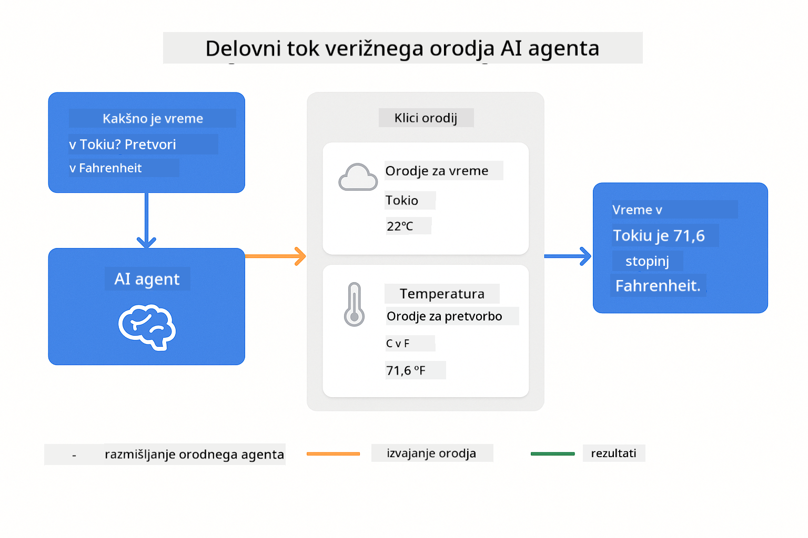
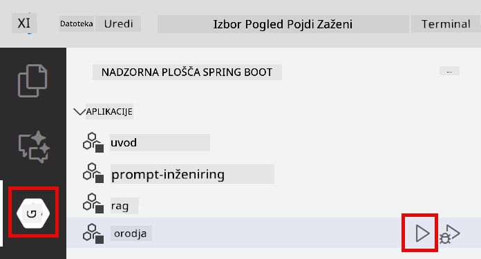

<!--
CO_OP_TRANSLATOR_METADATA:
{
  "original_hash": "844788938b26242f3cc54ce0d0951bea",
  "translation_date": "2026-01-06T01:32:48+00:00",
  "source_file": "04-tools/README.md",
  "language_code": "sl"
}
-->
# Modul 04: AI agenti z orodji

## Kazalo

- [Kaj se boste naučili](../../../04-tools)
- [Predpogoji](../../../04-tools)
- [Razumevanje AI agentov z orodji](../../../04-tools)
- [Kako deluje klic orodij](../../../04-tools)
  - [Definicije orodij](../../../04-tools)
  - [Sprejemanje odločitev](../../../04-tools)
  - [Izvajanje](../../../04-tools)
  - [Generiranje odziva](../../../04-tools)
- [Verižna uporaba orodij](../../../04-tools)
- [Zaženi aplikacijo](../../../04-tools)
- [Uporaba aplikacije](../../../04-tools)
  - [Poskusi preprosto uporabo orodij](../../../04-tools)
  - [Preizkusi verižna orodja](../../../04-tools)
  - [Poglej potek pogovora](../../../04-tools)
  - [Eksperimentiraj z različnimi zahtevami](../../../04-tools)
- [Ključni koncepti](../../../04-tools)
  - [Vzorec ReAct (razmišljanje in ukrepanje)](../../../04-tools)
  - [Pomembnost opisov orodij](../../../04-tools)
  - [Upravljanje sej](../../../04-tools)
  - [Ravnanje z napakami](../../../04-tools)
- [Razpoložljiva orodja](../../../04-tools)
- [Kdaj uporabljati agente, osnovane na orodjih](../../../04-tools)
- [Naslednji koraki](../../../04-tools)

## Kaj se boste naučili

Do sedaj ste se naučili, kako voditi pogovore z AI, učinkovito strukturirati pozive in utemeljiti odgovore v svojih dokumentih. Vendar pa obstaja temeljna omejitev: jezikovni modeli lahko samo ustvarjajo besedilo. Ne morejo preveriti vremena, izvajati izračunov, poizvedovati v bazah podatkov ali komunicirati z zunanjimi sistemi.

Orodja to spremenijo. Z omogočanjem modelu dostopa do funkcij, ki jih lahko pokliče, ga spremenite iz generatorja besedila v agenta, ki lahko izvaja dejanja. Model odloča, kdaj potrebuje orodje, katero orodje uporabiti in katere parametre posredovati. Vaša koda izvrši funkcijo in vrne rezultat. Model vključi ta rezultat v svoj odgovor.

## Predpogoji

- Zaključen Modul 01 (Azure OpenAI viri nameščeni)
- Datoteka `.env` v korenski mapi z Azure poverilnicami (ustvarjena z `azd up` v Modulu 01)

> **Opomba:** Če niste zaključili Modula 01, najprej sledite navodilom za namestitev tam.

## Razumevanje AI agentov z orodji

> **📝 Opomba:** Izraz "agenti" v tem modulu označuje AI pomočnike, izboljšane s sposobnostjo klicanja orodij. To je drugačno od vzorcev **Agentic AI** (avtonomni agenti s planiranjem, spominom in večstopenjskim rezoniranjem), ki jih bomo obravnavali v [Modulu 05: MCP](../05-mcp/README.md).

AI agent z orodji sledi vzorcu razmišljanja in ukrepanja (ReAct):

1. Uporabnik postavi vprašanje  
2. Agent razmišlja, kaj mora vedeti  
3. Agent se odloči, ali potrebuje orodje za odgovor  
4. Če da, agent pokliče ustrezno orodje z ustreznimi parametri  
5. Orodje izvede in vrne podatke  
6. Agent vključi rezultat in poda končni odgovor


*Vzorec ReAct – kako AI agenti izmenično razmišljajo in ukrepajo za reševanje problemov*

To se dogaja samodejno. Vi definirate orodja in njihove opise. Model skrbi za odločanje o tem, kdaj in kako jih uporabiti.

## Kako deluje klic orodij

### Definicije orodij

[WeatherTool.java](../../../04-tools/src/main/java/com/example/langchain4j/agents/tools/WeatherTool.java) | [TemperatureTool.java](../../../04-tools/src/main/java/com/example/langchain4j/agents/tools/TemperatureTool.java)

Definirate funkcije s jasnimi opisi in specifikacijami parametrov. Model vidi te opise v svojem sistemskem pozivu in razume, kaj vsak instrument počne.

```java
@Component
public class WeatherTool {
    
    @Tool("Get the current weather for a location")
    public String getCurrentWeather(@P("Location name") String location) {
        // Vaša logika iskanja vremena
        return "Weather in " + location + ": 22°C, cloudy";
    }
}

@AiService
public interface Assistant {
    String chat(@MemoryId String sessionId, @UserMessage String message);
}

// Pomočnik je samodejno povezan preko Spring Boot z:
// - ChatModel komponento
// - Vse @Tool metode iz @Component razredov
// - ChatMemoryProvider za upravljanje sej
```

> **🤖 Preizkusi z [GitHub Copilot](https://github.com/features/copilot) klepetom:** Odpri [`WeatherTool.java`](../../../04-tools/src/main/java/com/example/langchain4j/agents/tools/WeatherTool.java) in vprašaj:
> - "Kako bi integriral pravo vremensko API, kot je OpenWeatherMap, namesto simuliranih podatkov?"
> - "Kaj naredi dober opis orodja, ki pomaga AI pravilno uporabljati orodje?"
> - "Kako ravnam z napakami API in omejitvami hitrosti v implementacijah orodij?"

### Sprejemanje odločitev

Ko uporabnik vpraša "Kakšno je vreme v Seattlu?", model prepozna, da potrebuje vremensko orodje. Ustvari klic funkcije s parametrom lokacije nastavljenim na "Seattle".

### Izvajanje

[AgentService.java](../../../04-tools/src/main/java/com/example/langchain4j/agents/service/AgentService.java)

Spring Boot samodejno poveže deklarativni vmesnik `@AiService` z vsemi registriranimi orodji, LangChain4j pa avtomatsko izvede klice orodij.

> **🤖 Preizkusi z [GitHub Copilot](https://github.com/features/copilot) klepetom:** Odpri [`AgentService.java`](../../../04-tools/src/main/java/com/example/langchain4j/agents/service/AgentService.java) in vprašaj:
> - "Kako deluje vzorec ReAct in zakaj je učinkovit za AI agente?"
> - "Kako agent odloča, katero orodje uporabiti in v kakšnem zaporedju?"
> - "Kaj se zgodi, če izvedba orodja ne uspe – kako naj robustno obravnavam napake?"

### Generiranje odziva

Model prejme podatke o vremenu in jih oblikuje v odgovor v naravnem jeziku za uporabnika.

### Zakaj uporabljati deklarativne AI storitve?

Ta modul uporablja LangChain4j integracijo s Spring Boot za deklarativne vmesnike `@AiService`:

- **Samodejno povezovanje Spring Boot** – ChatModel in orodja vbrizgana samodejno  
- **Vzorec @MemoryId** – Samodejno upravljanje spomina, vezanega na seje  
- **En sam primerek** – Pomočnik ustvarjen enkrat in ponovno uporabljen za boljšo zmogljivost  
- **Izvajanje z varnostjo tipov** – Java metode poklicane neposredno s pretvorbo tipov  
- **Orkestracija več korakov** – Samodejno upravljanje verižnih klicev orodij  
- **Brez nepotrebne kode** – Ni ročnega klica AiServices.builder() ali ročnega sledenja spominu

Alternativni pristopi (ročni `AiServices.builder()`) zahtevajo več kode in ne izkoriščajo prednosti integracije Spring Boot.

## Verižna uporaba orodij

**Verižna uporaba orodij** – AI lahko pokliče več orodij zaporedoma. Vprašajte "Kakšno je vreme v Seattlu in ali naj vzamem dežnik?" in opazujte, kako poveže `getCurrentWeather` z razmišljanjem o dežniku.

<a href="images/tool-chaining.png"></a>

*Zaporedni klici orodij – izhod enega orodja se uporabi pri naslednji odločitvi*

**Elegantne napake** – Povprašajte po vremenu v mestu, ki ni v simuliranih podatkih. Orodje vrne sporočilo o napaki, AI pa pojasni, da ne more pomagati. Orodja varno odpadejo.

To se zgodi v enem samem koraku pogovora. Agent samodejno usklajuje več klicev orodij.

## Zaženi aplikacijo

**Preverite nameščanje:**

Poskrbite, da datoteka `.env` obstaja v korenski mapi z Azure poverilnicami (ustvarjena med Modulom 01):  
```bash
cat ../.env  # Prikazati bi moralo AZURE_OPENAI_ENDPOINT, API_KEY, DEPLOYMENT
```
  
**Zaženite aplikacijo:**

> **Opomba:** Če ste že zagnali vse aplikacije z `./start-all.sh` iz Modula 01, ta modul že teče na vratih 8084. Lahko preskočite ukaze za zagon spodaj in pojdite neposredno na http://localhost:8084.

**Možnost 1: Uporaba Spring Boot nadzorne plošče (priporočljivo za uporabnike VS Code)**

Razvojni kontejner vključuje razširitev Spring Boot Dashboard, ki nudi vizualni vmesnik za upravljanje vseh Spring Boot aplikacij. Najdete jo v vrstici z aktivnostmi na levi strani VS Code (ikona Spring Boot).

Iz Spring Boot nadzorne plošče lahko:  
- Vidite vse razpoložljive Spring Boot aplikacije v delovnem prostoru  
- Zaženete/ustavite aplikacije z enim klikom  
- Prikazujete dnevnik aplikacij v realnem času  
- Spremljate stanje aplikacij  

Preprosto kliknite gumb za zagon poleg "tools" za zagon tega modula ali zaženite vse module hkrati.



**Možnost 2: Uporaba shell skript**

Zaženi vse spletne aplikacije (moduli 01-04):

**Bash:**  
```bash
cd ..  # Iz korenskega imenika
./start-all.sh
```
  
**PowerShell:**  
```powershell
cd ..  # Iz korenskega imenika
.\start-all.ps1
```
  
Ali zaženi samo ta modul:

**Bash:**  
```bash
cd 04-tools
./start.sh
```
  
**PowerShell:**  
```powershell
cd 04-tools
.\start.ps1
```
  
Oba skripta samodejno naložita okoljske spremenljivke iz korenske datoteke `.env` in po potrebi sestavita JAR datoteke.

> **Opomba:** Če raje najprej ročno sestavite vse module pred zagonom:
>  
> **Bash:**  
> ```bash
> cd ..  # Go to root directory
> mvn clean package -DskipTests
> ```
>  
> **PowerShell:**  
> ```powershell
> cd ..  # Go to root directory
> mvn clean package -DskipTests
> ```
  
Odprite http://localhost:8084 v svojem brskalniku.

**Za ustavitev:**

**Bash:**  
```bash
./stop.sh  # Samo ta modul
# Ali
cd .. && ./stop-all.sh  # Vsi moduli
```
  
**PowerShell:**  
```powershell
.\stop.ps1  # Samo ta modul
# Ali
cd ..; .\stop-all.ps1  # Vsi moduli
```
  
## Uporaba aplikacije

Aplikacija ponuja spletni vmesnik, kjer lahko komunicirate z AI agentom, ki ima dostop do orodij za vreme in pretvorbo temperatur.

<a href="images/tools-homepage.png"></a>

*Vmesnik AI agent orodij – hitri primeri in klepet za interakcijo z orodji*

### Poskusi preprosto uporabo orodij

Začni s preprostim vprašanjem: "Pretvori 100 stopinj Fahrenheita v Celzija". Agent prepozna, da potrebuje orodje za pretvorbo temperature, ga pokliče z ustreznimi parametri in vrne rezultat. Opazite, kako naravno se to zdi – niste določili, katero orodje uporabiti ali kako ga poklicati.

### Preizkusi verižna orodja

Zdaj poskusi nekaj bolj zapletenega: "Kakšno je vreme v Seattlu in pretvori ga v Fahrenheit?" Opazujte, kako agent pelje skozi ta postopek po korakih. Najprej dobi vreme (v Celziju), prepozna, da mora pretvoriti v Fahrenheit, pokliče pretvorbeno orodje in združi oba rezultata v en odgovor.

### Poglej potek pogovora

Klepet ohranja zgodovino pogovora, kar omogoča večkrožno interakcijo. Vidite lahko vse prejšnje poizvedbe in odgovore, zato je enostavno slediti pogovoru in razumeti, kako agent gradi kontekst skozi več izmenjav.

<a href="images/tools-conversation-demo.png"></a>

*Večkrožni pogovor, ki prikazuje preproste pretvorbe, iskanje vremena in verižna orodja*

### Eksperimentiraj z različnimi zahtevami

Preizkusite različne kombinacije:  
- Vprašanja o vremenu: "Kakšno je vreme v Tokiu?"  
- Pretvorbe temperatur: "Koliko je 25 °C v kelvinih?"  
- Združene poizvedbe: "Preveri vreme v Parizu in povej, ali je nad 20 °C"

Opazite, kako agent interpretira naravni jezik in ga preslika v ustrezne klice orodij.

## Ključni koncepti

### Vzorec ReAct (razmišljanje in ukrepanje)

Agent izmenično razmišlja (odloča, kaj storiti) in ukrepa (uporablja orodja). Ta vzorec omogoča avtonomno reševanje problemov namesto samo odgovarjanja na navodila.

### Pomembnost opisov orodij

Kakovost opisov orodij neposredno vpliva na to, kako dobro jih agent uporablja. Jasni, specifični opisi pomagajo modelu razumeti, kdaj in kako poklicati posamezna orodja.

### Upravljanje sej

Oznaka `@MemoryId` omogoča samodejno upravljanje spomina, vezanega na sejo. Vsak ID seje dobi svojo instanco `ChatMemory`, ki jo upravlja komponenta `ChatMemoryProvider`, kar odstrani potrebo po ročnem sledenju spomina.

### Ravnanje z napakami

Orodja lahko odpovejo – API-ji potekajo, parametri so lahko neveljavni, zunanje storitve prenehajo delovati. Proizvodni agenti potrebujejo ravnanje z napakami, da model lahko pojasni težave ali poskusi alternative.

## Razpoložljiva orodja

**Vremenska orodja** (simulirani podatki za predstavitev):  
- Pridobi trenutno vreme za lokacijo  
- Pridobi večdnevno napoved

**Orodja za pretvorbo temperature:**  
- Celzij v Fahrenheit  
- Fahrenheit v Celzij  
- Celzij v Kelvin  
- Kelvin v Celzij  
- Fahrenheit v Kelvin  
- Kelvin v Fahrenheit

To so preprosti primeri, vendar se vzorec razširi na katerokoli funkcijo: poizvedbe v bazah podatkov, klice API-jev, izračune, upravljanje datotek ali sistemske ukaze.

## Kdaj uporabljati agente, osnovane na orodjih

**Uporabljajte orodja, kadar:**  
- Odgovarjanje zahteva podatke v realnem času (vreme, cene delnic, zaloge)  
- Potrebujete izračune, ki presegajo preprosto matematiko  
- Dostopate do baz podatkov ali API-jev  
- Izvajate dejanja (pošiljanje e-pošte, ustvarjanje vstopnic, posodabljanje zapisov)  
- Združujete več virov podatkov

**Ne uporabljajte orodij, kadar:**  
- Vprašanja so odgovorjena z uporabo splošnega znanja  
- Odziv je zgolj pogovoren  
- Latenca orodij bi izkušnjo prepočasi naredila

## Naslednji koraki

**Naslednji modul:** [05-mcp – Protokol modelnega konteksta (MCP)](../05-mcp/README.md)

---

**Navigacija:** [← Prejšnji: Modul 03 – RAG](../03-rag/README.md) | [Nazaj na začetek](../README.md) | [Naslednji: Modul 05 – MCP →](../05-mcp/README.md)

---

<!-- CO-OP TRANSLATOR DISCLAIMER START -->
**Izjava o omejitvi odgovornosti**:
Ta dokument je bil preveden z uporabo storitve za prevajanje AI [Co-op Translator](https://github.com/Azure/co-op-translator). Čeprav si prizadevamo za natančnost, vas prosimo, upoštevajte, da avtomatizirani prevodi lahko vsebujejo napake ali netočnosti. Izvirni dokument v njegovi izvorni jezikovni različici velja za avtoritativni vir. Za kritične informacije priporočamo strokovni človeški prevod. Za morebitna nesporazume ali napačne interpretacije, ki izhajajo iz uporabe tega prevoda, ne odgovarjamo.
<!-- CO-OP TRANSLATOR DISCLAIMER END -->