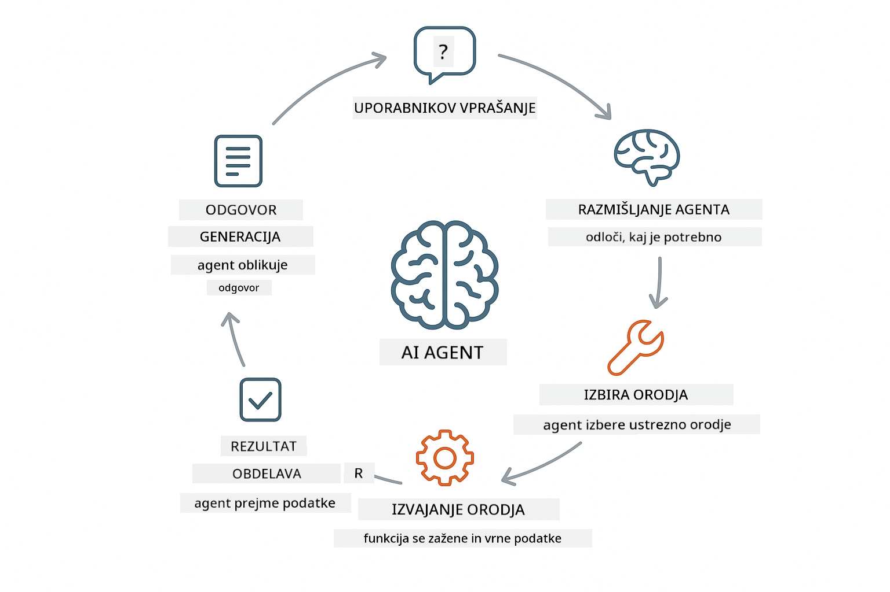
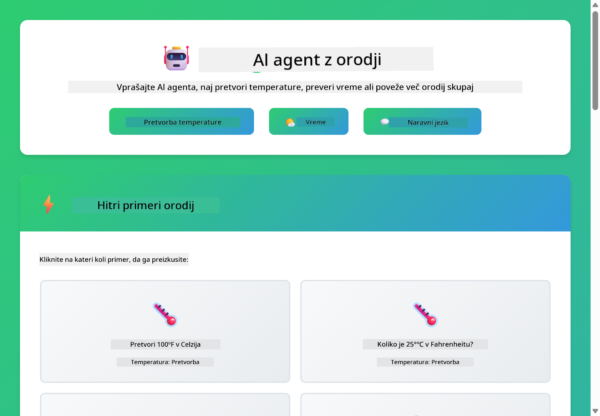
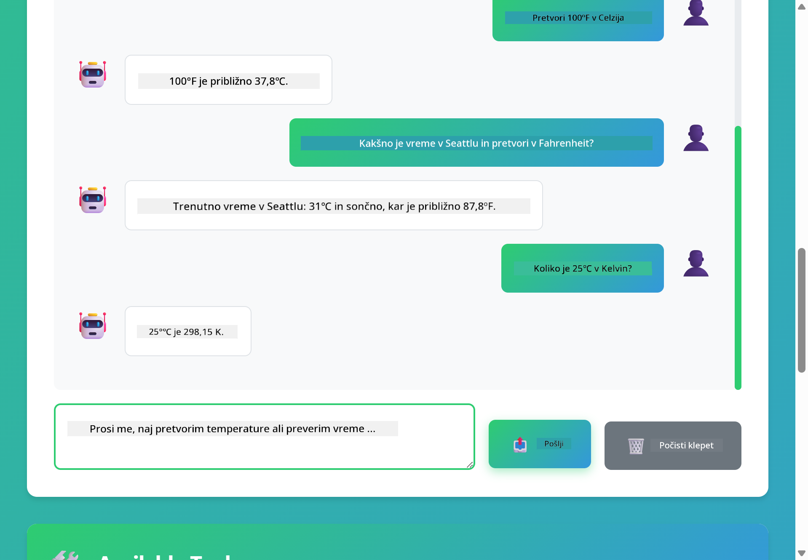

<!--
CO_OP_TRANSLATOR_METADATA:
{
  "original_hash": "aa23f106e7f53270924c9dd39c629004",
  "translation_date": "2025-12-13T19:27:55+00:00",
  "source_file": "04-tools/README.md",
  "language_code": "sl"
}
-->
# Modul 04: AI agenti z orodji

## Kazalo

- [Kaj se boste naučili](../../../04-tools)
- [Predpogoji](../../../04-tools)
- [Razumevanje AI agentov z orodji](../../../04-tools)
- [Kako deluje klic orodij](../../../04-tools)
  - [Definicije orodij](../../../04-tools)
  - [Sprejemanje odločitev](../../../04-tools)
  - [Izvedba](../../../04-tools)
  - [Generiranje odgovora](../../../04-tools)
- [Verižna uporaba orodij](../../../04-tools)
- [Zagon aplikacije](../../../04-tools)
- [Uporaba aplikacije](../../../04-tools)
  - [Preizkusite preprosto uporabo orodij](../../../04-tools)
  - [Preizkusite verižna orodja](../../../04-tools)
  - [Oglejte si potek pogovora](../../../04-tools)
  - [Opazujte razmišljanje](../../../04-tools)
  - [Eksperimentirajte z različnimi zahtevki](../../../04-tools)
- [Ključni pojmi](../../../04-tools)
  - [Vzorec ReAct (razmišljanje in delovanje)](../../../04-tools)
  - [Pomembnost opisov orodij](../../../04-tools)
  - [Upravljanje sej](../../../04-tools)
  - [Ravnanje z napakami](../../../04-tools)
- [Razpoložljiva orodja](../../../04-tools)
- [Kdaj uporabljati agente z orodji](../../../04-tools)
- [Naslednji koraki](../../../04-tools)

## Kaj se boste naučili

Do zdaj ste se naučili, kako voditi pogovore z AI, učinkovito strukturirati pozive in utemeljiti odgovore v vaših dokumentih. Vendar pa obstaja temeljna omejitev: jezikovni modeli lahko generirajo samo besedilo. Ne morejo preveriti vremena, izvajati izračunov, poizvedovati po bazah podatkov ali komunicirati z zunanjimi sistemi.

Orodja to spremenijo. Z omogočanjem dostopa modelu do funkcij, ki jih lahko kliče, ga spremenite iz generatorja besedila v agenta, ki lahko izvaja dejanja. Model odloča, kdaj potrebuje orodje, katero orodje uporabiti in katere parametre posredovati. Vaša koda izvede funkcijo in vrne rezultat. Model ta rezultat vključi v svoj odgovor.

## Predpogoji

- Zaključen Modul 01 (razporejeni Azure OpenAI viri)
- Datoteka `.env` v korenski mapi z Azure poverilnicami (ustvarjena z `azd up` v Modulu 01)

> **Opomba:** Če niste zaključili Modula 01, najprej sledite navodilom za razporeditev tam.

## Razumevanje AI agentov z orodji

AI agent z orodji sledi vzorcu razmišljanja in delovanja (ReAct):

1. Uporabnik postavi vprašanje
2. Agent razmišlja, kaj mora vedeti
3. Agent odloči, ali potrebuje orodje za odgovor
4. Če da, agent pokliče ustrezno orodje z ustreznimi parametri
5. Orodje izvede in vrne podatke
6. Agent vključi rezultat in poda končni odgovor



*Vzorec ReAct - kako AI agenti izmenično razmišljajo in delujejo za reševanje problemov*

To se zgodi samodejno. Definirate orodja in njihove opise. Model skrbi za odločanje, kdaj in kako jih uporabiti.

## Kako deluje klic orodij

**Definicije orodij** - [WeatherTool.java](../../../04-tools/src/main/java/com/example/langchain4j/agents/tools/WeatherTool.java) | [TemperatureTool.java](../../../04-tools/src/main/java/com/example/langchain4j/agents/tools/TemperatureTool.java)

Definirate funkcije z jasnimi opisi in specifikacijami parametrov. Model vidi te opise v svojem sistemskem pozivu in razume, kaj vsako orodje počne.

```java
@Component
public class WeatherTool {
    
    @Tool("Get the current weather for a location")
    public String getCurrentWeather(@P("Location name") String location) {
        // Vaša logika iskanja vremena
        return "Weather in " + location + ": 22°C, cloudy";
    }
}

@AiService
public interface Assistant {
    String chat(@MemoryId String sessionId, @UserMessage String message);
}

// Asistent je samodejno povezan s Spring Boot z:
// - ChatModel bean
// - Vse metode @Tool iz razredov @Component
// - ChatMemoryProvider za upravljanje sej
```

> **🤖 Preizkusite z [GitHub Copilot](https://github.com/features/copilot) Chat:** Odprite [`WeatherTool.java`](../../../04-tools/src/main/java/com/example/langchain4j/agents/tools/WeatherTool.java) in vprašajte:
> - "Kako bi integriral pravi vremenski API, kot je OpenWeatherMap, namesto simuliranih podatkov?"
> - "Kaj naredi dober opis orodja, ki pomaga AI, da ga pravilno uporablja?"
> - "Kako obravnavam napake API in omejitve hitrosti v implementacijah orodij?"

**Sprejemanje odločitev**

Ko uporabnik vpraša "Kakšno je vreme v Seattlu?", model prepozna, da potrebuje vremensko orodje. Generira klic funkcije z lokacijo nastavljeno na "Seattle".

**Izvedba** - [AgentService.java](../../../04-tools/src/main/java/com/example/langchain4j/agents/service/AgentService.java)

Spring Boot samodejno poveže deklarativni vmesnik `@AiService` z vsemi registriranimi orodji, LangChain4j pa samodejno izvaja klice orodij.

> **🤖 Preizkusite z [GitHub Copilot](https://github.com/features/copilot) Chat:** Odprite [`AgentService.java`](../../../04-tools/src/main/java/com/example/langchain4j/agents/service/AgentService.java) in vprašajte:
> - "Kako deluje vzorec ReAct in zakaj je učinkovit za AI agente?"
> - "Kako agent odloči, katero orodje uporabiti in v kakšnem vrstnem redu?"
> - "Kaj se zgodi, če izvedba orodja ne uspe - kako naj robustno obravnavam napake?"

**Generiranje odgovora**

Model prejme vremenske podatke in jih oblikuje v naraven jezikovni odgovor za uporabnika.

### Zakaj uporabljati deklarativne AI storitve?

Ta modul uporablja LangChain4j integracijo s Spring Boot z deklarativnimi vmesniki `@AiService`:

- **Samodejno povezovanje Spring Boot** - ChatModel in orodja so samodejno vbrizgana
- **Vzorec @MemoryId** - Samodejno upravljanje pomnilnika na osnovi sej
- **En sam primerek** - Asistent je ustvarjen enkrat in ponovno uporabljen za boljšo zmogljivost
- **Varnost tipov pri izvedbi** - Java metode se kličejo neposredno s pretvorbo tipov
- **Večkratna orkestracija** - Samodejno upravlja verižne klice orodij
- **Brez nepotrebne kode** - Brez ročnih klicev AiServices.builder() ali ročnega upravljanja pomnilnika

Alternativni pristopi (ročni `AiServices.builder()`) zahtevajo več kode in ne izkoristijo prednosti integracije Spring Boot.

## Verižna uporaba orodij

**Verižna uporaba orodij** - AI lahko kliče več orodij zaporedoma. Vprašajte "Kakšno je vreme v Seattlu in ali naj prinesem dežnik?" in opazujte, kako poveže `getCurrentWeather` z razmišljanjem o dežniku.

<a href="images/tool-chaining.png"></a>

*Zaporedni klici orodij - izhod enega orodja je vhod za naslednjo odločitev*

**Ljubkovalni odpovedi** - Vprašajte za vreme v mestu, ki ni v simuliranih podatkih. Orodje vrne sporočilo o napaki, AI pa pojasni, da ne more pomagati. Orodja varno odpovejo.

To se zgodi v enem samem pogovornem koraku. Agent samostojno orkestrira več klicev orodij.

## Zagon aplikacije

**Preverite razporeditev:**

Prepričajte se, da datoteka `.env` obstaja v korenski mapi z Azure poverilnicami (ustvarjena med Modulom 01):
```bash
cat ../.env  # Prikazati bi moral AZURE_OPENAI_ENDPOINT, API_KEY, DEPLOYMENT
```

**Zaženite aplikacijo:**

> **Opomba:** Če ste že zagnali vse aplikacije z `./start-all.sh` iz Modula 01, ta modul že teče na vratih 8084. Lahko preskočite spodnje ukaze za zagon in pojdite neposredno na http://localhost:8084.

**Možnost 1: Uporaba Spring Boot nadzorne plošče (priporočeno za uporabnike VS Code)**

Razvojni kontejner vključuje razširitev Spring Boot Dashboard, ki omogoča vizualno upravljanje vseh Spring Boot aplikacij. Najdete jo v vrstici aktivnosti na levi strani VS Code (ikona Spring Boot).

Iz Spring Boot nadzorne plošče lahko:
- Vidite vse razpoložljive Spring Boot aplikacije v delovnem prostoru
- Zaženete/ustavite aplikacije z enim klikom
- Ogledate dnevniške zapise aplikacij v realnem času
- Spremljate stanje aplikacij

Preprosto kliknite gumb za predvajanje poleg "tools" za zagon tega modula ali zaženite vse module hkrati.


**Možnost 2: Uporaba ukaznih skript**

Zaženite vse spletne aplikacije (moduli 01-04):

**Bash:**
```bash
cd ..  # Iz korenskega imenika
./start-all.sh
```

**PowerShell:**
```powershell
cd ..  # Iz korenskega imenika
.\start-all.ps1
```

Ali zaženite samo ta modul:

**Bash:**
```bash
cd 04-tools
./start.sh
```

**PowerShell:**
```powershell
cd 04-tools
.\start.ps1
```

Oba skripta samodejno naložita okoljske spremenljivke iz korenske datoteke `.env` in zgradita JAR-je, če ne obstajajo.

> **Opomba:** Če želite pred zagonom ročno zgraditi vse module:
>
> **Bash:**
> ```bash
> cd ..  # Go to root directory
> mvn clean package -DskipTests
> ```
>
> **PowerShell:**
> ```powershell
> cd ..  # Go to root directory
> mvn clean package -DskipTests
> ```

Odprite http://localhost:8084 v vašem brskalniku.

**Za ustavitev:**

**Bash:**
```bash
./stop.sh  # Samo ta modul
# Ali
cd .. && ./stop-all.sh  # Vsi moduli
```

**PowerShell:**
```powershell
.\stop.ps1  # Samo ta modul
# Ali
cd ..; .\stop-all.ps1  # Vsi moduli
```

## Uporaba aplikacije

Aplikacija ponuja spletni vmesnik, kjer lahko komunicirate z AI agentom, ki ima dostop do orodij za vreme in pretvorbo temperature.

<a href="images/tools-homepage.png"></a>

*Vmesnik AI agent orodij - hitri primeri in klepet za interakcijo z orodji*

**Preizkusite preprosto uporabo orodij**

Začnite s preprosto zahtevo: "Pretvori 100 stopinj Fahrenheita v Celzija". Agent prepozna, da potrebuje orodje za pretvorbo temperature, ga pokliče z ustreznimi parametri in vrne rezultat. Opazite, kako naravno deluje - niste določili, katero orodje uporabiti ali kako ga poklicati.

**Preizkusite verižna orodja**

Zdaj poskusite nekaj bolj zapletenega: "Kakšno je vreme v Seattlu in pretvori v Fahrenheita?" Opazujte, kako agent to reši v korakih. Najprej dobi vreme (v Celziju), prepozna potrebo po pretvorbi v Fahrenheita, pokliče orodje za pretvorbo in združi oba rezultata v en odgovor.

**Oglejte si potek pogovora**

Klepetalni vmesnik ohranja zgodovino pogovora, kar omogoča večkratne interakcije. Vidite lahko vse prejšnje poizvedbe in odgovore, kar olajša sledenje pogovoru in razumevanje, kako agent gradi kontekst skozi več izmenjav.

<a href="images/tools-conversation-demo.png"></a>

*Večkratni pogovor, ki prikazuje preproste pretvorbe, vremenske poizvedbe in verižna orodja*

**Eksperimentirajte z različnimi zahtevki**

Preizkusite različne kombinacije:
- Vremenske poizvedbe: "Kakšno je vreme v Tokiu?"
- Pretvorbe temperature: "Koliko je 25°C v Kelvinih?"
- Združene poizvedbe: "Preveri vreme v Parizu in povej, če je nad 20°C"

Opazite, kako agent interpretira naravni jezik in ga preslika v ustrezne klice orodij.

## Ključni pojmi

**Vzorec ReAct (razmišljanje in delovanje)**

Agent izmenično razmišlja (odloča, kaj storiti) in deluje (uporablja orodja). Ta vzorec omogoča avtonomno reševanje problemov, ne le odzivanje na ukaze.

**Pomembnost opisov orodij**

Kakovost opisov vaših orodij neposredno vpliva na to, kako dobro jih agent uporablja. Jasni, specifični opisi pomagajo modelu razumeti, kdaj in kako poklicati posamezno orodje.

**Upravljanje sej**

Oznaka `@MemoryId` omogoča samodejno upravljanje pomnilnika na osnovi sej. Vsak ID seje dobi svojo instanco `ChatMemory`, ki jo upravlja `ChatMemoryProvider` bean, kar odpravlja potrebo po ročnem sledenju pomnilnika.

**Ravnanje z napakami**

Orodja lahko odpovejo - API-ji potečejo, parametri so lahko neveljavni, zunanji servisi so nedosegljivi. Produkcijski agenti potrebujejo ravnanje z napakami, da model lahko pojasni težave ali poskusi alternative.

## Razpoložljiva orodja

**Vremenska orodja** (simulirani podatki za demonstracijo):
- Pridobi trenutno vreme za lokacijo
- Pridobi večdnevno napoved

**Orodja za pretvorbo temperature**:
- Celzij v Fahrenheit
- Fahrenheit v Celzij
- Celzij v Kelvin
- Kelvin v Celzij
- Fahrenheit v Kelvin
- Kelvin v Fahrenheit

To so preprosti primeri, vendar se vzorec razširi na katerokoli funkcijo: poizvedbe v bazo, klice API-jev, izračune, operacije z datotekami ali sistemske ukaze.

## Kdaj uporabljati agente z orodji

**Uporabite orodja, ko:**
- Odgovarjanje zahteva podatke v realnem času (vreme, cene delnic, zaloge)
- Potrebujete izračune, ki presegajo preprosto matematiko
- Dostopate do baz podatkov ali API-jev
- Izvajate dejanja (pošiljanje e-pošte, ustvarjanje zahtevkov, posodabljanje zapisov)
- Združujete več virov podatkov

**Ne uporabljajte orodij, ko:**
- Vprašanja je mogoče odgovoriti iz splošnega znanja
- Odgovor je zgolj pogovoren
- Zakasnitev orodja bi naredila izkušnjo prepočasno

## Naslednji koraki

**Naslednji modul:** [05-mcp - Protokol konteksta modela (MCP)](../05-mcp/README.md)

---

**Navigacija:** [← Prejšnji: Modul 03 - RAG](../03-rag/README.md) | [Nazaj na glavno](../README.md) | [Naslednji: Modul 05 - MCP →](../05-mcp/README.md)

---

<!-- CO-OP TRANSLATOR DISCLAIMER START -->
**Omejitev odgovornosti**:
Ta dokument je bil preveden z uporabo storitve za prevajanje z umetno inteligenco [Co-op Translator](https://github.com/Azure/co-op-translator). Čeprav si prizadevamo za natančnost, vas opozarjamo, da avtomatizirani prevodi lahko vsebujejo napake ali netočnosti. Izvirni dokument v njegovem izvirnem jeziku velja za avtoritativni vir. Za ključne informacije priporočamo strokovni človeški prevod. Za morebitna nesporazume ali napačne interpretacije, ki izhajajo iz uporabe tega prevoda, ne odgovarjamo.
<!-- CO-OP TRANSLATOR DISCLAIMER END -->