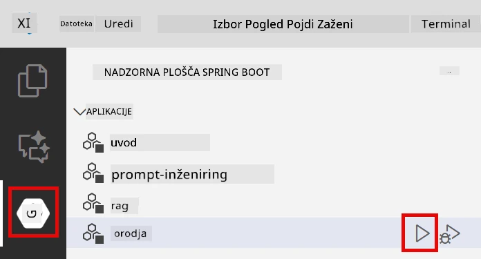
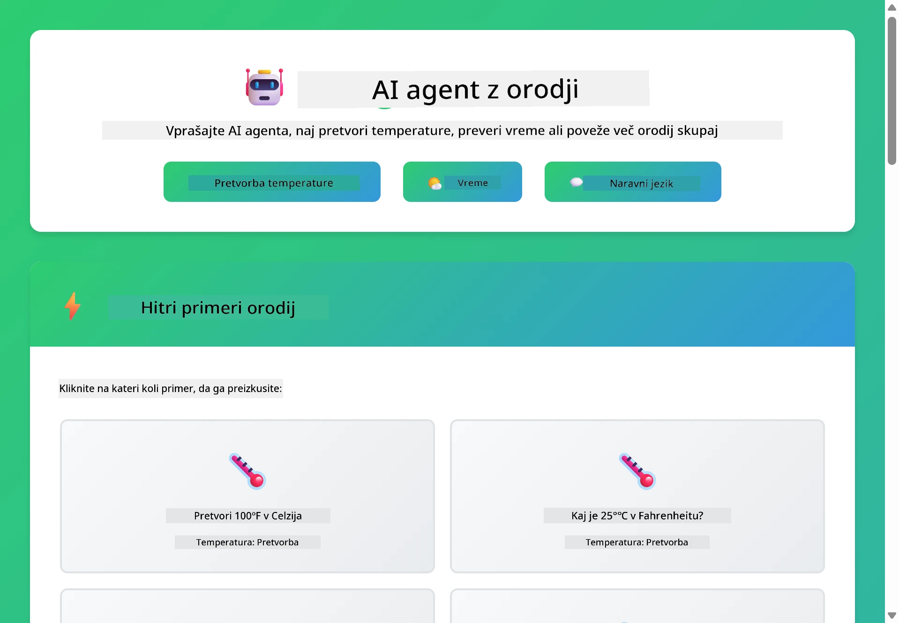
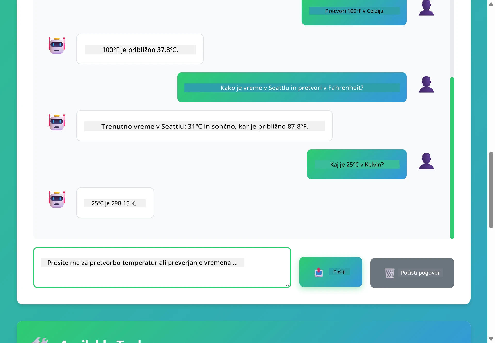

# Modul 04: AI agenti z orodji

## Kazalo vsebine

- [Video predstavitev](#video-predstavitev)
- [Kaj se boste naučili](#kaj-se-boste-naučili)
- [Predpogoji](#predpogoji)
- [Razumevanje AI agentov z orodji](#razumevanje-ai-agentov-z-orodji)
- [Kako deluje klic orodij](#kako-deluje-klic-orodij)
  - [Definicije orodij](#definicije-orodij)
  - [Sprejemanje odločitev](#sprejemanje-odločitev)
  - [Izvedba](#izvedba)
  - [Generiranje odziva](#generiranje-odziva)
  - [Arhitektura: Spring Boot samodejno povezovanje](#arhitektura-spring-boot-samodejno-povezovanje)
- [Verižna uporaba orodij](#verižna-uporaba-orodij)
- [Zagon aplikacije](#zagon-aplikacije)
- [Uporaba aplikacije](#uporaba-aplikacije)
  - [Poskus enostavne uporabe orodja](#poskusite-preprosto-uporabo-orodij)
  - [Testiranje verižne uporabe orodij](#preskusite-povezovanje-orodij)
  - [Pregled poteka pogovora](#oglejte-si-tok-pogovora)
  - [Eksperimentiranje z različnimi zahtevami](#eksperimentirajte-z-različnimi-zahtevami)
- [Ključni pojmi](#ključni-koncepti)
  - [ReAct vzorec (razmišljanje in delovanje)](#react-vzorec-razmišljanje-in-ukrepanje)
  - [Pomen opisov orodij](#opisi-orodij-so-pomembni)
  - [Upravljanje sej](#upravljanje-seje)
  - [Ravnanje z napakami](#ravnanje-z-napakami)
- [Razpoložljiva orodja](#razpoložljiva-orodja)
- [Kdaj uporabljati agente na osnovi orodij](#kdaj-uporabljati-agente-z-orodji)
- [Orodja proti RAG](#orodja-proti-rag)
- [Naslednji koraki](#naslednji-koraki)

## Video predstavitev

Oglejte si to prenos v živo, ki razloži, kako začeti z modulom:

<a href="https://www.youtube.com/watch?v=O_J30kZc0rw"></a>

## Kaj se boste naučili

Do sedaj ste se naučili, kako voditi pogovore z AI, kako učinkovito strukturirati pozive in kako utemeljiti odgovore na vaših dokumentih. Vendar pa obstaja temeljna omejitev: jezikovni modeli lahko generirajo samo besedilo. Ne morejo preveriti vremena, izvajati izračunov, poizvedovati v podatkovnih bazah ali komunicirati z zunanjimi sistemi.

Orodja to spremenijo. Z zagotavljanjem modelu dostopa do funkcij, ki jih lahko kliče, ga spremenite iz generatorja besedila v agenta, ki lahko izvaja dejanja. Model odloča, kdaj potrebuje orodje, katero orodje uporabiti in katere parametre posredovati. Vaša koda izvede funkcijo in vrne rezultat. Model ta rezultat vključi v svoj odgovor.

## Predpogoji

- Dokončan [Modul 01 - Uvod](../01-introduction/README.md) (Azure OpenAI viri nameščeni)
- Priporočeni zaključeni prejšnji moduli (ta modul se sklicuje na [RAG koncepte iz Modula 03](../03-rag/README.md) v primerjavi Orodja proti RAG)
- Datoteka `.env` v korenski mapi z Azure poverilnicami (ustvarjena z `azd up` v Modulu 01)

> **Opomba:** Če modul 01 še niste dokončali, upoštevajte najprej navodila za namestitev tam.

## Razumevanje AI agentov z orodji

> **📝 Opomba:** Termin "agenti" v tem modulu se nanaša na AI asistente, izboljšane s funkcionalnostjo klica orodij. To se razlikuje od **Agentic AI** vzorcev (avtonomni agenti z načrtovanjem, spominom in večstopenjskim razmišljanjem), ki jih bomo obravnavali v [Modulu 05: MCP](../05-mcp/README.md).

Brez orodij lahko jezikovni model generira samo besedilo na podlagi svojih učnih podatkov. Če ga vprašate za trenutno vreme, mora ugibati. Če mu daste orodja, lahko pokliče vremenski API, izvede izračune ali poizveduje v podatkovni bazi — nato te resnične rezultate vplete v svoj odgovor.


*Brez orodij model lahko samo ugiba — z orodji lahko kliče API-je, izvaja izračune in vrača podatke v realnem času.*

AI agent z orodji sledi vzorcu **Razmišljanje in Delovanje (ReAct)**. Model ne odgovarja zgolj — razmišlja o tem, kaj potrebuje, ukrepa, tako da kliče orodje, opazuje rezultat in se nato odloči, ali naj še enkrat ukrepa ali poda končni odgovor:

1. **Razmišljaj** — agent analizira uporabnikovo vprašanje in določi, katere informacije potrebuje
2. **Ukrepi** — agent izbere ustrezno orodje, generira pravilne parametre in ga pokliče
3. **Opazuj** — agent prejme izhod orodja in oceni rezultat
4. **Ponovi ali odgovori** — če je potrebnih več podatkov, agent ponovi cikel; sicer sestavi naravni jezikovni odgovor


*Cikel ReAct — agent razmišlja, kaj storiti, ukrepa s klicem orodja, opazuje rezultat in ponavlja, dokler lahko ne poda končnega odgovora.*

To poteka samodejno. Definirate orodja in njihove opise. Model pa sam sprejema odločitve o tem, kdaj in kako jih uporabiti.

## Kako deluje klic orodij

### Definicije orodij

[WeatherTool.java](../../../04-tools/src/main/java/com/example/langchain4j/agents/tools/WeatherTool.java) | [TemperatureTool.java](../../../04-tools/src/main/java/com/example/langchain4j/agents/tools/TemperatureTool.java)

Definirate funkcije z jasnimi opisi in specifikacijami parametrov. Model vidi te opise v svojem sistemskem pozivu in razume, kaj vsakemu orodju pripada.

```java
@Component
public class WeatherTool {
    
    @Tool("Get the current weather for a location")
    public String getCurrentWeather(@P("Location name") String location) {
        // Vaša logika iskanja vremenskih informacij
        return "Weather in " + location + ": 22°C, cloudy";
    }
}

@AiService
public interface Assistant {
    String chat(@MemoryId String sessionId, @UserMessage String message);
}

// Asistent je samodejno povezan s Spring Boot z:
// - ChatModel bean
// - Vse @Tool metode iz @Component razredov
// - ChatMemoryProvider za upravljanje sej
```

Diagram spodaj razčleni vsako oznako in pokaže, kako vsak del pomaga AI razumeti, kdaj orodje poklicati in katere argumente posredovati:


*Anatomija definicije orodja — @Tool pove AI, kdaj naj ga uporablja, @P opiše vsak parameter, @AiService pa vse skupaj poveže ob zagonu.*

> **🤖 Preizkusite z [GitHub Copilot](https://github.com/features/copilot) Chat:** Odprite [`WeatherTool.java`](../../../04-tools/src/main/java/com/example/langchain4j/agents/tools/WeatherTool.java) in vprašajte:
> - "Kako vključim pravi vremenski API, kot je OpenWeatherMap, namesto poskusnih podatkov?"
> - "Kaj naredi dober opis orodja, ki pomaga AI, da ga pravilno uporabi?"
> - "Kako v implementacijah orodij obravnavam API napake in omejitve hitrosti?"

### Sprejemanje odločitev

Ko uporabnik vpraša "Kako je vreme v Seattlu?", model ne izbira orodja naključno. Primerja uporabnikov namen z vsemi opisi orodij, do katerih ima dostop, oceni pomembnost vsakega in izbere najbolj ustrezno. Nato ustvari strukturiran klic funkcije z ustreznimi parametri — v tem primeru nastavi `location` na `"Seattle"`.

Če nobeno orodje ne ustreza uporabnikovemu zahtevku, model odgovarja iz lastnega znanja. Če več orodij ustreza, izbere najbolj specifično.


*Model oceni vsako razpoložljivo orodje glede na uporabnikov namen in izbere najbolj ustrezno — zato so jasni in specifični opisi orodij tako pomembni.*

### Izvedba

[AgentService.java](../../../04-tools/src/main/java/com/example/langchain4j/agents/service/AgentService.java)

Spring Boot samodejno poveže deklarativni `@AiService` vmesnik z vsemi registiranimi orodji, LangChain4j pa samodejno izvrši klice orodij. Za kulisami poteka celoten klic orodja skozi šest stopenj — od naravnega jezikovnega vprašanja uporabnika do naravnega odgovora:


*Celoten potek — uporabnik postavi vprašanje, model izbere orodje, LangChain4j ga izvede, model pa vstavi rezultat v naraven odgovor.*

Za kulisami `AiServices` izvaja enak klicni cikel za katerokoli orodje — tukaj prikazan s preprostim `Calculator` orodjem. Sekvenčni diagram spodaj natančno prikazuje, kaj se dogaja:


*Cikel klica orodja — `AiServices` pošlje vaše sporočilo in sheme orodij LLM-ju, LLM odgovori s klicem funkcije, na primer `add(42, 58)`, LangChain4j lokalno izvede `Calculator` metodo in rezultat vrne za končni odgovor.*

> **🤖 Preizkusite z [GitHub Copilot](https://github.com/features/copilot) Chat:** Odprite [`AgentService.java`](../../../04-tools/src/main/java/com/example/langchain4j/agents/service/AgentService.java) in vprašajte:
> - "Kako deluje ReAct vzorec in zakaj je učinkovit za AI agente?"
> - "Kako agent odloči, katero orodje uporabiti in v kakšnem vrstnem redu?"
> - "Kaj se zgodi, če izvršitev orodja spodleti — kako naj robustno upravljam napake?"

### Generiranje odziva

Model prejme vremenske podatke in jih oblikuje v naraven odgovor za uporabnika.

### Arhitektura: Spring Boot samodejno povezovanje

Ta modul uporablja LangChain4j integracijo s Spring Boot z deklarativnimi `@AiService` vmesniki. Ob zagonu Spring Boot odkrije vsak `@Component`, ki vsebuje `@Tool` metode, vaš `ChatModel` bean in `ChatMemoryProvider` — nato vse skupaj poveže v en `Assistant` vmesnik brez nepotrebne kode.


*Vmesnik @AiService povezuje ChatModel, komponente orodij in ponudnika pomnilnika — Spring Boot samodejno skrbi za vse povezave.*

Tu je polni življenjski cikel zahtevka kot sekvenčni diagram — od HTTP zahtevka skozi kontroler, servis in samodejno povezan proxy, vse do izvedbe orodja in nazaj:


*Celoten življenjski cikel zahtevka Spring Boot — HTTP zahtevek potuje skozi kontroler in servis do samodejno povezanega Assistant proxyja, ki samodejno orkestrira LLM in klice orodij.*

Ključne prednosti tega pristopa:

- **Spring Boot samodejno povezovanje** — ChatModel in orodja so samodejno vbrizgani
- **@MemoryId vzorec** — samodejno upravljanje spomina na osnovi sej
- **En sam primerek** — Assistant ustvarjen enkrat in ponovno uporabljen za boljšo zmogljivost
- **Izvedba z varnostjo tipov** — Java metode so kliče neposredno s pretvorbo tipov
- **Večkrožna orkestracija** — samodejno upravlja verižne klice orodij
- **Brez nepotrebne kode** — brez ročnih klicev `AiServices.builder()` ali uporabe HashMap za spomin

Alternativni pristopi (ročni `AiServices.builder()`) zahtevajo več kode in zamujajo prednosti Spring Boot integracije.

## Verižna uporaba orodij

**Verižna uporaba orodij** — pravi potencial orodnjenih agentov se pokaže, ko eno vprašanje zahteva več orodij. Vprašajte "Kakšno je vreme v Seattlu v Fahrenheitu?" in agent samodejno veriženo uporabi dve orodji: najprej pokliče `getCurrentWeather` za temperaturo v Celziju, nato to vrednost posreduje `celsiusToFahrenheit` za pretvorbo — vse v enem pogovornem koraku.


*Verižna uporaba orodij v akciji — agent najprej kliče getCurrentWeather, nato rezultat v Celzijih poda v celsiusToFahrenheit in poda združen odgovor.*

**Lepe napake** — povprašajte za vreme v mestu, ki ni v poskusnih podatkih. Orodje vrne sporočilo o napaki, AI pa razloži, da ne more pomagati, namesto da bi se aplikacija zrušila. Orodja prijazno poročajo o napakah. Diagram spodaj primerja oba pristopa — ob pravilnem ravnanju z napakami agent ujame izjemo in odgovori v pomoč, brez tega pa se celotna aplikacija zruši:


*Ko orodje spodleti, agent ujame napako in odgovori s koristno razlago namesto z zrušitvijo.*

To se zgodi v enem samem pogovoru. Agent samostojno orkestrira več klicev orodij.

## Zagon aplikacije

**Preverite namestitev:**

Prepričajte se, da datoteka `.env` obstaja v korenski mapi z Azure poverilnicami (ustvarjena med Modulom 01). Zaženite to v mapi modula (`04-tools/`):

**Bash:**
```bash
cat ../.env  # Prikazati mora AZURE_OPENAI_ENDPOINT, API_KEY, DEPLOYMENT
```

**PowerShell:**
```powershell
Get-Content ..\.env  # Naj pokaže AZURE_OPENAI_ENDPOINT, API_KEY, DEPLOYMENT
```

**Zagon aplikacije:**

> **Opomba:** Če ste že zagnali vse aplikacije s pomočjo `./start-all.sh` iz korenske mape (kot opisano v Modulu 01), ta modul že teče na vratih 8084. Ukaze za zagon spodaj lahko preskočite in neposredno obiščete http://localhost:8084.

**Možnost 1: Uporaba Spring Boot nadzorne plošče (priporočeno za uporabnike VS Code)**

Razvojno okolje vključuje razširitev Spring Boot Dashboard, ki zagotavlja vizualni vmesnik za upravljanje vseh Spring Boot aplikacij. Najdete jo v lokacijski vrstici na levi strani VS Code (poglejte ikono Spring Boot).

Iz Spring Boot nadzorne plošče lahko:
- Vidite vse razpoložljive Spring Boot aplikacije v delovnem prostoru
- Zaženete/ustavite aplikacije z enim klikom
- V realnem času spremljate dnevnike aplikacij
- Spremljate status aplikacij

Preprosto kliknite gumb za predvajanje ob "tools" za zagon tega modula ali zaženite vse module hkrati.

Tako izgleda Spring Boot nadzorna plošča v VS Code:


*Spring Boot Nadzorna plošča v VS Code — zaženite, ustavite in spremljajte vse module na enem mestu*

**Možnost 2: Uporaba ukaznih skript**

Zaženite vse spletne aplikacije (moduli 01-04):

**Bash:**
```bash
cd ..  # Iz korenskega imenika
./start-all.sh
```

**PowerShell:**
```powershell
cd ..  # Iz korenskega imenika
.\start-all.ps1
```

Ali zaženite samo ta modul:

**Bash:**
```bash
cd 04-tools
./start.sh
```

**PowerShell:**
```powershell
cd 04-tools
.\start.ps1
```

Oba skripta samodejno naložita okoljske spremenljivke iz korenske datoteke `.env` in bosta sestavila JAR-e, če ti še ne obstajajo.

> **Opomba:** Če želite pred zagonom ročno sestaviti vse module:
>
> **Bash:**
> ```bash
> cd ..  # Go to root directory
> mvn clean package -DskipTests
> ```
>
> **PowerShell:**
> ```powershell
> cd ..  # Go to root directory
> mvn clean package -DskipTests
> ```

Odprite http://localhost:8084 v svojem brskalniku.

**Zaustavitev:**

**Bash:**
```bash
./stop.sh  # Samo ta modul
# Ali
cd .. && ./stop-all.sh  # Vsi moduli
```

**PowerShell:**
```powershell
.\stop.ps1  # Samo ta modul
# Ali
cd ..; .\stop-all.ps1  # Vsi moduli
```

## Uporaba aplikacije

Aplikacija nudi spletni vmesnik, kjer lahko komunicirate z AI agentom, ki ima dostop do orodij za vreme in pretvorbo temperatur. Tako izgleda vmesnik — vključuje hitre primere in klepetalni panel za pošiljanje zahtev:

<a href="images/tools-homepage.png"></a>

*Vmesnik orodij AI agenta - hitri primeri in klepetalni vmesnik za interakcijo z orodji*

### Poskusite preprosto uporabo orodij

Začnite z enostavno zahtevo: "Pretvori 100 stopinj Fahrenheita v Celzija." Agent prepozna, da potrebuje orodje za pretvorbo temperature, ga pokliče z ustreznimi parametri in vrne rezultat. Opazite, kako naravno deluje – niste specificirali, katero orodje uporabiti ali kako ga poklicati.

### Preskusite povezovanje orodij

Poskusite kaj zahtevnejšega: "Kakšno je vreme v Seattlu in pretvori to v Fahrenheite?" Opazujte, kako agent to izvede postopoma. Najprej pridobi vreme (ki vrne Celzije), potem prepozna potrebo po pretvorbi v Fahrenheite, pokliče pretvornik in združi obe informaciji v en odgovor.

### Oglejte si tok pogovora

Klepetalni vmesnik hrani zgodovino pogovorov, kar omogoča večkratne izmenjave. Vidite lahko vse prejšnje poizvedbe in odgovore, kar olajša sledenje pogovoru in razumevanje, kako agent gradi kontekst skozi številna izmenjanja.

<a href="images/tools-conversation-demo.png"></a>

*Večkratni pogovor z enostavnimi pretvorbami, vremenskimi poizvedbami in povezovanjem orodij*

### Eksperimentirajte z različnimi zahtevami

Preizkusite različne kombinacije:
- Poizvedbe za vreme: "Kakšno je vreme v Tokiu?"
- Pretvorba temperature: "Koliko je 25°C v Kelvinih?"
- Kombinirane poizvedbe: "Preveri vreme v Parizu in povej, ali je nad 20°C"

Opazite, kako agent interpretira naravni jezik in to preslika v ustrezne klice orodij.

## Ključni koncepti

### ReAct vzorec (razmišljanje in ukrepanje)

Agent izmenično razmišlja (odloča, kaj narediti) in ukrepa (uporablja orodja). Ta vzorec omogoča avtonomno reševanje problemov namesto zgolj odzivanja na ukaze.

### Opisi orodij so pomembni

Kakovost opisov orodij neposredno vpliva na učinkovitost njihove uporabe s strani agenta. Jasni in specifični opisi pomagajo modelu razumeti, kdaj in kako uporabiti posamezno orodje.

### Upravljanje seje

Oznaka `@MemoryId` omogoča samodejno upravljanje pomnilnika znotraj seje. Vsaka identifikacija seje dobi lastno instanco `ChatMemory`, ki jo upravlja `ChatMemoryProvider` bean, tako da lahko več uporabnikov istočasno komunicira z agentom brez mešanja pogovorov. Naslednji diagram prikazuje, kako so uporabniki usmerjeni v ločene shrambe spomina glede na njihove ID-je sej:


*Vsak ID seje ima ločeno zgodovino pogovorov — uporabniki nikoli ne vidijo sporočil drugih.*

### Ravnanje z napakami

Orodja lahko odpovejo — API-ji potečejo, parametri so lahko neveljavni, zunanje storitve odpovedo. Produkcijski agenti potrebujejo ravnanje z napakami, da lahko model pojasni težave ali poskusi alternative namesto, da se celotna aplikacija zruši. Ko orodje vrže izjemo, jo LangChain4j ujame in sporočilo o napaki posreduje nazaj modelu, ki lahko težavo nato pojasni v naravnem jeziku.

## Razpoložljiva orodja

Spodnji diagram prikazuje širok ekosistem orodij, ki jih lahko zgradite. Ta modul prikazuje orodja za vreme in temperaturo, a enak vzorec `@Tool` deluje za katerokoli Java metodo — od poizvedb v bazi do obdelave plačil.


*Katera koli Java metoda, označena z @Tool, postane dostopna AI-ju — vzorec se razširi na baze podatkov, API-je, elektronsko pošto, datotečne operacije in še več.*

## Kdaj uporabljati agente z orodji

Ne vsaka zahteva potrebuje orodja. Odločitev je, ali AI mora komunicirati z zunanjimi sistemi ali lahko odgovori na podlagi lastnega znanja. Naslednji vodič povzema, kdaj orodja prinašajo vrednost in kdaj niso potrebna:


*Hitri vodič za odločanje — orodja so za podatke v realnem času, izračune in ukrepe; splošno znanje in ustvarjalne naloge jih ne potrebujejo.*

## Orodja proti RAG

Moduli 03 in 04 oba razširjata zmožnosti AI, vendar na temeljno različne načine. RAG modelu omogoča dostop do **znanja** z iskanjem v dokumentih. Orodja omogočajo modelu, da sprejema **ukrepe** z izvajanjem funkcij. Spodnji diagram primerja oba pristopa — od tega, kako vsak potek dela, do kompromisov med njima:


*RAG pridobiva informacije iz statičnih dokumentov — Orodja izvajajo ukrepe in pridobivajo dinamične, trenutne podatke. Veliko produkcijskih sistemov združuje oba.*

V praksi številni produkcijski sistemi združujejo oba pristopa: RAG za utemeljitev odgovorov v vaši dokumentaciji in Orodja za pridobivanje živih podatkov ali izvajanje operacij.

## Naslednji koraki

**Naslednji modul:** [05-mcp - Protokol konteksta modela (MCP)](../05-mcp/README.md)

---

**Navigacija:** [← Prejšnji: Modul 03 - RAG](../03-rag/README.md) | [Nazaj na glavno](../README.md) | [Naslednji: Modul 05 - MCP →](../05-mcp/README.md)

---

<!-- CO-OP TRANSLATOR DISCLAIMER START -->
**Omejitev odgovornosti**:
Ta dokument je bil preveden z uporabo AI prevajalske storitve [Co-op Translator](https://github.com/Azure/co-op-translator). Čeprav si prizadevamo za natančnost, vas prosimo, da upoštevate, da avtomatizirani prevodi lahko vsebujejo napake ali netočnosti. Izvirni dokument v njegovem izvirnem jeziku je treba obravnavati kot avtoritativni vir. Za kritične informacije je priporočljiv strokovni človeški prevod. Ne odgovarjamo za morebitna nesporazume ali napačne interpretacije, ki izhajajo iz uporabe tega prevoda.
<!-- CO-OP TRANSLATOR DISCLAIMER END -->