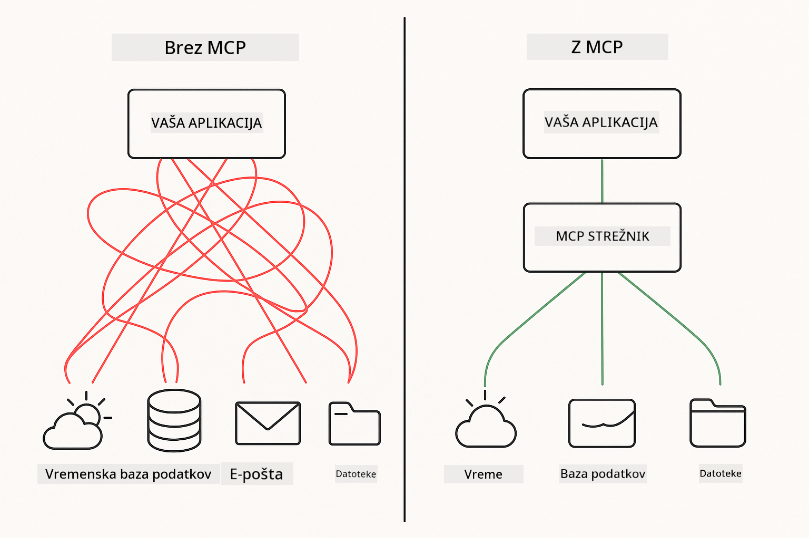

<!--
CO_OP_TRANSLATOR_METADATA:
{
  "original_hash": "c25ec1f10ef156c53e190cdf8b0711ab",
  "translation_date": "2025-12-13T18:08:28+00:00",
  "source_file": "05-mcp/README.md",
  "language_code": "sl"
}
-->
# Modul 05: Protokol konteksta modela (MCP)

## Kazalo

- [Kaj se boste naučili](../../../05-mcp)
- [Razumevanje MCP](../../../05-mcp)
- [Kako MCP deluje](../../../05-mcp)
  - [Arhitektura strežnik-stranka](../../../05-mcp)
  - [Odkritje orodij](../../../05-mcp)
  - [Transportni mehanizmi](../../../05-mcp)
- [Predpogoji](../../../05-mcp)
- [Kaj zajema ta modul](../../../05-mcp)
- [Hiter začetek](../../../05-mcp)
  - [Primer 1: Oddaljeni kalkulator (Streamable HTTP)](../../../05-mcp)
  - [Primer 2: Operacije z datotekami (Stdio)](../../../05-mcp)
  - [Primer 3: Analiza Git (Docker)](../../../05-mcp)
- [Ključni pojmi](../../../05-mcp)
  - [Izbira transporta](../../../05-mcp)
  - [Odkritje orodij](../../../05-mcp)
  - [Upravljanje sej](../../../05-mcp)
  - [Premisleki glede platform](../../../05-mcp)
- [Kdaj uporabiti MCP](../../../05-mcp)
- [Ecosistem MCP](../../../05-mcp)
- [Čestitke!](../../../05-mcp)
  - [Kaj sledi?](../../../05-mcp)
- [Reševanje težav](../../../05-mcp)

## Kaj se boste naučili

Zgradili ste pogovorno AI, obvladali pozive, utemeljili odgovore v dokumentih in ustvarili agente z orodji. Vsa ta orodja pa so bila prilagojena za vašo specifično aplikacijo. Kaj pa, če bi svoji AI omogočili dostop do standardiziranega ekosistema orodij, ki jih lahko kdorkoli ustvari in deli?

Protokol konteksta modela (MCP) nudi prav to – standardiziran način, da AI aplikacije odkrijejo in uporabljajo zunanja orodja. Namesto pisanja prilagojenih integracij za vsak vir podatkov ali storitev se povežete s strežniki MCP, ki svoje zmogljivosti izpostavijo v dosledni obliki. Vaš AI agent lahko nato ta orodja samodejno odkrije in uporablja.



*Pred MCP: Kompleksne integracije točka-do-točke. Po MCP: En protokol, neskončne možnosti.*

## Razumevanje MCP

MCP rešuje temeljni problem razvoja AI: vsaka integracija je prilagojena. Želite dostop do GitHub? Prilagojena koda. Želite brati datoteke? Prilagojena koda. Želite poizvedovati bazo podatkov? Prilagojena koda. In nobena od teh integracij ne deluje z drugimi AI aplikacijami.

MCP to standardizira. MCP strežnik izpostavi orodja z jasnimi opisi in shemami. Vsak MCP odjemalec se lahko poveže, odkrije razpoložljiva orodja in jih uporablja. Zgradi enkrat, uporabi povsod.


*Arhitektura protokola konteksta modela – standardizirano odkrivanje in izvajanje orodij*

## Kako MCP deluje

**Arhitektura strežnik-stranka**

MCP uporablja model odjemalec-strežnik. Strežniki zagotavljajo orodja – branje datotek, poizvedovanje baz, klicanje API-jev. Odjemalci (vaša AI aplikacija) se povežejo s strežniki in uporabljajo njihova orodja.

**Odkritje orodij**

Ko se vaš odjemalec poveže z MCP strežnikom, vpraša "Katera orodja imate?" Strežnik odgovori s seznamom razpoložljivih orodij, vsako z opisi in shemami parametrov. Vaš AI agent se nato odloči, katera orodja bo uporabil glede na zahteve uporabnika.

**Transportni mehanizmi**

MCP definira dva transportna mehanizma: HTTP za oddaljene strežnike, Stdio za lokalne procese (vključno z Docker kontejnerji):


*Transportni mehanizmi MCP: HTTP za oddaljene strežnike, Stdio za lokalne procese (vključno z Docker kontejnerji)*

**Streamable HTTP** - [StreamableHttpDemo.java](../../../05-mcp/src/main/java/com/example/langchain4j/mcp/StreamableHttpDemo.java)

Za oddaljene strežnike. Vaša aplikacija pošilja HTTP zahteve strežniku, ki teče nekje v omrežju. Uporablja Server-Sent Events za komunikacijo v realnem času.

```java
McpTransport httpTransport = new StreamableHttpMcpTransport.Builder()
    .url("http://localhost:3001/mcp")
    .timeout(Duration.ofSeconds(60))
    .logRequests(true)
    .logResponses(true)
    .build();
```

> **🤖 Poskusi z [GitHub Copilot](https://github.com/features/copilot) Chat:** Odpri [`StreamableHttpDemo.java`](../../../05-mcp/src/main/java/com/example/langchain4j/mcp/StreamableHttpDemo.java) in vprašaj:
> - "Kako se MCP razlikuje od neposredne integracije orodij kot v Modulu 04?"
> - "Kakšne so prednosti uporabe MCP za deljenje orodij med aplikacijami?"
> - "Kako obravnavam napake povezave ali časovne omejitve do MCP strežnikov?"

**Stdio** - [StdioTransportDemo.java](../../../05-mcp/src/main/java/com/example/langchain4j/mcp/StdioTransportDemo.java)

Za lokalne procese. Vaša aplikacija zažene strežnik kot podproces in komunicira prek standardnega vhoda/izhoda. Uporabno za dostop do datotečnega sistema ali ukaznih orodij.

```java
McpTransport stdioTransport = new StdioMcpTransport.Builder()
    .command(List.of(
        npmCmd, "exec",
        "@modelcontextprotocol/server-filesystem@0.6.2",
        resourcesDir
    ))
    .logEvents(false)
    .build();
```

> **🤖 Poskusi z [GitHub Copilot](https://github.com/features/copilot) Chat:** Odpri [`StdioTransportDemo.java`](../../../05-mcp/src/main/java/com/example/langchain4j/mcp/StdioTransportDemo.java) in vprašaj:
> - "Kako deluje Stdio transport in kdaj ga uporabiti namesto HTTP?"
> - "Kako LangChain4j upravlja življenjski cikel zagnanih MCP strežnikov?"
> - "Kakšne so varnostne posledice, če AI omogočim dostop do datotečnega sistema?"

**Docker (uporablja Stdio)** - [GitRepositoryAnalyzer.java](../../../05-mcp/src/main/java/com/example/langchain4j/mcp/GitRepositoryAnalyzer.java)

Za storitve v kontejnerjih. Uporablja stdio transport za komunikacijo z Docker kontejnerjem preko `docker run`. Dobro za kompleksne odvisnosti ali izolirana okolja.

```java
McpTransport dockerTransport = new StdioMcpTransport.Builder()
    .command(List.of(
        "docker", "run",
        "-e", "GITHUB_PERSONAL_ACCESS_TOKEN=" + System.getenv("GITHUB_TOKEN"),
        "-v", volumeMapping,
        "-i", "mcp/git"
    ))
    .logEvents(true)
    .build();
```

> **🤖 Poskusi z [GitHub Copilot](https://github.com/features/copilot) Chat:** Odpri [`GitRepositoryAnalyzer.java`](../../../05-mcp/src/main/java/com/example/langchain4j/mcp/GitRepositoryAnalyzer.java) in vprašaj:
> - "Kako Docker transport izolira MCP strežnike in kakšne so prednosti?"
> - "Kako konfiguriram priklope volumenov za deljenje podatkov med gostiteljem in MCP kontejnerji?"
> - "Kakšne so najboljše prakse za upravljanje življenjskega cikla MCP strežnikov na osnovi Dockerja v produkciji?"

## Zagon primerov

### Predpogoji

- Java 21+, Maven 3.9+
- Node.js 16+ in npm (za MCP strežnike)
- **Docker Desktop** - Mora biti **ZAGAN** za Primer 3 (ne samo nameščen)
- GitHub osebni dostopni žeton konfiguriran v `.env` datoteki (iz Modula 00)

> **Opomba:** Če še niste nastavili svoj GitHub žeton, glejte [Modul 00 - Hiter začetek](../00-quick-start/README.md) za navodila.

> **⚠️ Uporabniki Dockerja:** Pred zagonom Primera 3 preverite, da je Docker Desktop zagnan z `docker ps`. Če vidite napake povezave, zaženite Docker Desktop in počakajte približno 30 sekund za inicializacijo.

## Hiter začetek

**Uporaba VS Code:** Preprosto kliknite z desnim gumbom na katerokoli demo datoteko v Raziskovalcu in izberite **"Run Java"**, ali uporabite konfiguracije zagona iz panela Run and Debug (prepričajte se, da ste najprej dodali svoj žeton v `.env` datoteko).

**Uporaba Maven:** Alternativno lahko zaženete iz ukazne vrstice z naslednjimi primeri.

**⚠️ Pomembno:** Nekateri primeri imajo predpogoje (kot je zagon MCP strežnika ali gradnja Docker slik). Pred zagonom preverite zahteve vsakega primera.

### Primer 1: Oddaljeni kalkulator (Streamable HTTP)

Ta primer prikazuje integracijo orodij preko omrežja.

**⚠️ Predpogoj:** Najprej morate zagnati MCP strežnik (glejte Terminal 1 spodaj).

**Terminal 1 - Zaženi MCP strežnik:**

**Bash:**
```bash
git clone https://github.com/modelcontextprotocol/servers.git
cd servers/src/everything
npm install
node dist/streamableHttp.js
```

**PowerShell:**
```powershell
git clone https://github.com/modelcontextprotocol/servers.git
cd servers/src/everything
npm install
node dist/streamableHttp.js
```

**Terminal 2 - Zaženi primer:**

**Uporaba VS Code:** Kliknite z desnim gumbom na `StreamableHttpDemo.java` in izberite **"Run Java"**.

**Uporaba Maven:**

**Bash:**
```bash
export GITHUB_TOKEN=your_token_here
cd 05-mcp
mvn compile exec:java -Dexec.mainClass=com.example.langchain4j.mcp.StreamableHttpDemo
```

**PowerShell:**
```powershell
$env:GITHUB_TOKEN=your_token_here
cd 05-mcp
mvn --% compile exec:java -Dexec.mainClass=com.example.langchain4j.mcp.StreamableHttpDemo
```

Opazujte, kako agent odkrije razpoložljiva orodja, nato uporabi kalkulator za seštevanje.

### Primer 2: Operacije z datotekami (Stdio)

Ta primer prikazuje orodja, ki temeljijo na lokalnih podprocesih.

**✅ Ni potrebnih predpogojev** - MCP strežnik se samodejno zažene.

**Uporaba VS Code:** Kliknite z desnim gumbom na `StdioTransportDemo.java` in izberite **"Run Java"**.

**Uporaba Maven:**

**Bash:**
```bash
export GITHUB_TOKEN=your_token_here
cd 05-mcp
mvn compile exec:java -Dexec.mainClass=com.example.langchain4j.mcp.StdioTransportDemo
```

**PowerShell:**
```powershell
$env:GITHUB_TOKEN=your_token_here
cd 05-mcp
mvn --% compile exec:java -Dexec.mainClass=com.example.langchain4j.mcp.StdioTransportDemo
```

Aplikacija samodejno zažene MCP strežnik za datotečni sistem in prebere lokalno datoteko. Opazite, kako je upravljanje podprocesov urejeno za vas.

**Pričakovani izhod:**
```
Assistant response: The content of the file is "Kaboom!".
```

### Primer 3: Analiza Git (Docker)

Ta primer prikazuje strežnike orodij v kontejnerjih.

**⚠️ Predpogoji:** 
1. **Docker Desktop mora biti ZAGAN** (ne samo nameščen)
2. **Uporabniki Windows:** Priporočen WSL 2 način (Nastavitve Docker Desktop → Splošno → "Use the WSL 2 based engine"). Hyper-V način zahteva ročno konfiguracijo deljenja datotek.
3. Najprej morate zgraditi Docker sliko (glejte Terminal 1 spodaj)

**Preverite, da je Docker zagnan:**

**Bash:**
```bash
docker ps  # Prikazati bi moral seznam vsebnikov, ne napake
```

**PowerShell:**
```powershell
docker ps  # Prikazati bi moral seznam vsebnikov, ne napake
```

Če vidite napako, kot je "Cannot connect to Docker daemon" ali "The system cannot find the file specified", zaženite Docker Desktop in počakajte, da se inicializira (~30 sekund).

**Reševanje težav:**
- Če AI poroča o praznem repozitoriju ali brez datotek, priklop volumna (`-v`) ne deluje.
- **Uporabniki Windows Hyper-V:** Dodajte projektno mapo v Nastavitve Docker Desktop → Viri → Deljenje datotek, nato ponovno zaženite Docker Desktop.
- **Priporočena rešitev:** Preklopite na WSL 2 način za samodejno deljenje datotek (Nastavitve → Splošno → omogočite "Use the WSL 2 based engine").

**Terminal 1 - Zgradi Docker sliko:**

**Bash:**
```bash
cd servers/src/git
docker build -t mcp/git .
```

**PowerShell:**
```powershell
cd servers/src/git
docker build -t mcp/git .
```

**Terminal 2 - Zaženi analizo:**

**Uporaba VS Code:** Kliknite z desnim gumbom na `GitRepositoryAnalyzer.java` in izberite **"Run Java"**.

**Uporaba Maven:**

**Bash:**
```bash
export GITHUB_TOKEN=your_token_here
cd 05-mcp
mvn compile exec:java -Dexec.mainClass=com.example.langchain4j.mcp.GitRepositoryAnalyzer
```

**PowerShell:**
```powershell
$env:GITHUB_TOKEN=your_token_here
cd 05-mcp
mvn --% compile exec:java -Dexec.mainClass=com.example.langchain4j.mcp.GitRepositoryAnalyzer
```

Aplikacija zažene Docker kontejner, priklopi vaš repozitorij in analizira strukturo ter vsebino repozitorija preko AI agenta.

## Ključni pojmi

**Izbira transporta**

Izberite glede na lokacijo vaših orodij:
- Oddaljene storitve → Streamable HTTP
- Lokalni datotečni sistem → Stdio
- Kompleksne odvisnosti → Docker

**Odkritje orodij**

MCP odjemalci samodejno odkrijejo razpoložljiva orodja ob povezavi. Vaš AI agent vidi opise orodij in se odloči, katera bo uporabil glede na zahtevo uporabnika.

**Upravljanje sej**

Streamable HTTP transport ohranja seje, kar omogoča stanje med interakcijami z oddaljenimi strežniki. Stdio in Docker transporti so običajno brezstanjni.

**Premisleki glede platform**

Primeri samodejno obravnavajo razlike med platformami (razlike v ukazih Windows proti Unix, pretvorbe poti za Docker). To je pomembno za produkcijske namestitve v različnih okoljih.

## Kdaj uporabiti MCP

**Uporabite MCP, ko:**
- Želite izkoristiti obstoječe ekosisteme orodij
- Gradite orodja, ki jih bo uporabljalo več aplikacij
- Integrirate storitve tretjih oseb s standardnimi protokoli
- Potrebujete zamenjavo implementacij orodij brez sprememb kode

**Uporabite prilagojena orodja (Modul 04), ko:**
- Gradite funkcionalnost specifično za aplikacijo
- Je zmogljivost ključna (MCP prinaša režijo)
- Vaša orodja so preprosta in ne bodo ponovno uporabljena
- Potrebujete popoln nadzor nad izvajanjem

## Ecosistem MCP

Protokol konteksta modela je odprt standard z rastočim ekosistemom:

- Uradni MCP strežniki za pogoste naloge (datotečni sistem, Git, baze podatkov)
- Skupnostni strežniki za različne storitve
- Standardizirani opisi orodij in sheme
- Združljivost med različnimi ogrodji (deluje z vsakim MCP odjemalcem)

Ta standardizacija pomeni, da orodja, zgrajena za eno AI aplikacijo, delujejo tudi z drugimi, kar ustvarja skupni ekosistem zmogljivosti.

## Čestitke!

Zaključili ste tečaj LangChain4j za začetnike. Naučili ste se:

- Kako zgraditi pogovorno AI z memorijo (Modul 01)
- Vzorce inženiringa pozivov za različne naloge (Modul 02)
- Utemeljitev odgovorov v vaših dokumentih z RAG (Modul 03)
- Ustvarjanje AI agentov s prilagojenimi orodji (Modul 04)
- Integracijo standardiziranih orodij preko MCP (Modul 05)

Zdaj imate temelje za gradnjo produkcijskih AI aplikacij. Koncepti, ki ste jih spoznali, veljajo ne glede na specifična ogrodja ali modele – so temeljni vzorci v AI inženiringu.

### Kaj sledi?

Po zaključku modulov raziščite [Vodnik za testiranje](../docs/TESTING.md), da vidite koncepte testiranja LangChain4j v praksi.

**Uradni viri:**
- [Dokumentacija LangChain4j](https://docs.langchain4j.dev/) – Celoviti vodiči in API referenca
- [LangChain4j GitHub](https://github.com/langchain4j/langchain4j) – Izvorna koda in primeri
- [LangChain4j Tutorials](https://docs.langchain4j.dev/tutorials/) – Korak za korakom vodiči za različne primere uporabe

Hvala, ker ste zaključili ta tečaj!

---

**Navigacija:** [← Prejšnji: Modul 04 - Orodja](../04-tools/README.md) | [Nazaj na glavno](../README.md)

---

## Reševanje težav

### Sintaksa ukaza Maven v PowerShellu
**Težava**: Maven ukazi spodletijo z napako `Unknown lifecycle phase ".mainClass=..."`

**Vzrok**: PowerShell interpretira `=` kot operator za dodeljevanje spremenljivke, kar prekine sintakso Maven lastnosti

**Rešitev**: Uporabite operator za ustavitev razčlenjevanja `--%` pred Maven ukazom:

**PowerShell:**
```powershell
mvn --% compile exec:java -Dexec.mainClass=com.example.langchain4j.mcp.StreamableHttpDemo
```

**Bash:**
```bash
mvn compile exec:java -Dexec.mainClass=com.example.langchain4j.mcp.StreamableHttpDemo
```

Operator `--%` pove PowerShellu, naj vse preostale argumente dobi dobesedno in jih ne interpretira.

### Težave s povezavo Dockerja

**Težava**: Docker ukazi spodletijo z "Cannot connect to Docker daemon" ali "The system cannot find the file specified"

**Vzrok**: Docker Desktop ni zagnan ali ni popolnoma inicializiran

**Rešitev**: 
1. Zaženite Docker Desktop
2. Počakajte približno 30 sekund za popolno inicializacijo
3. Preverite z `docker ps` (naj pokaže seznam kontejnerjev, ne napako)
4. Nato zaženite svoj primer

### Montiranje Docker volumna v Windows

**Težava**: Analizator Git repozitorija poroča o praznem repozitoriju ali brez datotek

**Vzrok**: Montiranje volumna (`-v`) ne deluje zaradi konfiguracije deljenja datotek

**Rešitev**:
- **Priporočeno:** Preklopite na način WSL 2 (Docker Desktop Nastavitve → Splošno → "Use the WSL 2 based engine")
- **Alternativa (Hyper-V):** Dodajte projektno mapo v Docker Desktop Nastavitve → Viri → Deljenje datotek, nato znova zaženite Docker Desktop

---

<!-- CO-OP TRANSLATOR DISCLAIMER START -->
**Omejitev odgovornosti**:
Ta dokument je bil preveden z uporabo storitve za prevajanje z umetno inteligenco [Co-op Translator](https://github.com/Azure/co-op-translator). Čeprav si prizadevamo za natančnost, vas opozarjamo, da avtomatizirani prevodi lahko vsebujejo napake ali netočnosti. Izvirni dokument v njegovem izvirnem jeziku velja za avtoritativni vir. Za ključne informacije priporočamo strokovni človeški prevod. Za morebitna nesporazume ali napačne interpretacije, ki izhajajo iz uporabe tega prevoda, ne odgovarjamo.
<!-- CO-OP TRANSLATOR DISCLAIMER END -->