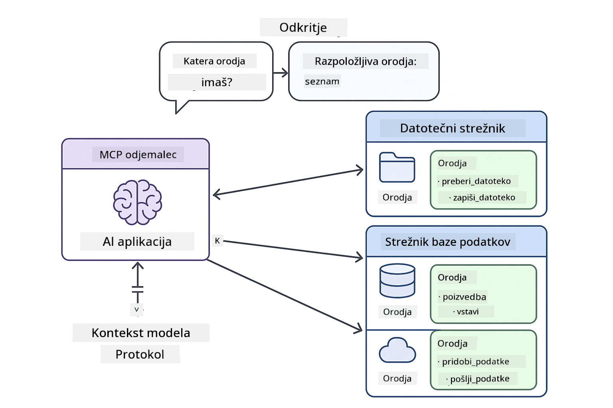
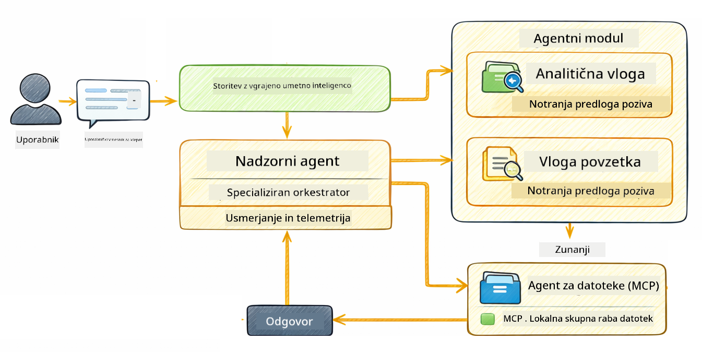

<!--
CO_OP_TRANSLATOR_METADATA:
{
  "original_hash": "6c816d130a1fa47570c11907e72d84ae",
  "translation_date": "2026-01-06T01:31:00+00:00",
  "source_file": "05-mcp/README.md",
  "language_code": "sl"
}
-->
# Modul 05: Protokol konteksta modela (MCP)

## Kazalo

- [Kaj se boste naučili](../../../05-mcp)
- [Kaj je MCP?](../../../05-mcp)
- [Kako MCP deluje](../../../05-mcp)
- [Agentni modul](../../../05-mcp)
- [Zagon primerov](../../../05-mcp)
  - [Predpogoji](../../../05-mcp)
- [Hiter začetek](../../../05-mcp)
  - [Operacije z datotekami (Stdio)](../../../05-mcp)
  - [Nadzorni agent](../../../05-mcp)
    - [Razumevanje izhoda](../../../05-mcp)
    - [Strategije odziva](../../../05-mcp)
    - [Razlaga funkcij agentnega modula](../../../05-mcp)
- [Ključni koncepti](../../../05-mcp)
- [Čestitke!](../../../05-mcp)
  - [Kaj sledi?](../../../05-mcp)

## Kaj se boste naučili

Zgradili ste pogovorno umetno inteligenco, obvladali pozive, utemeljili odgovore na dokumentih in ustvarili agente z orodji. Toda vsa ta orodja so bila prilagojena vašemu specifičnemu primeru. Kaj pa, če bi lahko svoji umetni inteligenci dali dostop do standardiziranega ekosistema orodij, ki jih lahko kdorkoli ustvari in deli? V tem modulu se boste naučili ravno to z Model Context Protocol (MCP) in agentnim modulom LangChain4j. Najprej prikažemo preprost MCP bralnik datotek, nato pa pokažemo, kako se enostavno vključi v napredne agentne delovne tokove z vzorcem Nadzornega agenta.

## Kaj je MCP?

Model Context Protocol (MCP) zagotavlja prav to – standardni način, da AI aplikacije odkrijejo in uporabljajo zunanja orodja. Namesto pisanja lastnih integracij za vsak vir podatkov ali storitev, se povežete s strežniki MCP, ki svoje zmožnosti razkrivajo v doslednem formatu. Vaš AI agent lahko nato ta orodja samodejno odkrije in uporabi.


*Pred MCP: Kompleksne integracije od točke do točke. Po MCP: en protokol, neskončne možnosti.*

MCP rešuje temeljni problem v razvoju AI: vsaka integracija je unikatna. Želite dostop do GitHuba? Lastna koda. Želite brati datoteke? Lastna koda. Želite poizvedovati podatkovno bazo? Lastna koda. In nobena od teh integracij ne deluje z drugimi AI aplikacijami.

MCP to standardizira. MCP strežnik razkriva orodja s jasnimi opisi in shemami. Vsak MCP odjemalec se lahko poveže, odkrije razpoložljiva orodja in jih uporabi. Zgradi enkrat, uporabljaj povsod.



*Arhitektura protokola konteksta modela – standardizirano odkrivanje in izvajanje orodij*

## Kako MCP deluje

**Arhitektura strežnik-odjemalec**

MCP uporablja model strežnik-odjemalec. Strežniki zagotavljajo orodja – branje datotek, poizvedovanje baz, klicanje API-jev. Odjemalci (vaša AI aplikacija) se povežejo s strežniki in uporabljajo njihova orodja.

Za uporabo MCP z LangChain4j dodajte to Maven odvisnost:

```xml
<dependency>
    <groupId>dev.langchain4j</groupId>
    <artifactId>langchain4j-mcp</artifactId>
    <version>${langchain4j.version}</version>
</dependency>
```

**Odkritje orodij**

Ko se vaš odjemalec poveže s MCP strežnikom, vpraša "Katera orodja imate?" Strežnik odgovori z seznamom razpoložljivih orodij, vsako z opisi in parametrlimi shemami. Vaš AI agent lahko nato na podlagi uporabniških zahtev odloči, katera orodja uporabiti.

**Transportni mehanizmi**

MCP podpira različne transportne mehanizme. Ta modul prikazuje Stdio transport za lokalne procese:


*Transportni mehanizmi MCP: HTTP za oddaljene strežnike, Stdio za lokalne procese*

**Stdio** - [StdioTransportDemo.java](../../../05-mcp/src/main/java/com/example/langchain4j/mcp/StdioTransportDemo.java)

Za lokalne procese. Vaša aplikacija zažene strežnik kot podproces in komunicira prek standardnega vnosa/izhoda. Uporabno za dostop do datotečnega sistema ali ukaznih orodij.

```java
McpTransport stdioTransport = new StdioMcpTransport.Builder()
    .command(List.of(
        npmCmd, "exec",
        "@modelcontextprotocol/server-filesystem@2025.12.18",
        resourcesDir
    ))
    .logEvents(false)
    .build();
```

> **🤖 Poskusi z [GitHub Copilot](https://github.com/features/copilot) pogovorom:** Odpri [`StdioTransportDemo.java`](../../../05-mcp/src/main/java/com/example/langchain4j/mcp/StdioTransportDemo.java) in vprašaj:
> - "Kako deluje Stdio transport in kdaj naj ga uporabljam namesto HTTP?"
> - "Kako LangChain4j upravlja življenjski cikel zagnanih MCP strežniških procesov?"
> - "Kakšne varnostne posledice ima, če dam AI dostop do datotečnega sistema?"

## Agentni modul

Medtem ko MCP zagotavlja standardizirana orodja, LangChain4jjev **agentni modul** ponuja deklarativni način za ustvarjanje agentov, ki orkestrirajo ta orodja. Anotacija `@Agent` in `AgenticServices` omogočata definiranje vedenja agenta preko vmesnikov namesto preko imperativne kode.

V tem modulu boste raziskali vzorec **Nadzorni agent** — napredni agentni pristop AI, kjer "nadzorni" agent dinamično odloča, katere pod-agente priklicati glede na uporabniške zahteve. Kombinirali bomo oba koncepta tako, da bomo enemu izmed naših pod-agentov dali MCP-podprte zmogljivosti dostopa do datotek.

Za uporabo agentnega modula dodajte to Maven odvisnost:

```xml
<dependency>
    <groupId>dev.langchain4j</groupId>
    <artifactId>langchain4j-agentic</artifactId>
    <version>${langchain4j.mcp.version}</version>
</dependency>
```

> **⚠️ Eksperimentalno:** `langchain4j-agentic` modul je **eksperimentalni** in se lahko spremeni. Stabilen način za izdelavo AI asistentov ostaja `langchain4j-core` z lastnimi orodji (Modul 04).

## Zagon primerov

### Predpogoji

- Java 21+, Maven 3.9+
- Node.js 16+ in npm (za MCP strežnike)
- Konfigurirane okoljske spremenljivke v `.env` datoteki (iz korenske mape):
  - `AZURE_OPENAI_ENDPOINT`, `AZURE_OPENAI_API_KEY`, `AZURE_OPENAI_DEPLOYMENT` (enako kot v modulih 01-04)

> **Opomba:** Če okoljske spremenljivke še niste nastavili, glejte [Modul 00 - Hiter začetek](../00-quick-start/README.md) za navodila, ali kopirajte `.env.example` v `.env` v korenski mapi in vnesite svoje vrednosti.

## Hiter začetek

**Uporaba VS Code:** Preprosto kliknite z desnim miškinim gumbom na katerekoli demo datoteke v Raziskovalcu in izberite **"Run Java"**, ali uporabite konfiguracije za zagon iz panela Run and Debug (poskrbite, da ste najprej dodali svoj žeton v `.env` datoteko).

**Uporaba Mavena:** Lahko pa zaženete tudi iz ukazne vrstice z naslednjimi primeri.

### Operacije z datotekami (Stdio)

To prikazuje orodja na osnovi lokalnih podprocesov.

**✅ Predpogoji niso potrebni** - MCP strežnik se zažene samodejno.

**Uporaba začetnih skript (priporočeno):**

Začetne skripte samodejno naložijo okoljske spremenljivke iz korenske `.env` datoteke:

**Bash:**
```bash
cd 05-mcp
chmod +x start-stdio.sh
./start-stdio.sh
```

**PowerShell:**
```powershell
cd 05-mcp
.\start-stdio.ps1
```

**Uporaba VS Code:** Kliknite z desnim na `StdioTransportDemo.java` in izberite **"Run Java"** (poskrbite, da je vaša `.env` datoteka pravilno nastavljena).

Aplikacija samodejno zažene MCP strežnik za datotečni sistem in prebere lokalno datoteko. Opazite, kako je upravljanje podprocesa obdelano za vas.

**Pričakovani izhod:**
```
Assistant response: The file provides an overview of LangChain4j, an open-source Java library
for integrating Large Language Models (LLMs) into Java applications...
```

### Nadzorni agent

**Vzorec Nadzorni agent** je **prilagodljiva** oblika agentne AI. Nadzornik uporablja LLM, da avtonomno odloči, katere agente priklicati glede na uporabniško zahtevo. V naslednjem primeru kombiniramo MCP-podprt dostop do datotek z LLM agentom za ustvarjanje nadzorovanega delovnega toka: branje datoteke → poročilo.

V demu `FileAgent` prebere datoteko z uporabo MCP orodij datotečnega sistema, `ReportAgent` pa generira strukturirano poročilo z izvršnim povzetkom (1 stavek), 3 ključnimi točkami in priporočili. Nadzornik samodejno orkestrira ta tok:



```
┌─────────────┐      ┌──────────────┐
│  FileAgent  │ ───▶ │ ReportAgent  │
│ (MCP tools) │      │  (pure LLM)  │
└─────────────┘      └──────────────┘
   outputKey:           outputKey:
  'fileContent'         'report'
```

Vsak agent shrani svoj izhod v **Agentni obseg** (deljeni pomnilnik), kar omogoča agentom v nadaljnjih korakih dostop do prejšnjih rezultatov. To prikazuje, kako se MCP orodja brezšivno vključijo v agentne delovne tokove – Nadzornik mora vedeti le, da `FileAgent` lahko prebere datoteke, ne pa, kako.

#### Zagon demoa

Začetne skripte samodejno naložijo okoljske spremenljivke iz korenske `.env` datoteke:

**Bash:**
```bash
cd 05-mcp
chmod +x start-supervisor.sh
./start-supervisor.sh
```

**PowerShell:**
```powershell
cd 05-mcp
.\start-supervisor.ps1
```

**Uporaba VS Code:** Kliknite z desnim na `SupervisorAgentDemo.java` in izberite **"Run Java"** (poskrbite, da je vaša `.env` datoteka pravilno nastavljena).

#### Kako deluje Nadzornik

```java
// Korak 1: FileAgent bere datoteke z uporabo orodij MCP
FileAgent fileAgent = AgenticServices.agentBuilder(FileAgent.class)
        .chatModel(model)
        .toolProvider(mcpToolProvider)  // Ima orodja MCP za operacije z datotekami
        .build();

// Korak 2: ReportAgent generira strukturirana poročila
ReportAgent reportAgent = AgenticServices.agentBuilder(ReportAgent.class)
        .chatModel(model)
        .build();

// Nadzornik usklajuje potek dela datoteka → poročilo
SupervisorAgent supervisor = AgenticServices.supervisorBuilder()
        .chatModel(model)
        .subAgents(fileAgent, reportAgent)
        .responseStrategy(SupervisorResponseStrategy.LAST)  // Vrni končno poročilo
        .build();

// Nadzornik odloča, katere agente poklicati na podlagi zahteve
String response = supervisor.invoke("Read the file at /path/file.txt and generate a report");
```

#### Strategije odziva

Ko konfigurirate `SupervisorAgent`, določite, kako naj oblikuje svoj končni odgovor uporabniku po zaključku pod-agentskih nalog. Na voljo so naslednje strategije:

| Strategija | Opis |
|------------|-------|
| **LAST** | Nadzornik vrne izhod zadnjega pod-agenta ali orodja, ki je bil uporabljen. Primerna je, ko je zadnji agent v delovnem toku posebej zasnovan za pripravo celotnega končnega odgovora (npr. "Agent za povzetke" v raziskovalni verigi). |
| **SUMMARY** | Nadzornik uporabi svoj notranji jezikovni model (LLM), da sintetizira povzetek celotne interakcije in vseh pod-agentskih izhodov, nato ta povzetek vrne kot končni odgovor. To zagotavlja jasen, zbran odgovor uporabniku. |
| **SCORED** | Sistem uporabi notranji LLM, ki oceni tako zadnji odgovor kot povzetek interakcije glede na prvotno uporabniško zahtevo in vrne tistega, ki dobi višjo oceno. |

Podrobnosti o implementaciji so v [SupervisorAgentDemo.java](../../../05-mcp/src/main/java/com/example/langchain4j/mcp/SupervisorAgentDemo.java).

> **🤖 Poskusi z [GitHub Copilot](https://github.com/features/copilot) pogovorom:** Odpri [`SupervisorAgentDemo.java`](../../../05-mcp/src/main/java/com/example/langchain4j/mcp/SupervisorAgentDemo.java) in vprašaj:
> - "Kako Nadzornik odloči, katere agente priklicati?"
> - "Kakšna je razlika med vzorcem Nadzornik in sekvenčni delovni tok?"
> - "Kako lahko prilagodim načrtovalno vedenje Nadzornika?"

#### Razumevanje izhoda

Ko zaženete demo, boste videli strukturiran prikaz, kako Nadzornik orkestrira več agentov. Tukaj je pomen vsakega odseka:

```
======================================================================
  FILE → REPORT WORKFLOW DEMO
======================================================================

This demo shows a clear 2-step workflow: read a file, then generate a report.
The Supervisor orchestrates the agents automatically based on the request.
```

**Glava** predstavlja koncept delovnega toka: osredotočena cevovodna veriga od branja datoteke do izdelave poročila.

```
--- WORKFLOW ---------------------------------------------------------
  ┌─────────────┐      ┌──────────────┐
  │  FileAgent  │ ───▶ │ ReportAgent  │
  │ (MCP tools) │      │  (pure LLM)  │
  └─────────────┘      └──────────────┘
   outputKey:           outputKey:
   'fileContent'        'report'

--- AVAILABLE AGENTS -------------------------------------------------
  [FILE]   FileAgent   - Reads files via MCP → stores in 'fileContent'
  [REPORT] ReportAgent - Generates structured report → stores in 'report'
```

**Diagram delovnega toka** prikazuje pretok podatkov med agenti. Vsak agent ima določeno vlogo:
- **FileAgent** bere datoteke z MCP orodji in shranjuje surovo vsebino v `fileContent`
- **ReportAgent** porabi to vsebino in ustvari strukturirano poročilo v `report`

```
--- USER REQUEST -----------------------------------------------------
  "Read the file at .../file.txt and generate a report on its contents"
```

**Uporabniška zahteva** prikazuje nalogo. Nadzornik jo razčleni in se odloči priklicati FileAgent → ReportAgent.

```
--- SUPERVISOR ORCHESTRATION -----------------------------------------
  The Supervisor decides which agents to invoke and passes data between them...

  +-- STEP 1: Supervisor chose -> FileAgent (reading file via MCP)
  |
  |   Input: .../file.txt
  |
  |   Result: LangChain4j is an open-source, provider-agnostic Java framework for building LLM...
  +-- [OK] FileAgent (reading file via MCP) completed

  +-- STEP 2: Supervisor chose -> ReportAgent (generating structured report)
  |
  |   Input: LangChain4j is an open-source, provider-agnostic Java framew...
  |
  |   Result: Executive Summary...
  +-- [OK] ReportAgent (generating structured report) completed
```

**Orkestracija Nadzornika** prikazuje potek v 2 korakih:
1. **FileAgent** preko MCP prebere datoteko in shrani vsebino
2. **ReportAgent** prejme vsebino in generira strukturirano poročilo

Nadzornik je te odločitve sprejel **avtonomno**, na podlagi uporabnikove zahteve.

```
--- FINAL RESPONSE ---------------------------------------------------
Executive Summary
...

Key Points
...

Recommendations
...

--- AGENTIC SCOPE (Data Flow) ----------------------------------------
  Each agent stores its output for downstream agents to consume:
  * fileContent: LangChain4j is an open-source, provider-agnostic Java framework...
  * report: Executive Summary...
```

#### Razlaga funkcij agentnega modula

Primer prikazuje več naprednih funkcij agentnega modula. Poglejmo si bližje Agentni obseg in poslušalce agentov.

**Agentni obseg** prikazuje deljeni pomnilnik, kjer so agenti shranjevali svoje rezultate z uporabo `@Agent(outputKey="...")`. To omogoča:
- Kasnejšim agentom dostop do izhodov prejšnjih agentov
- Nadzorniku sintetiziranje končnega odgovora
- Vam pregled, kaj je vsak agent ustvaril

```java
ResultWithAgenticScope<String> result = supervisor.invokeWithAgenticScope(request);
AgenticScope scope = result.agenticScope();
String fileContent = scope.readState("fileContent");  // Surovi podatki datoteke iz FileAgent
String report = scope.readState("report");            // Strukturirano poročilo iz ReportAgent
```

**Poslušalci agentov** omogočajo spremljanje in odpravljanje težav pri izvajanju agentov. Korak za korakom izhod, ki ga vidite v demu, prihaja od AgentListenerja, ki se priključi na vsak agentni klic:
- **beforeAgentInvocation** – pokliče se, ko Nadzornik izbere agenta, da vidite, kateri agent je bil izbran in zakaj
- **afterAgentInvocation** – pokliče se, ko agent konča, prikazuje njegov rezultat
- **inheritedBySubagents** – če je res, spremlja vse agente v hierarhiji

```java
AgentListener monitor = new AgentListener() {
    private int step = 0;
    
    @Override
    public void beforeAgentInvocation(AgentRequest request) {
        step++;
        System.out.println("  +-- STEP " + step + ": " + request.agentName());
    }
    
    @Override
    public void afterAgentInvocation(AgentResponse response) {
        System.out.println("  +-- [OK] " + response.agentName() + " completed");
    }
    
    @Override
    public boolean inheritedBySubagents() {
        return true; // Razširi na vse podagente
    }
};
```

Poleg vzorca Nadzornik modul `langchain4j-agentic` ponuja več zmogljivih vzorcev delovnih tokov in funkcij:

| Vzorec | Opis | Uporaba |
|---------|-------|----------|
| **Sekvenčni** | Izvedi agente v vrstnem redu, izhod teče v naslednjega | Cevovodi: raziskovanje → analiza → poročilo |
| **Paralelni** | Zagon agentov sočasno | Neodvisne naloge: vreme + novice + delnice |
| **Zanka** | Ponovi dokler ni izpolnjen pogoj | Ocena kakovosti: izboljšuj dokler ocena ≥ 0.8 |
| **Pogojni** | Usmerjanje glede na pogoje | Klasifikacija → usmeri do strokovnega agenta |
| **Človek v zanki** | Dodaj človeške kontrolne točke | Potrditveni delovni tokovi, pregled vsebin |

## Ključni koncepti

Zdaj, ko ste raziskali MCP in agentni modul v praksi, povzemimo, kdaj uporabiti kateri pristop.

**MCP** je idealen, ko želite izkoristiti obstoječe ekosisteme orodij, zgraditi orodja, ki jih lahko deli več aplikacij, integrirati storitve tretjih oseb s standardnimi protokoli ali zamenjati implementacije orodij brez menjave kode.

**Agentni modul** deluje najbolje, ko želite deklarativne definicije agentov z anotacijami `@Agent`, potrebujete orkestracijo delovnih tokov (sekvenčno, zanka, paralelno), imate raje zasnovo agentov na osnovi vmesnikov namesto imperativne kode ali kombinirate več agentov, ki delijo izhode preko `outputKey`.

**Vzorec Nadzorni agent** izstopa, ko delovni tok ni vnaprej predvidljiv in želite, da LLM odloča, ko imate več specializiranih agentov, ki potrebujejo dinamično orkestracijo, pri gradnji pogovornih sistemov z usmerjanjem k različnim zmožnostim ali ko želite najbolj prilagodljivo, prilagodljivo vedenje agenta.
## Čestitke!

Končali ste tečaj LangChain4j za začetnike. Naučili ste se:

- Kako zgraditi pogovorno umetno inteligenco z memorijo (Modul 01)
- Vzorce inženiringa pozivov za različne naloge (Modul 02)
- Utemeljitev odgovorov v vaših dokumentih z RAG (Modul 03)
- Ustvarjanje osnovnih AI agentov (asistentov) z lastnimi orodji (Modul 04)
- Integracija standardiziranih orodij z LangChain4j MCP in Agentic moduli (Modul 05)

### Kaj sledi?

Po zaključku modulov raziščite [Testni vodič](../docs/TESTING.md), da si ogledate koncepte testiranja LangChain4j v praksi.

**Uradni viri:**
- [LangChain4j Dokumentacija](https://docs.langchain4j.dev/) - Celoviti vodiči in API referenca
- [LangChain4j GitHub](https://github.com/langchain4j/langchain4j) - Izvorna koda in primeri
- [LangChain4j Vadnice](https://docs.langchain4j.dev/tutorials/) - Korak za korakom vadnice za različne primere uporabe

Hvala, ker ste zaključili ta tečaj!

---

**Navigacija:** [← Prejšnji: Modul 04 - Orodja](../04-tools/README.md) | [Nazaj na glavno](../README.md)

---

<!-- CO-OP TRANSLATOR DISCLAIMER START -->
**Omejitev odgovornosti**:
Ta dokument je bil preveden z uporabo AI prevajalske storitve [Co-op Translator](https://github.com/Azure/co-op-translator). Čeprav si prizadevamo za natančnost, vas opozarjamo, da lahko avtomatizirani prevodi vsebujejo napake ali netočnosti. Originalni dokument v izvorni jezik velja za avtoritativni vir. Za ključne informacije priporočamo strokovni človeški prevod. Nismo odgovorni za morebitna nesporazumevanja ali napačne interpretacije, ki izhajajo iz uporabe tega prevoda.
<!-- CO-OP TRANSLATOR DISCLAIMER END -->