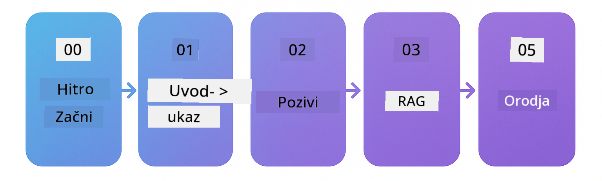

<!--
CO_OP_TRANSLATOR_METADATA:
{
  "original_hash": "69c7e2616c66df6cc296492fbfcad9ec",
  "translation_date": "2025-12-13T12:49:29+00:00",
  "source_file": "README.md",
  "language_code": "sl"
}
-->

# LangChain4j za začetnike

Tečaj za izdelavo AI aplikacij z LangChain4j in Azure OpenAI GPT-5, od osnovnega klepeta do AI agentov.

**Nov v LangChain4j?** Oglejte si [Slovarček](docs/GLOSSARY.md) za definicije ključnih izrazov in pojmov.

## Kazalo

1. [Hiter začetek](00-quick-start/README.md) - Začnite z LangChain4j
2. [Uvod](01-introduction/README.md) - Spoznajte osnove LangChain4j
3. [Oblikovanje pozivov](02-prompt-engineering/README.md) - Obvladajte učinkovito oblikovanje pozivov
4. [RAG (Generiranje z iskanjem)](03-rag/README.md) - Zgradite inteligentne sisteme na osnovi znanja
5. [Orodja](04-tools/README.md) - Integrirajte zunanja orodja in API-je z AI agenti
6. [MCP (Protokol konteksta modela)](05-mcp/README.md) - Delo s protokolom konteksta modela
---

## Učna pot

Začnite z modulom [Hiter začetek](00-quick-start/README.md) in napredujte skozi vsak modul, da boste korak za korakom gradili svoje veščine. Poskusili boste osnovne primere, da boste razumeli osnove, preden se poglobite v modul [Uvod](01-introduction/README.md) z GPT-5.

Po zaključku modulov raziščite [Vodnik za testiranje](docs/TESTING.md), da vidite koncepte testiranja LangChain4j v praksi.

> **Opomba:** Ta usposabljanje uporablja tako GitHub modele kot Azure OpenAI. Moduli [Hiter začetek](00-quick-start/README.md) in [MCP](05-mcp/README.md) uporabljajo GitHub modele (ni potrebna naročnina na Azure), medtem ko moduli 1-4 uporabljajo Azure OpenAI GPT-5.

## Učenje z GitHub Copilot

Za hiter začetek kodiranja odprite ta projekt v GitHub Codespace ali v svojem lokalnem IDE z zagotovljenim devcontainerjem. Devcontainer, uporabljen v tem tečaju, je vnaprej konfiguriran z GitHub Copilot za AI programiranje v paru.

Vsak primer kode vključuje predlagana vprašanja, ki jih lahko zastavite GitHub Copilotu za poglobitev razumevanja. Poiščite 💡/🤖 pozive v:

- **Glavah Java datotek** - vprašanja specifična za vsak primer
- **README modulov** - raziskovalni pozivi po primerih kode

**Kako uporabljati:** Odprite katerokoli datoteko s kodo in zastavite Copilotu predlagana vprašanja. Ima popoln kontekst kode in lahko razloži, razširi in predlaga alternative.

Želite izvedeti več? Oglejte si [Copilot za AI programiranje v paru](https://aka.ms/GitHubCopilotAI).

## Dodatni viri 

### LangChain

---

### Azure / Edge / MCP / Agenti

---
 
### Serija Generativne AI

[-9333EA?style=for-the-badge&labelColor=E5E7EB&color=9333EA)](https://github.com/microsoft/Generative-AI-for-beginners-dotnet?WT.mc_id=academic-105485-koreyst)
[-C084FC?style=for-the-badge&labelColor=E5E7EB&color=C084FC)](https://github.com/microsoft/generative-ai-for-beginners-java?WT.mc_id=academic-105485-koreyst)
[-E879F9?style=for-the-badge&labelColor=E5E7EB&color=E879F9)](https://github.com/microsoft/generative-ai-with-javascript?WT.mc_id=academic-105485-koreyst)

---
 
### Osnovno učenje

---
 
### Serija Copilot

## Pomoč

Če se zataknete ali imate vprašanja o izdelavi AI aplikacij, se pridružite:

Če imate povratne informacije o izdelku ali napake med izdelavo, obiščite:

## Licenca

MIT licenca - podrobnosti so v datoteki [LICENSE](../../LICENSE).

---

<!-- CO-OP TRANSLATOR DISCLAIMER START -->
**Omejitev odgovornosti**:
Ta dokument je bil preveden z uporabo storitve za prevajanje z umetno inteligenco [Co-op Translator](https://github.com/Azure/co-op-translator). Čeprav si prizadevamo za natančnost, vas opozarjamo, da avtomatizirani prevodi lahko vsebujejo napake ali netočnosti. Izvirni dokument v njegovem izvirnem jeziku velja za avtoritativni vir. Za ključne informacije priporočamo strokovni človeški prevod. Za morebitna nesporazume ali napačne interpretacije, ki izhajajo iz uporabe tega prevoda, ne odgovarjamo.
<!-- CO-OP TRANSLATOR DISCLAIMER END -->