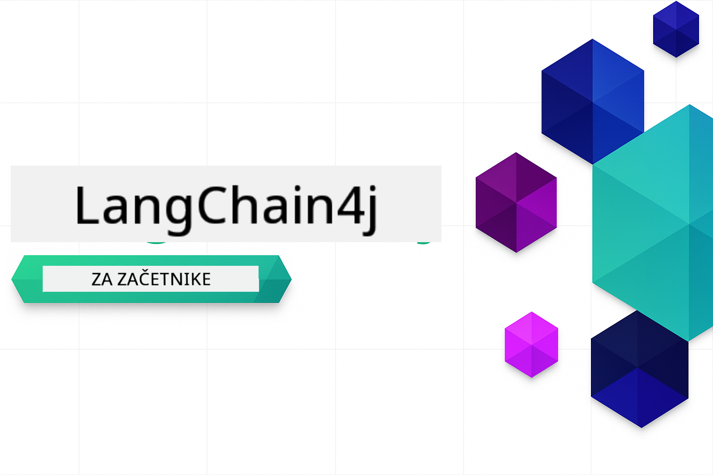

<!--
CO_OP_TRANSLATOR_METADATA:
{
  "original_hash": "d61ab6c245562094cc3dddecf08b50d3",
  "translation_date": "2025-12-31T05:47:34+00:00",
  "source_file": "README.md",
  "language_code": "sl"
}
-->


### 🌐 Podpora za več jezikov

#### Podprto prek GitHub Action (samodejno in vedno posodobljeno)

<!-- CO-OP TRANSLATOR LANGUAGES TABLE START -->
[Arabščina](../ar/README.md) | [Bengalščina](../bn/README.md) | [Bolgarščina](../bg/README.md) | [Burmanski (Myanmar)](../my/README.md) | [Kitajščina (poenostavljena)](../zh/README.md) | [Kitajščina (tradicionalna, Hong Kong)](../hk/README.md) | [Kitajščina (tradicionalna, Macau)](../mo/README.md) | [Kitajščina (tradicionalna, Taiwan)](../tw/README.md) | [Hrvaščina](../hr/README.md) | [Češčina](../cs/README.md) | [Danščina](../da/README.md) | [Nizozemščina](../nl/README.md) | [Estonščina](../et/README.md) | [Finščina](../fi/README.md) | [Francoščina](../fr/README.md) | [Nemščina](../de/README.md) | [Grščina](../el/README.md) | [Hebrejščina](../he/README.md) | [Hindijščina](../hi/README.md) | [Madžarščina](../hu/README.md) | [Indonezijščina](../id/README.md) | [Italijanščina](../it/README.md) | [Japonščina](../ja/README.md) | [Kannada](../kn/README.md) | [Korejščina](../ko/README.md) | [Litovščina](../lt/README.md) | [Malajščina](../ms/README.md) | [Malayalam](../ml/README.md) | [Maratščina](../mr/README.md) | [Nepalščina](../ne/README.md) | [Nigerijski pidžin](../pcm/README.md) | [Norveščina](../no/README.md) | [Perzijski (Farsi)](../fa/README.md) | [Poljščina](../pl/README.md) | [Portugalščina (Brazilija)](../br/README.md) | [Portugalščina (Portugalska)](../pt/README.md) | [Pandžabi (Gurmukhi)](../pa/README.md) | [Romunščina](../ro/README.md) | [Ruščina](../ru/README.md) | [Srbščina (cirilica)](../sr/README.md) | [Slovaščina](../sk/README.md) | [Slovenščina](./README.md) | [Španščina](../es/README.md) | [Svahili](../sw/README.md) | [Švedščina](../sv/README.md) | [Tagalog (filipinščina)](../tl/README.md) | [Tamilščina](../ta/README.md) | [Telugu](../te/README.md) | [Tajščina](../th/README.md) | [Turščina](../tr/README.md) | [Ukrajinščina](../uk/README.md) | [Urdu](../ur/README.md) | [Vietnamščina](../vi/README.md)
<!-- CO-OP TRANSLATOR LANGUAGES TABLE END -->

# LangChain4j za začetnike

Tečaj za izdelavo AI aplikacij z LangChain4j in Azure OpenAI GPT-5, od osnovnega klepeta do AI agentov.

**Novo v LangChain4j?** Oglejte si [Slovar izrazov](docs/GLOSSARY.md) za definicije ključnih pojmov in konceptov.

## Table of Contents

1. [Hitri začetek](00-quick-start/README.md) - Začnite z LangChain4j
2. [Uvod](01-introduction/README.md) - Spoznajte osnove LangChain4j
3. [Oblikovanje pozivov](02-prompt-engineering/README.md) - Obvladujte učinkovito oblikovanje pozivov
4. [RAG (Retrieval-Augmented Generation)](03-rag/README.md) - Zgradite inteligentne sisteme, podprte z znanjem
5. [Orodja](04-tools/README.md) - Integrirajte zunanja orodja in preproste asistente
6. [MCP (Model Context Protocol)](05-mcp/README.md) - Delajte z Model Context Protocol (MCP) in agentskimi moduli
---

##  Pot učenja

> **Hitri začetek**

1. Naredite fork tega repozitorija v svoj GitHub račun
2. Kliknite **Code** → zavihek **Codespaces** → **...** → **New with options...**
3. Uporabite privzete nastavitve – to bo izbralo razvojni kontejner, ustvarjen za ta tečaj
4. Kliknite **Create codespace**
5. Počakajte 5-10 minut za pripravo okolja
6. Pojdite neposredno na [Hitri začetek](./00-quick-start/README.md) in začnite!

> **Raje klonirate lokalno?**
>
> Ta repozitorij vključuje več kot 50 prevodov jezikov, kar znatno poveča velikost prenosa. Če želite klonirati brez prevodov, uporabite sparse checkout:
> ```bash
> git clone --filter=blob:none --sparse https://github.com/microsoft/LangChain4j-for-Beginners.git
> cd LangChain4j-for-Beginners
> git sparse-checkout set --no-cone '/*' '!translations' '!translated_images'
> ```
> To vam daje vse, kar potrebujete za dokončanje tečaja z veliko hitrejšim prenosom.

Po zaključku modulov si oglejte [Vodnik za testiranje](docs/TESTING.md), da si ogledate koncepte testiranja LangChain4j v praksi.

> **Opomba:** To usposabljanje uporablja tako GitHub modele kot Azure OpenAI. Moduli [Hitri začetek](00-quick-start/README.md) in [MCP](05-mcp/README.md) uporabljajo GitHub modele (ni potrebna naročnina na Azure), medtem ko moduli 1-4 uporabljajo Azure OpenAI GPT-5.


## Učenje z GitHub Copilot

Za hitro začetek kodiranja odprite ta projekt v GitHub Codespace ali svojem lokalnem IDE z zagotovljenim devcontainerjem. Devcontainer, uporabljen v tem tečaju, je predkonfiguriran z GitHub Copilot za AI parno programiranje.

Vsak primer kode vključuje predlagana vprašanja, ki jih lahko zastavite GitHub Copilot za poglobitev razumevanja. Poiščite oznake 💡/🤖 v:

- **Glave Java datotek** - Vprašanja, specifična za vsak primer
- **README modulov** - Raziskovalni pozivi po primerih kode

**Kako uporabljati:** Odprite katerokoli datoteko s kodo in postavite Copilotu predlagana vprašanja. Ima popoln kontekst kode in lahko pojasni, razširi in predlaga alternative.

Želite izvedeti več? Oglejte si [Copilot za AI parno programiranje](https://aka.ms/GitHubCopilotAI).


## Dodatni viri

<!-- CO-OP TRANSLATOR OTHER COURSES START -->
### LangChain
[](https://aka.ms/langchain4j-for-beginners)
[](https://aka.ms/langchainjs-for-beginners?WT.mc_id=m365-94501-dwahlin)

---

### Azure / Edge / MCP / Agenti
[](https://github.com/microsoft/AZD-for-beginners?WT.mc_id=academic-105485-koreyst)
[](https://github.com/microsoft/edgeai-for-beginners?WT.mc_id=academic-105485-koreyst)
[](https://github.com/microsoft/mcp-for-beginners?WT.mc_id=academic-105485-koreyst)
[](https://github.com/microsoft/ai-agents-for-beginners?WT.mc_id=academic-105485-koreyst)

---
 
### Serija generativne AI
[](https://github.com/microsoft/generative-ai-for-beginners?WT.mc_id=academic-105485-koreyst)
[-9333EA?style=for-the-badge&labelColor=E5E7EB&color=9333EA)](https://github.com/microsoft/Generative-AI-for-beginners-dotnet?WT.mc_id=academic-105485-koreyst)
[-C084FC?style=for-the-badge&labelColor=E5E7EB&color=C084FC)](https://github.com/microsoft/generative-ai-for-beginners-java?WT.mc_id=academic-105485-koreyst)
[-E879F9?style=for-the-badge&labelColor=E5E7EB&color=E879F9)](https://github.com/microsoft/generative-ai-with-javascript?WT.mc_id=academic-105485-koreyst)

---
 
### Temeljno učenje
[](https://aka.ms/ml-beginners?WT.mc_id=academic-105485-koreyst)
[](https://aka.ms/datascience-beginners?WT.mc_id=academic-105485-koreyst)
[](https://aka.ms/ai-beginners?WT.mc_id=academic-105485-koreyst)
[](https://github.com/microsoft/Security-101?WT.mc_id=academic-96948-sayoung)
[](https://aka.ms/webdev-beginners?WT.mc_id=academic-105485-koreyst)
[](https://aka.ms/iot-beginners?WT.mc_id=academic-105485-koreyst)
[](https://github.com/microsoft/xr-development-for-beginners?WT.mc_id=academic-105485-koreyst)

---
 
### Serija Copilot
[](https://aka.ms/GitHubCopilotAI?WT.mc_id=academic-105485-koreyst)
[](https://github.com/microsoft/mastering-github-copilot-for-dotnet-csharp-developers?WT.mc_id=academic-105485-koreyst)
[](https://github.com/microsoft/CopilotAdventures?WT.mc_id=academic-105485-koreyst)
<!-- CO-OP TRANSLATOR OTHER COURSES END -->

## Pomoč

Če se zataknete ali imate kakršna koli vprašanja o ustvarjanju AI aplikacij, se pridružite:

[](https://aka.ms/foundry/discord)

Če imate povratne informacije o izdelku ali napake med razvojem, obiščite:

[](https://aka.ms/foundry/forum)

## Licenca

Licenca MIT - Oglejte si datoteko [LICENSE](../../LICENSE) za podrobnosti.

---

<!-- CO-OP TRANSLATOR DISCLAIMER START -->
Izjava o omejitvi odgovornosti:
Ta dokument je bil preveden z uporabo AI-prevajalske storitve Co-op Translator (https://github.com/Azure/co-op-translator). Čeprav si prizadevamo za natančnost, vas opozarjamo, da lahko avtomatizirani prevodi vsebujejo napake ali netočnosti. Izvirni dokument v njegovem izvor­nem jeziku velja za avtoritativni vir. Za pomembne informacije priporočamo strokovni prevod, opravljen s strani človeškega prevajalca. Za morebitne nesporazume ali napačne razlage, ki izhajajo iz uporabe tega prevoda, ne prevzemamo odgovornosti.
<!-- CO-OP TRANSLATOR DISCLAIMER END -->