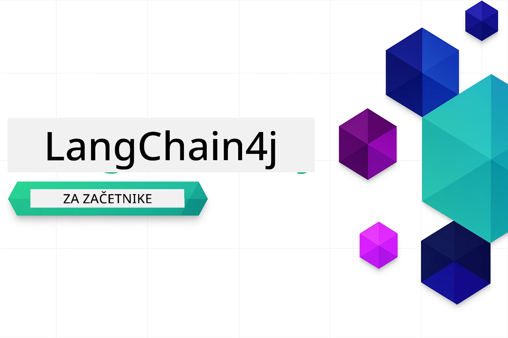

# LangChain4j za začetnike

Tečaj za izgradnjo AI aplikacij z LangChain4j in Azure OpenAI GPT-5.2, od osnovnega klepeta do AI agentov.

### 🌐 Podpora za več jezikov

#### Podprto preko GitHub Actions (avtomatizirano in vedno posodobljeno)

<!-- CO-OP TRANSLATOR LANGUAGES TABLE START -->
[Arabščina](../ar/README.md) | [Bengalščina](../bn/README.md) | [Bolgarščina](../bg/README.md) | [Burmščina (Mjanmar)](../my/README.md) | [Kitajščina (poenostavljena)](../zh-CN/README.md) | [Kitajščina (klasična, Hong Kong)](../zh-HK/README.md) | [Kitajščina (klasična, Macao)](../zh-MO/README.md) | [Kitajščina (klasična, Tajvan)](../zh-TW/README.md) | [Hrvaščina](../hr/README.md) | [Češčina](../cs/README.md) | [Danščina](../da/README.md) | [Nizozemščina](../nl/README.md) | [Estonščina](../et/README.md) | [Finščina](../fi/README.md) | [Francoščina](../fr/README.md) | [Nemščina](../de/README.md) | [Grščina](../el/README.md) | [Hebrejščina](../he/README.md) | [Hindijščina](../hi/README.md) | [Madžarščina](../hu/README.md) | [Indonezijščina](../id/README.md) | [Italijanščina](../it/README.md) | [Japonščina](../ja/README.md) | [Kannada](../kn/README.md) | [Khmer](../km/README.md) | [Korejščina](../ko/README.md) | [Litvanščina](../lt/README.md) | [Malajščina](../ms/README.md) | [Malajalščina](../ml/README.md) | [Marathi](../mr/README.md) | [Nepalščina](../ne/README.md) | [Nigerijski pidžin](../pcm/README.md) | [Norveščina](../no/README.md) | [Perzijščina (Farsi)](../fa/README.md) | [Poljščina](../pl/README.md) | [Portugalščina (Brazilija)](../pt-BR/README.md) | [Portugalščina (Portugalska)](../pt-PT/README.md) | [Pandžabski (Gurmukhi)](../pa/README.md) | [Romunščina](../ro/README.md) | [Ruščina](../ru/README.md) | [Srbščina (cirilica)](../sr/README.md) | [Slovaščina](../sk/README.md) | [Slovenščina](./README.md) | [Španščina](../es/README.md) | [Svahili](../sw/README.md) | [Švedščina](../sv/README.md) | [Tagalog (Filipinski)](../tl/README.md) | [Tamilščina](../ta/README.md) | [Telugujščina](../te/README.md) | [Tajščina](../th/README.md) | [Turščina](../tr/README.md) | [Ukrajinščina](../uk/README.md) | [Urdu](../ur/README.md) | [Vietnamščina](../vi/README.md)

> **Raje želite prenesti lokalno?**
>
> Ta repozitorij vsebuje prevode v več kot 50 jezikih, kar znatno povečuje velikost prenosa. Če želite klonirati brez prevodov, uporabite sparse checkout:
>
> **Bash / macOS / Linux:**
> ```bash
> git clone --filter=blob:none --sparse https://github.com/microsoft/LangChain4j-for-Beginners.git
> cd LangChain4j-for-Beginners
> git sparse-checkout set --no-cone '/*' '!translations' '!translated_images'
> ```
>
> **CMD (Windows):**
> ```cmd
> git clone --filter=blob:none --sparse https://github.com/microsoft/LangChain4j-for-Beginners.git
> cd LangChain4j-for-Beginners
> git sparse-checkout set --no-cone "/*" "!translations" "!translated_images"
> ```
>
> Tako boste dobili vse potrebno za dokončanje tečaja z veliko hitrejšim prenosom.
<!-- CO-OP TRANSLATOR LANGUAGES TABLE END -->

## Kazalo

1. [Uvod](01-introduction/README.md) - Spoznajte osnove LangChain4j
2. [Ustvarjanje pozivov](02-prompt-engineering/README.md) - Obvladajte učinkovito načrtovanje pozivov
3. [RAG (Generiranje s pridobivanjem)](03-rag/README.md) - Ustvarite inteligentne sisteme znanja
4. [Orodja](04-tools/README.md) - Integrirajte zunanja orodja in preproste asistente
5. [MCP (Model Context Protocol)](05-mcp/README.md) - Delajte z Model Context Protocol (MCP) in agentnimi moduli

### Video predstavitve

Vsak modul ima spremljajočo sejo v živo, kjer postopoma razložimo koncepte in kodo.

| Modul | Video |
|--------|-------|
| 01 - Uvod | [Začetek z LangChain4j](https://www.youtube.com/live/nl_troDm8rQ) |
| 02 - Ustvarjanje pozivov | [Ustvarjanje pozivov z LangChain4j](https://www.youtube.com/live/PJ6aBaE6bog) |
| 03 - RAG | [RAG z LangChain4j](https://www.youtube.com/watch?v=_olq75ZH_eY) |
| 04 - Orodja & 05 - MCP | [AI agenti z orodji in MCP](https://www.youtube.com/watch?v=O_J30kZc0rw) |

---

## Učna pot

**Ste novinec v LangChain4j?** Oglejte si [Slovarček](docs/GLOSSARY.md) za definicije ključnih izrazov in konceptov.

> **Hiter začetek**

1. Razvijte ta repozitorij na svoj GitHub račun
2. Kliknite **Code** → zavihek **Codespaces** → **...** → **Nov z možnostmi...**
3. Uporabite privzete nastavitve – izbral bo Development container, ustvarjen za ta tečaj
4. Kliknite **Create codespace**
5. Počakajte 5-10 minut, da se okolje pripravi
6. Neposredno skočite na [Uvod](./01-introduction/README.md) in začnite!

Po zaključku modulov raziščite [Vodnik za testiranje](docs/TESTING.md), da si ogledate koncepte testiranja LangChain4j v praksi.

> **Opomba:** Ta trening uporablja Azure OpenAI. Začnite z [BREZPLAČNIM Azure računom](https://aka.ms/azure-free-account), če ga še nimate.


## Učenje z GitHub Copilot

Za hiter začetek programiranja odprite ta projekt v GitHub Codespace ali v svojem lokalnem IDE z zagotovljenim devcontainerjem. Devcontainer, uporabljen v tem tečaju, je prednastavljen z GitHub Copilot za AI programiranje v paru.

Vsak primer kode vključuje predlagana vprašanja, ki jih lahko zastavite GitHub Copilotu za poglobitev razumevanja. Poiščite oznake 💡/🤖 v:

- **Glavah Java datotek** - Vprašanja specifična za vsak primer
- **README modulov** - Spodbudni pozivi za raziskovanje po primerih kode

**Kako uporabljati:** Odprite poljubno datoteko kode in zastavite Copilotu predlagana vprašanja. Ima popoln kontekst kode in lahko razloži, razširi ter predlaga alternative.

Želite izvedeti več? Oglejte si [Copilot za AI programiranje v paru](https://aka.ms/GitHubCopilotAI).


## Dodatni viri

<!-- CO-OP TRANSLATOR OTHER COURSES START -->
### LangChain
[](https://aka.ms/langchain4j-for-beginners)
[](https://aka.ms/langchainjs-for-beginners?WT.mc_id=m365-94501-dwahlin)
[](https://github.com/microsoft/langchain-for-beginners?WT.mc_id=m365-94501-dwahlin)
---

### Azure / Edge / MCP / Agenti
[](https://github.com/microsoft/AZD-for-beginners?WT.mc_id=academic-105485-koreyst)
[](https://github.com/microsoft/edgeai-for-beginners?WT.mc_id=academic-105485-koreyst)
[](https://github.com/microsoft/mcp-for-beginners?WT.mc_id=academic-105485-koreyst)
[](https://github.com/microsoft/ai-agents-for-beginners?WT.mc_id=academic-105485-koreyst)

---
 
### Serija Generativne AI
[](https://github.com/microsoft/generative-ai-for-beginners?WT.mc_id=academic-105485-koreyst)
[-9333EA?style=for-the-badge&labelColor=E5E7EB&color=9333EA)](https://github.com/microsoft/Generative-AI-for-beginners-dotnet?WT.mc_id=academic-105485-koreyst)
[-C084FC?style=for-the-badge&labelColor=E5E7EB&color=C084FC)](https://github.com/microsoft/generative-ai-for-beginners-java?WT.mc_id=academic-105485-koreyst)
[-E879F9?style=for-the-badge&labelColor=E5E7EB&color=E879F9)](https://github.com/microsoft/generative-ai-with-javascript?WT.mc_id=academic-105485-koreyst)

---
 
### Osnovno učenje
[](https://aka.ms/ml-beginners?WT.mc_id=academic-105485-koreyst)
[](https://aka.ms/datascience-beginners?WT.mc_id=academic-105485-koreyst)
[](https://aka.ms/ai-beginners?WT.mc_id=academic-105485-koreyst)
[](https://github.com/microsoft/Security-101?WT.mc_id=academic-96948-sayoung)

[](https://aka.ms/webdev-beginners?WT.mc_id=academic-105485-koreyst)
[](https://aka.ms/iot-beginners?WT.mc_id=academic-105485-koreyst)
[](https://github.com/microsoft/xr-development-for-beginners?WT.mc_id=academic-105485-koreyst)

---
 
### Serija Copilot
[](https://aka.ms/GitHubCopilotAI?WT.mc_id=academic-105485-koreyst)
[](https://github.com/microsoft/mastering-github-copilot-for-dotnet-csharp-developers?WT.mc_id=academic-105485-koreyst)
[](https://github.com/microsoft/CopilotAdventures?WT.mc_id=academic-105485-koreyst)
<!-- CO-OP TRANSLATOR OTHER COURSES END -->

## Pridobivanje pomoči

Če se zataknete ali imate kakršnakoli vprašanja o ustvarjanju AI aplikacij, se pridružite:

[](https://aka.ms/foundry/discord)

Če imate povratne informacije o izdelku ali napake med izdelavo, obiščite:

[](https://aka.ms/foundry/forum)

## Licenca

Licenca MIT - Podrobnosti si oglejte v datoteki [LICENSE](../../LICENSE).

---

<!-- CO-OP TRANSLATOR DISCLAIMER START -->
**Omejitev odgovornosti**:
Ta dokument je bil preveden z uporabo AI prevajalske storitve [Co-op Translator](https://github.com/Azure/co-op-translator). Čeprav si prizadevamo za natančnost, vas prosimo, da upoštevate, da avtomatizirani prevodi lahko vsebujejo napake ali netočnosti. Izvirni dokument v njegovem izvirnem jeziku je treba obravnavati kot avtoritativni vir. Za kritične informacije je priporočljiv strokovni človeški prevod. Ne odgovarjamo za morebitna nesporazume ali napačne interpretacije, ki izhajajo iz uporabe tega prevoda.
<!-- CO-OP TRANSLATOR DISCLAIMER END -->