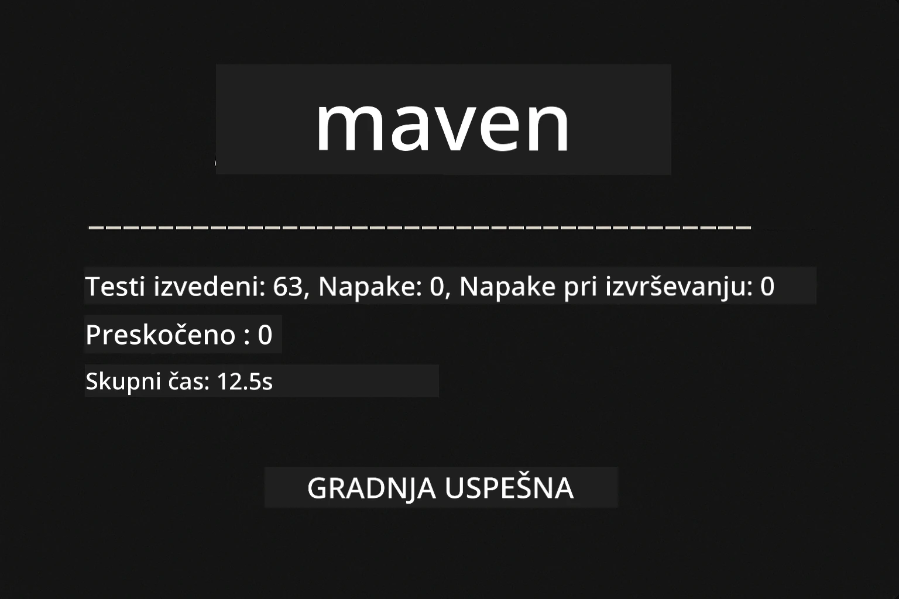
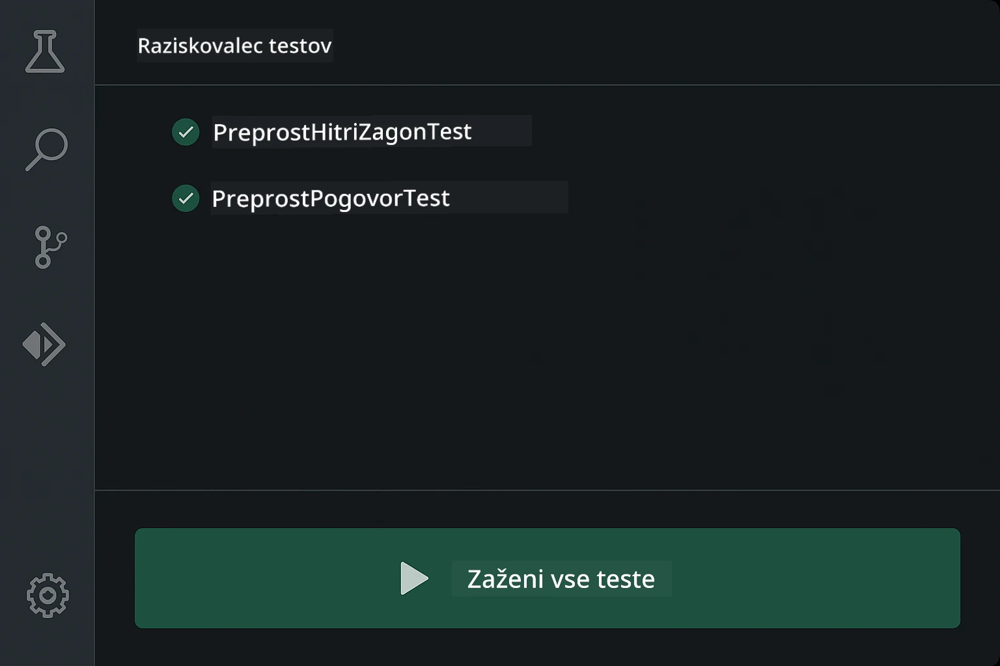
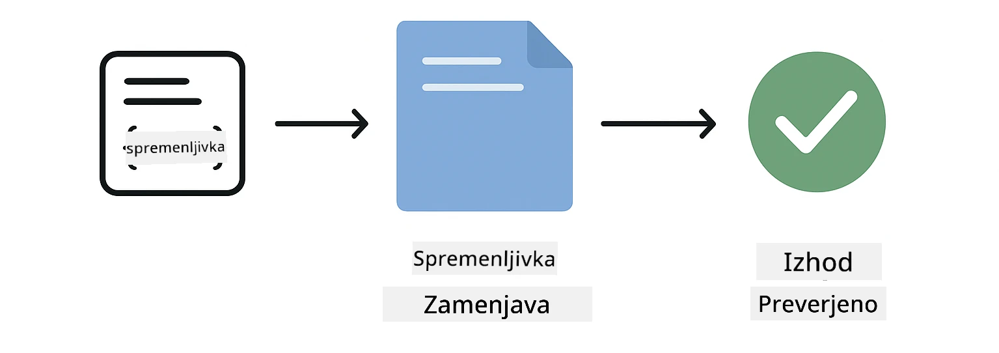
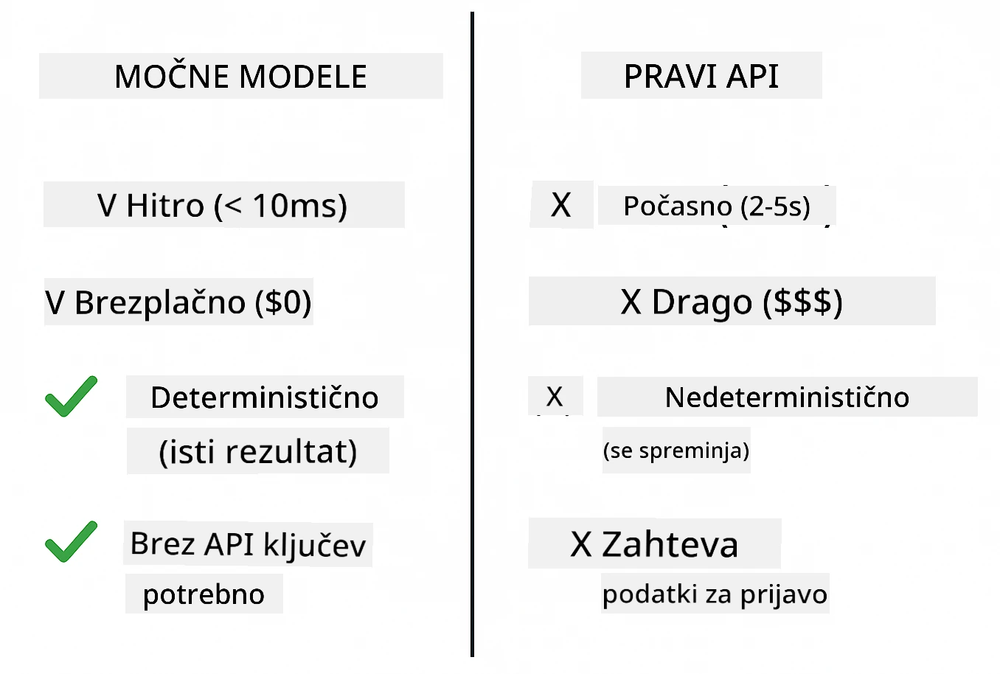
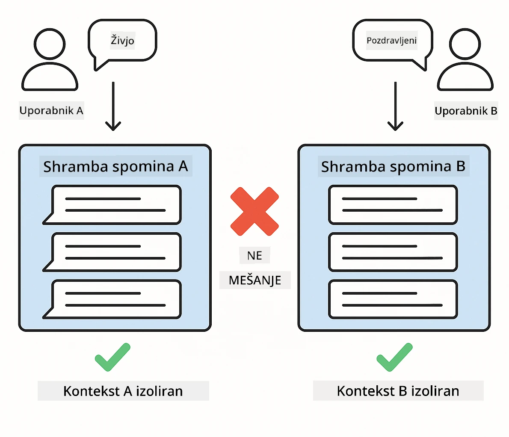
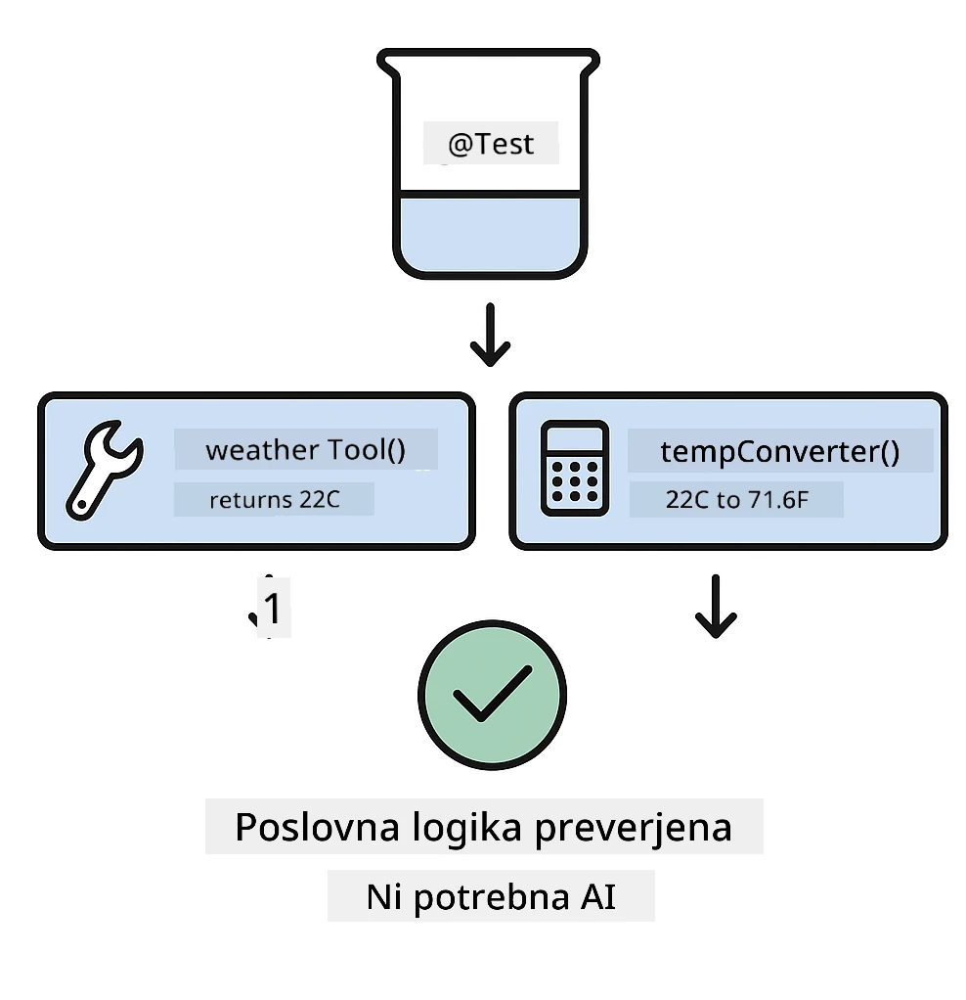
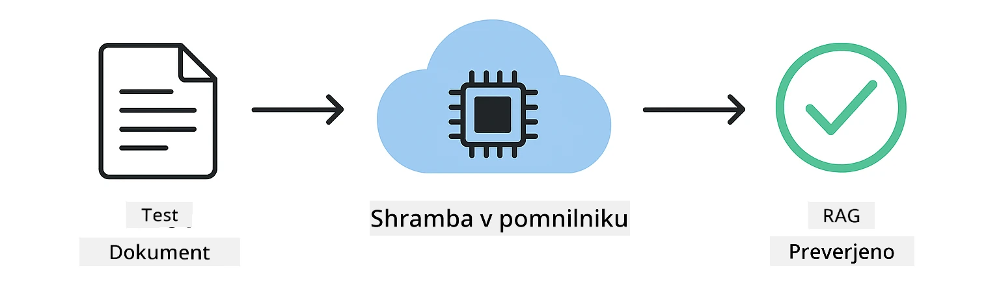

# Testiranje aplikacij LangChain4j

## Kazalo vsebine

- [Hitri začetek](../../../docs)
- [Kaj testi pokrivajo](../../../docs)
- [Zaganjanje testov](../../../docs)
- [Zaganjanje testov v VS Code](../../../docs)
- [Vzorce testiranja](../../../docs)
- [Filozofija testiranja](../../../docs)
- [Nadaljnji koraki](../../../docs)

Ta vodnik vas vodi skozi teste, ki prikazujejo, kako testirati AI aplikacije, ne da bi potrebovali API ključe ali zunanje storitve.

## Hitri začetek

Zaženite vse teste z eno samo ukazno vrstico:

**Bash:**
```bash
mvn test
```

**PowerShell:**
```powershell
mvn --% test
```



*Uspešno izvajanje testov, ki prikazuje, da so vsi testi prestali brez napak*

## Kaj testi pokrivajo

Ta tečaj se osredotoča na **enote testov (unit tests)**, ki tečejo lokalno. Vsak test prikaže določen koncept LangChain4j v izolaciji.


*Piramida testiranja prikazuje ravnovesje med enotnimi testi (hitri, izolirani), integracijskimi testi (resni sestavni deli) in end-to-end testi. To usposabljanje pokriva enotno testiranje.*

| Modul | Testi | Osrednja tema | Ključne datoteke |
|--------|-------|-------|-----------|
| **00 - Hitri začetek** | 6 | Predloge pozivov in zamenjava spremenljivk | `SimpleQuickStartTest.java` |
| **01 - Uvod** | 8 | Spomin pogovorov in stanje za klepet | `SimpleConversationTest.java` |
| **02 - Inženiring pozivov** | 12 | Vzorci GPT-5, stopnje željnosti, strukturiran izhod | `SimpleGpt5PromptTest.java` |
| **03 - RAG** | 10 | Vnos dokumentov, embeddingi, iskanje po podobnosti | `DocumentServiceTest.java` |
| **04 - Orodja** | 12 | Klic funkcij in povezovanje orodij | `SimpleToolsTest.java` |
| **05 - MCP** | 8 | Model Context Protocol s stdio transportom | `SimpleMcpTest.java` |

## Zaganjanje testov

**Zaženi vse teste iz root mape:**

**Bash:**
```bash
mvn test
```

**PowerShell:**
```powershell
mvn --% test
```

**Zaženite teste za določen modul:**

**Bash:**
```bash
cd 01-introduction && mvn test
# Ali iz korena
mvn test -pl 01-introduction
```

**PowerShell:**
```powershell
cd 01-introduction; mvn --% test
# Ali iz korenskega imenika
mvn --% test -pl 01-introduction
```

**Zaženi eno testno razredi:**

**Bash:**
```bash
mvn test -Dtest=SimpleConversationTest
```

**PowerShell:**
```powershell
mvn --% test -Dtest=SimpleConversationTest
```

**Zaženi določen testni metodo:**

**Bash:**
```bash
mvn test -Dtest=SimpleConversationTest#naj ohranja zgodovino pogovora
```

**PowerShell:**
```powershell
mvn --% test -Dtest=SimpleConversationTest#naj ohranja zgodovino pogovorov
```

## Zaganjanje testov v VS Code

Če uporabljate Visual Studio Code, Test Explorer ponuja grafični vmesnik za zagon in odpravljanje napak testov.



*Test Explorer v VS Code prikazuje drevo testov z vsemi Java testnimi razredi in posameznimi testnimi metodami*

**Za zagon testov v VS Code:**

1. Odprite Test Explorer tako, da kliknete ikono bučke v Activity Bar
2. Razprite drevo testov, da vidite vse module in testne razrede
3. Kliknite gumb za predvajanje ob katerem koli testu, da ga zaženete posamezno
4. Kliknite "Run All Tests", da izvedete celoten nabor
5. Z desnim klikom na kateri koli test izberite "Debug Test", da nastavite točke prekinitve in korakate skozi kodo

Test Explorer prikazuje zelene kljukice za uspešne teste in ponuja podrobna sporočila o napakah, ko testi ne uspejo.

## Vzorce testiranja

### Vzorec 1: Testiranje predlog pozivov

Najpreprostejši vzorec testira predloge pozivov, ne da bi klical kakršen koli AI model. Preverite, ali zamenjava spremenljivk deluje pravilno in ali so pozivi oblikovani tako, kot želite.



*Testiranje predlog pozivov, ki prikazuje tok zamenjave spremenljivk: predloga s praznimi mesti → vnesene vrednosti → preverjen oblikovan izhod*

```java
@Test
@DisplayName("Should format prompt template with variables")
void testPromptTemplateFormatting() {
    PromptTemplate template = PromptTemplate.from(
        "Best time to visit {{destination}} for {{activity}}?"
    );
    
    Prompt prompt = template.apply(Map.of(
        "destination", "Paris",
        "activity", "sightseeing"
    ));
    
    assertThat(prompt.text()).isEqualTo("Best time to visit Paris for sightseeing?");
}
```

Ta test se nahaja v `00-quick-start/src/test/java/com/example/langchain4j/quickstart/SimpleQuickStartTest.java`.

**Zaženite ga:**

**Bash:**
```bash
cd 00-quick-start && mvn test -Dtest=SimpleQuickStartTest#testiranje oblikovanja predloge poziva
```

**PowerShell:**
```powershell
cd 00-quick-start; mvn --% test -Dtest=SimpleQuickStartTest#testiranjeOblikovanjaPredlogePoziva
```

### Vzorec 2: Mockanje jezikovnih modelov

Pri testiranju logike pogovora uporabite Mockito za ustvarjanje lažnih modelov, ki vračajo vnaprej določene odgovore. To naredi teste hitre, brezplačne in deterministične.



*Primerjava, zakaj so mocki za testiranje zaželeni: so hitri, brezplačni, deterministični in ne zahtevajo API ključev*

```java
@ExtendWith(MockitoExtension.class)
class SimpleConversationTest {
    
    private ConversationService conversationService;
    
    @Mock
    private OpenAiOfficialChatModel mockChatModel;
    
    @BeforeEach
    void setUp() {
        ChatResponse mockResponse = ChatResponse.builder()
            .aiMessage(AiMessage.from("This is a test response"))
            .build();
        when(mockChatModel.chat(anyList())).thenReturn(mockResponse);
        
        conversationService = new ConversationService(mockChatModel);
    }
    
    @Test
    void shouldMaintainConversationHistory() {
        String conversationId = conversationService.startConversation();
        
        ChatResponse mockResponse1 = ChatResponse.builder()
            .aiMessage(AiMessage.from("Response 1"))
            .build();
        ChatResponse mockResponse2 = ChatResponse.builder()
            .aiMessage(AiMessage.from("Response 2"))
            .build();
        ChatResponse mockResponse3 = ChatResponse.builder()
            .aiMessage(AiMessage.from("Response 3"))
            .build();
        
        when(mockChatModel.chat(anyList()))
            .thenReturn(mockResponse1)
            .thenReturn(mockResponse2)
            .thenReturn(mockResponse3);

        conversationService.chat(conversationId, "First message");
        conversationService.chat(conversationId, "Second message");
        conversationService.chat(conversationId, "Third message");

        List<ChatMessage> history = conversationService.getHistory(conversationId);
        assertThat(history).hasSize(6); // 3 sporočila uporabnika + 3 sporočila AI
    }
}
```

Ta vzorec se pojavi v `01-introduction/src/test/java/com/example/langchain4j/service/SimpleConversationTest.java`. Mock zagotavlja dosledno vedenje, zato lahko preverite, ali upravljanje spomina deluje pravilno.

### Vzorec 3: Testiranje izolacije pogovorov

Spomin pogovorov mora ohranjati ločene uporabnike. Ta test preveri, da se konteksti pogovorov ne mešajo.



*Testiranje izolacije pogovorov prikazuje ločene skladišče zgodovine za različne uporabnike, da se prepreči mešanje konteksta*

```java
@Test
void shouldIsolateConversationsByid() {
    String conv1 = conversationService.startConversation();
    String conv2 = conversationService.startConversation();
    
    ChatResponse mockResponse = ChatResponse.builder()
        .aiMessage(AiMessage.from("Response"))
        .build();
    when(mockChatModel.chat(anyList())).thenReturn(mockResponse);

    conversationService.chat(conv1, "Message for conversation 1");
    conversationService.chat(conv2, "Message for conversation 2");

    List<ChatMessage> history1 = conversationService.getHistory(conv1);
    List<ChatMessage> history2 = conversationService.getHistory(conv2);
    
    assertThat(history1).hasSize(2);
    assertThat(history2).hasSize(2);
}
```

Vsak pogovor ohranja svojo neodvisno zgodovino. V produkcijskih sistemih je ta izolacija ključna za večuporabniške aplikacije.

### Vzorec 4: Neodvisno testiranje orodij

Orodja so funkcije, ki jih AI lahko pokliče. Testirajte jih neposredno, da zagotovite, da delujejo pravilno ne glede na odločitve AI.



*Neodvisno testiranje orodij prikazuje izvajanje lažnih orodij brez klicev AI, da se preveri poslovna logika*

```java
@Test
void shouldConvertCelsiusToFahrenheit() {
    TemperatureTool tempTool = new TemperatureTool();
    String result = tempTool.celsiusToFahrenheit(25.0);
    assertThat(result).containsPattern("77[.,]0°F");
}

@Test
void shouldDemonstrateToolChaining() {
    WeatherTool weatherTool = new WeatherTool();
    TemperatureTool tempTool = new TemperatureTool();

    String weatherResult = weatherTool.getCurrentWeather("Seattle");
    assertThat(weatherResult).containsPattern("\\d+°C");

    String conversionResult = tempTool.celsiusToFahrenheit(22.0);
    assertThat(conversionResult).containsPattern("71[.,]6°F");
}
```

Ti testi iz `04-tools/src/test/java/com/example/langchain4j/agents/tools/SimpleToolsTest.java` preverjajo logiko orodij brez vpletenosti AI. Primer verižjenja prikazuje, kako izhod enega orodja napaja vhod naslednjega.

### Vzorec 5: Testiranje RAG v pomnilniku

Sistemi RAG običajno zahtevajo vektorske baze podatkov in storitve za embeddinge. Vzorec v pomnilniku vam omogoča testiranje celotne cevovoda brez zunanjih odvisnosti.



*Potek testiranja RAG v pomnilniku prikazuje razčlenjevanje dokumentov, shranjevanje embeddingov in iskanje podobnosti brez potrebe po bazi podatkov*

```java
@Test
void testProcessTextDocument() {
    String content = "This is a test document.\nIt has multiple lines.";
    InputStream inputStream = new ByteArrayInputStream(content.getBytes(StandardCharsets.UTF_8));
    
    DocumentService.ProcessedDocument result = 
        documentService.processDocument(inputStream, "test.txt");

    assertNotNull(result);
    assertTrue(result.segments().size() > 0);
    assertEquals("test.txt", result.segments().get(0).metadata().getString("filename"));
}
```

Ta test iz `03-rag/src/test/java/com/example/langchain4j/rag/service/DocumentServiceTest.java` ustvari dokument v pomnilniku in preveri razčlenjevanje ter obdelavo metapodatkov.

### Vzorec 6: Integracijsko testiranje MCP

Modul MCP testira integracijo Model Context Protocol z uporabo stdio transporta. Ti testi preverijo, da se vaša aplikacija lahko zažene in komunicira s MCP strežniki kot podprocesi.

Testi v `05-mcp/src/test/java/com/example/langchain4j/mcp/SimpleMcpTest.java` preverjajo vedenje MCP odjemalca.

**Zaženite jih:**

**Bash:**
```bash
cd 05-mcp && mvn test
```

**PowerShell:**
```powershell
cd 05-mcp; mvn --% test
```

## Filozofija testiranja

Testirajte svojo kodo, ne AI. Vaši testi naj preverjajo kodo, ki jo napišete, s preverjanjem, kako so pozivi zgrajeni, kako se upravlja spomin in kako se izvajajo orodja. Odgovori AI se spreminjajo in ne bi smeli biti del testnih trditev. Vprašajte se, ali vaša predloga pravilno zamenja spremenljivke, ne ali AI poda pravilen odgovor.

Uporabljajte mocke za jezikovne modele. So zunanji odvisniki, ki so počasni, dragi in nedeterministični. Mockanje naredi teste hitre — v milisekundah namesto sekund, brez stroškov API-ja in deterministične z enakim rezultatom vsakič.

Ohranite teste neodvisne. Vsak test naj pripravi svoje podatke, naj se ne zanaša na druge teste in naj po sebi pospravi. Testi bi morali uspeti ne glede na vrstni red izvajanja.

Testirajte robne primere poleg optimističnih poti. Preizkusite prazne vnose, zelo velike vnose, posebne znake, neveljavne parametre in mejne pogoje. Ti pogosto razkrijejo napake, ki jih običajna uporaba ne odkrije.

Uporabljajte opisna imena. Primerjajte `shouldMaintainConversationHistoryAcrossMultipleMessages()` z `test1()`. Prvo vam natančno pove, kaj se testira, kar olajša razhroščevanje pri napakah.

## Nadaljnji koraki

Sedaj, ko razumete vzorce testiranja, se poglobite v vsak modul:

- **[00 - Hitri začetek](../00-quick-start/README.md)** - Začnite z osnovami predlog pozivov
- **[01 - Uvod](../01-introduction/README.md)** - Naučite se upravljanja spomina pogovorov
- **[02 - Inženiring pozivov](../02-prompt-engineering/README.md)** - Obvladujte vzorce pozivanja GPT-5
- **[03 - RAG](../03-rag/README.md)** - Zgradite sisteme za generiranje z iskanjem (RAG)
- **[04 - Orodja](../04-tools/README.md)** - Implementirajte klice funkcij in verižne procese orodij
- **[05 - MCP](../05-mcp/README.md)** - Integrirajte Model Context Protocol

README vsakega modula nudi podrobna pojasnila konceptov, ki so tukaj testirani.

---

**Navigacija:** [← Nazaj na glavno](../README.md)

---

<!-- CO-OP TRANSLATOR DISCLAIMER START -->
Izjava o omejitvi odgovornosti:
Ta dokument je bil preveden z uporabo storitve za avtomatski prevod z umetno inteligenco Co‑op Translator (https://github.com/Azure/co-op-translator). Čeprav si prizadevamo za natančnost, upoštevajte, da lahko avtomatski prevodi vsebujejo napake ali netočnosti. Izvirni dokument v izvirnem jeziku velja za avtoritativni vir. Za ključne informacije priporočamo strokovni človeški prevod. Za morebitne nesporazume ali napačne razlage, ki izhajajo iz uporabe tega prevoda, ne odgovarjamo.
<!-- CO-OP TRANSLATOR DISCLAIMER END -->