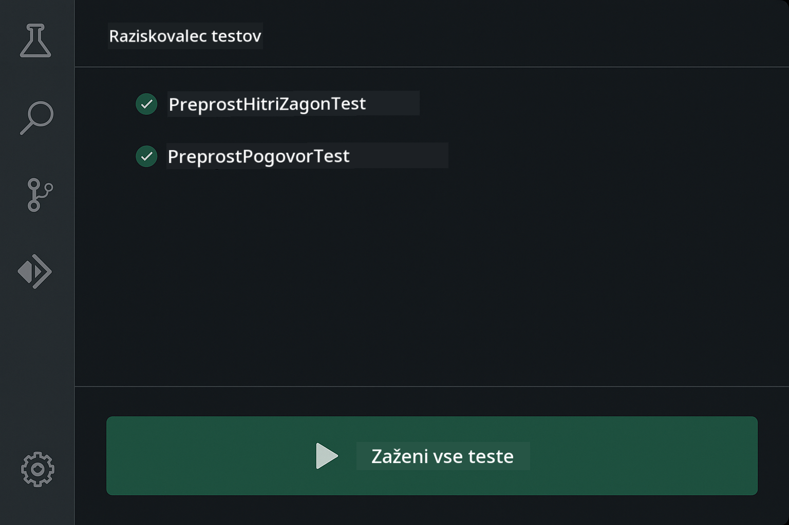
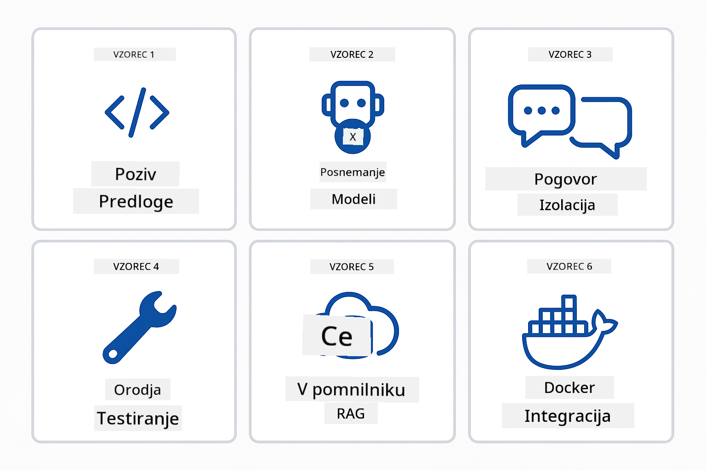
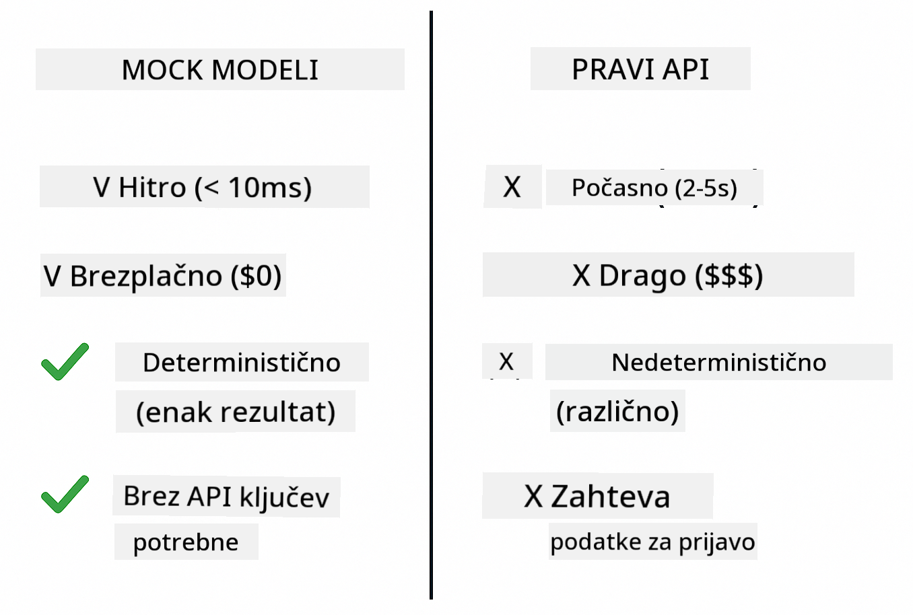
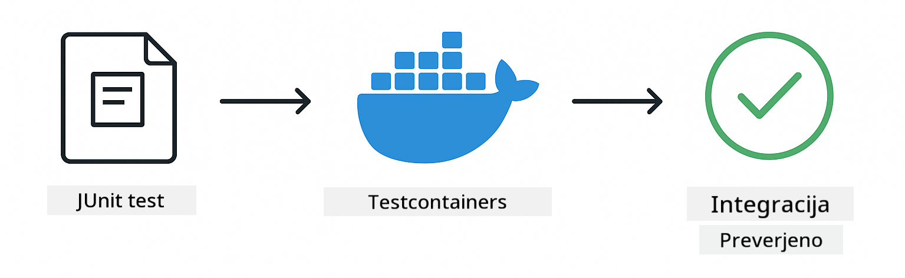

<!--
CO_OP_TRANSLATOR_METADATA:
{
  "original_hash": "b975537560c404d5f254331832811e78",
  "translation_date": "2025-12-13T21:27:57+00:00",
  "source_file": "docs/TESTING.md",
  "language_code": "sl"
}
-->
# Testiranje aplikacij LangChain4j

## Kazalo

- [Hiter začetek](../../../docs)
- [Kaj testi pokrivajo](../../../docs)
- [Zagon testov](../../../docs)
- [Zagon testov v VS Code](../../../docs)
- [Vzorce testiranja](../../../docs)
- [Filozofija testiranja](../../../docs)
- [Naslednji koraki](../../../docs)

Ta vodič vas popelje skozi teste, ki prikazujejo, kako testirati AI aplikacije brez potrebe po API ključih ali zunanjih storitvah.

## Hiter začetek

Zaženite vse teste z eno samo ukazno vrstico:

**Bash:**
```bash
mvn test
```

**PowerShell:**
```powershell
mvn --% test
```


*Uspešen zagon testov, ki prikazuje, da vsi testi uspešno opravijo brez napak*

## Kaj testi pokrivajo

Ta tečaj se osredotoča na **enotne teste**, ki se izvajajo lokalno. Vsak test prikazuje določen koncept LangChain4j izolirano.


*Testna piramida prikazuje ravnovesje med enotnimi testi (hitri, izolirani), integracijskimi testi (pravi komponenti) in end-to-end testi (celoten sistem z Dockerjem). Ta usposabljanje pokriva enotno testiranje.*

| Modul | Testi | Osredotočenost | Ključne datoteke |
|--------|-------|----------------|------------------|
| **00 - Hiter začetek** | 6 | Predloge pozivov in zamenjava spremenljivk | `SimpleQuickStartTest.java` |
| **01 - Uvod** | 8 | Pogovorovni spomin in stanje klepeta | `SimpleConversationTest.java` |
| **02 - Inženiring pozivov** | 12 | Vzorce GPT-5, stopnje vneme, strukturiran izhod | `SimpleGpt5PromptTest.java` |
| **03 - RAG** | 10 | Vnos dokumentov, vdelave, iskanje podobnosti | `DocumentServiceTest.java` |
| **04 - Orodja** | 12 | Klic funkcij in verižna orodja | `SimpleToolsTest.java` |
| **05 - MCP** | 15 | Model Context Protocol z Dockerjem | `SimpleMcpTest.java`, `McpDockerTransportTest.java` |

## Zagon testov

**Zaženite vse teste iz korenske mape:**

**Bash:**
```bash
mvn test
```

**PowerShell:**
```powershell
mvn --% test
```

**Zaženite teste za določen modul:**

**Bash:**
```bash
cd 01-introduction && mvn test
# Ali iz korena
mvn test -pl 01-introduction
```

**PowerShell:**
```powershell
cd 01-introduction; mvn --% test
# Ali iz korena
mvn --% test -pl 01-introduction
```

**Zaženite posamezno testno razredno datoteko:**

**Bash:**
```bash
mvn test -Dtest=SimpleConversationTest
```

**PowerShell:**
```powershell
mvn --% test -Dtest=SimpleConversationTest
```

**Zaženite določen testni metod:**

**Bash:**
```bash
mvn test -Dtest=SimpleConversationTest#naj ohrani zgodovino pogovora
```

**PowerShell:**
```powershell
mvn --% test -Dtest=SimpleConversationTest#naj ohrani zgodovino pogovora
```

## Zagon testov v VS Code

Če uporabljate Visual Studio Code, Test Explorer nudi grafični vmesnik za zagon in odpravljanje napak testov.



*Test Explorer v VS Code prikazuje drevo testov z vsemi Java testnimi razredi in posameznimi testnimi metodami*

**Za zagon testov v VS Code:**

1. Odprite Test Explorer s klikom na ikono epruvete v vrstici aktivnosti
2. Razširite drevo testov, da vidite vse module in testne razrede
3. Kliknite gumb za predvajanje ob katerem koli testu, da ga zaženete posamično
4. Kliknite "Run All Tests" za zagon celotnega nabora
5. Z desnim klikom na test izberite "Debug Test" za nastavitev točk prekinitve in korak po korak pregled kode

Test Explorer prikazuje zelene kljukice za uspešne teste in podrobna sporočila o napakah, če testi ne uspejo.

## Vzorce testiranja



*Šest vzorcev testiranja za aplikacije LangChain4j: predloge pozivov, lažni modeli, izolacija pogovora, testiranje orodij, RAG v pomnilniku in integracija z Dockerjem*

### Vzorec 1: Testiranje predlog pozivov

Najpreprostejši vzorec testira predloge pozivov brez klica AI modela. Preverite, da zamenjava spremenljivk deluje pravilno in da so pozivi oblikovani kot pričakovano.


*Testiranje predlog pozivov prikazuje potek zamenjave spremenljivk: predloga z rezerviranimi mesti → uporabljene vrednosti → preverjen oblikovani izhod*

```java
@Test
@DisplayName("Should format prompt template with variables")
void testPromptTemplateFormatting() {
    PromptTemplate template = PromptTemplate.from(
        "Best time to visit {{destination}} for {{activity}}?"
    );
    
    Prompt prompt = template.apply(Map.of(
        "destination", "Paris",
        "activity", "sightseeing"
    ));
    
    assertThat(prompt.text()).isEqualTo("Best time to visit Paris for sightseeing?");
}
```

Ta test se nahaja v `00-quick-start/src/test/java/com/example/langchain4j/quickstart/SimpleQuickStartTest.java`.

**Zaženite ga:**

**Bash:**
```bash
cd 00-quick-start && mvn test -Dtest=SimpleQuickStartTest#testiranjeOblikePredlogePoziva
```

**PowerShell:**
```powershell
cd 00-quick-start; mvn --% test -Dtest=SimpleQuickStartTest#testiranjeOblikePredlogePoziva
```

### Vzorec 2: Lažni jezikovni modeli

Pri testiranju logike pogovora uporabite Mockito za ustvarjanje lažnih modelov, ki vračajo vnaprej določene odgovore. To naredi teste hitre, brezplačne in deterministične.



*Primerjava, zakaj so lažni modeli za testiranje boljši: so hitri, brezplačni, deterministični in ne zahtevajo API ključev*

```java
@ExtendWith(MockitoExtension.class)
class SimpleConversationTest {
    
    private ConversationService conversationService;
    
    @Mock
    private OpenAiOfficialChatModel mockChatModel;
    
    @BeforeEach
    void setUp() {
        ChatResponse mockResponse = ChatResponse.builder()
            .aiMessage(AiMessage.from("This is a test response"))
            .build();
        when(mockChatModel.chat(anyList())).thenReturn(mockResponse);
        
        conversationService = new ConversationService(mockChatModel);
    }
    
    @Test
    void shouldMaintainConversationHistory() {
        String conversationId = conversationService.startConversation();
        
        ChatResponse mockResponse1 = ChatResponse.builder()
            .aiMessage(AiMessage.from("Response 1"))
            .build();
        ChatResponse mockResponse2 = ChatResponse.builder()
            .aiMessage(AiMessage.from("Response 2"))
            .build();
        ChatResponse mockResponse3 = ChatResponse.builder()
            .aiMessage(AiMessage.from("Response 3"))
            .build();
        
        when(mockChatModel.chat(anyList()))
            .thenReturn(mockResponse1)
            .thenReturn(mockResponse2)
            .thenReturn(mockResponse3);

        conversationService.chat(conversationId, "First message");
        conversationService.chat(conversationId, "Second message");
        conversationService.chat(conversationId, "Third message");

        List<ChatMessage> history = conversationService.getHistory(conversationId);
        assertThat(history).hasSize(6); // 3 uporabniška + 3 AI sporočila
    }
}
```

Ta vzorec se pojavi v `01-introduction/src/test/java/com/example/langchain4j/service/SimpleConversationTest.java`. Lažni model zagotavlja dosledno vedenje, da lahko preverite pravilno upravljanje spomina.

### Vzorec 3: Testiranje izolacije pogovora

Pogovorovni spomin mora ločevati več uporabnikov. Ta test preverja, da se konteksti pogovorov ne mešajo.


*Testiranje izolacije pogovora prikazuje ločene shrambe spomina za različne uporabnike, da prepreči mešanje konteksta*

```java
@Test
void shouldIsolateConversationsByid() {
    String conv1 = conversationService.startConversation();
    String conv2 = conversationService.startConversation();
    
    ChatResponse mockResponse = ChatResponse.builder()
        .aiMessage(AiMessage.from("Response"))
        .build();
    when(mockChatModel.chat(anyList())).thenReturn(mockResponse);

    conversationService.chat(conv1, "Message for conversation 1");
    conversationService.chat(conv2, "Message for conversation 2");

    List<ChatMessage> history1 = conversationService.getHistory(conv1);
    List<ChatMessage> history2 = conversationService.getHistory(conv2);
    
    assertThat(history1).hasSize(2);
    assertThat(history2).hasSize(2);
}
```

Vsak pogovor ohranja svojo neodvisno zgodovino. V produkcijskih sistemih je ta izolacija ključna za aplikacije z več uporabniki.

### Vzorec 4: Neodvisno testiranje orodij

Orodja so funkcije, ki jih AI lahko kliče. Testirajte jih neposredno, da zagotovite pravilno delovanje ne glede na odločitve AI.


*Neodvisno testiranje orodij prikazuje izvajanje lažnih orodij brez klicev AI za preverjanje poslovne logike*

```java
@Test
void shouldConvertCelsiusToFahrenheit() {
    TemperatureTool tempTool = new TemperatureTool();
    String result = tempTool.celsiusToFahrenheit(25.0);
    assertThat(result).containsPattern("77[.,]0°F");
}

@Test
void shouldDemonstrateToolChaining() {
    WeatherTool weatherTool = new WeatherTool();
    TemperatureTool tempTool = new TemperatureTool();

    String weatherResult = weatherTool.getCurrentWeather("Seattle");
    assertThat(weatherResult).containsPattern("\\d+°C");

    String conversionResult = tempTool.celsiusToFahrenheit(22.0);
    assertThat(conversionResult).containsPattern("71[.,]6°F");
}
```

Ti testi iz `04-tools/src/test/java/com/example/langchain4j/agents/tools/SimpleToolsTest.java` preverjajo logiko orodij brez vpletenosti AI. Primer verižnega klica prikazuje, kako izhod enega orodja služi kot vhod drugemu.

### Vzorec 5: RAG testiranje v pomnilniku

RAG sistemi običajno zahtevajo vektorske baze podatkov in storitve vdelav. Vzorec v pomnilniku omogoča testiranje celotne verige brez zunanjih odvisnosti.


*Delovni tok RAG testiranja v pomnilniku prikazuje razčlenjevanje dokumentov, shranjevanje vdelav in iskanje podobnosti brez potrebe po bazi podatkov*

```java
@Test
void testProcessTextDocument() {
    String content = "This is a test document.\nIt has multiple lines.";
    InputStream inputStream = new ByteArrayInputStream(content.getBytes(StandardCharsets.UTF_8));
    
    DocumentService.ProcessedDocument result = 
        documentService.processDocument(inputStream, "test.txt");

    assertNotNull(result);
    assertTrue(result.segments().size() > 0);
    assertEquals("test.txt", result.segments().get(0).metadata().getString("filename"));
}
```

Ta test iz `03-rag/src/test/java/com/example/langchain4j/rag/service/DocumentServiceTest.java` ustvari dokument v pomnilniku in preveri razdeljevanje na kose ter upravljanje z metapodatki.

### Vzorec 6: Integracijsko testiranje z Dockerjem

Nekatere funkcije potrebujejo pravo infrastrukturo. MCP modul uporablja Testcontainers za zagon Docker kontejnerjev za integracijske teste. Ti preverjajo, da vaša koda deluje z dejanskimi storitvami ob ohranjanju izolacije testov.



*Integracijsko testiranje MCP z Testcontainers prikazuje avtomatiziran življenjski cikel kontejnerjev: zagon, izvajanje testov, zaustavitev in čiščenje*

Testi v `05-mcp/src/test/java/com/example/langchain4j/mcp/McpDockerTransportTest.java` zahtevajo, da je Docker zagnan.

**Zaženite jih:**

**Bash:**
```bash
cd 05-mcp && mvn test
```

**PowerShell:**
```powershell
cd 05-mcp; mvn --% test
```

## Filozofija testiranja

Testirajte svojo kodo, ne AI. Vaši testi naj preverjajo kodo, ki jo pišete, tako da preverjajo, kako so pozivi sestavljeni, kako se upravlja spomin in kako se izvajajo orodja. Odgovori AI so spremenljivi in ne bi smeli biti del testnih trditev. Vprašajte se, ali vaša predloga poziva pravilno zamenja spremenljivke, ne ali AI poda pravilen odgovor.

Uporabljajte lažne modele jezikov. So zunanje odvisnosti, ki so počasne, drage in nedeterministične. Lažni modeli naredijo teste hitre z milisekundami namesto sekund, brezplačne brez stroškov API-ja in deterministične z istim rezultatom vsakič.

Ohranjajte teste neodvisne. Vsak test naj nastavi svoje podatke, ne naj se zanaša na druge teste in naj se po sebi počisti. Testi naj uspejo ne glede na vrstni red izvajanja.

Testirajte robne primere onkraj običajnih poti. Preizkusite prazne vnose, zelo velike vnose, posebne znake, neveljavne parametre in mejne pogoje. Ti pogosto razkrijejo napake, ki jih običajna uporaba ne pokaže.

Uporabljajte opisna imena. Primerjajte `shouldMaintainConversationHistoryAcrossMultipleMessages()` z `test1()`. Prvo vam natančno pove, kaj se testira, kar olajša odpravljanje napak.

## Naslednji koraki

Zdaj, ko razumete vzorce testiranja, se poglobite v vsak modul:

- **[00 - Hiter začetek](../00-quick-start/README.md)** - Začnite z osnovami predlog pozivov
- **[01 - Uvod](../01-introduction/README.md)** - Naučite se upravljanja pogovornega spomina
- **[02 - Inženiring pozivov](../02-prompt-engineering/README.md)** - Obvladujte vzorce pozivov GPT-5
- **[03 - RAG](../03-rag/README.md)** - Gradite sisteme za generiranje z iskanjem informacij
- **[04 - Orodja](../04-tools/README.md)** - Implementirajte klic funkcij in verižna orodja
- **[05 - MCP](../05-mcp/README.md)** - Integrirajte Model Context Protocol z Dockerjem

Vsak modulov README vsebuje podrobna pojasnila konceptov, ki so tukaj testirani.

---

**Navigacija:** [← Nazaj na glavno](../README.md)

---

<!-- CO-OP TRANSLATOR DISCLAIMER START -->
**Omejitev odgovornosti**:
Ta dokument je bil preveden z uporabo storitve za prevajanje z umetno inteligenco [Co-op Translator](https://github.com/Azure/co-op-translator). Čeprav si prizadevamo za natančnost, vas opozarjamo, da avtomatizirani prevodi lahko vsebujejo napake ali netočnosti. Izvirni dokument v njegovem izvirnem jeziku velja za avtoritativni vir. Za ključne informacije priporočamo strokovni človeški prevod. Za morebitna nesporazume ali napačne interpretacije, ki izhajajo iz uporabe tega prevoda, ne odgovarjamo.
<!-- CO-OP TRANSLATOR DISCLAIMER END -->