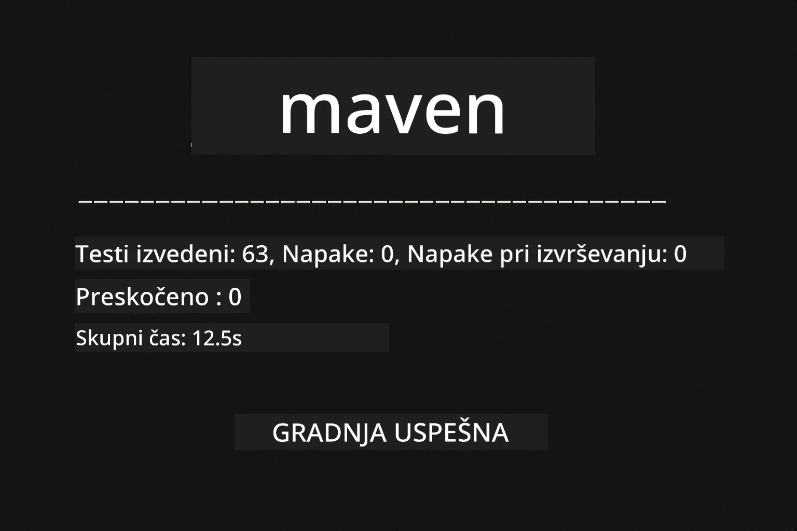
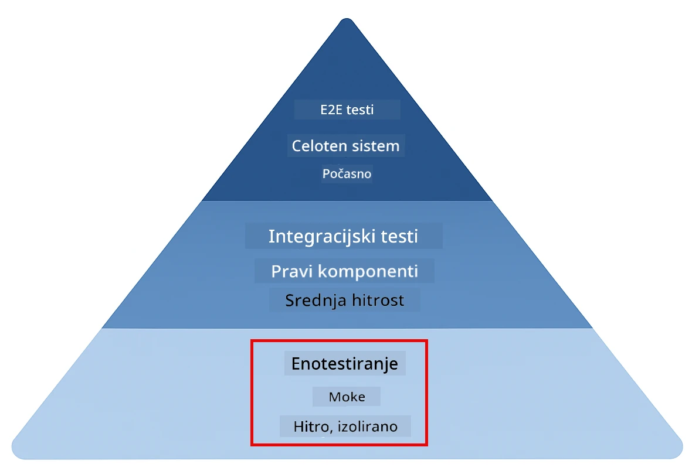
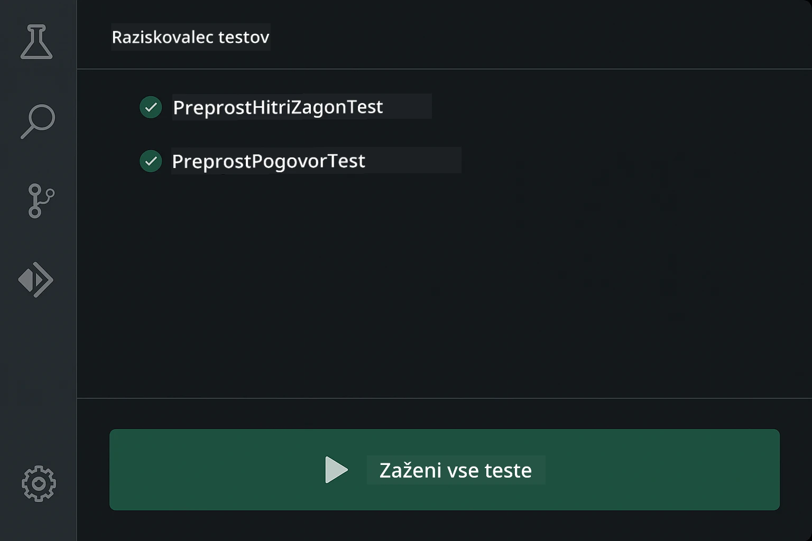
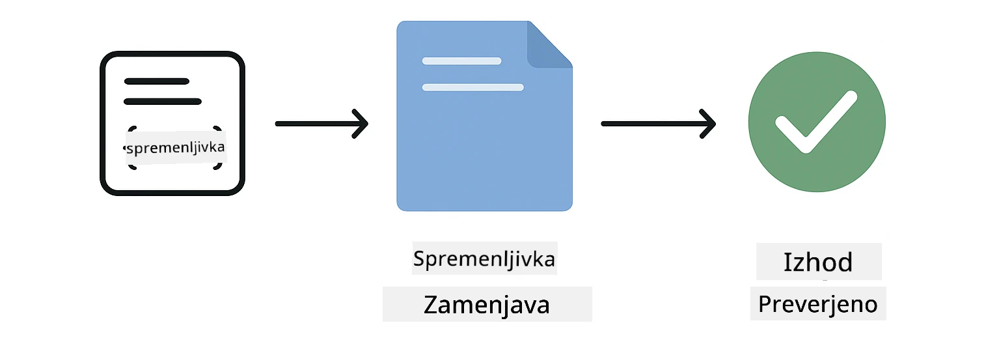
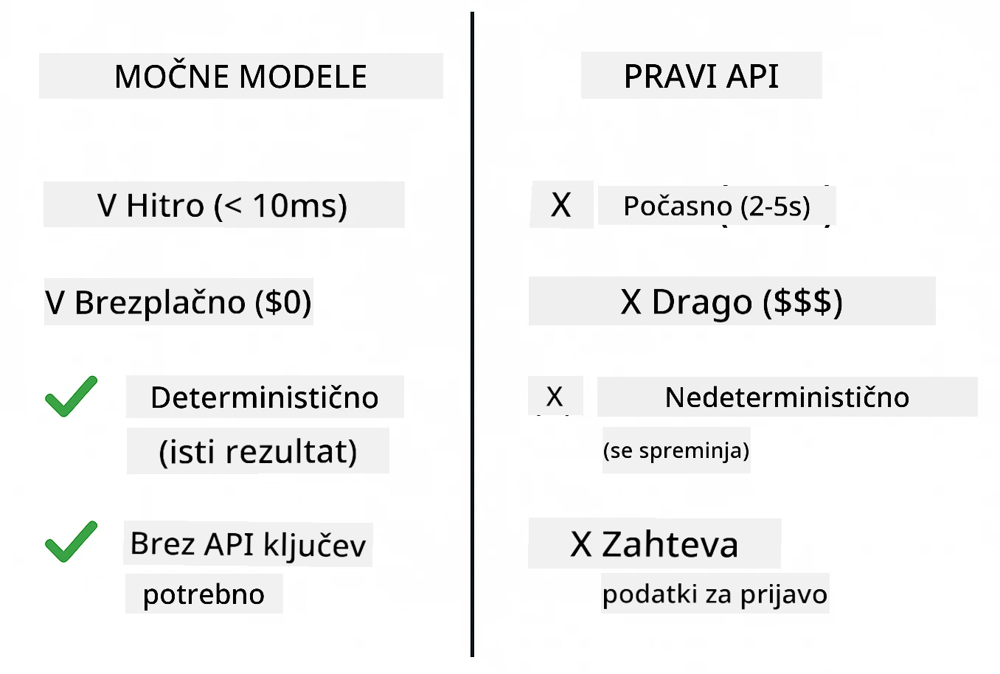
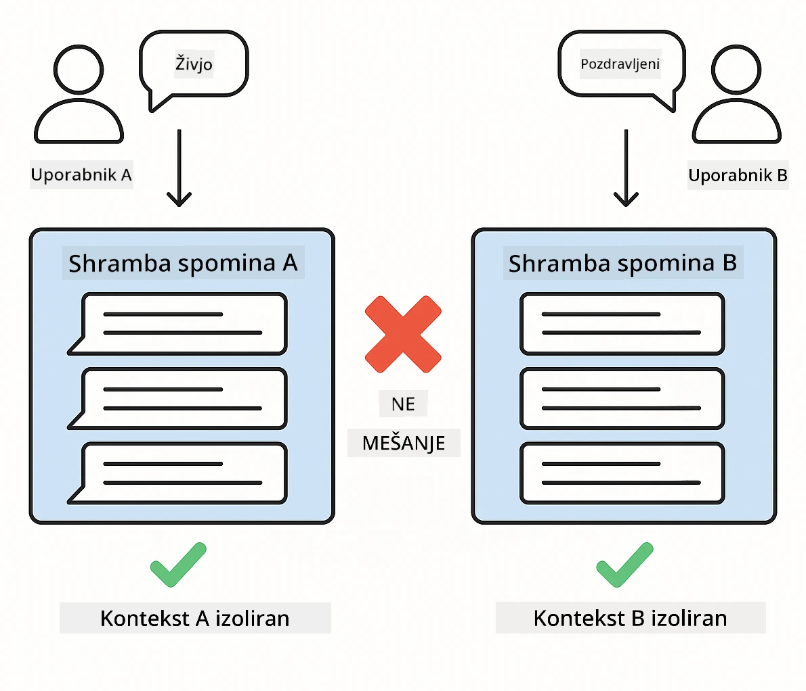
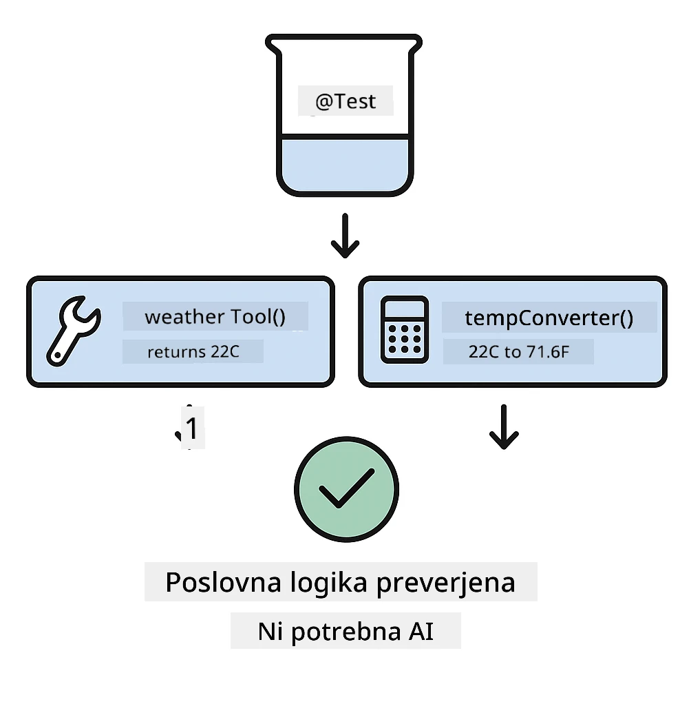
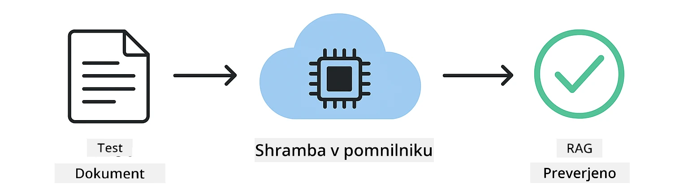

# Testiranje aplikacij LangChain4j

## Kazalo vsebine

- [Hiter začetek](#hiter-začetek)
- [Kaj testi zajemajo](#kaj-testi-zajemajo)
- [Zagon testov](#zagon-testov)
- [Zagon testov v VS Code](#zagon-testov-v-vs-code)
- [Vzorci testiranja](#vzorci-testiranja)
- [Filozofija testiranja](#filozofija-testiranja)
- [Naslednji koraki](#naslednji-koraki)

Ta vodič vas vodi skozi teste, ki kažejo, kako testirati AI aplikacije brez potrebe po API ključih ali zunanjih storitvah.

## Hiter začetek

Zaženite vse teste z enim ukazom:

**Bash:**
```bash
mvn test
```

**PowerShell:**
```powershell
mvn --% test
```

Ko vsi testi uspešno pretečejo, bi morali videti izhod, kot je prikazan na spodnji sliki — testi se izvajajo brez napak.



*Uspešno izvajanje testov, ki prikazuje vse teste brez napak*

## Kaj testi zajemajo

Ta tečaj se osredotoča na **enotske teste**, ki tečejo lokalno. Vsak test prikaže poseben koncept LangChain4j ločeno. Spodnja piramida testiranja kaže, kam sodijo enotski testi — ti predstavljajo hitro in zanesljivo osnovo, na kateri temelji celotna testna strategija.



*Piramida testiranja, ki prikazuje ravnovesje med enotskimi testi (hitri, izolirani), integracijskimi testi (pravi komponenti) in e2e testi. Ta usposabljanje zajema enotsko testiranje.*

| Modul | Testi | Osredotočenost | Ključne datoteke |
|--------|-------|-------|-----------|
| **01 - Uvod** | 8 | Pomnilnik pogovora in stanje klepeta | `SimpleConversationTest.java` |
| **02 - Inženiring pozivov** | 12 | Vzorci GPT-5.2, stopnje navdušenja, strukturiran izhod | `SimpleGpt5PromptTest.java` |
| **03 - RAG** | 10 | Vnos dokumentov, vgradnje, iskanje podobnosti | `DocumentServiceTest.java` |
| **04 - Orodja** | 12 | Klic funkcij in povezovanje orodij | `SimpleToolsTest.java` |
| **05 - MCP** | 8 | Protokol konteksta modela s transportom stdio | `SimpleMcpTest.java` |

## Zagon testov

**Zaženite vse teste iz korenskega imenika:**

**Bash:**
```bash
mvn test
```

**PowerShell:**
```powershell
mvn --% test
```

**Zaženite teste za določen modul:**

**Bash:**
```bash
cd 01-introduction && mvn test
# Ali iz korena
mvn test -pl 01-introduction
```

**PowerShell:**
```powershell
cd 01-introduction; mvn --% test
# Ali iz korena
mvn --% test -pl 01-introduction
```

**Zaženite posamezno testno razredno datoteko:**

**Bash:**
```bash
mvn test -Dtest=SimpleConversationTest
```

**PowerShell:**
```powershell
mvn --% test -Dtest=SimpleConversationTest
```

**Zaženite določen testni metod:**

**Bash:**
```bash
mvn test -Dtest=SimpleConversationTest#bi morali ohraniti zgodovino pogovora
```

**PowerShell:**
```powershell
mvn --% test -Dtest=SimpleConversationTest#naj vzdržuje zgodovino pogovora
```

## Zagon testov v VS Code

Če uporabljate Visual Studio Code, vam Test Explorer ponuja grafični vmesnik za izvajanje in razhroščevanje testov.



*Test Explorer v VS Code prikazuje drevo testov z vsemi razredi testov za Java in posameznimi testi*

**Za zagon testov v VS Code:**

1. Odprite Test Explorer s klikom na ikono epruvete na Activity Barju
2. Razširite drevo testov, da vidite vse module in testne razrede
3. Kliknite gumb za predvajanje poleg kateregakoli testa, da ga zaženete posamezno
4. Kliknite "Run All Tests", da zaženete celoten niz
5. Z desnim klikom na katerikoli test izberite "Debug Test" za nastavitev prelomnih točk in korakanje po kodi

Test Explorer prikazuje zelene kljukice za uspešno opravljene teste in podrobna sporočila o napakah, če testi ne uspejo.

## Vzorci testiranja

### Vzorec 1: Testiranje predlog pozivov

Najpreprostejši vzorec testira predloge pozivov, ne da bi klical AI model. Preverite, ali nadomeščanje spremenljivk deluje pravilno in ali so pozivi ustrezno oblikovani.



*Testiranje predlog pozivov prikazuje potek nadomeščanja spremenljivk: predloga z zamenjavami → uporabljene vrednosti → preverjen oblikovan izhod*

```java
@Test
@DisplayName("Should format prompt template with variables")
void testPromptTemplateFormatting() {
    PromptTemplate template = PromptTemplate.from(
        "Best time to visit {{destination}} for {{activity}}?"
    );
    
    Prompt prompt = template.apply(Map.of(
        "destination", "Paris",
        "activity", "sightseeing"
    ));
    
    assertThat(prompt.text()).isEqualTo("Best time to visit Paris for sightseeing?");
}
```

Ta vzorec preverja pravilno delovanje nadomeščanja spremenljivk in ustrezno oblikovanje pozivov — ni potreben API ključ ali klic modela.

### Vzorec 2: Simulacija jezikovnih modelov

Pri testiranju logike pogovorov uporabite Mockito za ustvarjanje lažnih modelov, ki vračajo vnaprej določene odgovore. To naredi teste hitre, brezplačne in deterministične.



*Primerjava, zakaj so simulatorji boljši za testiranje: so hitri, brezplačni, deterministični in ne zahtevajo API ključev*

```java
@ExtendWith(MockitoExtension.class)
class SimpleConversationTest {
    
    private ConversationService conversationService;
    
    @Mock
    private OpenAiOfficialChatModel mockChatModel;
    
    @BeforeEach
    void setUp() {
        ChatResponse mockResponse = ChatResponse.builder()
            .aiMessage(AiMessage.from("This is a test response"))
            .build();
        when(mockChatModel.chat(anyList())).thenReturn(mockResponse);
        
        conversationService = new ConversationService(mockChatModel);
    }
    
    @Test
    void shouldMaintainConversationHistory() {
        String conversationId = conversationService.startConversation();
        
        ChatResponse mockResponse1 = ChatResponse.builder()
            .aiMessage(AiMessage.from("Response 1"))
            .build();
        ChatResponse mockResponse2 = ChatResponse.builder()
            .aiMessage(AiMessage.from("Response 2"))
            .build();
        ChatResponse mockResponse3 = ChatResponse.builder()
            .aiMessage(AiMessage.from("Response 3"))
            .build();
        
        when(mockChatModel.chat(anyList()))
            .thenReturn(mockResponse1)
            .thenReturn(mockResponse2)
            .thenReturn(mockResponse3);

        conversationService.chat(conversationId, "First message");
        conversationService.chat(conversationId, "Second message");
        conversationService.chat(conversationId, "Third message");

        List<ChatMessage> history = conversationService.getHistory(conversationId);
        assertThat(history).hasSize(6); // 3 sporočila uporabnika + 3 sporočila AI
    }
}
```

Ta vzorec se pojavi v `01-introduction/src/test/java/com/example/langchain4j/service/SimpleConversationTest.java`. Simulacija zagotavlja dosledno vedenje, da lahko preverite pravilno upravljanje s pomnilnikom.

### Vzorec 3: Testiranje izolacije pogovora

Pomnilnik pogovora mora ohranjati uporabnike ločene. Ta test preverja, da se konteksti pogovorov ne mešajo.



*Testiranje izolacije pogovora prikazuje ločene shrambe pomnilnika za različne uporabnike, da se prepreči mešanje konteksta*

```java
@Test
void shouldIsolateConversationsByid() {
    String conv1 = conversationService.startConversation();
    String conv2 = conversationService.startConversation();
    
    ChatResponse mockResponse = ChatResponse.builder()
        .aiMessage(AiMessage.from("Response"))
        .build();
    when(mockChatModel.chat(anyList())).thenReturn(mockResponse);

    conversationService.chat(conv1, "Message for conversation 1");
    conversationService.chat(conv2, "Message for conversation 2");

    List<ChatMessage> history1 = conversationService.getHistory(conv1);
    List<ChatMessage> history2 = conversationService.getHistory(conv2);
    
    assertThat(history1).hasSize(2);
    assertThat(history2).hasSize(2);
}
```

Vsak pogovor ohranja svojo neodvisno zgodovino. V proizvodnih sistemih je ta izolacija ključna za večuporabniške aplikacije.

### Vzorec 4: Neodvisno testiranje orodij

Orodja so funkcije, ki jih AI lahko pokliče. Testirajte jih neposredno, da zagotovite pravilno delovanje ne glede na odločitve AI.



*Neodvisno testiranje orodij prikazuje izvajanje simuliranega orodja brez klica AI za preverjanje poslovne logike*

```java
@Test
void shouldConvertCelsiusToFahrenheit() {
    TemperatureTool tempTool = new TemperatureTool();
    String result = tempTool.celsiusToFahrenheit(25.0);
    assertThat(result).containsPattern("77[.,]0°F");
}

@Test
void shouldDemonstrateToolChaining() {
    WeatherTool weatherTool = new WeatherTool();
    TemperatureTool tempTool = new TemperatureTool();

    String weatherResult = weatherTool.getCurrentWeather("Seattle");
    assertThat(weatherResult).containsPattern("\\d+°C");

    String conversionResult = tempTool.celsiusToFahrenheit(22.0);
    assertThat(conversionResult).containsPattern("71[.,]6°F");
}
```

Ti testi iz `04-tools/src/test/java/com/example/langchain4j/agents/tools/SimpleToolsTest.java` preverjajo logiko orodij brez sodelovanja AI. Primer povezovanja prikazuje, kako izhod enega orodja služi kot vhod drugemu.

### Vzorec 5: Testiranje RAG v pomnilniku

Sistemi RAG običajno zahtevajo vektorske baze podatkov in storitve vgradnje. Vzorec v pomnilniku omogoča testiranje celotnega poteka brez zunanjih odvisnosti.



*Potek testiranja RAG v pomnilniku prikazuje analizo dokumenta, shranjevanje vgradenj in iskanje podobnosti brez potrebe po podatkovni bazi*

```java
@Test
void testProcessTextDocument() {
    String content = "This is a test document.\nIt has multiple lines.";
    InputStream inputStream = new ByteArrayInputStream(content.getBytes(StandardCharsets.UTF_8));
    
    DocumentService.ProcessedDocument result = 
        documentService.processDocument(inputStream, "test.txt");

    assertNotNull(result);
    assertTrue(result.segments().size() > 0);
    assertEquals("test.txt", result.segments().get(0).metadata().getString("filename"));
}
```

Ta test iz `03-rag/src/test/java/com/example/langchain4j/rag/service/DocumentServiceTest.java` ustvari dokument v pomnilniku in preveri razbitje na kose ter upravljanje meta-podatkov.

### Vzorec 6: Integracijsko testiranje MCP

Modul MCP testira integracijo Protokola konteksta modela z uporabo stdio prenosa. Ti testi preverjajo, da vaša aplikacija lahko zažene in komunicira z MCP strežniki kot podprocesi.

Testi v `05-mcp/src/test/java/com/example/langchain4j/mcp/SimpleMcpTest.java` preverjajo delovanje MCP odjemalca.

**Zaženite jih:**

**Bash:**
```bash
cd 05-mcp && mvn test
```

**PowerShell:**
```powershell
cd 05-mcp; mvn --% test
```

## Filozofija testiranja

Testirajte vašo kodo, ne AI. Vaši testi naj preverjajo kodo, ki jo napišete, tako da preverijo, kako so pozivi sestavljeni, kako je upravljan pomnilnik in kako se izvajajo orodja. Odgovori AI so lahko različni in ne bi smeli biti del testnih trditev. Pozanimajte se, ali vaša predloga poziva pravilno nadomešča spremenljivke, ne ali AI poda pravilen odgovor.

Uporabljajte simulacije za jezikovne modele. To so zunanje odvisnosti, ki so počasne, drage in nedeterministične. Simulacija naredi teste hitre z izvajanjem v milisekundah namesto sekund, brezplačne brez stroškov API in deterministične z istim rezultatom vsakič.

Ohranite teste neodvisne. Vsak test naj si sam nastavi podatke, ne naj se zanese na druge teste in naj se sam počisti. Testi naj vedno uspešno opravijo test, ne glede na vrstni red izvajanja.

Testirajte robne primere poleg osnovne poti. Poskusite prazne vnose, zelo velike vnose, posebne znake, neveljavne parametre in mejne pogoje. Ti pogosto razkrijejo napake, ki jih običajna uporaba ne pokaže.

Uporabljajte opisna imena. Primerjajte `shouldMaintainConversationHistoryAcrossMultipleMessages()` s `test1()`. Prvo vam izrecno pove, kaj se testira, kar olajša iskanje napak.

## Naslednji koraki

Zdaj, ko razumete vzorce testiranja, se poglobite v posamezne module:

- **[01 - Uvod](../01-introduction/README.md)** - Naučite se upravljanja spomina pogovora
- **[02 - Inženiring pozivov](../02/prompt-engineering/README.md)** - Obvladajte vzorce pozivov GPT-5.2
- **[03 - RAG](../03-rag/README.md)** - Zgradite sisteme za generiranje s podporo pridobivanja
- **[04 - Orodja](../04-tools/README.md)** - Implementirajte klice funkcij in povezave orodij
- **[05 - MCP](../05-mcp/README.md)** - Integrirajte Protokol konteksta modela

Vsak modulov README vsebuje podrobna pojasnila konceptov, ki so tu testirani.

---

**Navigacija:** [← Nazaj na glavno](../README.md)

---

<!-- CO-OP TRANSLATOR DISCLAIMER START -->
**Omejitev odgovornosti**:
Ta dokument je bil preveden z uporabo AI prevajalske storitve [Co-op Translator](https://github.com/Azure/co-op-translator). Čeprav si prizadevamo za natančnost, vas prosimo, da upoštevate, da avtomatizirani prevodi lahko vsebujejo napake ali netočnosti. Izvirni dokument v njegovem izvirnem jeziku je treba obravnavati kot avtoritativni vir. Za kritične informacije je priporočljiv strokovni človeški prevod. Ne odgovarjamo za morebitna nesporazume ali napačne interpretacije, ki izhajajo iz uporabe tega prevoda.
<!-- CO-OP TRANSLATOR DISCLAIMER END -->