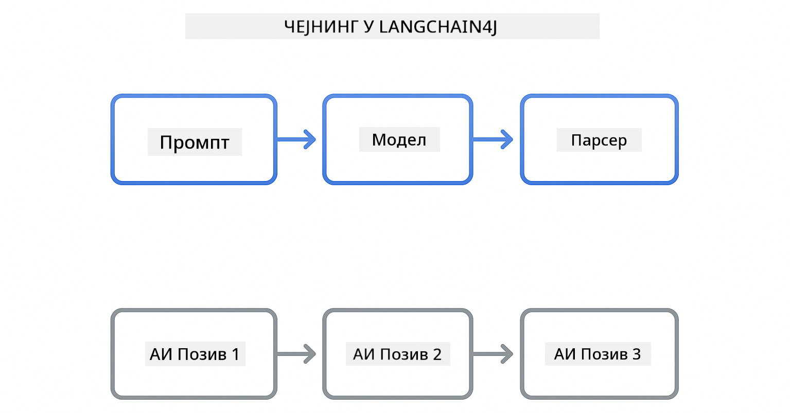

<!--
CO_OP_TRANSLATOR_METADATA:
{
  "original_hash": "377b3e3e6f8d02965bf0fbbc9ccb45c5",
  "translation_date": "2025-12-13T15:19:28+00:00",
  "source_file": "00-quick-start/README.md",
  "language_code": "sr"
}
-->
# Модул 00: Брзи почетак

## Садржај

- [Увод](../../../00-quick-start)
- [Шта је LangChain4j?](../../../00-quick-start)
- [Зависности LangChain4j](../../../00-quick-start)
- [Предуслови](../../../00-quick-start)
- [Подешавање](../../../00-quick-start)
  - [1. Узмите свој GitHub токен](../../../00-quick-start)
  - [2. Поставите свој токен](../../../00-quick-start)
- [Покрените примере](../../../00-quick-start)
  - [1. Основни ћаскање](../../../00-quick-start)
  - [2. Обрасци упита](../../../00-quick-start)
  - [3. Позивање функција](../../../00-quick-start)
  - [4. Питања и одговори о документу (RAG)](../../../00-quick-start)
- [Шта сваки пример показује](../../../00-quick-start)
- [Следећи кораци](../../../00-quick-start)
- [Решавање проблема](../../../00-quick-start)

## Увод

Овај брзи почетак је намењен да вас што брже упозна са LangChain4j. Обухвата апсолутне основе изградње AI апликација са LangChain4j и GitHub моделима. У наредним модулима користићете Azure OpenAI са LangChain4j за изградњу напреднијих апликација.

## Шта је LangChain4j?

LangChain4j је Java библиотека која поједностављује изградњу апликација покретаних вештачком интелигенцијом. Уместо да радите са HTTP клијентима и парсирањем JSON-а, радите са чистим Java API-јима.

„Ланац“ у LangChain се односи на повезивање више компоненти - можете повезати упит са моделом, па са парсером, или повезати више AI позива где излаз једног иде као улаз следећем. Овај брзи почетак се фокусира на основе пре него што истражите сложеније ланце.



*Повезивање компоненти у LangChain4j - грађевни блокови се повезују да би створили моћне AI токове рада*

Користићемо три основне компоненте:

**ChatLanguageModel** - Интерфејс за интеракцију са AI моделом. Позовите `model.chat("prompt")` и добијете одговор као стринг. Користимо `OpenAiOfficialChatModel` који ради са OpenAI-компатибилним крајњим тачкама као што су GitHub модели.

**AiServices** - Креира типски безбедне AI сервисне интерфејсе. Дефинишете методе, означите их са `@Tool`, а LangChain4j се брине о оркестрацији. AI аутоматски позива ваше Java методе кад је потребно.

**MessageWindowChatMemory** - Одржава историју разговора. Без овога, сваки захтев је независан. Са овим, AI памти претходне поруке и одржава контекст кроз више корака.


*LangChain4j архитектура - основне компоненте које заједно покрећу ваше AI апликације*

## Зависности LangChain4j

Овај брзи почетак користи две Maven зависности у [`pom.xml`](../../../00-quick-start/pom.xml):

```xml
<!-- Core LangChain4j library -->
<dependency>
    <groupId>dev.langchain4j</groupId>
    <artifactId>langchain4j</artifactId> <!-- Inherited from BOM in root pom.xml -->
</dependency>

<!-- OpenAI integration (works with GitHub Models) -->
<dependency>
    <groupId>dev.langchain4j</groupId>
    <artifactId>langchain4j-open-ai-official</artifactId> <!-- Inherited from BOM in root pom.xml -->
</dependency>
```

Модул `langchain4j-open-ai-official` пружа класу `OpenAiOfficialChatModel` која се повезује са OpenAI-компатибилним API-јима. GitHub модели користе исти формат API-ја, тако да није потребан посебан адаптер - само усмерите базни URL на `https://models.github.ai/inference`.

## Предуслови

**Користите ли Dev Container?** Java и Maven су већ инсталирани. Потребан вам је само GitHub Personal Access Token.

**Локални развој:**
- Java 21+, Maven 3.9+
- GitHub Personal Access Token (упутства доле)

> **Напомена:** Овај модул користи `gpt-4.1-nano` из GitHub модела. Немојте мењати име модела у коду - конфигурисано је да ради са доступним GitHub моделима.

## Подешавање

### 1. Узмите свој GitHub токен

1. Идите на [GitHub Settings → Personal Access Tokens](https://github.com/settings/personal-access-tokens)
2. Кликните на „Generate new token“
3. Поставите описно име (нпр. „LangChain4j Demo“)
4. Поставите истек (препоручено 7 дана)
5. Под „Account permissions“ пронађите „Models“ и подесите на „Read-only“
6. Кликните „Generate token“
7. Копирајте и сачувајте свој токен - нећете га поново видети

### 2. Поставите свој токен

**Опција 1: Коришћење VS Code (препоручено)**

Ако користите VS Code, додајте свој токен у `.env` фајл у корену пројекта:

Ако `.env` фајл не постоји, копирајте `.env.example` у `.env` или направите нови `.env` фајл у корену пројекта.

**Пример `.env` фајла:**
```bash
# У /workspaces/LangChain4j-for-Beginners/.env
GITHUB_TOKEN=your_token_here
```

Затим можете једноставно десним кликом на било који демонстрациони фајл (нпр. `BasicChatDemo.java`) у Explorer-у изабрати **„Run Java“** или користити конфигурације за покретање из Run and Debug панела.

**Опција 2: Коришћење терминала**

Поставите токен као променљиву окружења:

**Bash:**
```bash
export GITHUB_TOKEN=your_token_here
```

**PowerShell:**
```powershell
$env:GITHUB_TOKEN=your_token_here
```

## Покрените примере

**Коришћење VS Code:** Једноставно десним кликом на било који демонстрациони фајл у Explorer-у изаберите **„Run Java“**, или користите конфигурације за покретање из Run and Debug панела (пре тога се уверите да сте додали свој токен у `.env` фајл).

**Коришћење Maven-а:** Алтернативно, можете покренути из командне линије:

### 1. Основни ћаскање

**Bash:**
```bash
mvn compile exec:java -Dexec.mainClass=com.example.langchain4j.quickstart.BasicChatDemo
```

**PowerShell:**
```powershell
mvn --% compile exec:java -Dexec.mainClass=com.example.langchain4j.quickstart.BasicChatDemo
```

### 2. Обрасци упита

**Bash:**
```bash
mvn compile exec:java -Dexec.mainClass=com.example.langchain4j.quickstart.PromptEngineeringDemo
```

**PowerShell:**
```powershell
mvn --% compile exec:java -Dexec.mainClass=com.example.langchain4j.quickstart.PromptEngineeringDemo
```

Показује zero-shot, few-shot, chain-of-thought и role-based упите.

### 3. Позивање функција

**Bash:**
```bash
mvn compile exec:java -Dexec.mainClass=com.example.langchain4j.quickstart.ToolIntegrationDemo
```

**PowerShell:**
```powershell
mvn --% compile exec:java -Dexec.mainClass=com.example.langchain4j.quickstart.ToolIntegrationDemo
```

AI аутоматски позива ваше Java методе кад је потребно.

### 4. Питања и одговори о документу (RAG)

**Bash:**
```bash
mvn compile exec:java -Dexec.mainClass=com.example.langchain4j.quickstart.SimpleReaderDemo
```

**PowerShell:**
```powershell
mvn --% compile exec:java -Dexec.mainClass=com.example.langchain4j.quickstart.SimpleReaderDemo
```

Постављајте питања о садржају у `document.txt`.

## Шта сваки пример показује

**Основни ћаскање** - [BasicChatDemo.java](../../../00-quick-start/src/main/java/com/example/langchain4j/quickstart/BasicChatDemo.java)

Почните овде да видите LangChain4j у најједноставнијем облику. Креираћете `OpenAiOfficialChatModel`, послати упит са `.chat()`, и добити одговор. Ово показује основе: како иницијализовати моделе са прилагођеним крајњим тачкама и API кључевима. Када разумете овај образац, све остало се надограђује на њему.

```java
ChatLanguageModel model = OpenAiOfficialChatModel.builder()
    .baseUrl("https://models.github.ai/inference")
    .apiKey(System.getenv("GITHUB_TOKEN"))
    .modelName("gpt-4.1-nano")
    .build();

String response = model.chat("What is LangChain4j?");
System.out.println(response);
```

> **🤖 Испробајте са [GitHub Copilot](https://github.com/features/copilot) Chat:** Отворите [`BasicChatDemo.java`](../../../00-quick-start/src/main/java/com/example/langchain4j/quickstart/BasicChatDemo.java) и питајте:
> - „Како да пребацим са GitHub модела на Azure OpenAI у овом коду?“
> - „Које друге параметре могу да конфигуришем у OpenAiOfficialChatModel.builder()?“
> - „Како да додам стриминг одговоре уместо да чекам комплетан одговор?“

**Инжењеринг упита** - [PromptEngineeringDemo.java](../../../00-quick-start/src/main/java/com/example/langchain4j/quickstart/PromptEngineeringDemo.java)

Сада када знате како да комуницирате са моделом, истражимо шта му говорите. Овај демо користи исту конфигурацију модела али показује четири различита обрасца упита. Испробајте zero-shot упите за директна упутства, few-shot упите који уче из примера, chain-of-thought упите који откривају кораке размишљања, и role-based упите који постављају контекст. Видећете како исти модел даје драстично различите резултате у зависности од начина на који формулишете захтев.

```java
PromptTemplate template = PromptTemplate.from(
    "What's the best time to visit {{destination}} for {{activity}}?"
);

Prompt prompt = template.apply(Map.of(
    "destination", "Paris",
    "activity", "sightseeing"
));

String response = model.chat(prompt.text());
```

> **🤖 Испробајте са [GitHub Copilot](https://github.com/features/copilot) Chat:** Отворите [`PromptEngineeringDemo.java`](../../../00-quick-start/src/main/java/com/example/langchain4j/quickstart/PromptEngineeringDemo.java) и питајте:
> - „Која је разлика између zero-shot и few-shot упита и када треба користити који?“
> - „Како параметар temperature утиче на одговоре модела?“
> - „Које су технике за спречавање напада инјекције упита у продукцији?“
> - „Како да направим поновно употребљиве PromptTemplate објекте за уобичајене обрасце?“

**Интеграција алата** - [ToolIntegrationDemo.java](../../../00-quick-start/src/main/java/com/example/langchain4j/quickstart/ToolIntegrationDemo.java)

Овде LangChain4j постаје моћан. Користићете `AiServices` да креирате AI асистента који може позивати ваше Java методе. Само означите методе са `@Tool("опис")` и LangChain4j се брине о осталом - AI аутоматски одлучује када да користи који алат на основу онога што корисник тражи. Ово показује позивање функција, кључну технику за изградњу AI који може да предузима акције, а не само да одговара на питања.

```java
@Tool("Performs addition of two numeric values")
public double add(double a, double b) {
    return a + b;
}

MathAssistant assistant = AiServices.create(MathAssistant.class, model);
String response = assistant.chat("What is 25 plus 17?");
```

> **🤖 Испробајте са [GitHub Copilot](https://github.com/features/copilot) Chat:** Отворите [`ToolIntegrationDemo.java`](../../../00-quick-start/src/main/java/com/example/langchain4j/quickstart/ToolIntegrationDemo.java) и питајте:
> - „Како ради @Tool анотација и шта LangChain4j ради са њом иза сцене?“
> - „Може ли AI позивати више алата у низу да реши сложене проблеме?“
> - „Шта се дешава ако алат баци изузетак - како да руковам грешкама?“
> - „Како бих интегрисао прави API уместо овог примера калкулатора?“

**Питања и одговори о документу (RAG)** - [SimpleReaderDemo.java](../../../00-quick-start/src/main/java/com/example/langchain4j/quickstart/SimpleReaderDemo.java)

Овде ћете видети основе RAG (retrieval-augmented generation). Уместо да се ослањате на податке за обуку модела, учитавате садржај из [`document.txt`](../../../00-quick-start/document.txt) и укључујете га у упит. AI одговара на основу вашег документа, а не општих знања. Ово је први корак ка изградњи система који могу радити са вашим властитим подацима.

```java
Document document = FileSystemDocumentLoader.loadDocument("document.txt");
String content = document.text();

String prompt = "Based on this document: " + content + 
                "\nQuestion: What is the main topic?";
String response = model.chat(prompt);
```

> **Напомена:** Овај једноставан приступ учитава цео документ у упит. За велике фајлове (>10KB), прелазите лимите контекста. Модул 03 покрива делење и претрагу вектора за продукцијске RAG системе.

> **🤖 Испробајте са [GitHub Copilot](https://github.com/features/copilot) Chat:** Отворите [`SimpleReaderDemo.java`](../../../00-quick-start/src/main/java/com/example/langchain4j/quickstart/SimpleReaderDemo.java) и питајте:
> - „Како RAG спречава AI халуцинације у поређењу са коришћењем података за обуку модела?“
> - „Која је разлика између овог једноставног приступа и коришћења векторских угнежђења за претрагу?“
> - „Како бих скалирао ово за рад са више докумената или већим базама знања?“
> - „Које су најбоље праксе за структуирање упита да би AI користио само обезбеђени контекст?“

## Решавање проблема

Примери укључују `.logRequests(true)` и `.logResponses(true)` да би приказали API позиве у конзоли. Ово помаже у решавању проблема са аутентификацијом, ограничењима брзине или неочекиваним одговорима. Уклоните ове заставице у продукцији да бисте смањили буку у логовима.

## Следећи кораци

**Следећи модул:** [01-introduction - Почетак рада са LangChain4j и gpt-5 на Azure](../01-introduction/README.md)

---

**Навигација:** [← Назад на Главну](../README.md) | [Следећи: Модул 01 - Увод →](../01-introduction/README.md)

---

## Решавање проблема

### Прво Maven компајлирање

**Проблем:** Почетни `mvn clean compile` или `mvn package` траје дуго (10-15 минута)

**Узрок:** Maven мора да преузме све зависности пројекта (Spring Boot, LangChain4j библиотеке, Azure SDK-ове итд.) при првом компајлирању.

**Решење:** Ово је нормално понашање. Накнадна компајлирања ће бити много бржа јер се зависности кеширају локално. Време преузимања зависи од брзине ваше мреже.

### Синтакса PowerShell Maven команде

**Проблем:** Maven команде не успевају са грешком `Unknown lifecycle phase ".mainClass=..."`

**Узрок:** PowerShell тумачи `=` као оператор доделе променљиве, што кваре синтаксу Maven својстава

**Решење:** Користите оператор за заустављање парсирања `--%` пре Maven команде:

**PowerShell:**
```powershell
mvn --% compile exec:java -Dexec.mainClass=com.example.langchain4j.quickstart.BasicChatDemo
```

**Bash:**
```bash
mvn compile exec:java -Dexec.mainClass=com.example.langchain4j.quickstart.BasicChatDemo
```

Оператор `--%` говори PowerShell-у да све преостале аргументе проследи Maven-у буквално, без тумачења.

### Приказ емоџија у Windows PowerShell

**Проблем:** AI одговори приказују непознате знакове (нпр. `????` или `â??`) уместо емоџија у PowerShell-у

**Узрок:** Подразумевано кодирање PowerShell-а не подржава UTF-8 емоџије

**Решење:** Покрените ову команду пре извршавања Java апликација:
```cmd
chcp 65001
```

Ово приморава UTF-8 кодирање у терминалу. Алтернативно, користите Windows Terminal који има бољу подршку за Unicode.

---

<!-- CO-OP TRANSLATOR DISCLAIMER START -->
**Одрицање од одговорности**:
Овај документ је преведен коришћењем AI услуге за превођење [Co-op Translator](https://github.com/Azure/co-op-translator). Иако се трудимо да превод буде тачан, молимо вас да имате у виду да аутоматски преводи могу садржати грешке или нетачности. Оригинални документ на његовом изворном језику треба сматрати ауторитетним извором. За критичне информације препоручује се професионални људски превод. Нисмо одговорни за било каква неспоразума или погрешна тумачења која произилазе из коришћења овог превода.
<!-- CO-OP TRANSLATOR DISCLAIMER END -->