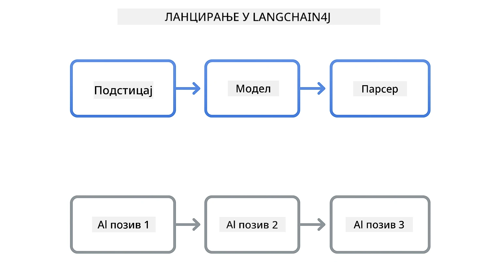

# Модул 00: Брзи почетак

## Садржај

- [Увод](../../../00-quick-start)
- [Шта је LangChain4j?](../../../00-quick-start)
- [Зависности LangChain4j](../../../00-quick-start)
- [Предуслови](../../../00-quick-start)
- [Подешавање](../../../00-quick-start)
  - [1. Набавите свој GitHub токен](../../../00-quick-start)
  - [2. Подесите свој токен](../../../00-quick-start)
- [Покрените примере](../../../00-quick-start)
  - [1. Основни чет](../../../00-quick-start)
  - [2. Обрасци упита](../../../00-quick-start)
  - [3. Позив функција](../../../00-quick-start)
  - [4. Питања и одговори о документима (RAG)](../../../00-quick-start)
  - [5. Одговорна вештачка интелигенција](../../../00-quick-start)
- [Шта сваки пример показује](../../../00-quick-start)
- [Следећи кораци](../../../00-quick-start)
- [Решавање проблема](../../../00-quick-start)

## Увод

Овај брзи почетак је намењен да вас што пре укључи у рад са LangChain4j. Обухвата основне теме о изради AI апликација уз помоћ LangChain4j и GitHub модела. У наредним модулима користићете Azure OpenAI са LangChain4j да бисте израдили напредније апликације.

## Шта је LangChain4j?

LangChain4j је Java библиотека која поједностављује изградњу апликација са подршком вештачке интелигенције. Уместо да користите HTTP клијенте и парсирање JSON-а, радите са јасним Java API-јима.

Реч „chain“ у LangChain означава повезивање више компоненти у низ – на пример, повезивање упита с моделом, па са парсером, или повезивање више AI позива тако да излаз једног улази као улаз у следећи. Овај брзи почетак је усредсређен на основе пре него што се истраже сложени ланци.



*Повезивање компоненти у LangChain4j - грађевни блокови који се спајају у моћне AI токове рада*

Користићемо три основне компоненте:

**ChatLanguageModel** - Интерфејс за интеракцију са AI моделом. Позовите `model.chat("prompt")` и добијате одговор у облику стринга. Користимо `OpenAiOfficialChatModel` који ради са OpenAI-компатибилним крајњим тачкама као што су GitHub модели.

**AiServices** - Креира типски безбедне AI сервисне интерфејсе. Дефинишете методе, означите их анотацијом `@Tool`, а LangChain4j се брине о оркестрацији. AI аутоматски позива ваше Java методе када је потребно.

**MessageWindowChatMemory** - Одржава историју разговора. Без ње, сваки захтев је независан. Са њом, AI памти претходне поруке и одржава контекст кроз више кругова.


*LangChain4j архитектура - основне компоненте које заједно напајају ваше AI апликације*

## Зависности LangChain4j

Овај брзи почетак користи две Maven зависности у [`pom.xml`](../../../00-quick-start/pom.xml):

```xml
<!-- Core LangChain4j library -->
<dependency>
    <groupId>dev.langchain4j</groupId>
    <artifactId>langchain4j</artifactId> <!-- Inherited from BOM in root pom.xml -->
</dependency>

<!-- OpenAI integration (works with GitHub Models) -->
<dependency>
    <groupId>dev.langchain4j</groupId>
    <artifactId>langchain4j-open-ai-official</artifactId> <!-- Inherited from BOM in root pom.xml -->
</dependency>
```

Модул `langchain4j-open-ai-official` обезбеђује класу `OpenAiOfficialChatModel` која се повезује на OpenAI-компатибилне API-је. GitHub модели користе исти формат API-ја, тако да није потребан посебан адаптер – само усмерите базни URL на `https://models.github.ai/inference`.

## Предуслови

**Користите ли Dev Container?** Java и Maven су већ инсталирани. Потребан вам је само GitHub Personal Access Token.

**Локални развој:**
- Java 21+, Maven 3.9+
- GitHub Personal Access Token (упутства доле)

> **Напомена:** Овај модул користи `gpt-4.1-nano` из GitHub модела. Не мењајте име модела у коду – подешен је да ради са на располагању моделима GitHub-а.

## Подешавање

### 1. Набавите свој GitHub токен

1. Идите на [GitHub Settings → Personal Access Tokens](https://github.com/settings/personal-access-tokens)
2. Кликните на "Generate new token"
3. Подесите описно име (нпр. "LangChain4j Demo")
4. Подесите истек (препоручује се 7 дана)
5. Под "Account permissions" пронађите "Models" и подесите на "Read-only"
6. Кликните "Generate token"
7. Копирајте и сачувајте токен – нећете га поново видети

### 2. Подесите свој токен

**Опција 1: Користећи VS Code (препоручено)**

Ако користите VS Code, додајте свој токен у `.env` фајл у корену пројекта:

Ако `.env` фајл не постоји, копирајте `.env.example` у `.env` или направите нови `.env` у корену пројекта.

**Пример `.env` фајла:**
```bash
# У /workspaces/LangChain4j-for-Beginners/.env
GITHUB_TOKEN=your_token_here
```

Затим једноставно кликните десним тастером на било који demo фајл (нпр. `BasicChatDemo.java`) у Explorer-у и изаберите **"Run Java"** или користите launch конфигурације из Run and Debug панела.

**Опција 2: Користећи терминал**

Подесите токен као променљиву окружења:

**Bash:**
```bash
export GITHUB_TOKEN=your_token_here
```

**PowerShell:**
```powershell
$env:GITHUB_TOKEN=your_token_here
```

## Покрените примере

**Користећи VS Code:** Једноставно кликните десним тастером на било који demo фајл у Explorer-у и изаберите **"Run Java"**, или користите launch конфигурације из Run and Debug панела (пре тога обавезно додајте токен у `.env` фајл).

**Користећи Maven:** Алтернативно, можете покренути из командне линије:

### 1. Основни чет

**Bash:**
```bash
mvn compile exec:java -Dexec.mainClass=com.example.langchain4j.quickstart.BasicChatDemo
```

**PowerShell:**
```powershell
mvn --% compile exec:java -Dexec.mainClass=com.example.langchain4j.quickstart.BasicChatDemo
```

### 2. Обрасци упита

**Bash:**
```bash
mvn compile exec:java -Dexec.mainClass=com.example.langchain4j.quickstart.PromptEngineeringDemo
```

**PowerShell:**
```powershell
mvn --% compile exec:java -Dexec.mainClass=com.example.langchain4j.quickstart.PromptEngineeringDemo
```

Показује zero-shot, few-shot, chain-of-thought и role-based prompting.

### 3. Позив функција

**Bash:**
```bash
mvn compile exec:java -Dexec.mainClass=com.example.langchain4j.quickstart.ToolIntegrationDemo
```

**PowerShell:**
```powershell
mvn --% compile exec:java -Dexec.mainClass=com.example.langchain4j.quickstart.ToolIntegrationDemo
```

AI аутоматски позива ваше Java методе када је потребно.

### 4. Питања и одговори о документима (RAG)

**Bash:**
```bash
mvn compile exec:java -Dexec.mainClass=com.example.langchain4j.quickstart.SimpleReaderDemo
```

**PowerShell:**
```powershell
mvn --% compile exec:java -Dexec.mainClass=com.example.langchain4j.quickstart.SimpleReaderDemo
```

Постављајте питања о садржају из `document.txt`.

### 5. Одговорна вештачка интелигенција

**Bash:**
```bash
mvn compile exec:java -Dexec.mainClass=com.example.langchain4j.quickstart.ResponsibleAIDemo
```

**PowerShell:**
```powershell
mvn --% compile exec:java -Dexec.mainClass=com.example.langchain4j.quickstart.ResponsibleAIDemo
```

Погледајте како AI филтери безбедности блокирају штетан садржај.

## Шта сваки пример показује

**Основни чет** - [BasicChatDemo.java](../../../00-quick-start/src/main/java/com/example/langchain4j/quickstart/BasicChatDemo.java)

Почните овде да бисте видели LangChain4j у својој најједноставнијој форми. Направићете `OpenAiOfficialChatModel`, послати упит са `.chat()`, и добити одговор. Ово показује основе: како иницијализовати моделе са прилагођеним крајњим тачкама и API кључевима. Кад разумете овај образац, све остало ће се надовезати.

```java
ChatLanguageModel model = OpenAiOfficialChatModel.builder()
    .baseUrl("https://models.github.ai/inference")
    .apiKey(System.getenv("GITHUB_TOKEN"))
    .modelName("gpt-4.1-nano")
    .build();

String response = model.chat("What is LangChain4j?");
System.out.println(response);
```

> **🤖 Испробајте са [GitHub Copilot](https://github.com/features/copilot) Четом:** Отворите [`BasicChatDemo.java`](../../../00-quick-start/src/main/java/com/example/langchain4j/quickstart/BasicChatDemo.java) и питајте:
> - "Како да пребацим са GitHub модела на Azure OpenAI у овом коду?"
> - "Које друге параметре могу конфигурисати у OpenAiOfficialChatModel.builder()?"
> - "Како да додам стриминг одговоре уместо да чекам комплетан одговор?"

**Prompt инженеринг** - [PromptEngineeringDemo.java](../../../00-quick-start/src/main/java/com/example/langchain4j/quickstart/PromptEngineeringDemo.java)

Сада када знате како да комуницирате са моделом, погледајмо шта му тачно говорите. Овај demo користи исти модел али показује четири различита обрасца подстицаја. Испробајте zero-shot упите за директне инструкције, few-shot упите који уче на примерима, chain-of-thought упите који откривају кораке размишљања, и role-based упите који постављају контекст. Видећете како исти модел даје драстично различите резултате у зависности од тога како дефинишете захтев.

```java
PromptTemplate template = PromptTemplate.from(
    "What's the best time to visit {{destination}} for {{activity}}?"
);

Prompt prompt = template.apply(Map.of(
    "destination", "Paris",
    "activity", "sightseeing"
));

String response = model.chat(prompt.text());
```

> **🤖 Испробајте са [GitHub Copilot](https://github.com/features/copilot) Четом:** Отворите [`PromptEngineeringDemo.java`](../../../00-quick-start/src/main/java/com/example/langchain4j/quickstart/PromptEngineeringDemo.java) и питајте:
> - "Која је разлика између zero-shot и few-shot подстицаја, и када треба користити који?"
> - "Како параметар temperature утиче на одговоре модела?"
> - "Које технике постоје за спречавање prompt injection напада у продукцији?"
> - "Како да направим поновно употребљиви PromptTemplate за уобичајене обрасце?"

**Интеграција алата** - [ToolIntegrationDemo.java](../../../00-quick-start/src/main/java/com/example/langchain4j/quickstart/ToolIntegrationDemo.java)

Овде LangChain4j показује своју снагу. Користићете `AiServices` да направите AI помоћника који може да позива ваше Java методе. Само означите методе анотацијом `@Tool("description")` и LangChain4j ће организовати цео рад – AI аутоматски одлучује када да користи који алат на основу захтева корисника. Ово показује функцију позива, кључну технику за изградњу AI-а који може да предузима акције, а не само да одговара.

```java
@Tool("Performs addition of two numeric values")
public double add(double a, double b) {
    return a + b;
}

MathAssistant assistant = AiServices.create(MathAssistant.class, model);
String response = assistant.chat("What is 25 plus 17?");
```

> **🤖 Испробајте са [GitHub Copilot](https://github.com/features/copilot) Четом:** Отворите [`ToolIntegrationDemo.java`](../../../00-quick-start/src/main/java/com/example/langchain4j/quickstart/ToolIntegrationDemo.java) и питајте:
> - "Како ради @Tool анотација и шта LangChain4j ради са њом иза сцене?"
> - "Може ли AI да позове више алата заредом да реши сложене проблеме?"
> - "Шта се дешава ако алат баци изузетак – како да руковам грешкама?"
> - "Како бих интегрисао стварни API уместо овог примера калкулатора?"

**Питања и одговори о документима (RAG)** - [SimpleReaderDemo.java](../../../00-quick-start/src/main/java/com/example/langchain4j/quickstart/SimpleReaderDemo.java)

Овде ћете видети основе RAG (retrieval-augmented generation). Уместо да се ослањате на податке модела, учитавате садржај из [`document.txt`](../../../00-quick-start/document.txt) и укључујете га у упит. AI одговара на основу вашег документа, а не општих знања. Ово је први корак ка системима који раде са вашим властим подацима.

```java
Document document = FileSystemDocumentLoader.loadDocument("document.txt");
String content = document.text();

String prompt = "Based on this document: " + content + 
                "\nQuestion: What is the main topic?";
String response = model.chat(prompt);
```

> **Напомена:** Овај једноставан приступ учитава цео документ у упит. За велике фајлове (>10KB) прећи ћете лимите контекста. Модул 03 покрива сегментацију и претраживање вектора за продукционе RAG системе.

> **🤖 Испробајте са [GitHub Copilot](https://github.com/features/copilot) Четом:** Отворите [`SimpleReaderDemo.java`](../../../00-quick-start/src/main/java/com/example/langchain4j/quickstart/SimpleReaderDemo.java) и питајте:
> - "Како RAG спречава AI халуцинације у поређењу са коришћењем података из модела?"
> - "Која је разлика између овог једноставног приступа и коришћења векторских угнежђења за претрагу?"
> - "Како бих скалирао ово за рад са више докумената или већим базама знања?"
> - "Које су добре праксе за структуре питања како би AI користио само обезбеђени контекст?"

**Одговорна AI** - [ResponsibleAIDemo.java](../../../00-quick-start/src/main/java/com/example/langchain4j/quickstart/ResponsibleAIDemo.java)

Градите безбедност AI-а са одбраном у дубини. Овај demo показује два слоја заштите који раде заједно:

**Део 1: LangChain4j Input Guardrails** - Блокирају опасне упите пре него што дођу до LLM-а. Креирајте прилагођене заштитне граничнике који проверавају забрањене кључне речи или обрасце. Они раде у вашем коду, тако да су брзи и бесплатни.

```java
class DangerousContentGuardrail implements InputGuardrail {
    @Override
    public InputGuardrailResult validate(UserMessage userMessage) {
        String text = userMessage.singleText().toLowerCase();
        if (text.contains("explosives")) {
            return fatal("Blocked: contains prohibited keyword");
        }
        return success();
    }
}
```

**Део 2: Филтери безбедности провајдера** - GitHub модели имају уграђене филтере који хватају оно што ваши граничници могу да пропусте. Видећете чврсте блокаде (HTTP 400 грешке) за озбиљна кршења и нежне одбијане случајеве где AI љубазно одбија да одговори.

> **🤖 Испробајте са [GitHub Copilot](https://github.com/features/copilot) Четом:** Отворите [`ResponsibleAIDemo.java`](../../../00-quick-start/src/main/java/com/example/langchain4j/quickstart/ResponsibleAIDemo.java) и питајте:
> - "Шта је InputGuardrail и како направити свој?"
> - "Која је разлика између чврсте блокаде и нежног одбијања?"
> - "Зашто се користе и граничници и филтери провајдера заједно?"

## Следећи кораци

**Следећи модул:** [01-introduction - Започињање рада са LangChain4j и gpt-5 на Azure](../01-introduction/README.md)

---

**Навигација:** [← Повратак на почетну](../README.md) | [Следећи: Модул 01 - Увод →](../01-introduction/README.md)

---

## Решавање проблема

### Први Maven build

**Проблем:** Почетна команда `mvn clean compile` или `mvn package` траје дуго (10-15 минута)

**Узрок:** Maven мора да преузме све зависности пројекта (Spring Boot, LangChain4j библиотеке, Azure SDK-ове итд.) при првом build-у.

**Решење:** Ово је нормално. Следећи build-ови ће бити много бржи јер ће зависности бити кеширане локално. Време преузимања зависи од брзине ваше мреже.

### PowerShell Maven команда – синтаксна грешка

**Проблем:** Maven команде не успевају са грешком `Unknown lifecycle phase ".mainClass=..."`

**Узрок:** PowerShell тумачи `=` као оператер за постављање променљиве, што ремети Maven синтаксу својстава.
**Решење**: Користите оператор за заустављање парсирања `--%` пре Maven команде:

**PowerShell:**
```powershell
mvn --% compile exec:java -Dexec.mainClass=com.example.langchain4j.quickstart.BasicChatDemo
```

**Bash:**
```bash
mvn compile exec:java -Dexec.mainClass=com.example.langchain4j.quickstart.BasicChatDemo
```

Оператор `--%` говори PowerShell-у да све преостале аргументе проследи Maven-у буквално, без тумачења.

### Приказ емотикона у Windows PowerShell-у

**Проблем**: AI одговори приказују насумичне символе (нпр. `????` или `â??`) уместо емотикона у PowerShell-у

**Узрок**: Подразумевано кодирање PowerShell-а не подржава UTF-8 емотиконе

**Решење**: Покрените ову команду пре извршавања Java апликација:
```cmd
chcp 65001
```

Овим се у терминалу принудно користи UTF-8 кодирање. Алтернативно, користите Windows Terminal који боље подржава Unicode.

### Дебаговање API позива

**Проблем**: Грешке аутентификације, ограничења броја позива или неочекивани одговори од AI модела

**Решење**: Примери укључују `.logRequests(true)` и `.logResponses(true)` како би се API позиви приказивали у конзоли. Ово помаже у откривању грешака аутентификације, ограничења или неочекиваних одговора. Уклonite ове параметре у продукцији да бисте смањили буку у логовима.

---

<!-- CO-OP TRANSLATOR DISCLAIMER START -->
**Изјава о одрицању одговорности**:  
Овај документ је преведен помоћу AI услуге за превођење [Co-op Translator](https://github.com/Azure/co-op-translator). Иако тежимо прецизности, имајте на уму да аутоматски преводи могу садржати грешке или нетачности. Изворни документ на његовом оригиналном језику треба сматрати ауторитетним извором. За критичне информације препоручује се професионални људски превод. Нисмо одговорни за било каква неразумевања или погрешна тумачења настала употребом овог превода.
<!-- CO-OP TRANSLATOR DISCLAIMER END -->