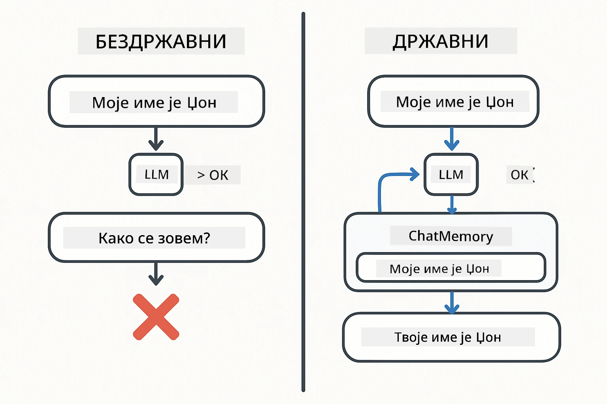
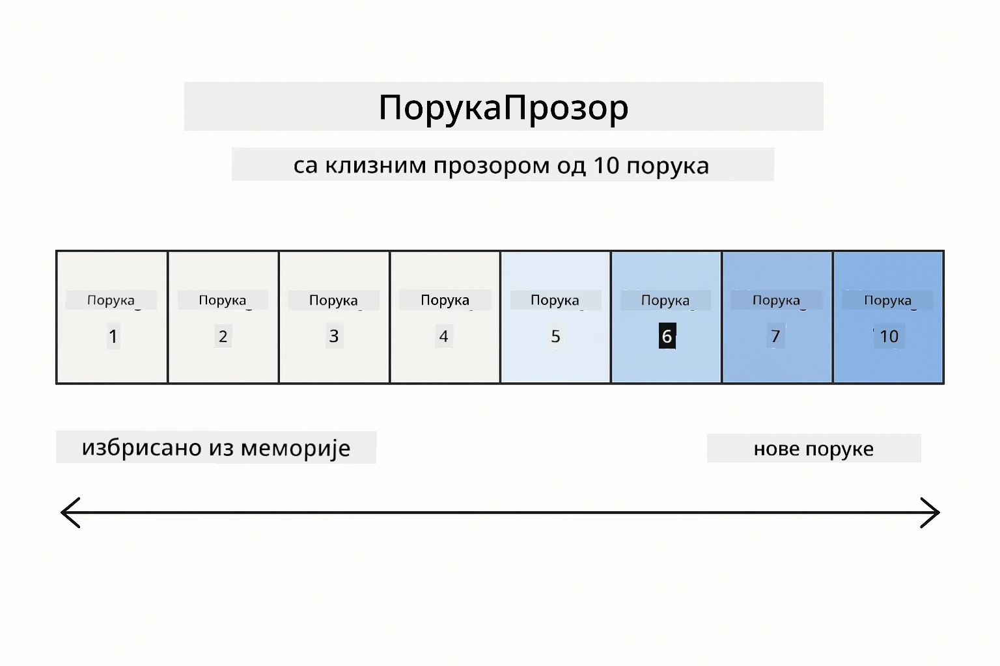
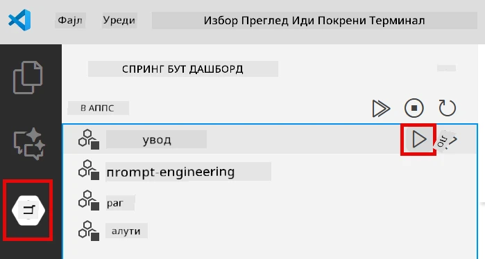
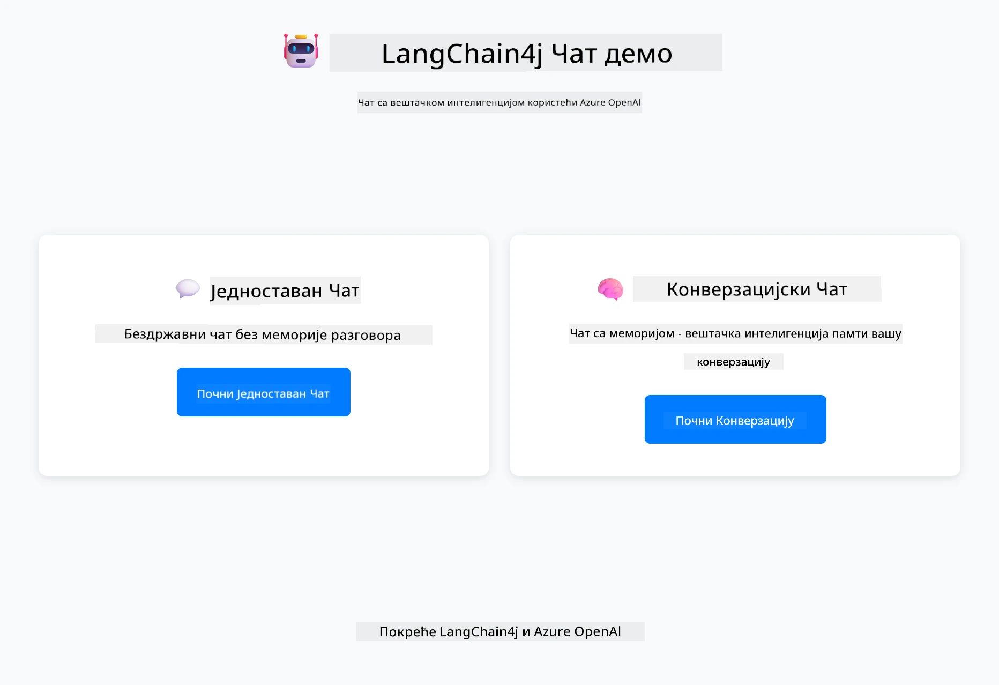
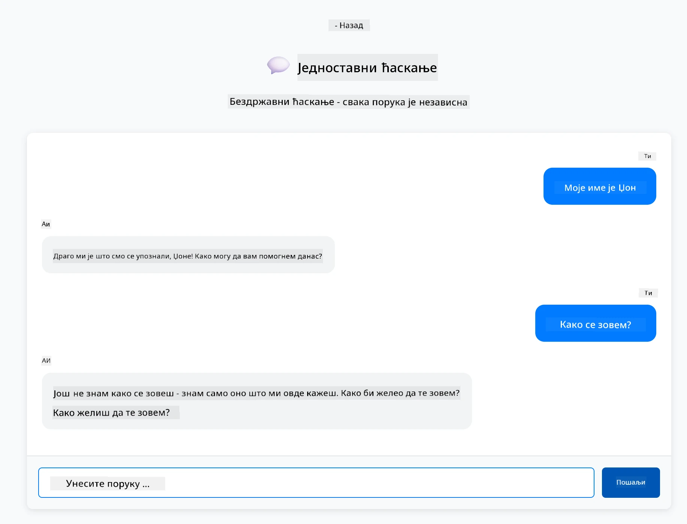
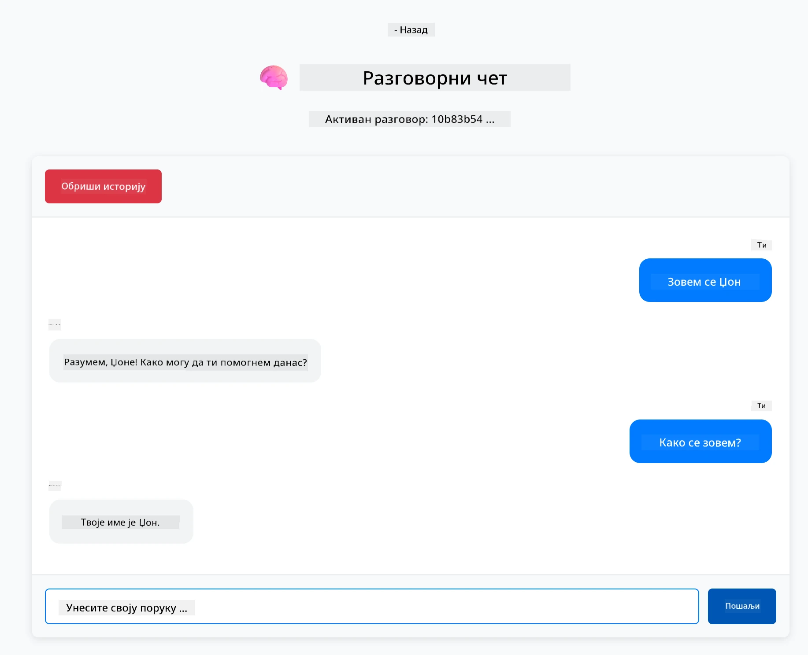

# Модул 01: Почетак рада са LangChain4j

## Садржај

- [Шта ћете научити](../../../01-introduction)
- [Претпоставке](../../../01-introduction)
- [Разумевање основног проблема](../../../01-introduction)
- [Разумевање токена](../../../01-introduction)
- [Како меморија функционише](../../../01-introduction)
- [Како ово користи LangChain4j](../../../01-introduction)
- [Деплој Azure OpenAI инфраструктуре](../../../01-introduction)
- [Покретање апликације локално](../../../01-introduction)
- [Коришћење апликације](../../../01-introduction)
  - [Бесдржавни ћаскање (леви панел)](../../../01-introduction)
  - [Државни ћаскање (десни панел)](../../../01-introduction)
- [Следећи кораци](../../../01-introduction)

## Шта ћете научити

Ако сте завршили брзи почетак, видели сте како да шаљете упите и добијате одговоре. То је основа, али праве апликације захтевају више. Овај модул вас учи како да направите конверзациони AI који памти контекст и одржава стање - разлика између једнократне демонстрације и апликације спремне за производњу.

Користићемо Azure OpenAI GPT-5 током овог водича јер његове напредне способности резоновања чине понашање различитих образаца јаснијим. Када додате меморију, јасно ћете видети разлику. Ово олакшава разумевање шта сваки део доноси вашој апликацији.

Направићете једну апликацију која демонстрира оба образца:

**Бесдржавни ћаскање** - Сваки захтев је независан. Модел нема меморију претходних порука. Ово је образац који сте користили у брзом почетку.

**Државни разговор** - Сваки захтев укључује историју разговора. Модел одржава контекст кроз више корака. Ово је оно што производне апликације захтевају.

## Претпоставке

- Azure претплата са приступом Azure OpenAI
- Java 21, Maven 3.9+
- Azure CLI (https://learn.microsoft.com/en-us/cli/azure/install-azure-cli)
- Azure Developer CLI (azd) (https://learn.microsoft.com/en-us/azure/developer/azure-developer-cli/install-azd)

> **Напомена:** Java, Maven, Azure CLI и Azure Developer CLI (azd) су прединсталирани у обезбеђеном девконтейнеру.

> **Напомена:** Овај модул користи GPT-5 на Azure OpenAI. Деплој је аутоматски конфигурисан преко `azd up` - немојте мењати име модела у коду.

## Разумевање основног проблема

Језички модели су бесдржавни. Сваки API позив је независан. Ако пошаљете "Зовем се Џон" и онда питате "Како се зовем?", модел нема појма да сте се управо представили. Сваки захтев третира као да је први разговор који сте икада имали.

Ово је у реду за једноставна питања и одговоре, али бескорисно за праве апликације. Ботови за корисничку подршку морају да памте шта сте им рекли. Лични асистенти захтевају контекст. Сваки разговор са више корака захтева меморију.



*Разлика између бесдржавних (независних позива) и државних (свесних контекста) разговора*

## Разумевање токена

Пре него што зароните у разговоре, важно је разумети токене - основне јединице текста које језички модели обрађују:


*Пример како се текст дели на токене - "Волим AI!" постаје 4 одвојене јединице за обраду*

Токени су начин на који AI модели мере и обрађују текст. Речи, интерпункција, па чак и размаке могу бити токени. Ваш модел има ограничење колико токена може обрадити одједном (400.000 за GPT-5, са до 272.000 улазних и 128.000 излазних токена). Разумевање токена помаже у управљању дужином разговора и трошковима.

## Како меморија функционише

Меморија ћаскања решава проблем бесдржавности одржавањем историје разговора. Пре слања захтева моделу, оквир додаје релевантне претходне поруке. Када питате "Како се зовем?", систем заправо шаље целу историју разговора, омогућавајући моделу да види да сте раније рекли "Зовем се Џон."

LangChain4j пружа имплементације меморије које ово аутоматски обрађују. Ви бирајте колико порука да задржите, а оквир управља контекстним прозором.



*MessageWindowChatMemory одржава клизни прозор недавних порука, аутоматски одбацујући старе*

## Како ово користи LangChain4j

Овај модул проширује брзи почетак интеграцијом Spring Boot-а и додавањем меморије разговора. Ево како делови функционишу заједно:

**Зависности** - Додајте две LangChain4j библиотеке:

```xml
<dependency>
    <groupId>dev.langchain4j</groupId>
    <artifactId>langchain4j</artifactId> <!-- Inherited from BOM in root pom.xml -->
</dependency>
<dependency>
    <groupId>dev.langchain4j</groupId>
    <artifactId>langchain4j-open-ai-official</artifactId> <!-- Inherited from BOM in root pom.xml -->
</dependency>
```

**Chat Model** - Конфигуришите Azure OpenAI као Spring bean ([LangChainConfig.java](../../../01-introduction/src/main/java/com/example/langchain4j/config/LangChainConfig.java)):

```java
@Bean
public OpenAiOfficialChatModel openAiOfficialChatModel() {
    return OpenAiOfficialChatModel.builder()
            .baseUrl(azureEndpoint)
            .apiKey(azureApiKey)
            .modelName(deploymentName)
            .timeout(Duration.ofMinutes(5))
            .maxRetries(3)
            .build();
}
```

Билдер чита акредитиве из променљивих окружења које поставља `azd up`. Постављање `baseUrl` на ваш Azure крајњи тачка омогућава OpenAI клијенту рад са Azure OpenAI.

**Меморија разговора** - Пратите историју ћаскања са MessageWindowChatMemory ([ConversationService.java](../../../01-introduction/src/main/java/com/example/langchain4j/service/ConversationService.java)):

```java
ChatMemory memory = MessageWindowChatMemory.withMaxMessages(10);

memory.add(UserMessage.from("My name is John"));
memory.add(AiMessage.from("Nice to meet you, John!"));

memory.add(UserMessage.from("What's my name?"));
AiMessage aiMessage = chatModel.chat(memory.messages()).aiMessage();
memory.add(aiMessage);
```

Креирајте меморију са `withMaxMessages(10)` да задржите последњих 10 порука. Додајте поруке корисника и AI-а са типизованим омотачима: `UserMessage.from(text)` и `AiMessage.from(text)`. Преузмите историју са `memory.messages()` и пошаљите је моделу. Сервис чува посебне инстанце меморије по ID-у разговора, омогућавајући више корисника да ћаскају истовремено.

> **🤖 Испробајте са [GitHub Copilot](https://github.com/features/copilot) Chat:** Отворите [`ConversationService.java`](../../../01-introduction/src/main/java/com/example/langchain4j/service/ConversationService.java) и питајте:
> - "Како MessageWindowChatMemory одлучује које поруке да одбаци када је прозор пун?"
> - "Могу ли имплементирати прилагођено складиштење меморије користећи базу података уместо меморије у RAM?"
> - "Како бих додао резимирање да сажмем стару историју разговора?"

Бесдржавни крајњи тачка прескаче меморију у потпуности - само `chatModel.chat(prompt)` као у брзом почетку. Државни крајњи тачка додаје поруке у меморију, преузима историју и укључује тај контекст са сваким захтевом. Иста конфигурација модела, различити образци.

## Деплој Azure OpenAI инфраструктуре

**Bash:**
```bash
cd 01-introduction
azd up  # Изаберите претплату и локацију (препоручује се eastus2)
```

**PowerShell:**
```powershell
cd 01-introduction
azd up  # Изаберите претплату и локацију (препоручује се eastus2)
```

> **Напомена:** Ако наиђете на грешку временског ограничења (`RequestConflict: Cannot modify resource ... provisioning state is not terminal`), једноставно покрените `azd up` поново. Azure ресурси можда још увек се припремају у позадини, а поновни покушај омогућава да се деплој заврши када ресурси достигну терминално стање.

Ово ће:
1. Деплојовати Azure OpenAI ресурс са GPT-5 и text-embedding-3-small моделима
2. Аутоматски генерисати `.env` фајл у корену пројекта са акредитивима
3. Подесити све потребне променљиве окружења

**Имате проблема са деплојем?** Погледајте [Infrastructure README](infra/README.md) за детаљно решавање проблема укључујући конфликте имена поддомена, ручне кораке деплоја у Azure порталу и смернице за конфигурацију модела.

**Проверите да ли је деплој успео:**

**Bash:**
```bash
cat ../.env  # Требало би да прикаже AZURE_OPENAI_ENDPOINT, API_KEY, итд.
```

**PowerShell:**
```powershell
Get-Content ..\.env  # Требало би да прикаже AZURE_OPENAI_ENDPOINT, API_KEY, итд.
```

> **Напомена:** Команда `azd up` аутоматски генерише `.env` фајл. Ако га касније треба ажурирати, можете или ручно уредити `.env` фајл или га поново генерисати покретањем:
>
> **Bash:**
> ```bash
> cd ..
> bash .azd-env.sh
> ```
>
> **PowerShell:**
> ```powershell
> cd ..
> .\.azd-env.ps1
> ```

## Покретање апликације локално

**Проверите деплој:**

Уверите се да `.env` фајл постоји у коренском директоријуму са Azure акредитивима:

**Bash:**
```bash
cat ../.env  # Треба да прикаже AZURE_OPENAI_ENDPOINT, API_KEY, DEPLOYMENT
```

**PowerShell:**
```powershell
Get-Content ..\.env  # Треба да прикаже AZURE_OPENAI_ENDPOINT, API_KEY, DEPLOYMENT
```

**Покрените апликације:**

**Опција 1: Коришћење Spring Boot Dashboard-а (препоручено за кориснике VS Code-а)**

Дев контејнер укључује Spring Boot Dashboard екстензију, која пружа визуелни интерфејс за управљање свим Spring Boot апликацијама. Можете је пронаћи у Activity Bar-у са леве стране VS Code-а (потражите иконицу Spring Boot-а).

Из Spring Boot Dashboard-а можете:
- Видети све доступне Spring Boot апликације у радном простору
- Покренути/зауставити апликације једним кликом
- Пратити логове апликације у реалном времену
- Надгледати статус апликације

Једноставно кликните на дугме за покретање поред "introduction" да бисте покренули овај модул, или покрените све модуле одједном.



**Опција 2: Коришћење shell скрипти**

Покрените све веб апликације (модуле 01-04):

**Bash:**
```bash
cd ..  # Из коренског директоријума
./start-all.sh
```

**PowerShell:**
```powershell
cd ..  # Из коренског директоријума
.\start-all.ps1
```

Или покрените само овај модул:

**Bash:**
```bash
cd 01-introduction
./start.sh
```

**PowerShell:**
```powershell
cd 01-introduction
.\start.ps1
```

Обе скрипте аутоматски учитавају променљиве окружења из коренског `.env` фајла и изградиће JAR-ове ако не постоје.

> **Напомена:** Ако више волите да ручно изградите све модуле пре покретања:
>
> **Bash:**
> ```bash
> cd ..  # Go to root directory
> mvn clean package -DskipTests
> ```
>
> **PowerShell:**
> ```powershell
> cd ..  # Go to root directory
> mvn clean package -DskipTests
> ```

Отворите http://localhost:8080 у вашем прегледачу.

**Да зауставите:**

**Bash:**
```bash
./stop.sh  # Само овај модул
# Или
cd .. && ./stop-all.sh  # Сви модули
```

**PowerShell:**
```powershell
.\stop.ps1  # Само овај модул
# Или
cd ..; .\stop-all.ps1  # Сви модули
```

## Коришћење апликације

Апликација пружа веб интерфејс са две имплементације ћаскања једна поред друге.



*Контролна табла која приказује опције Једноставног ћаскања (бесдржавно) и Конверзационог ћаскања (државно)*

### Бесдржавни ћаскање (леви панел)

Прво пробајте ово. Реците "Зовем се Џон" и одмах затим питајте "Како се зовем?" Модел неће памтити јер је свака порука независна. Ово демонстрира основни проблем интеграције језичког модела - нема контекста разговора.



*AI не памти ваше име из претходне поруке*

### Државни ћаскање (десни панел)

Сада пробајте исти низ овде. Реците "Зовем се Џон" и онда "Како се зовем?" Овог пута памти. Разлика је MessageWindowChatMemory - одржава историју разговора и укључује је у сваки захтев. Ово је начин на који производни конверзациони AI функционише.



*AI памти ваше име из ранијег дела разговора*

Оба панела користе исти GPT-5 модел. Једина разлика је меморија. Ово јасно показује шта меморија доноси вашој апликацији и зашто је неопходна за стварне случајеве употребе.

## Следећи кораци

**Следећи модул:** [02-prompt-engineering - Инжењеринг упита са GPT-5](../02-prompt-engineering/README.md)

---

**Навигација:** [← Претходно: Модул 00 - Брзи почетак](../00-quick-start/README.md) | [Назад на главну](../README.md) | [Следеће: Модул 02 - Инжењеринг упита →](../02-prompt-engineering/README.md)

---

<!-- CO-OP TRANSLATOR DISCLAIMER START -->
**Одрицање од одговорности**:
Овај документ је преведен коришћењем AI услуге за превођење [Co-op Translator](https://github.com/Azure/co-op-translator). Иако се трудимо да превод буде тачан, молимо вас да имате у виду да аутоматски преводи могу садржати грешке или нетачности. Оригинални документ на његовом изворном језику треба сматрати ауторитетним извором. За критичне информације препоручује се професионални људски превод. Нисмо одговорни за било каква неспоразума или погрешна тумачења која произилазе из коришћења овог превода.
<!-- CO-OP TRANSLATOR DISCLAIMER END -->