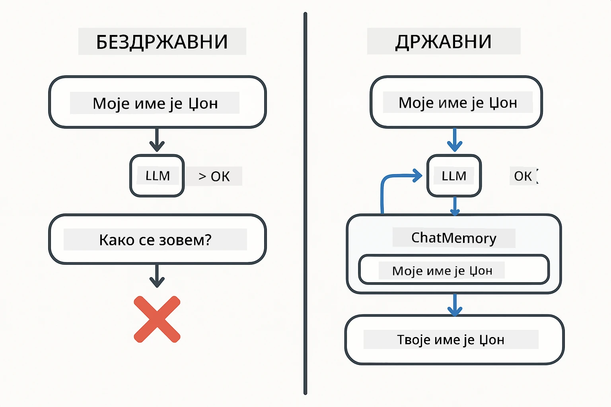
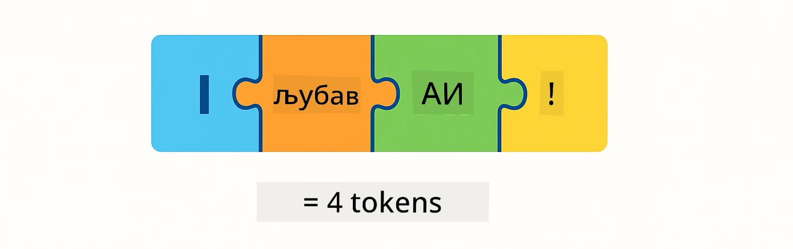
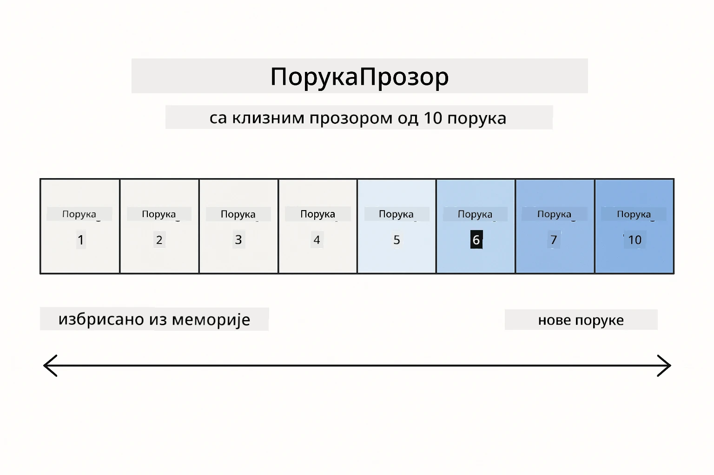
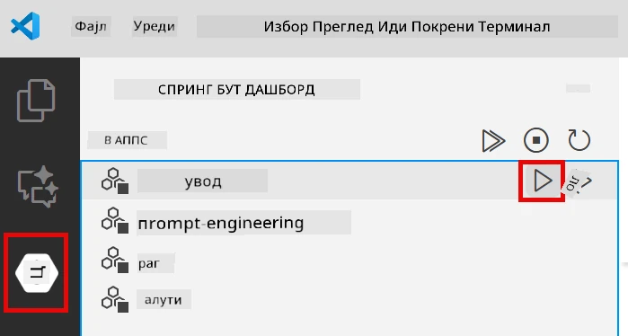
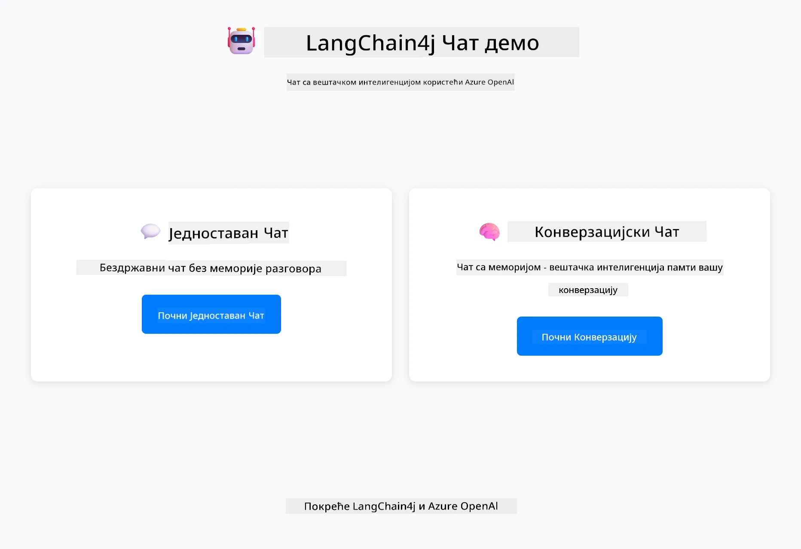
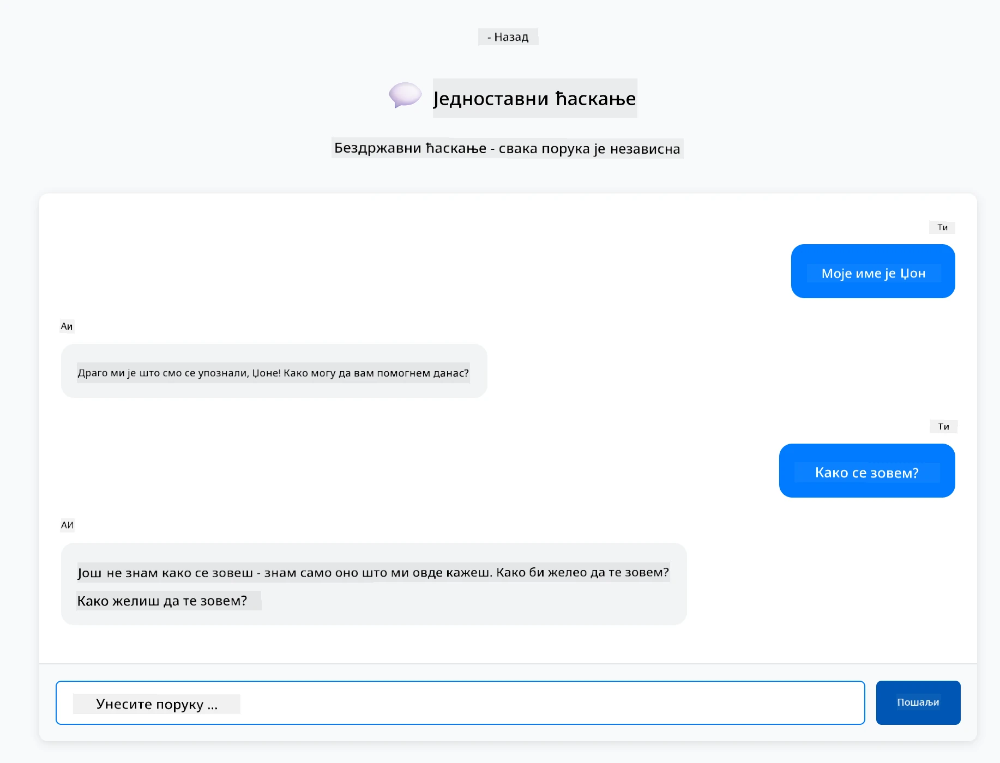
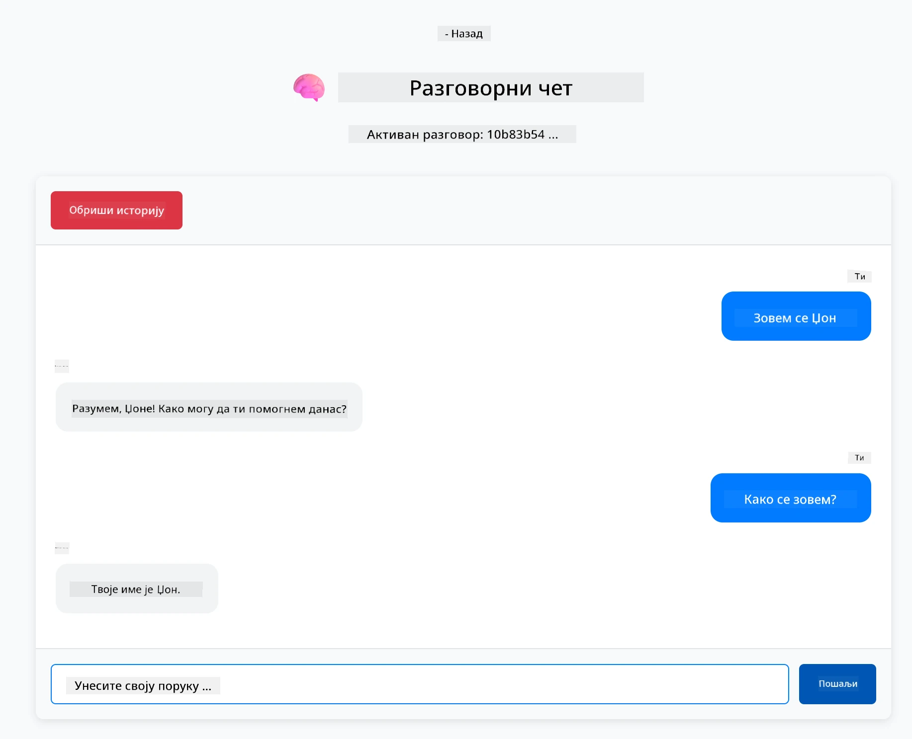

# Модул 01: Започињање са LangChain4j

## Садржај

- [Видео водич](#видео-водич)
- [Шта ћете научити](#шта-ћете-научити)
- [Претпоставке](#претпоставке)
- [Разумевање основног проблема](#разумевање-основног-проблема)
- [Разумевање токена](#разумевање-токена)
- [Како меморија функционише](#како-меморија-функционише)
- [Како ово користи LangChain4j](#како-ово-користи-langchain4j)
- [Деплој инфраструктуре Azure OpenAI](#деплој-инфраструктуре-azure-openai)
- [Покретање апликације локално](#покретање-апликације-локално)
- [Коришћење апликације](#коришћење-апликације)
  - [Беспрекорни ћаскање (леви панел)](#беспрекорно-ћаскање-леви-панел)
  - [Са стањем ћаскање (десни панел)](#са-стањем-ћаскање-десни-панел)
- [Следећи кораци](#следећи-кораци)

## Видео водич

Гледајте ову живу сесију која објашњава како започети са овим модулом:

<a href="https://www.youtube.com/live/nl_troDm8rQ?si=6b85S8xGjWnT2fX9"></a>

## Шта ћете научити

Ово је ваша почетна тачка са LangChain4j и Azure OpenAI. Почињемо са основама и почињемо да градимо апликације стилом продукције. Овај модул се фокусира на конверзацијски АИ који памти контекст и одржава стање — основне концепте на којима се граде сви каснији модули.

У овом водичу ћемо користити Azure OpenAI GPT-5.2 зато што његове напредне могућности разумевања чине понашање различитих образаца јаснијим. Када додате меморију, јасно ћете видети разлику. Ово олакшава разумевање шта свака компонента доноси вашој апликацији.

Изградићете једну апликацију која демонстрира оба образца:

**Беспрекорни ћаскање** - сваки захтев је независан. Модел нема сећање на претходне поруке. Ово је најједноставнија почетна тачка.

**Ћаскање са стањем** - сваки захтев укључује историју разговора. Модел одржава контекст кроз више корака. Ово је оно што производне апликације захтевају.

## Претпоставке

- Azure претплата са приступом Azure OpenAI
- Java 21, Maven 3.9+ 
- Azure CLI (https://learn.microsoft.com/en-us/cli/azure/install-azure-cli)
- Azure Developer CLI (azd) (https://learn.microsoft.com/en-us/azure/developer/azure-developer-cli/install-azd)

> **Белешка:** Java, Maven, Azure CLI и Azure Developer CLI (azd) су већ инсталирани у обезбеђеном девконтејнеру.

> **Белешка:** Овај модул користи GPT-5.2 на Azure OpenAI. Деплој је аутоматски конфигурисан преко `azd up` - немојте мењати име модела у коду.

## Разумевање основног проблема

Језички модели су беспрекорни (без стања). Сваки позив API-ју је независан. Ако пошаљете "Зовем се Јован" и затим питате "Које ми је име?", модел нема појма да сте се управо представили. Сматра сваки захтев као да је то први разговор који сте икада имали.

Ово је у реду за једноставна питања и одговоре, али бескорисно за праве апликације. Ботови за корисничку службу морају да памте шта сте им рекли. Лични асистенти требају контекст. Свака вишекрупна конверзација захтева меморију.

Следећа дијаграм упоређује ова два приступа — са леве стране беспрекорни позив који заборавља ваше име; са десне стране позив са стањем са ChatMemory који га памти.



*Разлика између беспрекорних (независних позива) и разговор са стањем (познат контекст)*

## Разумевање токена

Пре него што заронимо у разговоре, важно је разумети токене - основне јединице текста које језички модели обрађују:



*Пример како се текст разлаже на токене - „Волим АИ!“ постаје 4 одвојене јединице за обраду*

Токени су како АИ модели мере и обрађују текст. Речи, интерпункција и чак размаке могу бити токени. Ваш модел има лимит колико токена може обрадити одједном (400,000 за GPT-5.2, са до 272,000 улазних токена и 128,000 излазних токена). Разумевање токена помаже у управљању дужином конверзације и трошковима.

## Како меморија функционише

Меморија ћаскања решава проблем беспрекорности одржавањем историје разговора. Пре слања вашег захтева моделу, оквир додаје релевантне претходне поруке. Када питате "Које ми је име?", систем заправо шаље целу историју разговора, што омогућава моделу да види да сте раније рекли "Зовем се Јован."

LangChain4j обезбеђује имплементације меморије које ово аутоматски управљају. Ви бирати колико порука желите да задржите, а оквир управља прозором контекста. Дијаграм испод показује како MessageWindowChatMemory одржава клизни прозор недавних порука.



*MessageWindowChatMemory одржава клизни прозор недавних порука, аутоматски одбацујући старе*

## Како ово користи LangChain4j

Овај модул интегрише Spring Boot и додаје меморију разговора. Ево како се делови уклапају заједно:

**Зависности** - Додајте две LangChain4j библиотеке:

```xml
<dependency>
    <groupId>dev.langchain4j</groupId>
    <artifactId>langchain4j</artifactId> <!-- Inherited from BOM in root pom.xml -->
</dependency>
<dependency>
    <groupId>dev.langchain4j</groupId>
    <artifactId>langchain4j-open-ai-official</artifactId> <!-- Inherited from BOM in root pom.xml -->
</dependency>
```

**Модел ћаскања** - Конфигуришите Azure OpenAI као Spring bean ([LangChainConfig.java](../../../01-introduction/src/main/java/com/example/langchain4j/config/LangChainConfig.java)):

```java
@Bean
public OpenAiOfficialChatModel openAiOfficialChatModel() {
    return OpenAiOfficialChatModel.builder()
            .baseUrl(azureEndpoint)
            .apiKey(azureApiKey)
            .modelName(deploymentName)
            .timeout(Duration.ofMinutes(5))
            .maxRetries(3)
            .build();
}
```

Билдер чита креденцијале из променљивих окружења подешених од `azd up`. Подешавање `baseUrl` на вашу Azure крајњу тачку чини OpenAI клијент радом са Azure OpenAI.

**Меморија разговора** - Пратите историју ћаскања са MessageWindowChatMemory ([ConversationService.java](../../../01-introduction/src/main/java/com/example/langchain4j/service/ConversationService.java)):

```java
ChatMemory memory = MessageWindowChatMemory.withMaxMessages(10);

memory.add(UserMessage.from("My name is John"));
memory.add(AiMessage.from("Nice to meet you, John!"));

memory.add(UserMessage.from("What's my name?"));
AiMessage aiMessage = chatModel.chat(memory.messages()).aiMessage();
memory.add(aiMessage);
```

Креирајте меморију помоћу `withMaxMessages(10)` да бисте задржали последњих 10 порука. Додајте поруке корисника и АИ са типизованим обмотачима: `UserMessage.from(text)` и `AiMessage.from(text)`. Вратите историју са `memory.messages()` и пошаљите је моделу. Сервис чува засебне инстанце меморије по ИД-у разговора, омогућавајући више корисника да истовремено разговарају.

> **🤖 Испробајте са [GitHub Copilot](https://github.com/features/copilot) ћаскањем:** Отворите [`ConversationService.java`](../../../01-introduction/src/main/java/com/example/langchain4j/service/ConversationService.java) и питајте:
> - "Како MessageWindowChatMemory одлучује које поруке да одбаци када је прозор пун?"
> - "Могу ли да имплементирам прилагођено складиштење меморије користећи базу података уместо у меморији?"
> - "Како бих додао сумирање да компресујем стару историју разговора?"

Ендпоинт за беспрекорно ћаскање потпуно прескаче меморију - само `chatModel.chat(prompt)` као код брзог старта. Ендпоинт са стањем додаје поруке меморији, враћа историју и укључује тај контекст у сваки захтев. Иста конфигурација модела, различити образци.

## Деплој инфраструктуре Azure OpenAI

**Bash:**
```bash
cd 01-introduction
azd up  # Изаберите претплату и локацију (препоручује се eastus2)
```

**PowerShell:**
```powershell
cd 01-introduction
azd up  # Изаберите претплату и локацију (препоручује се eastus2)
```

> **Белешка:** Ако наиђете на грешку временског ограничења (`RequestConflict: Cannot modify resource ... provisioning state is not terminal`), само поново покрените `azd up`. Azure ресурси могу још увек бити у фази припреме у позадини, а поновно покушавање омогућава да деплој заврши када ресурси достигну коначну фазу.

Ово ће:
1. Разместити Azure OpenAI ресурс са GPT-5.2 и текстуалним ембединг моделом text-embedding-3-small
2. Аутоматски генерисати `.env` датотеку у корену пројекта са креденцијалима
3. Подесити све потребне променљиве окружења

**Имате проблема са деплојем?** Погледајте [Infrastructure README](infra/README.md) за детаљно решавање проблема укључујући сукобе имена поддомена, ручне кораке деплоја на Azure портал и водич за конфигурацију модела.

**Проверите да ли је деплој успео:**

**Bash:**
```bash
cat ../.env  # Треба да приказује AZURE_OPENAI_ENDPOINT, API_KEY, итд.
```

**PowerShell:**
```powershell
Get-Content ..\.env  # Треба да приказује AZURE_OPENAI_ENDPOINT, API_KEY, итд.
```

> **Белешка:** Наредба `azd up` аутоматски генерише `.env` датотеку. Ако је касније потребно да је ажурирате, можете уредити `.env` датотеку ручно или је регенерисати покретањем:
>
> **Bash:**
> ```bash
> cd ..
> bash .azd-env.sh
> ```
>
> **PowerShell:**
> ```powershell
> cd ..
> .\.azd-env.ps1
> ```

## Покретање апликације локално

**Проверите деплој:**

Уверите се да `.env` датотека постоји у коренском директоријуму са Azure креденцијалима. Покрените ово из фасцикле модула (`01-introduction/`):

**Bash:**
```bash
cat ../.env  # Треба да приказује AZURE_OPENAI_ENDPOINT, API_KEY, DEPLOYMENT
```

**PowerShell:**
```powershell
Get-Content ..\.env  # Требало би да прикаже AZURE_OPENAI_ENDPOINT, API_KEY, DEPLOYMENT
```

**Покрените апликације:**

**Опција 1: Коришћење Spring Boot Dashboard (препоручено за кориснике VS Code-a)**

Дев контејнер укључује проширење Spring Boot Dashboard, које обезбеђује визуелни интерфејс за управљање свим Spring Boot апликацијама. Можете га пронаћи у траци активности лево у VS Code-у (потражите икону Spring Boot-a).

Из Spring Boot Dashboard-а можете:
- Видети све доступне Spring Boot апликације у радном простору
- Покретати/заустављати апликације једним кликом
- Пратити логове апликације у реалном времену
- Праћење статуса апликације

Само кликните на дугме за покретање поред "introduction" да покренете овај модул, или покрените све модуле одједном.



*Spring Boot Dashboard у VS Code — покрени, заустави и прати све модуле са једног места*

**Опција 2: Коришћење shell скрипти**

Покрените све веб апликације (модуле 01-04):

**Bash:**
```bash
cd ..  # Из коренског директоријума
./start-all.sh
```

**PowerShell:**
```powershell
cd ..  # Из коренског директоријума
.\start-all.ps1
```

Или покрените само овај модул:

**Bash:**
```bash
cd 01-introduction
./start.sh
```

**PowerShell:**
```powershell
cd 01-introduction
.\start.ps1
```

Обе скрипте аутоматски учитавају променљиве окружења из коренске `.env` датотеке и саставиће JAR датотеке ако не постоје.

> **Белешка:** Ако више волите ручно да градите све модуле пре покретања:
>
> **Bash:**
> ```bash
> cd ..  # Go to root directory
> mvn clean package -DskipTests
> ```
>
> **PowerShell:**
> ```powershell
> cd ..  # Go to root directory
> mvn clean package -DskipTests
> ```

Отворите http://localhost:8080 у вашем прегледачу.

**Да бисте зауставили:**

**Bash:**
```bash
./stop.sh  # Само овај модул
# Или
cd .. && ./stop-all.sh  # Сви модули
```

**PowerShell:**
```powershell
.\stop.ps1  # Само овај модул
# Или
cd ..; .\stop-all.ps1  # Сви модули
```

## Коришћење апликације

Апликација пружа веб интерфејс са две имплементације ћаскања једна поред друге.



*Контролна табла која показује и Општи ћаскање (без стања) и Конверзацијски ћаскање (са стањем)*

### Беспрекорно ћаскање (леви панел)

Прво испробајте ово. Реците "Зовем се Јован" и одмах затим питајте "Које ми је име?" Модел неће памтити јер је свака порука независна. Ово демонстрира основни проблем интеграције језичког модела - нема контекст разговора.



*АИ не памти ваше име из претходне поруке*

### Са стањем ћаскање (десни панел)

Сада испробајте исти низ овде. Реците "Зовем се Јован" и затим "Које ми је име?" Овог пута памти. Разлика је у MessageWindowChatMemory - он одржава историју разговора и укључује је у сваки захтев. Ово је начин на који продукцијски конверзацијски АИ ради.



*АИ се сећа вашег имена из ранијег дела разговора*

Оба панела користе исти GPT-5.2 модел. Једина разлика је меморија. Ово јасно показује шта меморија доноси вашој апликацији и зашто је неопходна за праве случајеве коришћења.

## Следећи кораци

**Следећи модул:** [02-prompt-engineering - Prompt Engineering са GPT-5.2](../02-prompt-engineering/README.md)

---

**Навигација:** [← Назад на Главну](../README.md) | [Следећи: Модул 02 - Prompt Engineering →](../02-prompt-engineering/README.md)

---

<!-- CO-OP TRANSLATOR DISCLAIMER START -->
**Изјава о одрицању одговорности**:
Овај документ је преведен коришћењем услуге за аутоматски превод [Co-op Translator](https://github.com/Azure/co-op-translator). Иако тежимо тачности, имајте у виду да аутоматски преводи могу садржати грешке или нетачности. Оригинални документ на његовом изворном језику треба сматрати ауторитативним извором. За критичне информације препоручује се професионални људски превод. Нисмо одговорни за било каква неспоразума или погрешна тумачења која произилазе из коришћења овог превода.
<!-- CO-OP TRANSLATOR DISCLAIMER END -->