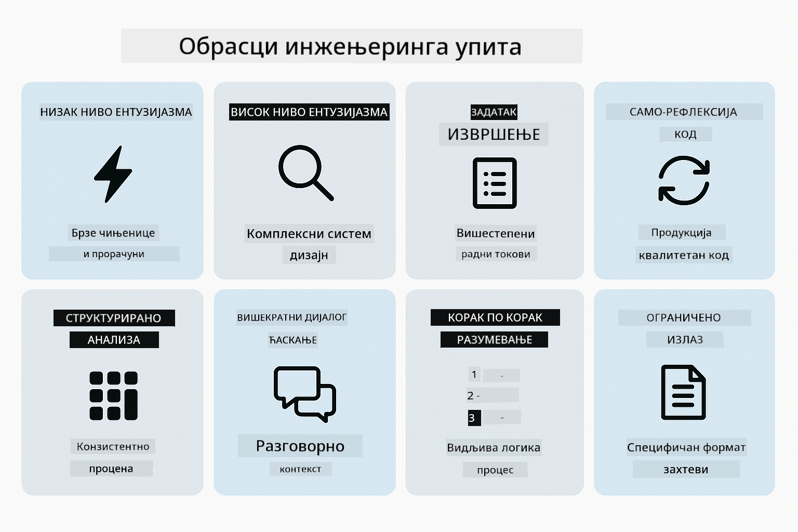
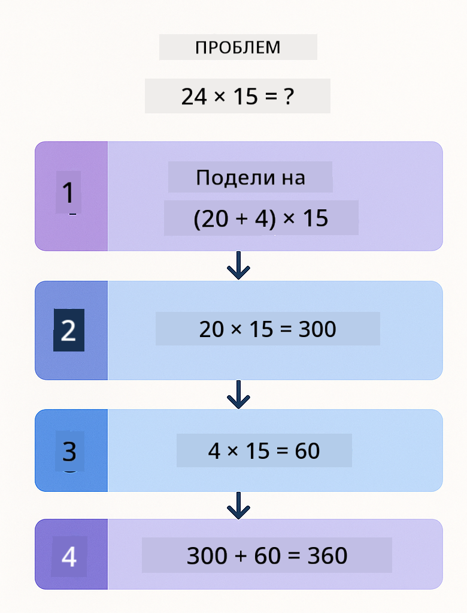
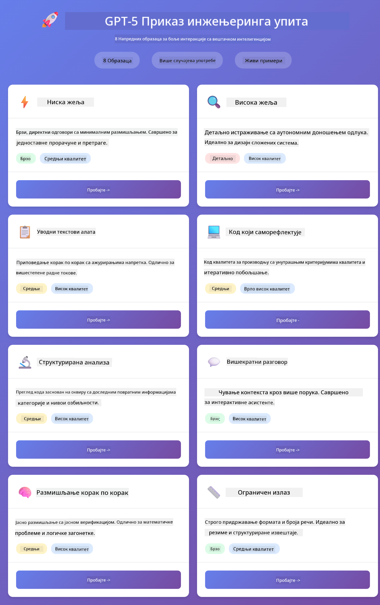
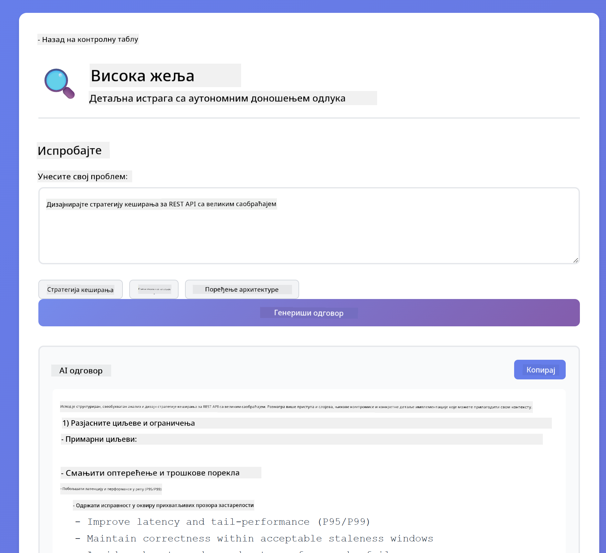
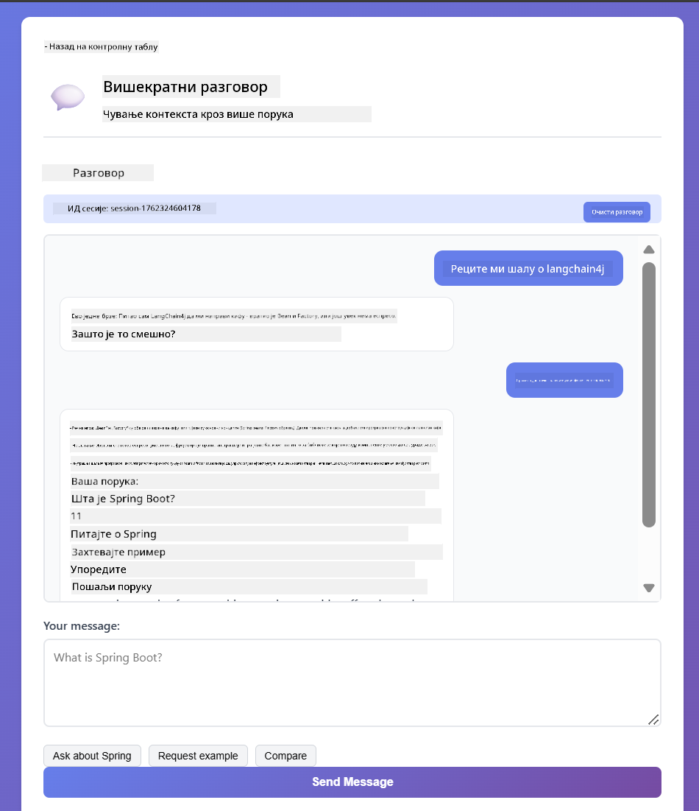
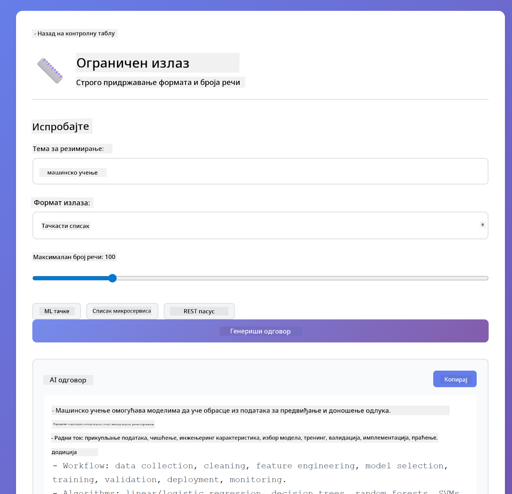
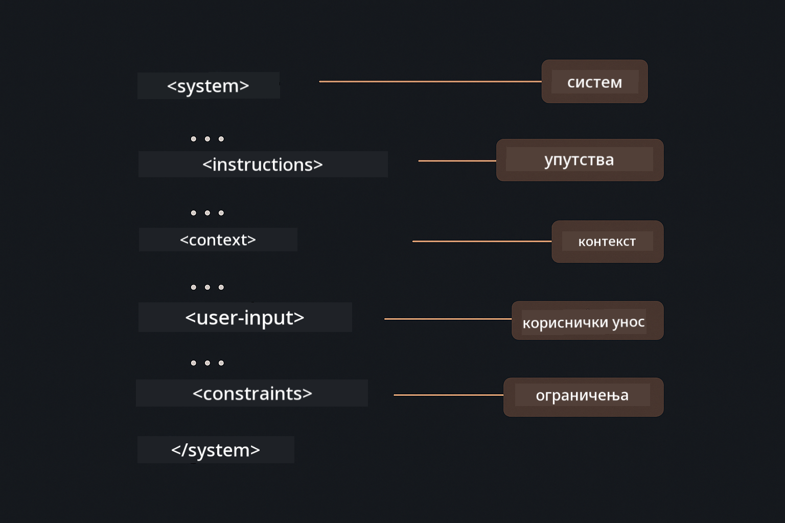

<!--
CO_OP_TRANSLATOR_METADATA:
{
  "original_hash": "8d787826cad7e92bf5cdbd116b1e6116",
  "translation_date": "2025-12-13T16:27:35+00:00",
  "source_file": "02-prompt-engineering/README.md",
  "language_code": "sr"
}
-->
# Модул 02: Инжењеринг упита са GPT-5

## Садржај

- [Шта ћете научити](../../../02-prompt-engineering)
- [Претпоставке](../../../02-prompt-engineering)
- [Разумевање инжењеринга упита](../../../02-prompt-engineering)
- [Како ово користи LangChain4j](../../../02-prompt-engineering)
- [Основни обрасци](../../../02-prompt-engineering)
- [Коришћење постојећих Azure ресурса](../../../02-prompt-engineering)
- [Снимци екрана апликације](../../../02-prompt-engineering)
- [Истраживање образаца](../../../02-prompt-engineering)
  - [Низак у односу на висок ниво жеље](../../../02-prompt-engineering)
  - [Извршење задатка (уводи алата)](../../../02-prompt-engineering)
  - [Саморефлектирајући код](../../../02-prompt-engineering)
  - [Структурирана анализа](../../../02-prompt-engineering)
  - [Вишекратни разговор](../../../02-prompt-engineering)
  - [Размишљање корак по корак](../../../02-prompt-engineering)
  - [Ограничен излаз](../../../02-prompt-engineering)
- [Шта заправо учите](../../../02-prompt-engineering)
- [Следећи кораци](../../../02-prompt-engineering)

## Шта ћете научити

У претходном модулу сте видели како меморија омогућава конверзациони AI и користили сте GitHub моделе за основне интеракције. Сада ћемо се фокусирати на то како постављате питања - саме упите - користећи Azure OpenAI GPT-5. Начин на који структурирате своје упите драматично утиче на квалитет одговора које добијате.

Користићемо GPT-5 јер уводи контролу размишљања - можете рећи моделу колико размишљања да уради пре одговора. Ово чини различите стратегије упита јаснијим и помаже вам да разумете када користити који приступ. Такође ћемо имати користи од мањих ограничења Azure-а за GPT-5 у поређењу са GitHub моделима.

## Претпоставке

- Завршен Модул 01 (Azure OpenAI ресурси распоређени)
- `.env` фајл у коренском директоријуму са Azure акредитивима (направљен помоћу `azd up` у Модулу 01)

> **Напомена:** Ако нисте завршили Модул 01, прво пратите упутства за распоређивање тамо.

## Разумевање инжењеринга упита

Инжењеринг упита је о дизајнирању улазног текста који доследно добија резултате које желите. Није само о постављању питања - већ о структуирању захтева тако да модел тачно разуме шта желите и како да то испоручи.

Замислите то као да дајете упутства колеги. "Поправи грешку" је нејасно. "Поправи NullPointerException у UserService.java на линији 45 додавањем провере за null" је конкретно. Језички модели раде на исти начин - специфичност и структура су важни.

## Како ово користи LangChain4j

Овај модул демонстрира напредне обрасце упита користећи исту LangChain4j основу из претходних модула, са фокусом на структуру упита и контролу размишљања.


*Како LangChain4j повезује ваше упите са Azure OpenAI GPT-5*

**Зависности** - Модул 02 користи следеће langchain4j зависности дефинисане у `pom.xml`:
```xml
<dependency>
    <groupId>dev.langchain4j</groupId>
    <artifactId>langchain4j</artifactId> <!-- Inherited from BOM in root pom.xml -->
</dependency>
<dependency>
    <groupId>dev.langchain4j</groupId>
    <artifactId>langchain4j-open-ai-official</artifactId> <!-- Inherited from BOM in root pom.xml -->
</dependency>
```

**Конфигурација OpenAiOfficialChatModel** - [LangChainConfig.java](../../../02-prompt-engineering/src/main/java/com/example/langchain4j/prompts/config/LangChainConfig.java)

Чат модел је ручно конфигурисан као Spring bean користећи OpenAI Official клијент, који подржава Azure OpenAI крајње тачке. Кључна разлика у односу на Модул 01 је како структурирамо упите послате `chatModel.chat()`, а не сама конфигурација модела.

**Системске и корисничке поруке** - [Gpt5PromptService.java](../../../02-prompt-engineering/src/main/java/com/example/langchain4j/prompts/service/Gpt5PromptService.java)

LangChain4j раздваја типове порука ради јасноће. `SystemMessage` поставља понашање и контекст AI-ја (нпр. "Ти си рецензент кода"), док `UserMessage` садржи стварни захтев. Ово раздвајање вам омогућава да одржите доследно понашање AI-ја кроз различите корисничке упите.

```java
SystemMessage systemMsg = SystemMessage.from(
    "You are a helpful Java programming expert."
);

UserMessage userMsg = UserMessage.from(
    "Explain what a List is in Java"
);

String response = chatModel.chat(systemMsg, userMsg);
```


*SystemMessage пружа трајни контекст док UserMessages садрже појединачне захтеве*

**MessageWindowChatMemory за вишекратне разговоре** - За образац вишекратног разговора поново користимо `MessageWindowChatMemory` из Модула 01. Свака сесија добија своју инстанцу меморије смештену у `Map<String, ChatMemory>`, што омогућава више истовремених разговора без мешања контекста.

**Шаблони упита** - Прави фокус овде је инжењеринг упита, а не нови LangChain4j API-ји. Сваки образац (низак ниво жеље, висок ниво жеље, извршење задатка итд.) користи исти метод `chatModel.chat(prompt)` али са пажљиво структурисаним низовима упита. XML тагови, упутства и форматирање су део текста упита, а не LangChain4j функције.

**Контрола размишљања** - Напор размишљања GPT-5 контролише се кроз упутства у упиту као што су "максимум 2 корака размишљања" или "истражи темељно". Ово су технике инжењеринга упита, а не LangChain4j конфигурације. Либрарија једноставно доставља ваше упите моделу.

Кључна порука: LangChain4j пружа инфраструктуру (повезивање модела преко [LangChainConfig.java](../../../02-prompt-engineering/src/main/java/com/example/langchain4j/prompts/config/LangChainConfig.java), меморију, руковање порукама преко [Gpt5PromptService.java](../../../02-prompt-engineering/src/main/java/com/example/langchain4j/prompts/service/Gpt5PromptService.java)), док овај модул вас учи како да креирате ефикасне упите у оквиру те инфраструктуре.

## Основни обрасци

Ни сви проблеми не захтевају исти приступ. Нека питања захтевају брзе одговоре, друга дубоко размишљање. Нека захтевају видљиво размишљање, а друга само резултате. Овај модул покрива осам образаца упита - сваки оптимизован за различите сценарије. Испробаћете све да бисте научили када који приступ најбоље функционише.



*Преглед осам образаца инжењеринга упита и њихове примене*


*Низак ниво жеље (брз, директан) у односу на висок ниво жеље (темљан, истраживачки) приступи размишљању*

**Низак ниво жеље (брзо и фокусирано)** - За једноставна питања где желите брзе, директне одговоре. Модел ради минимално размишљање - максимум 2 корака. Користите ово за прорачуне, претраге или једноставна питања.

```java
String prompt = """
    <reasoning_effort>low</reasoning_effort>
    <instruction>maximum 2 reasoning steps</instruction>
    
    What is 15% of 200?
    """;

String response = chatModel.chat(prompt);
```

> 💡 **Истражите са GitHub Copilot:** Отворите [`Gpt5PromptService.java`](../../../02-prompt-engineering/src/main/java/com/example/langchain4j/prompts/service/Gpt5PromptService.java) и питајте:
> - "Која је разлика између образаца упита са ниским и високим нивоом жеље?"
> - "Како XML тагови у упитима помажу у структуирању одговора AI-ја?"
> - "Када треба користити образце саморефлексије у односу на директна упутства?"

**Висок ниво жеље (дубоко и темељно)** - За сложене проблеме где желите свеобухватну анализу. Модел темељно истражује и приказује детаљно размишљање. Користите ово за дизајн система, архитектонске одлуке или сложена истраживања.

```java
String prompt = """
    <reasoning_effort>high</reasoning_effort>
    <instruction>explore thoroughly, show detailed reasoning</instruction>
    
    Design a caching strategy for a high-traffic REST API.
    """;

String response = chatModel.chat(prompt);
```

**Извршење задатка (напредак корак по корак)** - За вишестепене радне токове. Модел пружа план унапред, описује сваки корак док ради, а затим даје резиме. Користите ово за миграције, имплементације или било који вишестепени процес.

```java
String prompt = """
    <task>Create a REST endpoint for user registration</task>
    <preamble>Provide an upfront plan</preamble>
    <narration>Narrate each step as you work</narration>
    <summary>Summarize what was accomplished</summary>
    """;

String response = chatModel.chat(prompt);
```

Chain-of-Thought упити јасно траже од модела да прикаже свој процес размишљања, побољшавајући тачност за сложене задатке. Разлагање корак по корак помаже и људима и AI-ју да разумеју логику.

> **🤖 Испробајте са [GitHub Copilot](https://github.com/features/copilot) Chat:** Питајте о овом обрасцу:
> - "Како бих прилагодио образац извршења задатка за дуготрајне операције?"
> - "Које су најбоље праксе за структуирање увода алата у продукцијским апликацијама?"
> - "Како могу да ухватим и прикажем интермедијерне извештаје о напретку у UI-ју?"


*Планирање → Извршење → Резимирање радног тока за вишестепене задатке*

**Саморефлектирајући код** - За генерисање кода производног квалитета. Модел генерише код, проверава га према критеријумима квалитета и побољшава га итеративно. Користите ово када градите нове функције или сервисе.

```java
String prompt = """
    <task>Create an email validation service</task>
    <quality_criteria>
    - Correct logic and error handling
    - Best practices (clean code, proper naming)
    - Performance optimization
    - Security considerations
    </quality_criteria>
    <instruction>Generate code, evaluate against criteria, improve iteratively</instruction>
    """;

String response = chatModel.chat(prompt);
```


*Итеративна петља побољшања - генериши, процени, идентификуј проблеме, побољшај, понови*

**Структурирана анализа** - За доследну евалуацију. Модел прегледа код користећи фиксни оквир (тачност, праксе, перформансе, безбедност). Користите ово за прегледе кода или процене квалитета.

```java
String prompt = """
    <code>
    public List getUsers() {
        return database.query("SELECT * FROM users");
    }
    </code>
    
    <framework>
    Evaluate using these categories:
    1. Correctness - Logic and functionality
    2. Best Practices - Code quality
    3. Performance - Efficiency concerns
    4. Security - Vulnerabilities
    </framework>
    """;

String response = chatModel.chat(prompt);
```

> **🤖 Испробајте са [GitHub Copilot](https://github.com/features/copilot) Chat:** Питајте о структурираној анализи:
> - "Како могу прилагодити оквир анализе за различите типове прегледа кода?"
> - "Који је најбољи начин за парсирање и програмско коришћење структурираних резултата?"
> - "Како обезбедити доследне нивое озбиљности у различитим сесијама прегледа?"


*Оквир са четири категорије за доследне прегледе кода са нивоима озбиљности*

**Вишекратни разговор** - За разговоре којима је потребан контекст. Модел памти претходне поруке и надограђује их. Користите ово за интерактивне сесије помоћи или сложена питања и одговоре.

```java
ChatMemory memory = MessageWindowChatMemory.withMaxMessages(10);

memory.add(UserMessage.from("What is Spring Boot?"));
AiMessage aiMessage1 = chatModel.chat(memory.messages()).aiMessage();
memory.add(aiMessage1);

memory.add(UserMessage.from("Show me an example"));
AiMessage aiMessage2 = chatModel.chat(memory.messages()).aiMessage();
memory.add(aiMessage2);
```


*Како се контекст разговора акумулира кроз више корака док не достигне лимит токена*

**Размишљање корак по корак** - За проблеме који захтевају видљиву логику. Модел приказује јасно размишљање за сваки корак. Користите ово за математичке проблеме, логичке загонетке или када желите разумети процес размишљања.

```java
String prompt = """
    <instruction>Show your reasoning step-by-step</instruction>
    
    If a train travels 120 km in 2 hours, then stops for 30 minutes,
    then travels another 90 km in 1.5 hours, what is the average speed
    for the entire journey including the stop?
    """;

String response = chatModel.chat(prompt);
```



*Разлагање проблема у јасне логичке кораке*

**Ограничен излаз** - За одговоре са специфичним захтевима формата. Модел строго прати правила формата и дужине. Користите ово за резиме или када вам је потребна прецизна структура излаза.

```java
String prompt = """
    <constraints>
    - Exactly 100 words
    - Bullet point format
    - Technical terms only
    </constraints>
    
    Summarize the key concepts of machine learning.
    """;

String response = chatModel.chat(prompt);
```


*Примена специфичних захтева за формат, дужину и структуру*

## Коришћење постојећих Azure ресурса

**Проверите распоређивање:**

Уверите се да `.env` фајл постоји у коренском директоријуму са Azure акредитивима (направљен током Модула 01):
```bash
cat ../.env  # Требало би да прикаже AZURE_OPENAI_ENDPOINT, API_KEY, DEPLOYMENT
```

**Покрените апликацију:**

> **Напомена:** Ако сте већ покренули све апликације користећи `./start-all.sh` из Модула 01, овај модул већ ради на порту 8083. Можете прескочити наредбе за покретање испод и директно отићи на http://localhost:8083.

**Опција 1: Коришћење Spring Boot Dashboard-а (препоручено за кориснике VS Code-а)**

Dev контејнер укључује проширење Spring Boot Dashboard, које пружа визуелни интерфејс за управљање свим Spring Boot апликацијама. Можете га пронаћи у Activity Bar-у са леве стране VS Code-а (потражите иконицу Spring Boot-а).

Из Spring Boot Dashboard-а можете:
- Видети све доступне Spring Boot апликације у радном простору
- Покренути/зауставити апликације једним кликом
- Пратити логове апликације у реалном времену
- Надгледати статус апликације

Једноставно кликните на дугме за покретање поред "prompt-engineering" да бисте покренули овај модул, или покрените све модуле одједном.


**Опција 2: Коришћење shell скрипти**

Покрените све веб апликације (модуле 01-04):

**Bash:**
```bash
cd ..  # Из коренског директоријума
./start-all.sh
```

**PowerShell:**
```powershell
cd ..  # Из коренског директоријума
.\start-all.ps1
```

Или покрените само овај модул:

**Bash:**
```bash
cd 02-prompt-engineering
./start.sh
```

**PowerShell:**
```powershell
cd 02-prompt-engineering
.\start.ps1
```

Обе скрипте аутоматски учитавају променљиве окружења из коренског `.env` фајла и изградиће JAR-ове ако не постоје.

> **Напомена:** Ако више волите да ручно изградите све модуле пре покретања:
>
> **Bash:**
> ```bash
> cd ..  # Go to root directory
> mvn clean package -DskipTests
> ```
>
> **PowerShell:**
> ```powershell
> cd ..  # Go to root directory
> mvn clean package -DskipTests
> ```

Отворите http://localhost:8083 у вашем прегледачу.

**За заустављање:**

**Bash:**
```bash
./stop.sh  # Само овај модул
# Или
cd .. && ./stop-all.sh  # Сви модули
```

**PowerShell:**
```powershell
.\stop.ps1  # Само овај модул
# Или
cd ..; .\stop-all.ps1  # Сви модули
```

## Снимци екрана апликације



*Главни контролни панел који приказује свих 8 образаца инжењеринга упита са њиховим карактеристикама и применама*

## Истраживање образаца

Веб интерфејс вам омогућава да експериментишете са различитим стратегијама упита. Сваки образац решава различите проблеме - испробајте их да видите када који приступ најбоље функционише.

### Низак у односу на висок ниво жеље

Поставите једноставно питање као што је "Колико је 15% од 200?" користећи Низак ниво жеље. Добићете тренутан, директан одговор. Сада поставите нешто сложеније као "Дизајнирај стратегију кеширања за API са великим саобраћајем" користећи Висок ниво жеље. Пратите како модел успорава и пружа детаљно размишљање. Исти модел, иста структура питања - али упит му говори колико размишљања да уради.


*Брза калкулација са минималним размишљањем*



*Свеобухватна стратегија кеширања (2.8MB)*

### Извршење задатка (Уводи алата)

Вишестепени радни токови имају користи од унапред планирања и нарације напретка. Модел описује шта ће урадити, наративно објашњава сваки корак, а затим сумира резултате.


*Креирање REST крајње тачке са нарацијом корак по корак (3.9MB)*

### Код који саморефлектује

Пробајте „Креирај услугу за валидацију е-поште“. Уместо да само генерише код и стане, модел генерише, процењује према критеријумима квалитета, идентификује слабости и побољшава. Видећете како понавља док код не достигне производне стандарде.


*Комплетна услуга за валидацију е-поште (5.2MB)*

### Структурирана анализа

Прегледи кода захтевају доследне оквире за процену. Модел анализира код користећи фиксне категорије (тачност, праксе, перформансе, безбедност) са нивоима озбиљности.


*Преглед кода заснован на оквиру*

### Вишеструки кругови ћаскања

Питајте „Шта је Spring Boot?“ па одмах наставите са „Покажи ми пример“. Модел памти ваше прво питање и даје вам пример Spring Boot-а конкретно. Без меморије, то друго питање би било превише нејасно.



*Чување контекста кроз питања*

### Размишљање корак по корак

Изаберите математички проблем и пробајте га и са Размишљањем корак по корак и са Ниском жељом. Ниска жеља вам само даје одговор - брзо али нејасно. Размишљање корак по корак показује сваки израчун и одлуку.


*Математички проблем са јасним корацима*

### Ограничен излаз

Када вам требају специфични формати или број речи, овај образац строго примењује правила. Пробајте да генеришете резиме са тачно 100 речи у облику тачака.



*Резиме машинског учења са контролом формата*

## Шта заправо учите

**Напор размишљања мења све**

GPT-5 вам омогућава да контролишете рачунарски напор кроз ваше упите. Низак напор значи брзе одговоре са минималним истраживањем. Висок напор значи да модел узима време да дубоко размишља. Учите како да прилагодите напор сложености задатка - не губите време на једноставна питања, али ни не журите са сложеним одлукама.

**Структура води понашање**

Приметили сте XML ознаке у упитима? Оне нису декоративне. Модели поузданије прате структурирана упутства него слободан текст. Када вам требају вишестепени процеси или сложена логика, структура помаже моделу да прати где је и шта следи.



*Анатомија добро структурираног упита са јасним одељцима и XML-стил организацијом*

**Квалитет кроз самоевалуацију**

Обрасци саморефлексије раде тако што јасно дефинишу критеријуме квалитета. Уместо да се надају да модел „уради исправно“, ви му тачно кажете шта „исправно“ значи: исправна логика, руковање грешкама, перформансе, безбедност. Модел онда може да процени свој излаз и побољша га. Ово претвара генерисање кода из лутрије у процес.

**Контекст је ограничен**

Вишеструки кругови разговора раде тако што укључују историју порука са сваким захтевом. Али постоји ограничење - сваки модел има максималан број токена. Како разговори расту, требаће вам стратегије да задржите релевантан контекст без преласка тог лимита. Овај модул вам показује како меморија функционише; касније ћете научити када да сумирате, када да заборавите и када да враћате.

## Следећи кораци

**Следећи модул:** [03-rag - RAG (Retrieval-Augmented Generation)](../03-rag/README.md)

---

**Навигација:** [← Претходно: Модул 01 - Увод](../01-introduction/README.md) | [Назад на почетак](../README.md) | [Следеће: Модул 03 - RAG →](../03-rag/README.md)

---

<!-- CO-OP TRANSLATOR DISCLAIMER START -->
**Одрицање од одговорности**:
Овај документ је преведен коришћењем AI услуге за превођење [Co-op Translator](https://github.com/Azure/co-op-translator). Иако се трудимо да превод буде тачан, имајте у виду да аутоматски преводи могу садржати грешке или нетачности. Оригинални документ на његовом изворном језику треба сматрати ауторитетним извором. За критичне информације препоручује се професионални људски превод. Нисмо одговорни за било каква неспоразума или погрешна тумачења која произилазе из коришћења овог превода.
<!-- CO-OP TRANSLATOR DISCLAIMER END -->