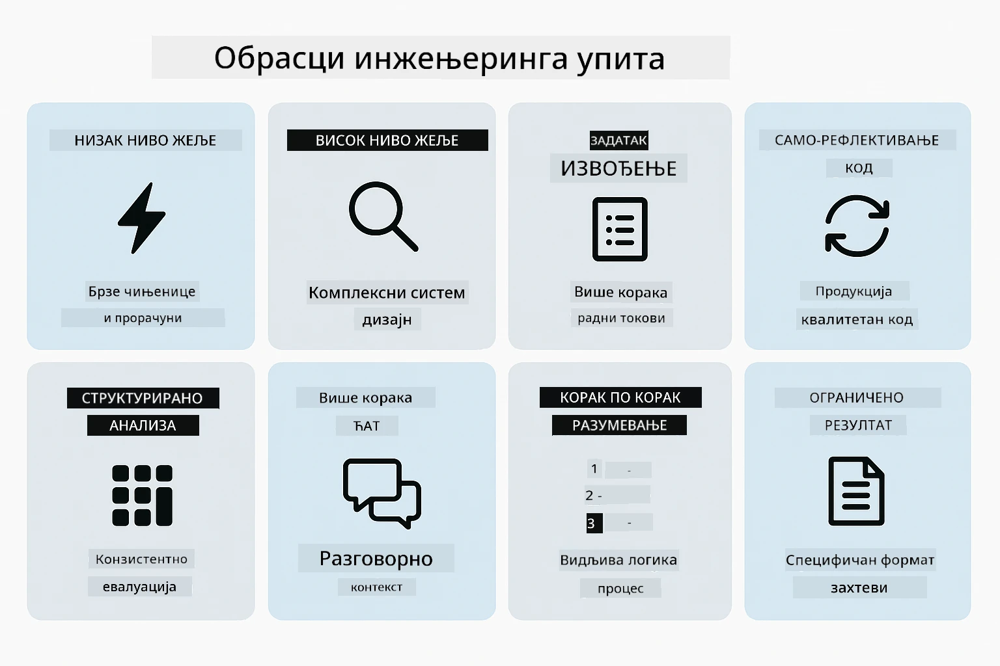
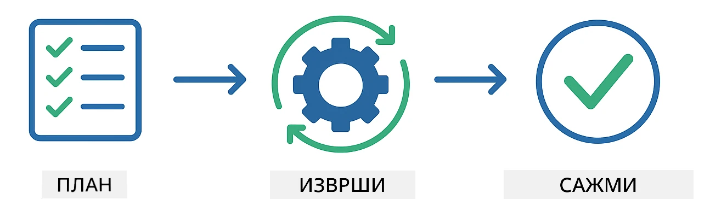
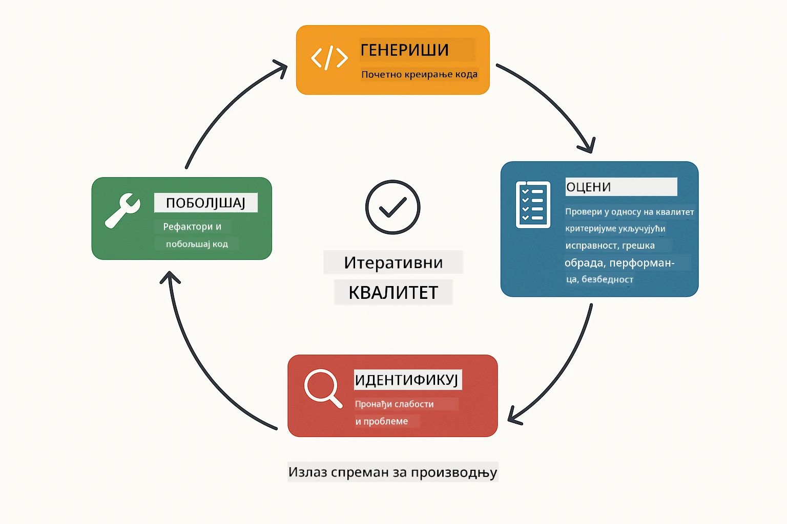
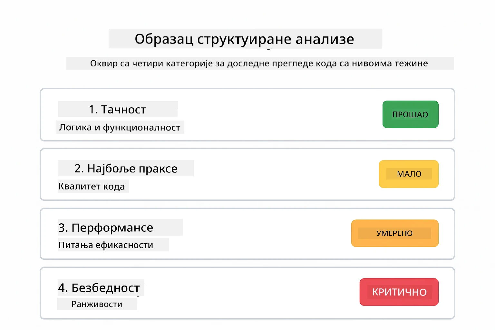
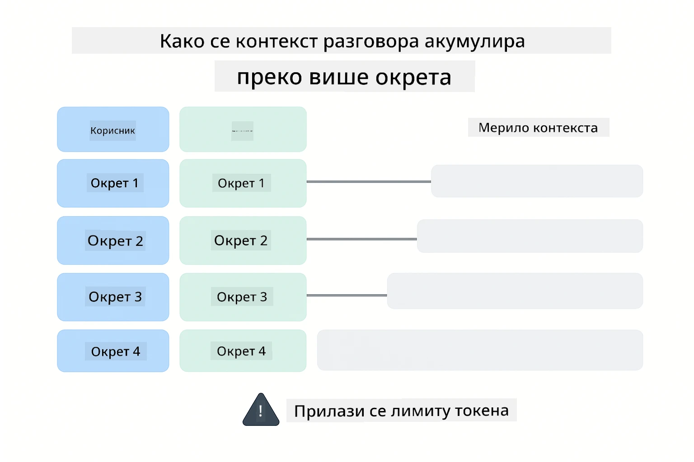
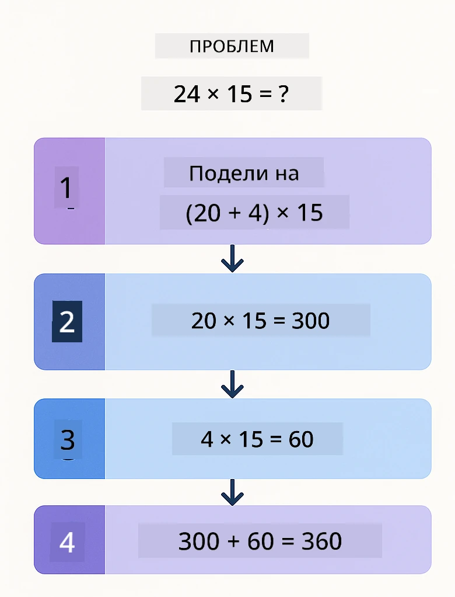
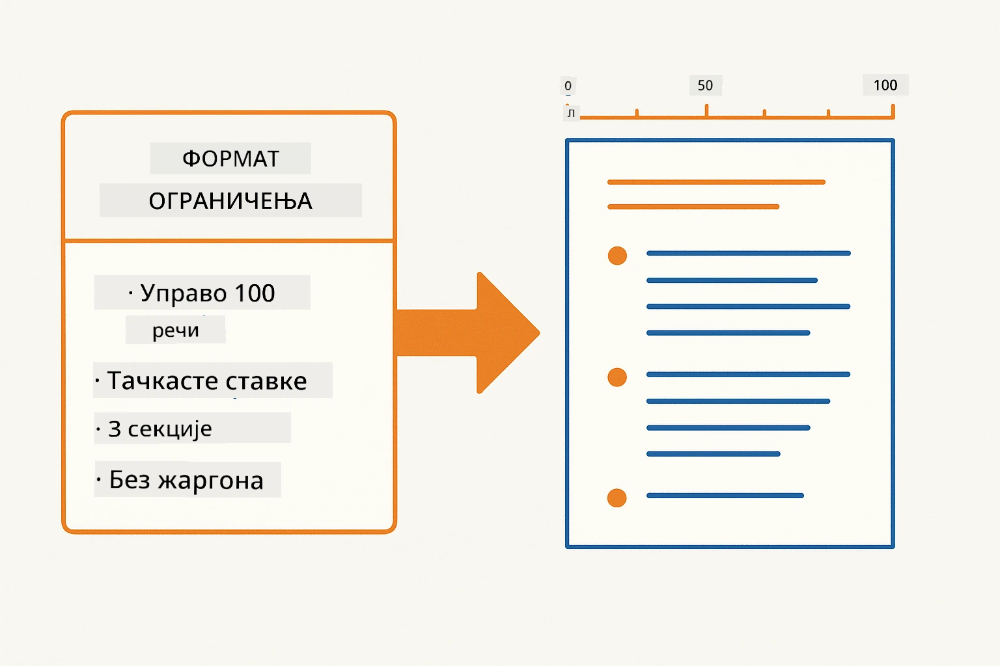
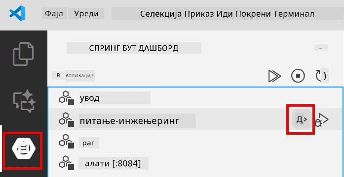
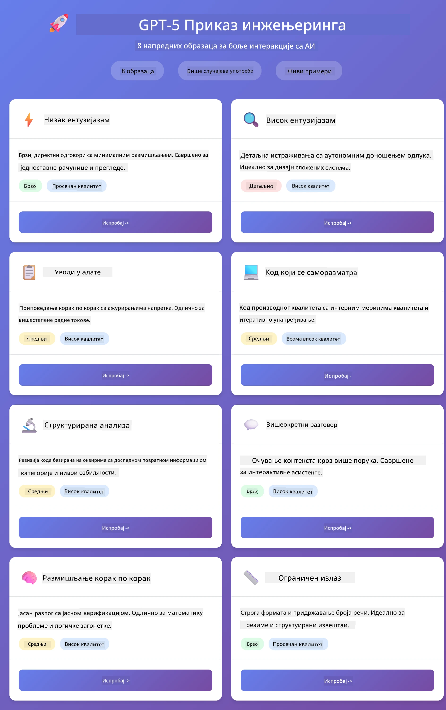
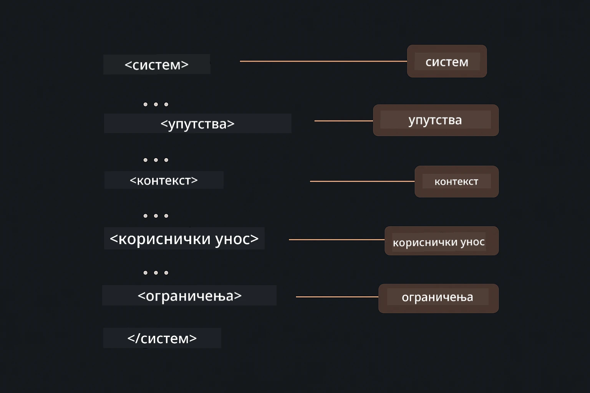

# Модул 02: Инжењеринг упита са GPT-5.2

## Садржај

- [Преглед видео снимка](#преглед-видео-снимка)
- [Шта ћете научити](#шта-ћете-научити)
- [Претпоставке](#претпоставке)
- [Разумевање инжењеринга упита](#разумевање-инжењеринга-упита)
- [Основе инжењеринга упита](#основе-инжењеринга-упита)
  - [Zero-Shot упити](#zero-shot-упити)
  - [Few-Shot упити](#few-shot-упити)
  - [Ланац размишљања](#ланац-размишљања)
  - [Упити засновани на улогама](#упити-засновани-на-улогама)
  - [Шаблони упита](#шаблони-упита)
- [Напредни шаблони](#напредни-шаблони)
- [Покретање апликације](#покретање-апликације)
- [Снимци екрана апликације](#снимци-екрана-апликације)
- [Истраживање шаблона](#истраживање-шаблона)
  - [Низак у односу на висок ниво воље](#ниска-у-односу-на-високу-жељу)
  - [Извођење задатака (Уводи у алате)](#извођење-задатка-увод-у-алате)
  - [Код који се самоанализа](#саморефлектујући-код)
  - [Структурисана анализа](#структурисана-анализа)
  - [Више-окретни разговор](#вишекратни-разговор)
  - [Размишљање корак по корак](#размишљање-корак-по-корак)
  - [Ограничен излаз](#ограничен-излаз)
- [Шта заиста учите](#шта-заправо-учите)
- [Следећи кораци](#следећи-кораци)

## Преглед видео снимка

Погледајте ову уживо сесију која објашњава како започети са овим модулом:

<a href="https://www.youtube.com/live/PJ6aBaE6bog?si=LDshyBrTRodP-wke"></a>

## Шта ћете научити

Следећа дијаграм пружа преглед кључних тема и вештина које ћете развити у овом модулу — од техника усавршавања упита до корак-по-корак процеса који ћете пратити.


У претходном модулу сте видели како меморија омогућава конверзацијалну вештачку интелигенцију са Azure OpenAI. Сада ћемо се фокусирати на то како постављате питања — односно саме упите — користећи Azure OpenAI GPT-5.2. Начин на који структурирате упите драматично утиче на квалитет одговора које добијате. Започињемо прегледом основних техника упита, а затим прелазимо на осам напредних шаблона који у потпуности користе могућности GPT-5.2.

Користићемо GPT-5.2 јер уводи контролу размишљања — можете модели рећи колико треба да размишља пре одговора. То различите стратегије упита чини приметнијим и помаже вам да разумете када користити који приступ.

## Претпоставке

- Завршен Модул 01 (Azure OpenAI ресурси распоређени)
- `.env` фајл у коренском директоријуму са Azure акредитивима (направљен командом `azd up` у Модулу 01)

> **Напомена:** Ако нисте завршили Модул 01, прво пратите упутства за распоређивање тамо.

## Разумевање инжењеринга упита

У сржи, инжењеринг упита је разлика између нејасних инструкција и прецизних, као што илуструје поређење у наставку.


Инжењеринг упита је о дизајнирању улазног текста који доследно добија резултате које желите. Није само постављање питања — већ структурирање захтева тако да модел тачно разуме шта желите и како то испоручити.

Размишљајте о томе као да дајете упутства колеги. "Поправи грешку" је нејасно. "Поправи NullPointerException у UserService.java на линији 45 додавањем провере нуле" је прецизно. Језички модели раде исто тако — прецизност и структура су битни.

Дијаграм испод показује како LangChain4j уклапа у ову слику — повезујући ваше шаблоне упита са моделом преко SystemMessage и UserMessage грађевних блокова.


LangChain4j пружа инфраструктуру — везе са моделом, меморију и типове порука — док су шаблони упита само пажљиво структурисан текст који преко те инфраструктуре шаљете. Кључни градивни блокови су `SystemMessage` (који поставља понашање и улогу АИ) и `UserMessage` (који носи ваш стварни захтев).

## Основе инжењеринга упита

Пет основних техника приказаних доле чине темеље ефективног инжењеринга упита. Свака се бави другим аспектом комуникације са језичким моделима.


Пре него што заронимо у напредне шаблоне овог модула, хајде да прегледамо пет основних техника упита. Ово су грађевински блокови које сваки инжењер упита треба да познаје.

### Zero-Shot упити

Најједноставнији приступ: дајте моделу директну инструкцију без примера. Модел у потпуности зависи од свог тренинга да разуме и изврши задатак. Ово добро функционише за једноставне захтеве где је очекивано понашање очигледно.


*Директна инструкција без примера — модел изводи задатак само из инструкције*

```java
String prompt = "Classify this sentiment: 'I absolutely loved the movie!'";
String response = model.chat(prompt);
// Одговор: "Позитивно"
```

**Када користити:** Једноставне класификације, директна питања, преводи или било који задатак који модел може решити без додатних упутстава.

### Few-Shot упити

Дајте примере који показују образац који желите да модел прати. Модел учи очекивани формат улаз-излаз из ваших примера и примењује га на нове уносе. Ово драматично побољшава конзистентност за задатке где форматирање или понашање нису очигледни.


*Учитење из примера — модел идентификује образац и примењује га на нове уносе*

```java
String prompt = """
    Classify the sentiment as positive, negative, or neutral.
    
    Examples:
    Text: "This product exceeded my expectations!" → Positive
    Text: "It's okay, nothing special." → Neutral
    Text: "Waste of money, very disappointed." → Negative
    
    Now classify this:
    Text: "Best purchase I've made all year!"
    """;
String response = model.chat(prompt);
```

**Када користити:** Прилагођене класификације, доследно форматирање, доменски специфични задаци или када Zero-Shot резултати нису конзистентни.

### Ланац размишљања

Замолите модел да покаже своје разматрање корак по корак. Уместо да прескаче директно на одговор, модел разлаже проблем и ради кроз сваки део јасно. Ово побољшава тачност код математичких, логичких и вишестепених задатака.


*Размишљање корак по корак — разлагање сложених проблема у јасне логичке кораке*

```java
String prompt = """
    Problem: A store has 15 apples. They sell 8 apples and then 
    receive a shipment of 12 more apples. How many apples do they have now?
    
    Let's solve this step-by-step:
    """;
String response = model.chat(prompt);
// Модел показује: 15 - 8 = 7, затим 7 + 12 = 19 јабука
```

**Када користити:** Математички проблеми, логичке загонетке, дебаговање или било који задатак где показивање процеса размишљања побољшава тачност и поверење.

### Упити засновани на улогама

Поставите особу или улогу АИ пре постављања питања. Ово даје контекст који обликује тон, дубину и фокус одговора. "Софтверски архитекта" даје другачије савете од "млађег програмера" или "ревизора безбедности".


*Постављање контекста и улоге — исто питање добија различит одговор у зависности од додељене улоге*

```java
String prompt = """
    You are an experienced software architect reviewing code.
    Provide a brief code review for this function:
    
    def calculate_total(items):
        total = 0
        for item in items:
            total = total + item['price']
        return total
    """;
String response = model.chat(prompt);
```

**Када користити:** Прегледи кода, туторство, анализе специфичне за домен или кад су вам потребни одговори прилагођени нивоу стручности или перспективи.

### Шаблони упита

Креирајте поновно употребљиве упите са променљивим параметрима. Уместо да сваки пут пишете нови упит, дефинишите шаблон једном и попуњавајте различите вредности. LangChain4j класа `PromptTemplate` то олакшава са `{{variable}}` синтаксом.


*Поновно употребљиви упити са променљивим параметрима — један шаблон, многе употребе*

```java
PromptTemplate template = PromptTemplate.from(
    "What's the best time to visit {{destination}} for {{activity}}?"
);

Prompt prompt = template.apply(Map.of(
    "destination", "Paris",
    "activity", "sightseeing"
));

String response = model.chat(prompt.text());
```

**Када користити:** Поновљени упити са различитим уносима, пакетна обрада, грађење поновно употребљивих AI радних токова или било која ситуација где структура упита остаје иста, али се подаци мењају.

---

Ових пет основа пружају вам солидан алат за већину задатака упита. Остатак овог модула гради на њима са **осам напредних шаблона** који искоришћавају контролу размишљања, самоевалуцију и могућности структурисаног излаза GPT-5.2.

## Напредни шаблони

Након разматрања основа, хајде да пређемо на осам напредних шаблона који овај модул чине јединственим. Неки проблеми не захтевају исти приступ. Нека питања тражe брзе одговоре, друга дубоко размишљање. Нека захтевају видљиво размишљање, друга само резултате. Сваки шаблон испод је оптимизован за различиту ситуацију — а контролa размишљања GPT-5.2 ове разлике чини још израженијим.



*Преглед осам шаблона инжењеринга упита и њихових употреба*

GPT-5.2 додаје још једну димензију овим шаблонима: *контролу размишљања*. Линијски контролер испод показује како можете подесити напор модела — од брзих, директних одговора до дубоке, темељне анализе.


*Контрола размишљања GPT-5.2 вам омогућава да одредите колико модел треба да размишља — од брзих директних одговора до дубоке истраге*

**Низак ниво воље (брзо и фокусирано)** - За једноставна питања где желите брзе, директне одговоре. Модел врши минимално размишљање - максимум 2 корака. Користите ово за калкулације, претраге или једноставна питања.

```java
String prompt = """
    <context_gathering>
    - Search depth: very low
    - Bias strongly towards providing a correct answer as quickly as possible
    - Usually, this means an absolute maximum of 2 reasoning steps
    - If you think you need more time, state what you know and what's uncertain
    </context_gathering>
    
    Problem: What is 15% of 200?
    
    Provide your answer:
    """;

String response = chatModel.chat(prompt);
```

> 💡 **Истражите са GitHub Copilot:** Отворите [`Gpt5PromptService.java`](../../../02-prompt-engineering/src/main/java/com/example/langchain4j/prompts/service/Gpt5PromptService.java) и питајте:
> - "Која је разлика између образаца упита са ниским и високим нивоом воље?"
> - "Како XML тагови у упитима помажу у структуирању одговора АИ?"
> - "Када треба користити шаблоне самоанализа уместо директних инструкција?"

**Висок ниво воље (дубоко и темељно)** - За комплексне проблеме где желите свеобухватну анализу. Модел темељно истражује и показује детаљно размишљање. Користите ово за дизајн система, архитектонске одлуке или сложена истраживања.

```java
String prompt = """
    Analyze this problem thoroughly and provide a comprehensive solution.
    Consider multiple approaches, trade-offs, and important details.
    Show your analysis and reasoning in your response.
    
    Problem: Design a caching strategy for a high-traffic REST API.
    """;

String response = chatModel.chat(prompt);
```

**Извођење задатака (наступ у корацима)** - За вишестепене радне токове. Модел пружа план унапред, прича о сваком кораку док ради и даје резиме. Користите ово за миграције, имплементације или било који вишестепени процес.

```java
String prompt = """
    <task_execution>
    1. First, briefly restate the user's goal in a friendly way
    
    2. Create a step-by-step plan:
       - List all steps needed
       - Identify potential challenges
       - Outline success criteria
    
    3. Execute each step:
       - Narrate what you're doing
       - Show progress clearly
       - Handle any issues that arise
    
    4. Summarize:
       - What was completed
       - Any important notes
       - Next steps if applicable
    </task_execution>
    
    <tool_preambles>
    - Always begin by rephrasing the user's goal clearly
    - Outline your plan before executing
    - Narrate each step as you go
    - Finish with a distinct summary
    </tool_preambles>
    
    Task: Create a REST endpoint for user registration
    
    Begin execution:
    """;

String response = chatModel.chat(prompt);
```

Ланац-размишљања упити јасно траже од модела да прикаже свој процес размишљања, побољшавајући тачност за сложене задатке. Разлагање корак по корак помаже и људима и АИ да разумеју логику.

> **🤖 Испробајте са [GitHub Copilot](https://github.com/features/copilot) Четом:** Питајте о овом шаблону:
> - "Како бих прилагодио образац извођења задатака за дуготрајне операције?"
> - "Које су најбоље праксе за структуирање уводних делова алата у продукцијским апликацијама?"
> - "Како могу пратити и приказати међупрогресне извештаје у корисничком интерфејсу?"

Дијаграм у наставку илуструје овај радни ток План → Извршење → Резиме.



*Радни ток План → Извршење → Резиме за вишестепене задатке*

**Код који се самоанализа** - За генерисање кода производног квалитета. Модел генерише код који следи стандардe продукције са исправним руковањем грешкама. Користите ово када градите нове карактеристике или сервисе.

```java
String prompt = """
    Generate Java code with production-quality standards: Create an email validation service
    Keep it simple and include basic error handling.
    """;

String response = chatModel.chat(prompt);
```

Дијаграм испод приказује ову итеративну петљу побољшања — генерисање, евалуација, идентификација слабости и усавршавање док код не достигне стандарде продукције.



*Итеративна петља побољшања - генерисање, евалуација, идентификација проблема, побољшање, понављање*

**Структурисана анализа** - За конзистентну евалуацију. Модел прегледа код користећи фиксни оквир (исправност, праксе, перформансе, безбедност, одрживост). Користите ово за прегледе кода или оцену квалитета.

```java
String prompt = """
    <analysis_framework>
    You are an expert code reviewer. Analyze the code for:
    
    1. Correctness
       - Does it work as intended?
       - Are there logical errors?
    
    2. Best Practices
       - Follows language conventions?
       - Appropriate design patterns?
    
    3. Performance
       - Any inefficiencies?
       - Scalability concerns?
    
    4. Security
       - Potential vulnerabilities?
       - Input validation?
    
    5. Maintainability
       - Code clarity?
       - Documentation?
    
    <output_format>
    Provide your analysis in this structure:
    - Summary: One-sentence overall assessment
    - Strengths: 2-3 positive points
    - Issues: List any problems found with severity (High/Medium/Low)
    - Recommendations: Specific improvements
    </output_format>
    </analysis_framework>
    
    Code to analyze:
    ```
    public List getUsers() {
        return database.query("SELECT * FROM users");
    }
    ```
    Provide your structured analysis:
    """;

String response = chatModel.chat(prompt);
```

> **🤖 Испробајте са [GitHub Copilot](https://github.com/features/copilot) Четом:** Питајте о структурисаној анализи:
> - "Како могу прилагодити оквир за анализу за различите типове прегледа кода?"
> - "Који је најбољи начин да програмски тумачим и делујем према структуираном излазу?"
> - "Како да обезбедим конзистентне нивое озбиљности у различитим сесијама прегледа?"

Следећи дијаграм показује како овај структурисани оквир организује преглед кода у доследне категорије са нивоима озбиљности.



*Оквир за доследне прегледе кода са нивоима озбиљности*

**Више-окретни разговор** - За разговоре који траже контекст. Модел памти претходне поруке и надограђује се на њима. Користите ово за интерактивне помоћне сесије или сложена питања и одговоре.

```java
ChatMemory memory = MessageWindowChatMemory.withMaxMessages(10);

memory.add(UserMessage.from("What is Spring Boot?"));
AiMessage aiMessage1 = chatModel.chat(memory.messages()).aiMessage();
memory.add(aiMessage1);

memory.add(UserMessage.from("Show me an example"));
AiMessage aiMessage2 = chatModel.chat(memory.messages()).aiMessage();
memory.add(aiMessage2);
```

Дијаграм испод визуализује како се контекст разговора акумулира са сваким окретом и како се односи на лимит токена модела.



*Како се контекст разговора акумулира током више окрета док се не достигне лимит токена*

**Размишљање корак по корак** - За проблеме који захтевају видљиву логику. Модел показује јасно размишљање за сваки корак. Користите ово за математичке проблеме, логичке загонетке или кад треба да разумете процес размишљања.

```java
String prompt = """
    <instruction>Show your reasoning step-by-step</instruction>
    
    If a train travels 120 km in 2 hours, then stops for 30 minutes,
    then travels another 90 km in 1.5 hours, what is the average speed
    for the entire journey including the stop?
    """;

String response = chatModel.chat(prompt);
```

Дијаграм у наставку илуструје како модел разлаже проблеме у јасне, нумерисане логичке кораке.


*Разлагање проблема у јасне логичке кораке*

**Ограничен излаз** - За одговоре са специфичним захтевима формата. Модел строго прати правила формата и дужине. Користите ово за резиме или када вам је потребна прецизна структура излаза.

```java
String prompt = """
    <constraints>
    - Exactly 100 words
    - Bullet point format
    - Technical terms only
    </constraints>
    
    Summarize the key concepts of machine learning.
    """;

String response = chatModel.chat(prompt);
```

Следећи дијаграм показује како ограничења усмеравају модел да произведе излаз који строго поштује ваше захтеве формата и дужине.



*Спровођење специфичних захтева формата, дужине и структуре*

## Покретање апликације

**Проверите имплементацију:**

Уверите се да `.env` фајл постоји у коренском директоријуму са Azure акредитивима (креиран током Модула 01). Покрените ово из директоријума модула (`02-prompt-engineering/`):

**Bash:**
```bash
cat ../.env  # Требало би да приказује AZURE_OPENAI_ENDPOINT, API_KEY, DEPLOYMENT
```

**PowerShell:**
```powershell
Get-Content ..\.env  # Требало би да прикаже AZURE_OPENAI_ENDPOINT, API_KEY, DEPLOYMENT
```

**Покрените апликацију:**

> **Напомена:** Ако сте већ покренули све апликације користећи `./start-all.sh` из коренског директоријума (као што је описано у Модулу 01), овај модул већ ради на порту 8083. Можете прескочити наредбе за покретање испод и одмах отићи на http://localhost:8083.

**Опција 1: Коришћење Spring Boot Dashboard-а (Препоручено за кориснике VS Code-а)**

Dev контејнер укључује Spring Boot Dashboard екстензију, која обезбеђује визуелни интерфејс за управљање свим Spring Boot апликацијама. Можете је пронаћи у Activity Bar-у са леве стране VS Code-а (потражите Spring Boot икону).

Из Spring Boot Dashboard-а можете:
- Видети све доступне Spring Boot апликације у радном простору
- Покренути/стопирати апликације једним кликом
- Пратити логове апликација у реалном времену
- Мониторисати статус апликације

Само кликните на дугме за покретање поред "prompt-engineering" да покренете овај модул, или покрените све модуле одједном.



*Spring Boot Dashboard у VS Code-у — покрените, зауставите и пратите све модуле с једног места*

**Опција 2: Коришћење shell скрипти**

Покрените све веб апликације (модули 01-04):

**Bash:**
```bash
cd ..  # Из коренског директоријума
./start-all.sh
```

**PowerShell:**
```powershell
cd ..  # Из коренског директоријума
.\start-all.ps1
```

Или покрените само овај модул:

**Bash:**
```bash
cd 02-prompt-engineering
./start.sh
```

**PowerShell:**
```powershell
cd 02-prompt-engineering
.\start.ps1
```

Обе скрипте аутоматски учитавају променљиве окружења из коренског `.env` фајла и изградиће JAR-ове ако не постоје.

> **Напомена:** Ако више волите да ручно изградите све модуле пре покретања:
>
> **Bash:**
> ```bash
> cd ..  # Go to root directory
> mvn clean package -DskipTests
> ```
>
> **PowerShell:**
> ```powershell
> cd ..  # Go to root directory
> mvn clean package -DskipTests
> ```

Отворите http://localhost:8083 у вашем прегледачу.

**За заустављање:**

**Bash:**
```bash
./stop.sh  # Само овај модул
# Или
cd .. && ./stop-all.sh  # Сви модули
```

**PowerShell:**
```powershell
.\stop.ps1  # Само овај модул
# Или
cd ..; .\stop-all.ps1  # Сви модули
```

## Снимци екрана апликације

Ево главног интерфејса модула за инжењеринг упита, где можете експериментисати са свих осам шаблона поредано.



*Главна табла која приказује свих 8 шаблона инжењеринга упита са карактеристикама и применицима*

## Истраживање шаблона

Веб интерфејс вам омогућава да експериментишете са различитим стратегијама упита. Сваки шаблон решава различите проблеме - пробајте их да видите када сваки приступ најбоље функционише.

> **Напомена: Стриминг у односу на не-стриминг** — Свакој страници са шаблоном нуди се два дугмета: **🔴 Stream Response (Уживо)** и опција **Без стриминга**. Стриминг користи Server-Sent Events (SSE) да приказује токене у реалном времену како их модел генерише, тако да видите напредак одмах. Без-стриминг опција чека цео одговор пре приказивања. За упите који покрећу дубоко размишљање (нпр. Висока жеља, Саморефлектујући код), позив без стриминга може трајати врло дуго — понекад и минуте — без видљиве повратне информације. **Користите стриминг када експериментишете са сложеним упитима** да бисте видели модел у раду и избегли утисак да је захтев истекао.
>
> **Напомена: Захтеви прегледача** — Стриминг функција користи Fetch Streams API (`response.body.getReader()`) који захтева пун прегледач (Chrome, Edge, Firefox, Safari). Не ради у уграђеном Simple Browser-у у VS Code-у, јер његов webview не подржава ReadableStream API. Ако користите Simple Browser, дугмад за не-стриминг и даље раде нормално — само су дугмад за стриминг утицана. Отворите `http://localhost:8083` у спољном прегледачу за пуну функционалност.

### Ниска у односу на високу жељу

Поставите једноставно питање као „Шта је 15% од 200?“ користећи ниску жељу. Добићете тренутан, директан одговор. Сада питајте нешто сложено као „Дизајнирај стратегију кеширања за API са великим прометом“ користећи високу жељу. Кликните **🔴 Stream Response (Уживо)** и пратите детаљно размишљање модела које се појављује токен по токен. Исти модел, иста структура питања - али упит му говори колико дубоко треба да размишља.

### Извођење задатка (Увод у алате)

Вишестепени токови рада добијају корист од унапред планирања и нарације напретка. Модел описује шта ће урадити, прича о сваком кораку и затим сумира резултате.

### Саморефлектујући код

Пробајте „Креирај сервис за проверу е-поште“. Уместо да само генерише код и стане, модел генерише, оцењује по критеријумима квалитета, идентификује слабости и побољшава. Видећете како врши итерације док код не достигне производни ниво.

### Структурисана анализа

Прегледи кода захтевају доследне оквире за оцењивање. Модел анализира код користећи фиксне категорије (исправност, пракса, перформансе, безбедност) са нивоима озбиљности.

### Вишекратни разговор

Питајте „Шта је Spring Boot?“ па затим одмах „Покажи ми пример“. Модел памти ваше прво питање и даје пример Spring Boot-а посебно за вас. Без меморије, друго питање би било пренаглашено.

### Размишљање корак по корак

Изаберите математички проблем и пробајте га са Размишљањем корак по корак и ниском жељом. Ниска жеља само даје одговор — брзо али непрозирно. Корак по корак вам показује сваки израчун и одлуку.

### Ограничен излаз

Када су вам потребни специфични формати или број речи, овај шаблон спроводи строго поштовање правила. Покушајте да генеришете резиме са тачно 100 речи у формату тачкица.

## Шта заправо учите

**Напор размишљања мења све**

GPT-5.2 вам омогућава да контролишете рачунарски напор кроз ваше упите. Ниски напор значи брзе одговоре са минималним истраживањем. Високи напор значи да модел узима време за дубоко размишљање. Учите како да ускладите напор са сложеношћу задатка — немојте трошити време на једноставна питања, али немојте ни журити са сложеним одлукама.

**Структура води понашање**

Приметите XML ознаке у упитима? Оне нису само декорација. Модели поузданије прате структуирана упутства него слободан текст. Када вам требају вишестепени процеси или сложена логика, структура помаже моделу да прати где се налази и шта следи. Дијаграм испод разлаже добро структуиран упит, показујући како ознаке као `<system>`, `<instructions>`, `<context>`, `<user-input>`, и `<constraints>` организују ваша упутства у јасне секције.



*Анатомија добро структурираног упита са јасним секцијама и XML стилском организацијом*

**Квалитет кроз самоевалуацију**

Саморефлектујући шаблони раде тако што квалитативне критеријуме чине експлицитним. Уместо да се надају да модел „уради како треба“, ви му тачно кажете шта значи „како треба“: исправна логика, руковање грешкама, перформансе, безбедност. Модел онда може да оцени свој излаз и побољша га. Ово претвара генерисање кода из лутрије у процес.

**Контекст је ограничен**

Вишекратни разговори раде укључивањем историје порука у сваки захтев. Али постоји ограничење - сваки модел има максималан број токена. Како разговори расту, потребне су стратегије да се сачува релевантни контекст без преласка границе. Овај модул вам показује како меморија функционише; касније ћете научити када да сумирате, када да заборављате, и када да враћате.

## Следећи кораци

**Следећи модул:** [03-rag - RAG (Retrieval-Augmented Generation)](../03-rag/README.md)

---

**Навигација:** [← Претходни: Модул 01 - Увод](../01-introduction/README.md) | [Назад на главну](../README.md) | [Следећи: Модул 03 - RAG →](../03-rag/README.md)

---

<!-- CO-OP TRANSLATOR DISCLAIMER START -->
**Изјава о одрицању одговорности**:
Овај документ је преведен коришћењем услуге за аутоматски превод [Co-op Translator](https://github.com/Azure/co-op-translator). Иако тежимо тачности, имајте у виду да аутоматски преводи могу садржати грешке или нетачности. Оригинални документ на његовом изворном језику треба сматрати ауторитативним извором. За критичне информације препоручује се професионални људски превод. Нисмо одговорни за било каква неспоразума или погрешна тумачења која произилазе из коришћења овог превода.
<!-- CO-OP TRANSLATOR DISCLAIMER END -->