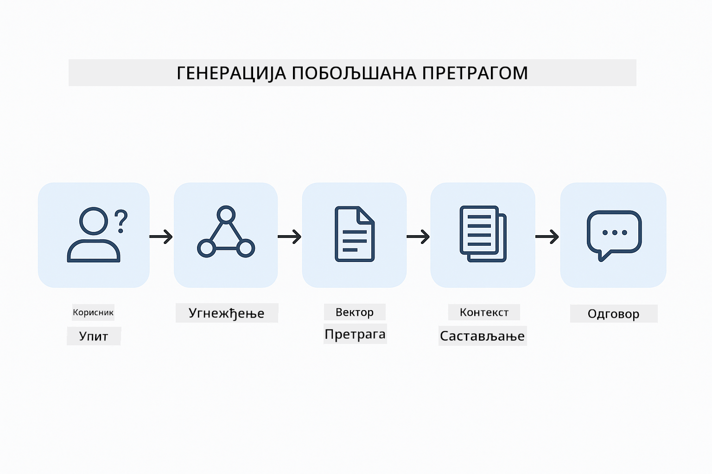
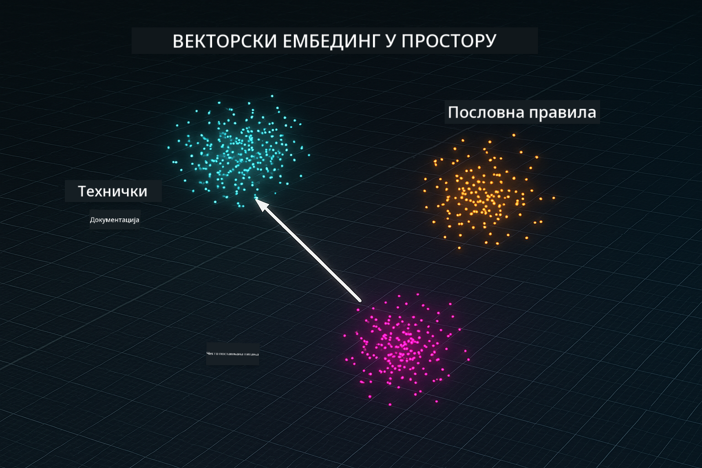
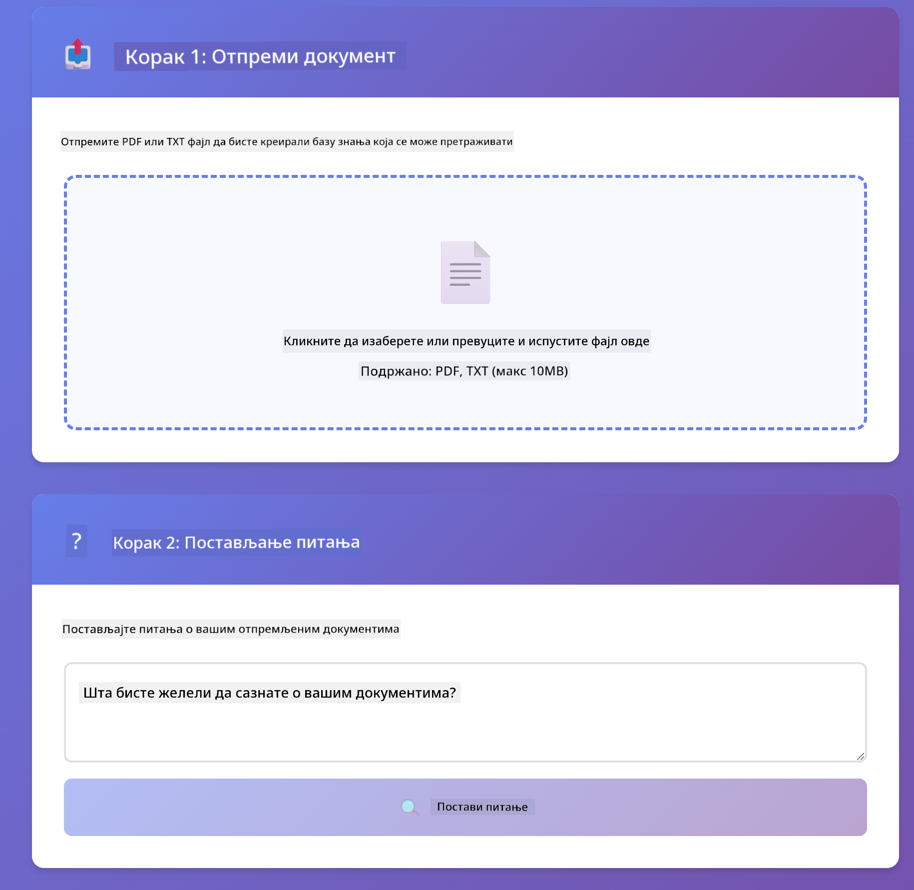
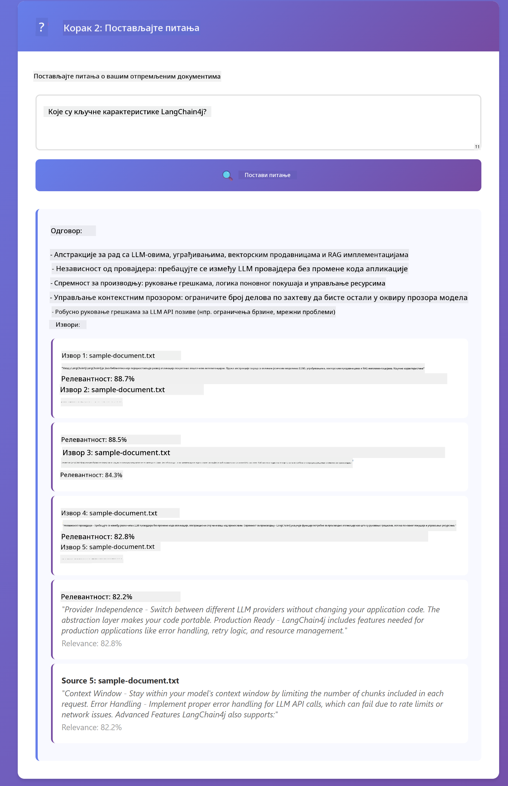

<!--
CO_OP_TRANSLATOR_METADATA:
{
  "original_hash": "81d087662fb3dd7b7124bce1a9c9ec86",
  "translation_date": "2026-01-06T01:17:03+00:00",
  "source_file": "03-rag/README.md",
  "language_code": "sr"
}
-->
# Модул 03: RAG (Ретривал-Ограничена Генерација)

## Садржај

- [Шта ћете научити](../../../03-rag)
- [Предуслови](../../../03-rag)
- [Разумевање RAG](../../../03-rag)
- [Како ради](../../../03-rag)
  - [Обрада докумената](../../../03-rag)
  - [Прављење угнежђених представки](../../../03-rag)
  - [Семантичка претрага](../../../03-rag)
  - [Генерација одговора](../../../03-rag)
- [Покрени апликацију](../../../03-rag)
- [Коришћење апликације](../../../03-rag)
  - [Отпреми документ](../../../03-rag)
  - [Постављај питања](../../../03-rag)
  - [Провери изворне референце](../../../03-rag)
  - [Експериментиши са питањима](../../../03-rag)
- [Кључни концепти](../../../03-rag)
  - [Стратегија растављања у делове](../../../03-rag)
  - [Скорови сличности](../../../03-rag)
  - [Рачунарска меморија за чување](../../../03-rag)
  - [Управљање контекстним прозором](../../../03-rag)
- [Када је RAG важан](../../../03-rag)
- [Следећи кораци](../../../03-rag)

## Шта ћете научити

У претходним модулима сте научили како да водите разговоре са вештачком интелигенцијом и како ефективно структуирате упите. Али постоји суштинско ограничење: модели језика знају само оно што су научили током тренинга. Не могу одговарати на питања у вези са политикама ваше компаније, документацијом о пројекту или било којим информацијама на којима нису тренирани.

RAG (Ретривал-Ограничена Генерација) решава овај проблем. Уместо да покушавате да модели учите ваше информације (што је скупо и непрактично), дајете му могућност да претражује ваше документе. Када неко постави питање, систем проналази релевантне информације и укључује их у упит. Модел онда одговара на основу тог пронађеног контекста.

Замислите RAG као да моделу дајете референтну библиотеку. Када поставите питање, систем:

1. **Кориснички упит** - Поставите питање  
2. **Угнежђавање** - Претвара ваше питање у вектор  
3. **Векторска претрага** - Проналази сличне делове документа  
4. **Састављање контекста** - Додаје релевантне делове у упит  
5. **Одговор** - LLM генерише одговор на основу контекста  

Ово утемељује одговоре модела у вашим стварним подацима уместо да се ослања на знање из тренинга или измишљене одговоре.



*RAG радни ток - од корисничког упита преко семантичке претраге до контекстуалне генерације одговора*

## Предуслови

- Завршен Модул 01 (дејлочне Azure OpenAI ресурсе имплементиране)  
- `.env` фајл у коренском директоријуму са Azure акредитивима (креиран од стране `azd up` у Модулу 01)

> **Напомена:** Ако нисте завршили Модул 01, прво пратите упутства за деплојмент тамо.

## Како ради

### Обрада докумената

[DocumentService.java](../../../03-rag/src/main/java/com/example/langchain4j/rag/service/DocumentService.java)

Када отпремите документ, систем га растењује у делове - мање комаде који се комотно уклапају у контекстни прозор модела. Ови делови се мало преклапају како се не би изгубио контекст на границама.

```java
Document document = FileSystemDocumentLoader.loadDocument("sample-document.txt");

DocumentSplitter splitter = DocumentSplitters
    .recursive(300, 30, new OpenAiTokenizer());

List<TextSegment> segments = splitter.split(document);
```
  
> **🤖 Испробајте са [GitHub Copilot](https://github.com/features/copilot) Чатом:** Отворите [`DocumentService.java`](../../../03-rag/src/main/java/com/example/langchain4j/rag/service/DocumentService.java) и питајте:  
> - "Како LangChain4j дели документе у делове и зашто је преклапање важно?"  
> - "Која је оптимална величина дела за различите типове докумената и зашто?"  
> - "Како да обрадим документе на више језика или са посебним форматирањем?"

### Прављење угнежђених представки

[LangChainRagConfig.java](../../../03-rag/src/main/java/com/example/langchain4j/rag/config/LangChainRagConfig.java)

Сваки део се претвара у нумеричку представу која се зове угнежђење - у основи математички отисак прста који хвата значење текста. Сличан текст производи слична угнежђења.

```java
@Bean
public EmbeddingModel embeddingModel() {
    return OpenAiOfficialEmbeddingModel.builder()
        .baseUrl(azureOpenAiEndpoint)
        .apiKey(azureOpenAiKey)
        .modelName(azureEmbeddingDeploymentName)
        .build();
}

EmbeddingStore<TextSegment> embeddingStore = 
    new InMemoryEmbeddingStore<>();
```
  


*Документи представљени као вектори у простору угнежђења - слични садржаји се групишу*

### Семантичка претрага

[RagService.java](../../../03-rag/src/main/java/com/example/langchain4j/rag/service/RagService.java)

Када поставите питање, и ваше питање постаје угнежђење. Систем упоређује угнежђење вашег питања са угнежђењима свих делова докумената. Проналази делове са најсличнијим значењем - не само по кључним речима, већ према стварној семантичкој сличности.

```java
Embedding queryEmbedding = embeddingModel.embed(question).content();

List<EmbeddingMatch<TextSegment>> matches = 
    embeddingStore.findRelevant(queryEmbedding, 5, 0.7);

for (EmbeddingMatch<TextSegment> match : matches) {
    String relevantText = match.embedded().text();
    double score = match.score();
}
```
  
> **🤖 Испробајте са [GitHub Copilot](https://github.com/features/copilot) Чатом:** Отворите [`RagService.java`](../../../03-rag/src/main/java/com/example/langchain4j/rag/service/RagService.java) и питајте:  
> - "Како ради претрага сличности са угнежђењима и шта одређује скор?"  
> - "Који праг сличности треба користити и како он утиче на резултате?"  
> - "Како се поступа када нема релевантних докумената?"

### Генерација одговора

[RagService.java](../../../03-rag/src/main/java/com/example/langchain4j/rag/service/RagService.java)

Најрелеватнији делови се укључују у упит моделу. Модел чита те конкретне делове и одговара на ваше питање на основу тих информација. Ово спречава халуцинације - модел може одговарати само на основу онога што је пред њим.

## Покрени апликацију

**Потврдите деплојмент:**

Проверите да `.env` фајл постоји у коренском директоријуму са Azure акредитивима (креирано током Модула 01):  
```bash
cat ../.env  # Треба приказати AZURE_OPENAI_ENDPOINT, API_KEY, DEPLOYMENT
```
  
**Покрени апликацију:**

> **Напомена:** Ако сте већ покренули све апликације користећи `./start-all.sh` из Модула 01, овај модул већ ради на порту 8081. Можете прескочити команде за покретање испод и директно отићи на http://localhost:8081.

**Опција 1: Коришћење Spring Boot Dashboard (препоручено за кориснике VS Code-а)**

Дев контейнер садржи екстензију Spring Boot Dashboard, која пружа визуелни интерфејс за управљање свим Spring Boot апликацијама. Можете је пронаћи у Activity Bar-у са леве стране VS Code-а (икона Spring Boot-а).

Из Spring Boot Dashboard-а можете:  
- Видети све расположиве Spring Boot апликације у радном простору  
- Покрени/заустави апликације једним кликом  
- Пратити логове апликација у реалном времену  
- Контролисати стање апликације

Само кликните на дугме за покретање поред "rag" да бисте покренули овај модул, или покрените све модуле одједном.


**Опција 2: Коришћење скрипти у шкољци**

Покрени све веб апликације (модуле 01-04):

**Bash:**  
```bash
cd ..  # Из коренског директоријума
./start-all.sh
```
  
**PowerShell:**  
```powershell
cd ..  # Из коренског директоријума
.\start-all.ps1
```
  
Или покрени само овај модул:

**Bash:**  
```bash
cd 03-rag
./start.sh
```
  
**PowerShell:**  
```powershell
cd 03-rag
.\start.ps1
```
  
Обе скрипте аутоматски учитавају променљиве окружења из коренског `.env` фајла и компајлирају JAR фајлове ако не постоје.

> **Напомена:** Ако више волите да ручно изградите све модуле пре покретања:  
>  
> **Bash:**  
> ```bash
> cd ..  # Go to root directory
> mvn clean package -DskipTests
> ```
  
> **PowerShell:**  
> ```powershell
> cd ..  # Go to root directory
> mvn clean package -DskipTests
> ```
  
Отворите http://localhost:8081 у вашем прегледачу.

**Да зауставите:**

**Bash:**  
```bash
./stop.sh  # Само овај модул
# Или
cd .. && ./stop-all.sh  # Сви модули
```
  
**PowerShell:**  
```powershell
.\stop.ps1  # Само овај модул
# Или
cd ..; .\stop-all.ps1  # Сви модули
```


## Коришћење апликације

Апликација пружа веб интерфејс за отпремање докумената и постављање питања.

<a href="images/rag-homepage.png"></a>

*Интерфејс RAG апликације - отпремите документе и постављајте питања*

### Отпреми документ

Започните отпремањем документа - TXT фајлови су најпогоднији за тестирање. У овом директоријуму је обезбеђен `sample-document.txt` који садржи информације о функцијама LangChain4j, имплементацији RAG и најбољим праксама - савршен за тестирање система.

Систем обрађује ваш документ, растењује га у делове и прави угнежђења за сваки део. Ово се дешава аутоматски када отпремите документ.

### Постављај питања

Сада постављајте специфична питања о садржају документа. Испробајте нешто фактичко што је јасно наведено у документу. Систем претражује релевантне делове, укључује их у упит и генерише одговор.

### Провери изворне референце

Приметите да сваки одговор укључује изворне референце са скором сличности. Ови скорови (од 0 до 1) показују колико је сваки део био релевантан вашем питању. Виши скорови значе боље подударање. Ово вам омогућава да проверите одговор у односу на изворне материјале.

<a href="images/rag-query-results.png"></a>

*Резултати упита који приказују одговор са изворним референцама и скорима релевантности*

### Експериментиши са питањима

Испробајте различите типове питања:  
- Специфичне чињенице: "Која је главна тема?"  
- Поређења: "Која је разлика између X и Y?"  
- Резиме: "Сажми главне тачке о З"

Пратите како се скорови релевантности мењају у зависности од тога колико ваше питање одговара садржају документа.

## Кључни концепти

### Стратегија растављања у делове

Документи се деле на делове од 300 токена са 30 токена преклапања. Ова равнотежа осигурава да сваки део има довољно контекста да буде значајан, а истовремено довољно мали да се у упит могу укључити више делова.

### Скорови сличности

Скорови се крећу од 0 до 1:  
- 0.7-1.0: Врло релевантно, тачан подударање  
- 0.5-0.7: Релевантно, добар контекст  
- Испод 0.5: Филтрирано као прениско, превише различито

Систем враћа само делове који су изнад минималног прага како би осигурао квалитет.

### Рачунарска меморија за чување

Овај модул користи чување у меморији ради једноставности. Када поново покренете апликацију, отпремљени документи се губе. Продукциони системи користе перзистентне векторске базе као што су Qdrant или Azure AI Search.

### Управљање контекстним прозором

Сваки модел има максималан контекстни прозор. Не можете укључити сваки део из великог документа. Систем преузима топ N најрелевантнијих делова (подразумевано 5) да остане унутар ограничења, а истовремено пружи довољно контекста за тачне одговоре.

## Када је RAG важан

**Користите RAG када:**  
- Одговарате на питања у вези са власничким документима  
- Информације се често мењају (политике, цене, спецификације)  
- Тачност захтева навођење извора  
- Садржај је превелик да стане у један упит  
- Требају вам проверљиви, утемељени одговори

**Не користите RAG када:**  
- Питања захтевају општа знања која модел већ поседује  
- Потребни су подаци у реалном времену (RAG ради само са отпремљеним документима)  
- Садржај је довољно мали да се укључи директно у упите

## Следећи кораци

**Следећи модул:** [04-tools - AI агенти са алаткама](../04-tools/README.md)

---

**Навигација:** [← Претходно: Модул 02 - Инжењеринг упита](../02-prompt-engineering/README.md) | [Назад на почетну](../README.md) | [Даље: Модул 04 - Алатке →](../04-tools/README.md)

---

<!-- CO-OP TRANSLATOR DISCLAIMER START -->
**Искључење одговорности**:
Овај документ је преведен помоћу AI услуге за превођење [Co-op Translator](https://github.com/Azure/co-op-translator). Иако се трудимо да превод буде прецизан, молимо имајте на уму да аутоматизовани преводи могу садржати грешке или нетачности. Оригинални документ на његовом матерњем језику треба сматрати ауторитетним извором. За кључне информације препоручује се професионалан људски превод. Немо смо одговорни за било каква неспоразума или погрешна тумачења која произилазе из коришћења овог превода.
<!-- CO-OP TRANSLATOR DISCLAIMER END -->