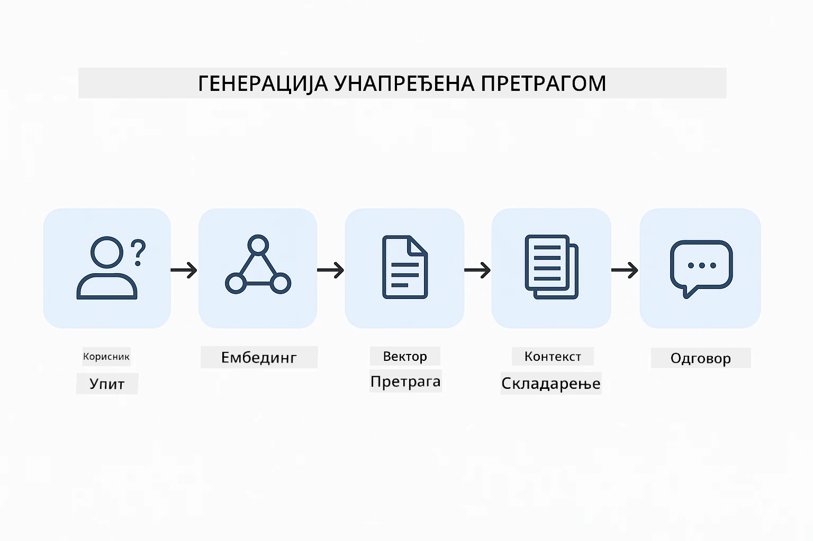
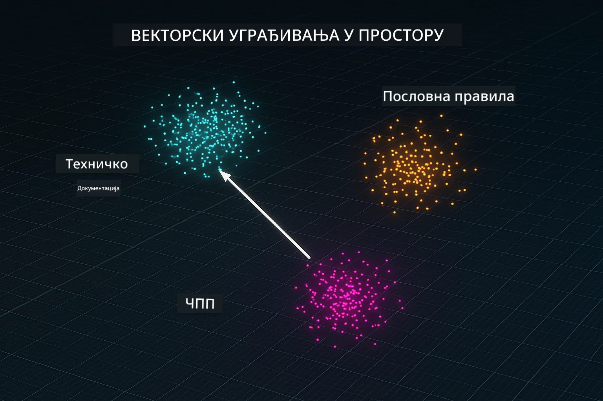
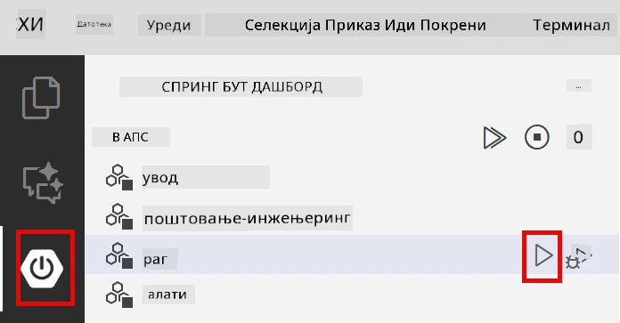
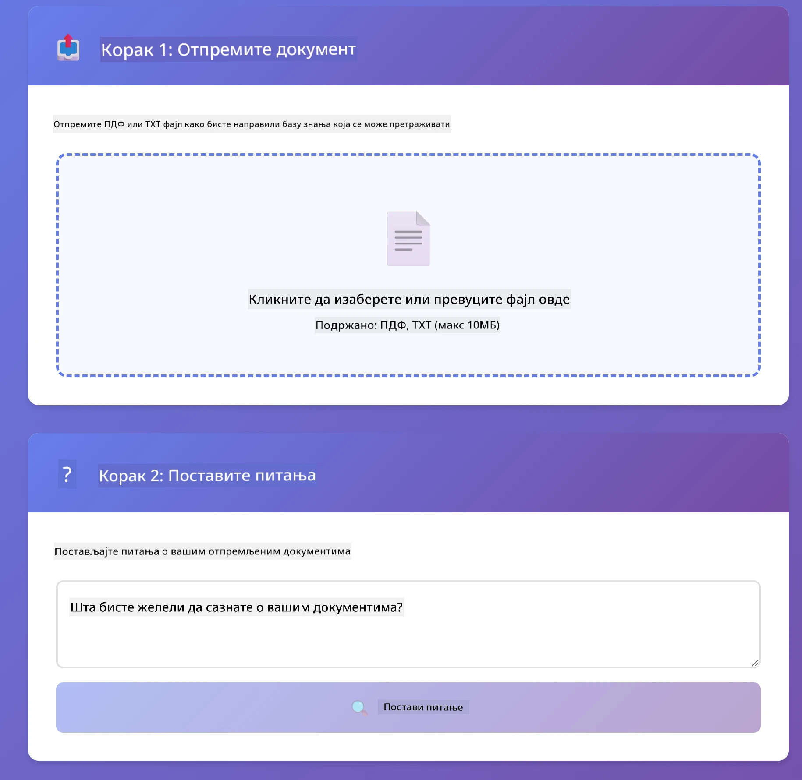
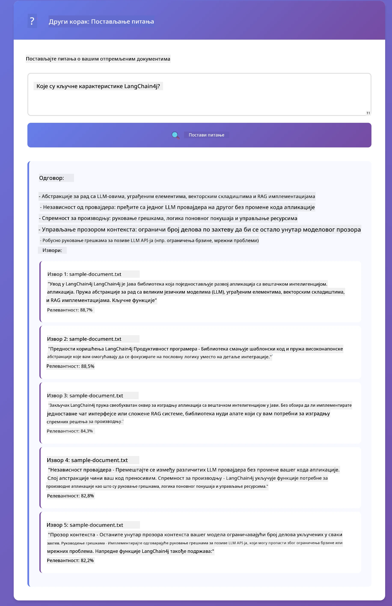

# Модул 03: RAG (Retrieval-Augmented Generation)

## Садржај

- [Видео водич](#видео-водич)
- [Шта ћете научити](#шта-ћете-научити)
- [Претпоставке](#претпоставке)
- [Разумевање RAG](#разумевање-rag)
  - [Који RAG приступ овај туторијал користи?](#који-rag-приступ-овај-туторијал-користи)
- [Како ради](#како-ради)
  - [Обрада докумената](#обрада-докумената)
  - [Креирање угнежђења](#креирање-угнежђења)
  - [Семантичка претрага](#семантичка-претрага)
  - [Генерисање одговора](#генерисање-одговора)
- [Покрени апликацију](#покретање-апликације)
- [Коришћење апликације](#коришћење-апликације)
  - [Отпреми документ](#отпремање-документа)
  - [Постави питања](#постављање-питања)
  - [Провери изворне референце](#провера-извора)
  - [Играј се са питањима](#експериментишите-са-питањима)
- [Кључни концепти](#кључни-појмови)
  - [Стратегија комадања](#стратегија-деловања-chunking)
  - [Скорови сличности](#оцене-сличности)
  - [Чување у меморији](#складиштење-у-меморији)
  - [Управљање прозором контекста](#управљање-прозором-контекста)
- [Када RAG значи](#када-је-rag-важан)
- [Следећи кораци](#следећи-кораци)

## Видео водич

Погледајте ову уживо сесију која објашњава како да започнете са овим модулом:

<a href="https://www.youtube.com/watch?v=_olq75ZH_eY"></a>

## Шта ћете научити

У претходним модулима сте учили како да водите разговоре са AI и како ефикасно структуирате своје упите. Али постоји основно ограничење: језички модели знају само оно што су научили током тренинга. Они не могу одговорити на питања о политикама ваше компаније, документацији пројекта или било којој информацији на којој нису тренирани.

RAG (Retrieval-Augmented Generation) решава овај проблем. Уместо да покушавате да модел научите вашим информацијама (што је скупо и непрактично), дајете му могућност да претражује ваше документе. Када неко постави питање, систем пронађе релевантне информације и укључује их у упит. Модел затим одговара на основу тог пронађеног контекста.

Замислите RAG као дајете моделу референтну библиотеку. Када питате питање, систем:

1. **Кориснички упит** - Ви постављате питање  
2. **Угнежђење** - Претвара ваше питање у вектор  
3. **Векторска претрага** - Проналази сличне делове докумената  
4. **Склапање контекста** - Додаје релевантне делове у упит  
5. **Одговор** - LLM генерише одговор на основу контекста  

Ово у основи оснажује одговоре модела да буду засновани на вашим стварним подацима уместо да се ослањају на знање из тренинга или да измисле одговоре.

## Претпоставке

- Завршен [Модул 01 - Увод](../01-introduction/README.md) (Azure OpenAI ресурси распоређени, укључујући модел угнежђења `text-embedding-3-small`)  
- `.env` фајл у коренском директоријуму са Azure акредитивима (креиран командом `azd up` у Модулу 01)  

> **Напомена:** Ако нисте завршили Модул 01, прво пратите инструкције за распоређивање ту. Команда `azd up` распоређује како GPT чат модел тако и модел угнежђења који користи овај модул.

## Разумевање RAG

Дијаграм испод илуструје основни концепт: уместо да се ослања само на податке из тренинга модела, RAG му даје референтну библиотеку ваших докумената коју може консултовати пре генерисања сваког одговора.


*Овај дијаграм показује разлику између стандардног LLM-а (који погађа на основу тренинг података) и RAG-подржаног LLM-а (који прво консултује ваше документе).*

Ево како делови повезују крај до краја. Корисничко питање пролази кроз четири фазе — угнежђење, векторску претрагу, састављање контекста и генерисање одговора — свака градећи на претходној:



*Овај дијаграм приказује крај-до-краја RAG проток — кориснички упит пролази кроз угнежђење, векторску претрагу, састављање контекста и генерисање одговора.*

Остатак овог модула детаљно описује сваки корак, са кодом који можете покренути и модификовати.

### Који RAG приступ овај туторијал користи?

LangChain4j нуди три начина за имплементацију RAG, сваки са различитим нивоом апстракције. Дијаграм испод их упоређује један поред другог:


*Овај дијаграм упоређује три LangChain4j RAG приступа — Easy, Native и Advanced — приказујући кључне компоненте и када их користити.*

| Приступ | Шта ради | Компромис |
|---|---|---|
| **Easy RAG** | Аутоматски повезује све преко `AiServices` и `ContentRetriever`. Анотирате интерфејс, повезујете ретеривер и LangChain4j у позадини управља угнежђивањем, претрагом и саставом упита. | Минималан код, али не видите шта се дешава у сваком кораку. |
| **Native RAG** | Ви зовете модел угнежђења, претражујете складиште, градите упит и генеришете одговор сами — корак по корак. | Више кода, али сваки корак је видљив и модификован. |
| **Advanced RAG** | Користи `RetrievalAugmentor` оквир са подесивим трансформерима упита, рутирањем, ре-рејкирањем и убризгавањем садржаја за производне пипелине. | Максимална флексибилност, али значајно сложеније. |

**Овај туторијал користи Native приступ.** Сваки корак RAG пипелина — угнежђење упита, претрага векторског складишта, састављање контекста и генерисање одговора — је јасно написан у [`RagService.java`](../../../03-rag/src/main/java/com/example/langchain4j/rag/service/RagService.java). Ово је намерно: као ресурс за учење, важније је да видите и разумете сваки корак него да код буде минималан. Када будете комфорни са тим како се делови уклапају, можете прећи на Easy RAG за брзе прототипове или Advanced RAG за производне системе.

> **💡 Занима вас Easy RAG?** LangChain4j такође нуди *Easy RAG* приступ где `AiServices` и `ContentRetriever` аутоматски управљају угнежђивањем, претрагом и саставом упита. Овај модул узима јаснији пут — отвара ту пипелину да бисте видели и контролисали сваки корак сами.

Дијаграм испод показује Easy RAG пипелин. Примајте како `AiServices` и `EmbeddingStoreContentRetriever` крију целу сложеност — учитавате документ, прикључујете ретеривер и добијате одговоре. Native приступ у овом модулу отвара те сакривене кораке:


*Овај дијаграм приказује Easy RAG пипелин. Упоредите ово са Native приступом који се користи у овом модулу: Easy RAG крије угнежђење, претрагу и састав упита иза `AiServices` и `ContentRetriever` — учитате документ, прикључујете ретеривер и добијате одговоре. Native приступ у овом модулу отвара ту пипелину тако да сами зовете сваки корак (угнежђуј, претражуј, састави контекст, генериши), пружајући пуну видљивост и контролу.*

## Како ради

RAG пипелин у овом модулу разлаже се на четири фазе које се извршавају секвенцијално сваки пут када корисник постави питање. Прво, отпремљени документ се **парсира и дели на делове** погодне величине. Ти делови се затим претварају у **векторска угнежђења** и чувају како би се могли математички упоређивати. Када стигне упит, систем врши **семантичку претрагу** да пронађе најрелевантније делове, и коначно их шаље као контекст LLM-у за **генерисање одговора**. Следећи одељци описују сваки корак са стварним кодом и дијаграмима. Погледајмо први корак.

### Обрада докумената

[DocumentService.java](../../../03-rag/src/main/java/com/example/langchain4j/rag/service/DocumentService.java)

Када отпремите документ, систем га парсира (PDF или текстом), придружује метаподатке попут имена фајла, и затим га дели на комаде — мање делове који лако стају у контекст прозора модела. Ти делови се благо преклапају како се не би изгубио контекст на границама.

```java
// Парсирај отпремљену датотеку и умотај је у LangChain4j Документ
Document document = Document.from(content, metadata);

// Подели на сегменте од 300 токена са преклапањем од 30 токена
DocumentSplitter splitter = DocumentSplitters
    .recursive(300, 30);

List<TextSegment> segments = splitter.split(document);
```

Дијаграм испод визуелно приказује како то функционише. Примећује се како сваки део дели неке токене са суседним — преклапање од 30 токена обезбеђује да ниједан важан контекст не падне између фрагмената:


*Овај дијаграм показује документ подељен на делове од 300 токена са преклапањем од 30 токена, очувајући контекст на границама делова.*

> **🤖 Пробајте са [GitHub Copilot](https://github.com/features/copilot) Chat:** Отворите [`DocumentService.java`](../../../03-rag/src/main/java/com/example/langchain4j/rag/service/DocumentService.java) и питајте:  
> - "Како LangChain4j дели документе на делове и зашто је преклапање важно?"  
> - "Која је оптимална величина делова за различите типове докумената и зашто?"  
> - "Како се носити с документима на више језика или са посебним форматирањем?"

### Креирање угнежђења

[LangChainRagConfig.java](../../../03-rag/src/main/java/com/example/langchain4j/rag/config/LangChainRagConfig.java)

Сваки део се претвара у нумерички приказ назван угнежђење — у суштини претварач смисла у бројеве. Модел угнежђења није „интелигентан“ као чат модел; не може да прати инструкције, закључује или одговара на питања. Оно што може да уради јесте да текст преслика у математички простор у којем слични смислови буду близу један другог — „ауто“ близу „путничко возило“, „политика повраћаја“ близу „враћање новца“. Замислите да је чат модел особа с којом можете причати; модел угнежђења је врло добар систем архивирања.

Дијаграм испод визуелизује овај концепт — убацује се текст, излазе нумерички вектори, а слични смислови производе векторе близу један другом:


*Овај дијаграм показује како модел угнежђења претвара текст у нумеричке векторе, постављајући сличне смислове — као „ауто“ и „путничко возило“ — блиско један другом у векторском простору.*

```java
@Bean
public EmbeddingModel embeddingModel() {
    return OpenAiOfficialEmbeddingModel.builder()
        .baseUrl(azureOpenAiEndpoint)
        .apiKey(azureOpenAiKey)
        .modelName(azureEmbeddingDeploymentName)
        .build();
}

EmbeddingStore<TextSegment> embeddingStore = 
    new InMemoryEmbeddingStore<>();
```

Дијаграм класа испод приказује два одвојена протока у RAG пипелину и LangChain4j класе које их имплементирају. **Проток учитавања** (врши се једном приликом при отпремању) дели документ, угнежђује делове и чува их преко `.addAll()`. **Проток упита** (врши се сваки пут када се постави питање) угнежђује питање, претражује складиште преко `.search()`, и прослеђује пронађени контекст модели за ћаскање. Оба протока се спајају преко заједничког интерфејса `EmbeddingStore<TextSegment>`:


*Овај дијаграм приказује два протока у RAG пипелину — учитавање и упит — и како се повезују преко заједничког EmbeddingStore.*

Када се угнежђења сачувају, сличан садржај природно групише близу у векторском простору. Визуелизација испод показује како документи о сродним темама завршавају као блиски тачки, што омогућава семантичку претрагу:



*Ова визуализација приказује како се сродни документи групишу у 3D векторском простору, са темама као што су Техничка документација, Пословна правила и Честа питања формирајући посебне групе.*

Када корисник претражује, систем следи четири корака: угнежђује документе једном, угнежђује упит при свакој претрази, упоређује упитни вектор са свим сачуваним векторима коришћењем косинусне сличности, и враћа топ-K најбоље оцењене делове. Дијаграм испод приказује сваки корак и LangChain4j класе укључене:


*Овај дијаграм приказује четворокорачан процес претраге угнежђења: угнежђује документе, угнежђује упит, упоређује векторе помоћу косинусне сличности и враћа топ-K резултате.*

### Семантичка претрага

[RagService.java](../../../03-rag/src/main/java/com/example/langchain4j/rag/service/RagService.java)

Када поставите питање, и ваше питање постаје угнежђење. Систем упоређује угнежђење вашег питања са угнежђењима свих делова документа. Пронађе делове са најсличнијим значењима — не само поклапајућим кључним речима, већ стварном семантичком сличношћу.

```java
Embedding queryEmbedding = embeddingModel.embed(question).content();

EmbeddingSearchRequest searchRequest = EmbeddingSearchRequest.builder()
    .queryEmbedding(queryEmbedding)
    .maxResults(5)
    .minScore(0.5)
    .build();

EmbeddingSearchResult<TextSegment> searchResult = embeddingStore.search(searchRequest);
List<EmbeddingMatch<TextSegment>> matches = searchResult.matches();

for (EmbeddingMatch<TextSegment> match : matches) {
    String relevantText = match.embedded().text();
    double score = match.score();
}
```

Дијаграм испод упоређује семантичку претрагу са традиционалном претрагом по кључним речима. Претрага кључном речју „возило“ пропушта део о „аутомобилима и камионима“, али семантичка претрага разуме да значе исто и враћа га као висококвалитетну сличност:


*Овај дијаграм пореди претрагу по кључним речима са семантичком претрагом, показујући како семантичка претрага враћа концептуално повезани садржај чак и када тачне кључне речи нису исте.*

Испод хаубе, сличност се мери коришћењем косинусне сличности — у суштини питајући се „да ли ова два стрелца показују у истом правцу?“ Два дела могу користити потпуно различите речи, али ако значе исту ствар, њихови вектори показују у истом правцу и имају ранг близу 1.0:


*Овај дијаграм илуструје косинусну сличност као угао између уграђених вектора — више поравнати вектори имају резултат ближи 1.0, што указује на већу семантичку сличност.*

> **🤖 Испробајте са [GitHub Copilot](https://github.com/features/copilot) Чатом:** Отворите [`RagService.java`](../../../03-rag/src/main/java/com/example/langchain4j/rag/service/RagService.java) и питајте:
> - "Како ради претрага по сличности са уграђивањима и шта одређује резултат?"
> - "Који праг сличности треба да користим и како он утиче на резултате?"
> - "Како да поступим у случајевима када не нађем релевантне документе?"

### Генерисање одговора

[RagService.java](../../../03-rag/src/main/java/com/example/langchain4j/rag/service/RagService.java)

Најрелевантнији делови се састављају у структуриран упит који укључује експлицитна упутства, преузети контекст и корисничко питање. Модел чита те одређене делове и одговара на основу тих информација — може користити само оно што је испред њега, што спречава халуцинације.

```java
String context = matches.stream()
    .map(match -> match.embedded().text())
    .collect(Collectors.joining("\n\n"));

String prompt = String.format("""
    Answer the question based on the following context.
    If the answer cannot be found in the context, say so.

    Context:
    %s

    Question: %s

    Answer:""", context, request.question());

String answer = chatModel.chat(prompt);
```

Дијаграм испод показује ову скупштину на делу — делови са највишим оценама из фазе претраге убацују се у шаблон упита, а `OpenAiOfficialChatModel` генерише поткрепљен одговор:


*Овај дијаграм показује како се делови са највишим оценама скупљају у структуриран упит, омогућавајући моделу да генерише поткрепљен одговор из ваших података.*

## Покретање апликације

**Проверите распоређивање:**

Проверите да ли је датотека `.env` присутна у коренском директоријуму са Azure акредитивима (направљена током Модула 01). Покрените ово из директоријума модула (`03-rag/`):

**Bash:**
```bash
cat ../.env  # Треба да покаже AZURE_OPENAI_ENDPOINT, API_KEY, DEPLOYMENT
```

**PowerShell:**
```powershell
Get-Content ..\.env  # Треба да прикаже AZURE_OPENAI_ENDPOINT, API_KEY, DEPLOYMENT
```

**Покрените апликацију:**

> **Напомена:** Ако сте већ покренули све апликације користећи `./start-all.sh` из коренског директоријума (као што је описано у Модулу 01), овај модул већ ради на порту 8081. Можете прескочити наредбе за покретање испод и директно отићи на http://localhost:8081.

**Опција 1: Коришћење Spring Boot командне табле (Препоручено за кориснике VS Code-а)**

Дев контейнер укључује проширење Spring Boot командне табле, које пружа визуелни интерфејс за управљање свим Spring Boot апликацијама. Можете га пронаћи у траци активности са леве стране VS Code-а (потражите иконицу Spring Boot-а).

Из Spring Boot командне табле можете:
- Видети све доступне Spring Boot апликације у радном простору
- Покретати/заустављати апликације једним кликом
- Прегледати записе апликација у реалном времену
- Пратити статус апликација

Једноставно кликните на дугме за покретање поред "rag" да бисте покренули овај модул, или покрените све модуле одједном.



*Слика екрана приказује Spring Boot командну таблу у VS Code-у, где можете визуелно покретати, заустављати и пратити апликације.*

**Опција 2: Коришћење скрипти за шкољку**

Покрените све веб апликације (модули 01-04):

**Bash:**
```bash
cd ..  # Из коренског директоријума
./start-all.sh
```

**PowerShell:**
```powershell
cd ..  # Из коренског директоријума
.\start-all.ps1
```

Или покрените само овај модул:

**Bash:**
```bash
cd 03-rag
./start.sh
```

**PowerShell:**
```powershell
cd 03-rag
.\start.ps1
```

Обa скрипте аутоматски учитавају променљиве окружења из коренске `.env` датотеке и граде JAR фајлове ако не постоје.

> **Напомена:** Ако више волите да ручно изградите све модуле пре покретања:
>
> **Bash:**
> ```bash
> cd ..  # Go to root directory
> mvn clean package -DskipTests
> ```
>
> **PowerShell:**
> ```powershell
> cd ..  # Go to root directory
> mvn clean package -DskipTests
> ```

Отворите http://localhost:8081 у вашем прегледачу.

**За заустављање:**

**Bash:**
```bash
./stop.sh  # Само овај модул
# Или
cd .. && ./stop-all.sh  # Сви модули
```

**PowerShell:**
```powershell
.\stop.ps1  # Само овај модул
# Или
cd ..; .\stop-all.ps1  # Сви модули
```

## Коришћење апликације

Апликација пружа веб интерфејс за отпремање докумената и постављање питања.

<a href="images/rag-homepage.png"></a>

*Овај снимак екрана приказује интерфејс RAG апликације у којој отпремате документе и постављате питања.*

### Отпремање документа

Почните са отпремањем документа — TXT фајлови најбоље функционишу за тестирање. У овом директоријуму је обезбеђен фајл `sample-document.txt` који садржи информације о функцијама LangChain4j, RAG имплементацији и најбољим праксама — идеално за тестирање система.

Систем обрађује ваш документ, дели га на делове и креира уграђивања за сваки део. Ово се дешава аутоматски при отпремању.

### Постављање питања

Сада поставите специфична питања о садржају документа. Покушајте са чињеничним питањима која су јасно наведена у документу. Систем претражује релевантне делове, укључује их у упит и генерише одговор.

### Провера извора

Приметите да сваки одговор укључује референце извора са оценама сличности. Ове оцене (од 0 до 1) показују колико је сваки део био релевантан вашем питању. Више оцене значе боље поклапање. Ово вам омогућава да проверите одговор у односу на изворни материјал.

<a href="images/rag-query-results.png"></a>

*Овај снимак екрана показује резултате претраге са генерисаним одговором, изворним референцама и оценама релевантности за сваки повучени део.*

### Експериментишите са питањима

Пробајте различите типове питања:
- Специфичне чињенице: "Која је главна тема?"
- Поређења: "Која је разлика између X и Y?"
- Сажецима: "Сажми кључне тачке о Z"

Пратите како оцене релевантности мењају у зависности од тога колико ваше питање одговара садржају документа.

## Кључни појмови

### Стратегија деловања (Chunking)

Документи се деле на делове од 300 токена са преклапањем од 30 токена. Ова равнотежа обезбеђује да сваки део има довољан контекст да буде смислен, а да истовремено буде довољно мали да се у упит може укључити више делова.

### Оцене сличности

Сваки повучени део долази са оценом сличности између 0 и 1 која указује колико добро одговара корисниковом питању. Дијаграм испод визуализује распоне оцена и како их систем користи за филтрирање резултата:


*Овај дијаграм показује распоне оцена од 0 до 1, са минималним праком од 0.5 који филтрира нерелевантне делове.*

Оцене се крећу од 0 до 1:
- 0.7-1.0: Врло релевантно, тачна поклапања
- 0.5-0.7: Релевантно, добар контекст
- Испод 0.5: Филтрирано, превише различито

Систем преузима само делове изнад минималног прага како би обезбедио квалитет.

Уграђивања добро раде када се значења јасно класификују, али имају своје слепе тачке. Дијаграм испод показује уобичајене начине пропуста — превелики делови производе мутне векторе, премали делови немају довољно контекста, двосмислени термини упућују на више кластера, а тачна поклапања (ИД-и, бројеви делова) уопште не функционишу са уграђивањима:


*Овај дијаграм показује уобичајене начине пропуста уграђивања: превелики делови, премали делови, двосмислени термини који упућују на више кластера и тачна поклапања као што су ИД-ови.*

### Складиштење у меморији

Овај модул користи складиштење у меморији због једноставности. Када поново покренете апликацију, отпремљени документи се губе. Продукцијски системи користе перзистентне векторске базе података као што су Qdrant или Azure AI Search.

### Управљање прозором контекста

Сваки модел има максимални прозор контекста. Не можете укључити сваки део из великог документа. Систем преузима најрелевантнијих N делова (подразумевано 5) да остане у границама, а истовремено пружи довољно контекста за тачне одговоре.

## Када је RAG важан

RAG није увек прави приступ. Водич за одлучивање испод вам помаже да утврдите када RAG доноси вредност, а када су једноставнији приступи — као што је укључивање садржаја директно у упит или ослањање на уграђено знање модела — довољни:


*Овај дијаграм показује водич за одлучивање када RAG доноси вредност у односу на када су једноставнији приступи довољни.*

## Следећи кораци

**Следећи модул:** [04-tools - AI агенти са алатима](../04-tools/README.md)

---

**Навигација:** [← Претходно: Модул 02 - Продужење упита](../02-prompt-engineering/README.md) | [Назад на Главно](../README.md) | [Следеће: Модул 04 - Алатке →](../04-tools/README.md)

---

<!-- CO-OP TRANSLATOR DISCLAIMER START -->
**Изјава о одрицању одговорности**:
Овај документ је преведен коришћењем услуге за аутоматски превод [Co-op Translator](https://github.com/Azure/co-op-translator). Иако тежимо тачности, имајте у виду да аутоматски преводи могу садржати грешке или нетачности. Оригинални документ на његовом изворном језику треба сматрати ауторитативним извором. За критичне информације препоручује се професионални људски превод. Нисмо одговорни за било каква неспоразума или погрешна тумачења која произилазе из коришћења овог превода.
<!-- CO-OP TRANSLATOR DISCLAIMER END -->