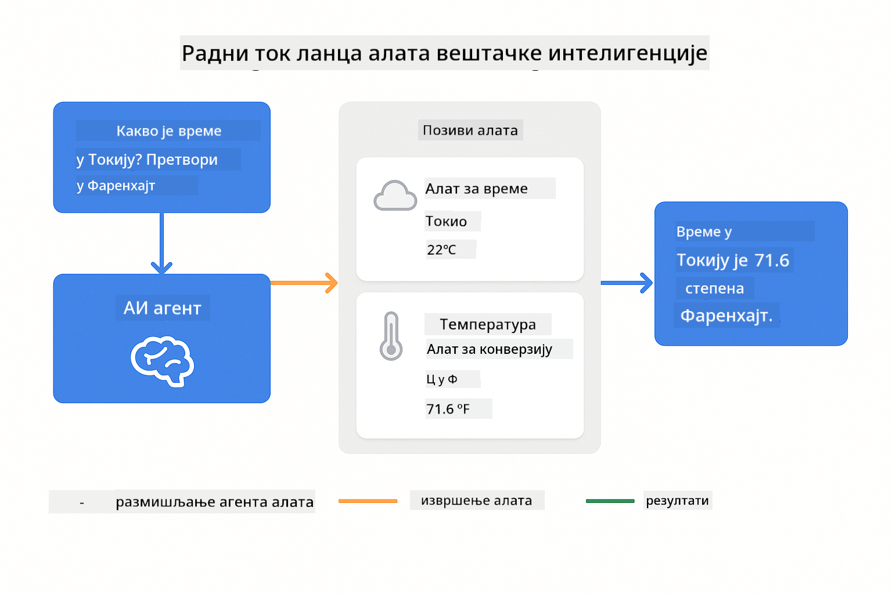

<!--
CO_OP_TRANSLATOR_METADATA:
{
  "original_hash": "aa23f106e7f53270924c9dd39c629004",
  "translation_date": "2025-12-13T19:24:39+00:00",
  "source_file": "04-tools/README.md",
  "language_code": "sr"
}
-->
# Модул 04: AI агенти са алаткама

## Садржај

- [Шта ћете научити](../../../04-tools)
- [Претпоставке](../../../04-tools)
- [Разумевање AI агената са алаткама](../../../04-tools)
- [Како функционише позивање алатки](../../../04-tools)
  - [Дефиниције алатки](../../../04-tools)
  - [Доношење одлука](../../../04-tools)
  - [Извршење](../../../04-tools)
  - [Генерисање одговора](../../../04-tools)
- [Повезивање алатки](../../../04-tools)
- [Покретање апликације](../../../04-tools)
- [Коришћење апликације](../../../04-tools)
  - [Испробајте једноставну употребу алатки](../../../04-tools)
  - [Тестирајте повезивање алатки](../../../04-tools)
  - [Погледајте ток разговора](../../../04-tools)
  - [Посматрајте разлоге](../../../04-tools)
  - [Експериментишите са различитим захтевима](../../../04-tools)
- [Кључни појмови](../../../04-tools)
  - [ReAct образац (размишљање и деловање)](../../../04-tools)
  - [Опис алатки је важан](../../../04-tools)
  - [Управљање сесијом](../../../04-tools)
  - [Руковање грешкама](../../../04-tools)
- [Доступне алатке](../../../04-tools)
- [Када користити агенте засноване на алаткама](../../../04-tools)
- [Следећи кораци](../../../04-tools)

## Шта ћете научити

До сада сте научили како водити разговоре са AI, како ефикасно структуирати упите и како ослонити одговоре на ваше документе. Али постоји основно ограничење: језички модели могу само генерисати текст. Не могу проверити време, извршити прорачуне, упитати базе података или комуницирати са спољним системима.

Алатке то мењају. Давањем модулу приступа функцијама које може позивати, претварате га из генератора текста у агента који може предузимати акције. Модел одлучује када му је потребна алатка, коју алатку да користи и које параметре да проследи. Ваш код извршава функцију и враћа резултат. Модел укључује тај резултат у свој одговор.

## Претпоставке

- Завршен Модул 01 (деплојовани Azure OpenAI ресурси)
- `.env` фајл у коренском директоријуму са Azure акредитивима (направљен помоћу `azd up` у Модулу 01)

> **Напомена:** Ако нисте завршили Модул 01, прво пратите упутства за деплој.

## Разумевање AI агената са алаткама

AI агент са алаткама прати образац размишљања и деловања (ReAct):

1. Корисник поставља питање
2. Агент размишља шта треба да зна
3. Агент одлучује да ли му треба алатка за одговор
4. Ако да, агент позива одговарајућу алатку са правим параметрима
5. Алатка извршава и враћа податке
6. Агент укључује резултат и даје коначни одговор


*ReAct образац - како AI агенти наизменично размишљају и делују да реше проблеме*

Ово се дешава аутоматски. Ви дефинишете алатке и њихове описе. Модел управља доношењем одлука о томе када и како их користити.

## Како функционише позивање алатки

**Дефиниције алатки** - [WeatherTool.java](../../../04-tools/src/main/java/com/example/langchain4j/agents/tools/WeatherTool.java) | [TemperatureTool.java](../../../04-tools/src/main/java/com/example/langchain4j/agents/tools/TemperatureTool.java)

Дефинишете функције са јасним описима и спецификацијама параметара. Модел види те описе у свом системском упиту и разуме шта свака алатка ради.

```java
@Component
public class WeatherTool {
    
    @Tool("Get the current weather for a location")
    public String getCurrentWeather(@P("Location name") String location) {
        // Ваша логика за претрагу времена
        return "Weather in " + location + ": 22°C, cloudy";
    }
}

@AiService
public interface Assistant {
    String chat(@MemoryId String sessionId, @UserMessage String message);
}

// Асистент је аутоматски повезан од стране Spring Boot-а са:
// - ChatModel бином
// - Све @Tool методе из @Component класа
// - ChatMemoryProvider за управљање сесијом
```

> **🤖 Испробајте са [GitHub Copilot](https://github.com/features/copilot) Chat:** Отворите [`WeatherTool.java`](../../../04-tools/src/main/java/com/example/langchain4j/agents/tools/WeatherTool.java) и питајте:
> - "Како бих интегрисао прави API за време као OpenWeatherMap уместо лажних података?"
> - "Шта чини добар опис алатке који помаже AI да је исправно користи?"
> - "Како да руковам грешкама API-ја и ограничењима у позивима у имплементацијама алатки?"

**Доношење одлука**

Када корисник пита "Какво је време у Сијетлу?", модел препознаје да му треба алатка за време. Генерише позив функције са параметром локације постављеним на "Сијетл".

**Извршење** - [AgentService.java](../../../04-tools/src/main/java/com/example/langchain4j/agents/service/AgentService.java)

Spring Boot аутоматски повезује декларативни интерфејс `@AiService` са свим регистрованим алаткама, а LangChain4j аутоматски извршава позиве алатки.

> **🤖 Испробајте са [GitHub Copilot](https://github.com/features/copilot) Chat:** Отворите [`AgentService.java`](../../../04-tools/src/main/java/com/example/langchain4j/agents/service/AgentService.java) и питајте:
> - "Како функционише ReAct образац и зашто је ефикасан за AI агенте?"
> - "Како агент одлучује коју алатку да користи и у ком редоследу?"
> - "Шта се дешава ако извршење алатке не успе - како да робусно руковам грешкама?"

**Генерисање одговора**

Модел прими податке о времену и форматира их у природан језик као одговор кориснику.

### Зашто користити декларативне AI сервисе?

Овај модул користи LangChain4j интеграцију са Spring Boot-ом и декларативне `@AiService` интерфејсе:

- **Spring Boot аутоматско повезивање** - ChatModel и алатке аутоматски убризгани
- **@MemoryId образац** - Аутоматско управљање меморијом заснованом на сесији
- **Једна инстанца** - Асистент креиран једном и поново коришћен за боље перформансе
- **Типски безбедно извршење** - Java методе позиване директно са конверзијом типова
- **Оркестрација више корака** - Аутоматски управља повезивањем алатки
- **Нема сувишног кода** - Без ручних позива AiServices.builder() или меморијских HashMap

Алтернативни приступи (ручно `AiServices.builder()`) захтевају више кода и немају предности Spring Boot интеграције.

## Повезивање алатки

**Повезивање алатки** - AI може позвати више алатки узастопно. Питајте "Какво је време у Сијетлу и да ли да понесем кишобран?" и гледајте како повезује `getCurrentWeather` са размишљањем о кишној опреми.

<a href="images/tool-chaining.png"></a>

*Узастопни позиви алатки - излаз једне алатке улази у следећу одлуку*

**Глатке грешке** - Питајте за време у граду који није у лажним подацима. Алатка враћа поруку о грешци, а AI објашњава да не може помоћи. Алатке безбедно не успевају.

Ово се дешава у једном кораку разговора. Агент аутономно оркестрира више позива алатки.

## Покретање апликације

**Проверите деплој:**

Уверите се да `.env` фајл постоји у коренском директоријуму са Azure акредитивима (направљен током Модула 01):
```bash
cat ../.env  # Треба да прикаже AZURE_OPENAI_ENDPOINT, API_KEY, DEPLOYMENT
```

**Покрените апликацију:**

> **Напомена:** Ако сте већ покренули све апликације користећи `./start-all.sh` из Модула 01, овај модул већ ради на порту 8084. Можете прескочити наредбе за покретање и директно отићи на http://localhost:8084.

**Опција 1: Коришћење Spring Boot Dashboard-а (препоручено за кориснике VS Code-а)**

Dev контејнер укључује екстензију Spring Boot Dashboard која пружа визуелни интерфејс за управљање свим Spring Boot апликацијама. Можете је пронаћи у Activity Bar-у са леве стране VS Code-а (потражите иконицу Spring Boot-а).

Из Spring Boot Dashboard-а можете:
- Видети све доступне Spring Boot апликације у радном простору
- Покренути/зауставити апликације једним кликом
- Пратити логове апликација у реалном времену
- Надгледати статус апликација

Једноставно кликните на дугме за покретање поред "tools" да бисте покренули овај модул, или покрените све модуле одједном.


**Опција 2: Коришћење shell скрипти**

Покрените све веб апликације (модуле 01-04):

**Bash:**
```bash
cd ..  # Из коренског директоријума
./start-all.sh
```

**PowerShell:**
```powershell
cd ..  # Из коренског директоријума
.\start-all.ps1
```

Или покрените само овај модул:

**Bash:**
```bash
cd 04-tools
./start.sh
```

**PowerShell:**
```powershell
cd 04-tools
.\start.ps1
```

Обе скрипте аутоматски учитавају променљиве окружења из коренског `.env` фајла и изградиће JAR-ове ако не постоје.

> **Напомена:** Ако више волите да ручно изградите све модуле пре покретања:
>
> **Bash:**
> ```bash
> cd ..  # Go to root directory
> mvn clean package -DskipTests
> ```
>
> **PowerShell:**
> ```powershell
> cd ..  # Go to root directory
> mvn clean package -DskipTests
> ```

Отворите http://localhost:8084 у вашем прегледачу.

**За заустављање:**

**Bash:**
```bash
./stop.sh  # Само овај модул
# Или
cd .. && ./stop-all.sh  # Сви модули
```

**PowerShell:**
```powershell
.\stop.ps1  # Само овај модул
# Или
cd ..; .\stop-all.ps1  # Сви модули
```

## Коришћење апликације

Апликација пружа веб интерфејс где можете комуницирати са AI агентом који има приступ алаткама за време и конверзију температуре.

<a href="images/tools-homepage.png"></a>

*Интерфејс AI агента са алаткама - брзи примери и чат интерфејс за интеракцију са алаткама*

**Испробајте једноставну употребу алатки**

Почните са једноставним захтевом: "Претвори 100 степени Фаренхајта у Целзијус". Агент препознаје да му треба алатка за конверзију температуре, позива је са правим параметрима и враћа резултат. Приметите колико је природно - нисте навели коју алатку да користи или како да је позове.

**Тестирајте повезивање алатки**

Сада испробајте нешто сложеније: "Какво је време у Сијетлу и претвори га у Фаренхајт?" Гледајте како агент ради корак по корак. Прво добија време (које је у Целзијусима), препознаје да треба да конвертује у Фаренхајт, позива алатку за конверзију и комбинује оба резултата у један одговор.

**Погледајте ток разговора**

Чат интерфејс чува историју разговора, омогућавајући вам вишекратне интеракције. Можете видети све претходне упите и одговоре, што олакшава праћење разговора и разумевање како агент гради контекст кроз више размена.

<a href="images/tools-conversation-demo.png"></a>

*Вишекратни разговор који показује једноставне конверзије, претраге времена и повезивање алатки*

**Експериментишите са различитим захтевима**

Испробајте различите комбинације:
- Претраге времена: "Какво је време у Токију?"
- Конверзије температуре: "Колико је 25°C у Келвину?"
- Комбиновани упити: "Провери време у Паризу и реци ми да ли је изнад 20°C"

Приметите како агент тумачи природни језик и мапира га на одговарајуће позиве алатки.

## Кључни појмови

**ReAct образац (размишљање и деловање)**

Агент наизменично размишља (одлучује шта да ради) и делује (користи алатке). Овај образац омогућава аутономно решавање проблема уместо само одговарања на инструкције.

**Опис алатки је важан**

Квалитет описа ваших алатки директно утиче на то колико их агент добро користи. Јасни, специфични описи помажу моделу да разуме када и како да позове сваку алатку.

**Управљање сесијом**

Анотација `@MemoryId` омогућава аутоматско управљање меморијом заснованом на сесији. Сваки ID сесије добија своју инстанцу `ChatMemory` коју управља bean `ChatMemoryProvider`, елиминишући потребу за ручним праћењем меморије.

**Руковање грешкама**

Алатке могу да не успеју - API-ји могу истећи, параметри могу бити неважећи, спољни сервиси могу бити недоступни. Продукциони агенти треба да имају руковање грешкама како би модел могао да објасни проблеме или покуша алтернативе.

## Доступне алатке

**Алатке за време** (лажни подаци за демонстрацију):
- Добијање тренутног времена за локацију
- Добијање прогнозе за више дана

**Алатке за конверзију температуре**:
- Целзијус у Фаренхајт
- Фаренхајт у Целзијус
- Целзијус у Келвин
- Келвин у Целзијус
- Фаренхајт у Келвин
- Келвин у Фаренхајт

Ово су једноставни примери, али образац се проширује на било коју функцију: упите база података, API позиве, прорачуне, рад са фајловима или системске команде.

## Када користити агенте засноване на алаткама

**Користите алатке када:**
- Одговор захтева податке у реалном времену (време, цене акција, залихе)
- Треба извршити прорачуне изван једноставне математике
- Приступате базама података или API-јима
- Предузимате акције (слање имејлова, креирање тикета, ажурирање записа)
- Комбинујете више извора података

**Не користите алатке када:**
- Питања се могу одговорити из општих знања
- Одговор је искључиво разговорни
- Латенција алатки би учинила искуство превише спорим

## Следећи кораци

**Следећи модул:** [05-mcp - Model Context Protocol (MCP)](../05-mcp/README.md)

---

**Навигација:** [← Претходни: Модул 03 - RAG](../03-rag/README.md) | [Назад на почетак](../README.md) | [Следећи: Модул 05 - MCP →](../05-mcp/README.md)

---

<!-- CO-OP TRANSLATOR DISCLAIMER START -->
**Одрицање од одговорности**:
Овај документ је преведен коришћењем AI услуге за превођење [Co-op Translator](https://github.com/Azure/co-op-translator). Иако се трудимо да превод буде тачан, имајте у виду да аутоматски преводи могу садржати грешке или нетачности. Оригинални документ на његовом изворном језику треба сматрати ауторитетним извором. За критичне информације препоручује се професионални људски превод. Нисмо одговорни за било каква неспоразума или погрешна тумачења која произилазе из коришћења овог превода.
<!-- CO-OP TRANSLATOR DISCLAIMER END -->