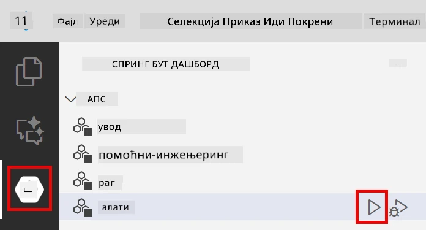
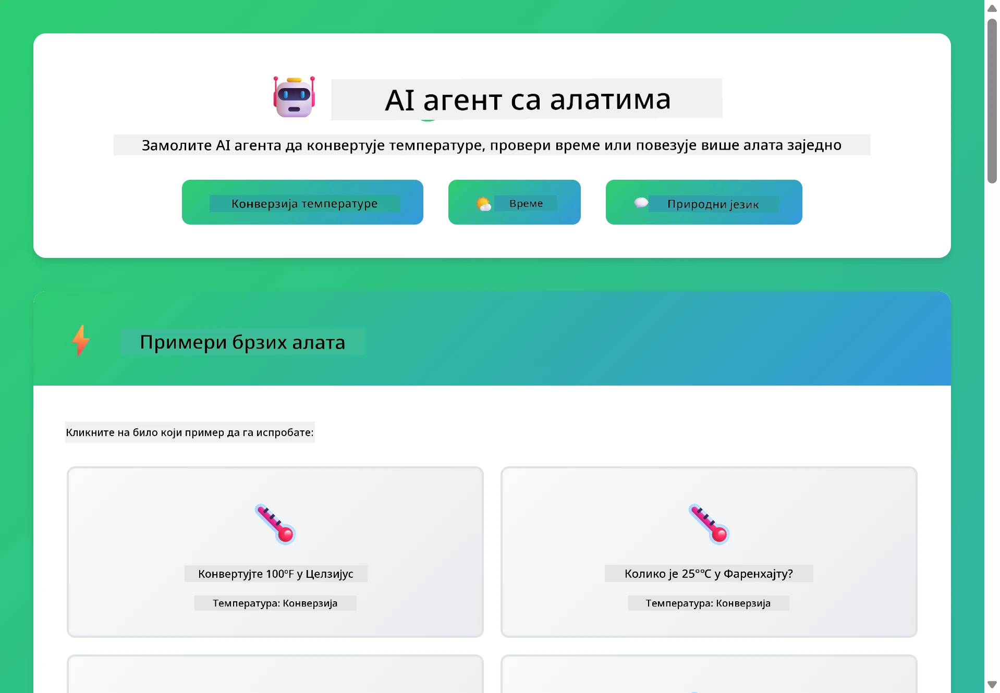
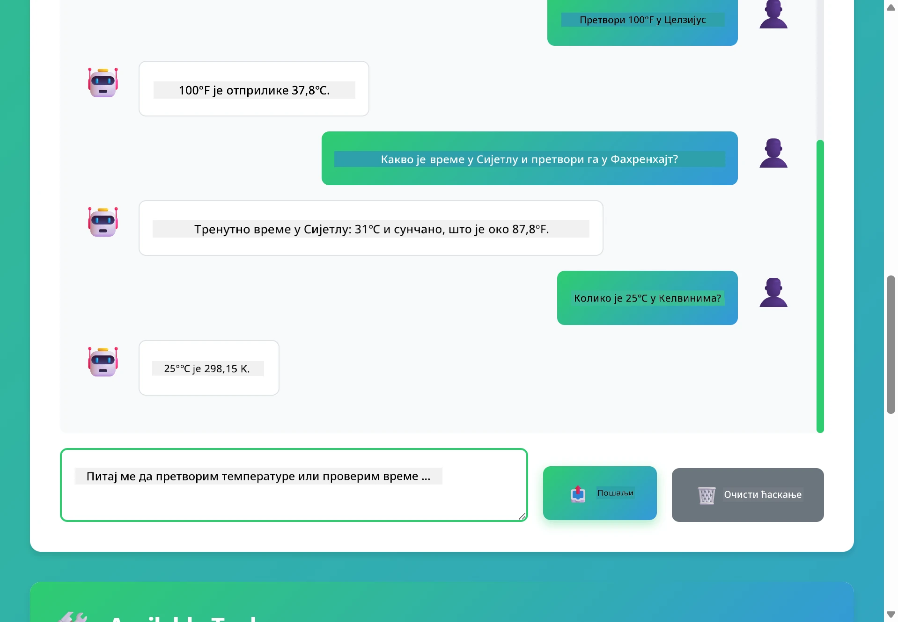

# Модул 04: AI агенти са алатима

## Садржај

- [Видео водич](#видео-водич)
- [Шта ћете научити](#шта-ћете-научити)
- [Пре захтеви](#пре-захтеви)
- [Разумевање AI агената са алатима](#разумевање-ai-агената-са-алатима)
- [Како позив алата функционише](#како-позив-алата-функционише)
  - [Дефиниције алата](#дефиниције-алата)
  - [Доносити одлуке](#доносити-одлуке)
  - [Извршење](#извршење)
  - [Генерисање одговора](#генерисање-одговора)
  - [Архитектура: Spring Boot аутоматско повезивање](#архитектура-spring-boot-аутоматско-повезивање)
- [Повезивање алата](#повезивање-алата)
- [Покрени апликацију](#покрени-апликацију)
- [Коришћење апликације](#коришћење-апликације)
  - [Испробајте једноставну употребу алата](#испробајте-једноставно-коришћење-алата)
  - [Тестирајте повезивање алата](#тестирајте-повезивање-алата)
  - [Погледајте ток разговора](#погледајте-ток-разговора)
  - [Експериментишите са различитим захтевима](#испробајте-различите-захтеве)
- [Кључни концепти](#кључни-појмови)
  - [ReAct образац (Размишљање и Деловање)](#react-шаблон-размишљање-и-деловање)
  - [Опис алата је важан](#описи-алата-су-важни)
  - [Управљање сесијом](#управљање-сесијом)
  - [Руковање грешкама](#руковање-грешкама)
- [Доступни алати](#доступни-алати)
- [Када користити агенте базиране на алатима](#када-користити-агенте-засноване-на-алатима)
- [Алатке насупрот RAG](#алати-и-rag)
- [Следећи кораци](#следећи-кораци)

## Видео водич

Погледајте ову уживо сесију која објашњава како започети са овим модулом:

<a href="https://www.youtube.com/watch?v=O_J30kZc0rw"></a>

## Шта ћете научити

До сада сте научили како водити разговоре са AI, како ефективно структуирати упите и како засновати одговоре на вашим документима. Али постоји основно ограничење: језички модели могу само да генеришу текст. Они не могу да провере време, израчунају, упитују базе података или комуницирају са спољним системима.

Алатке мењају то. Давањем модулу приступа функцијама које може позивати, претварате га из генератора текста у агента који може предузимати радње. Модел одлучује када му је потребан алат, који алат да користи и које параметре да проследи. Ваш код извршава ту функцију и враћа резултат. Модел укључује тај резултат у свој одговор.

## Пре захтеви

- Завршен [Модул 01 - Увод](../01-introduction/README.md) (Azure OpenAI ресурси постављени)
- Препоручени претходни модули завршени (овај модул се ослања на [RAG концепте из Модула 03](../03-rag/README.md) у поређењу алатки и RAG)
- `.env` фајл у корену директоријума са Azure акредитивима (направљен командом `azd up` у Модулу 01)

> **Напомена:** Ако нисте завршили Модул 01, прво пратите упутства за деплои.

## Разумевање AI агената са алатима

> **📝 Напомена:** Пojам "агенти" у овом модулу се односи на AI асистенте побољшане способностима позивања алата. Ово се разликује од **Agentic AI** образаца (аутономни агенти са планирањем, меморијом и више корачним закључивањем) које ћемо обрадити у [Модулу 05: MCP](../05-mcp/README.md).

Без алата, језички модел може само да генерише текст из својих тренинг података. Питајте га за тренутно време и мораће да нагађа. Дате му алате, и може позвати временски API, израчунати нешто или упитати базу података — а затим те реалне резултате уградити у одговор.


*Без алата модел само нагађа — са алатима може да позива API-је, израчунава и враћа податке у реалном времену.*

AI агент са алатима прати образац **Размишљање и Деловање (ReAct)**. Модел не само да одговара — он размишља о томе шта му је потребно, делује позивајући алат, посматра резултат, и онда одлучује да ли да поново делује или да да крајњи одговор:

1. **Размисли** — Агент анализира корисничко питање и одређује које информације су му потребне
2. **Делуј** — Агент одабира прави алат, генерише исправне параметре и позива га
3. **Посматрај** — Агент добија излаз алата и процењује резултат
4. **Понови или одговори** — Ако је потребно више података, агент се враћа на почетак; иначе, саставља одговор на природном језику


*ReAct циклус — агент размишља шта да уради, делује позивајући алат, посматра резултат и наставља док не може да да крајњи одговор.*

Ово се одвија аутоматски. Ви дефинишете алате и њихове описе. Модел доноси одлуку када и како да их користи.

## Како позив алата функционише

### Дефиниције алата

[WeatherTool.java](../../../04-tools/src/main/java/com/example/langchain4j/agents/tools/WeatherTool.java) | [TemperatureTool.java](../../../04-tools/src/main/java/com/example/langchain4j/agents/tools/TemperatureTool.java)

Дефинишете функције са јасним описима и спецификацијама параметара. Модел види те описе у свом системском упиту и разуме шта сваки алат ради.

```java
@Component
public class WeatherTool {
    
    @Tool("Get the current weather for a location")
    public String getCurrentWeather(@P("Location name") String location) {
        // Ваша логика претраживања времена
        return "Weather in " + location + ": 22°C, cloudy";
    }
}

@AiService
public interface Assistant {
    String chat(@MemoryId String sessionId, @UserMessage String message);
}

// Асистент је аутоматски повезан од стране Spring Boot-а са:
// - ChatModel bean-ом
// - Свим @Tool методама из @Component класа
// - ChatMemoryProvider-ом за управљање сесијама
```

Дијаграм испод раздваја сваку анотацију и показује како сваки део помаже AI да разуме када да позове алат и које аргументе да проследи:


*Структура дефиниције алата — @Tool говори AI-ју када да га користи, @P описује сваки параметар, а @AiService повезује све при покретању.*

> **🤖 Испробајте са [GitHub Copilot](https://github.com/features/copilot) Chat:** Отворите [`WeatherTool.java`](../../../04-tools/src/main/java/com/example/langchain4j/agents/tools/WeatherTool.java) и питајте:
> - "Како бих интегрисао прави временски API као OpenWeatherMap уместо лажних података?"
> - "Шта чини добар опис алата који помаже AI-ју да га правилно користи?"
> - "Како да ручам грешке API-ja и ограничења у позивима у имплементацијама алата?"

### Доносити одлуке

Када корисник пита "Какво је време у Сијетлу?", модел не бира алат насумично. Он упоређује корисничку намеру са сваким описом алата којем има приступ, оцењује релевантност и бира најбољи одговор. Затим генерише структуриран позив функције са исправним параметрима — у овом случају, постављајући `location` на `"Seattle"`.

Ако ниједан алат не одговара корисниковом захтеву, модел се враћа да одговори из свог знања. Ако више алата одговара, бира најспецифичнији.


*Модел процењује сваки доступни алат у односу на намеру корисника и бира најбољи — зато је писање јасних и прецизних описа алата важно.*

### Извршење

[AgentService.java](../../../04-tools/src/main/java/com/example/langchain4j/agents/service/AgentService.java)

Spring Boot аутоматски повезује декларативни интерфејс `@AiService` са свим регистрованим алатима, а LangChain4j аутоматски извршава позиве алата. Кроз позадину, комплетан позив алата протиче кроз шест фаза — од корисничког питања на природном језику све до одговора на природном језику:


*Цео процес — корисник пита, модел бира алат, LangChain4j га извршава, а модел ускомешује резултат у природан одговор.*

У позадини, `AiServices` извршава исти циклус позивања алата за сваки алат — овде илустрован једноставним `Calculator`-ом. Дијаграм секвенце испод показује прецизно шта се дешава испод хаубе:


*Циклус позивања алата — `AiServices` шаље вашу поруку и шеме алата LLM-у, LLM одговара позивом функције као што је `add(42, 58)`, LangChain4j локално извршава методу `Calculator`, и враћа резултат за крајњи одговор.*

> **🤖 Испробајте са [GitHub Copilot](https://github.com/features/copilot) Chat:** Отворите [`AgentService.java`](../../../04-tools/src/main/java/com/example/langchain4j/agents/service/AgentService.java) и питајте:
> - "Како ReAct образац функционише и зашто је ефикасан за AI агенте?"
> - "Како агент одлучује који алат да користи и којим редоследом?"
> - "Шта се дешава ако позив алата не успе - како да поуздано руковати грешкама?"

### Генерисање одговора

Модел добија податке о времену и форматира их у одговор на природном језику кориснику.

### Архитектура: Spring Boot аутоматско повезивање

Овај модул користи LangChain4j интеграцију са Spring Boot-ом и декларативним интерфејсима `@AiService`. При покретању Spring Boot открива све `@Component` који садрже `@Tool` методе, ваш `ChatModel` bean и `ChatMemoryProvider` — па их све повезује у један интерфејс `Assistant` без икаквог додатног кода.


*Интерфејс @AiService повезује ChatModel, компоненте алата и провајдер меморије — Spring Boot аутоматски обавља све везе.*

Овде је комплетан ток живота захтева као дијаграм секвенце — од HTTP захтева, преко контролера, сервиса и аутоматски повезаног проксија, све до извршења алата и назад:


*Цео ток живота захтева у Spring Boot-у — HTTP захтев пролази кроз контролер и сервис до аутоматски повезаног Assistant проксија који оркестрира LLM и позиве алата аутоматски.*

Кључне предности овог приступа:

- **Spring Boot аутаповезивање** — ChatModel и алати аутоматски инјектовани
- **@MemoryId образац** — Аутоматско управљање меморијом засновано на сесији
- **Једна инстанца** — Assistant направљен једном и користи се више пута ради бољег перформанса
- **Извршење безбедно по типу** — Java методе позивају се директно са конверзијом типова
- **Оркестрација више корака** — Аутоматски се рукује повезивањем алата
- **Нула додатног кода** — Без ручних позива `AiServices.builder()` или меморијских ХашМап структура

Алтернативни приступи (ручни `AiServices.builder()`) захтевају више кода и губе предности интеграције са Spring Boot-ом.

## Повезивање алата

**Повезивање алата** — Праву снагу агената базираних на алатима добијамо када једно питање захтева више алата. Питајте "Какво је време у Сијетлу у Фаренхајтима?" и агент аутоматски повезује два алата: прво позива `getCurrentWeather` да добије температуру у Целзијусима, а затим прослеђује ту вредност алату `celsiusToFahrenheit` ради конверзије — све у једном кораку разговора.


*Повезивање алата у акцији — агент прво позива getCurrentWeather, затим прослеђује Целзијус резултат алату celsiusToFahrenheit и даје комбиновани одговор.*

**Љубазно руковање грешкама** — Питајте за време у граду који није у лажним подацима. Алат враћа поруку о грешци, а AI објашњава да не може да помогне уместо да се апликација сруши. Алатке сигурно подносе неуспехе. Дијаграм испод сукобљава два приступа — уз исправно руковање грешкама, агент хвата изузетак и одговара корисно, док без тога цела апликација пада:


*Када алат не успе, агент хвата грешку и одговара корисним објашњењем уместо пада апликације.*

Ово се дешава у једном кораку разговора. Агент аутономно оркестрира више позива алата.

## Покрени апликацију

**Проверите деплои:**

Уверите се да `.env` фајл постоји у корену директоријума са Azure акредитивима (направљен током Модула 01). Покрените ову команду из директоријума модула (`04-tools/`):

**Bash:**
```bash
cat ../.env  # Треба да прикаже AZURE_OPENAI_ENDPOINT, API_KEY, DEPLOYMENT
```

**PowerShell:**
```powershell
Get-Content ..\.env  # Требало би да прикаже AZURE_OPENAI_ENDPOINT, API_KEY, DEPLOYMENT
```

**Покретање апликације:**

> **Напомена:** Ако сте већ покренули све апликације помоћу `./start-all.sh` из кореног директоријума (као што је описано у Модулу 01), овај модул већ ради на порту 8084. Можете прескочити команде за покретање и одмах отићи на http://localhost:8084.

**Опција 1: Коришћење Spring Boot Dashboard (Препоручено за кориснике VS Code-а)**

Дев контејнер садржи проширење Spring Boot Dashboard које пружа визуелни интерфејс за управљање свим Spring Boot апликацијама. Можете га пронаћи у траци активности лево у VS Code-у (тражите Spring Boot иконицу).

Из Spring Boot Dashboard-а можете:
- Видети све доступне Spring Boot апликације у радном простору
- Покренути/зауставити апликације једним кликом
- Гледати логове апликације у реалном времену
- Пратити статус апликације

Једноставно кликните на дугме за покретање поред "tools" да бисте покренули овај модул, или покрените све модуле одједном.

Ево како изгледа Spring Boot Dashboard у VS Code:


*Spring Boot Контролна табла у VS Code — покрените, зауставите и надгледајте све модуле са једног места*

**Опција 2: Коришћење shell скрипти**

Покрените све веб апликације (модуле 01-04):

**Bash:**
```bash
cd ..  # Из коренског директоријума
./start-all.sh
```

**PowerShell:**
```powershell
cd ..  # Из коренског директоријума
.\start-all.ps1
```

Или покрените само овај модул:

**Bash:**
```bash
cd 04-tools
./start.sh
```

**PowerShell:**
```powershell
cd 04-tools
.\start.ps1
```

Обе скрипте аутоматски учитавају променљиве окружења из коренске `.env` датотеке и изградиће JAR фајлове ако не постоје.

> **Напомена:** Ако више волите да ручно изградите све модуле пре покретања:
>
> **Bash:**
> ```bash
> cd ..  # Go to root directory
> mvn clean package -DskipTests
> ```
>
> **PowerShell:**
> ```powershell
> cd ..  # Go to root directory
> mvn clean package -DskipTests
> ```

Отворите http://localhost:8084 у вашем прегледачу.

**За заустављање:**

**Bash:**
```bash
./stop.sh  # Само овај модул
# Или
cd .. && ./stop-all.sh  # Сви модули
```

**PowerShell:**
```powershell
.\stop.ps1  # Само овај модул
# Или
cd ..; .\stop-all.ps1  # Сви модули
```

## Коришћење апликације

Апликација пружа веб интерфејс где можете комуницирати са AI агентом који има приступ алаткама за временску прогнозу и конверзију температуре. Ево како интерфејс изгледа — укључује примере за брз почетак и чет панел за слање упита:

<a href="images/tools-homepage.png"></a>

*AI Agent Алати интерфејс - брзи примери и чет интерфејс за интеракцију са алаткама*

### Испробајте једноставно коришћење алата

Почните са једноставним захтевом: "Конвертуј 100 степени Фаренхајта у Целзијус". Агент препознаје да му треба алат за конверзију температура, позива га са правим параметрима и враћа резултат. Приметите колико ово делује природно - нисте навели који алат да се користи нити како да га позове.

### Тестирајте повезивање алата

Сада испробајте нешто сложеније: "Какво је време у Сијетлу и конвертуј у Фаренхајт?" Пратите агента како ради корак по корак. Прво добија време (које враћа у Целзијусима), препознаје да треба конвертовати у Фаренхајт, позива алат за конверзију и комбинује оба резултата у један одговор.

### Погледајте ток разговора

Чет интерфејс чува историју разговора, омогућавајући вишекратну интеракцију. Можете видети све претходне упите и одговоре, што олакшава праћење разговора и разумевање како агент гради контекст кроз више размена.

<a href="images/tools-conversation-demo.png"></a>

*Вишеструки разговор показује једноставне конверзије, претраге времена и повезивање алата*

### Испробајте различите захтеве

Пробајте различите комбинације:
- Претраге времена: "Какво је време у Токију?"
- Конверзије температура: "Колико је 25°C у Келвину?"
- Комбиновани упити: "Провери време у Паризу и реци ми да ли је изнад 20°C"

Приметите како агент тумачи природни језик и мапира га на одговарајуће позиве алата.

## Кључни појмови

### ReAct Шаблон (Размишљање и Деловање)

Агент наизменично размишља (одлучује шта да уради) и делује (користи алате). Овај шаблон омогућава аутономно решавање проблема уместо само одговарања на упутства.

### Описи алата су важни

Квалитет описа ваших алата директно утиче на то колико их агент добро користи. Јасни, прецизни описи помажу моделу да схвати када и како да позове сваки алат.

### Управљање сесијом

Анотација `@MemoryId` омогућава аутоматски менаџмент меморије засноване на сесији. Сваки ID сесије добија своју `ChatMemory` инстанцу коју управља `ChatMemoryProvider` bean, тако да више корисника може истовремено да комуницира са агентом без мешања разговора. Следећа дијаграм показује како се више корисника усмерава на изоловане меморијске складиште на основу њихових ID сесије:


*Сваком ID сесије одговара изолована историја разговора — корисници никада не виде поруке једни других.*

### Руковање грешкама

Алатке могу да не успеју — APIји могу истећи, параметри могу бити неважећи, спољни сервиси могу бити ван функције. Производни агенти морају да имају руковање грешкама како би модел могао да објасни проблеме или проба алтернативе уместо да сруши целу апликацију. Када алат баци изузетак, LangChain4j га хвата и шаље поруку о грешци назад моделу, који онда може на природном језику објаснити проблем.

## Доступни алати

Дијаграм испод показује широку екосистему алата које можете направити. Овај модул демонстрира алате за време и температуру, али исти `@Tool` шаблон ради за било који Java метод — од упита базе података до обраде плаћања.


*Сваки Java метод анотиран са @Tool постаје доступан AI-ју — шаблон се проширује на базе података, APIје, имејл, рад са фајловима и више.*

## Када користити агенте засноване на алатима

Не сваки захтев треба алате. Одлука зависи од тога да ли AI треба да комуницира са спољним системима или може одговорити из властитог знања. Следећи водич резимира када алати доносе вредност, а када нису неопходни:


*Кратак водич за одлуку — алати су за податке у реалном времену, калкулације и акције; опште знање и креативни задаци не захтевају алате.*

## Алати и RAG

Модули 03 и 04 оба проширују шта AI може, али на фундаментално различите начине. RAG даје моделу приступ **знању** преузимањем докумената. Алати дају моделу могућност да предузима **акције** позивајући функције. Дијаграм испод упоређује ова два приступа један поред другог — од начина рада сваког до компромиса између њих:


*RAG преузима информације из статичних докумената — Алати извршавају акције и преузимају динамичке, реално-временске податке. Многи производни системи комбинују оба.*

У пракси, многи производни системи комбинују оба приступа: RAG за ослањање одговора на вашу документацију, и Алати за преузимање живих података или извођење операција.

## Следећи кораци

**Следећи модул:** [05-mcp - Моделски Контекст Протокол (MCP)](../05-mcp/README.md)

---

**Навигација:** [← Претходно: Модул 03 - RAG](../03-rag/README.md) | [Назад на главну](../README.md) | [Следеће: Модул 05 - MCP →](../05-mcp/README.md)

---

<!-- CO-OP TRANSLATOR DISCLAIMER START -->
**Изјава о одрицању одговорности**:
Овај документ је преведен коришћењем услуге за аутоматски превод [Co-op Translator](https://github.com/Azure/co-op-translator). Иако тежимо тачности, имајте у виду да аутоматски преводи могу садржати грешке или нетачности. Оригинални документ на његовом изворном језику треба сматрати ауторитативним извором. За критичне информације препоручује се професионални људски превод. Нисмо одговорни за било каква неспоразума или погрешна тумачења која произилазе из коришћења овог превода.
<!-- CO-OP TRANSLATOR DISCLAIMER END -->