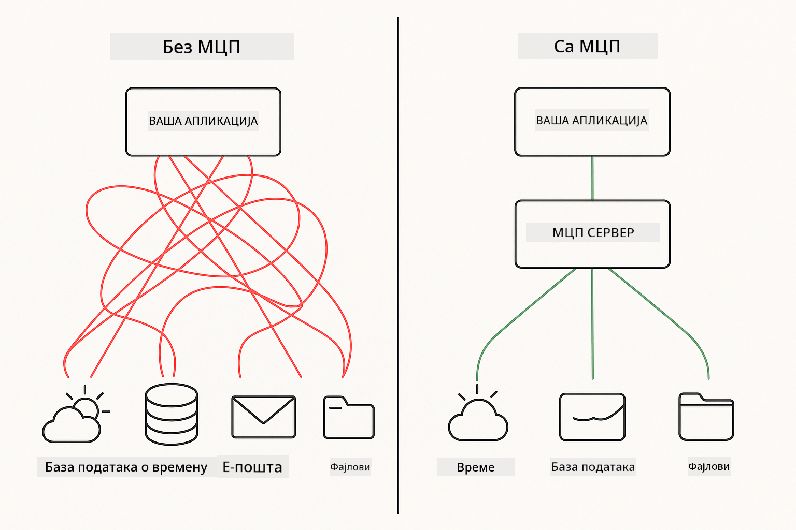
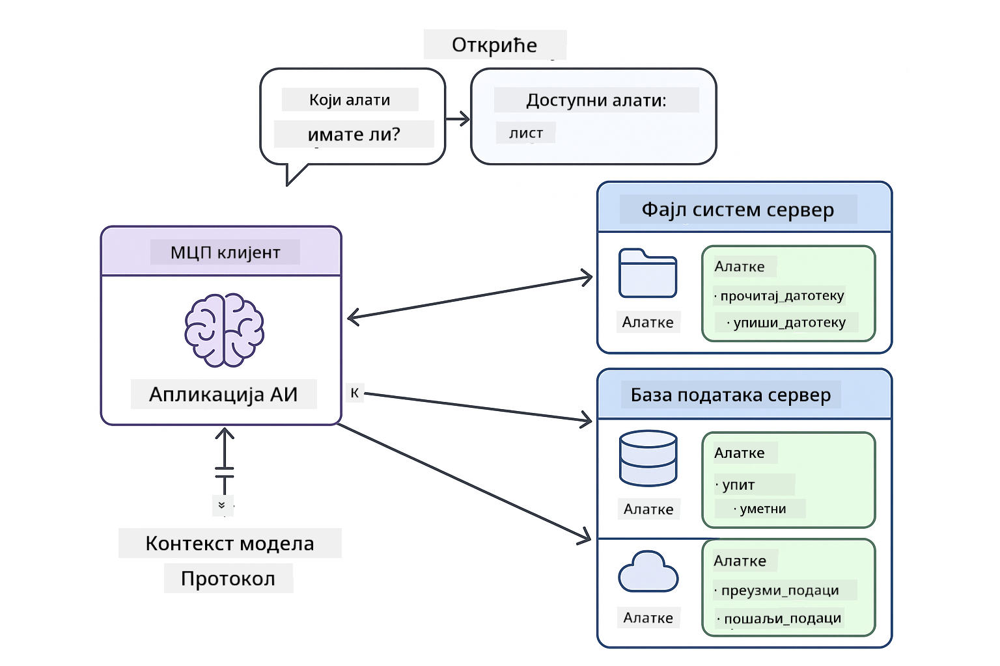

<!--
CO_OP_TRANSLATOR_METADATA:
{
  "original_hash": "c25ec1f10ef156c53e190cdf8b0711ab",
  "translation_date": "2025-12-13T18:06:43+00:00",
  "source_file": "05-mcp/README.md",
  "language_code": "sr"
}
-->
# Модул 05: Протокол контекста модела (MCP)

## Садржај

- [Шта ћете научити](../../../05-mcp)
- [Разумевање MCP](../../../05-mcp)
- [Како MCP ради](../../../05-mcp)
  - [Архитектура сервер-клијент](../../../05-mcp)
  - [Откривање алата](../../../05-mcp)
  - [Механизми транспорта](../../../05-mcp)
- [Претпоставке](../../../05-mcp)
- [Шта овај модул покрива](../../../05-mcp)
- [Брзи почетак](../../../05-mcp)
  - [Пример 1: Даљински калкулатор (Streamable HTTP)](../../../05-mcp)
  - [Пример 2: Операције са фајловима (Stdio)](../../../05-mcp)
  - [Пример 3: Анализа Git-а (Docker)](../../../05-mcp)
- [Кључни појмови](../../../05-mcp)
  - [Избор транспорта](../../../05-mcp)
  - [Откривање алата](../../../05-mcp)
  - [Управљање сесијом](../../../05-mcp)
  - [Разматрања за више платформи](../../../05-mcp)
- [Када користити MCP](../../../05-mcp)
- [MCP екосистем](../../../05-mcp)
- [Честитамо!](../../../05-mcp)
  - [Шта следи?](../../../05-mcp)
- [Решавање проблема](../../../05-mcp)

## Шта ћете научити

Изградили сте конверзацијски AI, савладали упите, основали одговоре у документима и креирали агенте са алатима. Али сви ти алати су били прилагођени за вашу специфичну апликацију. Шта ако бисте могли да дате вашем AI приступ стандардизованом екосистему алата које свако може да креира и дели?

Протокол контекста модела (MCP) пружа управо то - стандардни начин за AI апликације да открију и користе спољне алате. Уместо да пишете прилагођене интеграције за сваки извор података или услугу, повезујете се са MCP серверима који излажу своје могућности у конзистентном формату. Ваш AI агент онда може аутоматски да открије и користи те алате.



*Пре MCP: Комплексне интеграције тачка-по-тачка. После MCP: Један протокол, бескрајне могућности.*

## Разумевање MCP

MCP решава основни проблем у развоју AI: свака интеграција је прилагођена. Желите приступ GitHub-у? Прилагођени код. Желите да читате фајлове? Прилагођени код. Желите да упитате базу података? Прилагођени код. И ниједна од ових интеграција не ради са другим AI апликацијама.

MCP то стандардизује. MCP сервер излаже алате са јасним описима и шемама. Сваки MCP клијент може да се повеже, открије доступне алате и користи их. Направите једном, користите свуда.



*Архитектура Протокола контекста модела - стандардизовано откривање и извршавање алата*

## Како MCP ради

**Архитектура сервер-клијент**

MCP користи модел клијент-сервер. Сервери пружају алате - читање фајлова, упити база података, позиви API-ја. Клијенти (ваша AI апликација) се повезују на сервере и користе њихове алате.

**Откривање алата**

Када се ваш клијент повеже на MCP сервер, пита "Које алате имаш?" Сервер одговара листом доступних алата, сваки са описима и шемама параметара. Ваш AI агент онда може да одлучи које алате да користи на основу корисничких захтева.

**Механизми транспорта**

MCP дефинише два механизма транспорта: HTTP за удаљене сервере, Stdio за локалне процесе (укључујући Docker контејнере):


*MCP механизми транспорта: HTTP за удаљене сервере, Stdio за локалне процесе (укључујући Docker контејнере)*

**Streamable HTTP** - [StreamableHttpDemo.java](../../../05-mcp/src/main/java/com/example/langchain4j/mcp/StreamableHttpDemo.java)

За удаљене сервере. Ваша апликација прави HTTP захтеве серверу који ради негде на мрежи. Користи Server-Sent Events за комуникацију у реалном времену.

```java
McpTransport httpTransport = new StreamableHttpMcpTransport.Builder()
    .url("http://localhost:3001/mcp")
    .timeout(Duration.ofSeconds(60))
    .logRequests(true)
    .logResponses(true)
    .build();
```

> **🤖 Испробајте са [GitHub Copilot](https://github.com/features/copilot) Четом:** Отворите [`StreamableHttpDemo.java`](../../../05-mcp/src/main/java/com/example/langchain4j/mcp/StreamableHttpDemo.java) и питајте:
> - "Како се MCP разликује од директне интеграције алата као у Модулу 04?"
> - "Које су предности коришћења MCP за дељење алата између апликација?"
> - "Како да руковам неуспесима везе или временским ограничењима ка MCP серверима?"

**Stdio** - [StdioTransportDemo.java](../../../05-mcp/src/main/java/com/example/langchain4j/mcp/StdioTransportDemo.java)

За локалне процесе. Ваша апликација покреће сервер као подпроцес и комуницира преко стандардног улаза/излаза. Корисно за приступ фајл систему или командно-линијским алатима.

```java
McpTransport stdioTransport = new StdioMcpTransport.Builder()
    .command(List.of(
        npmCmd, "exec",
        "@modelcontextprotocol/server-filesystem@0.6.2",
        resourcesDir
    ))
    .logEvents(false)
    .build();
```

> **🤖 Испробајте са [GitHub Copilot](https://github.com/features/copilot) Четом:** Отворите [`StdioTransportDemo.java`](../../../05-mcp/src/main/java/com/example/langchain4j/mcp/StdioTransportDemo.java) и питајте:
> - "Како ради Stdio транспорт и када да га користим уместо HTTP?"
> - "Како LangChain4j управља животним циклусом покренутих MCP серверских процеса?"
> - "Које су безбедносне импликације давања AI приступа фајл систему?"

**Docker (користи Stdio)** - [GitRepositoryAnalyzer.java](../../../05-mcp/src/main/java/com/example/langchain4j/mcp/GitRepositoryAnalyzer.java)

За сервисе у контејнерима. Користи stdio транспорт за комуникацију са Docker контејнером преко `docker run`. Добро за сложене зависности или изолована окружења.

```java
McpTransport dockerTransport = new StdioMcpTransport.Builder()
    .command(List.of(
        "docker", "run",
        "-e", "GITHUB_PERSONAL_ACCESS_TOKEN=" + System.getenv("GITHUB_TOKEN"),
        "-v", volumeMapping,
        "-i", "mcp/git"
    ))
    .logEvents(true)
    .build();
```

> **🤖 Испробајте са [GitHub Copilot](https://github.com/features/copilot) Четом:** Отворите [`GitRepositoryAnalyzer.java`](../../../05-mcp/src/main/java/com/example/langchain4j/mcp/GitRepositoryAnalyzer.java) и питајте:
> - "Како Docker транспорт изолује MCP сервере и које су предности?"
> - "Како да конфигуришем монтaжу волумена за дељење података између хоста и MCP контејнера?"
> - "Које су најбоље праксе за управљање животним циклусом Docker-базираних MCP сервера у продукцији?"

## Покретање примера

### Претпоставке

- Java 21+, Maven 3.9+
- Node.js 16+ и npm (за MCP сервере)
- **Docker Desktop** - Мора бити **ПОКРЕНУТ** за Пример 3 (не само инсталиран)
- GitHub Personal Access Token конфигурисан у `.env` фајлу (из Модула 00)

> **Напомена:** Ако још нисте подесили ваш GitHub токен, погледајте [Модул 00 - Брзи почетак](../00-quick-start/README.md) за упутства.

> **⚠️ Корисници Docker-а:** Пре покретања Примера 3, проверите да ли је Docker Desktop покренут командом `docker ps`. Ако видите грешке везе, покрените Docker Desktop и сачекајте око 30 секунди за иницијализацију.

## Брзи почетак

**Коришћење VS Code:** Једноставно кликните десним тастером миша на било који демонстрациони фајл у Explorer-у и изаберите **"Run Java"**, или користите конфигурације за покретање из Run and Debug панела (пре тога се уверите да сте додали ваш токен у `.env` фајл).

**Коришћење Maven-а:** Алтернативно, можете покренути из командне линије са примерима испод.

**⚠️ Важно:** Неки примери имају претпоставке (као што је покретање MCP сервера или прављење Docker слика). Проверите захтеве сваког примера пре покретања.

### Пример 1: Даљински калкулатор (Streamable HTTP)

Ово демонстрира интеграцију алата преко мреже.

**⚠️ Претпоставка:** Прво морате покренути MCP сервер (погледајте Терминал 1 испод).

**Терминал 1 - Покрените MCP сервер:**

**Bash:**
```bash
git clone https://github.com/modelcontextprotocol/servers.git
cd servers/src/everything
npm install
node dist/streamableHttp.js
```

**PowerShell:**
```powershell
git clone https://github.com/modelcontextprotocol/servers.git
cd servers/src/everything
npm install
node dist/streamableHttp.js
```

**Терминал 2 - Покрените пример:**

**Коришћење VS Code:** Кликните десним тастером на `StreamableHttpDemo.java` и изаберите **"Run Java"**.

**Коришћење Maven-а:**

**Bash:**
```bash
export GITHUB_TOKEN=your_token_here
cd 05-mcp
mvn compile exec:java -Dexec.mainClass=com.example.langchain4j.mcp.StreamableHttpDemo
```

**PowerShell:**
```powershell
$env:GITHUB_TOKEN=your_token_here
cd 05-mcp
mvn --% compile exec:java -Dexec.mainClass=com.example.langchain4j.mcp.StreamableHttpDemo
```

Пратите како агент открива доступне алате, затим користите калкулатор за извођење сабирања.

### Пример 2: Операције са фајловима (Stdio)

Ово демонстрира алате засноване на локалним подпроцесима.

**✅ Није потребно ништа посебно** - MCP сервер се аутоматски покреће.

**Коришћење VS Code:** Кликните десним тастером на `StdioTransportDemo.java` и изаберите **"Run Java"**.

**Коришћење Maven-а:**

**Bash:**
```bash
export GITHUB_TOKEN=your_token_here
cd 05-mcp
mvn compile exec:java -Dexec.mainClass=com.example.langchain4j.mcp.StdioTransportDemo
```

**PowerShell:**
```powershell
$env:GITHUB_TOKEN=your_token_here
cd 05-mcp
mvn --% compile exec:java -Dexec.mainClass=com.example.langchain4j.mcp.StdioTransportDemo
```

Апликација аутоматски покреће MCP сервер за фајл систем и чита локални фајл. Обратите пажњу како се управљање подпроцесом обавља за вас.

**Очекујени излаз:**
```
Assistant response: The content of the file is "Kaboom!".
```

### Пример 3: Анализа Git-а (Docker)

Ово демонстрира сервере алата у контејнерима.

**⚠️ Претпоставке:** 
1. **Docker Desktop мора бити ПОКРЕНУТ** (не само инсталиран)
2. **Корисници Windows-а:** Препоручује се WSL 2 режим (Docker Desktop Settings → General → "Use the WSL 2 based engine"). Hyper-V режим захтева ручну конфигурацију дељења фајлова.
3. Прво морате направити Docker слику (погледајте Терминал 1 испод)

**Проверите да ли Docker ради:**

**Bash:**
```bash
docker ps  # Требало би да прикаже листу контејнера, а не грешку
```

**PowerShell:**
```powershell
docker ps  # Требало би да прикаже листу контејнера, а не грешку
```

Ако видите грешку као "Cannot connect to Docker daemon" или "The system cannot find the file specified", покрените Docker Desktop и сачекајте да се иницијализује (~30 секунди).

**Решавање проблема:**
- Ако AI пријављује празан репозиторијум или нема фајлова, монтaжа волумена (`-v`) не ради.
- **Корисници Windows Hyper-V:** Додајте директоријум пројекта у Docker Desktop Settings → Resources → File sharing, затим поново покрените Docker Desktop.
- **Препоручено решење:** Прелазак на WSL 2 режим за аутоматско дељење фајлова (Settings → General → омогућите "Use the WSL 2 based engine").

**Терминал 1 - Направите Docker слику:**

**Bash:**
```bash
cd servers/src/git
docker build -t mcp/git .
```

**PowerShell:**
```powershell
cd servers/src/git
docker build -t mcp/git .
```

**Терминал 2 - Покрените анализатор:**

**Коришћење VS Code:** Кликните десним тастером на `GitRepositoryAnalyzer.java` и изаберите **"Run Java"**.

**Коришћење Maven-а:**

**Bash:**
```bash
export GITHUB_TOKEN=your_token_here
cd 05-mcp
mvn compile exec:java -Dexec.mainClass=com.example.langchain4j.mcp.GitRepositoryAnalyzer
```

**PowerShell:**
```powershell
$env:GITHUB_TOKEN=your_token_here
cd 05-mcp
mvn --% compile exec:java -Dexec.mainClass=com.example.langchain4j.mcp.GitRepositoryAnalyzer
```

Апликација покреће Docker контејнер, монтира ваш репозиторијум и анализира структуру и садржај репозиторијума преко AI агента.

## Кључни појмови

**Избор транспорта**

Изаберите у зависности од тога где се налазе ваши алати:
- Удаљене услуге → Streamable HTTP
- Локални фајл систем → Stdio
- Сложене зависности → Docker

**Откривање алата**

MCP клијенти аутоматски откривају доступне алате приликом повезивања. Ваш AI агент види описе алата и одлучује које ће користити на основу корисничког захтева.

**Управљање сесијом**

Streamable HTTP транспорт одржава сесије, омогућавајући интеракције са стањем са удаљеним серверима. Stdio и Docker транспорти су обично без стања.

**Разматрања за више платформи**

Примери аутоматски обрађују разлике између платформи (разлике у командама Windows и Unix, конверзије путања за Docker). Ово је важно за продукцијска окружења на различитим системима.

## Када користити MCP

**Користите MCP када:**
- Желите да искористите постојеће екосистеме алата
- Креирате алате које ће користити више апликација
- Интегришете сервисе трећих страна са стандардним протоколима
- Треба вам могућност замене имплементација алата без промене кода

**Користите прилагођене алате (Модул 04) када:**
- Креирате функционалност специфичну за апликацију
- Перформансе су критичне (MCP додаје оптерећење)
- Ваши алати су једноставни и неће се поново користити
- Треба вам потпуна контрола над извршењем

## MCP екосистем

Протокол контекста модела је отворени стандард са растућим екосистемом:

- Званични MCP сервери за уобичајене задатке (фајл систем, Git, базе података)
- Сервери које доприноси заједница за разне услуге
- Стандардизовани описи алата и шеме
- Компатибилност између различитих фрејмворка (ради са било којим MCP клијентом)

Ова стандардизација значи да алати направљени за једну AI апликацију раде и са другим, стварајући заједнички екосистем могућности.

## Честитамо!

Завршили сте курс LangChain4j за почетнике. Научили сте:

- Како изградити конверзацијски AI са меморијом (Модул 01)
- Обрасце за инжењеринг упита за различите задатке (Модул 02)
- Основање одговора у вашим документима помоћу RAG (Модул 03)
- Креирање AI агената са прилагођеним алатима (Модул 04)
- Интеграцију стандардизованих алата преко MCP (Модул 05)

Сада имате темељ за изградњу продукцијских AI апликација. Концепти које сте научили важе без обзира на специфичне фрејмворке или моделе - то су основни обрасци у AI инжењерингу.

### Шта следи?

Након завршетка модула, истражите [Водич за тестирање](../docs/TESTING.md) да бисте видели концепте тестирања LangChain4j у пракси.

**Званични ресурси:**
- [LangChain4j документација](https://docs.langchain4j.dev/) - Комплетни водичи и API референца
- [LangChain4j GitHub](https://github.com/langchain4j/langchain4j) - Изворни код и примери
- [LangChain4j туторијали](https://docs.langchain4j.dev/tutorials/) - Туторијали корак по корак за разне случајеве употребе

Хвала што сте завршили овај курс!

---

**Навигација:** [← Претходно: Модул 04 - Алатке](../04-tools/README.md) | [Назад на почетак](../README.md)

---

## Решавање проблема

### Синтакса PowerShell Maven команде
**Проблем**: Maven команде не успевају са грешком `Unknown lifecycle phase ".mainClass=..."`

**Узрок**: PowerShell тумачи `=` као оператор додељивања променљиве, што кваре синтаксу Maven својстава

**Решење**: Користите оператор за заустављање парсирања `--%` пре Maven команде:

**PowerShell:**
```powershell
mvn --% compile exec:java -Dexec.mainClass=com.example.langchain4j.mcp.StreamableHttpDemo
```

**Bash:**
```bash
mvn compile exec:java -Dexec.mainClass=com.example.langchain4j.mcp.StreamableHttpDemo
```

Оператор `--%` говори PowerShell-у да све преостале аргументе проследи Maven-у буквално, без тумачења.

### Проблеми са Docker конекцијом

**Проблем**: Docker команде не успевају са поруком "Cannot connect to Docker daemon" или "The system cannot find the file specified"

**Узрок**: Docker Desktop није покренут или није у потпуности иницијализован

**Решење**: 
1. Покрените Docker Desktop
2. Сачекајте око 30 секунди за потпуну иницијализацију
3. Проверите са `docker ps` (требало би да прикаже листу контејнера, а не грешку)
4. Затим покрените ваш пример

### Монтовање Docker волумена на Windows-у

**Проблем**: Анализатор Git репозиторијума пријављује празан репозиторијум или нема фајлова

**Узрок**: Монтовање волумена (`-v`) не ради због конфигурације дељења фајлова

**Решење**:
- **Препоручено:** Прелазак на WSL 2 режим (Docker Desktop Settings → General → "Use the WSL 2 based engine")
- **Алтернатива (Hyper-V):** Додајте директоријум пројекта у Docker Desktop Settings → Resources → File sharing, па поново покрените Docker Desktop

---

<!-- CO-OP TRANSLATOR DISCLAIMER START -->
**Одрицање од одговорности**:
Овај документ је преведен коришћењем AI услуге за превођење [Co-op Translator](https://github.com/Azure/co-op-translator). Иако се трудимо да превод буде тачан, молимо вас да имате у виду да аутоматски преводи могу садржати грешке или нетачности. Оригинални документ на његовом изворном језику треба сматрати ауторитетним извором. За критичне информације препоручује се професионални људски превод. Нисмо одговорни за било каква неспоразума или погрешна тумачења која произилазе из коришћења овог превода.
<!-- CO-OP TRANSLATOR DISCLAIMER END -->