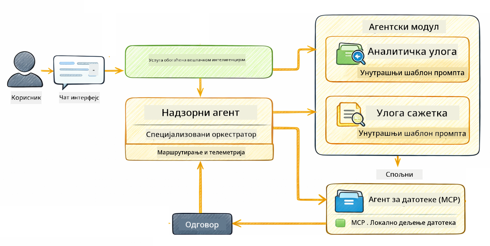

<!--
CO_OP_TRANSLATOR_METADATA:
{
  "original_hash": "f89f4c106d110e4943c055dd1a2f1dff",
  "translation_date": "2025-12-31T05:19:21+00:00",
  "source_file": "05-mcp/README.md",
  "language_code": "sr"
}
-->
# Модул 05: Model Context Protocol (MCP)

## Садржај

- [Шта ћете научити](../../../05-mcp)
- [Шта је MCP?](../../../05-mcp)
- [Како MCP ради](../../../05-mcp)
- [Agentic модул](../../../05-mcp)
- [Покретање примера](../../../05-mcp)
  - [Предуслови](../../../05-mcp)
- [Брзи почетак](../../../05-mcp)
  - [Операције над фајловима (Stdio)](../../../05-mcp)
  - [Supervisor агент](../../../05-mcp)
    - [Разумевање излаза](../../../05-mcp)
    - [Објашњење функција Agentic модула](../../../05-mcp)
- [Кључни појмови](../../../05-mcp)
- [Честитамо!](../../../05-mcp)
  - [Шта следи?](../../../05-mcp)

## Шта ћете научити

Направили сте разговорни AI, савладали рад са промптовима, учврстили одговоре у документима и креирали агенте са алатима. Али сви ти алати су били прилагођени за вашу конкретну апликацију. Шта ако бисте могли да омогућите свом AI-ју приступ стандардизованом екосистему алата који сваки може да креира и дели? У овом модулу научићете како да то урадите помоћу Model Context Protocol (MCP) и agentic модула LangChain4j. Прво приказујемо једноставан MCP читач датотека, а затим показујемо како се он лако интегрише у напредне agentic токове рада користећи образац Supervisor Agent.

## Шта је MCP?

Model Context Protocol (MCP) пружа управо то — стандардни начин за AI апликације да открију и користе спољне алате. Уместо писања прилагођених интеграција за сваки извор података или сервис, повежете се на MCP сервере који излажу своје могућности у конзистентном формату. Ваш AI агент тада може аутоматски да открива и користи те алате.


*Пре MCP-а: Комплексне point-to-point интеграције. Након MCP-а: Један протокол, бескрајне могућности.*

MCP решава фундаментални проблем у развоју AI: свака интеграција је прилагођена. Желите приступ GitHub-у? Прилагођени код. Желите да читате фајлове? Прилагођени код. Желите упит према бази података? Прилагођени код. И ниједна од ових интеграција не ради са другим AI апликацијама.

MCP то стандардизује. MCP сервер излаже алате са јасним описима и шемама параметара. Било који MCP клијент може да се повеже, открије доступне алате и користи их. Направите једном, користите свуда.


*Model Context Protocol архитектура - стандардизовано откривање и извршавање алата*

## Како MCP ради

**Сервер-клијент архитектура**

MCP користи модел клијент-сервер. Сервери обезбеђују алате - читање фајлова, упите базе података, позиве API-ја. Клијенти (ваша AI апликација) се повезују на сервере и користе њихове алате.

Да бисте користили MCP са LangChain4j, додајте ову Maven зависност:

```xml
<dependency>
    <groupId>dev.langchain4j</groupId>
    <artifactId>langchain4j-mcp</artifactId>
    <version>${langchain4j.version}</version>
</dependency>
```

**Откривање алата**

Када се ваш клијент повеже на MCP сервер, пита "Које алате имаш?" Сервер одговара листом доступних алата, сваки са описима и шемама параметара. Ваш AI агент онда може да одлучи које алате да користи на основу корисничких захтева.

**Транспортни механизми**

MCP подржава различите транспортне механизме. Овај модул демонстрира Stdio транспорт за локалне процесе:


*MCP транспортни механизми: HTTP за удаљене сервере, Stdio за локалне процесе*

**Stdio** - [StdioTransportDemo.java](../../../05-mcp/src/main/java/com/example/langchain4j/mcp/StdioTransportDemo.java)

За локалне процесе. Ваша апликација покреће сервер као подпроцес и комуницира преко стандардног улаза/излаза. Корисно за приступ фајл систему или алатима командне линије.

```java
McpTransport stdioTransport = new StdioMcpTransport.Builder()
    .command(List.of(
        npmCmd, "exec",
        "@modelcontextprotocol/server-filesystem@2025.12.18",
        resourcesDir
    ))
    .logEvents(false)
    .build();
```

> **🤖 Испробајте са [GitHub Copilot](https://github.com/features/copilot) Chat:** Отворите [`StdioTransportDemo.java`](../../../05-mcp/src/main/java/com/example/langchain4j/mcp/StdioTransportDemo.java) и питајте:
> - "Како Stdio транспорт функционише и када да га користим уместо HTTP?"
> - "Како LangChain4j управља животним циклусом покренутих MCP сервер процеса?"
> - "Које су безбедносне импликације давања AI-ју приступа фајл систему?"

## Agentic модул

Док MCP обезбеђује стандардизоване алате, agentic модул LangChain4j омогућава декларативан начин изградње агената који оркестрирају те алате. Анотација `@Agent` и `AgenticServices` вам омогућавају да дефинишете понашање агента преко интерфејса уместо императивног кода.

У овом модулу истражићете образац **Supervisor Agent** — напредни agentic AI приступ где "супервизор" агент динамички одлучује које под-агенте да позове на основу корисничких захтева. Комбиноваћемо оба концепта тако што ћемо једном од наших под-агената дати MCP-покретане могућности приступа фајл систему.

Да бисте користили agentic модул, додајте ову Maven зависност:

```xml
<dependency>
    <groupId>dev.langchain4j</groupId>
    <artifactId>langchain4j-agentic</artifactId>
    <version>${langchain4j.mcp.version}</version>
</dependency>
```

> **⚠️ Експериментално:** модул `langchain4j-agentic` је **експерименталан** и може подлежати променама. Стабилан начин за прављење AI асистената и даље је `langchain4j-core` са прилагођеним алатима (Модул 04).

## Покретање примера

### Предуслови

- Java 21+, Maven 3.9+
- Node.js 16+ и npm (за MCP сервере)
- Системске променљиве окружења конфигурисане у `.env` фајлу (из коренског директоријума):
  - **За StdioTransportDemo:** `GITHUB_TOKEN` (GitHub Personal Access Token)
  - **За SupervisorAgentDemo:** `AZURE_OPENAI_ENDPOINT`, `AZURE_OPENAI_API_KEY`, `AZURE_OPENAI_DEPLOYMENT` (исто као у Модулима 01-04)

> **Напомена:** Ако још нисте подесили системске променљиве окружења, погледајте [Module 00 - Quick Start](../00-quick-start/README.md) за упутства, или копирајте `.env.example` у `.env` у коренском директоријуму и попуните своје вредности.

## Брзи почетак

**Користећи VS Code:** Једноставно кликните десним тастером миша на било који demo фајл у Explorer-у и изаберите **"Run Java"**, или користите конфигурације за покретање из Run and Debug панела (пре тога уверите се да сте додали свој токен у `.env` фајл).

**Користећи Maven:** Алтернативно, можете покренути из командне линије уз примере испод.

### Операције над фајловима (Stdio)

Ово демонстрира алате засноване на локалним подпроцесима.

**✅ Није потребно подешавање** - MCP сервер се покреће аутоматски.

**Користећи VS Code:** Кликните десним тастером на `StdioTransportDemo.java` и изаберите **"Run Java"**.

**Користећи Maven:**

**Bash:**
```bash
export GITHUB_TOKEN=your_token_here
cd 05-mcp
mvn compile exec:java -Dexec.mainClass=com.example.langchain4j.mcp.StdioTransportDemo
```

**PowerShell:**
```powershell
$env:GITHUB_TOKEN=your_token_here
cd 05-mcp
mvn --% compile exec:java -Dexec.mainClass=com.example.langchain4j.mcp.StdioTransportDemo
```

Апликација аутоматски покреће filesystem MCP сервер и чита локални фајл. Обратите пажњу како се управљање подпроцесом обавља за вас.

**Очекујени излаз:**
```
Assistant response: The file provides an overview of LangChain4j, an open-source Java library
for integrating Large Language Models (LLMs) into Java applications...
```

### Supervisor агент




Образац **Supervisor Agent** је **флексибилан** облик agentic AI. За разлику од детерминистичких токова рада (секвенцијално, петља, паралелно), Supervisor користи LLM да аутономно одлучи које агенте да позове на основу корисничког захтева.

**Комбинација Supervisor-а са MCP-ом:** У овом примеру, дајемо `FileAgent` приступ MCP алатима фајл система преко `toolProvider(mcpToolProvider)`. Када корисник затражи "прочитај и анализирај фајл", Supervisor анализира захтев и генерише план извршења. Он затим усмерава захтев ка `FileAgent`, који користи MCP-ов `read_file` алат да добије садржај. Supervisor прослеђује тај садржај `AnalysisAgent`-у за тумачење, и по потреби позива `SummaryAgent` да сабије резултате.

Ово показује како се MCP алати беспрекорно интегришу у agentic токове рада — Supervisor не мора да зна *како* се фајлови читају, само да `FileAgent` то може да уради. Supervisor се динамички прилагођава различитим типовима захтева и враћа или одговор последњег агента или резиме свих операција.

**Користећи старт скрипте (препоручено):**

Старт скрипте аутоматски учитавају системске променљиве из коренског `.env` фајла:

**Bash:**
```bash
cd 05-mcp
chmod +x start.sh
./start.sh
```

**PowerShell:**
```powershell
cd 05-mcp
.\start.ps1
```

**Користећи VS Code:** Кликните десним тастером на `SupervisorAgentDemo.java` и изаберите **"Run Java"** (убедите се да је ваш `.env` фајл конфигурисан).

**Како Supervisor функционише:**

```java
// Дефинишите више агената са специфичним способностима
FileAgent fileAgent = AgenticServices.agentBuilder(FileAgent.class)
        .chatModel(model)
        .toolProvider(mcpToolProvider)  // Има MCP алате за рад са датотекама
        .build();

AnalysisAgent analysisAgent = AgenticServices.agentBuilder(AnalysisAgent.class)
        .chatModel(model)
        .build();

SummaryAgent summaryAgent = AgenticServices.agentBuilder(SummaryAgent.class)
        .chatModel(model)
        .build();

// Креирајте Супервизора који оркестрира ове агенте
SupervisorAgent supervisor = AgenticServices.supervisorBuilder()
        .chatModel(model)  // Модел "планер"
        .subAgents(fileAgent, analysisAgent, summaryAgent)
        .responseStrategy(SupervisorResponseStrategy.SUMMARY)
        .build();

// Супервизор аутономно одлучује које агенте покренути
// Само проследите захтев на природном језику - LLM планира извршење
String response = supervisor.invoke("Read the file at /path/file.txt and analyze it");
```

Погледајте [SupervisorAgentDemo.java](../../../05-mcp/src/main/java/com/example/langchain4j/mcp/SupervisorAgentDemo.java) за комплетну имплементацију.

> **🤖 Испробајте са [GitHub Copilot](https://github.com/features/copilot) Chat:** Отворите [`SupervisorAgentDemo.java`](../../../05-mcp/src/main/java/com/example/langchain4j/mcp/SupervisorAgentDemo.java) и питајте:
> - "Како Supervisor одлучује које агенте да позове?"
> - "Која је разлика између Supervisor и Sequential образаца тока рада?"
> - "Како могу да прилагодим понашање планирања Supervisor-а?"

#### Разумевање излаза

Када покренете демо, видећете структуриран преглед како Supervisor оркестрира више агената. Ево шта сваки део значи:

```
======================================================================
  SUPERVISOR AGENT DEMO
======================================================================

This demo shows how a Supervisor Agent orchestrates multiple specialized agents.
The Supervisor uses an LLM to decide which agent to call based on the task.
```

**Хедер** представља демо и објашњава основну концепцију: Supervisor користи LLM (не унапред дефинисана правила) да одлучи које агенте да позове.

```
--- AVAILABLE AGENTS -------------------------------------------------
  [FILE]     FileAgent     - Reads files using MCP filesystem tools
  [ANALYZE]  AnalysisAgent - Analyzes content for structure, tone, and themes
  [SUMMARY]  SummaryAgent  - Creates concise summaries of content
```

**Доступни агенти** показује три специјализована агента које Supervisor може да изабере. Сваки агент има специфичну способност:
- **FileAgent** може читати фајлове користећи MCP алате (спољна могућност)
- **AnalysisAgent** анализира садржај (чиста LLM способност)
- **SummaryAgent** прави резимее (чиста LLM способност)

```
--- USER REQUEST -----------------------------------------------------
  "Read the file at .../file.txt and analyze what it's about"
```

**Кориснички захтев** показује шта је затражено. Supervisor мора да то парсира и одлучи које агенте да позове.

```
--- SUPERVISOR ORCHESTRATION -----------------------------------------
  The Supervisor will now decide which agents to invoke and in what order...

  +-- STEP 1: Supervisor chose -> FileAgent (reading file via MCP)
  |
  |   Input: .../file.txt
  |
  |   Result: LangChain4j is an open-source Java library designed to simplify...
  +-- [OK] FileAgent (reading file via MCP) completed

  +-- STEP 2: Supervisor chose -> AnalysisAgent (analyzing content)
  |
  |   Input: LangChain4j is an open-source Java library...
  |
  |   Result: Structure: The content is organized into clear paragraphs that int...
  +-- [OK] AnalysisAgent (analyzing content) completed
```

**Оркестрација Supervisor-а** је место где се дешава магија. Пратите како:
1. Supervisor је **прво одабрао FileAgent** јер је захтев поменуо "прочитај фајл"
2. FileAgent је користио MCP-ов `read_file` алат да преузме садржај фајла
3. Supervisor је затим **одабрао AnalysisAgent** и проследио му садржај фајла
4. AnalysisAgent је анализирао структуру, тон и теме

Обратите пажњу да је Supervisor донео ове одлуке **аутономно** на основу корисничког захтева — без унапред дефинисаног тока рада!

**Коначни одговор** је синтетисани одговор Supervisor-а, комбинујући резултате од свих агената које је позвао. Пример исписује agentic опсег показујући резиме и резултате анализе које је сваки агент сачувао.

```
--- FINAL RESPONSE ---------------------------------------------------
I read the contents of the file and analyzed its structure, tone, and key themes.
The file introduces LangChain4j as an open-source Java library for integrating
large language models...

--- AGENTIC SCOPE (Shared Memory) ------------------------------------
  Agents store their results in a shared scope for other agents to use:
  * summary: LangChain4j is an open-source Java library...
  * analysis: Structure: The content is organized into clear paragraphs that in...
```

### Објашњење функција Agentic модула

Пример демонстрира неколико напредних функција agentic модула. Погледајмо ближе Agentic Scope и Agent Listener-e.

**Agentic Scope** показује заједничку меморију где су агенти сачували своје резултате користећи `@Agent(outputKey="...")`. Ово омогућава:
- Наконизираним агентима да приступе резултатима ранијих агената
- Supervisor-у да синтетише коначни одговор
- Вама да инспектујете шта је сваки агент произвео

```java
ResultWithAgenticScope<String> result = supervisor.invokeWithAgenticScope(request);
AgenticScope scope = result.agenticScope();
String story = scope.readState("story");
List<AgentInvocation> history = scope.agentInvocations("analysisAgent");
```

**Agent Listener-и** омогућавају праћење и дебаговање извршавања агената. Корак-по-корак излаз који видите у демоу долази од AgentListener-а који се причвршћује за свако позивање агента:
- **beforeAgentInvocation** - Позива се када Supervisor одабере агента, омогућавајући вам да видите који је агент одабран и зашто
- **afterAgentInvocation** - Позива се када агент заврши, показујући његов резултат
- **inheritedBySubagents** - Када је true, listener прати све агенте у хијерархији

```java
AgentListener monitor = new AgentListener() {
    private int step = 0;
    
    @Override
    public void beforeAgentInvocation(AgentRequest request) {
        step++;
        System.out.println("  +-- STEP " + step + ": " + request.agentName());
    }
    
    @Override
    public void afterAgentInvocation(AgentResponse response) {
        System.out.println("  +-- [OK] " + response.agentName() + " completed");
    }
    
    @Override
    public boolean inheritedBySubagents() {
        return true; // Проследити свим под-агентима
    }
};
```

Поред Supervisor образца, модул `langchain4j-agentic` пружа неколико моћних образаца тока рада и функција:

| Pattern | Description | Use Case |
|---------|-------------|----------|
| **Sequential** | Извршавање агената по реду, излаз тече ка следећем | Пайпелини: истраживање → анализа → извештај |
| **Parallel** | Покретање агената паралелно | Независни задаци: време + вести + акције |
| **Loop** | Итерација док се услов не испуни | Оценa квалитета: усавршавање док оцена ≥ 0.8 |
| **Conditional** | Усмеравање на основу услова | Класификација → усмеравање ка специјалистичком агенту |
| **Human-in-the-Loop** | Додавање човечијих контролних тачака | Руковање одобрењима, преглед садржаја |

## Кључни појмови

**MCP** је идеалан када желите да искористите постојеће екосистеме алата, изградите алате које више апликација може да дели, интегришете сервисе трећих страна стандардним протоколима, или мењате имплементације алата без промене кода.

**Agentic модул** најбоље функционише када желите декларативне дефиниције агената са `@Agent` анотацијама, потребна вам је оркестрација тока рада (секвенцијално, петља, паралелно), више волите дизајн агената заснован на интерфејсима уместо императивног кода, или комбинујете више агената који деле излазе преко `outputKey`.

**Образац Supervisor Agent** блиста када ток рада није предвидљив унапред и желите да LLM одлучује, када имате више специјализованих агената који треба динамички да се оркестрирају, када правите разговорне системе који усмеравају ка различитим способностима, или када желите најфлексибилније, адаптивно понашање агената.

## Честитамо!

Завршили сте LangChain4j for Beginners курс. Научили сте:

- Како да изградите разговорни AI са меморијом (Модул 01)
- Обрасце за prompt engineering за различите задатке (Модул 02)
- Укорињавање одговора у вашим документима уз RAG (Модул 03)
- Кретање основних AI агената (асистената) са прилагођеним алатима (Модул 04)
- Интеграција стандарнизованих алата са LangChain4j MCP и Agentic модулима (Модул 05)

### Шта следи?

Након завршетка модула, погледајте [Водич за тестирање](../docs/TESTING.md) да бисте видели концепте тестирања LangChain4j у пракси.

**Званични ресурси:**
- [LangChain4j Документација](https://docs.langchain4j.dev/) - Свеобухватни водичи и референца API-ја
- [LangChain4j GitHub](https://github.com/langchain4j/langchain4j) - Изворни код и примери
- [LangChain4j Туторијали](https://docs.langchain4j.dev/tutorials/) - Туторијали корак-по-корак за различите случајеве употребе

Хвала вам што сте завршили овај курс!

---

**Навигација:** [← Претходно: Модул 04 - Алати](../04-tools/README.md) | [Назад на почетну](../README.md)

---

<!-- CO-OP TRANSLATOR DISCLAIMER START -->
**Изјава о одрицању одговорности**:
Овај документ је преведен помоћу сервиса за превођење заснованог на вештачкој интелигенцији [Co-op Translator](https://github.com/Azure/co-op-translator). Иако тежимо тачности, имајте у виду да аутоматски преводи могу садржати грешке или нетачности. Оригинални документ на његовом изворном језику треба сматрати меродавним извором. За критичне информације препоручује се професионални превод од стране стручног преводиоца. Не сносимо одговорност за било какве неспоразуме или погрешна тумачења која произилазе из употребе овог превода.
<!-- CO-OP TRANSLATOR DISCLAIMER END -->