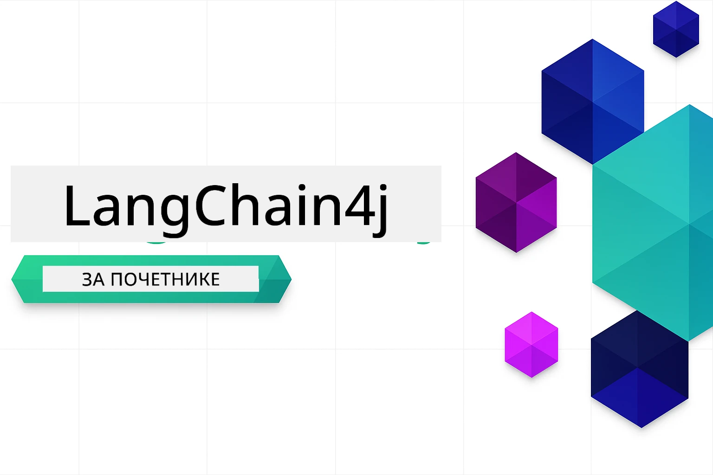

### 🌐 Подршка за више језика

#### Подржано путем GitHub акције (Аутоматизовано и увек ажурирано)

<!-- CO-OP TRANSLATOR LANGUAGES TABLE START -->
[Arabic](../ar/README.md) | [Bengali](../bn/README.md) | [Bulgarian](../bg/README.md) | [Burmese (Myanmar)](../my/README.md) | [Chinese (Simplified)](../zh-CN/README.md) | [Chinese (Traditional, Hong Kong)](../zh-HK/README.md) | [Chinese (Traditional, Macau)](../zh-MO/README.md) | [Chinese (Traditional, Taiwan)](../zh-TW/README.md) | [Croatian](../hr/README.md) | [Czech](../cs/README.md) | [Danish](../da/README.md) | [Dutch](../nl/README.md) | [Estonian](../et/README.md) | [Finnish](../fi/README.md) | [French](../fr/README.md) | [German](../de/README.md) | [Greek](../el/README.md) | [Hebrew](../he/README.md) | [Hindi](../hi/README.md) | [Hungarian](../hu/README.md) | [Indonesian](../id/README.md) | [Italian](../it/README.md) | [Japanese](../ja/README.md) | [Kannada](../kn/README.md) | [Korean](../ko/README.md) | [Lithuanian](../lt/README.md) | [Malay](../ms/README.md) | [Malayalam](../ml/README.md) | [Marathi](../mr/README.md) | [Nepali](../ne/README.md) | [Nigerian Pidgin](../pcm/README.md) | [Norwegian](../no/README.md) | [Persian (Farsi)](../fa/README.md) | [Polish](../pl/README.md) | [Portuguese (Brazil)](../pt-BR/README.md) | [Portuguese (Portugal)](../pt-PT/README.md) | [Punjabi (Gurmukhi)](../pa/README.md) | [Romanian](../ro/README.md) | [Russian](../ru/README.md) | [Serbian (Cyrillic)](./README.md) | [Slovak](../sk/README.md) | [Slovenian](../sl/README.md) | [Spanish](../es/README.md) | [Swahili](../sw/README.md) | [Swedish](../sv/README.md) | [Tagalog (Filipino)](../tl/README.md) | [Tamil](../ta/README.md) | [Telugu](../te/README.md) | [Thai](../th/README.md) | [Turkish](../tr/README.md) | [Ukrainian](../uk/README.md) | [Urdu](../ur/README.md) | [Vietnamese](../vi/README.md)

> **Преферирате локално клонирање?**

> Овај репозиторијум укључује преводе на преко 50 језика што значајно повећава величину преузимања. Да бисте клонирали без превода, користите sparse checkout:
> ```bash
> git clone --filter=blob:none --sparse https://github.com/microsoft/LangChain4j-for-Beginners.git
> cd LangChain4j-for-Beginners
> git sparse-checkout set --no-cone '/*' '!translations' '!translated_images'
> ```
> Ово вам пружа све што вам је потребно за завршетак курса уз знатно брже преузимање.
<!-- CO-OP TRANSLATOR LANGUAGES TABLE END -->

# LangChain4j за почетнике

Курс за израду AI апликација са LangChain4j и Azure OpenAI GPT-5, од основног ћаскања до AI агената.

**Нису вам познати LangChain4j?** Погледајте [Глосар](docs/GLOSSARY.md) за дефиниције кључних термина и појмова.

## Садржај

1. [Брзи Почетак](00-quick-start/README.md) - Почните са LangChain4j
2. [Увод](01-introduction/README.md) - Научите основе LangChain4j
3. [Инжењеринг Напомена](02-prompt-engineering/README.md) - Савладајте ефикасан дизајн упита
4. [RAG (Retrieval-Augmented Generation)](03-rag/README.md) - Израдите интелигентне системе засноване на знању
5. [Алати](04-tools/README.md) - Интегришите спољашње алате и једноставне асистенте
6. [MCP (Model Context Protocol)](05-mcp/README.md) - Рад са Model Context Protocol (MCP) и Agentic модулима
---

## Пут учења

> **Брзи почетак**

1. Форкујте овај репозиторијум на вашем GitHub налогу
2. Кликните **Code** → **Codespaces** таб → **...** → **New with options...**
3. Користите подразумеване поставке – одабраће Development container креиран за овај курс
4. Кликните **Create codespace**
5. Сачекајте 5-10 минута да окружење буде спремно
6. Одмах пређите на [Брзи Почетак](./00-quick-start/README.md) и започните!

Након завршетка модула, истражите [Водич за тестирање](docs/TESTING.md) да бисте видели концепте тестирања LangChain4j у пракси.

> **Напомена:** Овај тренинг користи GitHub Models и Azure OpenAI. Модул [Брзи почетак](00-quick-start/README.md) користи GitHub Models (није потребна Azure претплата), док модули 1-5 користе Azure OpenAI.


## Учење уз GitHub Copilot

Да бисте брзо почели да кодирајте, отворите овај пројекат у GitHub Codespace-у или вашем локалном IDE-ју са пруженим devcontainer-ом. Devcontainer који се користи у овом курсу долази пре-конфигурисан са GitHub Copilot за заједничко AI програмирање.

Сваки пример кода садржи предложена питања која можете поставити GitHub Copilot-у да бисте продубили разумевање. Потражите 💡/🤖 упите у:

- **Java заглављима датотека** - Питања специфична за сваки пример
- **README-има модула** - Упити за истраживање након примера кода

**Како користити:** Отворите било коју датотеку кода и поставите Copilot-у предложена питања. Он има пун контекст кода и може да објасни, прошири и предложи алтернативе.

Желите да сазнате више? Погледајте [Copilot за AI заједничко програмирање](https://aka.ms/GitHubCopilotAI).


## Додатни ресурси

<!-- CO-OP TRANSLATOR OTHER COURSES START -->
### LangChain
[](https://aka.ms/langchain4j-for-beginners)
[](https://aka.ms/langchainjs-for-beginners?WT.mc_id=m365-94501-dwahlin)

---

### Azure / Edge / MCP / Agents
[](https://github.com/microsoft/AZD-for-beginners?WT.mc_id=academic-105485-koreyst)
[](https://github.com/microsoft/edgeai-for-beginners?WT.mc_id=academic-105485-koreyst)
[](https://github.com/microsoft/mcp-for-beginners?WT.mc_id=academic-105485-koreyst)
[](https://github.com/microsoft/ai-agents-for-beginners?WT.mc_id=academic-105485-koreyst)

---
 
### Generative AI Series
[](https://github.com/microsoft/generative-ai-for-beginners?WT.mc_id=academic-105485-koreyst)
[-9333EA?style=for-the-badge&labelColor=E5E7EB&color=9333EA)](https://github.com/microsoft/Generative-AI-for-beginners-dotnet?WT.mc_id=academic-105485-koreyst)
[-C084FC?style=for-the-badge&labelColor=E5E7EB&color=C084FC)](https://github.com/microsoft/generative-ai-for-beginners-java?WT.mc_id=academic-105485-koreyst)
[-E879F9?style=for-the-badge&labelColor=E5E7EB&color=E879F9)](https://github.com/microsoft/generative-ai-with-javascript?WT.mc_id=academic-105485-koreyst)

---
 
### Core Learning
[](https://aka.ms/ml-beginners?WT.mc_id=academic-105485-koreyst)
[](https://aka.ms/datascience-beginners?WT.mc_id=academic-105485-koreyst)
[](https://aka.ms/ai-beginners?WT.mc_id=academic-105485-koreyst)
[](https://github.com/microsoft/Security-101?WT.mc_id=academic-96948-sayoung)
[](https://aka.ms/webdev-beginners?WT.mc_id=academic-105485-koreyst)
[](https://aka.ms/iot-beginners?WT.mc_id=academic-105485-koreyst)
[](https://github.com/microsoft/xr-development-for-beginners?WT.mc_id=academic-105485-koreyst)

---
 
### Copilot Series

[](https://aka.ms/GitHubCopilotAI?WT.mc_id=academic-105485-koreyst)
[](https://github.com/microsoft/mastering-github-copilot-for-dotnet-csharp-developers?WT.mc_id=academic-105485-koreyst)
[](https://github.com/microsoft/CopilotAdventures?WT.mc_id=academic-105485-koreyst)
<!-- CO-OP TRANSLATOR OTHER COURSES END -->

## Добијање помоћи

Ако запнете или имате било каквих питања о прављењу AI апликација, придружите се:

[](https://aka.ms/foundry/discord)

Ако имате повратне информације о производу или грешке током прављења посетите:

[](https://aka.ms/foundry/forum)

## Лиценца

MIT лиценца - Погледајте [LICENSE](../../LICENSE) фајл за детаље.

---

<!-- CO-OP TRANSLATOR DISCLAIMER START -->
**Изјава о одрицању одговорности**:
Овај документ је преведен помоћу АИ преводилачке услуге [Co-op Translator](https://github.com/Azure/co-op-translator). Иако настојимо да превод буде што прецизнији, имајте у виду да аутоматизовани преводи могу садржати грешке или нетачности. Оригинални документ на његовој изворној језику треба сматрати ауторитативним извором. За критичне информације препоручује се професионални људски превод. Не прихватамо одговорност за било какве неспоразуме или погрешна тумачења настала употребом овог превода.
<!-- CO-OP TRANSLATOR DISCLAIMER END -->