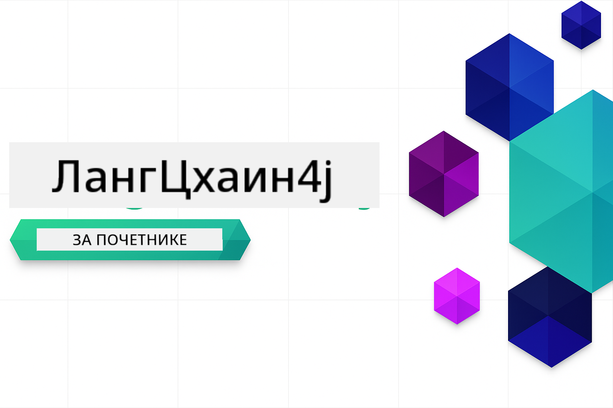

<!--
CO_OP_TRANSLATOR_METADATA:
{
  "original_hash": "d61ab6c245562094cc3dddecf08b50d3",
  "translation_date": "2025-12-31T05:15:27+00:00",
  "source_file": "README.md",
  "language_code": "sr"
}
-->


### 🌐 Подршка за више језика

#### Подржано путем GitHub Action-а (аутоматски и увек ажурно)

<!-- CO-OP TRANSLATOR LANGUAGES TABLE START -->
[Арапски](../ar/README.md) | [Бенгалски](../bn/README.md) | [Бугарски](../bg/README.md) | [Бирмански (Мјанмар)](../my/README.md) | [Кинески (поједностављени)](../zh/README.md) | [Кинески (традиционални, Хонг Конг)](../hk/README.md) | [Кинески (традиционални, Макао)](../mo/README.md) | [Кинески (традиционални, Тајван)](../tw/README.md) | [Хрватски](../hr/README.md) | [Чешки](../cs/README.md) | [Дански](../da/README.md) | [Холандски](../nl/README.md) | [Естонски](../et/README.md) | [Фински](../fi/README.md) | [Француски](../fr/README.md) | [Немачки](../de/README.md) | [Грчки](../el/README.md) | [Хебрејски](../he/README.md) | [Хинди](../hi/README.md) | [Мађарски](../hu/README.md) | [Индонежански](../id/README.md) | [Италијански](../it/README.md) | [Јапански](../ja/README.md) | [Каннада](../kn/README.md) | [Корејски](../ko/README.md) | [Литвански](../lt/README.md) | [Малајски](../ms/README.md) | [Малајаламски](../ml/README.md) | [Марати](../mr/README.md) | [Непалски](../ne/README.md) | [Нигеријски пиџин](../pcm/README.md) | [Норвешки](../no/README.md) | [Персијски (фарси)](../fa/README.md) | [Пољски](../pl/README.md) | [Португалски (Бразил)](../br/README.md) | [Португалски (Португал)](../pt/README.md) | [Пунџаби (Гурмухи)](../pa/README.md) | [Румунски](../ro/README.md) | [Руски](../ru/README.md) | [Српски (ћирилица)](./README.md) | [Словачки](../sk/README.md) | [Словеначки](../sl/README.md) | [Шпански](../es/README.md) | [Свахили](../sw/README.md) | [Шведски](../sv/README.md) | [Тагалог (Филипински)](../tl/README.md) | [Тамилски](../ta/README.md) | [Телугу](../te/README.md) | [Тајландски](../th/README.md) | [Турски](../tr/README.md) | [Украјински](../uk/README.md) | [Урду](../ur/README.md) | [Вијетнамски](../vi/README.md)
<!-- CO-OP TRANSLATOR LANGUAGES TABLE END -->

# LangChain4j за почетнике

Курс за израду AI апликација помоћу LangChain4j и Azure OpenAI GPT-5, од основног ћаскања до AI агената.

**Нови у LangChain4j?** Погледајте [Речник](docs/GLOSSARY.md) за дефиниције кључних појмова и концепата.

## Table of Contents

1. [Брзи почетак](00-quick-start/README.md) - Започните са LangChain4j
2. [Увод](01-introduction/README.md) - Научите основе LangChain4j
3. [Инжењеринг упита](02-prompt-engineering/README.md) - Овладајте ефикасним креирањем упита
4. [RAG (генерација уз подршку претраживања)](03-rag/README.md) - Изградите интелигентне системе засноване на знању
5. [Алатке](04-tools/README.md) - Интегришите спољне алате и једноставне асистенте
6. [MCP (Model Context Protocol)](05-mcp/README.md) - Радите са Model Context Protocol (MCP) и агентским модулима
---

##  Пут учења

> **Брзи почетак**

1. Форкујте овај репозиториј у свој GitHub налог
2. Кликните **Code** → картицу **Codespaces** → **...** → **New with options...**
3. Користите подразумевана подешавања – ово ће одабрати Development container креиран за овај курс
4. Кликните **Create codespace**
5. Сачекајте 5-10 минута да се окружење припреми
6. Прешањте директно на [Брзи почетак](./00-quick-start/README.md) да бисте почели!

> **Преферирате да клонирате локално?**
>
> Овај репозиториј садржи 50+ превода што значајно увећава величину преузимања. Да бисте клонирали без превода, користите sparse checkout:
> ```bash
> git clone --filter=blob:none --sparse https://github.com/microsoft/LangChain4j-for-Beginners.git
> cd LangChain4j-for-Beginners
> git sparse-checkout set --no-cone '/*' '!translations' '!translated_images'
> ```
> Ово вам даје све што вам треба да завршите курс уз много брже преузимање.

Након завршетка модула, истражите [Тестирање водич](docs/TESTING.md) да бисте видели концепте тестирања LangChain4j у пракси.

> **Напомена:** Ова обука користи и GitHub Models и Azure OpenAI. Модули [Брзи почетак](00-quick-start/README.md) и [MCP](05-mcp/README.md) користе GitHub Models (није потребна Azure претплата), док модули 1-4 користе Azure OpenAI GPT-5.


## Учење са GitHub Copilot

Да бисте брзо почели да пишете код, отворите овај пројекат у GitHub Codespace или у вашем локалном IDE-у уз приложени devcontainer. Devcontainer који се користи у овом курсу долази предконфигурисан са GitHub Copilot за AI парно програмирање.

Свак пример кода садржи предлоге питања која можете поставити GitHub Copilot-у да продубите своје разумевање. Тражите упуте означене са 💡/🤖 у:

- **Заглавља Java фајлова** - Питања специфична за сваки пример
- **README-и модула** - Подстицаји за истраживање након примера кода

**Како користити:** Отворите било који фајл са кодом и поставите Copilot-у предложена питања. Има цео контекст кодне базе и може објаснити, проширити и предложити алтернативе.

Желите да сазнате више? Погледајте [Copilot за AI парно програмирање](https://aka.ms/GitHubCopilotAI).


## Додатни ресурси

<!-- CO-OP TRANSLATOR OTHER COURSES START -->
### LangChain
[](https://aka.ms/langchain4j-for-beginners)
[](https://aka.ms/langchainjs-for-beginners?WT.mc_id=m365-94501-dwahlin)

---

### Azure / Edge / MCP / Aгенти
[](https://github.com/microsoft/AZD-for-beginners?WT.mc_id=academic-105485-koreyst)
[](https://github.com/microsoft/edgeai-for-beginners?WT.mc_id=academic-105485-koreyst)
[](https://github.com/microsoft/mcp-for-beginners?WT.mc_id=academic-105485-koreyst)
[](https://github.com/microsoft/ai-agents-for-beginners?WT.mc_id=academic-105485-koreyst)

---
 
### Серија генеративног AI
[](https://github.com/microsoft/generative-ai-for-beginners?WT.mc_id=academic-105485-koreyst)
[-9333EA?style=for-the-badge&labelColor=E5E7EB&color=9333EA)](https://github.com/microsoft/Generative-AI-for-beginners-dotnet?WT.mc_id=academic-105485-koreyst)
[-C084FC?style=for-the-badge&labelColor=E5E7EB&color=C084FC)](https://github.com/microsoft/generative-ai-for-beginners-java?WT.mc_id=academic-105485-koreyst)
[-E879F9?style=for-the-badge&labelColor=E5E7EB&color=E879F9)](https://github.com/microsoft/generative-ai-with-javascript?WT.mc_id=academic-105485-koreyst)

---
 
### Основно учење
[](https://aka.ms/ml-beginners?WT.mc_id=academic-105485-koreyst)
[](https://aka.ms/datascience-beginners?WT.mc_id=academic-105485-koreyst)
[](https://aka.ms/ai-beginners?WT.mc_id=academic-105485-koreyst)
[](https://github.com/microsoft/Security-101?WT.mc_id=academic-96948-sayoung)
[](https://aka.ms/webdev-beginners?WT.mc_id=academic-105485-koreyst)
[](https://aka.ms/iot-beginners?WT.mc_id=academic-105485-koreyst)
[](https://github.com/microsoft/xr-development-for-beginners?WT.mc_id=academic-105485-koreyst)

---
 
### Copilot серија
[](https://aka.ms/GitHubCopilotAI?WT.mc_id=academic-105485-koreyst)
[](https://github.com/microsoft/mastering-github-copilot-for-dotnet-csharp-developers?WT.mc_id=academic-105485-koreyst)
[](https://github.com/microsoft/CopilotAdventures?WT.mc_id=academic-105485-koreyst)
<!-- CO-OP TRANSLATOR OTHER COURSES END -->

## Како добити помоћ

Ако запнете или имате било каквих питања у вези са развојем AI апликација, придружите се:

[](https://aka.ms/foundry/discord)

Ако имате повратне информације о производу или налетите на грешке током развоја, посетите:

[](https://aka.ms/foundry/forum)

## Лиценца

MIT лиценца - Погледајте датотеку [LICENSE](../../LICENSE) за детаље.

---

<!-- CO-OP TRANSLATOR DISCLAIMER START -->
Одрицање одговорности:
Овај документ је преведен уз помоћ услуге за превод на бази вештачке интеленције [Co-op Translator](https://github.com/Azure/co-op-translator). Иако се трудимо да будемо тачни, имајте на уму да аутоматски преводи могу садржати грешке или нетачности. Оригинални документ на његовом изворном језику треба сматрати ауторитетним извором. За критичне информације препоручује се професионални људски превод. Не сносимо одговорност за било какве неспоразуме или погрешна тумачења која произилазе из употребе овог превода.
<!-- CO-OP TRANSLATOR DISCLAIMER END -->