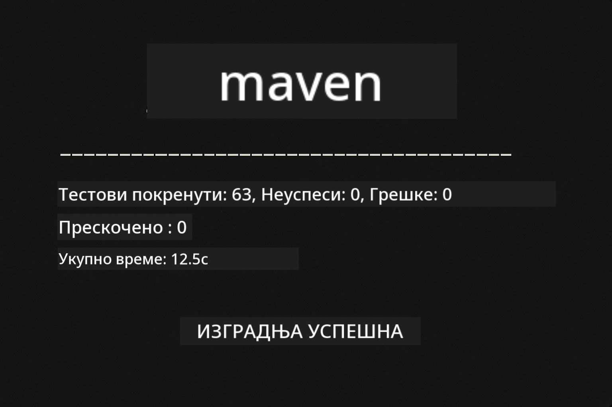
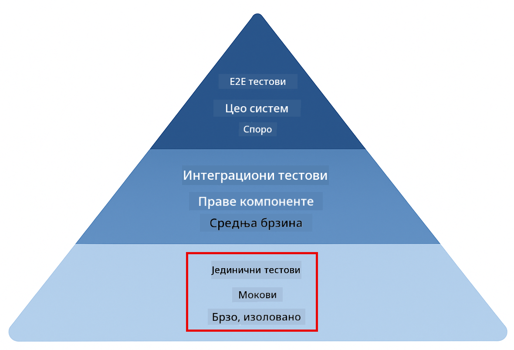
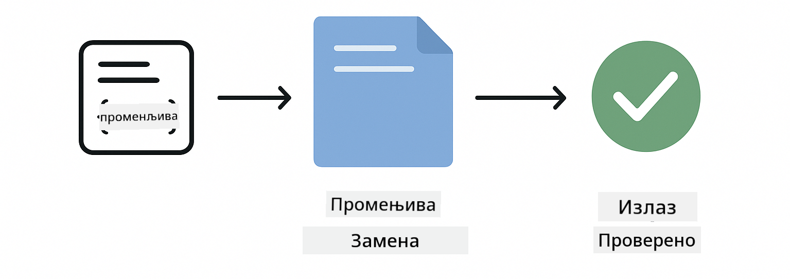
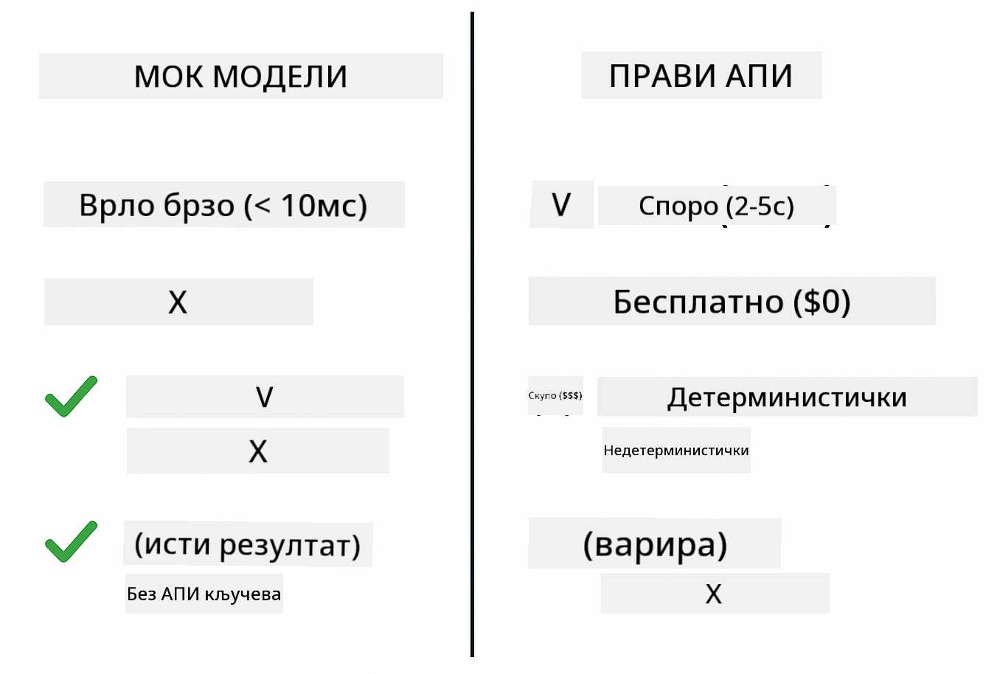
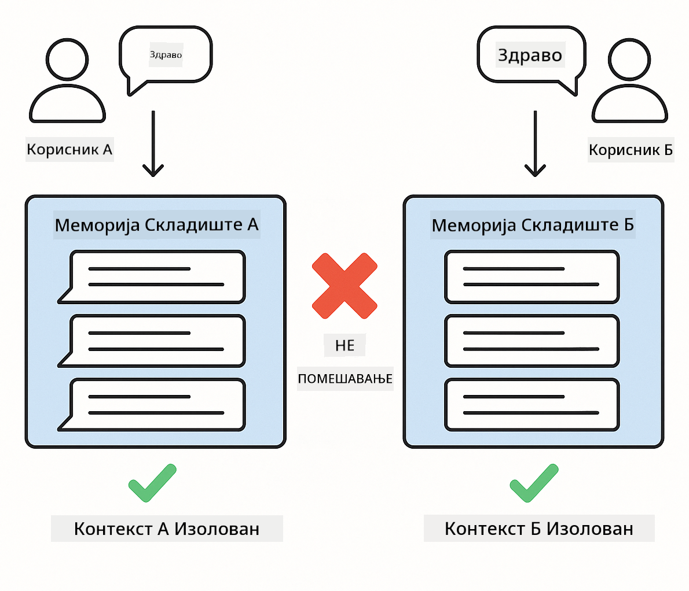

<!--
CO_OP_TRANSLATOR_METADATA:
{
  "original_hash": "b975537560c404d5f254331832811e78",
  "translation_date": "2025-12-13T21:25:26+00:00",
  "source_file": "docs/TESTING.md",
  "language_code": "sr"
}
-->
# Тестирање LangChain4j апликација

## Садржај

- [Брзи почетак](../../../docs)
- [Шта тестови покривају](../../../docs)
- [Покретање тестова](../../../docs)
- [Покретање тестова у VS Code-у](../../../docs)
- [Обрасци тестирања](../../../docs)
- [Филозофија тестирања](../../../docs)
- [Следећи кораци](../../../docs)

Овај водич вас води кроз тестове који показују како тестирати AI апликације без потребе за API кључевима или спољним сервисима.

## Брзи почетак

Покрените све тестове једном командом:

**Bash:**
```bash
mvn test
```

**PowerShell:**
```powershell
mvn --% test
```



*Успешно извршење тестова које показује да су сви тестови прошли без грешака*

## Шта тестови покривају

Овај курс се фокусира на **јединствене тестове** који се извршавају локално. Сваки тест демонстрира одређени LangChain4j концепт у изолацији.



*Пирамида тестирања која показује баланс између јединствених тестова (брзи, изоловани), интеграционих тестова (стварне компоненте) и end-to-end тестова (потпуни систем са Docker-ом). Ова обука покрива јединствено тестирање.*

| Модул | Тестови | Фокус | Кључне датотеке |
|--------|-------|-------|-----------|
| **00 - Брзи почетак** | 6 | Шаблони упита и замена променљивих | `SimpleQuickStartTest.java` |
| **01 - Увод** | 8 | Меморија разговора и стање ћаскања | `SimpleConversationTest.java` |
| **02 - Инжењеринг упита** | 12 | GPT-5 обрасци, нивои жеље, структурисани излаз | `SimpleGpt5PromptTest.java` |
| **03 - RAG** | 10 | Унос докумената, уграђивања, претрага сличности | `DocumentServiceTest.java` |
| **04 - Алати** | 12 | Позив функција и ланац алата | `SimpleToolsTest.java` |
| **05 - MCP** | 15 | Model Context Protocol са Docker-ом | `SimpleMcpTest.java`, `McpDockerTransportTest.java` |

## Покретање тестова

**Покрените све тестове из корена:**

**Bash:**
```bash
mvn test
```

**PowerShell:**
```powershell
mvn --% test
```

**Покрените тестове за одређени модул:**

**Bash:**
```bash
cd 01-introduction && mvn test
# Или из корена
mvn test -pl 01-introduction
```

**PowerShell:**
```powershell
cd 01-introduction; mvn --% test
# Или из корена
mvn --% test -pl 01-introduction
```

**Покрените једну тест класу:**

**Bash:**
```bash
mvn test -Dtest=SimpleConversationTest
```

**PowerShell:**
```powershell
mvn --% test -Dtest=SimpleConversationTest
```

**Покрените одређену тест методу:**

**Bash:**
```bash
mvn test -Dtest=SimpleConversationTest#треба одржавати историју разговора
```

**PowerShell:**
```powershell
mvn --% test -Dtest=SimpleConversationTest#треба одржавати историју разговора
```

## Покретање тестова у VS Code-у

Ако користите Visual Studio Code, Test Explorer пружа графички интерфејс за покретање и дебаговање тестова.


*VS Code Test Explorer који приказује стабло тестова са свим Java тест класама и појединачним тест методама*

**За покретање тестова у VS Code-у:**

1. Отворите Test Explorer кликом на иконицу епрувете у Activity Bar-у
2. Проширите стабло тестова да видите све модуле и тест класе
3. Кликните на дугме за репродукцију поред било ког теста да га покренете појединачно
4. Кликните "Run All Tests" да извршите цео скуп
5. Десни клик на било који тест и изаберите "Debug Test" да поставите breakpoint-ове и корачате кроз код

Test Explorer приказује зелене ознаке за успешне тестове и пружа детаљне поруке о грешкама када тестови не успеју.

## Обрасци тестирања


*Шест образаца тестирања за LangChain4j апликације: шаблони упита, моковање модела, изолација разговора, тестирање алата, RAG у меморији и Docker интеграција*

### Образац 1: Тестирање шаблона упита

Најједноставнији образац тестира шаблоне упита без позивања било ког AI модела. Проверавате да ли замена променљивих ради исправно и да ли су упити форматирани како се очекује.



*Тестирање шаблона упита које показује ток замене променљивих: шаблон са плейсхолдерима → примењене вредности → верификован форматирани излаз*

```java
@Test
@DisplayName("Should format prompt template with variables")
void testPromptTemplateFormatting() {
    PromptTemplate template = PromptTemplate.from(
        "Best time to visit {{destination}} for {{activity}}?"
    );
    
    Prompt prompt = template.apply(Map.of(
        "destination", "Paris",
        "activity", "sightseeing"
    ));
    
    assertThat(prompt.text()).isEqualTo("Best time to visit Paris for sightseeing?");
}
```

Овај тест се налази у `00-quick-start/src/test/java/com/example/langchain4j/quickstart/SimpleQuickStartTest.java`.

**Покрените га:**

**Bash:**
```bash
cd 00-quick-start && mvn test -Dtest=SimpleQuickStartTest#тестирањеФорматирањаШаблонаПромпта
```

**PowerShell:**
```powershell
cd 00-quick-start; mvn --% test -Dtest=SimpleQuickStartTest#тестирањеФорматирањаШаблонаПромпта
```

### Образац 2: Моковање језичких модела

Када тестирате логику разговора, користите Mockito да креирате лажне моделе који враћају унапред одређене одговоре. Ово чини тестове брзим, бесплатним и детерминистичким.



*Поређење које показује зашто су мокови пожељни за тестирање: брзи су, бесплатни, детерминистички и не захтевају API кључеве*

```java
@ExtendWith(MockitoExtension.class)
class SimpleConversationTest {
    
    private ConversationService conversationService;
    
    @Mock
    private OpenAiOfficialChatModel mockChatModel;
    
    @BeforeEach
    void setUp() {
        ChatResponse mockResponse = ChatResponse.builder()
            .aiMessage(AiMessage.from("This is a test response"))
            .build();
        when(mockChatModel.chat(anyList())).thenReturn(mockResponse);
        
        conversationService = new ConversationService(mockChatModel);
    }
    
    @Test
    void shouldMaintainConversationHistory() {
        String conversationId = conversationService.startConversation();
        
        ChatResponse mockResponse1 = ChatResponse.builder()
            .aiMessage(AiMessage.from("Response 1"))
            .build();
        ChatResponse mockResponse2 = ChatResponse.builder()
            .aiMessage(AiMessage.from("Response 2"))
            .build();
        ChatResponse mockResponse3 = ChatResponse.builder()
            .aiMessage(AiMessage.from("Response 3"))
            .build();
        
        when(mockChatModel.chat(anyList()))
            .thenReturn(mockResponse1)
            .thenReturn(mockResponse2)
            .thenReturn(mockResponse3);

        conversationService.chat(conversationId, "First message");
        conversationService.chat(conversationId, "Second message");
        conversationService.chat(conversationId, "Third message");

        List<ChatMessage> history = conversationService.getHistory(conversationId);
        assertThat(history).hasSize(6); // 3 поруке корисника + 3 поруке вештачке интелигенције
    }
}
```

Овај образац се појављује у `01-introduction/src/test/java/com/example/langchain4j/service/SimpleConversationTest.java`. Мок обезбеђује конзистентно понашање тако да можете проверити да ли управљање меморијом ради исправно.

### Образац 3: Тестирање изолације разговора

Меморија разговора мора да одржава више корисника одвојено. Овај тест проверава да се контексти разговора не мешају.



*Тестирање изолације разговора које показује одвојене меморијске складишта за различите кориснике како би се спречило мешање контекста*

```java
@Test
void shouldIsolateConversationsByid() {
    String conv1 = conversationService.startConversation();
    String conv2 = conversationService.startConversation();
    
    ChatResponse mockResponse = ChatResponse.builder()
        .aiMessage(AiMessage.from("Response"))
        .build();
    when(mockChatModel.chat(anyList())).thenReturn(mockResponse);

    conversationService.chat(conv1, "Message for conversation 1");
    conversationService.chat(conv2, "Message for conversation 2");

    List<ChatMessage> history1 = conversationService.getHistory(conv1);
    List<ChatMessage> history2 = conversationService.getHistory(conv2);
    
    assertThat(history1).hasSize(2);
    assertThat(history2).hasSize(2);
}
```

Сваки разговор одржава своју независну историју. У продукцијским системима, ова изолација је критична за мулти-корисничке апликације.

### Образац 4: Тестирање алата независно

Алатке су функције које AI може позвати. Тестирајте их директно да бисте били сигурни да раде исправно без обзира на AI одлуке.


*Тестирање алата независно које показује извршење мок алата без позива AI-ју да би се проверила пословна логика*

```java
@Test
void shouldConvertCelsiusToFahrenheit() {
    TemperatureTool tempTool = new TemperatureTool();
    String result = tempTool.celsiusToFahrenheit(25.0);
    assertThat(result).containsPattern("77[.,]0°F");
}

@Test
void shouldDemonstrateToolChaining() {
    WeatherTool weatherTool = new WeatherTool();
    TemperatureTool tempTool = new TemperatureTool();

    String weatherResult = weatherTool.getCurrentWeather("Seattle");
    assertThat(weatherResult).containsPattern("\\d+°C");

    String conversionResult = tempTool.celsiusToFahrenheit(22.0);
    assertThat(conversionResult).containsPattern("71[.,]6°F");
}
```

Ови тестови из `04-tools/src/test/java/com/example/langchain4j/agents/tools/SimpleToolsTest.java` верификују логику алата без укључивања AI-ја. Пример ланца показује како излаз једног алата иде као улаз другом.

### Образац 5: Тестирање RAG у меморији

RAG системи традиционално захтевају векторске базе података и услуге уграђивања. Образац у меморији вам омогућава да тестирате цео процес без спољних зависности.


*Радни ток тестирања RAG у меморији који показује парсирање докумената, складиштење уграђивања и претрагу сличности без потребе за базом података*

```java
@Test
void testProcessTextDocument() {
    String content = "This is a test document.\nIt has multiple lines.";
    InputStream inputStream = new ByteArrayInputStream(content.getBytes(StandardCharsets.UTF_8));
    
    DocumentService.ProcessedDocument result = 
        documentService.processDocument(inputStream, "test.txt");

    assertNotNull(result);
    assertTrue(result.segments().size() > 0);
    assertEquals("test.txt", result.segments().get(0).metadata().getString("filename"));
}
```

Овај тест из `03-rag/src/test/java/com/example/langchain4j/rag/service/DocumentServiceTest.java` креира документ у меморији и проверава чланковање и руковање метаподацима.

### Образац 6: Интеграционо тестирање са Docker-ом

Неке функције захтевају стварну инфраструктуру. MCP модул користи Testcontainers за покретање Docker контејнера за интеграционе тестове. Ови тестови верификују да ваш код ради са стварним сервисима уз одржавање изолације тестова.


*MCP интеграционо тестирање са Testcontainers које показује аутоматизовани животни циклус контејнера: покретање, извршење теста, заустављање и чишћење*

Тестови у `05-mcp/src/test/java/com/example/langchain4j/mcp/McpDockerTransportTest.java` захтевају да Docker буде покренут.

**Покрените их:**

**Bash:**
```bash
cd 05-mcp && mvn test
```

**PowerShell:**
```powershell
cd 05-mcp; mvn --% test
```

## Филозофија тестирања

Тестирајте свој код, а не AI. Ваши тестови треба да верификују код који пишете проверавајући како се конструишу упити, како се управља меморијом и како се извршавају алати. AI одговори варирају и не би требало да буду део тестних тврдњи. Питајте се да ли ваш шаблон упита исправно замењује променљиве, а не да ли AI даје прави одговор.

Користите мокове за језичке моделе. Они су спољне зависности које су споре, скупе и недетерминистичке. Моковање чини тестове брзим са милисекундама уместо секунди, бесплатним без трошкова API-ја и детерминистичким са истим резултатом сваки пут.

Држите тестове независним. Сваки тест треба да подеси своје податке, да не зависи од других тестова и да очисти за собом. Тестови треба да пролазе без обзира на редослед извршења.

Тестирајте и ивичне случајеве ван срећног пута. Испробајте празне уносе, веома велике уносе, посебне знакове, неважеће параметре и граничне услове. Ово често открива багове које нормална употреба не показује.

Користите описна имена. Упоредите `shouldMaintainConversationHistoryAcrossMultipleMessages()` са `test1()`. Прво вам тачно говори шта се тестира, што олакшава отклањање грешака.

## Следећи кораци

Сада када разумете обрасце тестирања, дубље се упустите у сваки модул:

- **[00 - Брзи почетак](../00-quick-start/README.md)** - Почните са основама шаблона упита
- **[01 - Увод](../01-introduction/README.md)** - Научите управљање меморијом разговора
- **[02 - Инжењеринг упита](../02-prompt-engineering/README.md)** - Савладајте GPT-5 обрасце упита
- **[03 - RAG](../03-rag/README.md)** - Изградите системе за генерацију уз подршку претраге
- **[04 - Алати](../04-tools/README.md)** - Имплементирајте позив функција и ланце алата
- **[05 - MCP](../05-mcp/README.md)** - Интегришите Model Context Protocol са Docker-ом

README сваког модула пружа детаљна објашњења концепата тестираних овде.

---

**Навигација:** [← Назад на Главну](../README.md)

---

<!-- CO-OP TRANSLATOR DISCLAIMER START -->
**Одрицање од одговорности**:
Овај документ је преведен коришћењем AI услуге за превођење [Co-op Translator](https://github.com/Azure/co-op-translator). Иако се трудимо да превод буде тачан, молимо вас да имате у виду да аутоматски преводи могу садржати грешке или нетачности. Оригинални документ на његовом изворном језику треба сматрати ауторитетним извором. За критичне информације препоручује се професионални људски превод. Нисмо одговорни за било каква неспоразума или погрешна тумачења која произилазе из коришћења овог превода.
<!-- CO-OP TRANSLATOR DISCLAIMER END -->