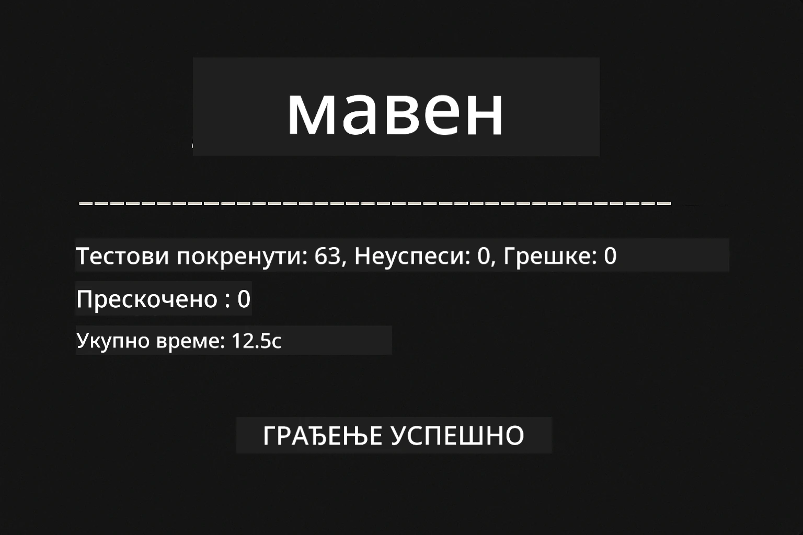
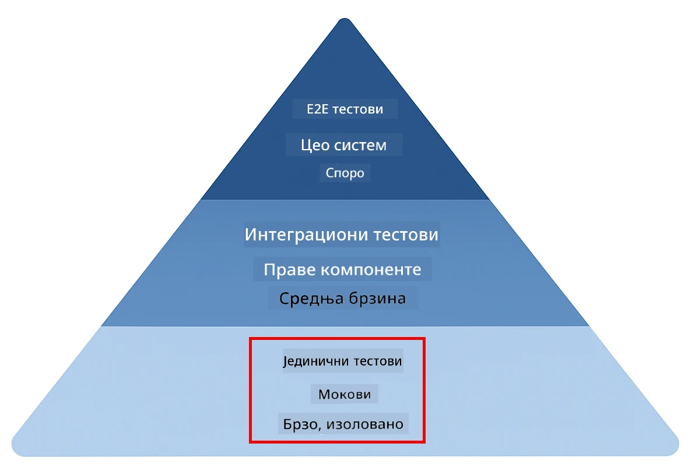
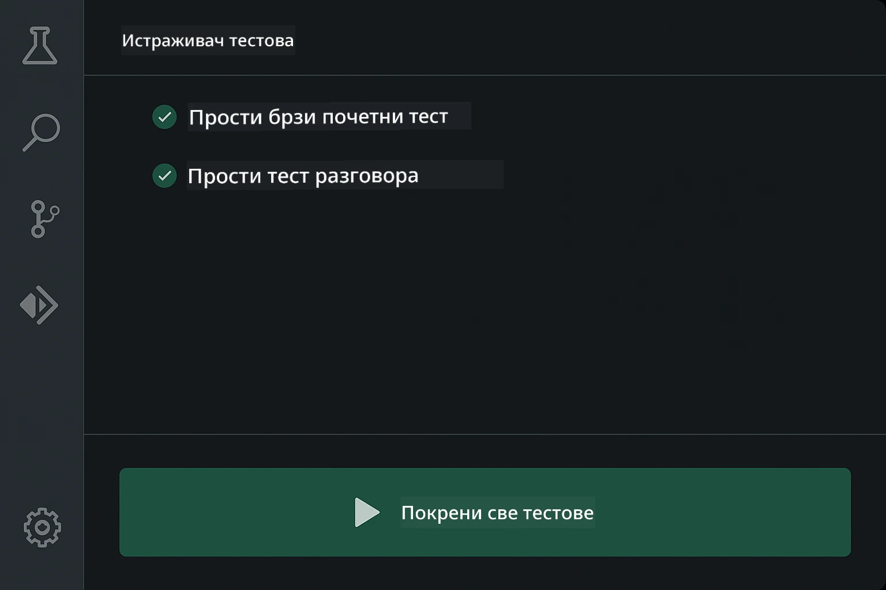
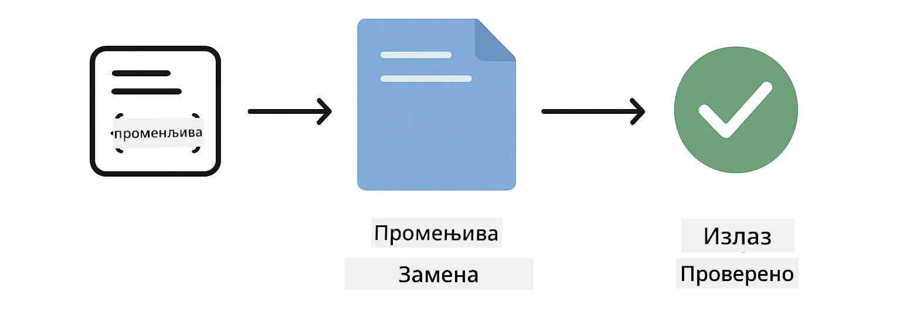
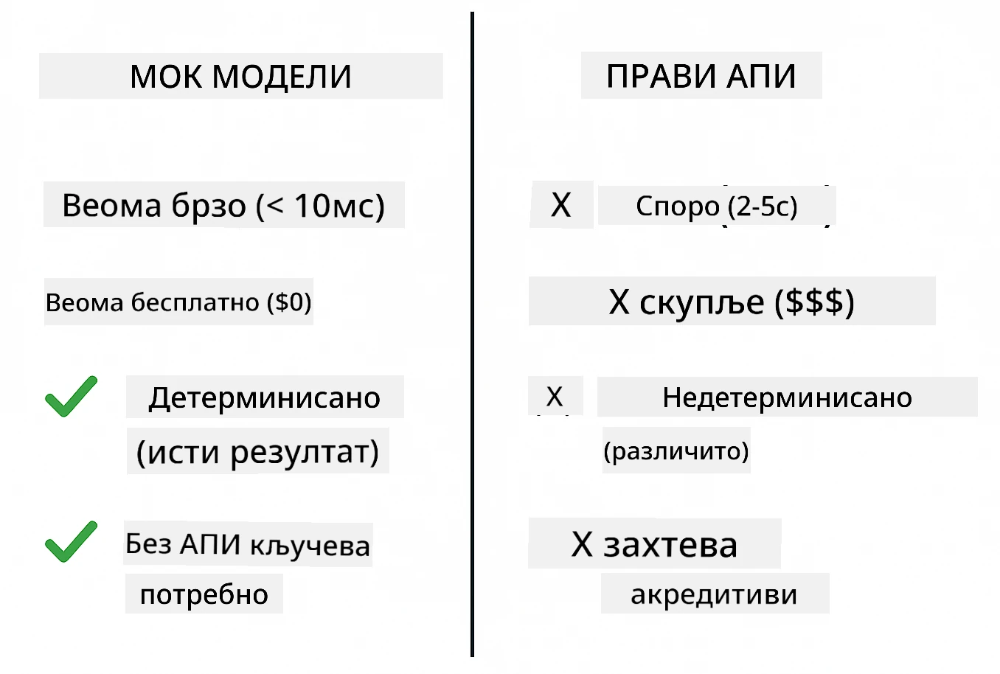
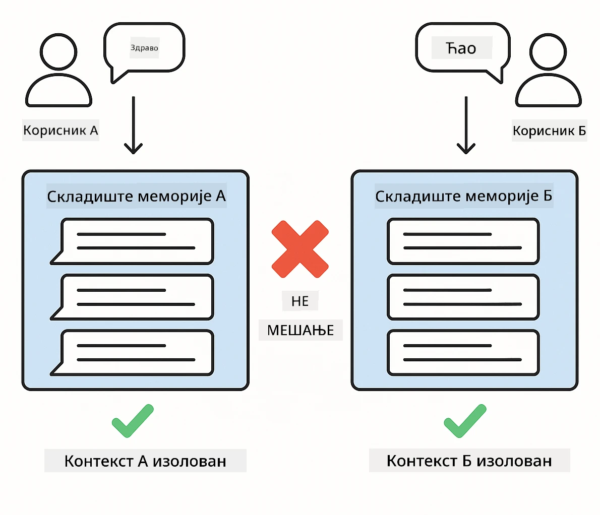
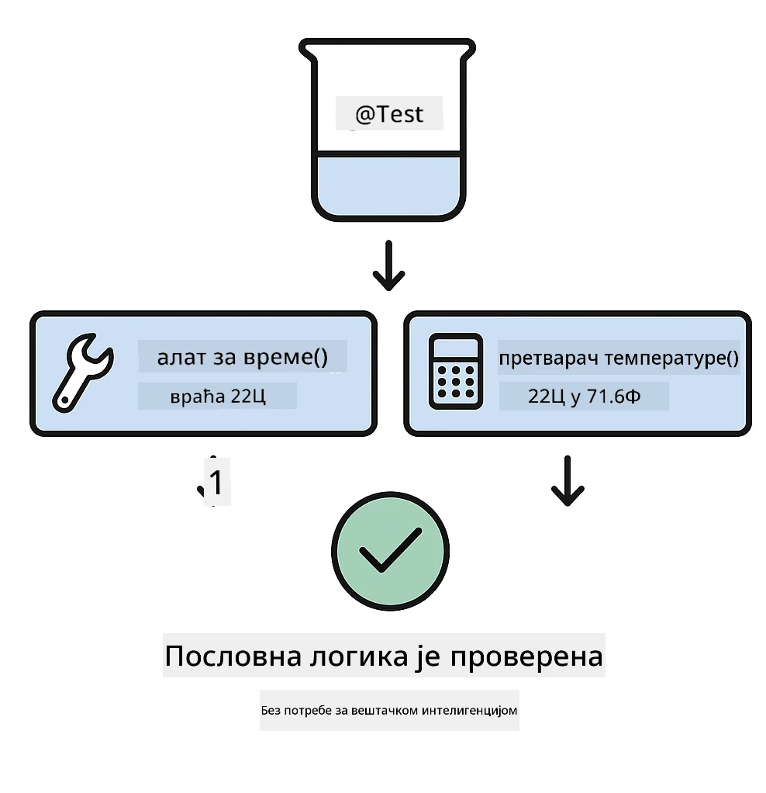
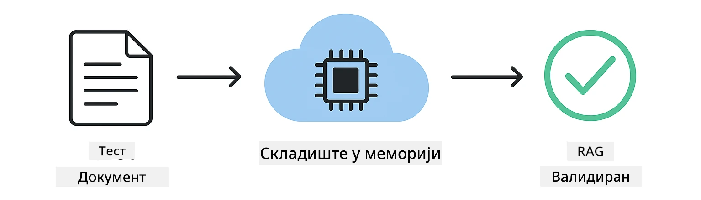

# Тестирање LangChain4j апликација

## Садржај

- [Брзи почетак](#брзи-почетак)
- [Шта тестови покривају](#шта-тестови-покривају)
- [Покретање тестова](#покретање-тестова)
- [Покретање тестова у VS Code-у](#покретање-тестова-у-vs-code-у)
- [Обрасци тестирања](#обрасци-тестирања)
- [Филозофија тестирања](#филозофија-тестирања)
- [Следећи кораци](#следећи-кораци)

Овај водич вас води кроз тестове који показују како тестирати AI апликације без потребе за API кључевима или спољним сервисима.

## Брзи почетак

Покрените све тестове једном командом:

**Bash:**
```bash
mvn test
```

**PowerShell:**
```powershell
mvn --% test
```

Када сви тестови прођу, требало би да видите излаз као на снимку екрана испод — тестови се извршавају без иједне грешке.



*Успешно извршење тестова које показује да сви тестови пролазе без грешака*

## Шта тестови покривају

Овај курс се фокусира на **јединичне тестове** који се извршавају локално. Сваки тест демонстрира одређени LangChain4j концепт у изолацији. Пирамида тестирања у наставку показује где јединични тестови припадају — они чине брзу и поуздану основу на којој се гради остатак ваше стратегије тестирања.



*Пирамида тестирања која показује баланс између јединичних тестова (брзи, изоловани), интеграционих тестова (праве компоненте) и end-to-end тестова. Ова обука покрива јединично тестирање.*

| Модул | Тестови | Фокус | Кључне датотеке |
|--------|---------|-------|-----------------|
| **01 - Увод** | 8 | Меморија конверзације и државност ћаскања | `SimpleConversationTest.java` |
| **02 - Инжењеринг подстицаја (Prompt)** | 12 | Обрасци GPT-5.2, нивои воље, структурисани излаз | `SimpleGpt5PromptTest.java` |
| **03 - RAG** | 10 | Унос докумената, уграђени вектори, претрага сличности | `DocumentServiceTest.java` |
| **04 - Алатке** | 12 | Позив функција и повезивање алатки | `SimpleToolsTest.java` |
| **05 - MCP** | 8 | Протокол контекста модела са Stdio транспортом | `SimpleMcpTest.java` |

## Покретање тестова

**Покрените све тестове из корена:**

**Bash:**
```bash
mvn test
```

**PowerShell:**
```powershell
mvn --% test
```

**Покрените тестове за одређени модул:**

**Bash:**
```bash
cd 01-introduction && mvn test
# Или из корена
mvn test -pl 01-introduction
```

**PowerShell:**
```powershell
cd 01-introduction; mvn --% test
# Или из корена
mvn --% test -pl 01-introduction
```

**Покрените једну тест класу:**

**Bash:**
```bash
mvn test -Dtest=SimpleConversationTest
```

**PowerShell:**
```powershell
mvn --% test -Dtest=SimpleConversationTest
```

**Покрените одређени тест метод:**

**Bash:**
```bash
mvn test -Dtest=SimpleConversationTest#требаОдржатиИсторијуРазговора
```

**PowerShell:**
```powershell
mvn --% test -Dtest=SimpleConversationTest#требаОдржаватиИсторијуРазговора
```

## Покретање тестова у VS Code-у

Ако користите Visual Studio Code, Test Explorer пружа графички интерфејс за покретање и дебаговање тестова.



*VS Code Test Explorer који приказује стабло тестова са свим Java тест класама и појединачним тест методама*

**Да бисте покренули тестове у VS Code-у:**

1. Отворите Test Explorer кликом на иконицу еprода у Activity Bar-у  
2. Проширите стабло тестова да бисте видели све модуле и тест класе  
3. Кликните на дугме за покретање поред било ког теста да га покренете појединачно  
4. Кликните „Run All Tests“ да извршите цео скуп  
5. Десни клик на било који тест и одаберите „Debug Test“ да поставите breakpoint и корак по корак пролазите кроз код

Test Explorer приказује зелене ознаке за тестове који су успешно прошли и пружа детаљне поруке о грешкама када неки тест не прође.

## Обрасци тестирања

### Образац 1: Тестирање шаблона подстицаја (Prompt Templates)

Најједноставнији образац тестира шаблоне без позива AI модела. Проверавате да ли се променљиве исправно замењују и да ли су подстицаји форматирани како се очекује.



*Тестирање шаблона подстицаја које показује ток замене променљивих: шаблон са ознакама → примењене вредности → верификовани форматирани излаз*

```java
@Test
@DisplayName("Should format prompt template with variables")
void testPromptTemplateFormatting() {
    PromptTemplate template = PromptTemplate.from(
        "Best time to visit {{destination}} for {{activity}}?"
    );
    
    Prompt prompt = template.apply(Map.of(
        "destination", "Paris",
        "activity", "sightseeing"
    ));
    
    assertThat(prompt.text()).isEqualTo("Best time to visit Paris for sightseeing?");
}
```

Овај образац проверава да ли замена променљивих ради исправно и да ли су подстицаји форматирани како треба — није потребан API кључ нити позив модела.

### Образац 2: Моковање језичких модела

При тестирању логике разговора, користите Mockito да креирате лажне моделе који враћају унапред дефинисане одговоре. Ово тестове чини брзим, бесплатним и детерминистичким.



*Поређење које показује зашто се мокови преферирају за тестирање: брзи су, бесплатни, детерминистички и не захтевају API кључеве*

```java
@ExtendWith(MockitoExtension.class)
class SimpleConversationTest {
    
    private ConversationService conversationService;
    
    @Mock
    private OpenAiOfficialChatModel mockChatModel;
    
    @BeforeEach
    void setUp() {
        ChatResponse mockResponse = ChatResponse.builder()
            .aiMessage(AiMessage.from("This is a test response"))
            .build();
        when(mockChatModel.chat(anyList())).thenReturn(mockResponse);
        
        conversationService = new ConversationService(mockChatModel);
    }
    
    @Test
    void shouldMaintainConversationHistory() {
        String conversationId = conversationService.startConversation();
        
        ChatResponse mockResponse1 = ChatResponse.builder()
            .aiMessage(AiMessage.from("Response 1"))
            .build();
        ChatResponse mockResponse2 = ChatResponse.builder()
            .aiMessage(AiMessage.from("Response 2"))
            .build();
        ChatResponse mockResponse3 = ChatResponse.builder()
            .aiMessage(AiMessage.from("Response 3"))
            .build();
        
        when(mockChatModel.chat(anyList()))
            .thenReturn(mockResponse1)
            .thenReturn(mockResponse2)
            .thenReturn(mockResponse3);

        conversationService.chat(conversationId, "First message");
        conversationService.chat(conversationId, "Second message");
        conversationService.chat(conversationId, "Third message");

        List<ChatMessage> history = conversationService.getHistory(conversationId);
        assertThat(history).hasSize(6); // 3 поруке корисника + 3 поруке вештачке интелигенције
    }
}
```

Овај образац се налази у `01-introduction/src/test/java/com/example/langchain4j/service/SimpleConversationTest.java`. Лажни модел осигурава доследно понашање како бисте могли да проверите исправно управљање меморијом.

### Образац 3: Тестирање изолације разговора

Меморија разговора мора држати више корисника одвојено. Овај тест проверава да се контексти разговора не мешају.



*Тестирање изолације разговора које показује одвојене меморије за различите кориснике како би се избегло мешање контекста*

```java
@Test
void shouldIsolateConversationsByid() {
    String conv1 = conversationService.startConversation();
    String conv2 = conversationService.startConversation();
    
    ChatResponse mockResponse = ChatResponse.builder()
        .aiMessage(AiMessage.from("Response"))
        .build();
    when(mockChatModel.chat(anyList())).thenReturn(mockResponse);

    conversationService.chat(conv1, "Message for conversation 1");
    conversationService.chat(conv2, "Message for conversation 2");

    List<ChatMessage> history1 = conversationService.getHistory(conv1);
    List<ChatMessage> history2 = conversationService.getHistory(conv2);
    
    assertThat(history1).hasSize(2);
    assertThat(history2).hasSize(2);
}
```

Сваки разговор одржава своју независну историју. У продукцијским системима ова изолација је критична за мултикорисничке апликације.

### Образац 4: Тестирање алатки независно

Алатке су функције које AI може позвати. Тестирајте их директно да бисте били сигурни да раде исправно без обзира на одлуке AIја.



*Тестирање алатки независно које показује извршење лажних алатки без позива AI-ју ради верификације пословне логике*

```java
@Test
void shouldConvertCelsiusToFahrenheit() {
    TemperatureTool tempTool = new TemperatureTool();
    String result = tempTool.celsiusToFahrenheit(25.0);
    assertThat(result).containsPattern("77[.,]0°F");
}

@Test
void shouldDemonstrateToolChaining() {
    WeatherTool weatherTool = new WeatherTool();
    TemperatureTool tempTool = new TemperatureTool();

    String weatherResult = weatherTool.getCurrentWeather("Seattle");
    assertThat(weatherResult).containsPattern("\\d+°C");

    String conversionResult = tempTool.celsiusToFahrenheit(22.0);
    assertThat(conversionResult).containsPattern("71[.,]6°F");
}
```

Ови тестови из `04-tools/src/test/java/com/example/langchain4j/agents/tools/SimpleToolsTest.java` верификују логику алатки без укључивања AIја. Пример повезивања показује како излаз једне алатке улази као улаз другој.

### Образац 5: Тестирање RAG-а у меморији

RAG системи обично захтевају векторске базе података и услуге уграђивања. Образац у меморији омогућава тестирање целе конзоле без спољних зависности.



*Радни ток тестирања RAG-а у меморији који показује парсирање докумената, чување уграђених вектора и претрагу сличности без потребе за базом података*

```java
@Test
void testProcessTextDocument() {
    String content = "This is a test document.\nIt has multiple lines.";
    InputStream inputStream = new ByteArrayInputStream(content.getBytes(StandardCharsets.UTF_8));
    
    DocumentService.ProcessedDocument result = 
        documentService.processDocument(inputStream, "test.txt");

    assertNotNull(result);
    assertTrue(result.segments().size() > 0);
    assertEquals("test.txt", result.segments().get(0).metadata().getString("filename"));
}
```

Овај тест из `03-rag/src/test/java/com/example/langchain4j/rag/service/DocumentServiceTest.java` креира документ у меморији и проверава раздвајање докумената на делове и руковање метаподацима.

### Образац 6: MCP интеграционо тестирање

MCP модул тестира интеграцију Протокола контекста модела користећи stdio транспорт. Ови тестови проверавају да ваша апликација може покренути и комуницирати са MCP серверима као подпроцесима.

Тестови из `05-mcp/src/test/java/com/example/langchain4j/mcp/SimpleMcpTest.java` верификују понашање MCP клијента.

**Покрените их:**

**Bash:**
```bash
cd 05-mcp && mvn test
```

**PowerShell:**
```powershell
cd 05-mcp; mvn --% test
```

## Филозофија тестирања

Тестирајте ваш код, а не AI. Ваши тестови треба да верификују код који пишете проверавајући како се подстицаји конструишу, како се меморија управља и како се алатке извршавају. AI одговори варирају и не би требало да буду део тестних тврдњи. Питајте се да ли ваш шаблон подстицаја исправно замењује променљиве, а не да ли AI даје прави одговор.

Користите мокове за језичке моделе. Они су спољне зависности које су споре, скупе и недетерминистичке. Моковање чини тестове брзим са милисекундама уместо секунди, бесплатним без трошкова за API и детерминистичким са истим резултатом сваки пут.

Држите тестове независним. Сваки тест треба сам да постави своје податке, да не зависи од других тестова и да очисти за собом. Тестови треба да пролазе без обзира на редослед извршења.

Тестирајте и крајње случајеве ван срећног пута. Испробајте празне уносе, јако велике уносе, посебне знакове, неважеће параметре и граничне услове. Ово често открива багове које нормална употреба не показује.

Користите описна имена. Упоредите `shouldMaintainConversationHistoryAcrossMultipleMessages()` са `test1()`. Прво вам тачно говори шта се тестира, што олакшава отклањање грешака.

## Следећи кораци

Сада када разумете обрасце тестирања, дубље се упустите у сваки модул:

- **[01 - Увод](../01-introduction/README.md)** - Научите управљање меморијом разговора  
- **[02 - Инжењеринг подстицаја](../02/prompt-engineering/README.md)** - Савладајте GPT-5.2 обрасце подстицаја  
- **[03 - RAG](../03-rag/README.md)** - Правите системе засноване на генерацији уз претрагу  
- **[04 - Алатке](../04-tools/README.md)** - Имплементирајте позив функција и ланце алатки  
- **[05 - MCP](../05-mcp/README.md)** - Интегришите Протокол контекста модела  

README сваког модула пружа детаљна објашњења концепата тестираних овде.

---

**Навигација:** [← Назад на главну](../README.md)

---

<!-- CO-OP TRANSLATOR DISCLAIMER START -->
**Изјава о одрицању одговорности**:
Овај документ је преведен коришћењем услуге за аутоматски превод [Co-op Translator](https://github.com/Azure/co-op-translator). Иако тежимо тачности, имајте у виду да аутоматски преводи могу садржати грешке или нетачности. Оригинални документ на његовом изворном језику треба сматрати ауторитативним извором. За критичне информације препоручује се професионални људски превод. Нисмо одговорни за било каква неспоразума или погрешна тумачења која произилазе из коришћења овог превода.
<!-- CO-OP TRANSLATOR DISCLAIMER END -->