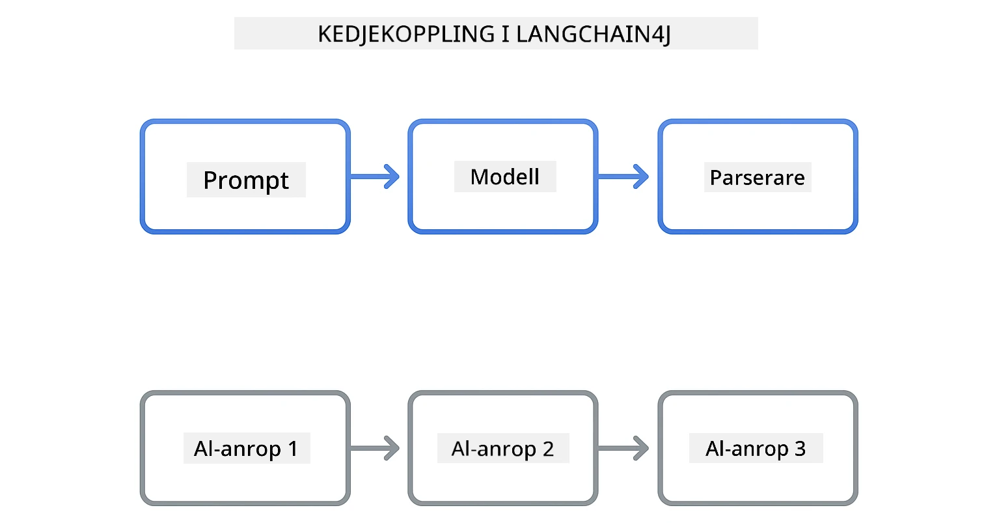
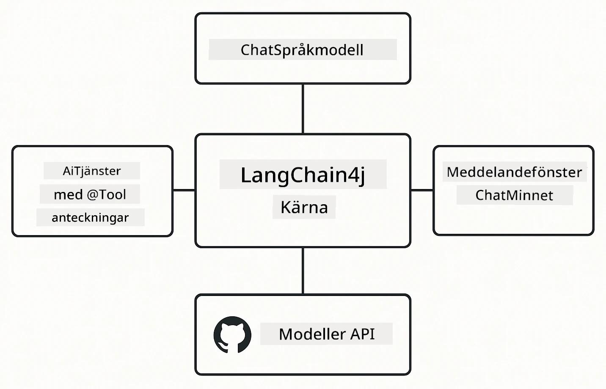

# Modul 00: Snabbstart

## Innehållsförteckning

- [Introduktion](../../../00-quick-start)
- [Vad är LangChain4j?](../../../00-quick-start)
- [LangChain4j beroenden](../../../00-quick-start)
- [Förutsättningar](../../../00-quick-start)
- [Installation](../../../00-quick-start)
  - [1. Skaffa din GitHub-token](../../../00-quick-start)
  - [2. Sätt din token](../../../00-quick-start)
- [Kör exemplen](../../../00-quick-start)
  - [1. Enkel chatt](../../../00-quick-start)
  - [2. Promptmönster](../../../00-quick-start)
  - [3. Funktionsanrop](../../../00-quick-start)
  - [4. Dokument Q&A (RAG)](../../../00-quick-start)
  - [5. Ansvarsfull AI](../../../00-quick-start)
- [Vad varje exempel visar](../../../00-quick-start)
- [Nästa steg](../../../00-quick-start)
- [Felsökning](../../../00-quick-start)

## Introduktion

Denna snabbstart är avsedd att få dig igång med LangChain4j så snabbt som möjligt. Den täcker det absoluta grunderna för att bygga AI-applikationer med LangChain4j och GitHub Models. I de kommande modulerna kommer du att använda Azure OpenAI med LangChain4j för att bygga mer avancerade applikationer.

## Vad är LangChain4j?

LangChain4j är ett Java-bibliotek som förenklar skapandet av AI-drivna applikationer. Istället för att hantera HTTP-klienter och JSON-parsing arbetar du med rena Java-API:er.

"Chain" i LangChain syftar på att kedja ihop flera komponenter - du kan kedja en prompt till en modell till en parser, eller kedja flera AI-anrop där en utdata matas in som nästa indata. Den här snabbstarten fokuserar på grunderna innan vi utforskar mer komplexa kedjor.



*Kedjning av komponenter i LangChain4j - byggstenar kopplas ihop för att skapa kraftfulla AI-arbetsflöden*

Vi använder tre kärnkomponenter:

**ChatLanguageModel** - Gränssnittet för AI-modellinteraktioner. Anropa `model.chat("prompt")` och få tillbaka en svarsträng. Vi använder `OpenAiOfficialChatModel` som fungerar med OpenAI-kompatibla slutpunkter som GitHub Models.

**AiServices** - Skapar typsäkra AI-tjänstegränssnitt. Definiera metoder, annotera dem med `@Tool` och LangChain4j sköter orkestreringen. AI:n anropar automatiskt dina Java-metoder vid behov.

**MessageWindowChatMemory** - Underhåller konversationshistorik. Utan detta är varje förfrågan oberoende. Med det minns AI:n tidigare meddelanden och upprätthåller kontext över flera vändor.



*LangChain4j-arkitektur - kärnkomponenter som samarbetar för att driva dina AI-applikationer*

## LangChain4j beroenden

Denna snabbstart använder två Maven-beroenden i [`pom.xml`](../../../00-quick-start/pom.xml):

```xml
<!-- Core LangChain4j library -->
<dependency>
    <groupId>dev.langchain4j</groupId>
    <artifactId>langchain4j</artifactId> <!-- Inherited from BOM in root pom.xml -->
</dependency>

<!-- OpenAI integration (works with GitHub Models) -->
<dependency>
    <groupId>dev.langchain4j</groupId>
    <artifactId>langchain4j-open-ai-official</artifactId> <!-- Inherited from BOM in root pom.xml -->
</dependency>
```

Modulen `langchain4j-open-ai-official` tillhandahåller klassen `OpenAiOfficialChatModel` som kopplar till OpenAI-kompatibla API:er. GitHub Models använder samma API-format, så ingen specialadapter behövs - peka bara bas-URL:en till `https://models.github.ai/inference`.

## Förutsättningar

**Använder du Dev Container?** Java och Maven är redan installerade. Du behöver endast en GitHub Personal Access Token.

**Lokal utveckling:**
- Java 21+, Maven 3.9+
- GitHub Personal Access Token (instruktioner nedan)

> **Notera:** Denna modul använder `gpt-4.1-nano` från GitHub Models. Ändra inte modellnamnet i koden – det är konfigurerat för att fungera med GitHubs tillgängliga modeller.

## Installation

### 1. Skaffa din GitHub-token

1. Gå till [GitHub Inställningar → Personal Access Tokens](https://github.com/settings/personal-access-tokens)
2. Klicka på "Generate new token"
3. Sätt ett beskrivande namn (t.ex. "LangChain4j Demo")
4. Ange utgångstid (7 dagar rekommenderas)
5. Under "Account permissions" hitta "Models" och sätt till "Read-only"
6. Klicka på "Generate token"
7. Kopiera och spara din token - du kommer inte se den igen

### 2. Sätt din token

**Alternativ 1: Använda VS Code (rekommenderas)**

Om du använder VS Code, lägg till din token i `.env`-filen i projektets rotmapp:

Om `.env`-filen inte finns, kopiera `.env.example` till `.env` eller skapa en ny `.env`-fil i projektets rot.

**Exempel på `.env`-fil:**
```bash
# I /workspaces/LangChain4j-for-Beginners/.env
GITHUB_TOKEN=your_token_here
```

Sedan kan du enkelt högerklicka på valfri demo-fil (t.ex. `BasicChatDemo.java`) i Utforskaren och välja **"Run Java"** eller använda startkonfigurationerna från panelen Kör och Felsök.

**Alternativ 2: Använda terminal**

Sätt token som en miljövariabel:

**Bash:**
```bash
export GITHUB_TOKEN=your_token_here
```

**PowerShell:**
```powershell
$env:GITHUB_TOKEN=your_token_here
```

## Kör exemplen

**Använder du VS Code:** Högerklicka på valfri demo-fil i Utforskaren och välj **"Run Java"**, eller använd startkonfigurationerna från panelen Kör och Felsök (se till att du först lagt till din token i `.env`-filen).

**Använder du Maven:** Du kan också köra via kommandoraden:

### 1. Enkel chatt

**Bash:**
```bash
mvn compile exec:java -Dexec.mainClass=com.example.langchain4j.quickstart.BasicChatDemo
```

**PowerShell:**
```powershell
mvn --% compile exec:java -Dexec.mainClass=com.example.langchain4j.quickstart.BasicChatDemo
```

### 2. Promptmönster

**Bash:**
```bash
mvn compile exec:java -Dexec.mainClass=com.example.langchain4j.quickstart.PromptEngineeringDemo
```

**PowerShell:**
```powershell
mvn --% compile exec:java -Dexec.mainClass=com.example.langchain4j.quickstart.PromptEngineeringDemo
```

Visar zero-shot, few-shot, chain-of-thought, och rollbaserad prompting.

### 3. Funktionsanrop

**Bash:**
```bash
mvn compile exec:java -Dexec.mainClass=com.example.langchain4j.quickstart.ToolIntegrationDemo
```

**PowerShell:**
```powershell
mvn --% compile exec:java -Dexec.mainClass=com.example.langchain4j.quickstart.ToolIntegrationDemo
```

AI:n anropar automatiskt dina Java-metoder vid behov.

### 4. Dokument Q&A (RAG)

**Bash:**
```bash
mvn compile exec:java -Dexec.mainClass=com.example.langchain4j.quickstart.SimpleReaderDemo
```

**PowerShell:**
```powershell
mvn --% compile exec:java -Dexec.mainClass=com.example.langchain4j.quickstart.SimpleReaderDemo
```

Ställ frågor om innehållet i `document.txt`.

### 5. Ansvarsfull AI

**Bash:**
```bash
mvn compile exec:java -Dexec.mainClass=com.example.langchain4j.quickstart.ResponsibleAIDemo
```

**PowerShell:**
```powershell
mvn --% compile exec:java -Dexec.mainClass=com.example.langchain4j.quickstart.ResponsibleAIDemo
```

Se hur AI-säkerhetsfilter blockerar skadligt innehåll.

## Vad varje exempel visar

**Enkel chatt** - [BasicChatDemo.java](../../../00-quick-start/src/main/java/com/example/langchain4j/quickstart/BasicChatDemo.java)

Börja här för att se LangChain4j i sin enklaste form. Du skapar en `OpenAiOfficialChatModel`, skickar en prompt med `.chat()`, och får tillbaka ett svar. Detta visar grunden: hur man initierar modeller med anpassade slutpunkter och API-nycklar. När du förstår detta mönster bygger allt annat på det.

```java
ChatLanguageModel model = OpenAiOfficialChatModel.builder()
    .baseUrl("https://models.github.ai/inference")
    .apiKey(System.getenv("GITHUB_TOKEN"))
    .modelName("gpt-4.1-nano")
    .build();

String response = model.chat("What is LangChain4j?");
System.out.println(response);
```

> **🤖 Testa med [GitHub Copilot](https://github.com/features/copilot) Chat:** Öppna [`BasicChatDemo.java`](../../../00-quick-start/src/main/java/com/example/langchain4j/quickstart/BasicChatDemo.java) och fråga:
> - "Hur skulle jag byta från GitHub Models till Azure OpenAI i denna kod?"
> - "Vilka andra parametrar kan jag konfigurera i OpenAiOfficialChatModel.builder()?"
> - "Hur lägger jag till strömningssvar istället för att vänta på komplett svar?"

**Prompt Engineering** - [PromptEngineeringDemo.java](../../../00-quick-start/src/main/java/com/example/langchain4j/quickstart/PromptEngineeringDemo.java)

Nu när du vet hur du pratar med en modell, låt oss utforska vad du säger till den. Denna demo använder samma modelluppsättning men visar fyra olika promptmönster. Testa zero-shot-prompter för direkta instruktioner, few-shot-prompter som lär sig från exempel, chain-of-thought-prompter som avslöjar resonemangssteg, och rollbaserade prompter som sätter kontext. Du ser hur samma modell ger dramatiskt olika resultat beroende på hur du formulerar din förfrågan.

```java
PromptTemplate template = PromptTemplate.from(
    "What's the best time to visit {{destination}} for {{activity}}?"
);

Prompt prompt = template.apply(Map.of(
    "destination", "Paris",
    "activity", "sightseeing"
));

String response = model.chat(prompt.text());
```

> **🤖 Testa med [GitHub Copilot](https://github.com/features/copilot) Chat:** Öppna [`PromptEngineeringDemo.java`](../../../00-quick-start/src/main/java/com/example/langchain4j/quickstart/PromptEngineeringDemo.java) och fråga:
> - "Vad är skillnaden mellan zero-shot och few-shot prompting, och när ska jag använda vardera?"
> - "Hur påverkar temperaturparametern modellens svar?"
> - "Vilka tekniker finns för att förebygga promptinjektioner i produktion?"
> - "Hur kan jag skapa återanvändbara PromptTemplate-objekt för vanliga mönster?"

**Verktygsintegration** - [ToolIntegrationDemo.java](../../../00-quick-start/src/main/java/com/example/langchain4j/quickstart/ToolIntegrationDemo.java)

Här blir LangChain4j kraftfullt. Du använder `AiServices` för att skapa en AI-assistent som kan anropa dina Java-metoder. Märk bara metoder med `@Tool("beskrivning")` och LangChain4j sköter resten - AI:n bestämmer automatiskt när varje verktyg ska användas baserat på vad användaren frågar. Detta demonstrerar funktionsanrop, en nyckelteknik för att bygga AI som kan agera, inte bara svara på frågor.

```java
@Tool("Performs addition of two numeric values")
public double add(double a, double b) {
    return a + b;
}

MathAssistant assistant = AiServices.create(MathAssistant.class, model);
String response = assistant.chat("What is 25 plus 17?");
```

> **🤖 Testa med [GitHub Copilot](https://github.com/features/copilot) Chat:** Öppna [`ToolIntegrationDemo.java`](../../../00-quick-start/src/main/java/com/example/langchain4j/quickstart/ToolIntegrationDemo.java) och fråga:
> - "Hur fungerar @Tool-annoteringen och vad gör LangChain4j med den bakom kulisserna?"
> - "Kan AI anropa flera verktyg i följd för att lösa komplexa problem?"
> - "Vad händer om ett verktyg kastar ett undantag - hur borde jag hantera fel?"
> - "Hur skulle jag integrera ett riktigt API istället för detta kalkylexempel?"

**Dokument Q&A (RAG)** - [SimpleReaderDemo.java](../../../00-quick-start/src/main/java/com/example/langchain4j/quickstart/SimpleReaderDemo.java)

Här ser du grunden för RAG (retrieval-augmented generation). Istället för att förlita dig på modellens träningsdata laddar du innehåll från [`document.txt`](../../../00-quick-start/document.txt) och inkluderar det i prompten. AI:n svarar baserat på ditt dokument, inte dess allmänna kunskap. Detta är första steget mot att bygga system som kan arbeta med dina egna data.

```java
Document document = FileSystemDocumentLoader.loadDocument("document.txt");
String content = document.text();

String prompt = "Based on this document: " + content + 
                "\nQuestion: What is the main topic?";
String response = model.chat(prompt);
```

> **Notera:** Denna enkla metod laddar hela dokumentet i prompten. För stora filer (>10KB) överskrider du kontextgränser. Modul 03 täcker chunking och vektorsökning för produktions-RAG-system.

> **🤖 Testa med [GitHub Copilot](https://github.com/features/copilot) Chat:** Öppna [`SimpleReaderDemo.java`](../../../00-quick-start/src/main/java/com/example/langchain4j/quickstart/SimpleReaderDemo.java) och fråga:
> - "Hur förhindrar RAG AI-hallucinationer jämfört med att använda modellens träningsdata?"
> - "Vad är skillnaden mellan denna enkla metod och att använda vektorembeddingar för hämtning?"
> - "Hur skulle jag skala detta för att hantera flera dokument eller större kunskapsbaser?"
> - "Vilka är bästa metoder för att strukturera prompten så att AI bara använder den angivna kontexten?"

**Ansvarsfull AI** - [ResponsibleAIDemo.java](../../../00-quick-start/src/main/java/com/example/langchain4j/quickstart/ResponsibleAIDemo.java)

Bygg AI-säkerhet med försvar i djupet. Denna demo visar två skyddslager som samarbetar:

**Del 1: LangChain4j Input Guardrails** - Blockera farliga promptar innan de når LLM. Skapa egna skyddslinjer som kontrollerar förbjudna nyckelord eller mönster. Dessa körs i din kod, så de är snabba och kostnadsfria.

```java
class DangerousContentGuardrail implements InputGuardrail {
    @Override
    public InputGuardrailResult validate(UserMessage userMessage) {
        String text = userMessage.singleText().toLowerCase();
        if (text.contains("explosives")) {
            return fatal("Blocked: contains prohibited keyword");
        }
        return success();
    }
}
```

**Del 2: Provider Safety Filters** - GitHub Models har inbyggda filter som fångar vad dina skyddslinjer kan missa. Du ser hårda blockeringar (HTTP 400-fel) för allvarliga överträdelser och mjuka avslag där AI artigt vägrar.

> **🤖 Testa med [GitHub Copilot](https://github.com/features/copilot) Chat:** Öppna [`ResponsibleAIDemo.java`](../../../00-quick-start/src/main/java/com/example/langchain4j/quickstart/ResponsibleAIDemo.java) och fråga:
> - "Vad är InputGuardrail och hur skapar jag min egen?"
> - "Vad är skillnaden mellan ett hårt block och ett mjukt avslag?"
> - "Varför använda både skyddslinjer och leverantörsfilter tillsammans?"

## Nästa steg

**Nästa modul:** [01-introduction - Kom igång med LangChain4j och gpt-5 på Azure](../01-introduction/README.md)

---

**Navigering:** [← Tillbaka till huvudmenyn](../README.md) | [Nästa: Modul 01 - Introduktion →](../01-introduction/README.md)

---

## Felsökning

### Första byggningen med Maven

**Problem**: Initial `mvn clean compile` eller `mvn package` tar lång tid (10-15 minuter)

**Orsak**: Maven behöver ladda ner alla projektsberoenden (Spring Boot, LangChain4j-bibliotek, Azure SDK:er etc.) vid första bygget.

**Lösning**: Detta är normalt. Efterföljande byggen går mycket snabbare då beroenden är cachade lokalt. Nedladdningstiden beror på din nätverkshastighet.

### PowerShell Maven-kommandsyntax

**Problem**: Maven-kommandon misslyckas med felmeddelandet `Unknown lifecycle phase ".mainClass=..."`

**Orsak**: PowerShell tolkar `=` som en variabeltilldelningsoperator och bryter Maven-egenskapsyntaxen.
**Lösning**: Använd stopp-analysoperatorn `--%` före Maven-kommandot:

**PowerShell:**
```powershell
mvn --% compile exec:java -Dexec.mainClass=com.example.langchain4j.quickstart.BasicChatDemo
```

**Bash:**
```bash
mvn compile exec:java -Dexec.mainClass=com.example.langchain4j.quickstart.BasicChatDemo
```

Operatorn `--%` talar om för PowerShell att skicka alla återstående argument bokstavligt till Maven utan tolkning.

### Emoji-visning i Windows PowerShell

**Problem**: AI-svar visar skräptecken (t.ex. `????` eller `â??`) istället för emojis i PowerShell

**Orsak**: PowerShells standardkodning stödjer inte UTF-8-emojis

**Lösning**: Kör detta kommando innan du kör Java-applikationer:
```cmd
chcp 65001
```

Detta tvingar UTF-8-kodning i terminalen. Alternativt kan du använda Windows Terminal som har bättre Unicode-stöd.

### Felsökning av API-anrop

**Problem**: Autentiseringsfel, begränsningar på antal förfrågningar eller oväntade svar från AI-modellen

**Lösning**: Exemplen inkluderar `.logRequests(true)` och `.logResponses(true)` för att visa API-anrop i konsolen. Detta hjälper till att felsöka autentiseringsfel, begränsningar eller oväntade svar. Ta bort dessa flaggor i produktion för att minska loggbrus.

---

<!-- CO-OP TRANSLATOR DISCLAIMER START -->
**Ansvarsfriskrivning**:
Detta dokument har översatts med AI-översättningstjänsten [Co-op Translator](https://github.com/Azure/co-op-translator). Även om vi strävar efter noggrannhet, vänligen observera att automatiska översättningar kan innehålla fel eller brister. Det ursprungliga dokumentet på dess originalspråk bör betraktas som den auktoritära källan. För kritisk information rekommenderas professionell mänsklig översättning. Vi ansvarar inte för några missförstånd eller feltolkningar som uppstår vid användning av denna översättning.
<!-- CO-OP TRANSLATOR DISCLAIMER END -->