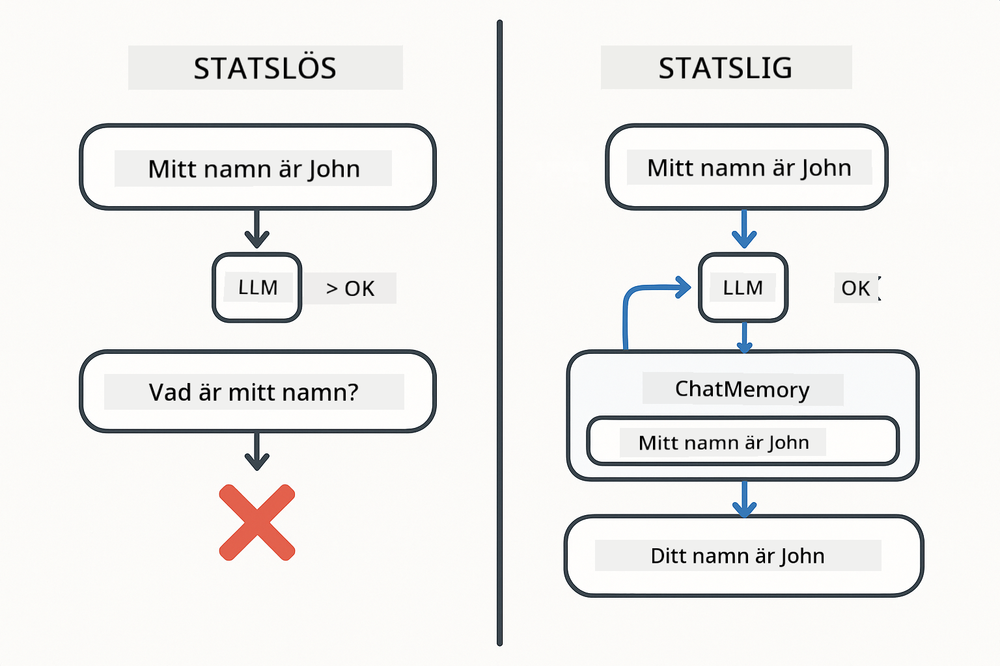
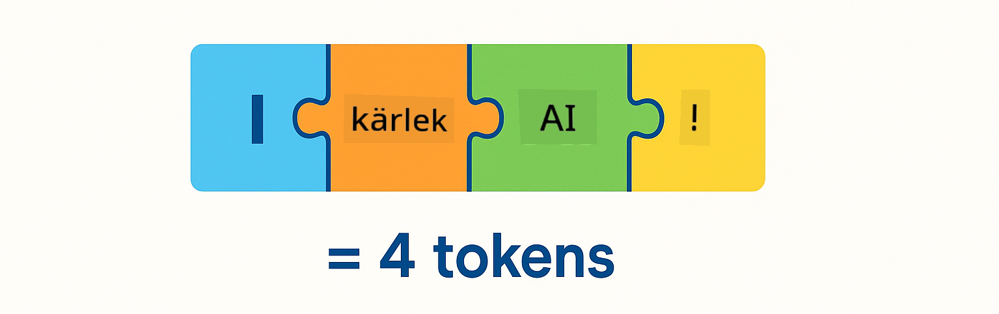
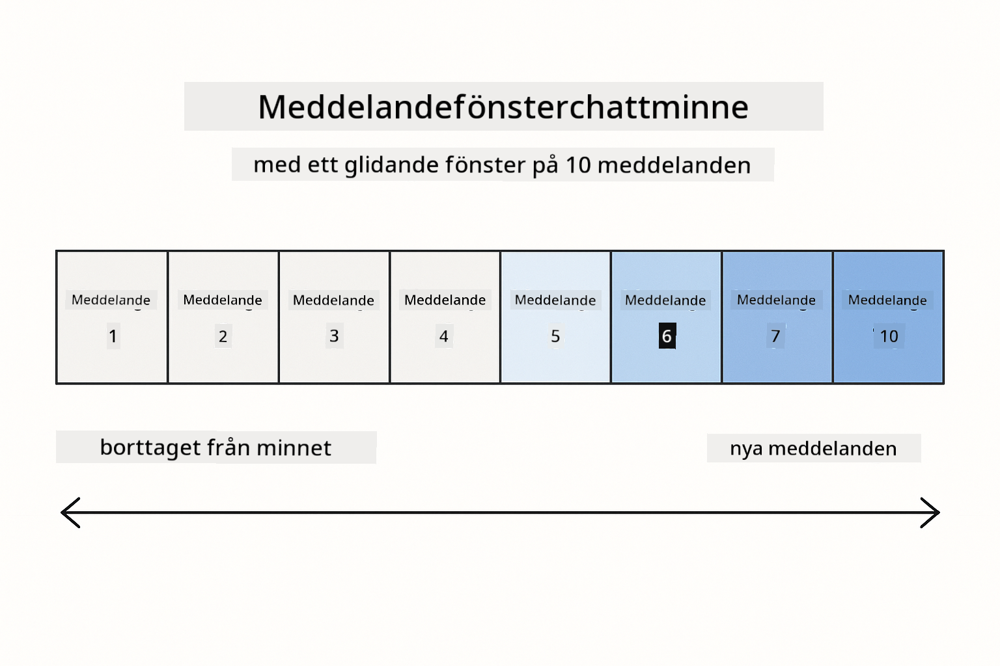
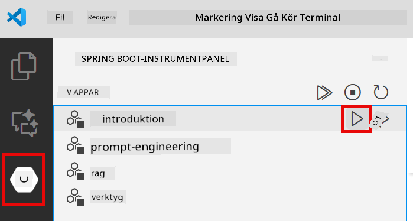
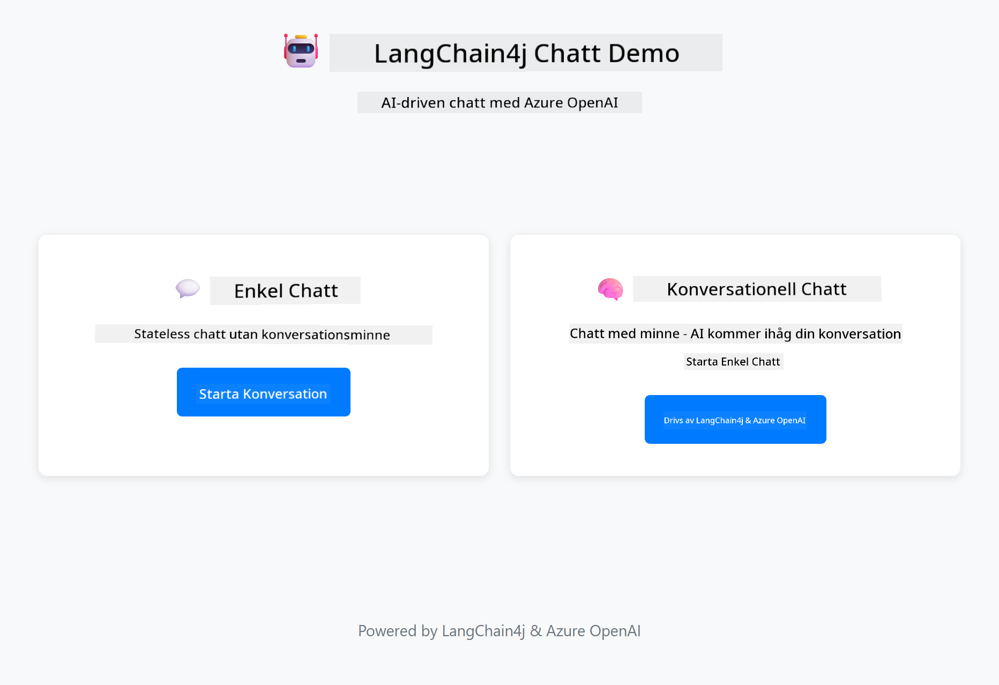
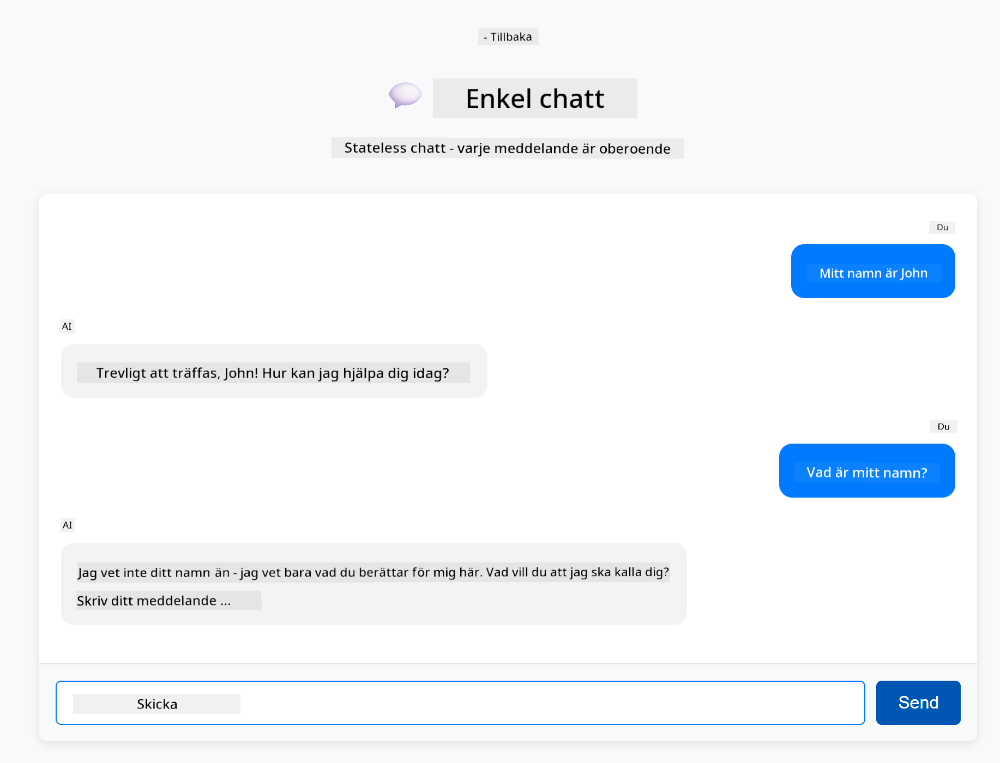

<!--
CO_OP_TRANSLATOR_METADATA:
{
  "original_hash": "c3e07ca58d0b8a3f47d3bf5728541e0a",
  "translation_date": "2025-12-13T13:39:55+00:00",
  "source_file": "01-introduction/README.md",
  "language_code": "sv"
}
-->
# Modul 01: Komma igång med LangChain4j

## Innehållsförteckning

- [Vad du kommer att lära dig](../../../01-introduction)
- [Förutsättningar](../../../01-introduction)
- [Förstå kärnproblemet](../../../01-introduction)
- [Förstå tokens](../../../01-introduction)
- [Hur minne fungerar](../../../01-introduction)
- [Hur detta använder LangChain4j](../../../01-introduction)
- [Distribuera Azure OpenAI-infrastruktur](../../../01-introduction)
- [Kör applikationen lokalt](../../../01-introduction)
- [Använda applikationen](../../../01-introduction)
  - [Stateless Chat (vänster panel)](../../../01-introduction)
  - [Stateful Chat (höger panel)](../../../01-introduction)
- [Nästa steg](../../../01-introduction)

## Vad du kommer att lära dig

Om du slutförde snabbstarten såg du hur man skickar prompts och får svar. Det är grunden, men riktiga applikationer behöver mer. Denna modul lär dig hur du bygger konversations-AI som minns kontext och behåller tillstånd – skillnaden mellan en engångs-demo och en produktionsklar applikation.

Vi kommer att använda Azure OpenAI:s GPT-5 genom hela denna guide eftersom dess avancerade resonemangsförmåga gör beteendet hos olika mönster tydligare. När du lägger till minne kommer du tydligt att se skillnaden. Detta gör det lättare att förstå vad varje komponent tillför din applikation.

Du kommer att bygga en applikation som demonstrerar båda mönstren:

**Stateless Chat** – Varje förfrågan är oberoende. Modellen har inget minne av tidigare meddelanden. Detta är mönstret du använde i snabbstarten.

**Stateful Conversation** – Varje förfrågan inkluderar konversationshistorik. Modellen behåller kontext över flera turer. Detta är vad produktionsapplikationer kräver.

## Förutsättningar

- Azure-prenumeration med tillgång till Azure OpenAI
- Java 21, Maven 3.9+
- Azure CLI (https://learn.microsoft.com/en-us/cli/azure/install-azure-cli)
- Azure Developer CLI (azd) (https://learn.microsoft.com/en-us/azure/developer/azure-developer-cli/install-azd)

> **Notera:** Java, Maven, Azure CLI och Azure Developer CLI (azd) är förinstallerade i den medföljande devcontainern.

> **Notera:** Denna modul använder GPT-5 på Azure OpenAI. Distributionen konfigureras automatiskt via `azd up` – ändra inte modellnamnet i koden.

## Förstå kärnproblemet

Språkmodeller är stateless. Varje API-anrop är oberoende. Om du skickar "Mitt namn är John" och sedan frågar "Vad heter jag?", har modellen ingen aning om att du just presenterade dig. Den behandlar varje förfrågan som om det vore den första konversationen du någonsin haft.

Detta är okej för enkla frågor och svar men värdelöst för riktiga applikationer. Kundtjänstrobotar behöver komma ihåg vad du berättade för dem. Personliga assistenter behöver kontext. Alla konversationer med flera turer kräver minne.



*Skillnaden mellan stateless (oberoende anrop) och stateful (konstextmedvetna) konversationer*

## Förstå tokens

Innan vi dyker in i konversationer är det viktigt att förstå tokens – de grundläggande textenheterna som språkmodeller bearbetar:



*Exempel på hur text delas upp i tokens – "I love AI!" blir 4 separata bearbetningsenheter*

Tokens är hur AI-modeller mäter och bearbetar text. Ord, skiljetecken och till och med mellanslag kan vara tokens. Din modell har en gräns för hur många tokens den kan bearbeta samtidigt (400 000 för GPT-5, med upp till 272 000 input-tokens och 128 000 output-tokens). Att förstå tokens hjälper dig att hantera konversationslängd och kostnader.

## Hur minne fungerar

Chattminne löser det stateless problemet genom att behålla konversationshistorik. Innan du skickar din förfrågan till modellen lägger ramverket till relevanta tidigare meddelanden. När du frågar "Vad heter jag?" skickar systemet faktiskt hela konversationshistoriken, vilket gör att modellen kan se att du tidigare sa "Mitt namn är John."

LangChain4j tillhandahåller minnesimplementationer som hanterar detta automatiskt. Du väljer hur många meddelanden som ska sparas och ramverket hanterar kontextfönstret.



*MessageWindowChatMemory behåller ett glidande fönster av senaste meddelanden och släpper automatiskt gamla*

## Hur detta använder LangChain4j

Denna modul bygger vidare på snabbstarten genom att integrera Spring Boot och lägga till konversationsminne. Så här passar delarna ihop:

**Beroenden** – Lägg till två LangChain4j-bibliotek:

```xml
<dependency>
    <groupId>dev.langchain4j</groupId>
    <artifactId>langchain4j</artifactId> <!-- Inherited from BOM in root pom.xml -->
</dependency>
<dependency>
    <groupId>dev.langchain4j</groupId>
    <artifactId>langchain4j-open-ai-official</artifactId> <!-- Inherited from BOM in root pom.xml -->
</dependency>
```

**Chattmodell** – Konfigurera Azure OpenAI som en Spring bean ([LangChainConfig.java](../../../01-introduction/src/main/java/com/example/langchain4j/config/LangChainConfig.java)):

```java
@Bean
public OpenAiOfficialChatModel openAiOfficialChatModel() {
    return OpenAiOfficialChatModel.builder()
            .baseUrl(azureEndpoint)
            .apiKey(azureApiKey)
            .modelName(deploymentName)
            .timeout(Duration.ofMinutes(5))
            .maxRetries(3)
            .build();
}
```

Buildern läser inloggningsuppgifter från miljövariabler som sätts av `azd up`. Att sätta `baseUrl` till din Azure-endpoint gör att OpenAI-klienten fungerar med Azure OpenAI.

**Konversationsminne** – Spåra chatt-historik med MessageWindowChatMemory ([ConversationService.java](../../../01-introduction/src/main/java/com/example/langchain4j/service/ConversationService.java)):

```java
ChatMemory memory = MessageWindowChatMemory.withMaxMessages(10);

memory.add(UserMessage.from("My name is John"));
memory.add(AiMessage.from("Nice to meet you, John!"));

memory.add(UserMessage.from("What's my name?"));
AiMessage aiMessage = chatModel.chat(memory.messages()).aiMessage();
memory.add(aiMessage);
```

Skapa minne med `withMaxMessages(10)` för att behålla de senaste 10 meddelandena. Lägg till användar- och AI-meddelanden med typade wrappers: `UserMessage.from(text)` och `AiMessage.from(text)`. Hämta historik med `memory.messages()` och skicka den till modellen. Tjänsten lagrar separata minnesinstanser per konversations-ID, vilket tillåter flera användare att chatta samtidigt.

> **🤖 Prova med [GitHub Copilot](https://github.com/features/copilot) Chat:** Öppna [`ConversationService.java`](../../../01-introduction/src/main/java/com/example/langchain4j/service/ConversationService.java) och fråga:
> - "Hur bestämmer MessageWindowChatMemory vilka meddelanden som ska tas bort när fönstret är fullt?"
> - "Kan jag implementera egen minneslagring med en databas istället för i minnet?"
> - "Hur skulle jag lägga till summering för att komprimera gammal konversationshistorik?"

Den stateless chatt-endpointen hoppar helt över minnet – bara `chatModel.chat(prompt)` som i snabbstarten. Den stateful endpointen lägger till meddelanden i minnet, hämtar historik och inkluderar den kontexten med varje förfrågan. Samma modellkonfiguration, olika mönster.

## Distribuera Azure OpenAI-infrastruktur

**Bash:**
```bash
cd 01-introduction
azd up  # Välj prenumeration och plats (eastus2 rekommenderas)
```

**PowerShell:**
```powershell
cd 01-introduction
azd up  # Välj prenumeration och plats (eastus2 rekommenderas)
```

> **Notera:** Om du får ett timeout-fel (`RequestConflict: Cannot modify resource ... provisioning state is not terminal`), kör bara `azd up` igen. Azure-resurser kan fortfarande provisioneras i bakgrunden, och att försöka igen tillåter distributionen att slutföras när resurserna når ett terminalt tillstånd.

Detta kommer att:
1. Distribuera Azure OpenAI-resurs med GPT-5 och text-embedding-3-small modeller
2. Automatiskt generera `.env`-fil i projektroten med inloggningsuppgifter
3. Sätta upp alla nödvändiga miljövariabler

**Har du problem med distributionen?** Se [Infrastructure README](infra/README.md) för detaljerad felsökning inklusive konflikter med subdomännamn, manuella steg för distribution via Azure Portal och vägledning för modellkonfiguration.

**Verifiera att distributionen lyckades:**

**Bash:**
```bash
cat ../.env  # Bör visa AZURE_OPENAI_ENDPOINT, API_KEY, etc.
```

**PowerShell:**
```powershell
Get-Content ..\.env  # Bör visa AZURE_OPENAI_ENDPOINT, API_KEY, etc.
```

> **Notera:** Kommandot `azd up` genererar automatiskt `.env`-filen. Om du behöver uppdatera den senare kan du antingen redigera `.env`-filen manuellt eller generera om den genom att köra:
>
> **Bash:**
> ```bash
> cd ..
> bash .azd-env.sh
> ```
>
> **PowerShell:**
> ```powershell
> cd ..
> .\.azd-env.ps1
> ```

## Kör applikationen lokalt

**Verifiera distribution:**

Se till att `.env`-filen finns i rotkatalogen med Azure-uppgifter:

**Bash:**
```bash
cat ../.env  # Bör visa AZURE_OPENAI_ENDPOINT, API_KEY, DEPLOYMENT
```

**PowerShell:**
```powershell
Get-Content ..\.env  # Bör visa AZURE_OPENAI_ENDPOINT, API_KEY, DEPLOYMENT
```

**Starta applikationerna:**

**Alternativ 1: Använd Spring Boot Dashboard (Rekommenderas för VS Code-användare)**

Devcontainern inkluderar Spring Boot Dashboard-tillägget, som ger ett visuellt gränssnitt för att hantera alla Spring Boot-applikationer. Du hittar det i aktivitetsfältet till vänster i VS Code (leta efter Spring Boot-ikonen).

Från Spring Boot Dashboard kan du:
- Se alla tillgängliga Spring Boot-applikationer i arbetsytan
- Starta/stoppa applikationer med ett klick
- Visa applikationsloggar i realtid
- Övervaka applikationens status

Klicka bara på play-knappen bredvid "introduction" för att starta denna modul, eller starta alla moduler samtidigt.



**Alternativ 2: Använda shell-skript**

Starta alla webbapplikationer (moduler 01-04):

**Bash:**
```bash
cd ..  # Från rotkatalogen
./start-all.sh
```

**PowerShell:**
```powershell
cd ..  # Från rotkatalogen
.\start-all.ps1
```

Eller starta bara denna modul:

**Bash:**
```bash
cd 01-introduction
./start.sh
```

**PowerShell:**
```powershell
cd 01-introduction
.\start.ps1
```

Båda skripten laddar automatiskt miljövariabler från rotens `.env`-fil och bygger JAR-filerna om de inte finns.

> **Notera:** Om du föredrar att bygga alla moduler manuellt innan start:
>
> **Bash:**
> ```bash
> cd ..  # Go to root directory
> mvn clean package -DskipTests
> ```
>
> **PowerShell:**
> ```powershell
> cd ..  # Go to root directory
> mvn clean package -DskipTests
> ```

Öppna http://localhost:8080 i din webbläsare.

**För att stoppa:**

**Bash:**
```bash
./stop.sh  # Endast denna modul
# Eller
cd .. && ./stop-all.sh  # Alla moduler
```

**PowerShell:**
```powershell
.\stop.ps1  # Endast denna modul
# Eller
cd ..; .\stop-all.ps1  # Alla moduler
```

## Använda applikationen

Applikationen erbjuder ett webbgränssnitt med två chattimplementationer sida vid sida.



*Dashboard som visar både Simple Chat (stateless) och Conversational Chat (stateful) alternativ*

### Stateless Chat (vänster panel)

Testa detta först. Säg "Mitt namn är John" och fråga sedan direkt "Vad heter jag?" Modellen kommer inte ihåg eftersom varje meddelande är oberoende. Detta demonstrerar kärnproblemet med grundläggande språkmodellintegration – ingen kontext från konversationen.



*AI minns inte ditt namn från föregående meddelande*

### Stateful Chat (höger panel)

Testa nu samma sekvens här. Säg "Mitt namn är John" och sedan "Vad heter jag?" Denna gång minns den. Skillnaden är MessageWindowChatMemory – den behåller konversationshistorik och inkluderar den med varje förfrågan. Så här fungerar produktionsklar konversations-AI.


*AI minns ditt namn från tidigare i konversationen*

Båda panelerna använder samma GPT-5-modell. Den enda skillnaden är minnet. Detta gör det tydligt vad minnet tillför din applikation och varför det är avgörande för verkliga användningsfall.

## Nästa steg

**Nästa modul:** [02-prompt-engineering - Prompt Engineering med GPT-5](../02-prompt-engineering/README.md)

---

**Navigering:** [← Föregående: Modul 00 - Snabbstart](../00-quick-start/README.md) | [Tillbaka till huvudmenyn](../README.md) | [Nästa: Modul 02 - Prompt Engineering →](../02-prompt-engineering/README.md)

---

<!-- CO-OP TRANSLATOR DISCLAIMER START -->
**Ansvarsfriskrivning**:
Detta dokument har översatts med hjälp av AI-översättningstjänsten [Co-op Translator](https://github.com/Azure/co-op-translator). Även om vi strävar efter noggrannhet, vänligen var medveten om att automatiska översättningar kan innehålla fel eller brister. Det ursprungliga dokumentet på dess modersmål bör betraktas som den auktoritativa källan. För kritisk information rekommenderas professionell mänsklig översättning. Vi ansvarar inte för några missförstånd eller feltolkningar som uppstår till följd av användningen av denna översättning.
<!-- CO-OP TRANSLATOR DISCLAIMER END -->