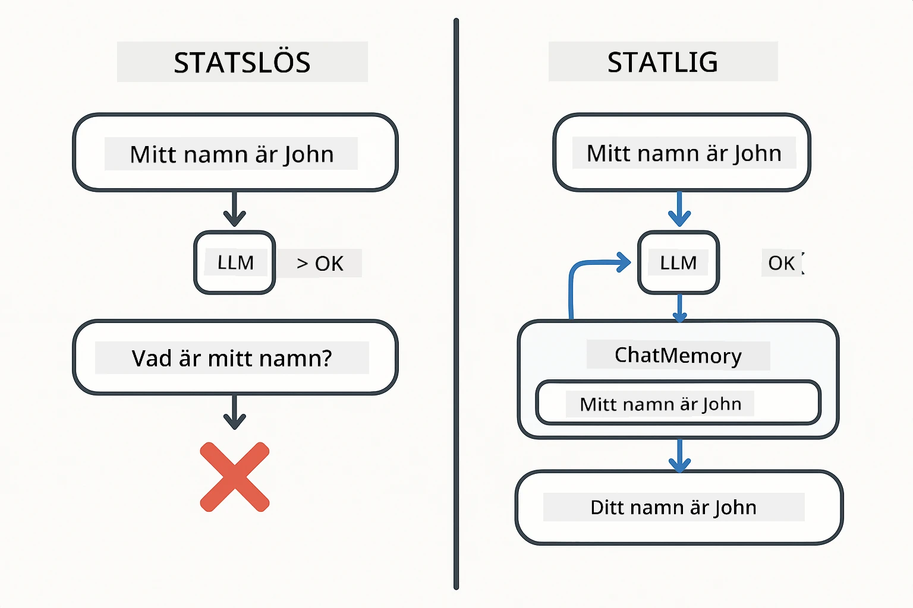
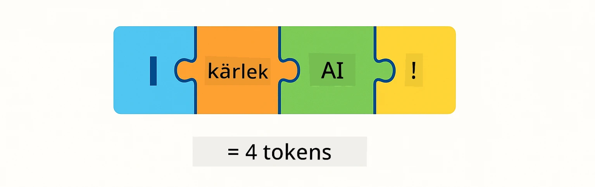
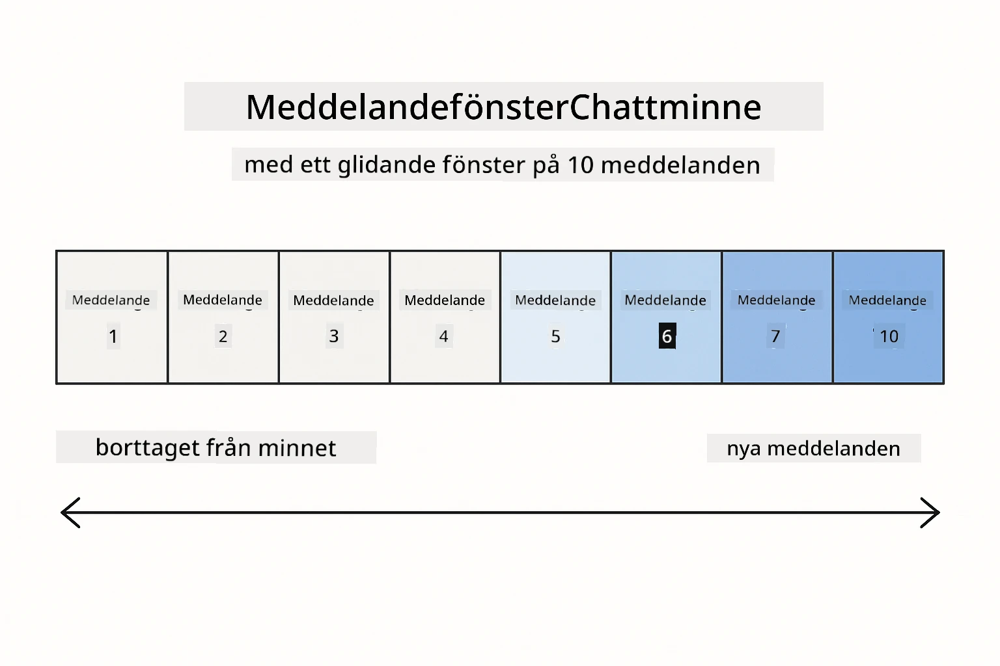
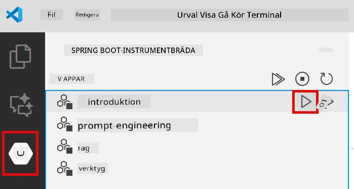
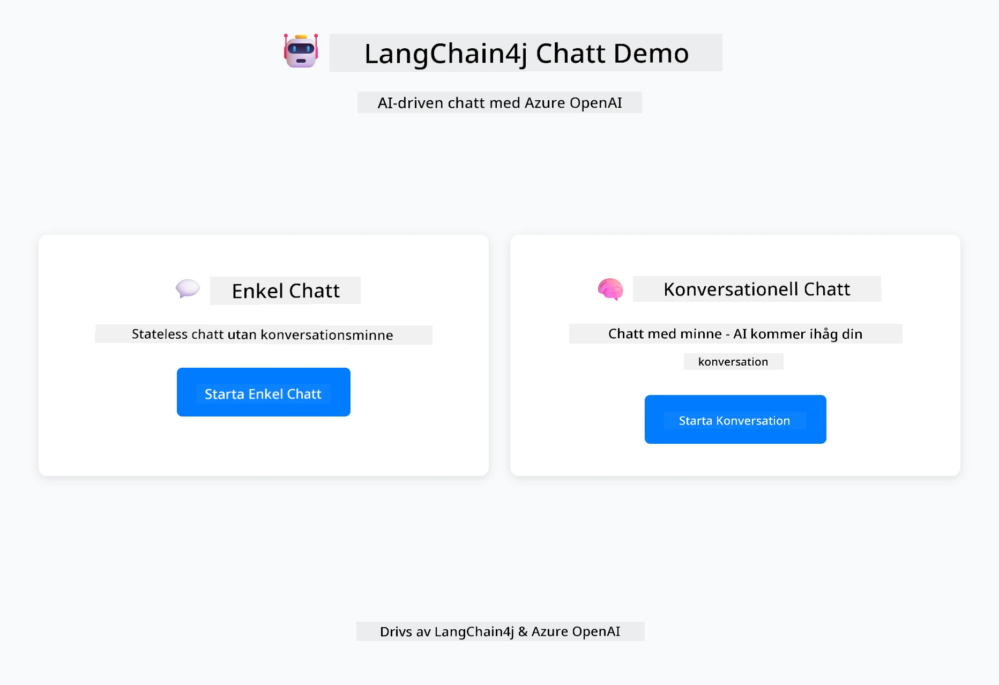
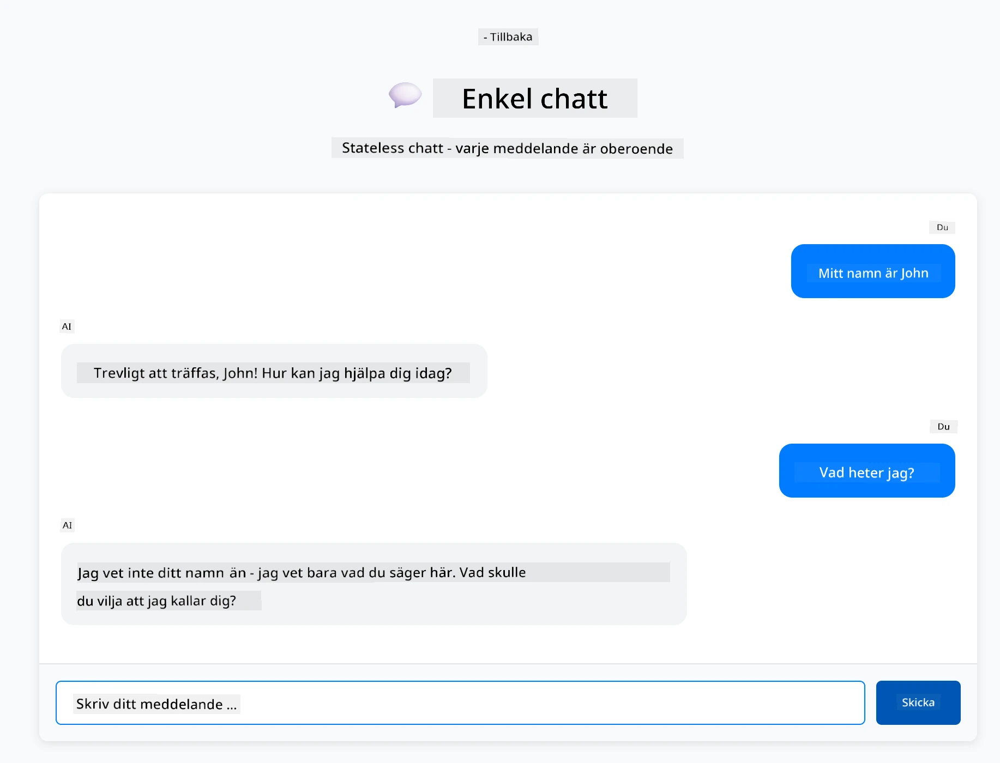
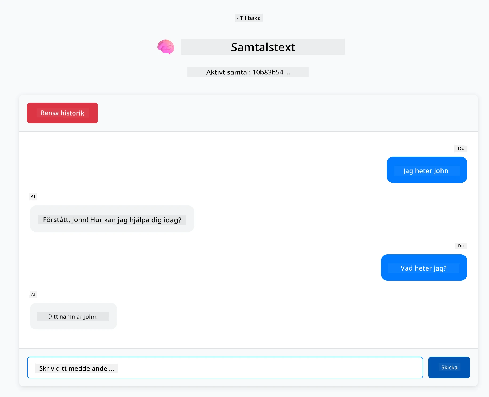

# Modul 01: Komma igång med LangChain4j

## Innehållsförteckning

- [Videogenomgång](#videogenomgång)
- [Vad du kommer att lära dig](#vad-du-kommer-att-lära-dig)
- [Förutsättningar](#förutsättningar)
- [Förstå det grundläggande problemet](#förstå-det-grundläggande-problemet)
- [Förstå tokens](#förstå-tokens)
- [Hur minnet fungerar](#hur-minnet-fungerar)
- [Hur detta använder LangChain4j](#hur-detta-använder-langchain4j)
- [Distribuera Azure OpenAI-infrastruktur](#distribuera-azure-openai-infrastruktur)
- [Kör applikationen lokalt](#kör-applikationen-lokalt)
- [Använda applikationen](#använda-applikationen)
  - [Stateless chatt (vänster panel)](#stateless-chatt-vänster-panel)
  - [Stateful chatt (höger panel)](#stateful-chatt-höger-panel)
- [Nästa steg](#nästa-steg)

## Videogenomgång

Se denna livesession som förklarar hur du kommer igång med denna modul:

<a href="https://www.youtube.com/live/nl_troDm8rQ?si=6b85S8xGjWnT2fX9"></a>

## Vad du kommer att lära dig

Detta är din startpunkt med LangChain4j och Azure OpenAI. Vi börjar med grunderna och börjar bygga produktionsliknande applikationer. Den här modulen fokuserar på konversations-AI som kommer ihåg kontext och bibehåller tillstånd — de grundläggande koncepten som varje senare modul bygger på.

Vi kommer använda Azure OpenAI:s GPT-5.2 genom hela denna guide eftersom dess avancerade resonemangsförmåga gör beteendet hos olika mönster tydligare. När du lägger till minne ser du tydligt skillnaden. Detta gör det lättare att förstå vad varje komponent tillför din applikation.

Du kommer bygga en applikation som demonstrerar båda mönstren:

**Stateless Chat** – Varje förfrågan är oberoende. Modellen har inget minne av tidigare meddelanden. Detta är den enklaste startpunkten.

**Stateful Conversation** – Varje förfrågan inkluderar konversationshistorik. Modellen bibehåller kontext över flera turer. Detta är vad produktionsapplikationer kräver.

## Förutsättningar

- Azure-prenumeration med Azure OpenAI-åtkomst
- Java 21, Maven 3.9+
- Azure CLI (https://learn.microsoft.com/en-us/cli/azure/install-azure-cli)
- Azure Developer CLI (azd) (https://learn.microsoft.com/en-us/azure/developer/azure-developer-cli/install-azd)

> **Observera:** Java, Maven, Azure CLI och Azure Developer CLI (azd) är förinstallerade i den medföljande utvecklingscontainern.

> **Observera:** Den här modulen använder GPT-5.2 på Azure OpenAI. Distributionen konfigureras automatiskt via `azd up` – ändra inte modellnamnet i koden.

## Förstå det grundläggande problemet

Språkmodeller är stateless. Varje API-anrop är oberoende. Om du skriver "Mitt namn är John" och sedan frågar "Vad heter jag?" har modellen ingen aning om att du just presenterade dig. Den behandlar varje förfrågan som om det vore din första konversation någonsin.

Detta fungerar bra för enkla frågor och svar men är värdelöst för riktiga applikationer. Kundtjänstrobotar måste komma ihåg vad du sa till dem. Personliga assistenter behöver kontext. Varje konversation med flera turer kräver minne.

Följande diagram visar skillnaden mellan de två tillvägagångssätten — till vänster ett stateless-anrop som glömmer ditt namn; till höger ett stateful-anrop baserat på ChatMemory som kommer ihåg det.



*Skillnaden mellan stateless (oberoende anrop) och stateful (kontextmedvetna) konversationer*

## Förstå tokens

Innan vi dyker in i konversationer är det viktigt att förstå tokens – grundläggande enheter av text som språkmodeller bearbetar:



*Exempel på hur text delas upp i tokens – "I love AI!" blir 4 separata bearbetningsenheter*

Tokens är hur AI-modeller mäter och bearbetar text. Ord, skiljetecken och till och med mellanslag kan vara tokens. Din modell har en gräns för hur många tokens den kan bearbeta samtidigt (400 000 för GPT-5.2, med upp till 272 000 input-tokens och 128 000 output-tokens). Att förstå tokens hjälper dig att hantera konversationslängd och kostnader.

## Hur minnet fungerar

Chattminnet löser problemet med stateless genom att bibehålla konversationshistorik. Innan du skickar din förfrågan till modellen lägger ramverket till relevanta tidigare meddelanden. När du frågar "Vad heter jag?" skickar systemet faktiskt hela konversationshistoriken, vilket gör att modellen kan se att du tidigare sa "Mitt namn är John."

LangChain4j erbjuder minnesimplementationer som hanterar detta automatiskt. Du väljer hur många meddelanden som ska sparas och ramverket sköter kontextfönstret. Diagrammet nedan visar hur MessageWindowChatMemory bibehåller ett rullande fönster med nyligen skickade meddelanden.



*MessageWindowChatMemory bibehåller ett rullande fönster med nyligen skickade meddelanden och tar automatiskt bort äldre*

## Hur detta använder LangChain4j

Denna modul integrerar Spring Boot och lägger till konversationsminne. Så här hänger delarna ihop:

**Beroenden** – Lägg till två LangChain4j-bibliotek:

```xml
<dependency>
    <groupId>dev.langchain4j</groupId>
    <artifactId>langchain4j</artifactId> <!-- Inherited from BOM in root pom.xml -->
</dependency>
<dependency>
    <groupId>dev.langchain4j</groupId>
    <artifactId>langchain4j-open-ai-official</artifactId> <!-- Inherited from BOM in root pom.xml -->
</dependency>
```

**Chattmodell** – Konfigurera Azure OpenAI som en Spring-bean ([LangChainConfig.java](../../../01-introduction/src/main/java/com/example/langchain4j/config/LangChainConfig.java)):

```java
@Bean
public OpenAiOfficialChatModel openAiOfficialChatModel() {
    return OpenAiOfficialChatModel.builder()
            .baseUrl(azureEndpoint)
            .apiKey(azureApiKey)
            .modelName(deploymentName)
            .timeout(Duration.ofMinutes(5))
            .maxRetries(3)
            .build();
}
```

Buildern läser inloggningsuppgifter från miljövariabler satta av `azd up`. Genom att sätta `baseUrl` till din Azure-endpoint fungerar OpenAI-klienten med Azure OpenAI.

**Konversationsminne** – Spåra chattloggen med MessageWindowChatMemory ([ConversationService.java](../../../01-introduction/src/main/java/com/example/langchain4j/service/ConversationService.java)):

```java
ChatMemory memory = MessageWindowChatMemory.withMaxMessages(10);

memory.add(UserMessage.from("My name is John"));
memory.add(AiMessage.from("Nice to meet you, John!"));

memory.add(UserMessage.from("What's my name?"));
AiMessage aiMessage = chatModel.chat(memory.messages()).aiMessage();
memory.add(aiMessage);
```

Skapa minne med `withMaxMessages(10)` för att behålla de senaste 10 meddelandena. Lägg till användar- och AI-meddelanden med typade wrappers: `UserMessage.from(text)` och `AiMessage.from(text)`. Hämta historiken med `memory.messages()` och skicka den till modellen. Tjänsten lagrar separata minnesinstanser per konversations-ID, vilket gör det möjligt för flera användare att chatta samtidigt.

> **🤖 Prova med [GitHub Copilot](https://github.com/features/copilot) Chat:** Öppna [`ConversationService.java`](../../../01-introduction/src/main/java/com/example/langchain4j/service/ConversationService.java) och fråga:
> - "Hur bestämmer MessageWindowChatMemory vilka meddelanden som ska tas bort när fönstret är fullt?"
> - "Kan jag implementera eget minneslagring med en databas istället för i minnet?"
> - "Hur skulle jag lägga till summering för att komprimera gammal konversationshistorik?"

Stateless-chattens endpoint hoppar över minnet helt – bara `chatModel.chat(prompt)` som i snabbstarten. Stateful-endpointen lägger till meddelanden i minnet, hämtar historik och inkluderar den kontexten i varje förfrågan. Samma modellkonfiguration, olika mönster.

## Distribuera Azure OpenAI-infrastruktur

**Bash:**
```bash
cd 01-introduction
azd up  # Välj prenumeration och plats (eastus2 rekommenderas)
```

**PowerShell:**
```powershell
cd 01-introduction
azd up  # Välj prenumeration och plats (eastus2 rekommenderas)
```

> **Observera:** Om du får ett timeout-fel (`RequestConflict: Cannot modify resource ... provisioning state is not terminal`), kör helt enkelt `azd up` igen. Azure-resurser kan fortfarande provisioneras i bakgrunden och en ny försök gör att distributionen slutförs när resurserna når ett terminalt tillstånd.

Detta kommer att:
1. Distribuera Azure OpenAI-resurs med GPT-5.2 och text-embedding-3-small modeller
2. Automatiskt generera `.env`-fil i projektroten med inloggningsuppgifter
3. Sätta upp alla nödvändiga miljövariabler

**Har du problem med distributionen?** Se [Infrastructure README](infra/README.md) för detaljerad felsökning inklusive konflikter om subdomännamn, manuella steg för distribution via Azure Portal, och modellkonfigurationsråd.

**Verifiera att distributionen lyckades:**

**Bash:**
```bash
cat ../.env  # Bör visa AZURE_OPENAI_ENDPOINT, API_KEY, etc.
```

**PowerShell:**
```powershell
Get-Content ..\.env  # Bör visa AZURE_OPENAI_ENDPOINT, API_KEY, etc.
```

> **Observera:** Kommandot `azd up` genererar automatiskt `.env`-filen. Om du behöver uppdatera den senare kan du antingen redigera `.env`-filen manuellt eller återgenerera den genom att köra:
>
> **Bash:**
> ```bash
> cd ..
> bash .azd-env.sh
> ```
>
> **PowerShell:**
> ```powershell
> cd ..
> .\.azd-env.ps1
> ```

## Kör applikationen lokalt

**Verifiera distribution:**

Se till att `.env`-filen finns i rotkatalogen med Azure-uppgifter. Kör detta från modulkatalogen (`01-introduction/`):

**Bash:**
```bash
cat ../.env  # Bör visa AZURE_OPENAI_ENDPOINT, API_KEY, DEPLOYMENT
```

**PowerShell:**
```powershell
Get-Content ..\.env  # Bör visa AZURE_OPENAI_ENDPOINT, API_KEY, DEPLOYMENT
```

**Starta applikationerna:**

**Alternativ 1: Använd Spring Boot Dashboard (Rekommenderas för VS Code-användare)**

Utvecklingscontainern inkluderar Spring Boot Dashboard-tillägget, som ger ett grafiskt gränssnitt för att hantera alla Spring Boot-applikationer. Du hittar det i aktivitetsfältet på vänster sida i VS Code (leta efter Spring Boot-ikonen).

Från Spring Boot Dashboard kan du:
- Se alla tillgängliga Spring Boot-applikationer i arbetsytan
- Starta/stoppa applikationer med ett enda klick
- Visa applikationsloggar i realtid
- Övervaka applikationsstatus

Klicka helt enkelt på play-knappen bredvid "introduction" för att starta denna modul, eller starta alla moduler samtidigt.



*Spring Boot Dashboard i VS Code — starta, stoppa och övervaka alla moduler från en plats*

**Alternativ 2: Använd shell-skript**

Starta alla webbapplikationer (moduler 01-04):

**Bash:**
```bash
cd ..  # Från rotkatalogen
./start-all.sh
```

**PowerShell:**
```powershell
cd ..  # Från rotkatalogen
.\start-all.ps1
```

Eller starta bara denna modul:

**Bash:**
```bash
cd 01-introduction
./start.sh
```

**PowerShell:**
```powershell
cd 01-introduction
.\start.ps1
```

Båda skripten laddar automatiskt miljövariabler från rotens `.env`-fil och kommer bygga JAR-filerna om de inte finns.

> **Observera:** Om du föredrar att manuellt bygga alla moduler innan start:
>
> **Bash:**
> ```bash
> cd ..  # Go to root directory
> mvn clean package -DskipTests
> ```
>
> **PowerShell:**
> ```powershell
> cd ..  # Go to root directory
> mvn clean package -DskipTests
> ```

Öppna http://localhost:8080 i din webbläsare.

**För att stoppa:**

**Bash:**
```bash
./stop.sh  # Endast denna modul
# Eller
cd .. && ./stop-all.sh  # Alla moduler
```

**PowerShell:**
```powershell
.\stop.ps1  # Endast denna modul
# Eller
cd ..; .\stop-all.ps1  # Alla moduler
```

## Använda applikationen

Applikationen erbjuder ett webbgränssnitt med två chattimplementationer sida vid sida.



*Dashboard som visar både Enkel Chatt (stateless) och Konversationschatt (stateful)*

### Stateless chatt (vänster panel)

Testa detta först. Skriv "Mitt namn är John" och fråga direkt efteråt "Vad heter jag?" Modellen kommer inte ihåg eftersom varje meddelande är oberoende. Detta visar det grundläggande problemet med enkel språkmodellintegration – ingen kontext i konversationen.



*AI kommer inte ihåg ditt namn från föregående meddelande*

### Stateful chatt (höger panel)

Testa nu samma sekvens här. Skriv "Mitt namn är John" och sedan "Vad heter jag?" Denna gång kommer modellen ihåg. Skillnaden är MessageWindowChatMemory – den bibehåller konversationshistorik och inkluderar den vid varje förfrågan. Så fungerar produktionsklar konversations-AI.



*AI kommer ihåg ditt namn från tidigare i konversationen*

Båda panelerna använder samma GPT-5.2-modell. Den enda skillnaden är minnet. Det gör det tydligt vad minnet tillför din applikation och varför det är avgörande för verkliga användningsfall.

## Nästa steg

**Nästa modul:** [02-prompt-engineering - Prompt Engineering med GPT-5.2](../02-prompt-engineering/README.md)

---

**Navigation:** [← Tillbaka till huvudsidan](../README.md) | [Nästa: Modul 02 - Prompt Engineering →](../02-prompt-engineering/README.md)

---

<!-- CO-OP TRANSLATOR DISCLAIMER START -->
**Ansvarsfriskrivning**:
Detta dokument har översatts med hjälp av AI-översättningstjänsten [Co-op Translator](https://github.com/Azure/co-op-translator). Även om vi strävar efter noggrannhet, var vänlig notera att automatiska översättningar kan innehålla fel eller brister. Det ursprungliga dokumentet på dess modersmål bör betraktas som den auktoritativa källan. För kritisk information rekommenderas professionell mänsklig översättning. Vi ansvarar inte för några missförstånd eller feltolkningar som uppstår till följd av användningen av denna översättning.
<!-- CO-OP TRANSLATOR DISCLAIMER END -->