# Modul 02: Prompt Engineering med GPT-5

## Innehållsförteckning

- [Vad du kommer att lära dig](../../../02-prompt-engineering)
- [Förkunskaper](../../../02-prompt-engineering)
- [Förstå prompt engineering](../../../02-prompt-engineering)
- [Hur detta använder LangChain4j](../../../02-prompt-engineering)
- [Kärnmönstren](../../../02-prompt-engineering)
- [Använda befintliga Azure-resurser](../../../02-prompt-engineering)
- [Applikationsskärmdumpar](../../../02-prompt-engineering)
- [Utforska mönstren](../../../02-prompt-engineering)
  - [Låg vs hög iver](../../../02-prompt-engineering)
  - [Uppgiftsutförande (verktygspreambler)](../../../02-prompt-engineering)
  - [Självreflekterande kod](../../../02-prompt-engineering)
  - [Strukturerad analys](../../../02-prompt-engineering)
  - [Flerstegs-chatt](../../../02-prompt-engineering)
  - [Steg-för-steg resonemang](../../../02-prompt-engineering)
  - [Begränsad output](../../../02-prompt-engineering)
- [Vad du egentligen lär dig](../../../02-prompt-engineering)
- [Nästa steg](../../../02-prompt-engineering)

## Vad du kommer att lära dig

I föregående modul såg du hur minne möjliggör konversations-AI och använde GitHub-modeller för grundläggande interaktioner. Nu fokuserar vi på hur du ställer frågor – själva promptarna – med Azure OpenAI:s GPT-5. Hur du strukturerar dina prompts påverkar dramatiskt kvaliteten på de svar du får.

Vi använder GPT-5 eftersom den introducerar kontroll över resonemang – du kan tala om för modellen hur mycket tänkande den ska göra innan den svarar. Detta gör olika promptstrategier tydligare och hjälper dig förstå när du ska använda varje tillvägagångssätt. Vi drar också nytta av Azures färre begränsningar för GPT-5 jämfört med GitHub-modeller.

## Förkunskaper

- Genomförd Modul 01 (Azure OpenAI-resurser distribuerade)
- `.env`-fil i rotkatalogen med Azure-uppgifter (skapad av `azd up` i Modul 01)

> **Notera:** Om du inte har genomfört Modul 01, följ först distributionsinstruktionerna där.

## Förstå prompt engineering

Prompt engineering handlar om att designa inmatningstext som konsekvent ger dig de resultat du behöver. Det handlar inte bara om att ställa frågor – det handlar om att strukturera förfrågningar så att modellen förstår exakt vad du vill ha och hur det ska levereras.

Tänk på det som att ge instruktioner till en kollega. "Fix the bug" är vagt. "Fix the null pointer exception in UserService.java line 45 by adding a null check" är specifikt. Språkmodeller fungerar på samma sätt – specificitet och struktur är viktiga.

## Hur detta använder LangChain4j

Denna modul demonstrerar avancerade promptmönster med samma LangChain4j-grund från tidigare moduler, med fokus på promptstruktur och kontroll över resonemang.

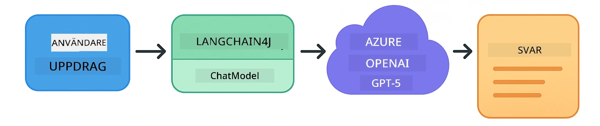

*Hur LangChain4j kopplar dina prompts till Azure OpenAI GPT-5*

**Beroenden** – Modul 02 använder följande langchain4j-beroenden definierade i `pom.xml`:
```xml
<dependency>
    <groupId>dev.langchain4j</groupId>
    <artifactId>langchain4j</artifactId> <!-- Inherited from BOM in root pom.xml -->
</dependency>
<dependency>
    <groupId>dev.langchain4j</groupId>
    <artifactId>langchain4j-open-ai-official</artifactId> <!-- Inherited from BOM in root pom.xml -->
</dependency>
```

**OpenAiOfficialChatModel-konfiguration** – [LangChainConfig.java](../../../02-prompt-engineering/src/main/java/com/example/langchain4j/prompts/config/LangChainConfig.java)

Chatmodellen konfigureras manuellt som en Spring-bean med OpenAI Official-klienten, som stödjer Azure OpenAI-endpoints. Den stora skillnaden från Modul 01 är hur vi strukturerar promptarna som skickas till `chatModel.chat()`, inte själva modellinställningen.

**System- och användarmeddelanden** – [Gpt5PromptService.java](../../../02-prompt-engineering/src/main/java/com/example/langchain4j/prompts/service/Gpt5PromptService.java)

LangChain4j separerar meddelandetyper för tydlighet. `SystemMessage` sätter AI:ns beteende och kontext (som "Du är en kodgranskare"), medan `UserMessage` innehåller själva förfrågan. Denna separation låter dig bibehålla konsekvent AI-beteende över olika användarfrågor.

```java
SystemMessage systemMsg = SystemMessage.from(
    "You are a helpful Java programming expert."
);

UserMessage userMsg = UserMessage.from(
    "Explain what a List is in Java"
);

String response = chatModel.chat(systemMsg, userMsg);
```

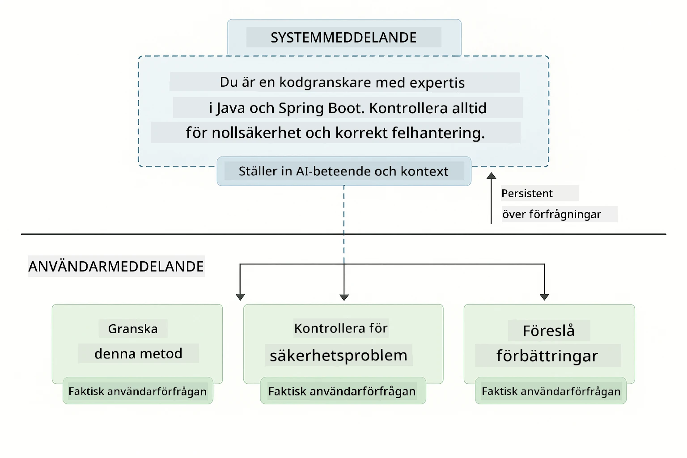

*SystemMessage ger bestående kontext medan UserMessages innehåller individuella förfrågningar*

**MessageWindowChatMemory för flerstegs** – För flerstegs-konversationsmönstret återanvänder vi `MessageWindowChatMemory` från Modul 01. Varje session får sin egen minnesinstans lagrad i en `Map<String, ChatMemory>`, vilket möjliggör flera samtidiga konversationer utan kontextblandning.

**Promptmallar** – Det verkliga fokuset här är prompt engineering, inte nya LangChain4j-API:er. Varje mönster (låg iver, hög iver, uppgiftsutförande, etc.) använder samma `chatModel.chat(prompt)`-metod men med noggrant strukturerade promptsträngar. XML-taggar, instruktioner och formatering är alla en del av prompttexten, inte LangChain4j-funktioner.

**Kontroll över resonemang** – GPT-5:s resonemangsstyrka kontrolleras genom promptinstruktioner som "maximalt 2 resonemangssteg" eller "utforska grundligt". Detta är prompt engineering-tekniker, inte LangChain4j-konfigurationer. Biblioteket levererar bara dina prompts till modellen.

Huvudpoängen: LangChain4j tillhandahåller infrastrukturen (modellanslutning via [LangChainConfig.java](../../../02-prompt-engineering/src/main/java/com/example/langchain4j/prompts/config/LangChainConfig.java), minne, meddelandehantering via [Gpt5PromptService.java](../../../02-prompt-engineering/src/main/java/com/example/langchain4j/prompts/service/Gpt5PromptService.java)), medan denna modul lär dig hur du skapar effektiva prompts inom den infrastrukturen.

## Kärnmönstren

Alla problem kräver inte samma tillvägagångssätt. Vissa frågor behöver snabba svar, andra kräver djupare tänkande. Vissa behöver synligt resonemang, andra bara resultat. Denna modul täcker åtta promptmönster – var och en optimerad för olika scenarier. Du kommer att experimentera med alla för att lära dig när varje tillvägagångssätt fungerar bäst.

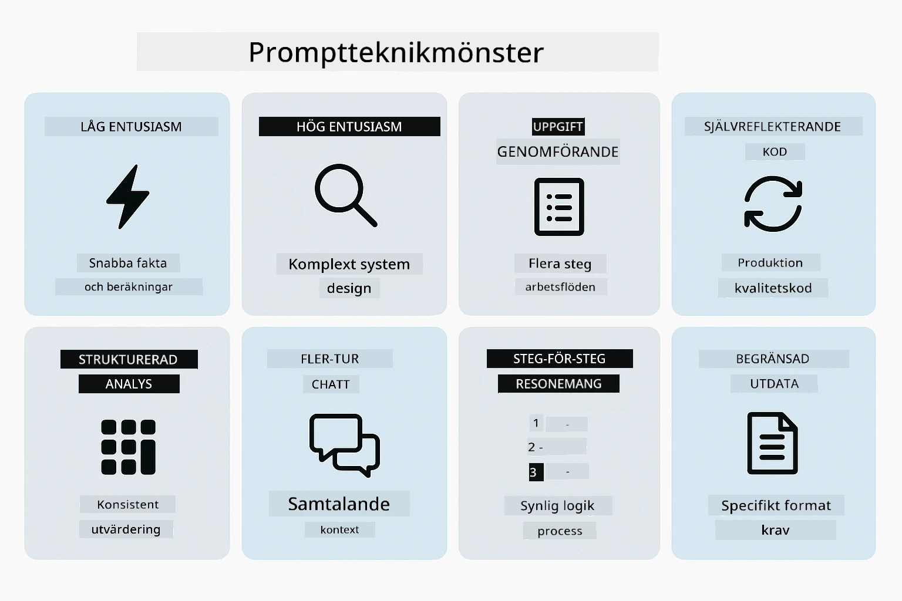

*Översikt över de åtta prompt engineering-mönstren och deras användningsområden*

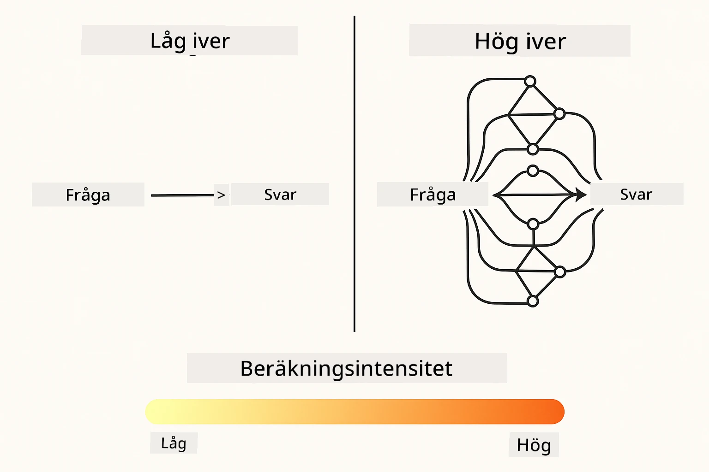

*Låg iver (snabb, direkt) vs hög iver (grundlig, utforskande) resonemangstillvägagångssätt*

**Låg iver (snabb & fokuserad)** – För enkla frågor där du vill ha snabba, direkta svar. Modellen gör minimalt resonemang – max 2 steg. Använd detta för beräkningar, uppslagningar eller enkla frågor.

```java
String prompt = """
    <reasoning_effort>low</reasoning_effort>
    <instruction>maximum 2 reasoning steps</instruction>
    
    What is 15% of 200?
    """;

String response = chatModel.chat(prompt);
```

> 💡 **Utforska med GitHub Copilot:** Öppna [`Gpt5PromptService.java`](../../../02-prompt-engineering/src/main/java/com/example/langchain4j/prompts/service/Gpt5PromptService.java) och fråga:
> - "Vad är skillnaden mellan låg iver och hög iver i promptmönster?"
> - "Hur hjälper XML-taggar i prompts att strukturera AI:s svar?"
> - "När ska jag använda självreflektionsmönster kontra direkt instruktion?"

**Hög iver (djup & grundlig)** – För komplexa problem där du vill ha omfattande analys. Modellen utforskar grundligt och visar detaljerat resonemang. Använd detta för systemdesign, arkitekturval eller komplex forskning.

```java
String prompt = """
    <reasoning_effort>high</reasoning_effort>
    <instruction>explore thoroughly, show detailed reasoning</instruction>
    
    Design a caching strategy for a high-traffic REST API.
    """;

String response = chatModel.chat(prompt);
```

**Uppgiftsutförande (steg-för-steg framsteg)** – För arbetsflöden med flera steg. Modellen ger en plan i förväg, berättar om varje steg medan den arbetar, och ger sedan en sammanfattning. Använd detta för migreringar, implementationer eller andra flerstegsprocesser.

```java
String prompt = """
    <task>Create a REST endpoint for user registration</task>
    <preamble>Provide an upfront plan</preamble>
    <narration>Narrate each step as you work</narration>
    <summary>Summarize what was accomplished</summary>
    """;

String response = chatModel.chat(prompt);
```

Chain-of-Thought-prompting ber modellen visa sitt resonemangsflöde, vilket förbättrar noggrannheten för komplexa uppgifter. Steg-för-steg-genomgången hjälper både människor och AI att förstå logiken.

> **🤖 Prova med [GitHub Copilot](https://github.com/features/copilot) Chat:** Fråga om detta mönster:
> - "Hur skulle jag anpassa uppgiftsutförandemönstret för långvariga operationer?"
> - "Vilka är bästa praxis för att strukturera verktygspreambler i produktionsapplikationer?"
> - "Hur kan jag fånga och visa mellanliggande framsteg i ett användargränssnitt?"

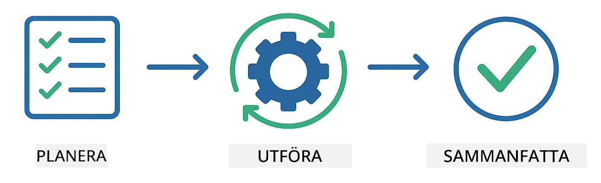

*Planera → Utför → Sammanfatta arbetsflöde för flerstegsuppgifter*

**Självreflekterande kod** – För att generera produktionskvalitetskod. Modellen genererar kod, kontrollerar den mot kvalitetskriterier och förbättrar den iterativt. Använd detta när du bygger nya funktioner eller tjänster.

```java
String prompt = """
    <task>Create an email validation service</task>
    <quality_criteria>
    - Correct logic and error handling
    - Best practices (clean code, proper naming)
    - Performance optimization
    - Security considerations
    </quality_criteria>
    <instruction>Generate code, evaluate against criteria, improve iteratively</instruction>
    """;

String response = chatModel.chat(prompt);
```

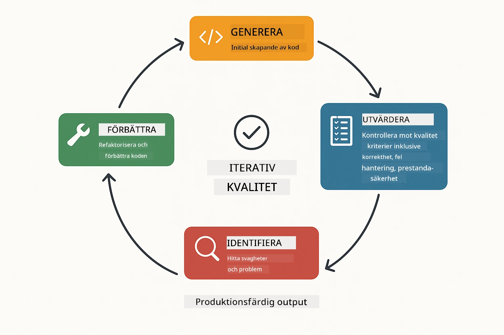

*Iterativ förbättringscykel – generera, utvärdera, identifiera problem, förbättra, upprepa*

**Strukturerad analys** – För konsekvent utvärdering. Modellen granskar kod med en fast ram (korrekthet, praxis, prestanda, säkerhet). Använd detta för kodgranskningar eller kvalitetsbedömningar.

```java
String prompt = """
    <code>
    public List getUsers() {
        return database.query("SELECT * FROM users");
    }
    </code>
    
    <framework>
    Evaluate using these categories:
    1. Correctness - Logic and functionality
    2. Best Practices - Code quality
    3. Performance - Efficiency concerns
    4. Security - Vulnerabilities
    </framework>
    """;

String response = chatModel.chat(prompt);
```

> **🤖 Prova med [GitHub Copilot](https://github.com/features/copilot) Chat:** Fråga om strukturerad analys:
> - "Hur kan jag anpassa analysramverket för olika typer av kodgranskningar?"
> - "Vad är bästa sättet att tolka och agera på strukturerad output programmässigt?"
> - "Hur säkerställer jag konsekventa allvarlighetsnivåer över olika granskningssessioner?"

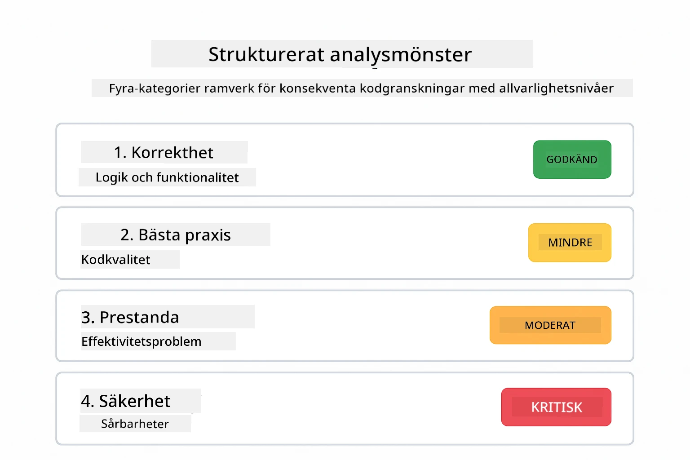

*Fyra-kategorier ramverk för konsekventa kodgranskningar med allvarlighetsnivåer*

**Flerstegs-chatt** – För konversationer som behöver kontext. Modellen minns tidigare meddelanden och bygger vidare på dem. Använd detta för interaktiva hjälpsessioner eller komplexa frågor och svar.

```java
ChatMemory memory = MessageWindowChatMemory.withMaxMessages(10);

memory.add(UserMessage.from("What is Spring Boot?"));
AiMessage aiMessage1 = chatModel.chat(memory.messages()).aiMessage();
memory.add(aiMessage1);

memory.add(UserMessage.from("Show me an example"));
AiMessage aiMessage2 = chatModel.chat(memory.messages()).aiMessage();
memory.add(aiMessage2);
```

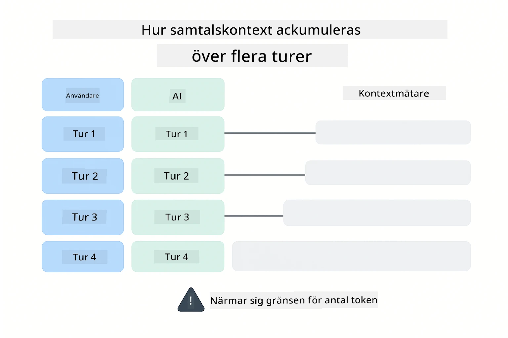

*Hur konversationskontext ackumuleras över flera steg tills token-gränsen nås*

**Steg-för-steg resonemang** – För problem som kräver synlig logik. Modellen visar explicit resonemang för varje steg. Använd detta för matematiska problem, logikpussel eller när du behöver förstå tänkandeprocessen.

```java
String prompt = """
    <instruction>Show your reasoning step-by-step</instruction>
    
    If a train travels 120 km in 2 hours, then stops for 30 minutes,
    then travels another 90 km in 1.5 hours, what is the average speed
    for the entire journey including the stop?
    """;

String response = chatModel.chat(prompt);
```

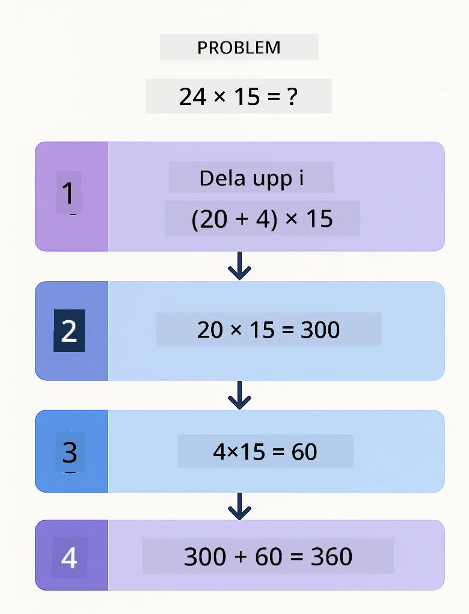

*Bryter ner problem i explicita logiska steg*

**Begränsad output** – För svar med specifika formatkrav. Modellen följer strikt format- och längdregler. Använd detta för sammanfattningar eller när du behöver exakt outputstruktur.

```java
String prompt = """
    <constraints>
    - Exactly 100 words
    - Bullet point format
    - Technical terms only
    </constraints>
    
    Summarize the key concepts of machine learning.
    """;

String response = chatModel.chat(prompt);
```

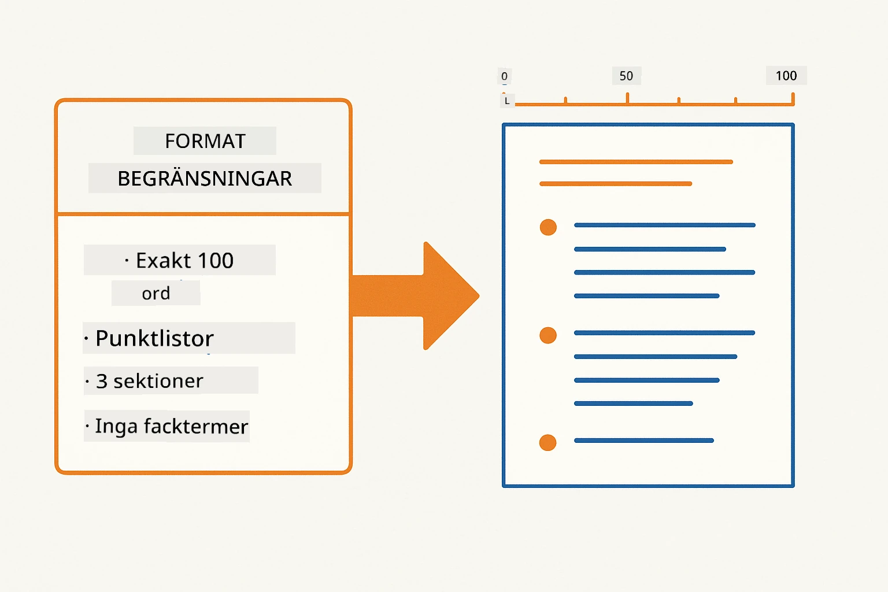

*Upprätthåller specifika format-, längd- och strukturkrav*

## Använda befintliga Azure-resurser

**Verifiera distribution:**

Säkerställ att `.env`-filen finns i rotkatalogen med Azure-uppgifter (skapad under Modul 01):
```bash
cat ../.env  # Bör visa AZURE_OPENAI_ENDPOINT, API_KEY, DEPLOYMENT
```

**Starta applikationen:**

> **Notera:** Om du redan startat alla applikationer med `./start-all.sh` från Modul 01, kör denna modul redan på port 8083. Du kan hoppa över startkommandona nedan och gå direkt till http://localhost:8083.

**Alternativ 1: Använd Spring Boot Dashboard (rekommenderas för VS Code-användare)**

Dev-containern inkluderar Spring Boot Dashboard-tillägget, som ger ett visuellt gränssnitt för att hantera alla Spring Boot-applikationer. Du hittar det i aktivitetsfältet till vänster i VS Code (leta efter Spring Boot-ikonen).

Från Spring Boot Dashboard kan du:
- Se alla tillgängliga Spring Boot-applikationer i arbetsytan
- Starta/stoppa applikationer med ett klick
- Visa applikationsloggar i realtid
- Övervaka applikationsstatus

Klicka bara på play-knappen bredvid "prompt-engineering" för att starta denna modul, eller starta alla moduler samtidigt.

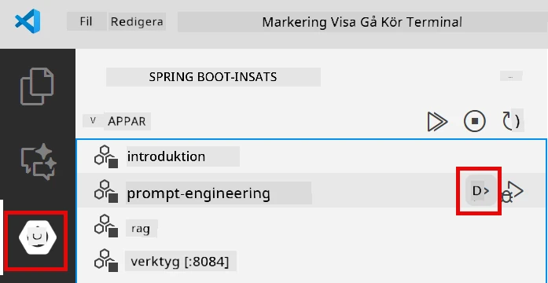

**Alternativ 2: Använda shell-skript**

Starta alla webbapplikationer (moduler 01-04):

**Bash:**
```bash
cd ..  # Från rotkatalogen
./start-all.sh
```

**PowerShell:**
```powershell
cd ..  # Från rotkatalogen
.\start-all.ps1
```

Eller starta bara denna modul:

**Bash:**
```bash
cd 02-prompt-engineering
./start.sh
```

**PowerShell:**
```powershell
cd 02-prompt-engineering
.\start.ps1
```

Båda skripten laddar automatiskt miljövariabler från rotens `.env`-fil och bygger JAR-filerna om de inte finns.

> **Notera:** Om du föredrar att bygga alla moduler manuellt innan start:
>
> **Bash:**
> ```bash
> cd ..  # Go to root directory
> mvn clean package -DskipTests
> ```
>
> **PowerShell:**
> ```powershell
> cd ..  # Go to root directory
> mvn clean package -DskipTests
> ```

Öppna http://localhost:8083 i din webbläsare.

**För att stoppa:**

**Bash:**
```bash
./stop.sh  # Endast denna modul
# Eller
cd .. && ./stop-all.sh  # Alla moduler
```

**PowerShell:**
```powershell
.\stop.ps1  # Endast denna modul
# Eller
cd ..; .\stop-all.ps1  # Alla moduler
```

## Applikationsskärmdumpar

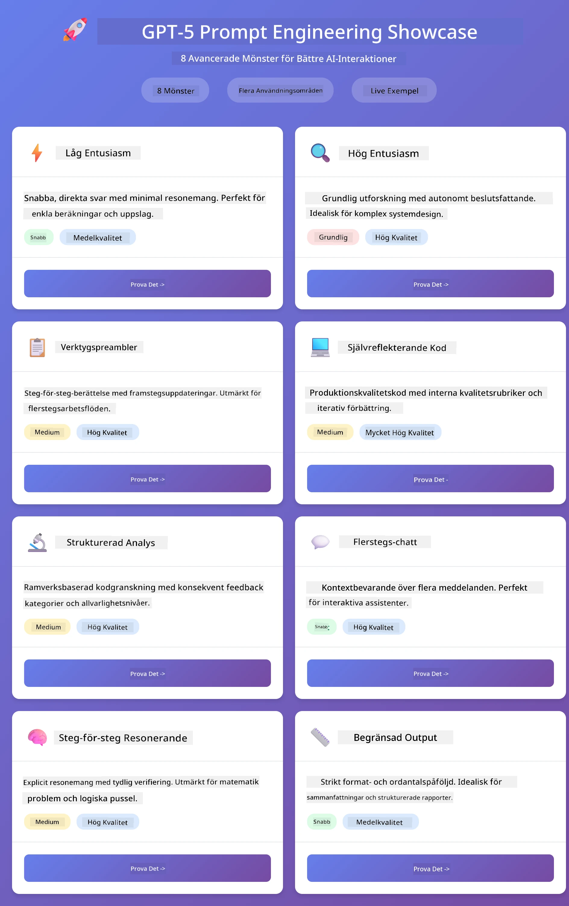

*Huvuddashboard som visar alla 8 prompt engineering-mönster med deras egenskaper och användningsområden*

## Utforska mönstren

Webbgränssnittet låter dig experimentera med olika promptstrategier. Varje mönster löser olika problem – prova dem för att se när varje tillvägagångssätt fungerar bäst.

### Låg vs hög iver

Ställ en enkel fråga som "Vad är 15% av 200?" med låg iver. Du får ett omedelbart, direkt svar. Ställ nu något komplext som "Designa en caching-strategi för en högtrafikerad API" med hög iver. Se hur modellen saktar ner och ger detaljerat resonemang. Samma modell, samma frågestruktur – men prompten talar om för den hur mycket tänkande som ska göras.

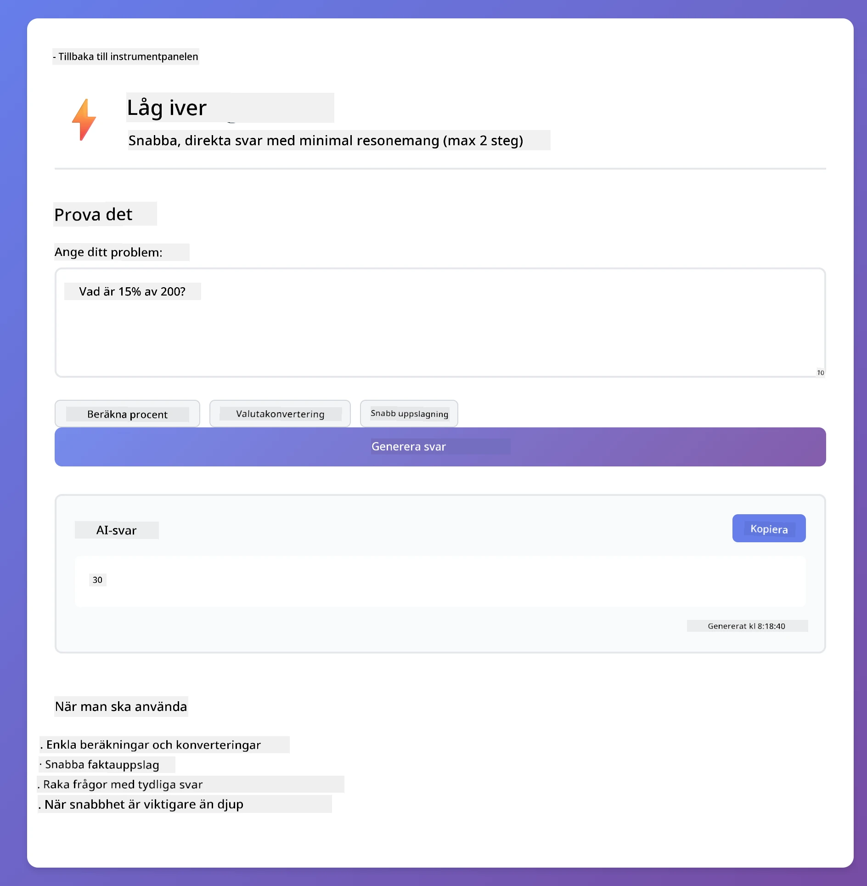
*Snabb beräkning med minimal resonemang*

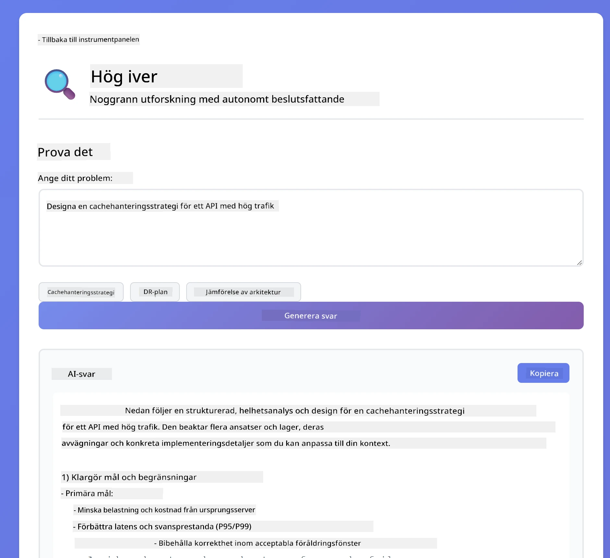

*Omfattande cache-strategi (2.8MB)*

### Uppgiftsutförande (Verktygsintroduktioner)

Flerstegsarbetsflöden gynnas av förhandsplanering och löpande berättande. Modellen beskriver vad den ska göra, berättar om varje steg och sammanfattar sedan resultaten.

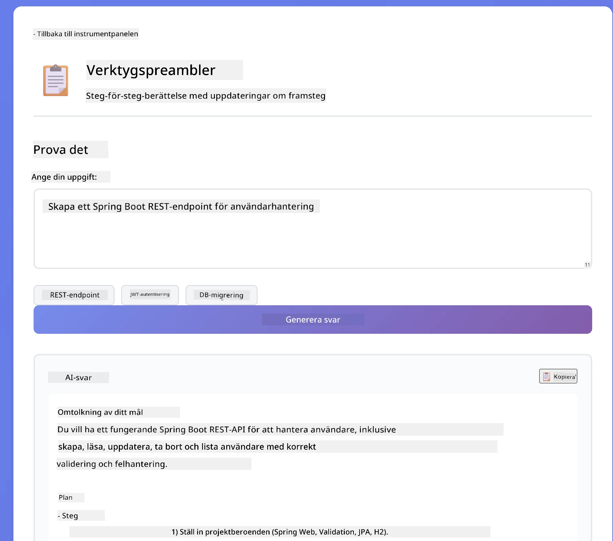

*Skapa en REST-endpoint med steg-för-steg-berättande (3.9MB)*

### Självreflekterande kod

Prova "Skapa en e-postvalideringstjänst". Istället för att bara generera kod och stanna, genererar modellen, utvärderar mot kvalitetskriterier, identifierar svagheter och förbättrar. Du kommer att se den iterera tills koden uppfyller produktionsstandarder.

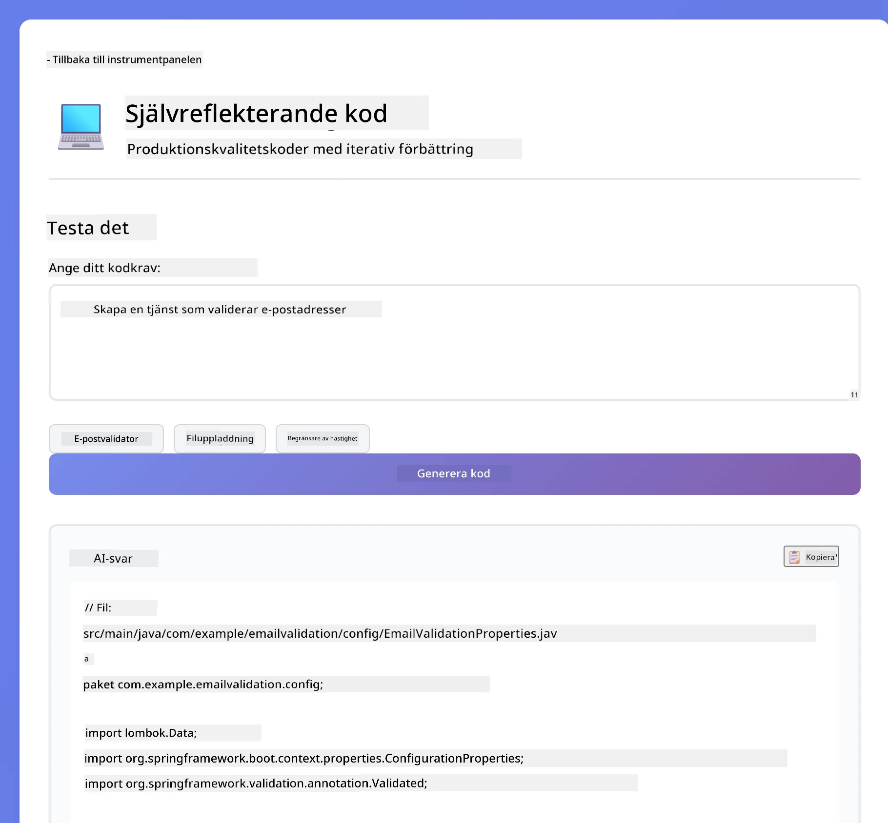

*Fullständig e-postvalideringstjänst (5.2MB)*

### Strukturerad analys

Kodgranskningar behöver konsekventa utvärderingsramverk. Modellen analyserar kod med fasta kategorier (korrekthet, praxis, prestanda, säkerhet) med allvarlighetsnivåer.

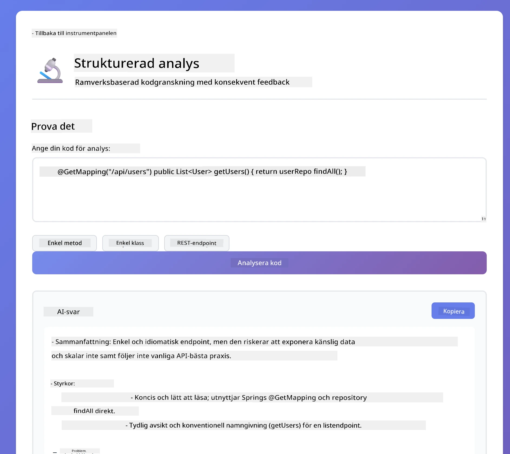

*Ramverksbaserad kodgranskning*

### Fleromgångschatt

Fråga "Vad är Spring Boot?" och följ sedan direkt upp med "Visa mig ett exempel". Modellen kommer ihåg din första fråga och ger dig ett specifikt Spring Boot-exempel. Utan minne skulle den andra frågan vara för vag.

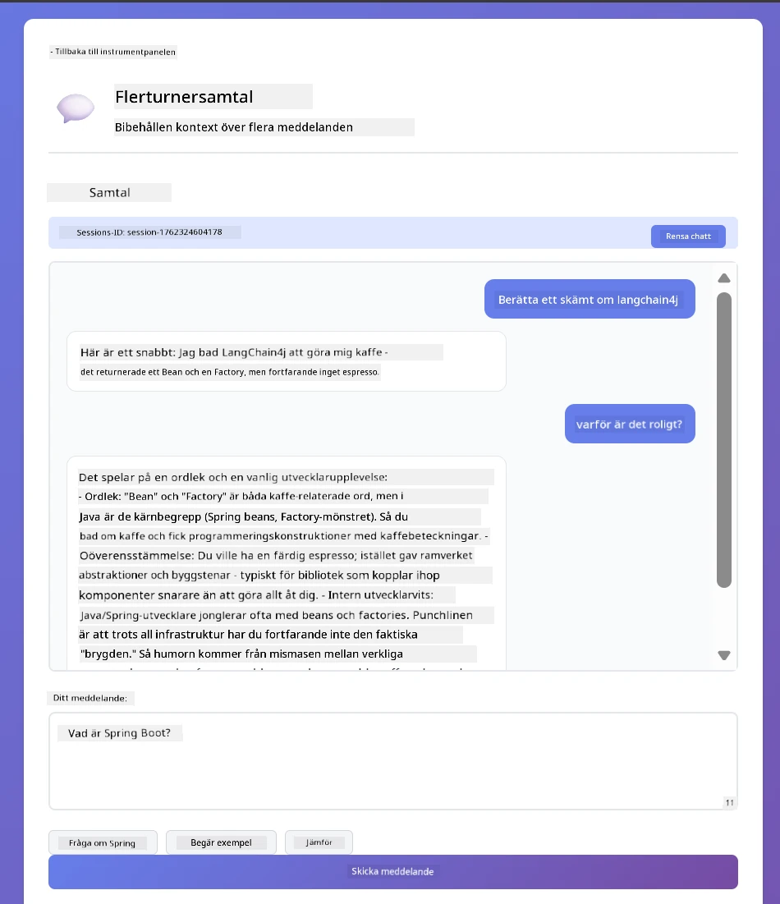

*Bevarande av kontext över frågor*

### Steg-för-steg-resonemang

Välj ett matematiskt problem och prova både Steg-för-steg-resonemang och Låg iver. Låg iver ger dig bara svaret – snabbt men otydligt. Steg-för-steg visar varje beräkning och beslut.

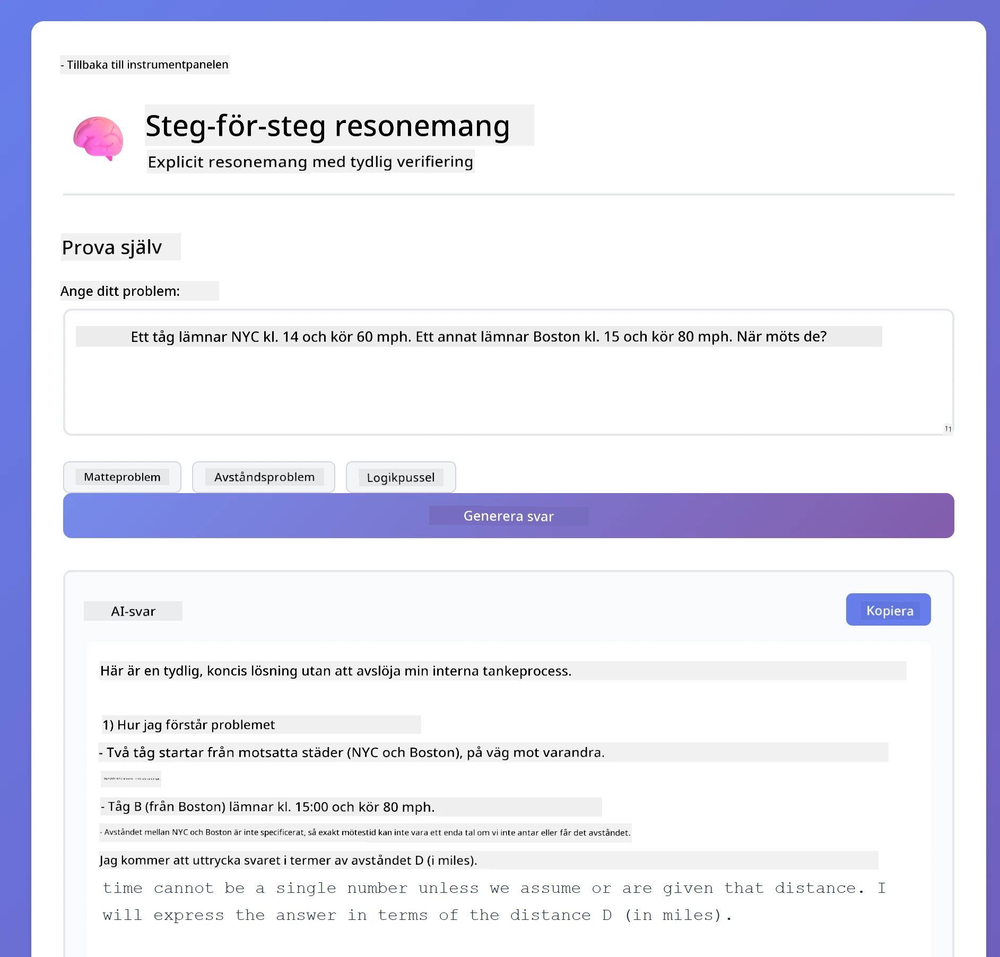

*Matteproblem med tydliga steg*

### Begränsad utdata

När du behöver specifika format eller ordantal, tvingar detta mönster strikt efterlevnad. Prova att generera en sammanfattning med exakt 100 ord i punktform.

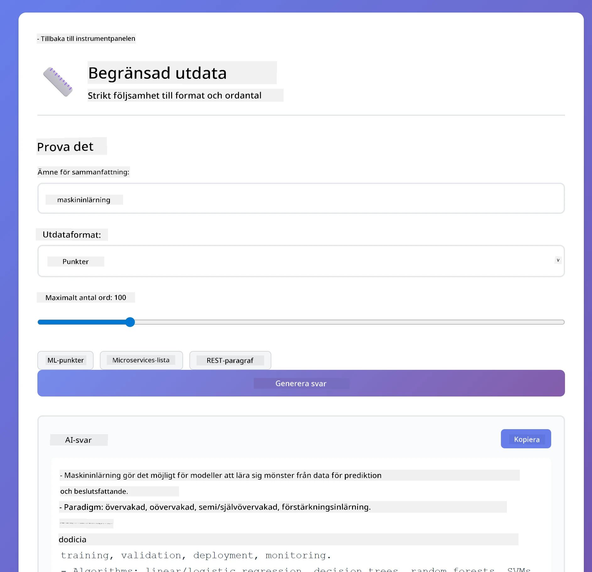

*Maskininlärningssammanfattning med formatkontroll*

## Vad du verkligen lär dig

**Resonemangsinsats förändrar allt**

GPT-5 låter dig styra beräkningsinsatsen via dina prompts. Låg insats betyder snabba svar med minimal utforskning. Hög insats betyder att modellen tar tid att tänka djupt. Du lär dig att matcha insats med uppgiftens komplexitet – slösa inte tid på enkla frågor, men stressa inte heller igenom komplexa beslut.

**Struktur styr beteende**

Lägger du märke till XML-taggarna i promptarna? De är inte dekorativa. Modeller följer strukturerade instruktioner mer pålitligt än fri text. När du behöver flerstegsprocesser eller komplex logik hjälper struktur modellen att hålla reda på var den är och vad som kommer härnäst.

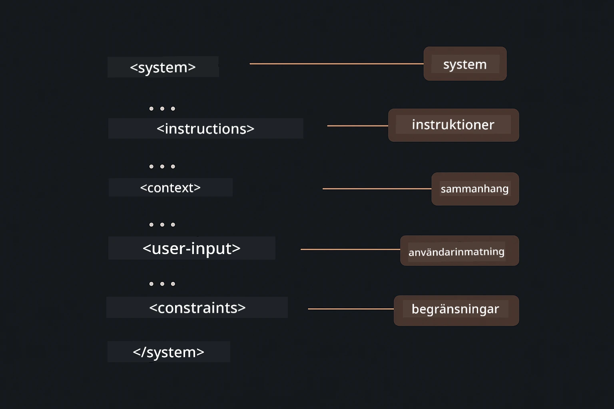

*Anatomi av en välstrukturerad prompt med tydliga sektioner och XML-liknande organisation*

**Kvalitet genom självvärdering**

De självreflekterande mönstren fungerar genom att göra kvalitetskriterier explicita. Istället för att hoppas att modellen "gör rätt", berättar du exakt vad "rätt" betyder: korrekt logik, felhantering, prestanda, säkerhet. Modellen kan sedan utvärdera sin egen output och förbättra sig. Detta förvandlar kodgenerering från lotteri till en process.

**Kontext är begränsad**

Fleromgångssamtal fungerar genom att inkludera meddelandehistorik med varje förfrågan. Men det finns en gräns – varje modell har ett max antal tokens. När samtalen växer behöver du strategier för att behålla relevant kontext utan att nå taket. Denna modul visar hur minne fungerar; senare lär du dig när du ska sammanfatta, när du ska glömma och när du ska hämta.

## Nästa steg

**Nästa modul:** [03-rag - RAG (Retrieval-Augmented Generation)](../03-rag/README.md)

---

**Navigering:** [← Föregående: Modul 01 - Introduktion](../01-introduction/README.md) | [Tillbaka till huvudmenyn](../README.md) | [Nästa: Modul 03 - RAG →](../03-rag/README.md)

---

<!-- CO-OP TRANSLATOR DISCLAIMER START -->
**Ansvarsfriskrivning**:
Detta dokument har översatts med hjälp av AI-översättningstjänsten [Co-op Translator](https://github.com/Azure/co-op-translator). Även om vi strävar efter noggrannhet, vänligen var medveten om att automatiska översättningar kan innehålla fel eller brister. Det ursprungliga dokumentet på dess modersmål bör betraktas som den auktoritativa källan. För kritisk information rekommenderas professionell mänsklig översättning. Vi ansvarar inte för några missförstånd eller feltolkningar som uppstår till följd av användningen av denna översättning.
<!-- CO-OP TRANSLATOR DISCLAIMER END -->