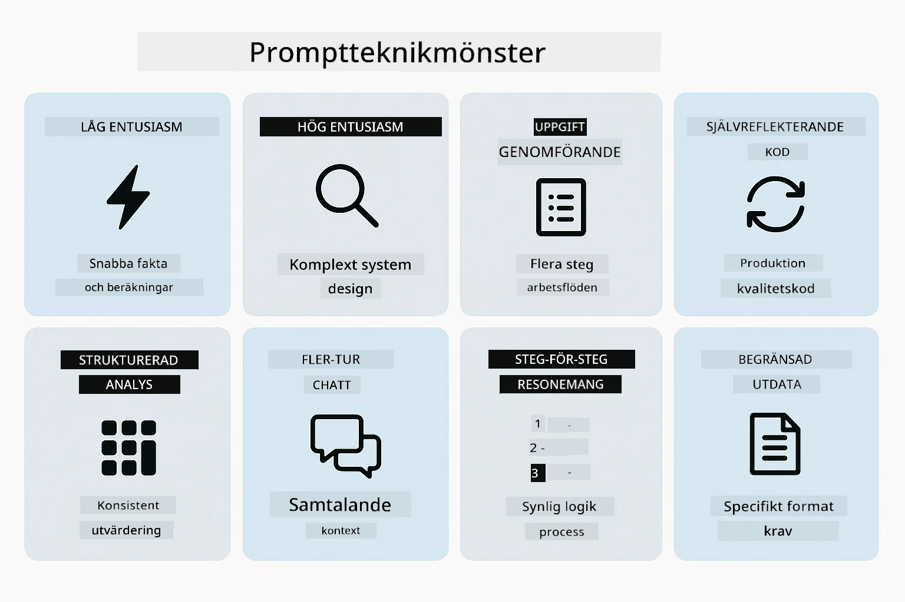
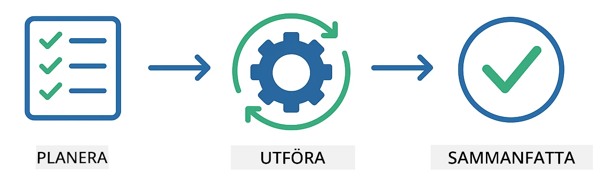
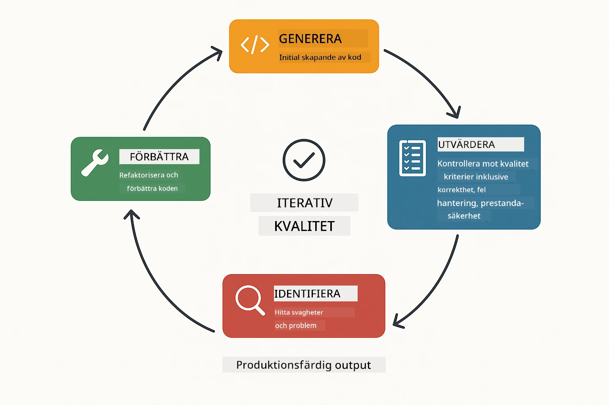
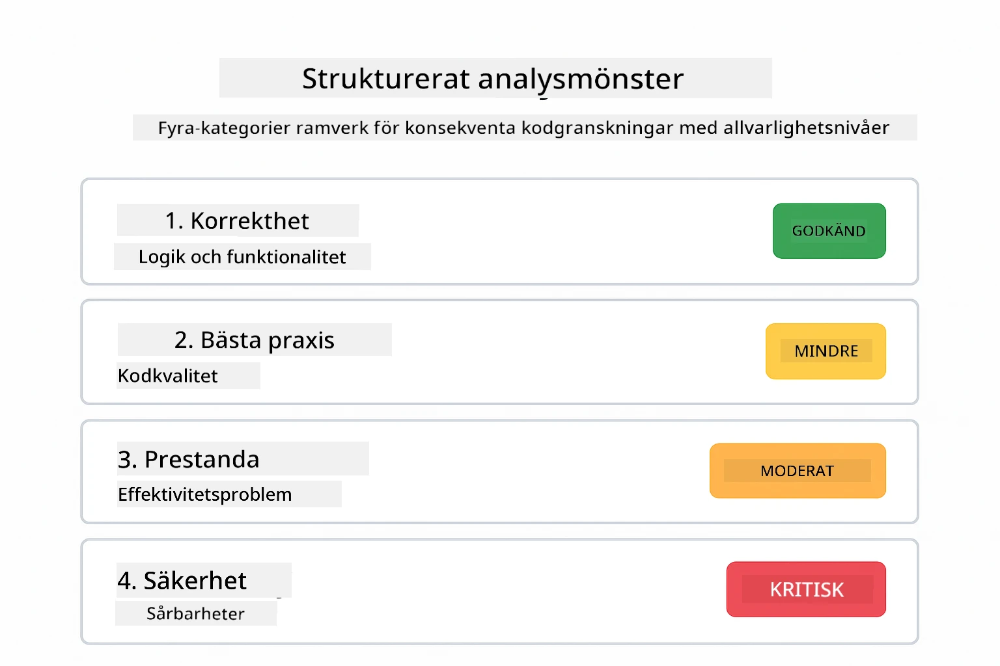
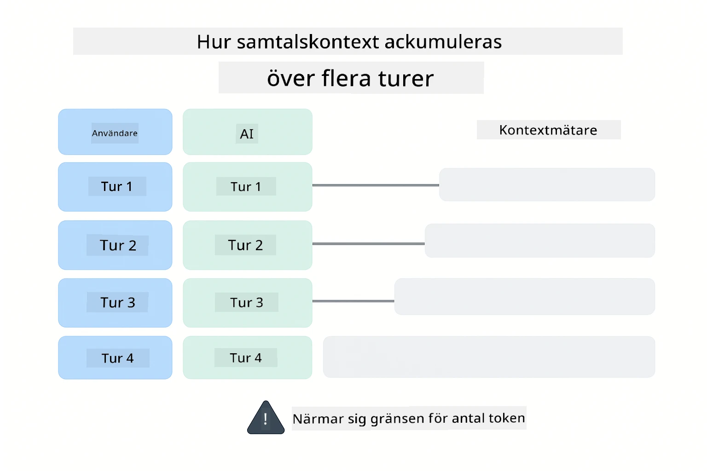
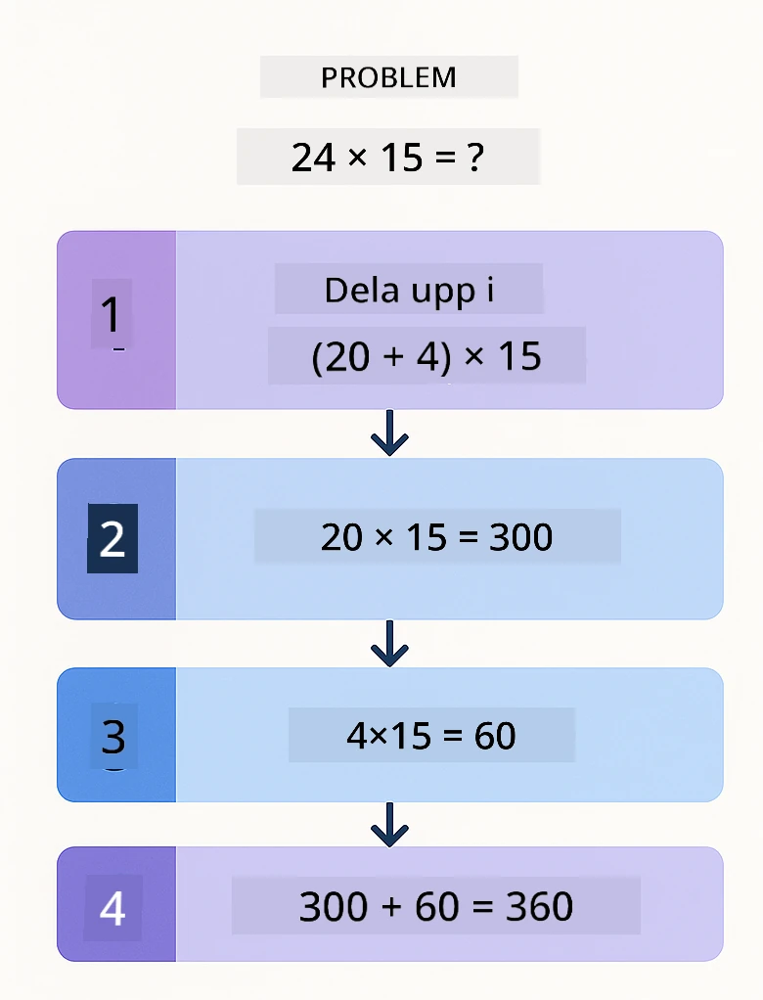
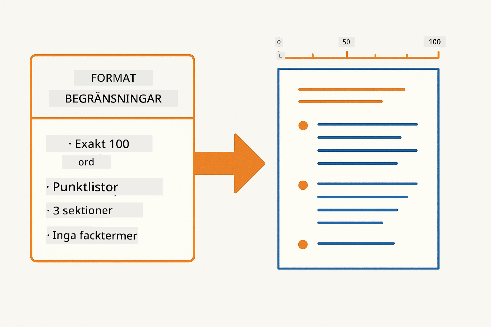
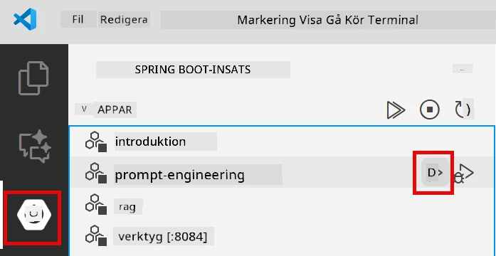
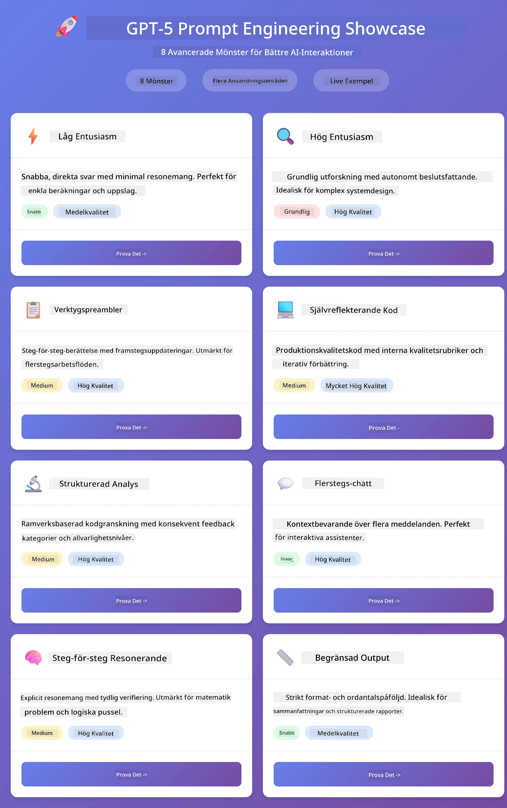
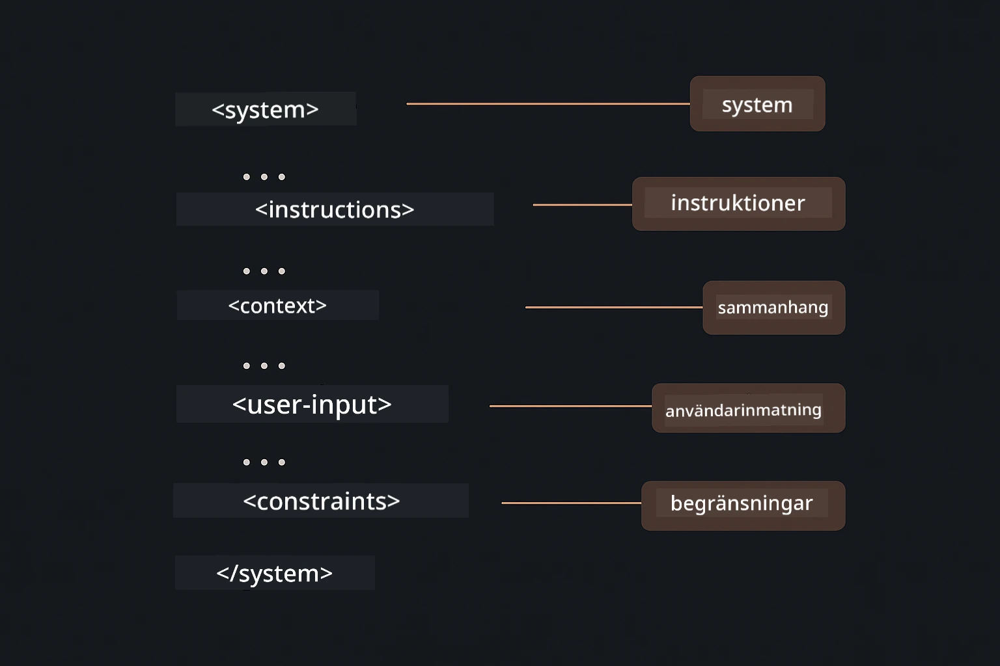

# Modul 02: Prompt Engineering med GPT-5.2

## Innehållsförteckning

- [Videogenomgång](#videogenomgång)
- [Det du kommer lära dig](#det-du-kommer-lära-dig)
- [Förkunskaper](#förkunskaper)
- [Förstå prompt engineering](#förstå-prompt-engineering)
- [Grundläggande om prompt engineering](#grundläggande-om-prompt-engineering)
  - [Zero-Shot Prompting](#zero-shot-prompting)
  - [Few-Shot Prompting](#few-shot-prompting)
  - [Chain of Thought](#chain-of-thought)
  - [Role-Based Prompting](#role-based-prompting)
  - [Promptmallar](#promptmallar)
- [Avancerade mönster](#avancerade-mönster)
- [Kör applikationen](#kör-applikationen)
- [Skärmdumpar från applikationen](#applikationsskärmbilder)
- [Utforska mönstren](#utforska-mönstren)
  - [Låg vs hög iver](#low-vs-high-eagerness)
  - [Uppgiftsutförande (verktygspreambler)](#utförande-av-uppgifter-verktygspreamblar)
  - [Självreflekterande kod](#självreflekterande-kod)
  - [Strukturerad analys](#strukturerad-analys)
  - [Flergångs-chatt](#flerstegs-chatt)
  - [Steg-för-steg-resonemang](#steg-för-steg-resonemang)
  - [Begränsat utdata](#begränsad-utdatan)
- [Vad du verkligen lär dig](#vad-du-verkligen-lär-dig)
- [Nästa steg](#nästa-steg)

## Videogenomgång

Titta på denna direktsända session som förklarar hur du kommer igång med denna modul:

<a href="https://www.youtube.com/live/PJ6aBaE6bog?si=LDshyBrTRodP-wke"></a>

## Det du kommer lära dig

Följande diagram ger en översikt över de viktigaste ämnena och färdigheterna du kommer utveckla i denna modul — från tekniker för förbättring av prompts till det steg-för-steg-arbetsflöde du kommer följa.


I den föregående modulen såg du hur minne möjliggör konversations-AI med Azure OpenAI. Nu fokuserar vi på hur du ställer frågor — själva promptsen — med hjälp av Azure OpenAI:s GPT-5.2. Sättet du strukturerar dina prompts påverkar dramatiskt kvaliteten på svaren du får. Vi börjar med en översyn av de grundläggande prompting-teknikerna, och går sedan vidare till åtta avancerade mönster som utnyttjar GPT-5.2:s kapaciteter fullt ut.

Vi använder GPT-5.2 eftersom den introducerar styrning av resonemang - du kan ange för modellen hur mycket tänkande den ska göra innan den svarar. Detta gör olika prompting-strategier tydligare och hjälper dig förstå när du ska använda varje tillvägagångssätt.

## Förkunskaper

- Avslutad modul 01 (Azure OpenAI-resurser distribuerade)
- `.env`-fil i rotkatalogen med Azure-referenser (skapad av `azd up` i modul 01)

> **Notera:** Om du inte har slutfört modul 01, följ installationsanvisningarna där först.

## Förstå prompt engineering

I grunden handlar prompt engineering om skillnaden mellan vaga instruktioner och precisa sådana, som jämförelsen nedan illustrerar.


Prompt engineering handlar om att designa inmatningstext som konsekvent ger dig de resultat du behöver. Det handlar inte bara om att ställa frågor - det handlar om att strukturera förfrågningar så att modellen exakt förstår vad du vill ha och hur det ska levereras.

Tänk på det som att ge instruktioner till en kollega. "Fix the bug" är vagt. "Fix the null pointer exception in UserService.java line 45 by adding a null check" är specifikt. Språkmodeller fungerar på samma sätt - specificitet och struktur är viktiga.

Diagrammet nedan visar hur LangChain4j passar in i denna bild — genom att koppla dina promptmönster till modellen via byggstenarna SystemMessage och UserMessage.


LangChain4j tillhandahåller infrastrukturen — modellkopplingar, minne och meddelandetyper — medan promptmönster bara är noggrant strukturerad text som du skickar genom denna infrastruktur. Nyckelbyggstenarna är `SystemMessage` (som sätter AI:ns beteende och roll) och `UserMessage` (som förmedlar din faktiska förfrågan).

## Grundläggande om prompt engineering

De fem kärntekniker som visas nedan utgör grunden för effektiv prompt engineering. Var och en adresserar en annan aspekt av hur du kommunicerar med språkmodeller.


Innan vi dyker in i de avancerade mönstren i denna modul, låt oss gå igenom fem grundläggande prompting-tekniker. Dessa är byggstenarna som varje promptingenjör bör känna till.

### Zero-Shot Prompting

Det enklaste tillvägagångssättet: ge modellen en direkt instruktion utan exempel. Modellen förlitar sig helt på sin träning för att förstå och utföra uppgiften. Detta fungerar bra för okomplicerade förfrågningar där förväntat beteende är uppenbart.


*Direkt instruktion utan exempel — modellen härleder uppgiften utifrån instruktionen*

```java
String prompt = "Classify this sentiment: 'I absolutely loved the movie!'";
String response = model.chat(prompt);
// Svar: "Positiv"
```

**När du ska använda det:** Enkla klassificeringar, direkta frågor, översättningar eller alla uppgifter som modellen kan hantera utan extra vägledning.

### Few-Shot Prompting

Ge exempel som demonstrerar mönstret du vill att modellen ska följa. Modellen lär sig det förväntade inmatnings- och utdataformatet från dina exempel och tillämpar det på nya indata. Detta förbättrar drastiskt konsekvensen för uppgifter där det önskade formatet eller beteendet inte är självklart.


*Lära av exempel — modellen identifierar mönstret och tillämpar det på nya indata*

```java
String prompt = """
    Classify the sentiment as positive, negative, or neutral.
    
    Examples:
    Text: "This product exceeded my expectations!" → Positive
    Text: "It's okay, nothing special." → Neutral
    Text: "Waste of money, very disappointed." → Negative
    
    Now classify this:
    Text: "Best purchase I've made all year!"
    """;
String response = model.chat(prompt);
```

**När du ska använda det:** Anpassade klassificeringar, konsekvent formatering, domänspecifika uppgifter eller när zero-shot-resultat är inkonsekventa.

### Chain of Thought

Be modellen visa sitt resonemang steg-för-steg. Istället för att hoppa direkt till ett svar delar modellen upp problemet och arbetar igenom varje del explicit. Detta förbättrar noggrannheten vid matematiska, logiska och flerstegsresonerande uppgifter.


*Steg-för-steg-resonemang — dela upp komplexa problem i tydliga logiska steg*

```java
String prompt = """
    Problem: A store has 15 apples. They sell 8 apples and then 
    receive a shipment of 12 more apples. How many apples do they have now?
    
    Let's solve this step-by-step:
    """;
String response = model.chat(prompt);
// Modellen visar: 15 - 8 = 7, sedan 7 + 12 = 19 äpplen
```

**När du ska använda det:** Matteproblem, logiska pussel, felsökning eller alla uppgifter där att visa resonemangsprocessen förbättrar noggrannheten och förtroendet.

### Role-Based Prompting

Sätt en persona eller roll för AI:n innan du ställer din fråga. Detta ger kontext som formar tonen, djupet och fokus i svaret. En "software architect" ger andra råd än en "junior developer" eller en "security auditor".


*Ställa in kontext och persona — samma fråga får olika svar beroende på tilldelad roll*

```java
String prompt = """
    You are an experienced software architect reviewing code.
    Provide a brief code review for this function:
    
    def calculate_total(items):
        total = 0
        for item in items:
            total = total + item['price']
        return total
    """;
String response = model.chat(prompt);
```

**När du ska använda det:** Kodgranskningar, handledning, domänspecifik analys eller när du behöver svar anpassade efter en viss expertisnivå eller perspektiv.

### Promptmallar

Skapa återanvändbara prompts med variabla platshållare. Istället för att skriva en ny prompt varje gång, definiera en mall en gång och fyll i olika värden. LangChain4j:s `PromptTemplate`-klass gör detta enkelt med `{{variable}}`-syntaxen.


*Återanvändbara prompts med variabla platshållare — en mall, många användningar*

```java
PromptTemplate template = PromptTemplate.from(
    "What's the best time to visit {{destination}} for {{activity}}?"
);

Prompt prompt = template.apply(Map.of(
    "destination", "Paris",
    "activity", "sightseeing"
));

String response = model.chat(prompt.text());
```

**När du ska använda det:** Upprepade frågor med olika indata, batchbearbetning, bygga återanvändbara AI-arbetsflöden eller alla scenarier där promptstrukturen är konstant men datat förändras.

---

Dessa fem grundläggande tekniker ger dig en stabil verktygslåda för de flesta prompting-uppgifter. Resten av denna modul bygger vidare på dem med **åtta avancerade mönster** som utnyttjar GPT-5.2:s styrning av resonemang, självvärdering och strukturerad utdata.

## Avancerade mönster

Med grunderna täckta, låt oss gå vidare till de åtta avancerade mönstren som gör denna modul unik. Inte alla problem kräver samma tillvägagångssätt. Vissa frågor behöver snabba svar, andra kräver djupt tänkande. Vissa behöver synligt resonemang, andra bara resultat. Varje mönster nedan är optimerat för ett annat scenario — och GPT-5.2:s resonemangsstyrning gör skillnaderna ännu tydligare.



*Översikt över de åtta prompt engineering-mönstren och deras användningsområden*

GPT-5.2 lägger till en ny dimension till dessa mönster: *resonemangsstyrning*. Reglaget nedan visar hur du kan justera modellens tänkande — från snabba, direkta svar till djuplodande, grundlig analys.


*GPT-5.2:s resonemangsstyrning låter dig specificera hur mycket tänkande modellen ska göra — från snabba direkta svar till djup utforskning*

**Låg iver (Snabbt & Fokuserat)** - För enkla frågor där du vill ha snabba, direkta svar. Modellen gör minimalt resonemang - max 2 steg. Använd detta för beräkningar, uppslagningar eller enkla frågor.

```java
String prompt = """
    <context_gathering>
    - Search depth: very low
    - Bias strongly towards providing a correct answer as quickly as possible
    - Usually, this means an absolute maximum of 2 reasoning steps
    - If you think you need more time, state what you know and what's uncertain
    </context_gathering>
    
    Problem: What is 15% of 200?
    
    Provide your answer:
    """;

String response = chatModel.chat(prompt);
```

> 💡 **Utforska med GitHub Copilot:** Öppna [`Gpt5PromptService.java`](../../../02-prompt-engineering/src/main/java/com/example/langchain4j/prompts/service/Gpt5PromptService.java) och fråga:
> - "Vad är skillnaden mellan låga och höga iver-promptmönster?"
> - "Hur hjälper XML-taggar i prompts att strukturera AI:ns svar?"
> - "När ska jag använda självreflektionsmönster kontra direkt instruktion?"

**Hög iver (Djupt & Grundligt)** - För komplexa problem där du vill ha en omfattande analys. Modellen undersöker grundligt och visar detaljerat resonemang. Använd detta för systemdesign, arkitekturval eller komplex forskning.

```java
String prompt = """
    Analyze this problem thoroughly and provide a comprehensive solution.
    Consider multiple approaches, trade-offs, and important details.
    Show your analysis and reasoning in your response.
    
    Problem: Design a caching strategy for a high-traffic REST API.
    """;

String response = chatModel.chat(prompt);
```

**Uppgiftsutförande (Steg-för-steg-framsteg)** - För flerstegsarbetsflöden. Modellen ger en plan i förväg, berättar om varje steg under arbetets gång och avslutar med en sammanfattning. Använd detta för migrationer, implementationer eller alla flerstegsprocesser.

```java
String prompt = """
    <task_execution>
    1. First, briefly restate the user's goal in a friendly way
    
    2. Create a step-by-step plan:
       - List all steps needed
       - Identify potential challenges
       - Outline success criteria
    
    3. Execute each step:
       - Narrate what you're doing
       - Show progress clearly
       - Handle any issues that arise
    
    4. Summarize:
       - What was completed
       - Any important notes
       - Next steps if applicable
    </task_execution>
    
    <tool_preambles>
    - Always begin by rephrasing the user's goal clearly
    - Outline your plan before executing
    - Narrate each step as you go
    - Finish with a distinct summary
    </tool_preambles>
    
    Task: Create a REST endpoint for user registration
    
    Begin execution:
    """;

String response = chatModel.chat(prompt);
```

Chain-of-Thought-prompting ber modellen visa sitt resonemang, vilket förbättrar noggrannheten för komplexa uppgifter. Genom att bryta ned processen steg-för-steg hjälper det både människor och AI att förstå logiken.

> **🤖 Prova med [GitHub Copilot](https://github.com/features/copilot) Chat:** Fråga om detta mönster:
> - "Hur kan jag anpassa mönstret för uppgiftsutförande för långvariga operationer?"
> - "Vilka är bästa praxis för att strukturera verktygspreambler i produktionsapplikationer?"
> - "Hur kan jag fånga och visa mellanliggande uppdateringar i en användargränssnitt?"

Diagrammet nedan illustrerar detta Planera → Utföra → Sammanfatta-arbetsflöde.



*Planera → Utföra → Sammanfatta-arbetsflöde för flerstegsuppgifter*

**Självreflekterande kod** - För att generera produktionsklar kod. Modellen genererar kod som följer produktionsstandarder med korrekt felhantering. Använd detta när du bygger nya funktioner eller tjänster.

```java
String prompt = """
    Generate Java code with production-quality standards: Create an email validation service
    Keep it simple and include basic error handling.
    """;

String response = chatModel.chat(prompt);
```

Diagrammet nedan visar denna iterativa förbättringscykel — generera, utvärdera, identifiera svagheter och förfina tills koden uppfyller produktionsstandarder.



*Iterativ förbättringscykel - generera, utvärdera, identifiera problem, förbättra, upprepa*

**Strukturerad analys** - För konsekvent utvärdering. Modellen granskar kod med en fast ram (korrekthet, praxis, prestanda, säkerhet, underhållbarhet). Använd detta för kodgranskningar eller kvalitetsbedömningar.

```java
String prompt = """
    <analysis_framework>
    You are an expert code reviewer. Analyze the code for:
    
    1. Correctness
       - Does it work as intended?
       - Are there logical errors?
    
    2. Best Practices
       - Follows language conventions?
       - Appropriate design patterns?
    
    3. Performance
       - Any inefficiencies?
       - Scalability concerns?
    
    4. Security
       - Potential vulnerabilities?
       - Input validation?
    
    5. Maintainability
       - Code clarity?
       - Documentation?
    
    <output_format>
    Provide your analysis in this structure:
    - Summary: One-sentence overall assessment
    - Strengths: 2-3 positive points
    - Issues: List any problems found with severity (High/Medium/Low)
    - Recommendations: Specific improvements
    </output_format>
    </analysis_framework>
    
    Code to analyze:
    ```
    public List getUsers() {
        return database.query("SELECT * FROM users");
    }
    ```
    Provide your structured analysis:
    """;

String response = chatModel.chat(prompt);
```

> **🤖 Prova med [GitHub Copilot](https://github.com/features/copilot) Chat:** Fråga om strukturerad analys:
> - "Hur kan jag anpassa analysramverket för olika typer av kodgranskningar?"
> - "Vad är bästa sättet att parsa och agera på strukturerad utdata programmässigt?"
> - "Hur säkerställer jag konsekventa allvarlighetsnivåer över olika granskningssessioner?"

Följande diagram visar hur detta strukturerade ramverk organiserar en kodgranskning i konsekventa kategorier med allvarlighetsnivåer.



*Ramverk för konsekventa kodgranskningar med allvarlighetsnivåer*

**Flergångs-chatt** - För konversationer som behöver kontext. Modellen minns tidigare meddelanden och bygger vidare på dem. Använd detta för interaktiva hjälpsessioner eller komplexa frågor och svar.

```java
ChatMemory memory = MessageWindowChatMemory.withMaxMessages(10);

memory.add(UserMessage.from("What is Spring Boot?"));
AiMessage aiMessage1 = chatModel.chat(memory.messages()).aiMessage();
memory.add(aiMessage1);

memory.add(UserMessage.from("Show me an example"));
AiMessage aiMessage2 = chatModel.chat(memory.messages()).aiMessage();
memory.add(aiMessage2);
```

Diagrammet nedan visualiserar hur konversationskontext ackumuleras med varje vändning och hur det relaterar till modellens token-gräns.



*Hur konversationskontext ackumuleras över flera vändningar tills token-gränsen nås*

**Steg-för-steg-resonemang** - För problem som kräver synlig logik. Modellen visar explicit resonemang för varje steg. Använd detta för matteproblem, logiska pussel eller när du behöver förstå tänkandeprocessen.

```java
String prompt = """
    <instruction>Show your reasoning step-by-step</instruction>
    
    If a train travels 120 km in 2 hours, then stops for 30 minutes,
    then travels another 90 km in 1.5 hours, what is the average speed
    for the entire journey including the stop?
    """;

String response = chatModel.chat(prompt);
```

Diagrammet nedan illustrerar hur modellen delar upp problem i tydliga, numrerade logiska steg.


*Nedbrytning av problem i tydliga logiska steg*

**Begränsad utdata** – För svar med specifika formatkrav. Modellen följer strikt format- och längdregler. Använd detta för sammanfattningar eller när du behöver exakt utdata.

```java
String prompt = """
    <constraints>
    - Exactly 100 words
    - Bullet point format
    - Technical terms only
    </constraints>
    
    Summarize the key concepts of machine learning.
    """;

String response = chatModel.chat(prompt);
```

Följande diagram visar hur begränsningar styr modellen att producera utdata som strikt följer dina format- och längdkrav.



*Upprätthålla specifika format-, längd- och strukturkrav*

## Kör applikationen

**Verifiera distributionen:**

Säkerställ att filen `.env` finns i rotkatalogen med Azure-uppgifter (skapad under Modul 01). Kör detta från modulkatalogen (`02-prompt-engineering/`):

**Bash:**
```bash
cat ../.env  # Bör visa AZURE_OPENAI_ENDPOINT, API_KEY, DEPLOYMENT
```

**PowerShell:**
```powershell
Get-Content ..\.env  # Ska visa AZURE_OPENAI_ENDPOINT, API_KEY, DEPLOYMENT
```

**Starta applikationen:**

> **Notera:** Om du redan startat alla applikationer med `./start-all.sh` från rotkatalogen (som beskrivs i Modul 01) kör denna modul redan på port 8083. Du kan då hoppa över startkommandona nedan och gå direkt till http://localhost:8083.

**Alternativ 1: Använd Spring Boot Dashboard (Rekommenderas för VS Code-användare)**

Dev-containern inkluderar Spring Boot Dashboard-tillägget, som ger ett visuellt gränssnitt för att hantera alla Spring Boot-applikationer. Du hittar det i aktivitetsfältet till vänster i VS Code (letar efter Spring Boot-ikonen).

Från Spring Boot Dashboard kan du:
- Se alla tillgängliga Spring Boot-applikationer i arbetsytan
- Starta/stoppa applikationer med ett klick
- Visa applikationsloggar i realtid
- Övervaka applikationens status

Klicka helt enkelt på play-knappen bredvid "prompt-engineering" för att starta denna modul, eller starta alla moduler samtidigt.



*Spring Boot Dashboard i VS Code — starta, stoppa och övervaka alla moduler från en plats*

**Alternativ 2: Använda shell-skript**

Starta alla webbapplikationer (moduler 01-04):

**Bash:**
```bash
cd ..  # Från rotkatalogen
./start-all.sh
```

**PowerShell:**
```powershell
cd ..  # Från rotkatalogen
.\start-all.ps1
```

Eller starta bara denna modul:

**Bash:**
```bash
cd 02-prompt-engineering
./start.sh
```

**PowerShell:**
```powershell
cd 02-prompt-engineering
.\start.ps1
```

Båda skripten laddar automatiskt miljövariabler från rotens `.env`-fil och bygger JAR-filerna om de inte finns.

> **Notera:** Om du föredrar att bygga alla moduler manuellt innan start:
>
> **Bash:**
> ```bash
> cd ..  # Go to root directory
> mvn clean package -DskipTests
> ```
>
> **PowerShell:**
> ```powershell
> cd ..  # Go to root directory
> mvn clean package -DskipTests
> ```

Öppna http://localhost:8083 i din webbläsare.

**För att stoppa:**

**Bash:**
```bash
./stop.sh  # Endast denna modul
# Eller
cd .. && ./stop-all.sh  # Alla moduler
```

**PowerShell:**
```powershell
.\stop.ps1  # Endast denna modul
# Eller
cd ..; .\stop-all.ps1  # Alla moduler
```

## Applikationsskärmbilder

Här är huvudgränssnittet för prompt engineering-modulen, där du kan experimentera med alla åtta mönster sida vid sida.



*Huvuddashboard som visar alla 8 prompt engineering-mönster med deras egenskaper och användningsfall*

## Utforska mönstren

Webbgränssnittet låter dig experimentera med olika promptstrategier. Varje mönster löser olika problem – testa dem för att se när varje metod lyser.

> **Notera: Strömmande vs Icke-strömmande** — Varje mönstersida erbjuder två knappar: **🔴 Stream Response (Live)** och ett **icke-strömmande** alternativ. Strömning använder Server-Sent Events (SSE) för att visa token i realtid när modellen genererar dem, så du ser framstegen direkt. Det icke-strömmande alternativet väntar tills hela svaret är färdigt innan det visas. För prompts som kräver djup resonemang (t.ex. High Eagerness, Self-Reflecting Code) kan icke-strömmande anrop ta mycket lång tid – ibland minuter – utan synlig återkoppling. **Använd strömning när du experimenterar med komplexa prompts** så du kan se modellen arbeta och undvika intrycket att förfrågan har tidsutgått.
>
> **Notera: Webbläsarkrav** — Strömfunktionaliteten använder Fetch Streams API (`response.body.getReader()`) som kräver en full webbläsare (Chrome, Edge, Firefox, Safari). Det fungerar **inte** i VS Codes inbyggda Simple Browser, eftersom dess webview inte stödjer ReadableStream API. Om du använder Simple Browser fungerar de icke-strömmande knapparna fortfarande normalt – endast strömknapparna är påverkade. Öppna `http://localhost:8083` i en extern webbläsare för full upplevelse.

### Low vs High Eagerness

Ställ en enkel fråga som "Vad är 15% av 200?" med Low Eagerness. Du får ett omedelbart, direkt svar. Ställ sedan något komplext som "Designa en caching-strategi för en högtrafikerad API" med High Eagerness. Klicka på **🔴 Stream Response (Live)** och se modellens detaljerade resonemang visas token-för-token. Samma modell, samma frågestruktur – men prompten talar om hur mycket tänkande som ska göras.

### Utförande av uppgifter (Verktygspreamblar)

Flerstegsarbetsflöden gynnas av förhandsplanering och progressiv berättande. Modellen beskriver vad den ska göra, berättar om varje steg och sammanfattar sedan resultaten.

### Självreflekterande kod

Prova "Skapa en tjänst för e-postvalidering". Istället för att bara generera kod och sluta så genererar modellen, utvärderar mot kvalitetskriterier, identifierar svagheter och förbättrar. Du ser den iterera tills koden håller produktionsstandard.

### Strukturerad analys

Kodgranskningar behöver konsekventa utvärderingsramverk. Modellen analyserar kod utifrån fasta kategorier (korrekthet, metoder, prestanda, säkerhet) med allvarlighetsnivåer.

### Flerstegs-chatt

Fråga "Vad är Spring Boot?" och följ direkt upp med "Visa ett exempel". Modellen minns din första fråga och ger dig ett specifikt Spring Boot-exempel. Utan minne hade den andra frågan varit för vag.

### Steg-för-steg-resonemang

Välj ett mattetal och prova med både Steg-för-steg-resonemang och Low Eagerness. Low eagerness ger bara svaret – snabbt men otydligt. Steg-för-steg visar varje beräkning och beslut.

### Begränsad utdatan

När du behöver specifika format eller ordantal, upprätthåller detta mönster strikt efterlevnad. Försök generera en sammanfattning med exakt 100 ord i punktlista.

## Vad du verkligen lär dig

**Resoneringsinsats förändrar allt**

GPT-5.2 låter dig kontrollera beräkningsinsats genom dina prompts. Låg insats ger snabba svar med minimal utforskning. Hög insats innebär att modellen tar tid på sig att tänka djupt. Du lär dig anpassa insats efter uppgiftskomplexitet – slösa inte tid på enkla frågor, men stressa inte komplexa beslut heller.

**Struktur styr beteende**

Ser du XML-taggarna i prompts? De är inte bara dekorativa. Modeller följer strukturerade instruktioner mer pålitligt än fri text. När du behöver flerstegsprocesser eller komplex logik, hjälper struktur modellen att hålla koll på var den är och vad som kommer härnäst. Diagrammet nedan bryter ner en välstrukturerad prompt och visar hur taggar som `<system>`, `<instructions>`, `<context>`, `<user-input>` och `<constraints>` organiserar dina instruktioner i tydliga sektioner.



*Anatomi av en välstrukturerad prompt med tydliga sektioner och XML-liknande organisation*

**Kvalitet genom självvärdering**

De självreflekterande mönstren fungerar genom att göra kvalitetskriterier explicit. Istället för att hoppas att modellen "gör rätt", berättar du exakt vad "rätt" betyder: korrekt logik, felhantering, prestanda, säkerhet. Modellen kan sedan utvärdera sin egen output och förbättra sig. Detta förvandlar kodgenerering från ett lotteri till en process.

**Kontext är ändlig**

Flerstegs-samtal fungerar genom att inkludera meddelandehistorik i varje förfrågan. Men det finns en gräns – varje modell har ett max antal tokens. När samtal växer behöver du strategier för att behålla relevant kontext utan att nå taket. Denna modul visar hur minnet fungerar; senare lär du dig när du ska sammanfatta, när du ska glömma och när du ska hämta.

## Nästa steg

**Nästa modul:** [03-rag - RAG (Retrieval-Augmented Generation)](../03-rag/README.md)

---

**Navigering:** [← Föregående: Modul 01 - Introduktion](../01-introduction/README.md) | [Tillbaka till huvudmeny](../README.md) | [Nästa: Modul 03 - RAG →](../03-rag/README.md)

---

<!-- CO-OP TRANSLATOR DISCLAIMER START -->
**Ansvarsfriskrivning**:
Detta dokument har översatts med hjälp av AI-översättningstjänsten [Co-op Translator](https://github.com/Azure/co-op-translator). Även om vi strävar efter noggrannhet, var vänlig notera att automatiska översättningar kan innehålla fel eller brister. Det ursprungliga dokumentet på dess modersmål bör betraktas som den auktoritativa källan. För kritisk information rekommenderas professionell mänsklig översättning. Vi ansvarar inte för några missförstånd eller feltolkningar som uppstår till följd av användningen av denna översättning.
<!-- CO-OP TRANSLATOR DISCLAIMER END -->