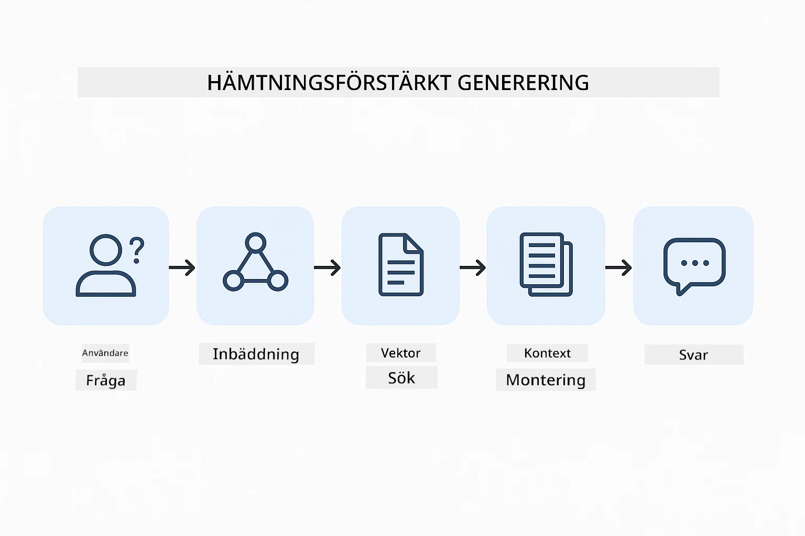
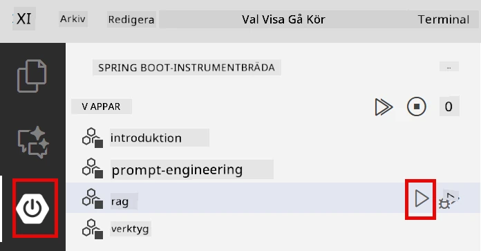
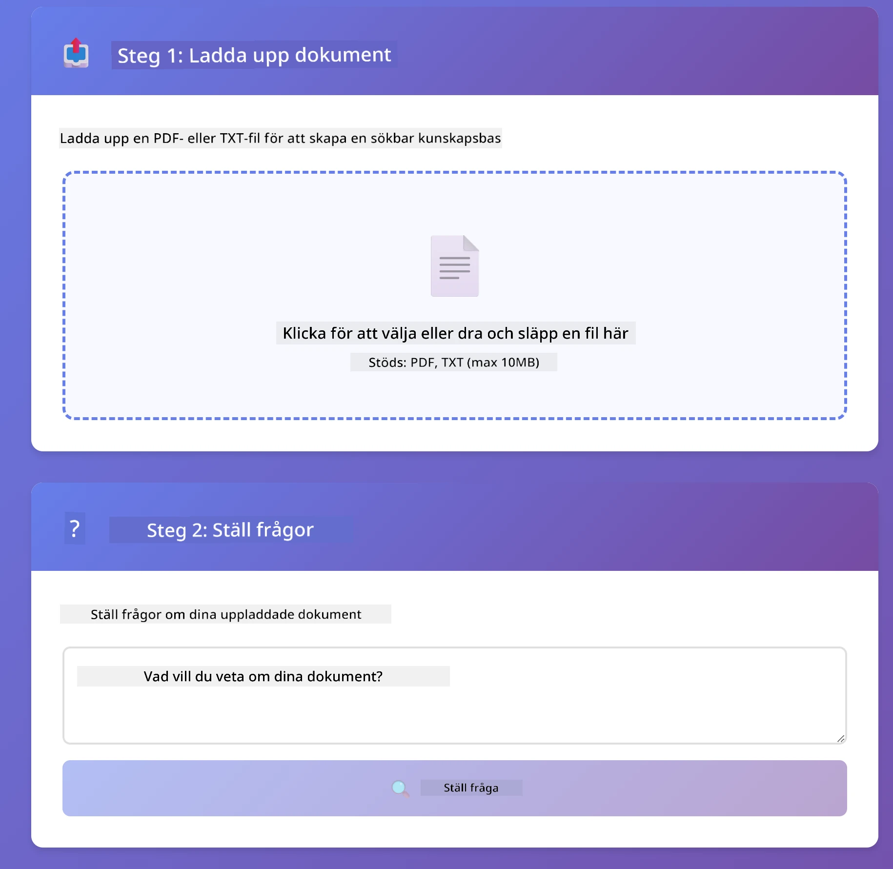
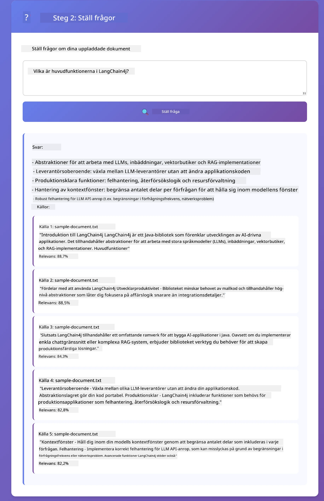

<!--
CO_OP_TRANSLATOR_METADATA:
{
  "original_hash": "81d087662fb3dd7b7124bce1a9c9ec86",
  "translation_date": "2026-01-05T23:39:17+00:00",
  "source_file": "03-rag/README.md",
  "language_code": "sv"
}
-->
# Modul 03: RAG (Retrieval-Augmented Generation)

## Innehållsförteckning

- [Vad du kommer att lära dig](../../../03-rag)
- [Förkunskaper](../../../03-rag)
- [Förstå RAG](../../../03-rag)
- [Hur det fungerar](../../../03-rag)
  - [Dokumenthantering](../../../03-rag)
  - [Skapa inbäddningar](../../../03-rag)
  - [Semantisk sökning](../../../03-rag)
  - [Svarsgenerering](../../../03-rag)
- [Kör applikationen](../../../03-rag)
- [Använda applikationen](../../../03-rag)
  - [Ladda upp ett dokument](../../../03-rag)
  - [Ställ frågor](../../../03-rag)
  - [Kontrollera källreferenser](../../../03-rag)
  - [Experimentera med frågor](../../../03-rag)
- [Nyckelbegrepp](../../../03-rag)
  - [Chunking-strategi](../../../03-rag)
  - [Likhetspoäng](../../../03-rag)
  - [Minneslagring](../../../03-rag)
  - [Hantera context-fönster](../../../03-rag)
- [När RAG är viktigt](../../../03-rag)
- [Nästa steg](../../../03-rag)

## Vad du kommer att lära dig

I de föregående modulerna lärde du dig hur du kan ha samtal med AI och strukturera dina promptar effektivt. Men det finns en grundläggande begränsning: språkmodeller vet bara det de lärde sig under träningen. De kan inte svara på frågor om ditt företags policys, din projektdokumentation eller någon information de inte tränades på.

RAG (Retrieval-Augmented Generation) löser detta problem. Istället för att försöka lära modellen din information (vilket är dyrt och opraktiskt), ger du den möjligheten att söka igenom dina dokument. När någon ställer en fråga hittar systemet relevant information och inkluderar det i prompten. Modellen svarar sedan baserat på den hämtade kontexten.

Tänk på RAG som att ge modellen ett referensbibliotek. När du ställer en fråga gör systemet följande:

1. **Användarfråga** - Du ställer en fråga  
2. **Inbäddning** - Omvandlar din fråga till en vektor  
3. **Vektorsökning** - Hittar liknande dokumentbitar  
4. **Kontekstsammansättning** - Lägger till relevanta bitar i prompten  
5. **Svar** - LLM genererar ett svar baserat på kontexten

Detta förankrar modellens svar i dina faktiska data istället för att lita på dess träningskunskap eller att hitta på svar.



*RAG arbetsflöde - från användarfråga till semantisk sökning till kontextuell svarsgenerering*

## Förkunskaper

- Slutförd Modul 01 (Azure OpenAI-resurser distribuerade)
- `.env`-fil i root-katalogen med Azure-uppgifter (skapad av `azd up` i Modul 01)

> **Obs:** Om du inte har slutfört Modul 01, följ först distributionsinstruktionerna där.

## Hur det fungerar

### Dokumenthantering

[DocumentService.java](../../../03-rag/src/main/java/com/example/langchain4j/rag/service/DocumentService.java)

När du laddar upp ett dokument delar systemet upp det i bitar – mindre delar som ryms bekvämt i modellens kontextfönster. Dessa bitar överlappar något för att du inte ska förlora kontext vid gränserna.

```java
Document document = FileSystemDocumentLoader.loadDocument("sample-document.txt");

DocumentSplitter splitter = DocumentSplitters
    .recursive(300, 30, new OpenAiTokenizer());

List<TextSegment> segments = splitter.split(document);
```

> **🤖 Prova med [GitHub Copilot](https://github.com/features/copilot) Chat:** Öppna [`DocumentService.java`](../../../03-rag/src/main/java/com/example/langchain4j/rag/service/DocumentService.java) och fråga:
> - "Hur delar LangChain4j upp dokument i bitar och varför är överlapp viktigt?"
> - "Vad är den optimala bitstorleken för olika dokumenttyper och varför?"
> - "Hur hanterar jag dokument på flera språk eller med speciell formatering?"

### Skapa inbäddningar

[LangChainRagConfig.java](../../../03-rag/src/main/java/com/example/langchain4j/rag/config/LangChainRagConfig.java)

Varje bit omvandlas till en numerisk representation kallad en inbäddning - i princip ett matematiskt fingeravtryck som fångar textens betydelse. Liknande text ger liknande inbäddningar.

```java
@Bean
public EmbeddingModel embeddingModel() {
    return OpenAiOfficialEmbeddingModel.builder()
        .baseUrl(azureOpenAiEndpoint)
        .apiKey(azureOpenAiKey)
        .modelName(azureEmbeddingDeploymentName)
        .build();
}

EmbeddingStore<TextSegment> embeddingStore = 
    new InMemoryEmbeddingStore<>();
```


*Dokument representerade som vektorer i inbäddningsutrymmet - liknande innehåll klustras ihop*

### Semantisk sökning

[RagService.java](../../../03-rag/src/main/java/com/example/langchain4j/rag/service/RagService.java)

När du ställer en fråga blir också din fråga en inbäddning. Systemet jämför din frågas inbäddning med alla dokumentbitars inbäddningar. Det hittar de bitar med mest liknande mening – inte bara matchande nyckelord, utan faktisk semantisk likhet.

```java
Embedding queryEmbedding = embeddingModel.embed(question).content();

List<EmbeddingMatch<TextSegment>> matches = 
    embeddingStore.findRelevant(queryEmbedding, 5, 0.7);

for (EmbeddingMatch<TextSegment> match : matches) {
    String relevantText = match.embedded().text();
    double score = match.score();
}
```

> **🤖 Prova med [GitHub Copilot](https://github.com/features/copilot) Chat:** Öppna [`RagService.java`](../../../03-rag/src/main/java/com/example/langchain4j/rag/service/RagService.java) och fråga:
> - "Hur fungerar likhetssökning med inbäddningar och vad bestämmer poängen?"
> - "Vilken likhetströskel ska jag använda och hur påverkar det resultaten?"
> - "Hur hanterar jag fall där inga relevanta dokument hittas?"

### Svarsgenerering

[RagService.java](../../../03-rag/src/main/java/com/example/langchain4j/rag/service/RagService.java)

De mest relevanta bitarna inkluderas i prompten till modellen. Modellen läser dessa specifika bitar och svarar på din fråga baserat på informationen. Detta förhindrar hallucination – modellen kan bara svara utifrån vad som finns framför den.

## Kör applikationen

**Verifiera distribution:**

Säkerställ att `.env`-filen finns i root-katalogen med Azure-uppgifter (skapad under Modul 01):  
```bash
cat ../.env  # Bör visa AZURE_OPENAI_ENDPOINT, API_KEY, DEPLOYMENT
```
  
**Starta applikationen:**

> **Obs:** Om du redan startade alla applikationer med `./start-all.sh` från Modul 01 körs denna modul redan på port 8081. Du kan hoppa över startkommandona nedan och gå direkt till http://localhost:8081.

**Alternativ 1: Använd Spring Boot Dashboard (Rekommenderas för VS Code-användare)**

Dev-container inkluderar Spring Boot Dashboard-tillägget som ger ett visuellt gränssnitt för att hantera alla Spring Boot-appar. Du hittar det i aktivitetsfältet till vänster i VS Code (leta efter Spring Boot-ikonen).

Från Spring Boot Dashboard kan du:
- Se alla tillgängliga Spring Boot-appar i arbetsytan  
- Starta/stopp rätt enkelt med ett klick  
- Se applikationsloggar i realtid  
- Övervaka applikationens status

Klicka bara på play-knappen bredvid ”rag” för att starta denna modul, eller starta alla moduler samtidigt.



**Alternativ 2: Använda shell-skript**

Starta alla webbapplikationer (modulerna 01-04):

**Bash:**  
```bash
cd ..  # Från rotkatalogen
./start-all.sh
```
  
**PowerShell:**  
```powershell
cd ..  # Från rotkatalogen
.\start-all.ps1
```
  
Eller starta bara denna modul:

**Bash:**  
```bash
cd 03-rag
./start.sh
```
  
**PowerShell:**  
```powershell
cd 03-rag
.\start.ps1
```
  
Båda skripten laddar automatiskt miljövariabler från root-`.env`-filen och bygger JAR-filerna om de inte finns.

> **Obs:** Om du föredrar att manuellt bygga alla moduler innan start:  
>  
> **Bash:**  
> ```bash
> cd ..  # Go to root directory
> mvn clean package -DskipTests
> ```
  
> **PowerShell:**  
> ```powershell
> cd ..  # Go to root directory
> mvn clean package -DskipTests
> ```
  

Öppna http://localhost:8081 i din webbläsare.

**För att stoppa:**  

**Bash:**  
```bash
./stop.sh  # Endast denna modul
# Eller
cd .. && ./stop-all.sh  # Alla moduler
```
  
**PowerShell:**  
```powershell
.\stop.ps1  # Endast denna modul
# Eller
cd ..; .\stop-all.ps1  # Alla moduler
```
  
## Använda applikationen

Applikationen erbjuder ett webbgränssnitt för dokumentuppladdning och frågeställning.

<a href="images/rag-homepage.png"></a>

*RAG-applikationsgränssnitt - ladda upp dokument och ställ frågor*

### Ladda upp ett dokument

Börja med att ladda upp ett dokument – TXT-filer fungerar bäst för testning. En `sample-document.txt` finns i denna mapp och innehåller information om LangChain4j-funktioner, RAG-implementering och bästa praxis – perfekt för att testa systemet.

Systemet bearbetar ditt dokument, delar upp det i bitar och skapar inbäddningar för varje bit. Det sker automatiskt när du laddar upp.

### Ställ frågor

Ställ specifika frågor om dokumentinnehållet. Prova något faktabaserat som tydligt framgår av dokumentet. Systemet söker efter relevanta bitar, inkluderar dem i prompten och genererar ett svar.

### Kontrollera källreferenser

Notera att varje svar inkluderar källreferenser med likhetspoäng. Dessa poäng (0 till 1) visar hur relevanta varje bit var för din fråga. Högre poäng betyder bättre matchning. Detta låter dig verifiera svaret mot källmaterialet.

<a href="images/rag-query-results.png"></a>

*Frågeresultat som visar svar med källreferenser och relevanspoäng*

### Experimentera med frågor

Prova olika typer av frågor:  
- Specifika fakta: "Vad är huvudämnet?"  
- Jämförelser: "Vad är skillnaden mellan X och Y?"  
- Sammanfattningar: "Sammanfatta nyckelpunkterna om Z"

Observera hur relevanspoängen ändras beroende på hur väl din fråga matchar dokumentinnehållet.

## Nyckelbegrepp

### Chunking-strategi

Dokument delas upp i 300-token-bitar med 30 tokens överlapp. Denna balans säkerställer att varje bit har tillräcklig kontext för att vara meningsfull samtidigt som den håller sig liten nog för att inkludera flera bitar i en prompt.

### Likhetspoäng

Poängen varierar från 0 till 1:  
- 0,7–1,0: Mycket relevant, exakt match  
- 0,5–0,7: Relevant, bra kontext  
- Under 0,5: Filtreras bort, för olik

Systemet hämtar endast bitar över minimumtröskeln för att säkerställa kvalitet.

### Minneslagring

Denna modul använder minneslagring för enkelhetens skull. När du startar om applikationen förloras uppladdade dokument. Produktionssystem använder persistenta vektordatabaser som Qdrant eller Azure AI Search.

### Hantera context-fönster

Varje modell har ett maximalt context-fönster. Du kan inte inkludera varje bit från ett stort dokument. Systemet hämtar de topp N mest relevanta bitarna (standard 5) för att hålla sig inom gränserna samtidigt som tillräcklig kontext ges för korrekta svar.

## När RAG är viktigt

**Använd RAG när:**  
- Du ska svara på frågor om proprietära dokument  
- Information ändras ofta (policys, priser, specifikationer)  
- Noggrannhet kräver källhänvisning  
- Innehållet är för stort för att få plats i en enda prompt  
- Du behöver verifierbara, förankrade svar

**Använd inte RAG när:**  
- Frågor kräver allmän kunskap som modellen redan har  
- Realtidsdata behövs (RAG fungerar på uppladdade dokument)  
- Innehållet är tillräckligt litet för att inkluderas direkt i promptar

## Nästa steg

**Nästa modul:** [04-tools - AI Agents med verktyg](../04-tools/README.md)

---

**Navigation:** [← Föregående: Modul 02 - Prompt Engineering](../02-prompt-engineering/README.md) | [Tillbaka till huvud](../README.md) | [Nästa: Modul 04 - Verktyg →](../04-tools/README.md)

---

<!-- CO-OP TRANSLATOR DISCLAIMER START -->
**Ansvarsfriskrivning**:
Detta dokument har översatts med hjälp av AI-översättningstjänsten [Co-op Translator](https://github.com/Azure/co-op-translator). Även om vi strävar efter noggrannhet, bör du vara medveten om att automatiska översättningar kan innehålla fel eller brister. Det ursprungliga dokumentet på dess modersmål ska betraktas som den auktoritativa källan. För viktig information rekommenderas professionell mänsklig översättning. Vi ansvarar inte för några missförstånd eller feltolkningar som uppstår från användningen av denna översättning.
<!-- CO-OP TRANSLATOR DISCLAIMER END -->