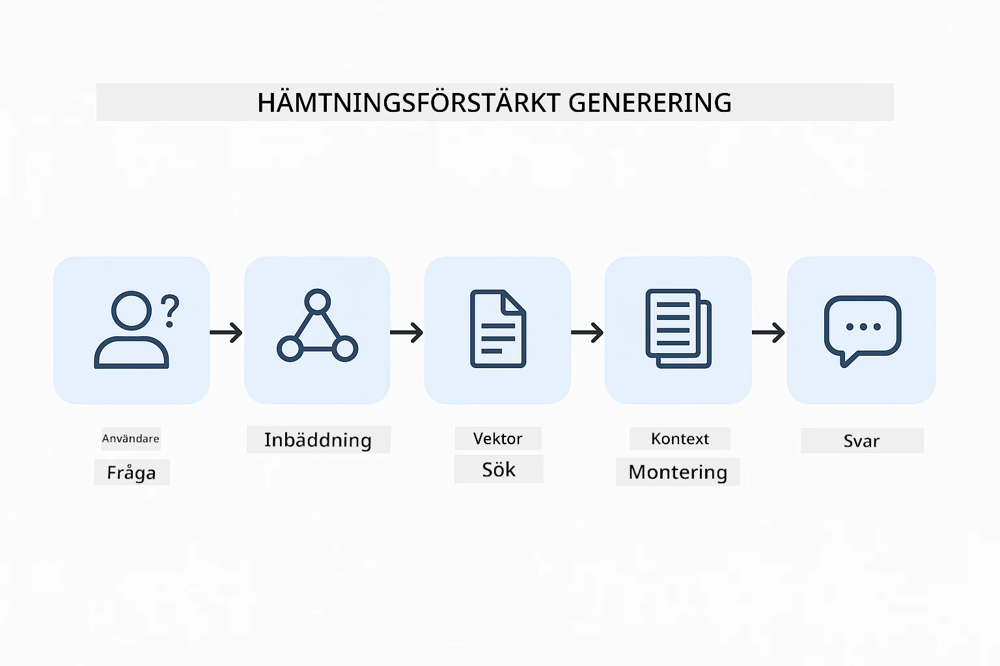
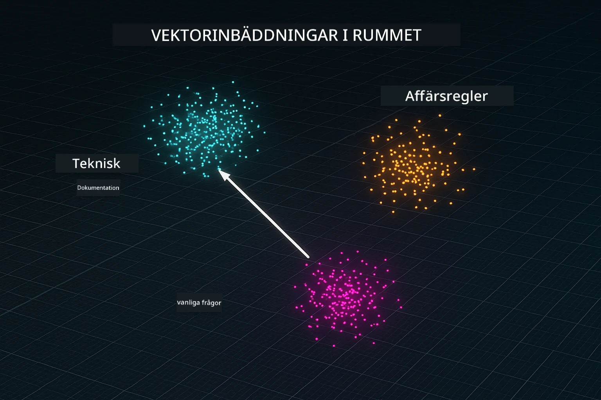
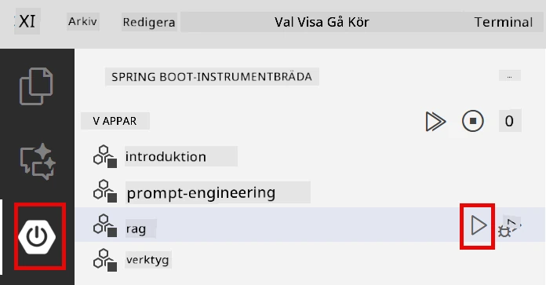
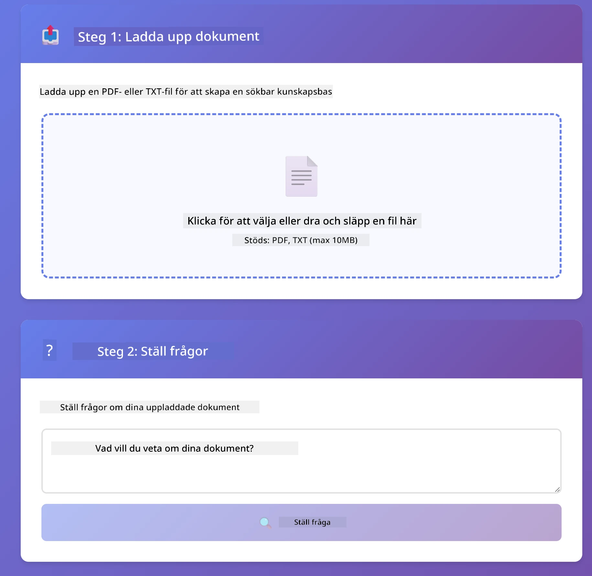
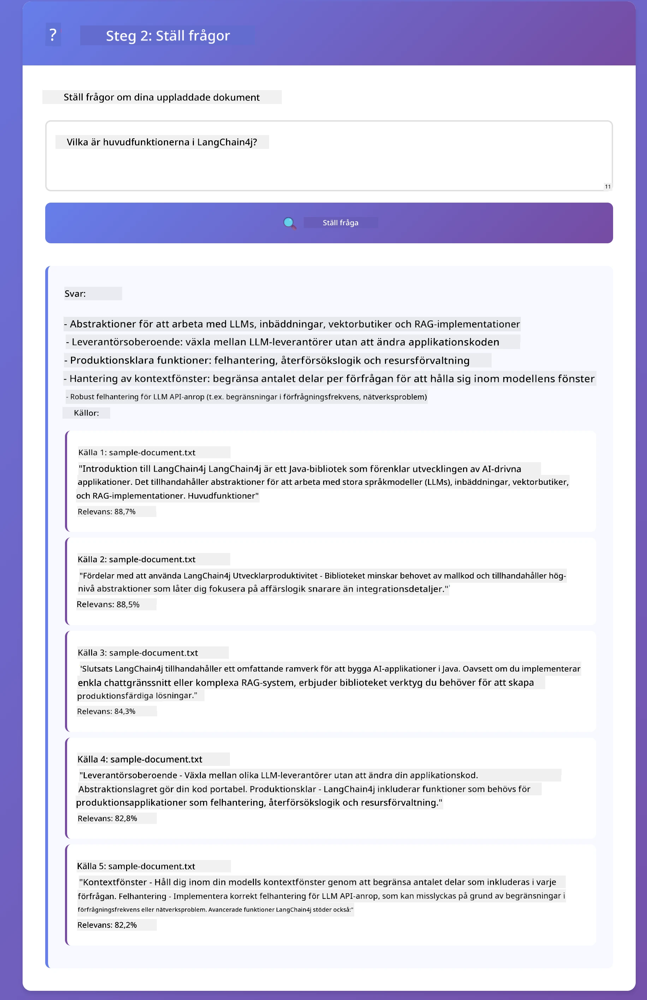

# Modul 03: RAG (Retrieval-Augmented Generation)

## Innehållsförteckning

- [Videogenomgång](#videogenomgång)
- [Det du kommer lära dig](#det-du-kommer-lära-dig)
- [Förkunskaper](#förkunskaper)
- [Förstå RAG](#förstå-rag)
  - [Vilken RAG-metod använder denna handledning?](#vilken-rag-metod-använder-denna-handledning)
- [Hur det fungerar](#hur-det-fungerar)
  - [Dokumentbearbetning](#dokumentbearbetning)
  - [Skapa inbäddningar](#skapa-inbäddningar)
  - [Semantisk sökning](#semantisk-sökning)
  - [Svarsgenerering](#svarsgenerering)
- [Kör applikationen](#kör-applikationen)
- [Använda applikationen](#använda-applikationen)
  - [Ladda upp ett dokument](#ladda-upp-ett-dokument)
  - [Ställ frågor](#ställ-frågor)
  - [Kontrollera källa-referenser](#kontrollera-källreferenser)
  - [Experimentera med frågor](#experimentera-med-frågor)
- [Nyckelbegrepp](#nyckelbegrepp)
  - [Chunking-strategi](#uppdelningsstrategi)
  - [Likhetspoäng](#likhetspoäng)
  - [Minneslagring](#minneslagring)
  - [Hantera kontextfönster](#hantering-av-kontextfönster)
- [När RAG spelar roll](#när-rag-är-viktigt)
- [Nästa steg](#nästa-steg)

## Videogenomgång

Titta på denna livesession som förklarar hur du kommer igång med denna modul:

<a href="https://www.youtube.com/watch?v=_olq75ZH_eY"></a>

## Det du kommer lära dig

I tidigare moduler lärde du dig hur man samtalar med AI och strukturerar dina prompts effektivt. Men det finns en grundläggande begränsning: språkmodeller vet bara det de lärde sig under träningen. De kan inte svara på frågor om ditt företags policyer, din projektdokumentation eller någon information de inte tränades på.

RAG (Retrieval-Augmented Generation) löser detta problem. Istället för att försöka lära modellen din information (vilket är dyrt och opraktiskt) ger du den möjlighet att söka igenom dina dokument. När någon ställer en fråga hittar systemet relevant information och inkluderar den i prompten. Modellen svarar sedan baserat på den hämtade kontexten.

Tänk på RAG som att ge modellen ett referensbibliotek. När du ställer en fråga gör systemet:

1. **Användarfråga** - Du ställer en fråga  
2. **Inbäddning** - Konverterar din fråga till en vektor  
3. **Vektorsökning** - Hittar liknande dokumentbitar  
4. **Konstuktionssammanställning** - Lägger till relevanta bitar i prompten  
5. **Svar** - LLM genererar ett svar baserat på kontexten  

Detta förankrar modellens svar i dina faktiska data istället för att förlita sig på dess träningskunskap eller hitta på svar.

## Förkunskaper

- Slutförd [Modul 01 - Introduktion](../01-introduction/README.md) (Azure OpenAI-resurser distribuerade, inklusive inbäddningsmodellen `text-embedding-3-small`)  
- `.env`-fil i rotkatalogen med Azure-referenser (skapad med `azd up` i Modul 01)  

> **Notera:** Om du inte har slutfört Modul 01, följ installationsinstruktionerna där först. Kommandot `azd up` distribuerar både GPT-chatmodellen och inbäddningsmodellen som används i denna modul.

## Förstå RAG

Diagrammet nedan illustrerar kärnkonceptet: istället för att enbart förlita sig på modellens träningsdata ger RAG modellen ett referensbibliotek av dina dokument att konsultera innan varje svar genereras.


*Detta diagram visar skillnaden mellan en standard-LLM (som gissar från träningsdata) och en RAG-förstärkt LLM (som först konsulterar dina dokument).*

Så här kopplas delarna samman från början till slut. En användares fråga går igenom fyra steg — inbäddning, vektorsökning, kontextsammanställning och svarsgenerering — där varje steg bygger på det föregående:



*Detta diagram visar den end-to-end RAG-pipelinen — en användarfråga går igenom inbäddning, vektorsökning, kontextsammanställning och svarsgenerering.*

Resten av denna modul går igenom varje steg i detalj med kod du kan köra och modifiera.

### Vilken RAG-metod använder denna handledning?

LangChain4j erbjuder tre sätt att implementera RAG, var och en med olika nivåer av abstraktion. Diagrammet nedan jämför dem sida vid sida:


*Detta diagram jämför de tre LangChain4j RAG-metoderna — Easy, Native och Advanced — visar deras nyckelkomponenter och när man bör använda varje.*

| Metod | Vad den gör | Avvägning |
|---|---|---|
| **Easy RAG** | Kopplar allt automatiskt genom `AiServices` och `ContentRetriever`. Du annoterar ett gränssnitt, kopplar en retriever, och LangChain4j hanterar inbäddning, sökning och promptsammanställning i bakgrunden. | Minimal kod, men du ser inte vad som händer i varje steg. |
| **Native RAG** | Du anropar inbäddningsmodellen, söker i lagret, bygger prompten och genererar svaret själv — ett tydligt steg i taget. | Mer kod, men varje steg är synligt och kan modifieras. |
| **Advanced RAG** | Använder `RetrievalAugmentor`-ramverket med pluggbara frågetransformatorer, ruttrar, omrankare och innehållsinjektorer för produktionsklara pipelines. | Maximal flexibilitet, men avsevärt mer komplexitet. |

**Denna handledning använder Native-metoden.** Varje steg i RAG-pipelinen — att bädda in frågan, söka i vektorlager, sammanställa kontext och generera svar — är explicit utskrivet i [`RagService.java`](../../../03-rag/src/main/java/com/example/langchain4j/rag/service/RagService.java). Detta är avsiktligt: som en lärresurs är det viktigare att du ser och förstår varje steg än att koden är minimal. När du känner dig bekväm med hur delarna hänger ihop kan du gå vidare till Easy RAG för snabba prototyper eller Advanced RAG för produktionssystem.

> **💡 Nyfiken på Easy RAG?** LangChain4j erbjuder även en *Easy RAG*-metod där `AiServices` och en `ContentRetriever` hanterar inbäddning, sökning och promptsammanställning automatiskt. Denna modul tar den mer explicita vägen — bryter upp pipelinen så du kan se och kontrollera varje steg själv.

Diagrammet nedan visar Easy RAG-pipelinen. Notera hur `AiServices` och `EmbeddingStoreContentRetriever` döljer all komplexitet — du laddar upp ett dokument, kopplar en retriever och får svar. Native-metoden i denna modul bryter upp dessa dolda steg:


*Detta diagram visar Easy RAG-pipelinen. Jämför med Native-metoden i denna modul: Easy RAG döljer inbäddning, hämtning och promptsammanställning bakom `AiServices` och `ContentRetriever` — du laddar upp ett dokument, fäster en retriever och får svar. Native-metoden bryter upp den pipelinen så du själv anropar varje steg (bädda in, sök, sammanställ kontext, generera), vilket ger full insyn och kontroll.*

## Hur det fungerar

RAG-pipelinen i denna modul delas upp i fyra steg som körs i följd varje gång en användare ställer en fråga. Först parsas och delas ett uppladdat dokument upp i hanterbara delar. Dessa delar konverteras sedan till vektorinbäddningar och lagras så att de kan jämföras matematiskt. När en fråga kommer gör systemet en semantisk sökning för att hitta de mest relevanta delarna, och slutligen skickas de som kontext till LLM:n för att generera ett svar. Sektionerna nedan går igenom varje steg med faktisk kod och diagram. Låt oss titta på första steget.

### Dokumentbearbetning

[DocumentService.java](../../../03-rag/src/main/java/com/example/langchain4j/rag/service/DocumentService.java)

När du laddar upp ett dokument parsar systemet det (PDF eller ren text), fäster metadata som filnamn och delar sedan upp det i chunkar — mindre bitar som passar bekvämt i modellens kontextfönster. Dessa bitar överlappar något så att du inte förlorar kontext vid gränserna.

```java
// Analysera den uppladdade filen och kapsla in den i ett LangChain4j-dokument
Document document = Document.from(content, metadata);

// Dela upp i 300-token bitar med 30-token överlappning
DocumentSplitter splitter = DocumentSplitters
    .recursive(300, 30);

List<TextSegment> segments = splitter.split(document);
```

Diagrammet nedan visar detta visuellt. Notera hur varje chunk delar vissa tokens med sina grannar — en 30-token överlappning säkerställer att ingen viktig kontext försvinner mellan sprickorna:


*Detta diagram visar ett dokument som delas upp i chunkar om 300 tokens med 30 tokens överlappning, vilket bevarar kontexten vid chunk-gränserna.*

> **🤖 Prova med [GitHub Copilot](https://github.com/features/copilot) Chat:** Öppna [`DocumentService.java`](../../../03-rag/src/main/java/com/example/langchain4j/rag/service/DocumentService.java) och fråga:  
> - "Hur delar LangChain4j upp dokument i chunkar och varför är överlappning viktig?"  
> - "Vad är optimal chunk-storlek för olika dokumenttyper och varför?"  
> - "Hur hanterar jag dokument på flera språk eller med specialformatering?"

### Skapa inbäddningar

[LangChainRagConfig.java](../../../03-rag/src/main/java/com/example/langchain4j/rag/config/LangChainRagConfig.java)

Varje chunk omvandlas till en numerisk representation som kallas inbäddning — i princip en betydelse-till-siffror-omvandlare. Inbäddningsmodellen är inte "intelligent" på samma sätt som en chatmodell; den kan inte följa instruktioner, resonera eller svara på frågor. Det den kan göra är att mappa text till ett matematiskt rum där liknande betydelser hamnar nära varandra — ”bil” nära ”automobil”, ”återbetalningspolicy” nära ”få mina pengar tillbaka.” Tänk på en chatmodell som en person du kan prata med; en inbäddningsmodell är ett superskickligt arkiveringssystem.

Diagrammet nedan visualiserar detta koncept — text går in, numeriska vektorer kommer ut, och liknande betydelser ger vektorer som hamnar nära varandra:


*Detta diagram visar hur en inbäddningsmodell konverterar text till numeriska vektorer, där liknande betydelser — som "bil" och "automobil" — placeras nära varandra i vektorrummet.*

```java
@Bean
public EmbeddingModel embeddingModel() {
    return OpenAiOfficialEmbeddingModel.builder()
        .baseUrl(azureOpenAiEndpoint)
        .apiKey(azureOpenAiKey)
        .modelName(azureEmbeddingDeploymentName)
        .build();
}

EmbeddingStore<TextSegment> embeddingStore = 
    new InMemoryEmbeddingStore<>();
```

Klassdiagrammet nedan visar de två separata flödena i en RAG-pipeline och LangChain4j-klasserna som implementerar dem. **Inmatningsflödet** (körs en gång vid uppladdning) delar dokumentet, bäddar in chunkarna och lagrar dem via `.addAll()`. **Frågeflödet** (körs varje gång en användare frågar) bäddar in frågan, söker i lagret via `.search()`, och skickar den matchande kontexten till chatmodellen. Båda flödena möts vid delade `EmbeddingStore<TextSegment>`-gränssnittet:


*Detta diagram visar de två flödena i en RAG-pipeline — inmatning och fråga — och hur de kopplas samman via ett gemensamt EmbeddingStore.*

När inbäddningarna är lagrade klustrar liknande innehåll naturligt ihop sig i vektorrummet. Visualiseringen nedan visar hur dokument om relaterade ämnen hamnar som närliggande punkter, vilket möjliggör semantisk sökning:



*Denna visualisering visar hur relaterade dokument klustrar ihop sig i 3D-vektorrum med ämnen som Tekniska dokument, Affärsregler och FAQ:er som bildar distinkta grupper.*

När en användare söker följer systemet fyra steg: bädda in dokumenten en gång, bädda in frågan vid varje sökning, jämföra frågeverktorn mot alla lagrade vektorer med kosinuslikhet och returnera topp-K högst värderade chunkar. Diagrammet nedan går igenom varje steg och de LangChain4j-klasser som används:


*Detta diagram visar det fyrastegsprocessen för inbäddningssökning: bädda in dokument, bädda in fråga, jämför vektorer med kosinuslikhet och returnera toppresultaten.*

### Semantisk sökning

[RagService.java](../../../03-rag/src/main/java/com/example/langchain4j/rag/service/RagService.java)

När du ställer en fråga blir din fråga också en inbäddning. Systemet jämför frågans inbäddning med inbäddningarna för alla dokumentchunkar. Det hittar de chunkar som har mest liknande betydelse – inte bara nyckelords-matchning, utan faktisk semantisk likhet.

```java
Embedding queryEmbedding = embeddingModel.embed(question).content();

EmbeddingSearchRequest searchRequest = EmbeddingSearchRequest.builder()
    .queryEmbedding(queryEmbedding)
    .maxResults(5)
    .minScore(0.5)
    .build();

EmbeddingSearchResult<TextSegment> searchResult = embeddingStore.search(searchRequest);
List<EmbeddingMatch<TextSegment>> matches = searchResult.matches();

for (EmbeddingMatch<TextSegment> match : matches) {
    String relevantText = match.embedded().text();
    double score = match.score();
}
```

Diagrammet nedan jämför semantisk sökning med traditionell nyckelordssökning. En nyckelordssökning på ”fordon” missar en chunk om ”bilar och lastbilar,” men semantisk sökning förstår att de betyder samma sak och returnerar den som en högt värderad träff:


*Detta diagram jämför nyckelordsbaserad sökning med semantisk sökning, och visar hur semantisk sökning hämtar konceptuellt relaterat innehåll även när exakta nyckelord skiljer sig.*

Under huven mäts likheten med kosinuslikhet — i princip frågan ”pekar dessa två pilar i samma riktning?” Två chunkar kan använda helt olika ord, men om de betyder samma sak pekar deras vektorer åt samma håll och får ett värde nära 1.0:


*Det här diagrammet illustrerar cosinuslikhet som vinkeln mellan inbäddningsvektorer — mer samordnade vektorer får poäng närmare 1,0, vilket indikerar högre semantisk likhet.*

> **🤖 Prova med [GitHub Copilot](https://github.com/features/copilot) Chat:** Öppna [`RagService.java`](../../../03-rag/src/main/java/com/example/langchain4j/rag/service/RagService.java) och fråga:
> - "Hur fungerar likhetssökning med inbäddningar och vad avgör poängen?"
> - "Vilken likhetsgräns bör jag använda och hur påverkar det resultaten?"
> - "Hur hanterar jag situationer där inga relevanta dokument hittas?"

### Svarsgenerering

[RagService.java](../../../03-rag/src/main/java/com/example/langchain4j/rag/service/RagService.java)

De mest relevanta delarna sätts ihop till en strukturerad prompt som inkluderar explicita instruktioner, den hämtade kontexten och användarens fråga. Modellen läser just dessa specifika delar och svarar baserat på den informationen — den kan bara använda det som finns framför sig, vilket förhindrar hallucination.

```java
String context = matches.stream()
    .map(match -> match.embedded().text())
    .collect(Collectors.joining("\n\n"));

String prompt = String.format("""
    Answer the question based on the following context.
    If the answer cannot be found in the context, say so.

    Context:
    %s

    Question: %s

    Answer:""", context, request.question());

String answer = chatModel.chat(prompt);
```

Diagrammet nedan visar denna sammanställning i praktiken — de högst rankade delarna från söksteget injiceras i promptmallen, och `OpenAiOfficialChatModel` genererar ett grundat svar:


*Det här diagrammet visar hur topprankade delar sätts ihop till en strukturerad prompt, vilket gör det möjligt för modellen att generera ett grundat svar från din data.*

## Kör applikationen

**Verifiera distribution:**

Se till att `.env`-filen finns i rotmappen med Azure-referenser (skapade under Modul 01). Kör detta från modulkatalogen (`03-rag/`):

**Bash:**
```bash
cat ../.env  # Ska visa AZURE_OPENAI_ENDPOINT, API_KEY, DEPLOYMENT
```

**PowerShell:**
```powershell
Get-Content ..\.env  # Bör visa AZURE_OPENAI_ENDPOINT, API_KEY, DEPLOYMENT
```

**Starta applikationen:**

> **Notera:** Om du redan har startat alla applikationer med `./start-all.sh` från rotmappen (som beskrivet i Modul 01) körs den här modulen redan på port 8081. Du kan hoppa över startkommandona nedan och gå direkt till http://localhost:8081.

**Alternativ 1: Använd Spring Boot Dashboard (Rekommenderas för VS Code-användare)**

Devcontainern inkluderar Spring Boot Dashboard-tillägget, som erbjuder ett visuellt gränssnitt för att hantera alla Spring Boot-applikationer. Du hittar det i Aktivitetsfältet på vänstra sidan i VS Code (letar efter Spring Boot-ikonen).

Från Spring Boot Dashboard kan du:
- Se alla tillgängliga Spring Boot-applikationer i arbetsytan
- Starta/stoppa applikationer med ett enda klick
- Visa applikationsloggar i realtid
- Övervaka applikationsstatus

Klicka bara på play-knappen bredvid "rag" för att starta den här modulen, eller starta alla moduler samtidigt.



*Den här skärmbilden visar Spring Boot Dashboard i VS Code, där du visuellt kan starta, stoppa och övervaka applikationer.*

**Alternativ 2: Använda shellskript**

Starta alla webbapplikationer (moduler 01-04):

**Bash:**
```bash
cd ..  # Från rotkatalogen
./start-all.sh
```

**PowerShell:**
```powershell
cd ..  # Från rotkatalogen
.\start-all.ps1
```

Eller starta bara den här modulen:

**Bash:**
```bash
cd 03-rag
./start.sh
```

**PowerShell:**
```powershell
cd 03-rag
.\start.ps1
```

Båda skripten laddar automatiskt miljövariabler från den överordnade `.env`-filen och kommer att bygga JAR-filerna om de inte redan finns.

> **Notera:** Om du föredrar att manuellt bygga alla moduler innan du startar:
>
> **Bash:**
> ```bash
> cd ..  # Go to root directory
> mvn clean package -DskipTests
> ```
>
> **PowerShell:**
> ```powershell
> cd ..  # Go to root directory
> mvn clean package -DskipTests
> ```

Öppna http://localhost:8081 i din webbläsare.

**För att stoppa:**

**Bash:**
```bash
./stop.sh  # Endast denna modul
# Eller
cd .. && ./stop-all.sh  # Alla moduler
```

**PowerShell:**
```powershell
.\stop.ps1  # Endast denna modul
# Eller
cd ..; .\stop-all.ps1  # Alla moduler
```

## Använda applikationen

Applikationen tillhandahåller ett webbgränssnitt för dokumentuppladdning och frågeställning.

<a href="images/rag-homepage.png"></a>

*Den här skärmbilden visar RAG-applikationens gränssnitt där du laddar upp dokument och ställer frågor.*

### Ladda upp ett dokument

Börja med att ladda upp ett dokument - TXT-filer fungerar bäst för testning. En `sample-document.txt` finns i denna katalog som innehåller information om LangChain4j-funktioner, RAG-implementation och bästa praxis - perfekt för att testa systemet.

Systemet bearbetar ditt dokument, delar upp det i delar och skapar inbäddningar för varje del. Detta sker automatiskt när du laddar upp.

### Ställ frågor

Ställ nu specifika frågor om dokumentinnehållet. Prova något faktabaserat som tydligt anges i dokumentet. Systemet söker efter relevanta delar, inkluderar dem i prompten och genererar ett svar.

### Kontrollera källreferenser

Observera att varje svar inkluderar källreferenser med likhetspoäng. Dessa poäng (0 till 1) visar hur relevanta varje del var för din fråga. Högre poäng betyder bättre matchningar. Detta låter dig verifiera svaret mot källmaterialet.

<a href="images/rag-query-results.png"></a>

*Den här skärmbilden visar frågeresultat med det genererade svaret, källreferenser och relevanspoäng för varje hämtad del.*

### Experimentera med frågor

Prova olika typer av frågor:
- Specifika fakta: "Vad är huvudämnet?"
- Jämförelser: "Vad är skillnaden mellan X och Y?"
- Sammanfattningar: "Sammanfatta huvudpunkterna om Z"

Se hur relevanspoängen förändras beroende på hur väl din fråga matchar dokumentinnehållet.

## Nyckelbegrepp

### Uppdelningsstrategi

Dokument delas upp i 300-token delar med 30 tokens överlappning. Denna balans säkerställer att varje del har tillräcklig kontext för att vara meningsfull samtidigt som den är tillräckligt liten för att inkludera flera delar i en prompt.

### Likhetspoäng

Varje hämtad del kommer med en likhetspoäng mellan 0 och 1 som indikerar hur nära den matchar användarens fråga. Diagrammet nedan visualiserar poängintervallen och hur systemet använder dem för att filtrera resultat:


*Det här diagrammet visar poängintervall från 0 till 1, med en miniminivå på 0,5 som filtrerar bort irrelevanta delar.*

Poängen varierar mellan 0 och 1:
- 0,7-1,0: Mycket relevant, exakt träff
- 0,5-0,7: Relevant, bra kontext
- Under 0,5: Filtreras bort, för olik

Systemet hämtar endast delar över minimitröskeln för att säkerställa kvalitet.

Inbäddningar fungerar bra när betydelser klustras tydligt, men de har svagheter. Diagrammet nedan visar vanliga felorsaker — delar som är för stora ger otydliga vektorer, delar som är för små saknar kontext, tvetydiga termer pekar på flera kluster, och exaktmatchningar (ID, artikelnummer) fungerar inte alls med inbäddningar:


*Det här diagrammet visar vanliga felorsaker vid inbäddningar: delar som är för stora, delar som är för små, tvetydiga termer som pekar på flera kluster samt exaktmatchningar som ID.*

### Minneslagring

Den här modulen använder minneslagring för enkelhetens skull. När du startar om applikationen förloras uppladdade dokument. Produktionssystem använder persistenta vektordatabaser som Qdrant eller Azure AI Search.

### Hantering av kontextfönster

Varje modell har ett maximalt kontextfönster. Du kan inte inkludera alla delar från ett stort dokument. Systemet hämtar de topp N mest relevanta delarna (standard 5) för att hålla sig inom gränser samtidigt som tillräcklig kontext för exakta svar ges.

## När RAG är viktigt

RAG är inte alltid rätt tillvägagångssätt. Beslutsguiden nedan hjälper dig avgöra när RAG tillför värde jämfört med när enklare tillvägagångssätt — som att inkludera innehåll direkt i prompten eller förlita sig på modellens inbyggda kunskap — räcker:


*Det här diagrammet visar en beslutsguide för när RAG tillför värde jämfört med när enklare metoder är tillräckliga.*

## Nästa steg

**Nästa modul:** [04-tools - AI-agenter med verktyg](../04-tools/README.md)

---

**Navigering:** [← Föregående: Modul 02 - Prompt Engineering](../02-prompt-engineering/README.md) | [Tillbaka till start](../README.md) | [Nästa: Modul 04 - Verktyg →](../04-tools/README.md)

---

<!-- CO-OP TRANSLATOR DISCLAIMER START -->
**Ansvarsfriskrivning**:
Detta dokument har översatts med hjälp av AI-översättningstjänsten [Co-op Translator](https://github.com/Azure/co-op-translator). Även om vi strävar efter noggrannhet, var vänlig notera att automatiska översättningar kan innehålla fel eller brister. Det ursprungliga dokumentet på dess modersmål bör betraktas som den auktoritativa källan. För kritisk information rekommenderas professionell mänsklig översättning. Vi ansvarar inte för några missförstånd eller feltolkningar som uppstår till följd av användningen av denna översättning.
<!-- CO-OP TRANSLATOR DISCLAIMER END -->