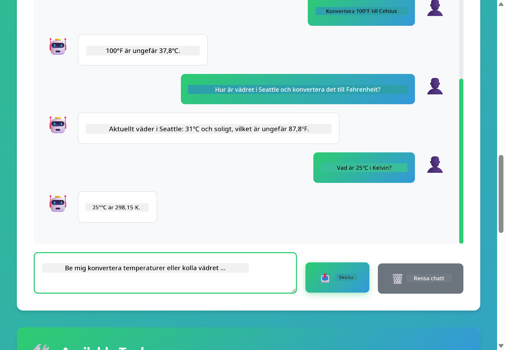

<!--
CO_OP_TRANSLATOR_METADATA:
{
  "original_hash": "aa23f106e7f53270924c9dd39c629004",
  "translation_date": "2025-12-13T18:58:49+00:00",
  "source_file": "04-tools/README.md",
  "language_code": "sv"
}
-->
# Modul 04: AI-agenter med verktyg

## Innehållsförteckning

- [Vad du kommer att lära dig](../../../04-tools)
- [Förkunskaper](../../../04-tools)
- [Förstå AI-agenter med verktyg](../../../04-tools)
- [Hur verktygsanrop fungerar](../../../04-tools)
  - [Verktygsdefinitioner](../../../04-tools)
  - [Beslutsfattande](../../../04-tools)
  - [Utförande](../../../04-tools)
  - [Generering av svar](../../../04-tools)
- [Verktygskedjning](../../../04-tools)
- [Kör applikationen](../../../04-tools)
- [Använda applikationen](../../../04-tools)
  - [Prova enkel verktygsanvändning](../../../04-tools)
  - [Testa verktygskedjning](../../../04-tools)
  - [Se konversationsflödet](../../../04-tools)
  - [Observera resonemanget](../../../04-tools)
  - [Experimentera med olika förfrågningar](../../../04-tools)
- [Nyckelkoncept](../../../04-tools)
  - [ReAct-mönstret (Resonemang och agerande)](../../../04-tools)
  - [Verktygsbeskrivningar är viktiga](../../../04-tools)
  - [Sessionshantering](../../../04-tools)
  - [Felhanteirng](../../../04-tools)
- [Tillgängliga verktyg](../../../04-tools)
- [När man ska använda verktygsbaserade agenter](../../../04-tools)
- [Nästa steg](../../../04-tools)

## Vad du kommer att lära dig

Hittills har du lärt dig hur man för samtal med AI, strukturerar prompts effektivt och förankrar svar i dina dokument. Men det finns fortfarande en grundläggande begränsning: språkmodeller kan bara generera text. De kan inte kolla vädret, utföra beräkningar, fråga databaser eller interagera med externa system.

Verktyg ändrar detta. Genom att ge modellen tillgång till funktioner den kan anropa förvandlar du den från en textgenerator till en agent som kan vidta åtgärder. Modellen bestämmer när den behöver ett verktyg, vilket verktyg som ska användas och vilka parametrar som ska skickas. Din kod utför funktionen och returnerar resultatet. Modellen införlivar det resultatet i sitt svar.

## Förkunskaper

- Genomförd Modul 01 (Azure OpenAI-resurser distribuerade)
- `.env`-fil i rotkatalogen med Azure-uppgifter (skapad av `azd up` i Modul 01)

> **Notera:** Om du inte har genomfört Modul 01, följ först distributionsinstruktionerna där.

## Förstå AI-agenter med verktyg

En AI-agent med verktyg följer ett resonemangs- och agerandemönster (ReAct):

1. Användaren ställer en fråga
2. Agenten resonerar kring vad den behöver veta
3. Agenten bestämmer om den behöver ett verktyg för att svara
4. Om ja, anropar agenten rätt verktyg med rätt parametrar
5. Verktyget utför och returnerar data
6. Agenten införlivar resultatet och ger slutgiltigt svar


*ReAct-mönstret – hur AI-agenter växlar mellan resonemang och agerande för att lösa problem*

Detta sker automatiskt. Du definierar verktygen och deras beskrivningar. Modellen hanterar beslutsfattandet om när och hur de ska användas.

## Hur verktygsanrop fungerar

**Verktygsdefinitioner** - [WeatherTool.java](../../../04-tools/src/main/java/com/example/langchain4j/agents/tools/WeatherTool.java) | [TemperatureTool.java](../../../04-tools/src/main/java/com/example/langchain4j/agents/tools/TemperatureTool.java)

Du definierar funktioner med tydliga beskrivningar och parameter-specifikationer. Modellen ser dessa beskrivningar i sitt systemprompt och förstår vad varje verktyg gör.

```java
@Component
public class WeatherTool {
    
    @Tool("Get the current weather for a location")
    public String getCurrentWeather(@P("Location name") String location) {
        // Din logik för väderuppslagning
        return "Weather in " + location + ": 22°C, cloudy";
    }
}

@AiService
public interface Assistant {
    String chat(@MemoryId String sessionId, @UserMessage String message);
}

// Assistenten är automatiskt kopplad av Spring Boot med:
// - ChatModel bean
// - Alla @Tool-metoder från @Component-klasser
// - ChatMemoryProvider för sessionshantering
```

> **🤖 Prova med [GitHub Copilot](https://github.com/features/copilot) Chat:** Öppna [`WeatherTool.java`](../../../04-tools/src/main/java/com/example/langchain4j/agents/tools/WeatherTool.java) och fråga:
> - "Hur skulle jag integrera en riktig väder-API som OpenWeatherMap istället för mockdata?"
> - "Vad gör en bra verktygsbeskrivning som hjälper AI att använda det korrekt?"
> - "Hur hanterar jag API-fel och begränsningar i verktygsimplementationer?"

**Beslutsfattande**

När en användare frågar "Hur är vädret i Seattle?" känner modellen igen att den behöver väderverktyget. Den genererar ett funktionsanrop med platsparametern satt till "Seattle".

**Utförande** - [AgentService.java](../../../04-tools/src/main/java/com/example/langchain4j/agents/service/AgentService.java)

Spring Boot kopplar automatiskt ihop det deklarativa `@AiService`-gränssnittet med alla registrerade verktyg, och LangChain4j utför verktygsanrop automatiskt.

> **🤖 Prova med [GitHub Copilot](https://github.com/features/copilot) Chat:** Öppna [`AgentService.java`](../../../04-tools/src/main/java/com/example/langchain4j/agents/service/AgentService.java) och fråga:
> - "Hur fungerar ReAct-mönstret och varför är det effektivt för AI-agenter?"
> - "Hur bestämmer agenten vilket verktyg som ska användas och i vilken ordning?"
> - "Vad händer om ett verktygsanrop misslyckas – hur bör jag hantera fel robust?"

**Generering av svar**

Modellen tar emot väderdata och formaterar det till ett naturligt språk-svar till användaren.

### Varför använda deklarativa AI-tjänster?

Denna modul använder LangChain4js Spring Boot-integration med deklarativa `@AiService`-gränssnitt:

- **Spring Boot auto-wiring** – ChatModel och verktyg injiceras automatiskt
- **@MemoryId-mönster** – Automatisk sessionsbaserad minneshantering
- **Enskild instans** – Assistent skapas en gång och återanvänds för bättre prestanda
- **Typsäker exekvering** – Java-metoder anropas direkt med typkonvertering
- **Multi-turn orkestrering** – Hanterar verktygskedjning automatiskt
- **Ingen boilerplate** – Inga manuella AiServices.builder()-anrop eller minnes-HashMap

Alternativa tillvägagångssätt (manuellt `AiServices.builder()`) kräver mer kod och saknar Spring Boot-integrationsfördelar.

## Verktygskedjning

**Verktygskedjning** – AI kan anropa flera verktyg i följd. Fråga "Hur är vädret i Seattle och ska jag ta med ett paraply?" och se hur den kedjar `getCurrentWeather` med resonemang om regnkläder.

<a href="images/tool-chaining.png"></a>

*Sekventiella verktygsanrop – ett verktygs utdata matas in i nästa beslut*

**Felfria misslyckanden** – Fråga efter vädret i en stad som inte finns i mockdata. Verktyget returnerar ett felmeddelande och AI förklarar att den inte kan hjälpa till. Verktyg misslyckas säkert.

Detta sker i en enda konversationsomgång. Agenten orkestrerar flera verktygsanrop autonomt.

## Kör applikationen

**Verifiera distribution:**

Säkerställ att `.env`-filen finns i rotkatalogen med Azure-uppgifter (skapad under Modul 01):
```bash
cat ../.env  # Bör visa AZURE_OPENAI_ENDPOINT, API_KEY, DEPLOYMENT
```

**Starta applikationen:**

> **Notera:** Om du redan startat alla applikationer med `./start-all.sh` från Modul 01 körs denna modul redan på port 8084. Du kan hoppa över startkommandona nedan och gå direkt till http://localhost:8084.

**Alternativ 1: Använd Spring Boot Dashboard (Rekommenderas för VS Code-användare)**

Dev-containern inkluderar Spring Boot Dashboard-tillägget, som ger ett visuellt gränssnitt för att hantera alla Spring Boot-applikationer. Du hittar det i aktivitetsfältet till vänster i VS Code (leta efter Spring Boot-ikonen).

Från Spring Boot Dashboard kan du:
- Se alla tillgängliga Spring Boot-applikationer i arbetsytan
- Starta/stoppa applikationer med ett klick
- Visa applikationsloggar i realtid
- Övervaka applikationsstatus

Klicka bara på play-knappen bredvid "tools" för att starta denna modul, eller starta alla moduler samtidigt.


**Alternativ 2: Använda shell-skript**

Starta alla webbapplikationer (moduler 01-04):

**Bash:**
```bash
cd ..  # Från rotkatalogen
./start-all.sh
```

**PowerShell:**
```powershell
cd ..  # Från rotkatalogen
.\start-all.ps1
```

Eller starta bara denna modul:

**Bash:**
```bash
cd 04-tools
./start.sh
```

**PowerShell:**
```powershell
cd 04-tools
.\start.ps1
```

Båda skripten laddar automatiskt miljövariabler från rotens `.env`-fil och bygger JAR-filerna om de inte finns.

> **Notera:** Om du föredrar att bygga alla moduler manuellt innan start:
>
> **Bash:**
> ```bash
> cd ..  # Go to root directory
> mvn clean package -DskipTests
> ```
>
> **PowerShell:**
> ```powershell
> cd ..  # Go to root directory
> mvn clean package -DskipTests
> ```

Öppna http://localhost:8084 i din webbläsare.

**För att stoppa:**

**Bash:**
```bash
./stop.sh  # Endast denna modul
# Eller
cd .. && ./stop-all.sh  # Alla moduler
```

**PowerShell:**
```powershell
.\stop.ps1  # Endast denna modul
# Eller
cd ..; .\stop-all.ps1  # Alla moduler
```

## Använda applikationen

Applikationen erbjuder ett webbgränssnitt där du kan interagera med en AI-agent som har tillgång till väder- och temperaturkonverteringsverktyg.

<a href="images/tools-homepage.png"></a>

*AI Agent Tools-gränssnittet – snabba exempel och chattgränssnitt för interaktion med verktyg*

**Prova enkel verktygsanvändning**

Börja med en enkel förfrågan: "Konvertera 100 grader Fahrenheit till Celsius". Agenten känner igen att den behöver temperaturkonverteringsverktyget, anropar det med rätt parametrar och returnerar resultatet. Lägg märke till hur naturligt detta känns – du specificerade inte vilket verktyg som skulle användas eller hur det skulle anropas.

**Testa verktygskedjning**

Prova nu något mer komplext: "Hur är vädret i Seattle och konvertera det till Fahrenheit?" Se hur agenten arbetar steg för steg. Den hämtar först vädret (som returnerar Celsius), inser att den behöver konvertera till Fahrenheit, anropar konverteringsverktyget och kombinerar båda resultaten i ett svar.

**Se konversationsflödet**

Chattgränssnittet sparar konversationshistorik, vilket låter dig ha flerstegsinteraktioner. Du kan se alla tidigare frågor och svar, vilket gör det enkelt att följa konversationen och förstå hur agenten bygger kontext över flera utbyten.

<a href="images/tools-conversation-demo.png"></a>

*Flerstegs-konversation som visar enkla konverteringar, väderuppslag och verktygskedjning*

**Experimentera med olika förfrågningar**

Prova olika kombinationer:
- Väderuppslag: "Hur är vädret i Tokyo?"
- Temperaturkonverteringar: "Vad är 25°C i Kelvin?"
- Kombinerade frågor: "Kolla vädret i Paris och säg om det är över 20°C"

Lägg märke till hur agenten tolkar naturligt språk och mappar det till lämpliga verktygsanrop.

## Nyckelkoncept

**ReAct-mönstret (Resonemang och agerande)**

Agenten växlar mellan att resonera (bestämma vad som ska göras) och agera (använda verktyg). Detta mönster möjliggör autonom problemlösning istället för att bara svara på instruktioner.

**Verktygsbeskrivningar är viktiga**

Kvaliteten på dina verktygsbeskrivningar påverkar direkt hur väl agenten använder dem. Klara, specifika beskrivningar hjälper modellen att förstå när och hur varje verktyg ska anropas.

**Sessionshantering**

`@MemoryId`-annoteringen möjliggör automatisk sessionsbaserad minneshantering. Varje session-ID får sin egen `ChatMemory`-instans som hanteras av `ChatMemoryProvider`-bean, vilket eliminerar behovet av manuell minneshantering.

**Felhanteirng**

Verktyg kan misslyckas – API:er kan timeouta, parametrar kan vara ogiltiga, externa tjänster kan gå ner. Produktionsagenter behöver felhantering så att modellen kan förklara problem eller försöka alternativ.

## Tillgängliga verktyg

**Väderverktyg** (mockdata för demonstration):
- Hämta aktuellt väder för en plats
- Hämta flerdagarsprognos

**Temperaturkonverteringsverktyg**:
- Celsius till Fahrenheit
- Fahrenheit till Celsius
- Celsius till Kelvin
- Kelvin till Celsius
- Fahrenheit till Kelvin
- Kelvin till Fahrenheit

Detta är enkla exempel, men mönstret kan utvidgas till vilken funktion som helst: databasfrågor, API-anrop, beräkningar, filoperationer eller systemkommandon.

## När man ska använda verktygsbaserade agenter

**Använd verktyg när:**
- Svar kräver realtidsdata (väder, aktiekurser, lagerstatus)
- Du behöver utföra beräkningar utöver enkel matematik
- Åtkomst till databaser eller API:er
- Vidta åtgärder (skicka e-post, skapa ärenden, uppdatera poster)
- Kombinera flera datakällor

**Använd inte verktyg när:**
- Frågor kan besvaras med allmän kunskap
- Svaret är rent konversationellt
- Verktygslatens skulle göra upplevelsen för långsam

## Nästa steg

**Nästa modul:** [05-mcp - Model Context Protocol (MCP)](../05-mcp/README.md)

---

**Navigering:** [← Föregående: Modul 03 - RAG](../03-rag/README.md) | [Tillbaka till huvudmenyn](../README.md) | [Nästa: Modul 05 - MCP →](../05-mcp/README.md)

---

<!-- CO-OP TRANSLATOR DISCLAIMER START -->
**Ansvarsfriskrivning**:
Detta dokument har översatts med hjälp av AI-översättningstjänsten [Co-op Translator](https://github.com/Azure/co-op-translator). Även om vi strävar efter noggrannhet, vänligen var medveten om att automatiska översättningar kan innehålla fel eller brister. Det ursprungliga dokumentet på dess modersmål bör betraktas som den auktoritativa källan. För kritisk information rekommenderas professionell mänsklig översättning. Vi ansvarar inte för några missförstånd eller feltolkningar som uppstår till följd av användningen av denna översättning.
<!-- CO-OP TRANSLATOR DISCLAIMER END -->