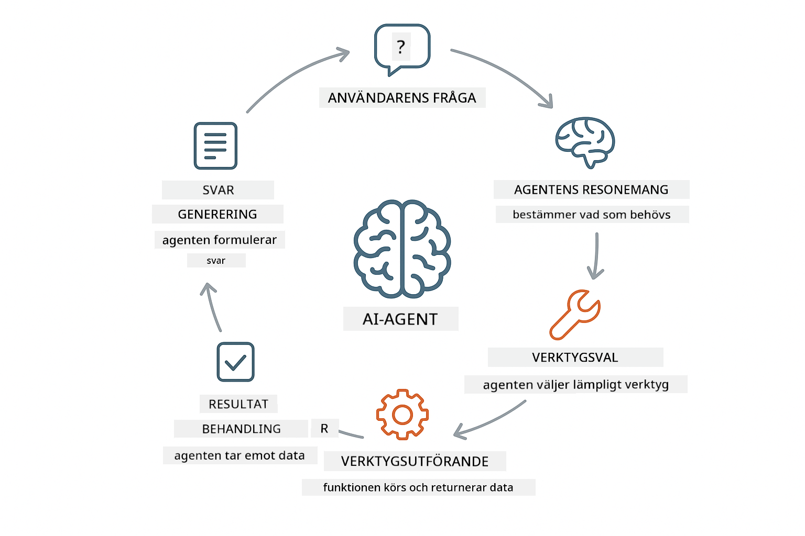
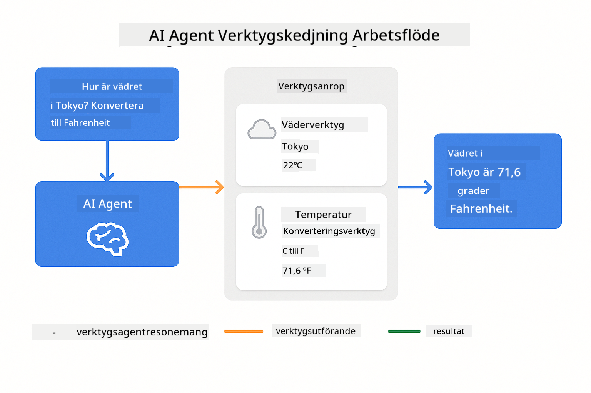
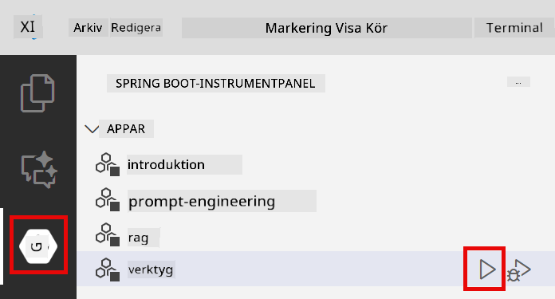
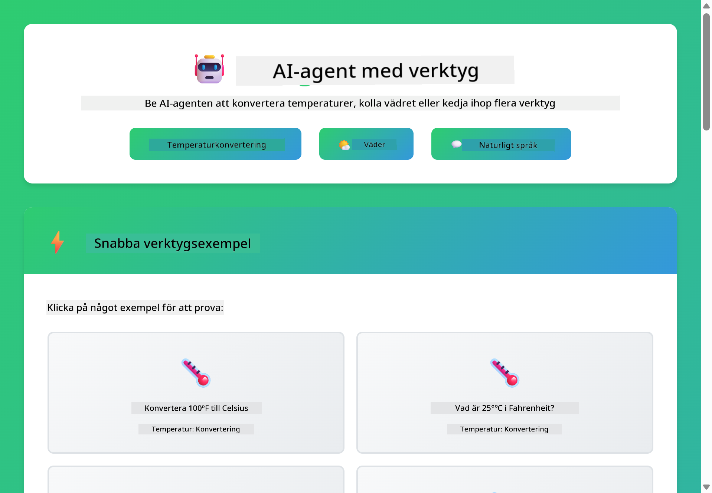

<!--
CO_OP_TRANSLATOR_METADATA:
{
  "original_hash": "13ec450c12cdd1a863baa2b778f27cd7",
  "translation_date": "2025-12-31T01:18:27+00:00",
  "source_file": "04-tools/README.md",
  "language_code": "sv"
}
-->
# Modul 04: AI-agenter med verktyg

## Innehållsförteckning

- [Vad du kommer att lära dig](../../../04-tools)
- [Förkunskaper](../../../04-tools)
- [Förstå AI-agenter med verktyg](../../../04-tools)
- [Hur verktygsanrop fungerar](../../../04-tools)
  - [Verktygsdefinitioner](../../../04-tools)
  - [Beslutsfattande](../../../04-tools)
  - [Körning](../../../04-tools)
  - [Generering av svar](../../../04-tools)
- [Kedjning av verktyg](../../../04-tools)
- [Kör applikationen](../../../04-tools)
- [Använd applikationen](../../../04-tools)
  - [Prova enkel verktygsanvändning](../../../04-tools)
  - [Testa verktygskedjning](../../../04-tools)
  - [Se konversationsflödet](../../../04-tools)
  - [Observera resonemanget](../../../04-tools)
  - [Experimentera med olika förfrågningar](../../../04-tools)
- [Nyckelbegrepp](../../../04-tools)
  - [ReAct-mönstret (Resonera och Agera)](../../../04-tools)
  - [Verktygsbeskrivningar spelar roll](../../../04-tools)
  - [Sessionshantering](../../../04-tools)
  - [Felhanteing](../../../04-tools)
- [Tillgängliga verktyg](../../../04-tools)
- [När ska man använda verktygsbaserade agenter](../../../04-tools)
- [Nästa steg](../../../04-tools)

## Vad du kommer att lära dig

Hittills har du lärt dig hur man har konversationer med AI, strukturerar prompts effektivt och förankrar svar i dina dokument. Men det finns fortfarande en grundläggande begränsning: språkmodeller kan bara generera text. De kan inte kolla vädret, utföra beräkningar, fråga databaser eller interagera med externa system.

Verktyg förändrar detta. Genom att ge modellen åtkomst till funktioner den kan anropa förvandlar du den från en textgenerator till en agent som kan vidta åtgärder. Modellen bestämmer när den behöver ett verktyg, vilket verktyg som ska användas och vilka parametrar som ska skickas. Din kod kör funktionen och returnerar resultatet. Modellen inkorporerar det resultatet i sitt svar.

## Förkunskaper

- Avslutad Modul 01 (Azure OpenAI-resurser distribuerade)
- `.env`-fil i rotkatalogen med Azure-uppgifter (skapad av `azd up` i Modul 01)

> **Notera:** Om du inte har slutfört Modul 01, följ distributionsinstruktionerna där först.

## Förstå AI-agenter med verktyg

> **📝 Notera:** Begreppet "agenter" i denna modul avser AI-assistenter förbättrade med möjlighet att anropa verktyg. Detta skiljer sig från **Agentic AI**-mönstren (autonoma agenter med planering, minne och flerstegsresonemang) som vi kommer att täcka i [Module 05: MCP](../05-mcp/README.md).

En AI-agent med verktyg följer ett resonemangs- och agerandemönster (ReAct):

1. Användaren ställer en fråga
2. Agenten resonerar kring vad den behöver veta
3. Agenten bestämmer om den behöver ett verktyg för att svara
4. Om ja, anropar agenten lämpligt verktyg med rätt parametrar
5. Verktyget körs och returnerar data
6. Agenten inkorporerar resultatet och ger det slutliga svaret



*ReAct-mönstret - hur AI-agenter växlar mellan resonemang och handling för att lösa problem*

Detta sker automatiskt. Du definierar verktygen och deras beskrivningar. Modellen tar hand om beslutsfattandet om när och hur de ska användas.

## Hur verktygsanrop fungerar

**Verktygsdefinitioner** - [WeatherTool.java](../../../04-tools/src/main/java/com/example/langchain4j/agents/tools/WeatherTool.java) | [TemperatureTool.java](../../../04-tools/src/main/java/com/example/langchain4j/agents/tools/TemperatureTool.java)

Du definierar funktioner med tydliga beskrivningar och parameter-specifikationer. Modellen ser dessa beskrivningar i sitt systemprompt och förstår vad varje verktyg gör.

```java
@Component
public class WeatherTool {
    
    @Tool("Get the current weather for a location")
    public String getCurrentWeather(@P("Location name") String location) {
        // Din logik för att hämta väder
        return "Weather in " + location + ": 22°C, cloudy";
    }
}

@AiService
public interface Assistant {
    String chat(@MemoryId String sessionId, @UserMessage String message);
}

// Assistenten konfigureras automatiskt av Spring Boot med:
// - ChatModel-bean
// - Alla @Tool-metoder från @Component-klasser
// - ChatMemoryProvider för sessionshantering
```

> **🤖 Prova med [GitHub Copilot](https://github.com/features/copilot) Chat:** Öppna [`WeatherTool.java`](../../../04-tools/src/main/java/com/example/langchain4j/agents/tools/WeatherTool.java) och fråga:
> - "Hur skulle jag integrera en riktig väder-API som OpenWeatherMap istället för mock-data?"
> - "Vad gör en bra verktygsbeskrivning som hjälper AI att använda det korrekt?"
> - "Hur hanterar jag API-fel och rate limits i verktygsimplementationer?"

**Beslutsfattande**

När en användare frågar "What's the weather in Seattle?", känner modellen igen att den behöver väderverktyget. Den genererar ett funktionsanrop med platsparametern satt till "Seattle".

**Körning** - [AgentService.java](../../../04-tools/src/main/java/com/example/langchain4j/agents/service/AgentService.java)

Spring Boot autowirar det deklarativa `@AiService`-gränssnittet med alla registrerade verktyg, och LangChain4j kör verktygsanrop automatiskt.

> **🤖 Prova med [GitHub Copilot](https://github.com/features/copilot) Chat:** Öppna [`AgentService.java`](../../../04-tools/src/main/java/com/example/langchain4j/agents/service/AgentService.java) och fråga:
> - "Hur fungerar ReAct-mönstret och varför är det effektivt för AI-agenter?"
> - "Hur bestämmer agenten vilket verktyg som ska användas och i vilken ordning?"
> - "Vad händer om ett verktygsanrop misslyckas - hur bör jag hantera fel robust?"

**Generering av svar**

Modellen tar emot väderdata och formaterar det till ett naturligt språk-svar för användaren.

### Varför använda deklarativa AI-tjänster?

Denna modul använder LangChain4j:s Spring Boot-integration med deklarativa `@AiService`-gränssnitt:

- **Spring Boot autowiring** - ChatModel och verktyg injiceras automatiskt
- **@MemoryId-mönstret** - Automatisk sessionsbaserad minneshantering
- **Enstaka instans** - Assistent skapas en gång och återanvänds för bättre prestanda
- **Typsäker körning** - Java-metoder anropas direkt med typkonvertering
- **Multiturn-orchestrering** - Hanterar automatisk verktygskedjning
- **Ingen boilerplate** - Inga manuella AiServices.builder()-anrop eller minnes-HashMap

Alternativa tillvägagångssätt (manuell `AiServices.builder()`) kräver mer kod och går miste om Spring Boot-integrationsfördelarna.

## Kedjning av verktyg

**Kedjning av verktyg** - AI:n kan anropa flera verktyg i följd. Fråga "What's the weather in Seattle and should I bring an umbrella?" och se hur den kedjar `getCurrentWeather` med resonemang om regnkläder.

<a href="images/tool-chaining.png"></a>

*Sekventiella verktygsanrop - en verktygs output matas in i nästa beslut*

**Förenade fel** - Be om väder i en stad som inte finns i mock-datan. Verktyget returnerar ett felmeddelande och AI:n förklarar att det inte kan hjälpa. Verktyg misslyckas säkert.

Detta sker i en enda konversationsomgång. Agenten orkestrerar flera verktygsanrop autonomt.

## Kör applikationen

**Verifiera distribution:**

Se till att `.env`-filen finns i rotkatalogen med Azure-uppgifter (skapad under Modul 01):
```bash
cat ../.env  # Bör visa AZURE_OPENAI_ENDPOINT, API_KEY, DEPLOYMENT
```

**Starta applikationen:**

> **Notera:** Om du redan startat alla applikationer med `./start-all.sh` från Modul 01, kör denna modul redan på port 8084. Du kan hoppa över startkommandona nedan och gå direkt till http://localhost:8084.

**Alternativ 1: Använd Spring Boot Dashboard (Rekommenderas för VS Code-användare)**

Dev-containern inkluderar Spring Boot Dashboard-tillägget, som ger ett visuellt gränssnitt för att hantera alla Spring Boot-applikationer. Du hittar det i Activity Bar på vänstra sidan av VS Code (titta efter Spring Boot-ikonen).

Från Spring Boot Dashboard kan du:
- Se alla tillgängliga Spring Boot-appar i arbetsytan
- Starta/stoppa applikationer med ett klick
- Visa applikationsloggar i realtid
- Övervaka applikationens status

Klicka helt enkelt på play-knappen bredvid "tools" för att starta denna modul, eller starta alla moduler samtidigt.



**Alternativ 2: Använd shell-skript**

Starta alla webbapplikationer (moduler 01-04):

**Bash:**
```bash
cd ..  # Från rotkatalogen
./start-all.sh
```

**PowerShell:**
```powershell
cd ..  # Från rotkatalogen
.\start-all.ps1
```

Eller starta bara denna modul:

**Bash:**
```bash
cd 04-tools
./start.sh
```

**PowerShell:**
```powershell
cd 04-tools
.\start.ps1
```

Båda skripten laddar automatiskt miljövariabler från rotens `.env`-fil och bygger JAR-filerna om de inte finns.

> **Notera:** Om du föredrar att bygga alla moduler manuellt innan start:
>
> **Bash:**
> ```bash
> cd ..  # Go to root directory
> mvn clean package -DskipTests
> ```
>
> **PowerShell:**
> ```powershell
> cd ..  # Go to root directory
> mvn clean package -DskipTests
> ```

Öppna http://localhost:8084 i din webbläsare.

**För att stoppa:**

**Bash:**
```bash
./stop.sh  # Endast denna modul
# Eller
cd .. && ./stop-all.sh  # Alla moduler
```

**PowerShell:**
```powershell
.\stop.ps1  # Endast denna modul
# Eller
cd ..; .\stop-all.ps1  # Alla moduler
```

## Använd applikationen

Applikationen erbjuder ett webbgränssnitt där du kan interagera med en AI-agent som har åtkomst till väder- och temperaturkonverteringsverktyg.

<a href="images/tools-homepage.png"></a>

*AI Agent Tools-gränssnittet - snabba exempel och chattgränssnitt för att interagera med verktyg*

**Prova enkel verktygsanvändning**

Börja med en enkel förfrågan: "Convert 100 degrees Fahrenheit to Celsius". Agenten känner igen att den behöver temperaturkonverteringsverktyget, anropar det med rätt parametrar och returnerar resultatet. Märk hur naturligt detta känns - du specificerade inte vilket verktyg som skulle användas eller hur det skulle anropas.

**Testa verktygskedjning**

Prova nu något mer komplext: "What's the weather in Seattle and convert it to Fahrenheit?" Se hur agenten arbetar steg för steg. Den hämtar först vädret (som returneras i Celsius), identifierar att den behöver konvertera till Fahrenheit, anropar konverteringsverktyget och kombinerar båda resultaten till ett svar.

**Se konversationsflödet**

Chattgränssnittet sparar konversationshistoriken, vilket gör att du kan ha flergångsinteraktioner. Du kan se alla tidigare frågor och svar, vilket gör det enkelt att följa konversationen och förstå hur agenten bygger kontext över flera utbyten.

<a href="images/tools-conversation-demo.png"></a>

*Fleromgångskonversation som visar enkla konverteringar, väderuppslag och verktygskedjning*

**Experimentera med olika förfrågningar**

Prova olika kombinationer:
- Väderuppslag: "What's the weather in Tokyo?"
- Temperaturkonverteringar: "What is 25°C in Kelvin?"
- Kombinerade frågor: "Check the weather in Paris and tell me if it's above 20°C"

Märk hur agenten tolkar naturligt språk och mappar det till lämpliga verktygsanrop.

## Nyckelbegrepp

**ReAct-mönstret (Resonera och Agera)**

Agenten växlar mellan att resonera (bestämma vad som ska göras) och att agera (använda verktyg). Detta mönster möjliggör autonom problemlösning istället för enbart att svara på instruktioner.

**Verktygsbeskrivningar spelar roll**

Kvaliteten på dina verktygsbeskrivningar påverkar direkt hur väl agenten använder dem. Klara, specifika beskrivningar hjälper modellen att förstå när och hur varje verktyg ska anropas.

**Sessionshantering**

`@MemoryId`-annoteringen möjliggör automatisk sessionsbaserad minneshantering. Varje session-id får sin egen `ChatMemory`-instans som hanteras av `ChatMemoryProvider`-beanen, vilket eliminerar behovet av manuell minnesspårning.

**Felhanteing**

Verktyg kan misslyckas - API:er timeout, parametrar kan vara ogiltiga, externa tjänster kan ligga nere. Produktionsagenter behöver felhantering så att modellen kan förklara problem eller försöka alternativ.

## Tillgängliga verktyg

**Väderverktyg** (mock-data för demonstration):
- Hämta aktuellt väder för en plats
- Hämta prognos för flera dagar

**Temperaturkonverteringsverktyg**:
- Celsius till Fahrenheit
- Fahrenheit till Celsius
- Celsius till Kelvin
- Kelvin till Celsius
- Fahrenheit till Kelvin
- Kelvin till Fahrenheit

Detta är enkla exempel, men mönstret kan utvidgas till vilken funktion som helst: databasfrågor, API-anrop, beräkningar, filoperationer eller systemkommandon.

## När ska man använda verktygsbaserade agenter

**Använd verktyg när:**
- Svar kräver realtidsdata (väder, aktiepriser, lager)
- Du behöver utföra beräkningar bortom enkel matematik
- Åtkomst till databaser eller API:er krävs
- Vidta åtgärder (skicka e-post, skapa ärenden, uppdatera poster)
- Kombinera flera datakällor

**Använd inte verktyg när:**
- Frågor kan besvaras från allmän kunskap
- Svaret är rent konversationellt
- Verktygslatens skulle göra upplevelsen för långsam

## Nästa steg

**Nästa modul:** [05-mcp - Model Context Protocol (MCP)](../05-mcp/README.md)

---

**Navigering:** [← Föregående: Modul 03 - RAG](../03-rag/README.md) | [Tillbaka till huvudmenyn](../README.md) | [Nästa: Modul 05 - MCP →](../05-mcp/README.md)

---

<!-- CO-OP TRANSLATOR DISCLAIMER START -->
Friskrivning:
Detta dokument har översatts med hjälp av AI-översättningstjänsten [Co-op Translator](https://github.com/Azure/co-op-translator). Även om vi eftersträvar noggrannhet, vänligen observera att automatiska översättningar kan innehålla fel eller felaktigheter. Det ursprungliga dokumentet på dess ursprungsspråk bör betraktas som den auktoritativa källan. För kritisk information rekommenderas professionell mänsklig översättning. Vi ansvarar inte för eventuella missförstånd eller feltolkningar som uppstår till följd av användningen av denna översättning.
<!-- CO-OP TRANSLATOR DISCLAIMER END -->